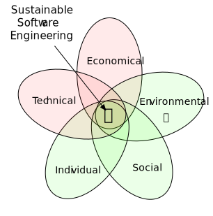

# Sustainable Software Engineering 🌱
CS4415 | Edition of 2021/22

[Delft University of Technology] || [MSc in Computer Science – Software Technology]

**Sustainable Software Engineering** is an overarching discipline that addresses the long-term consequences of designing, building, and releasing a software project.
By definition, sustainability covers five main perspectives: **environmental**, **social**, **individual**, economic, technical.
This course focuses on the first three.

{: style="display:block; margin-left:auto; margin-right:auto" width="230px" }

Software Engineering (SE) has long addressed sustainability by **narrowing it down to economic and technical sustainability**.
However, our society is facing major sustainability challenges that can no longer be overlooked by software engineers and computer scientists.
It was estimated that, **by 2040, the ICT sector will contribute to 14% of the global carbon footprint**. Hence, environmental, social, and individual ought to be part of the equation when it comes to design, build, and release software systems.
The problem is far from simple, but **we need expert computer scientists** to bring sustainability into the core values of the next generation of tech-leading organisations.

This course will cover a set of competencies needed to leverage sustainable software systems.
It will have a **strong component on Green SE**, covering techniques to measure and improve the energy-efficiency at any stage of the software lifecycle.
Students will learn about **state-of-the-art practices on energy efficiency** and apply them in real software projects. Moreover, the course will cover core principles of **empirical software engineering**, and **social and individual sustainability**.

## Organisation

**Course code**       | [CS4415]
**Brightspace 🔒**    | <https://brightspace.tudelft.nl/d2l/home/399685>
**Instructors**       | [Luís Cruz], [Arie van Deursen]
**Schedule**          |	Tuesdays 10:45, Thursdays 8:45, Fridays 10:45. 🔗 [MyTimetable].
**Mattermost**        | 🔗 [Sign-up link](https://mattermost.tudelft.nl/signup_user_complete/?id=amhohw9r9tbiue879nhz7wxr9w)
**ECTS** 	            | 5.0
**Quarter**           | Q3
**Format**            | Classes are optimised for in-person attendance; Online attendance is allowed in most classes.
**Examination type**  | Project 1 - Essay (30%); Project 2 - Software Repository and Essay (60%); Presentations (15%).
**Target audience**   |	Students of the [M.Sc. in Computer Science].
**Requirements** 	    | - Intermediate understanding of OOP languages;  - Basic understanding of data analysis techniques.

## Learning Objectives

By the end of this course you will be able to:

- LO1. Measure software energy consumption.
- LO2. Automate carbon-awareness in software development.
- LO3. Discuss sustainability principles.
- LO4. Solve sustainability issues in real software projects.
- LO5. Propose innovative strategies to monitor software sustainability.

## Outline

**Please note:** The program below is tentative and subject to change.
All classes will be recorded and shared privately with the students.

 Class | Week| Summary
-------| ----|----------|
 1     | 1   | **Lecture.** Course introduction. Sustainable Software: What, Why and How. [📊Slides][slides01] [🎥Recording][recording01] 
 2     | 1   | **Lecture.** Social and Individual Sustainability in SE.  [📊Slides][slides02]
 3     | 1   | **Paper Reading.** Read and summarise research literature on Social and Individual SE Sustainability. 
 4     | 2   | **Presentation.** Present a summary of a research paper. 
 5     | 2   | **Lab.** Measuring software energy consumption. Introduction to [Project 1](#project1). [📊Slides][slides05] [🎥Recording][recording05] 
 6     | 2   | **Lecture.** Green Software Engineering — Part I: units of energy. [📊Slides][slides06] [🎥Recording][recording06] 
 7     | 3   | **Project.** Project 1 - steering meeting and formative assessment. 
 8     | 3   | **Lecture.** Green Software Engineering — Part II: Scientific guide for reliable energy measurements. [📊Slides][slides08] [🎥Recording part2][recording08] 
 9     | 3   | **Lecture.** Green Software Engineering — Part III: Energy efficiency in mobile computing; carbon-aware data centres. [📊Slides][slides09] [🎥Recording][recording09] 
 10    | 4   | **Project.** Project 1 - steering meeting. 
 11    | 4   | **Lecture.** Green AI. 
 12    | 4   | **Guest Lecture.** *Saving energy in software development by making the right choices*. [Stefanos Georgiou]. 
 13    | 5   | **Lecture.** Empirical Software Engineering. <!-- Qualitative vs Quantitative methods. Types of studies -->.
 14    | 5   | **Guest Lecture.**  *The effect of design patterns on energy consumption*. [Daniel Feitosa].  
 15    | 5   | **Project.** Project 2 - Description and kick-off. 
 16    | 6   | **Project.** Presentation and discussion of proposals. 
 18    | 6   | **Steering Meeting.** First draft of ToC. 
 19    | 7   | **Steering Meeting.** 
 20    | 8   | **Steering Meeting.** Formative assessment. 
 22    | 9   | **Presentation and Demos** 
 
## Assignments

Below the description of each projects and respective formative[^formative] and summative[^summative] assessments.

### 📚 Literature Review

- Groups of 2 or 3
- Select 1 academic paper that talks about social or individual sustainability in the context of software engineering.
  - Google Scholar, DBLP
- Double check with the lecturer whether your selected paper is good enough (use mattermost).
- Write a short summary about it (min 200 words; max 500).
- Prepare a presentation for next Tuesday (Feb 15).
- 7 min + 3 min Q&A.
- Presentation is 7.5% of the grade. (But you can recover in the presentation of project 2)
- Submission by pull request to the website. Instructions [here](https://luiscruz.github.io/course_sustainableSE/2022/literature_review.html).
- **Deadline** Tuesday, Feb 15.

### 🛠 **Project 1** Measuring Software Energy Consumption **⭐️(new)**
{: #project1}

- Goal: Compare energy consumption in common software use cases.
  - Examples:
    - Different versions of the same app;
      - Same use case but different apps
      - Same version, same app, but different user settings (e.g., enable/disable GPU optimisation)
      - Same version, same app, but different running environment
- Blog-style report (markdown, approx 2500 words).
  - Bonus if you can automate the experiment and there is a replication package.
- Submission by pull request to the website (instructions will follow soon).
- **Weight in final grade**: 30%
- **Steering meeting/formative assessment**: Tuesday, Feb 22
- **Deadline** Thursday, Mar 3 ⚠️ **new**

<!--### 🛠 Project 2 – Research Project

**Formative assessment:** Short meeting with the teacher to present preliminary results. You will receive written feedback to incorporate into a final report.

**Summative assessment:** Write a short paper about the work and . Give a 15-min live talk to the class. -->

 

## Further reading (optional)

- Wohlin, C., Runeson, P., Höst, M., Ohlsson, M. C., Regnell, B., & Wesslén, A. (2012). Experimentation in software engineering. Springer Science & Business Media.
- Cruz, L., & Abreu, R. (2017, May). Performance-based guidelines for energy efficient mobile applications. In 2017 IEEE/ACM 4th International Conference on Mobile Software Engineering and Systems (MOBILESoft) (pp. 46-57). IEEE.
- Cruz, L., & Abreu, R. (2019). [Catalog of energy patterns for mobile applications](https://arxiv.org/abs/1901.03302). Empirical Software Engineering, 24(4), 2209-2235.
- Stol, K. J., & Fitzgerald, B. (2018). The ABC of software engineering research. ACM Transactions on Software Engineering and Methodology (TOSEM), 27(3), 1-51.
- Spinellis, Diomidis (2017). [The Social Responsibility of Software Development](https://ieeexplore.ieee.org/document/7888390). IEEE Software.

## Interesting pointers

- [Principles of Sustainable Software Engineering](https://principles.green)
- [CAT community](https://ClimateAction.tech)
- [Energy Patterns for Mobile Apps](https://tqrg.github.io/energy-patterns/).
- [Branch Magazine](https://branch.climateaction.tech).
- [Green Software Lab](https://greenlab.di.uminho.pt)
- [Website Carbon Calculator](https://www.websitecarbon.com)
- [Carbon Tracker](https://github.com/lfwa/carbontracker)
- [Greenpeace — Europe's Green Recovery As if the planet mattered](https://www.greenpeace.de/sites/www.greenpeace.de/files/publications/20201022_greenrecovery_f_es.pdf)
- [Green TU](https://www.tudelft.nl/sustainability/get-involved/greentu/)

[Delft University of Technology]: https://www.tudelft.nl
[Luís Cruz]: https://luiscruz.github.io
[CS4415]: https://www.studiegids.tudelft.nl/a101_displayCourse.do?course_id=60099
[Stefanos Georgiou]: https://twitter.com/stefanosgeorgi1/
[Daniel Feitosa]: https://feitosa-daniel.github.io

[^formative]: Formative assessments are not graded. They are typically informal and focused on providing feedback that can help students improve their work.
[^summative]: Summative assessments are graded and focused on the final outcome of the project.

[Building 62, Hall G]: https://esviewer.tudelft.nl/space/72/
[Building 35, Room 4]: https://esviewer.tudelft.nl/space/46/

[MyTimetable]: https://mytimetable.tudelft.nl/link?timetable.id=2021!module!01CD7133098AD9A864150E64E74F6D7F

[slides01]: https://surfdrive.surf.nl/files/index.php/s/qi41wkOd2mAsYPN
[slides02]: https://surfdrive.surf.nl/files/index.php/s/cpUC4sIOFmgoHYB
[slides05]: https://surfdrive.surf.nl/files/index.php/s/Jrc27nmuyNoSW4w
[slides06]: https://surfdrive.surf.nl/files/index.php/s/p2jqcN2tBpDBWKD
[slides08]: https://surfdrive.surf.nl/files/index.php/s/WAwaYYSsn04Pxdi
[slides09]: https://surfdrive.surf.nl/files/index.php/s/unF9vN0wX0EXfqz

[recording01]: https://surfdrive.surf.nl/files/index.php/s/xGvQkfhi6hpZMnb
[recording05]: https://surfdrive.surf.nl/files/index.php/s/T0Fm119XCJLZT3C
[recording06]: https://surfdrive.surf.nl/files/index.php/s/SbengCYvu8O88eF
[recording08]: https://surfdrive.surf.nl/files/index.php/s/xOPBn8Ajc6UVxiR
[recording09]: https://surfdrive.surf.nl/files/index.php/s/k4iZCsc532Bpx9y
