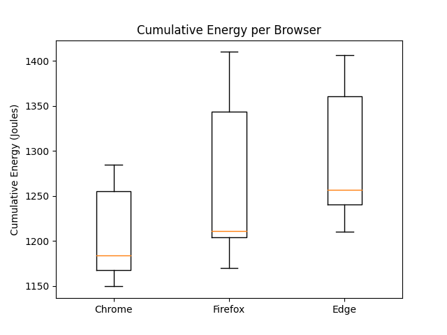
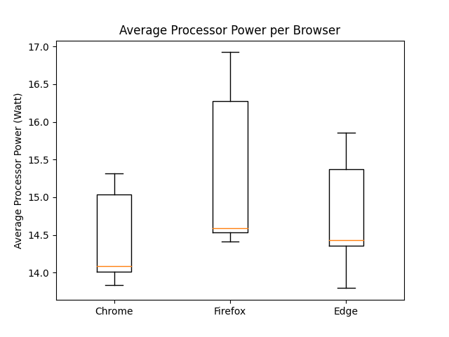

# Measuring Browser Efficiency on Windows in a Realistic Use Case

Web browsers have become the most important app on most users' computers. As web technologies have become more powerful, companies have moved from having different apps per computing platform to providing a web app that runs on any platform with a web browser. Examples of these web-based apps are Gmail, Slack and Microsoft Teams. 

At the same time, computing has moved from desktop computers to laptops to mobile devices. Users want their devices to be portable and light, but also to provide good battery life and to stay cool without a noisy fan. To make matters even worse, users expect the web apps they use to provide ever-increasing functionality, such as advanced graphics, video calling, and high-quality audio. The combination of these user expectations has led browser vendors such as [Google][^1
], [Microsoft][^2], and Mozilla [(A)] [(B)] to focus increasingly on the energy efficiency of their browsers.

Previous [reporting][^5] has suggested there are noticeable differences among the battery life achieved while using popular Windows web browsers. However, both the hardware (the chips) and software (both the OS and the browser) are constantly changing so previously reported results may not be indicative of the current state of the art. Therefore we wanted to look into the power consumption of the latest versions of web browsers. Another issue in previous analyses is that they cherry-pick which websites to use for the measurement. We think it’s more representative of actual usage to base the selection of websites on statistics of which websites are visited the most and the longest. We’ll explain how we selected the websites in the next section. After website selection, we set up a basic web browsing usage scenario visiting these websites, which we automated using [Selenium](https://selenium-python.readthedocs.io) and measured using [Intel Power Log](https://www.intel.com/content/www/us/en/developer/articles/tool/power-gadget.html). 

## Measurement set-up
To test the power consumption of different web browsers, we first had to come up with a realistic scenario for which conditions to test the web browsers with. It’s not easy to find good authoritative info on which websites are most used and therefore representative of realistic web browsing. Ideally, we would know which websites users *spend their time on*. However, this is tricky and often does not seem very reliable: as far as we can tell, tools like [Zyro](https://zyro.com/nl/websites-time) extrapolate from non-public measurements and estimates, so we have no way to verify their numbers. A more reliable source is [Alexa](https://www.alexa.com/topsites): it uses a web extension which, according to them, [“millions of internet users”](https://www.alexa.com/about) use to allow a commercial party to spy on their browsing habits. The requirement of installing this software probably selects for a particular type of web user, but it seems to be the best we’ve got as far as tracking time goes. 

The obvious alternative is to select sites based on the number of visits they get. This is imperfect: if a user spends 99% of their daily time on Netflix and 1% on Brightspace, we will only know that they have visited two websites, and we will weigh them equally. The big advantage of this selection criterion is that we have more reliable data. Cloudflare, a major [CDN](https://www.cloudflare.com/en-gb/learning/cdn/what-is-a-cdn/) and [DNS](https://www.cloudflare.com/en-gb/dns/) provider, publishes [statistics](https://radar.cloudflare.com) on which websites it saw most visits to. Since Cloudflare is a major player in moving web traffic, they have a much better and more representative view of which websites are visited often, but sadly we cannot deduce the duration of these visits. 

We decided to put Alexa’s list and Cloudflare’s list together and select the websites which appear on both lists. We then had to remove some websites which blocked automation. When we made the selection on February 22, 2022, we came to the following websites:

* amazon.com
* soundcloud.com
* wikipedia.org
* youtube.com

### Testing process

We set up an automated testing suite to visit and interact with these websites repeatedly using three different browsers: Mozilla Firefox, Google Chrome and Microsoft Edge. We visit this set of websites with every browser, running the tests three times per browser before waiting 30 seconds, switching to a different browser and running the tests three times again. The waiting time is given to enable the laptop to cool down a bit before starting the next test. Because the tasks performed in the browser are not very taxing, we assumed that 30 seconds would be enough. We kept the order of the browser and websites fixed. A typical execution will therefore look like this:

* Using Chrome: (Amazon, SoundCloud, Wikipedia, YouTube). Repeat 3x.
* Wait 30 seconds.
* Using Firefox: (Amazon, SoundCloud, Wikipedia, YouTube). Repeat 3x.
* Wait 30 seconds.
* Using Edge: (Amazon, SoundCloud, Wikipedia, YouTube). Repeat 3x.
* Wait 30 seconds.

In total this procedure was repeated 10 times, producing 30 measurements per browser.

To get the computer to a stable operating temperature before starting the tests, we do a warm-up run in which we visit all the websites once per browser.

### Hardware set-up

We tested on a 2018 HP ZBook G5 laptop with an Intel Core i7 8750H CPU, 16GB of RAM and a 500GB SSD running Windows 10 using the latest versions of the browsers at the time of the experiments, namely Chrome 98.0.4758.102, Firefox 97.0.1 and Edge 98.0.1108.62. 

We used the following set-up for the experiment:

* Closed everything except these three browsers under test
* Connected to external power
* Connected to wireless network
* External peripherals are unplugged (e.g. mouse, keyboard, monitor)
* Sound is muted
* Night light is on
* Location is off
* Adaptive screen brightness off, brightness set to lowest
* Bluetooth is disabled
* Notifications are turned off
* Environmental temperature set to constant temperature

## Results
The tables below show the results for the conducted experiments, as described in the previous section. A browsing session experiment consisted of opening the browser, visiting 4 websites and closing the browser, followed by reporting the measurements. The duration of each browsing session is around 85 seconds. For each browser, we ran 30 sessions and analysed the reported measurements: cumulative energy (in Joules) and average processor power (in Watts).

| Cumulative Energy (Joules) |  Chrome | Firefox |    Edge |
| :------------------------: | ------: | ------: | ------: |
|            Mean            | 1205.84 | 1257.44 | 1287.20 |
|          Variance          | 2053.60 | 6260.93 | 3778.50 |
|     Standard deviation     |   45.32 |   79.12 |   61.46 |
|            p95             | 1281.96 | 1404.51 | 1380.18 |
|            p99             | 1283.69 | 1409.55 | 1399.15 |
|            max             | 1284.27 | 1409.91 | 1406.14 |

Table 1 shows that Chrome has the lowest mean and the smallest variance out of the 3 browsers with respect to Cumulative Energy per session. Firefox, on the other hand, achieves the highest variability and it also has the highest mean. 

| Avg Processor Power (Watt) | Chrome | Firefox |  Edge |
| :------------------------: | -----: | ------: | ----: |
|            Mean            |  14.41 |   15.18 | 14.75 |
|          Variance          |   0.27 |    0.83 |  0.34 |
|     Standard deviation     |   0.52 |    0.91 |  0.58 |
|            p95             |  15.25 |   16.75 | 15.78 |
|            p99             |  15.30 |   16.89 | 15.84 |
|            max             |  15.31 |   16.92 | 15.85 |

Similarly to the energy consumption, we can see that in Table 2, the mean processor power is the lowest for the Chrome browser with the lowest variability, whereas the Firefox browser again achieves the highest mean value with the highest variance.

The following boxplots give a visual oversight of how the different measurements per browser are distributed:
|  | 
|:--:|
|Figure 1: Energy Boxplots|

||
|:--:|
|Figure 2: Power Boxplots|

An interesting property of these plots is that each boxplot shows a small difference between the value of the first quartile line and the median line. This means that the browsers’ performance is more consistent with the measurements with lower energy and power consumption, and that is less consistent with measurements that use more energy and power. This behaviour may indicate that the measurements with higher energy and power consumption are caused by external factors. This suggests that the browser's performance may actually be lower and more consistent than the mean and variance indicate. Increasing the number of measurements in a future experiment might confirm this hypothesis.
One visible differentiation between the browsers is the larger interquartile range of both Firefox boxplots. This indicates a higher variance and thus less consistency in performance for Firefox compared to the other browsers.

Even though one might be inclined to conclude that Firefox consumes more power and energy, our results are not proof of that. Due to the limited nature of the experiments that we conducted, there could be an external factor that caused that high variability in the Firefox energy consumption, even though we tried to account for that. More thorough experiments need to be conducted in order to get better estimates of energy efficiency. So far, on the websites we tested, we observed that the browsers behave similarly. However, this may not hold for other use cases which we have not tested, such as heavy graphical work, highly intensive or, conversely, particularly light workloads.

## Discussion
Our results show some differences compared to existing research on the topic. 

[Gonçalves et al. (2020)][energy_wars] compare the energy efficiency of Chrome and Firefox. Our results show the same higher energy efficiency for Chrome that this research reports, but shows a difference in variance. In contrast to Firefox being significantly more consistent compared to Chrome, our results show Firefox to be the least consistent of all three browsers. With a variance more than double the variance of Chrome and Edge.

Another significant difference with current research is that the superior energy efficiency claimed by the [2017 Windows research][edge] on Edge is not visible in our research. Our results show Edge with the highest mean cumulative energy usage. This research, published in April 2017, is almost five years old at the moment we executed our experiments. 
Our results suggest that over these five years the energy efficiency of these three browsers has converged. This may be caused by the industry’s increased interest and efforts in improving energy efficiency.

A limitation of our research is the question of whether the scenario we implemented is realistic. We used a selection of the most popular websites, and also different types of websites, such as e-commerce pages and pages with video or audio. Real-life browsing scenarios may differ in types of websites visited, browsing behaviour, and browsing duration. All real-life scenarios differ, however, so we believe our experiment set-up should give a correct indication of other browsing behaviours.

## Conclusion 
We researched the energy efficiency of three browsers: Google Chrome, Microsoft Edge, and Mozilla Firefox. Our experiments simulated a real-life browsing scenario and measured both the cumulative energy usage and the average processor power of the browsers. The results indicate that Chrome is the most energy-efficient browser and Firefox the least consistent performing browser. Despite browser vendors claiming distinctively high energy efficiency results, our experiments did not find the large performance differences claimed in existing research. We attribute these similar results to the ongoing improvements in energy efficiency in the industry. 

[^1]: 
https://www.theverge.com/2021/3/12/22326952/google-chrome-89-resource-efficiency-memory-hog-startup-speed-improvements

[^2]:
https://blogs.windows.com/msedgedev/2016/06/20/edge-battery-anniversary-update/

[(A)]:
https://www.pcmag.com/news/firefox-82-is-faster-requires-less-power-to-play-video

[(B)]:
https://www.mozilla.org/en-US/firefox/95.0/releasenotes/

[^5]:
https://www.pcworld.com/article/415351/which-browser-is-best-on-battery-we-test-edge-vs-chrome-vs-opera-vs-firefox.html

[energy_wars]: 
https://dl.acm.org/doi/pdf/10.1145/3417113.3423000 

[edge]: 
https://microsoftedge.github.io/videotest/2017-04/WebdriverMethodology.html 
