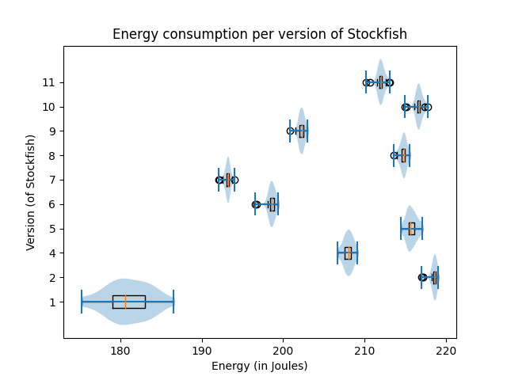
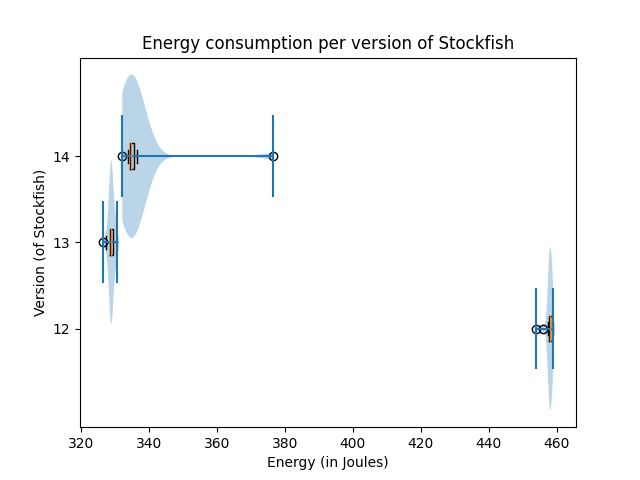
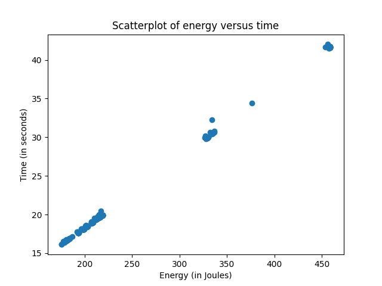
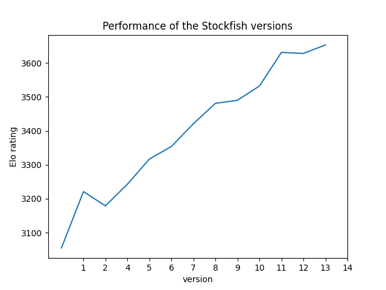

# Stockfish energy consumption analysis

Robert Arntzenius, Koen Hagen, Floor Straver

**Abstract**

## Introduction

In the field of chess AI, the open-source project Stockfish has consistently proven itself to be one of the world&#39;s strongest competitors. It constantly performs near the top of the Top Chess Engine Championships (TCEC), winning the 2021 championships[^1]. Stockfish started in 2008 as an open-source chess engine that accepts contributions from the community. Since its inception, Stockfish has steadily improved its performance, rising about 80 points of ELO (user evaluation metric used in chess) in the past five years[^2], with Stockfish 14.1 now reaching an estimated ELO-rating of around 3742[^3]. By comparison, Magnus Carlsen, the highest-rated human, has an ELO-rating of 2847 as of February 28th 2022. This rise in performance can be attributed to an increase in processing power and the improvement of programming techniques.

As a chess engine, Stockfish calculates millions of moves per second on high-end systems to find the most optimal next move to play. This process demands a lot of computing power from the computer, constantly demanding the maximal use of the servers that it runs on. These calculation algorithms also cost energy. Hence you can see that energy consumption signals efficiency in the underlying computing algorithms and that reducing it may positively impact the computing power over the same period of time. And finally, more computing power means higher performance.

In this blog, the energy consumption of multiple Stockfish versions is measured and compared to each other. Due to its longevity, active development, widespread popularity and cultural impact, Stockfish is the perfect engine to perform these analyses on.

After this introduction, we describe how and what will be measured in the approach. Then, we will present our findings in the experiments section. After that, these results will be discussed in the discussion.

[^1]:[https://www.tcec-chess.com/archive.html?season=21&amp;div=sf&amp;game=1](https://www.tcec-chess.com/archive.html?season=21&amp;div=sf&amp;game=1)

[^2]:[https://nextchessmove.com/dev-builds](https://nextchessmove.com/dev-builds)

[^3]: [http://www.computerchess.org.uk/ccrl/404/rating\_list\_all.html](http://www.computerchess.org.uk/ccrl/404/rating_list_all.html)

## Approach

To be able to compare the energy consumption of Stockfish versions, each version must be measured in the same conditions on the same system. Only when these conditions are kept consistent across each version can we confidently compare these versions.

There are currently a total of fourteen major Stockfish version releases. Each version has a number of underlying subversions which we will not consider. While most versions have their ultimate version listed in the archive, versions 1 and 2 only have their subversions listed (as of version 1.0 through 1.9.1 and version 2.0 through 2.3.1). For measurements of these versions, the latest subversions were used. Later versions from version 12 onward have chipset specific versions available, here all measurements were performed on these versions. Lastly, when given the option, a 64-bit version was always used for any version of the software.

Since Stockfish is available for all major operating systems, the first key decision was on which system the software was to be tested and by extension, which tool for measuring energy consumption would be used. We chose to perform the measurements on an Ubuntu system with the Perf performance analysis tool[^4]. This allows us to run the software straight from the command line terminal and Ubuntu is generally considered to be less power consuming when idle than Windows. The system we used is a dual-booted laptop that runs Ubuntu 20.04.4 LTS 64-bit. The system is built with an Intel Core i7-8550U CPU @1.80GHz x 8 and 7.6 GiB of memory.

Stockfish is an open-source software project with many performance test scripts in the form of shell scripts included with the software. These scripts allow us to keep test conditions as consistent as possible. The script we decided to use for the experiments is called reprosearch. The script is used to analyze the software&#39;s performance by giving Stockfish the inputs to perform a search for a set amount of nodes, increasing over a number of iterations. The script can be applied to each version and gives a high demand task to perform, which makes it a great candidate for testing.

The Perf tool allows measurement of the system&#39;s complete energy consumption throughout the execution of the reproseach script. Its measurements are given in Joules and it also outputs the execution time in seconds. Another shell script was written to iteratively run reprosearch with the Perf tool and write the output of the measurements to a data file. Since the output of Perf is in full sentences, a Python script was written to extract this data file.

Some measures were taken to prevent performance loss and inconsistent experiment conditions. For instance, tests were performed in parallel, meaning we performed the tests in version order instead of doing all tests for a single version at once. To prevent heat from having a substantial impact on the conditions, a ten-second interval was placed between each measurement and the CPU had already been active before performing any tests. During measurements, all other user software was turned off, the system was set to Flight Mode and the brightness was set to the minimum.

[^4]: [https://perf.wiki.kernel.org/index.php/Main\_Page](https://perf.wiki.kernel.org/index.php/Main_Page)

## Experiments

To make sense of the experiments done in Stockfish we applied some analysis on the data.

**Energy consumption ⚡**

The data from the experiments are plotted in violin plots with boxplots inside of them. With violin plots, one can see from which distribution the data comes and the boxplots give some more information about how the data is spread out. Because of the fact that the energy consumption after version 11 increases significantly, the boxplots of energy consumption of these versions were plotted in a separate graph. The first eleven versions do not have a specific improvement as seen in the graph, besides version 1, which is notably more efficient.

 

**Relation energy and time consumption ⏳**

During the experiments it came to the attention that there may be a connection between the time and the energy consumption of running Stockfish. The scatterplot of energy versus time shows us that there is a strong linear relation between them. The longer Stockfish takes to execute the higher the energy consumption.

**Relation energy and performance Stockfish 🐟**

One might expect that the energy consumption will get higher with every version since the performance goes up. As seen before this the energy consumption doesn&#39;t increase per version, while the performance of Stockfish is going up every version. This means there is no clear relation between the performance of Stockfish and the energy consumption.

The performance of the versions of Stockfish is measured by the ELO rating of chess. With ELO rating participants will increase their rating by winning and if they lose they will decrease their ELO rating. A win from a participant with a high ELO rate will increase your ELO rating more than from a participant with a low ELO rating and the same for losing[^elorate]. On CCRL Blitz [^elorate2] they keep track of the ELO rating of different chess engines, like Dragon by Komodo, Leela Chess and Stockfish.

[^elorate]:https://www.chess.com/terms/elo-rating-chess#:~:text=The%20Elo%20rating%20system%20measures,measured%20their%20players&#39;%20skill%20levels

[^elorate2]:http://www.computerchess.org.uk/ccrl/404/rating\_list\_all.html

**Statistical analysis**

When taking a look at the violin plots of the energy consumptions of the Stockfish version, one may assume the data is normal. To confirm this we applied the Shapiro-Wilk test. Out of this test came that versions 1, 4, 5, 7, 8, 9, 10 and 12 weren&#39;t normal. These versions had a p-value lower than 0.05. To make the data normal we applied z-score outlier removal to the data. This resulted in some versions becoming normal and some were really close to being normal. With the exception of version 2.

In the graphs, we see a clear difference between the samples. To make this concrete we look at the statistical difference of the means between the versions. We applied Welch&#39;s t-test by calculating the p-value between the different versions. Here the null hypothesis that the means are equal is rejected when the p-value is under 0.05 and this would mean that there is a statistical difference in the means of both samples. When applying this Welch t-test to the stockfish samples we indeed saw that all p-values between the different versions were under 0.05, which means that there is a statistical difference between the different versions.

## Discussion

While the performance of the version of Stockfish increases linearly with every new version, the energy consumption does not. The energy consumption does not have a significant relation between versions in terms of increasing or decreasing. This may be because Stockfish is inherently a self limiting programme, where the performance and recursion depth is largely decided by the power that Stockfish can use. A more efficient algorithm would mean that Stockfish can use that algorithm to calculate more potential end games, thus increasing the performance, instead of stopping the calculations earlier. This is further supported by the fact that energy consumption and time are tightly linearly related to each other.

There is a significant difference to be found between all versions. Barely any energy measurements overlap between other versions. Each version is statistically far enough away from its previous version that it can be said to be better or worse performing than it in terms of energy consumption.

In version 12 they made unique versions of Stockfish optimized for different versions of CPU. The reason for this is that they introduced an efficiently updatable neural network and this can be evaluated efficiently on CPUs [^5]. This implements the power of neural networks into the chess game. This neural network is also the reason for the significant increase in performance between version 11 and 12. While the neural network will give more accuracy, this will lead to a larger energy consumption.

[^5]:https://github.com/official-stockfish/Stockfish/commit/84f3e867903f62480c33243dd0ecbffd342796fc

While most data points remained relatively close to each other for any given version (except version one), there are a couple of outliers that are notable. Maybe one outlier for the latest version differed significantly from the rest. We did not find a clear cut explanation as to why this one datapoint was so far off from the others. It was not the first or last analyzed point, but the 17th out of 30. And it was at a random time (02:03 AM). Our most probable guess is that some type of notification must have popped up at that time, that would cause a small bump in processing time.

Another interesting finding is the difference in width of the boxplot of version one compared to all others. Of course, seeing as this was the very first version of Stockfish, we can assume that it was not as refined as later versions of Stockfish. There was no community yet. Nobody except the initial developers looked over the code. The engine was practically in an alpha stadium at that time. We presume the inconsistencies in energy consumption are caused by this.

As was discussed in the Approach, there were some measures taken to prevent inconsistent conditions between measurements. The system&#39;s heat production over time could lead to such inconsistencies. However, while heat was not measured throughout the duration of the experiments, the measurements did not show any dip in performance over time, which leads us to believe that heat production and other inconsistencies were kept to a minimum.

### Limitations

In the end, some limitations hindered the resulting findings a bit. Namely, the fact that Stockfish version 3 did not seem to function together with the reprosearch script as well as the others. Where other versions of Stockfish took around 16 to 42 seconds, Stockfish 3 was running for over ten minutes. Due to this significant abnormality in results, it was decided to remove Stockfish 3 from the data. The Stockfish changelogs describe a new testing framework that came with Stockfish 3, though whether this is the cause of this change in running time is not known. In the end, we are happy to present results going back to the very first version of Stockfish, as the starting conception was to go back in versions as far as possible, but that somewhere some change in software architecture would break the analysis script.

Another limitation is that all Stockfish versions are run on the same laptop that contains a limited CPU, instead of an environment where the engine would be at full strength. This needs to be taken in mind when comparing the energy consumption with the performance because the instances of Stockfish for which the performances were measured were most likely run on much bigger servers that allow for higher performances. These bigger servers will probably consume more energy than our setup.

## Conclusion

Stockfish is one of the world&#39;s best and most well known chess computer engines. Since its inception in 2008, Stockfish has seen countless improvements over the years. To find the best possible chess move for a given board, Stockfish analyses an enormous amount of moves to find a suitable response. This process is highly energy intensive. We looked at the energy consumption of different versions of Stockfish. The results show that energy consumption over the versions does not follow a clear trend and is mostly random. Though few energy measurements overlap between versions. Thus, it can be said that some versions are better than others in terms of energy consumption. We also find that energy consumption is almost perfectly correlated with time. The more time the algorithm needs, the higher the energy consumption.
