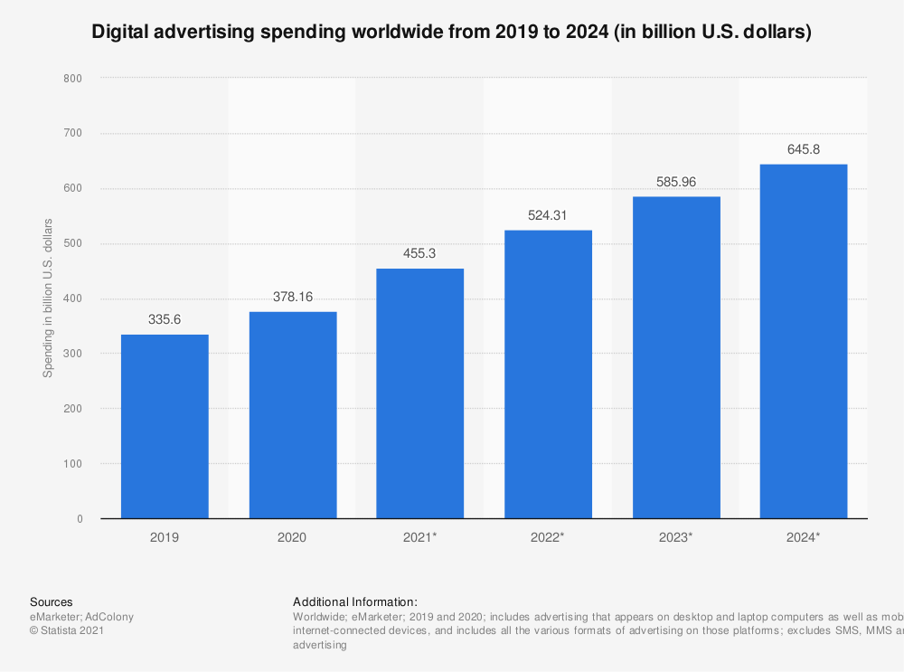
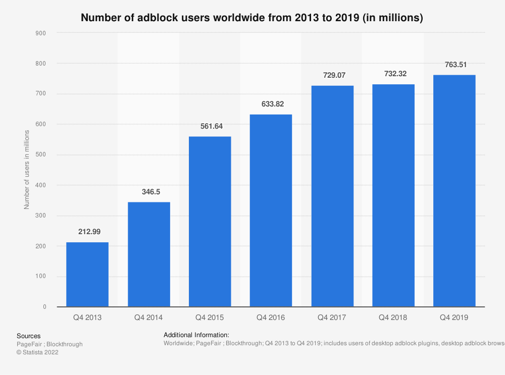
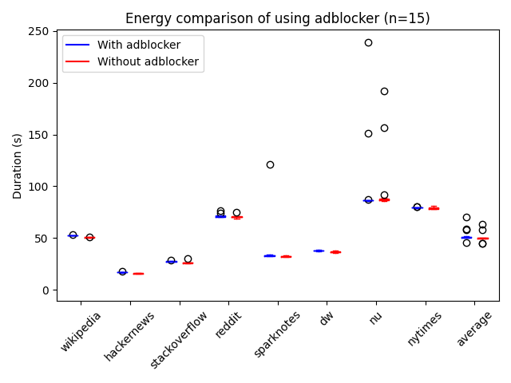
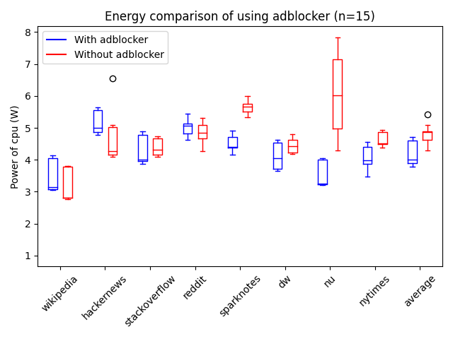

Showing advertisements is one of the key ways to earn money on the internet. Whether it is through banner ads¸ sponsored
messages or paid endorsements, advertising is everywhere. The online advertising industry is one of the fastest growing
industries. In the Netherlands
alone, [it grew by more than 100% in 8 year](https://www.statista.com/statistics/542808/net-online-advertising-market-revenue-in-the-netherlands-by-channel/)
. But what footprint does this industry leave behind? Large advertising companies
like [Google](https://sustainability.google/commitments/carbon/#) and [Meta](https://sustainability.fb.com/climate/)
have great ambitions of reaching net-zero emissions. However, their goals only apply to their own corporate emissions,
such as the energy usage of their datacenters or offices.

Given the fact that the services of advertising companies are consuming energy both the server *and* the client side,
the effect of advertising on the energy consumption of clients should not be forgotten. As more and more money is spent
on digital advertising, this becomes increasingly more important.

Users are becoming more ad aware, and there are many tools for reducing the amount of advertising you see when browsing.
As you can see in the image below, adblock usage is becoming more popular. Already 763 million people used adblockers
worldwide in 2019. This shows frustration towards online advertising, and makes it more difficult for websites to be
profitable. However, the sustainability impact of trying to block advertisements and trackers is most often not part of
people's consideration. Does this blocking increase your browser's energy consumption to find the ads? Or is it actually
saving your battery by reducing the amount of images that have to be downloaded?

This will be the goal of our experiment. We will measure the effect that advertisements and adblockers have on the
additional energy usage of our devices. In [previous work](https://dl.acm.org/doi/10.1145/3372799.3394372) there have
already been efforts to determine the power consumption of smartphones. However, with the relatively more screen
real-estate to fill, advertisements can take up more space on the screens on full-size screens of desktops and laptop
computers.

Blocking advertisements on computers can be done using an ad blocker, like the free and open-source ad
blocker [uBlock Origin](https://github.com/gorhill/uBlock/). We wrote automated tests
for [Selenium](https://www.selenium.dev/) to make the experiment as replicable as possible. The tests were run with
Selenium using [geckodriver](https://github.com/mozilla/geckodriver).

The testsuite was executed on the same set of sites, with the only difference being whether uBlock Origin was installed.
In combination with the use of selenium, we were able to automate the visit of different websites, such that the
experiments could be repeated 15 times. With the [jouleit](https://github.com/powerapi-ng/jouleit) script from powerapi,
the power consumptions during these website visits was measured. Now we just need to find some interesting websites to
measure the power consumption of. We came up with the following list of websites, ranging from no advertisements at all
to a lot of ads on a single page.

We judged the ad intensity ourselves to place the websites in 4 categories, as you can see in the table below. They link
to the exact page we used, so you can have a look for yourself! We also list here, how many requests the adblocker is
blocking, which also takes into account blocked requests that are less visible.

| Website | Ad intensity | # of requests |
| --- | --- | --- |
| [Wikipedia](https://en.wikipedia.org/wiki/Main_Page) | No ads | 0 (0%) |
| [Hackernews](https://news.ycombinator.com) | No ads | 0 (0%) |
| [Stackoverflow](https://stackoverflow.com/questions/tagged/selenium) | Low | 2 (7%) |
| [Reddit](https://reddit.com) | Low | 32 (3%) |
| [Sparknotes](https://www.sparknotes.com/cs/) | Medium | 7 (16%) |
| [Deutsche Welle](https://www.dw.com) | Medium | 11 (7%) |
| [nu.nl](https://nu.nl) | High | 12 (7%) |
| [New York Times](https://nytimes.com) | High | 15 (10%) |

We decided to not preheat the system as normally is done in such tests, since the preheating is not done in regular use
of the browser either. A user normally loads website one by one, therefore the CPU would not be pre-heated in a regular
scenario. In order to prevent as much deviation between tests as possible we opted to use a wired connection to the
internet and disabled bluetooth as well. No other programs were running during execution. In the figure below, it can be
seen that this resulted in quite consistent results for the experiment. Only 2 out of 240 experiments did not finish
successfully, so we removed these from the data. We also chose to remove the outliers where execution time was above 100
seconds from the data. These runs most likely had some connectivity issues that would impact the energy consumption.

Total power consumption consists of two parts, the energy consumed during the visit and the time spent. Below you find a
box plot of the time spent in watching the webpage. The time spent on every website is not equal since some websites are
longer compared to others. We decided to take the actual use case in consideration and to differ the amount of time
spent reading each website, the page was scrolled through with consistent speed. Either way, this should not skew the
results, since we will compare the ad-free websites relative to their ad-full variant.

In every test, we started the browser without any cache. Selenium was used to scroll from top to bottom each time, in
order to load all page content and ads. We repeated this for 15 iterations with and 15 iterations without adblocker for
every website. The execution order of the tests was randomly shuffled to reduce external effects. We only used Firefox
as a browser, but created the skeleton for easy future experiments with other browsers. We disabled all built-in
blocking features that Firefox offers, to only have the effects of the adblocker.

The results can be seen in the table below. It can be clearly seen that when scrolling on a page without any ads
(Wikipedia and Hackernews), using an adblocker consumes more energy. This energy consumption can be explained by the
fact that the adblocker has to go through the page to see if there are any ads. The same can be seen for the webpages
with only a few ads. The extra energy consumption is then partly compensated by the reduced cost from not having to load
the images and animations in the ad. When visiting websites with higher ad intensity, this saved effort is actually so
much, that quite a lot of energy can be saved by turning on an adblocker.

| Website | Average power with adblocker (W) | Average power without adblocker (W)| Change of power usage |
| --- | --- | --- | --- |
| Wikipedia | 3.54 | 3.256 | 0.284 (8.7%) |
| Hackernews | 5.176 | 4.618 | 0.558 (12.1%) |
| Stackoverflow | 4.295 | 4.384 | -0.0883 (-2.0%) |
| Reddit | 5.011 | 4.841 | 0.171 (3.5%) |
| Sparknotes | 4.508 | 5.628 | -1.12 (-19.9%) |
| Dw | 4.117 | 4.442 | -0.325 (-7.3%) |
| Nu | 3.523 | 6.091 | -2.57 (-42.2%) |
| Nytimes | 4.116 | 4.637 | -0.521 (-11.2%) |
| Mean | 4.226 | 4.785 | -0.559 (-11.7%) |

In the figure below, it can be seen that power consumption was not completely stable over iterations. The red boxplots
show the distribution of the results without adblocker, the blue boxplot with uBlock activated. The websites on the left
of the plot have less ads, the ones more to the right have more ads. In general, it was expected that power is not very
stable, but the distributions seem to show that the effect of the adblocker is definitely visible.

Due to the small sample size of websites we are unable to say something about the entire surfing behaviour of users.
Especially because of the distributed nature of the internet. If one would like to determine the amount of energy saved,
the type of the shown ads also play a role. If a lot of animated ads are shown at the moment, it might be more effective
to use an ad blocker compared to a moment when only static ads are shown.

---

What are the implications from this experiment? First, from the perspective of a web user, it can be seen that your
adblocker has significant impact on the amount of power you use while browsing. So if you are often on pages with a lot
of ads, it could be beneficial to use an adblocker. Both from a sustainability and a battery life standpoint. On average
over these websites, it already saves about half a Watt of power consumption. We only used the uBlock Origin adblocker,
so more research can be done to compare different adblockers, but we believe this is probably also the case when using a
different program.

As an example, we made the calculation for one of the high ad intensive websites from our experiment. The Dutch
newspage 'nu.nl', which shows 2 banners, one static ad and an advertisement that scrolls along. This page reports having
around [800 million page loads per month](https://www.dpgmedia.nl/merken/nu) . Our experiment shows an average energy
saving of 228 J for every load, this means that 228 * 800 million * 12 = 2188.8 GJ or 608 MWh could be saved every year
if everyone were to use an adblocker just for this one website. This is roughly equivalent to powering 220 Dutch
households for an entire year or to driving a Tesla 3 for 3850 kilometers.

Our experiment also shows that there is still a lot to gain in the efficiency of the adblocker. If it is possible to
recognize when there are no ads, it would not cost as much extra when browsing on these pages. There may be many more
and less complicated ways to achieve more efficient ad recognizing. For example, we believe this could potentially be
achieved by whitelisting well-known ad-free websites. This can already be done manually, and it could be a nice future
experiment to see, whether users can save energy by maintaining this themselves.

Another simple possibility would be to maybe keep more caches, to prevent having to redo this every page. However, it
should be noted that for this experiment, we restarted the browser every time. This might also have negatively impacted
the adblocker efficiency, as it might use more power during start up.

For websites, it is of course difficult to earn their money without ads. It is however possible to take into
consideration how much energy this consumes. Maybe looking into smaller or less animated ads could save the user some
energy, and motivate the user not to activate a blocker. Or to provide the option for adblocking users to request
ad-free or ad-light pages directly instead. This would of course be more efficient than the current way of requesting
the full page and then blocking parts.

In general, 'more ads equals more energy consumption' seems a valid conclusion from our results. However, this is not
completely consistent. The Sparknotes ads seem to use a lot more extra energy in comparison to Deutsche Welle, while
they have a similar intensity. We did not look into enough webpages to be certain what makes ads more or less energy
consuming. However, our first intuition is that it has to do with the size of the webpage as well. A large web page,
with an advertisement that is only loaded once, but shows it continuously might be more efficient than loading ads on a
small page that is only visited for a short duration. These are some of the many possible more detailed experiments that
could be done to interpret these results even more. What is the effect of ad size, the movement of ads, ad provider? But
also, what is the effect of using a smaller or larger screen or activating Firefox' trackers blocking?

In our opinion, the real, long-term solution would however be to make wider changes to the system. If it would be
possible to pay a small monthly fee, which is spread over all webpages you visit, we could save energy and frustration
from advertisements. THis, while still enabling companies that provide us with news, information and entertainment to
have an income. We understand this would be a complicated and long process to change, but maybe this small experiment
can provide a little extra motivation!

Would you like to reproduce the work we did? The files that we used to create these results can be found
on [GitHub](https://github.com/ThijsRay/CS4415-Sustainable-Software-Engineering).