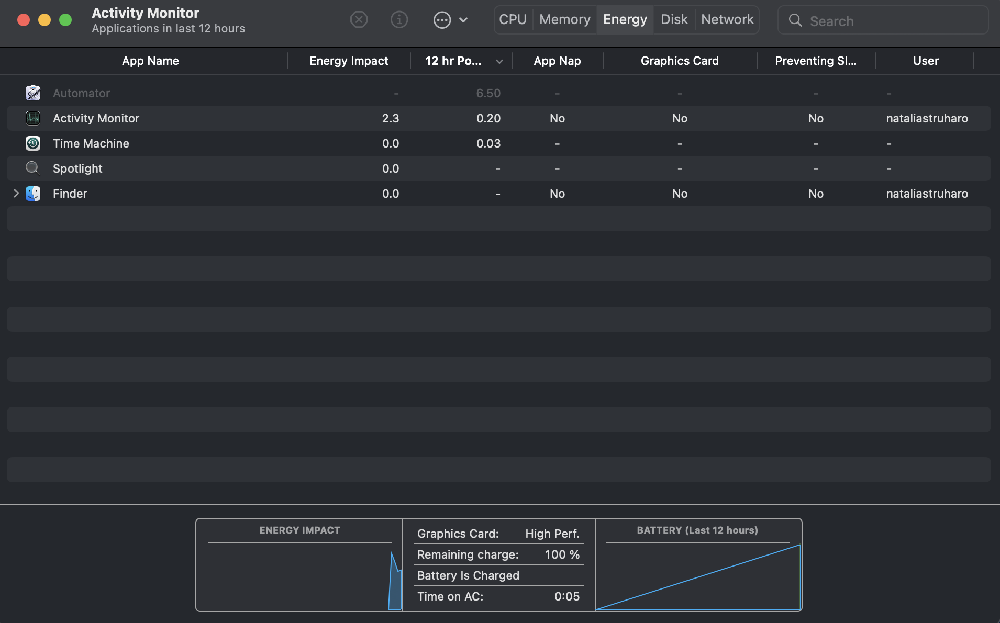
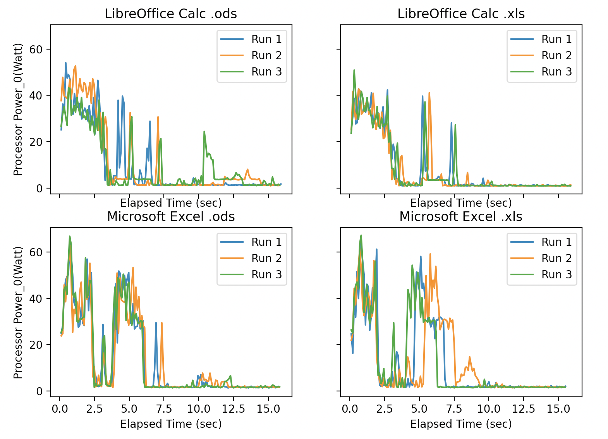
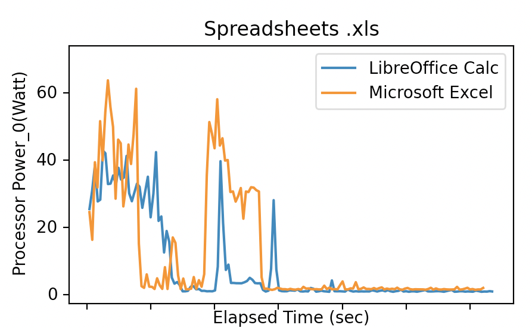
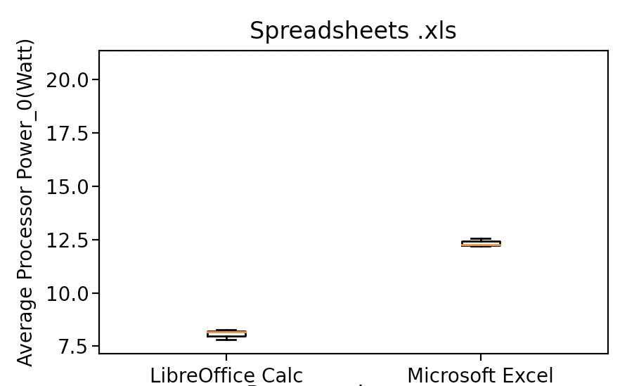

# LibreOffice vs. Microsoft 365: Power consumption

Office software is used by many companies and private users every day. With the high demand, the market diversity is high and calls for many different comparisons. This comparison however is only on the basis of their features, with little attention given to comparing their energy performance. With the rapidly rising trend of leading sustainable lives and businesses, individuals and companies are looking to limit their environmental impact. One of the ways to do that is choosing the right software with a relatively low impact when compared to the other options in the market. Considering the amount of users and individual uses of the applications, a small improvement can already cause a large decrease in energy consumption by software users. 

To take one of the first steps towards more awareness in office software energy consumption, we tested two popular office software packages: Microsoft 365 and LibreOffice. We compared the energy consumption of different application categories from each office software package, namely word processors, spreadsheets and presentation software.

## Background

### LibreOffice

The LibreOffice project is descendant from OpenOffice.org when this open source project was purchased by Oracle in 2010, the founders of The Document created LibreOffice to be able to continue their work. The [Document Foundation](https://www.documentfoundation.org/foundation/overview/) is a non profit organisation with a great commitment to social sustainability. They provide their software free of charge to allow the economically disadvantaged to participate.  In addition they are fully transparent with their finances and development process. This helps the foundation earn the trust of users. As to our knowledge the foundation does not have any policy on reducing their environmental impact. 

### Microsoft

[Microsoft](https://www.microsoft.com/en-us/corporate-responsibility/sustainability?activetab=pivot_1:primaryr6) is a software company well known for its operating system and office software packages. It is a commercial company, but has also embraced the trend of sustainable business. They do this by investing heavily in other non-profit organisations. Their environmental plans are ambitious. The company aims to be carbon negative, water positive and zero waste by 2030. This will mainly be done by influencing suppliers and offsetting through investments. Microsoft is much bigger than the software products we are looking at in this project. So the environmental efforts of both organisations are difficult to compare. Microsoft’s plans for environmental sustainability do not include energy consumption. 

## Testing Methodology

### **Software & Hardware**

- MacBook Pro 2019 with a 2.3 GHz 8-Core Intel Core i9 processor and an Intel UHD running the latest
- The machine was plugged into power throughout test execution
- *macOS Monterey* 12.2.1.
- *LibreOffice* 7.3.0.3
- *Microsoft 365* 16.58
- [Intel Power Gadget](https://www.intel.com/content/www/us/en/developer/articles/tool/power-gadget.html) 3.7.0, a energy measurement software that gives us energy consumption in Watts
    - The tool provides *Power Log*, a command line measuring tool, which allowed us to launched power logging in scripts, thus allowing both for automation and for reproducibility of testing

### **Set-up for testing**

To ensure that energy consumption was at minimum and that the individual applications were measured as much in isolation as possible, the whole test suite was carried out with an automated shell script, which you can find in our [reproducibility package](https://github.com/naty99/SSE-Reproducibility-Package). Before running the script, screen and machine sleep was disabled in order to maintain a consistent energy consumption in this regard. Next, notifications were disabled to limit their impact on energy consumption. Finally, all other applications were closed in the Activity Monitor (Figure 1), such that all listed tasks had zero Energy Impact (except for the Activity Monitor, which was also closed before running the tests). Therefore, while testing, the only thing we ran the application that executed the tests. 

### Figure 1

*Figure 1 shows the Activity Monitor application on macOS, which lists all the processes that are currently running.* 

### Tested Applications

LibreOffice and Microsoft 365 contain several different applications. In our experiment, we focused on three different categories and each package-specific application of that category, listed in Table 1.

### Table 1

|  | Microsoft | LibreOffice |
| --- | --- | --- |
| Word processor | Word | Writer |
| Spreadsheet | Excel | Calc |
| Presentation software | PowerPoint | Impress |

*Note: All three tested applications in both LibreOffice and Microsoft 365 packages carry the same version number as the package itself*

### Experiment

To get a fair comparison of power consumption across the packages, we tested each pair of related applications with the same file. For word processors, we opted for “neutral” file type, such that neither of the packages would have advantage over the other due to its native file type. However, this was not easily doable for for spreadsheets and presentation software. In these categories, to ensure there would not be an unfair advantage, we tested both applications with their native file type and the native file type of the rival application. The application type and the associated files and their sizes are listed in Table 2. The exact files can be found in our [reproducibility package](https://github.com/naty99/SSE-Reproducibility-Package).

### Table 2

| Application type | File type (extension)            | File size (in KB) |
| ---------------- | -------------------------------- | ----------------- |
| Word processor   | Rich text format (.rtf)          | 3                 |
| Spreadsheet      | OpenDocument Spreadsheet (.ods)  | 55                |
|                  | Excel Spreadsheet (.xls)         | 63                |
| Presentation     | OpenDocument Presentation (.odp) | 99                |
|                  | PowerPoint Presentation (.pptx)  | 426               |

Since we used two different applications for each application type, in total, we ran 10 unique tests:

| Application type      | Application | File extension |
| --------------------- | ----------- | -------------- |
| Word processor        | Word        | .rtf           |
|                       | Writer      | .rtf           |
| Spreadsheet           | Excel       | .ods           |
|                       |             | .xls           |
|                       | Calc        | .ods           |
|                       |             | .xls           |
| Presentation software | Powerpoint  | .pptx          |
|                       |             | .odp           |
|                       | Impress     | .pptx          |
|                       |             | .odp           |

To mitigate the impact of energy consumption of background tasks that is hard to exactly quantify, we ran each of the tests above three times to compare observe the consumption noise in each. And thus, in total, we ran 30 tests.

In the experiment, each of the six applications were given a file to open. The energy consumption of the application was then measured from the moment the file was open for a duration of 15 seconds. After these 15 seconds, the application was closed, which was followed by a 20 seconds long cool-down period of idle machine state. Then the next experiments of the same nature followed in the same fashion until all applications were tested with all the predetermined files. 

## Results

### Word Processors

Since we were running the word processors with only one file type, comparisons were quite simple. 

Let’s start off with the raw data for the three runs for Writer and Word. We measure the power consumption in Watt for the duration of the experiment. 

### Figure 2:

*Figure 2 plots the power consumption of the application during the 15 seconds that the experiment was run. The experiment was run three times for each application. Each run is plotted separately.*

The curves from Figure 2 already give us a good hint on the consumption between the two applications - Word seems to hit higher peaks in power consumption compared to Writer. Moreover, it keeps using a greater amount of energy consistently for longer period of time - while the consistent period of larger energy consumption for Writer ends around 4 or 5 seconds in, the consumption for Word seems to converge to 0 at about 7 or 8 seconds in. While all three runs seem rather consistent for Writer, Run 1 for Word seems to be significantly lower than Run 2 and 3. We show the power consumption over time for Run 2 as the first run differs too much from the other two runs. The boxplot to the right shows the average power consumption over all runs. Let’s take a look:

### Figure 3:

*Figure 3 compares the power consumption of LibreOffice Writer and Microsoft Word during Run 2 of their experiment.*

### Figure 4:

*Figure 4 shows the average power consumption during a run for all three runs we did.* 

The side-by-side comparison confirms what we already suspected based on our previous graphs. In the line graph in Figure 3, the orange curve for Word reaches higher peaks and also uses more energy at the time where Writer already seems to have converged very close to 0 Watts, at about 4 seconds into the experiment. The box plot in Figure 4 shows the average power consumption for Word being higher than for Writer. The box plot for Word is much more spread out due to the outlier in Run 1. In spite of that, it still proves that overall, Writer consumes about 8 Watts less on average. 

Based on both of these two figures, we can conclude that LibreOffice’s Writer consumes less energy on start up with file opening compared to Microsoft 365 Word. 

### Spreadsheets

First, let’s look at the raw data we have for each file type for both Calc and Excel:

### Figure 5:

*Figure 5 compares the power usage during each run of both LibreOffice Calc and Microsoft Excel. Every experiment is done for both the .ods and .xls file format.*

While it is hard to make conclusions of their relative consumptions, what is interesting to see that for each of the four graphs in Figure 5, the three separate runs were fairly similar in terms of intensity and the temporal distribution of energy consumption peaks. What may have a greater impact based on this data, particularly in case of Excel, is the file type used. From the two Excel graphs, it seems to perform slightly better with its native .xls format. Let’s take a closer look at the file types, taking into account only Run 1 from each test for simplicity:

### Figure 6:

*Figure 6 compares the performance of the different file formats for both LibreOffice Calc and Microsoft Excel*

### Figure 7:

*Figure 7 shows the average power consumption of a run for LibreOffice Calc and Microsoft Excel using the two file formats.*

The curves in Figure 6 give us a bit of a hint on which file type works better for the applications, but the box plots in Figure 7 give a clear proof that, surprisingly, both Calc and Excel perform slightly better when opening .xls files, despite .ods being a native type for Calc. 

The box plots also hint at another interesting result, which is that Calc performs better overall for both file types compared to Excel. To compare this data, let’s look at a side-by-side comparison of the better-performing .xls runs of Calc and Excel:

### Figure 8:

*Figure 8 compares the performance of LibreOffice Calc and Microsoft Excel for the .xls format.*

### Figure 9:

*Figure 9 compares the average power consumption per run of LibreOffice Calc and Microsoft Excel for the .xls format.*

The curves in Figure 8 already indicate that the area under the blue Calc curve is smaller than the area under the orange Excel curve, meaning that the test run measured less energy consumption overall for Calc relatively to Excel. In addition, from the curves it seems that Excel consumes larger amount of energy consistently between 4 and 6 seconds while Calc seems to be dropping faster. The box plots in Figure 9, which shows the average power consumption for all runs, further proves that Calc has better performance in terms of energy consumption, as it consumes about 4.5 Watts less on average.

Based on these results, we would recommend using Calc with .xls files for optimal energy consumption. Even when it comes to .ods, Calc still performs better than Excel does with this file type. Therefore, Calc would still be the preferable option to use for either of the file types.

### Presentation software

Let’s again start with the raw data that we obtained for both file types in case of both PowerPoint and Impress:

### Figure 10:

*Figure 10 shows the power consumption during the experiments on LibreOffice Impress and Microsoft Powerpoint for the different file formats.*

Once again, the three runs for each of the application-filetype experiment in Figure 10 seem quite consistent in energy consumption. However, there is little indication of which filetype allows for more efficient opening. So let’s look at a better comparison of .pptx and .odp. The power consumption over time is still only plotted for Run 1.

### Figure 11:

*Figure 11 compares the performance of LibreOffice Impress and Microsoft Powerpoint for the different file formats.*

### Figure 12:

*Figure 12 shows the average power consumption during a run for the presentation applications opening the different file formats.*

While the curves of Impress in Figure 11 do not make it clear which filetype is better, we can see in the PowerPoint graph that the .odp file opening consumes more energy almost at all points in the 15 second period. The box plots in Figure 12 further confirm that Powerpoint performs much better with .pptx than .odp, and also prove that Impress consumes less energy when opening .pptx, although with a smaller difference.

Knowing that .pptx is the more efficient file type to open for both, we can further compare the consumption of Impress and Powerpoint using this filetype in a line graph for Run 1 of each:

### Figure 13:

*Figure 13 compares the performance of LibreOffice Impress and Microsoft Powerpoint for the .pptx file format.*

### Figure 14:

*Figure 14 compares the average power consumption per run of LibreOffice Impress and Microsoft Powerpoint for the .pptx file format.*

The curves in Figure 13 are slightly ambiguous here, as it seems that Powerpoint uses more energy in the first 6 seconds, however for the rest of the 15 seconds, Impress consistently consumes slightly more energy than PowerPoint. The box plots in Figure 14 show that they are quite equal in energy consumption.

Based on these results, we conclude that while the .pptx file seems to be as efficient to open with Impress as it is with PowerPoint, Impress performs better with its native .odp files. 

## Discussion

There are multiple possible explanations why Microsoft’s office suite needs a higher amount of energy compared to LibreOffice. 

A key difference between LibreOffice and Microsoft’s Office is that Microsoft Office includes more online functionality. Their applications offer the possibility to save documents in the cloud (on Onedrive) and to collaborate in real-time. Online functionality is often energy intensive since it requires more background services, which may be started when a file is opened. We have not used these functionalities during the experiments, but since the Wi-Fi was not off during the runs it may be possible that they were enabled during start-up. 

Another aspect in which the two software suites differ is in their GUI. Microsoft office focusses more on visuals, which has been one of their selling points. This interface would need more energy to run so this may be an explanation for the increased power consumption of Microsoft Office. It could also explain why these applications continue to use more energy during the experiment, even after the first spike of power usage has passed. This phenomenon is less clear in the applications used for presentation as the nature of these applications require both LibreOffice and Microsoft to use an application with a lot of visual elements. 

### Result Limitations

While we tried to make our tests as reproducible and reliable as possible, there are some inevitable limitations to our testing method. For energy measurements in general, it is difficult to be certain of how one application influences the amount of energy for the entire device. There are many factors that can influence the results, which we have tried to minimise with a proper set up and repeated experiments, however it is difficult to guarantee when and how much energy background processes consume. Lastly, our tests only tested application start up and file opening, which is only a small part of what a typical users needs from the system. While this gave us an insight into relative consumption in the task, it is hard to reliable extrapolate this trend and guarantee that one application package is more efficient per average use. 

### Future experiments

In the future, more options of the packages can be tested, such as read-only modes. Perhaps a workflow of opening a file, writing into it, and closing it would also give a better perspective of power consumption during typical usage. The online version of Microsoft Office, Office for the web, accessible in the browser could also be compared, as it may exhibit different power consumption. Additionally the online Google applications Sheets, Docs and Slides offer similar functionality, while LibreOffice does not offer such functionality (yet). Therefore a a comparison between the energy consumption of Office for the Web and the online Google applications can be tested in future work. 

## Conclusion

By measuring and comparing the power consumption of opening a file for the three most used applications of Microsoft Office and LibreOffice we have found that LibreOffice consumes considerably less energy on average. This is the case for both the Word and Writer comparison and for Excel and Calc. There is no significant difference when comparing PowerPoint and Impress for the native filetype of PowerPoint: .pptx. Impress does perform better for its native file type .odp. Our experiment is small so it would need to be replicated on a much larger scale to draw any scientifically valid conclusions. It is worth mentioning that our results are relatively clear considering the variance in power consumption from energy measurements in general. For this reason we recommend using LibreOffice instead of Microsoft Office for environmental sustainability. Future research can confirm whether LibreOffice is also more energy efficient in general usage during other tasks than opening a file. However, based on the performance for opening files, we recommend LibreOffice for viewing files rather than using Microsoft Office.
