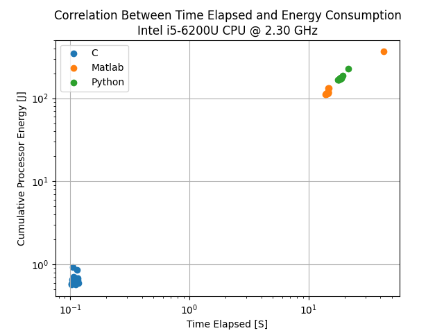
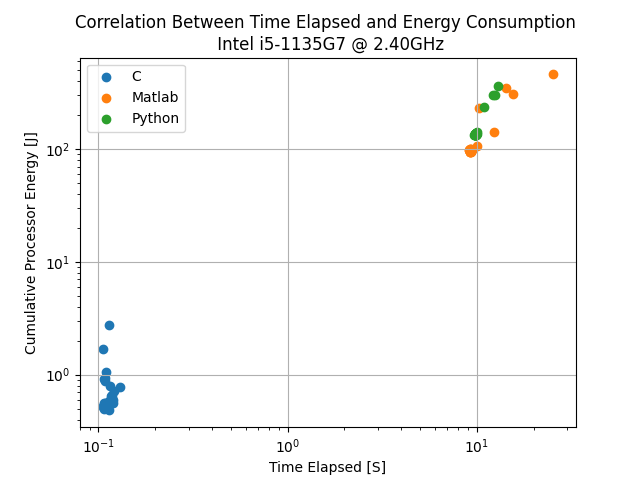
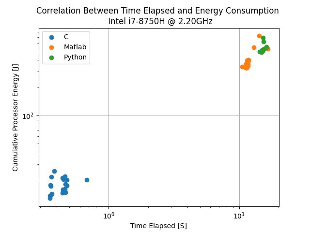
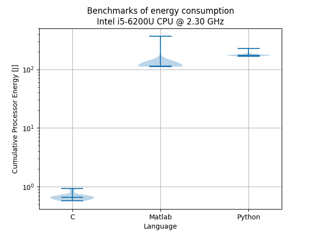
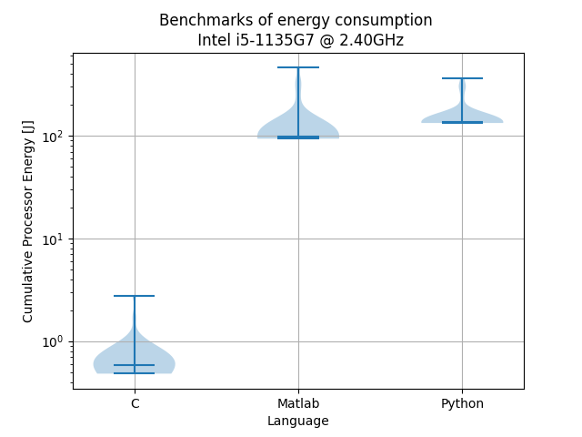
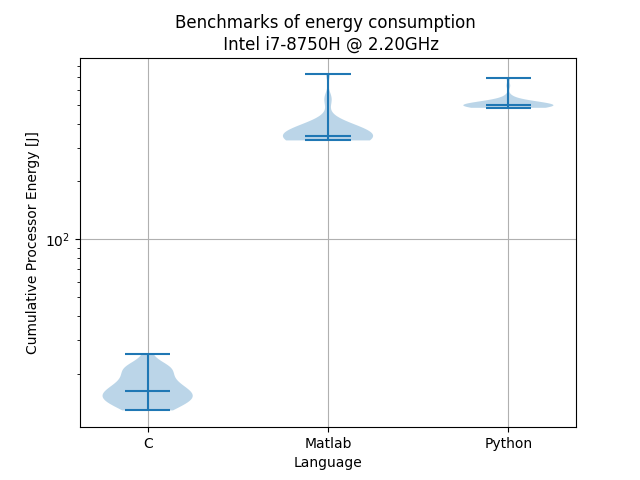

# Introduction

Nowadays, software is an important part of everyone's life. Software is
used to communicate, work, entertain and even to control devices in ones
home. However, software requires energy to operate, and with the
increasing demand for digital services, energy consumption has become a
significant concern. Energy consumption not only affects the environment
by contributing to carbon emissions but also impacts the operational
cost of businesses and the performance of devices. By the year 2040, the
contribution of the sector for information and communication
technologies to global carbon emissions will rise up to 14%. Therefore,
it is important to measure the energy consumption of software to
optimize energy efficiency, reduce carbon footprint, and enhance the
performance of devices. Measuring the energy consumption of software
helps developers and businesses to identify energy-hungry processes and
optimize them, thereby improving the overall energy efficiency of their
products. In this context, sustainable software engineering has become a
critical aspect of sustainability, and measuring the energy consumption
of software is a fundamental step towards achieving that purpose. The
decision of what programming language to use is one of the most
fundamental questions when working in the information and communication
industry and has a huge impact on the future energy consumption of
software programs. Usually the main factors in choosing a language is
running speed and competences of the developers. However with the
increase in interest in sustainable software we want energy consumption
to be a factor when choosing language. Therefore, the goal of our report
is to highlight differences in energy consumption, depending on the used
programming language and to answer the following research questions:

-   RQ1. How does the energy consumption of each programming language
    compare?

-   RQ2. How does the energy consumption on average differ inside each
    programming language?

For the purpose of answering the research questions, we made an
experiment to measure the energy consumption of different programming
languages (C, Matlab, Python) while solving a mathematical calculation.
In the second chapter of this paper, the setup of the experiment is
displayed. In the third chapter the results of the experiments will be
visualized and the research questions will be answered. In Conclusion,
in the forth and last chapter, the results will be discussed and
compared with the results of the study \"What Are Your Programming
Language's Energy-Delay Implications?\".

# Our comparison

## The benchmark

The code we are benchmarking computes the number of pairs of points that
are intersecting (defined as closer than 5 cm to each other), which
might be one step in a larger program. The position data is taken from
one random time step of a simulation of gravel sliding down a conveyor
belt.

The benchmark we use for our study consists of the following steps:

-   Parse a file consisting of approximately 16000 rows, where each row
    corresponds to the x, y and z coordinates of a point.

-   Sort the points by x coordinate, to reduce the number of comparisons
    in a later step.

-   Initialize a counter.

-   For every point, compare it with all the points with a x coordinate
    larger than its own, since the points are sorted, we can stop
    comparing when the difference between x coordinates is larger than
    5 cm. If the point is close enough, increment the counter.

-   Print out the number of pairs of points intersecting.

The distribution of the points before and after sorting can be seen in
[\[fig:pre\]](#fig:pre){reference-type="ref" reference="fig:pre"} and
[2](#fig:post){reference-type="ref" reference="fig:post"}.

{#fig:post}

{#fig:post}

## Running the code

The code was implemented in three languages, namely C, Python and
Matlab. The C code was compiled with the flag -O3, the Python code was
run with version 3.11 and the Matlab code with MATLAB R2022a. It was
then run on three different laptops and the energy consumption was
benchmarked 30 times using the Intel Power Gadget.

## Prevention of confounding factors

When making a scientific experiment on energy consumption it is
important to prevent confounding factors that could interfere with the
results of the experiment. For that matter, all the experiments used
different laptops but the same setup:

-   All applications were closed

-   All notifications were turned off

-   All unnecessary services like web servers were killed in advance

-   The brightness of the screen was turned to minimum

-   All the laptops had the internet connection turned off

-   All the laptops were connected to the charger

Energy consumption is highly affected by the temperature of the hardware
that is used. To prevent that the first execution will appear more
efficient than the following, all devices had to run a CPU-intensive
task before running the experiment and measuring the energy consumption.
In addition, for the validation of the results, every language had to
run the same calculation 30 times. At the end, the results of the
measurements were collected and are visualized in the following chapter.

 []{#fig:pre label="fig:pre"}

 []{#fig:post
label="fig:post"}

 []{#fig:post label="fig:post"}

 []{#fig:pre label="fig:pre"}

 []{#fig:post label="fig:post"}

 []{#fig:post label="fig:post"}

# Results

In this section we will analyze the results. The code is run on three
computers, with each language running 30 times. The code is then plotted
on two axes with time and energy consumption as the measurements. The
three languages used are C, Matlab, and Python. C is a compiled
imperative language, while Matlab and Python are interpreted languages.

### RQ1. How does the energy consumption of each programming language compare? {#rq1.-how-does-the-energy-consumption-of-each-programming-language-compare .unnumbered}

Comparing the results tells us that C is faster than Matlab, which in
turn is faster than Python. One interesting finding is that there are
significant differences in energy consumption, depending on what CPU is
used, however C was consistently much more efficient than the other two.
Since C is a compiled language, it makes sense it's the fastest. C was
build for speed, and to run on embedded devices with very limited
computing power. It also provides tools for developers to effectively
manage their programs threads, and storage by programmatically
allocating the needed storage. By lowering the abstraction level C
programs becomes harder to write and maintain, but when it comes to
execution measurements it's superior to the other languages. The task
chosen for each language to perform is also a task typically performed
by C. It's a scientific computing task, often performed on an embedded
device, which is where C thrives.

Matlab and Python both suffer from the same structural problem. They are
both interpreted languages, and have several abstraction layers more
build on than C has, and that comes with a cost. By having interpreter
interpret the code line by line, and then run it there's a lot of
overhead computing cost that C simply does not have. This results in a
lot of energy consumed, that means the energy consummation is magnitudes
higher then that of C.

### RQ2. How does the energy consumption on average differ inside each programming language? {#rq2.-how-does-the-energy-consumption-on-average-differ-inside-each-programming-language .unnumbered}

The different samples of C use quite a big percent wise change when it
comes to energy. The median usage is around 0.3 joule, with a big
outlier at around 2 joules. The data is nicely distributed about the
mean, and the amount of samples with higher energy usage falls quickly,
with a few outliers.

The same can be observed for Matlab and Python. The median value is
close to the lowest observed value but the frequency of observations at
the higher intervals decreases rapidly, until it reaches a couple of
outliers. From the violin plots we can tell the variance is not very big
around the mean and the lowest observed value, but the percentage wise
variance is not as big as it is for C.

Some of the tests have outliers when it comes to the maximum observed
energy consumption. This might be caused by the computers not fully
being in \"zen-mode\". The outliers can be categorized as background
tasks or other things that wasn't disabled properly. There is only one
outlier pr language pr test, which further strengthens the hypothesis
that it's noise effecting the test results. But in figure 6 the Matlab
outlier requires quite a lot more energy than the outlier for C, so
there might be some runs where a run requires more power. It could also
be because the order of which the tests were executed were not
favourable for this specific test.

# Discussion

## Comparing our results

Comparing our results with the results of the study "**What Are Your
Programming Language's Energy-Delay Implications?**". In the paper they
compare multiple languages on multiple different use cases. The two use
cases that comes closest to the use case presented in our paper is the
arithmetic operations and sorting algorithms. In both of these use cases
the C code is magnitudes faster than the python code, which corroborates
the results presented in this paper. The unit used in the paper is not
that same as used in this paper. They use EDP which is designed to
penalize slow runs. In this paper only time and energy consumption is
used, but we don't have to further penalize slow runs to be able to
compare the results of the paper.

From this study and "**What Are Your Programming Language's Energy-Delay
Implications?**" it seems that the best option when choosing a
programming language would always be C, however this is not necessarily
the case. The reason for this is the fundamental difference in which
these languages work. C is a compiled language and will therefore in
almost all cases be faster, however this makes it more difficult to use
in general as it requires a very specific syntax. Matlab and Python are
both interpretative languages this makes much slower since the program
reads line by line, however the syntax is easier since it's closer the
English language.

## Limitations

Comparing the languages using only one use case has it's limitations.
Programming languages are optimized for different use cases, and the use
case in this paper is mostly fit for C. The languages chosen are mostly
used for handling data, but Python is usually used in this use case as
an interface to C libraries. This makes it easier to write for the
developers, and still maintains the speed. The implementation of the
Python program uses numpy to sort the array, and plain python to compare
the distance between the points. Therefore the difference in speed
between Python and C is mainly based on the comparison of the points,
and not the actual sorting. But the sorting doesn't take a lot of time
compared to the comparisons, so most of the time consumed is spent
comparing the points.

The study is run on three laptops using different Intel CPU's with
different speeds. For the study to properly compare the energy usage of
these languages we would have to test on a lot more CPU's, and as
mentioned earlier a lot more use cases. Computer architectures are
implemented differently and the results of the tests would depend on the
architecture of the computer. For this study to yield any real results,
a lot more use cases and hardware would have to be introduced. Then
software engineers would be able to consult this study, and make
decisions based on how often they would have to run the program, the
hardware available and the use case of the user.

The implementations of the use case would also have to share some
similarities. Since the same code can't run in all the different
languages, the implementations would have to be as similar as possible,
and be optimized for the same metrics.

The program used to record the energy consumption was Intel Power Gadget
3.6. Using a software to find energy consumption has numerous issues.
Having to run the software along with program for which you want to
measure energy consumption can lead to an increase in measured
consumption, this is particularly bad for small programs which needs
very little energy to run. Furthermore the precision in general can be
called into question, since this tool only measures energy consumption
in the processor.

In a lot of out experiments throughout testing Matlab usually had one
outlier which was up to three times slower than any other measurement.
This can be seen on the measurement with the Intel i5-6200 CPU. Looking
into this we found that it was most often the first measurement and we
hypothesise that this is due to time used connection to the interpreter.

# Conclusion

This study compares three languages but is not exhaustive. The size of
the study introduces problems when it comes to getting an actual
representative view of the languages. The study can be consulted as a
quick comparison of energy consumption if the goal is to do scientific
computation.

The Limitation of the study can be summarized in three points. The use
case of the specific code is important since different languages are
optimized for different things. Therefore one needs to think about this
when choosing language. The computer architecture/hardware, it is clear
from the results that this have a huge impact on how fast the program
was and how much energy it consumed. Lastly since the program used to
measure energy consumption only measures in the processor this accuracy
can be called into question.

From this study we recommend that C should be used in cases where this
is possible. If another language is chosen for reasons not only
concerned with energy consumption we recommend the use of libraries that
uses C in some way like for instance NumPy.

# Appendix {#appendix .unnumbered}

The code used for this project is stored here:

`https://github.com/eliasstenhede/sustainable_software_engineering`.