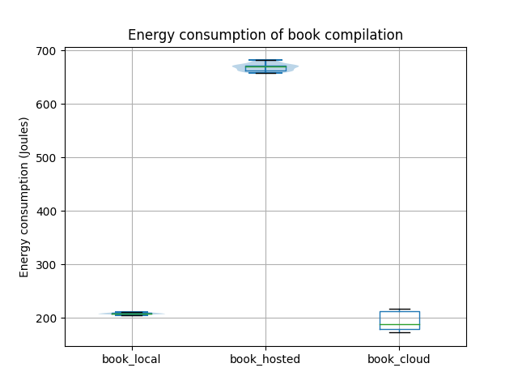

**Note**: Please ctrl+f for`TODO:`s; they need to be checked.

Some sections still have to be completely written, any information that we are still planning to add is indicated with bullet points. 

---
## Introduction (Sara)
<!-- - Problem statement.  -->
<!-- - It must be clear. What are we doing? Why is it useful? -->
  - Storyline: What is more efficient in terms of energy, and what is more efficient in terms of having your battery last as long as possible? "What is best for your battery / your local machine, what is best overall?" Sidenote: how do we measure this? Especially the cloud/online version. Websites should be more transparent about their server-side energy consumption to allow consumers to be more informed about their energy usage.
  - The problems stated will be explained after a more 'catchy' introduction, see below for the first paragraph

Text editors come in many shapes and sizes, from bare-bones options like NotePad, to fully specced word processor such as Microsoft Word.
In the former you have a plain interface and minimal options to format your document.
In the latter you can add in-text citations, math equations, and even rainbow colored titles.
We are going to be talking about another type of text editor, namely a document preparation system, this system seperates the content from the formatting.
This seperation does mean that you have to compile your written LaTeX, this process 'combines' the content and your formatting instructions into a final pdf.
The most well-known example of such a system is LaTeX. 
The system is used to create most scientific papers, since it has a lot of flexibility and it can handle equations very well.

[Overleaf](https://www.overleaf.com) is a online web editor where you can write your LaTeX text, compile it and Overleaf even lets you collobarate with your peers. 
The compilation of file is now outsourced to the Overleaf servers. 
As discussed earlier this follows

He likes the story that measuring energy online is difficult because of bot detection: we should write about this journey through different hypotheses

blog_local: approx 0.5 seconds
book_local: approx 11 seconds
blog_remote: approx 1.5 seconds
book_remote: approx 35 seconds

## Method (cathrine)

To find out whether TODO:hypothesis?, we conducted two experiments in three different experimental settings. 
The first experiment involves compiling a small blogpost, the second a large book. 
These two experiments were executed in the following three settings: locally using a bare-bones LaTeX compiler directly, on a self-hosted Overleaf instance, and on the Overleaf cloud instance.

There were six experiments in total: `blog_local`, `book_local`, `blog_hosted`, `book_hosted`, `blog_cloud`, and`book_cloud`. 

The local experiments were fully automated using bash scripts. The self-hosted and cloud Overleaf experiments were automated with Selenium, but the cloud experiments required some manual steps.
Each experiment was run 30 times, except for the cloud experiments which were run 5 times. The reason for this discrepancy being that the Overleaf experiments requires the tester to manually click the compilation button due to Overleaf's bot detection which is discussed later in TODO:section?. To prevent the order of experiments influencing the resulting measurements, the experiments were randomly shuffled TODO:howExactly?.

For each experiment, we took the following measurements during the LaTeX compilation: the elapsed measurement time (seconds), the total energy consumption (Joules), and the average power (W) of the CPU and RAM.
In addition to the experiment measurements, we also provide a baseline measurement to give an idea of how background processes impact the measurements. The baseline measurement is a 60 second measurement with the same settings as in the experimental setup but with no programs open except background processes.

### Experimental setup
The experiments were conducted on a HP Zbook G4 laptop with a Intel Core i7 7700HQ and 16GB 2133MT/s RAM running Ubuntu v22.04. The energy consumption was measured using pyRAPL v0.2.3.1.
The specific software used for compilation in each experiment setting can be found in the table below:

| Experiment type | Software         | Version |
| --------------- | ---------------- | ------- |
| Local           | xelatex          | 2.6     |
| Self-hosted     | Overleaf Toolkit | 3.2.0   |
|                 | Firefox          | 110.0.1 |
| Cloud           | Overleaf Online  | February 10, 2023 | 
|                 | Firefox          | 110.0.1 |

Before executing the experiments it is important to record the state of the system under test so that the state can be kept as consistent as possible between experiments.
In addition to the hardware and software specifications above, we made sure that the laptop was in the following state:
 - Airplane mode turned on (i.e. no Bluetooth, no WiFi, no notifications)
 - Power cable plugged in
 - No external monitor or other peripherals
 - Screen brightness set to 100%
 - Screen saver timer turned off
 - No other programs open

Furthermore, the difference in CPU temperature between the first and later experiments may impact the results. We therefore first perform a warm-up routine that calculates fibonacci numbers for 30 seconds to minimize the temperature difference. (Did you know that the 41st fibonacci number is 102334155?)

All the local experiments were done first to prevent having to continuously open/close the browser and log in/out for the self-hosted and cloud experiments. The self-hosted Overleaf experiments were run next, followed by the Overleaf cloud experiments.

Summarized, the experiments were structured as follows:

##### Local experiments
- Warm up CPU
- Shuffle and run 60 instances of the book and blog experiments (30 each):
    - Start measuring
    - Compile book or blog with xelatex
    - Stop measuring
    - Wait for 30 seconds

##### Self-hosted Overleaf experiments
- Warm up CPU
- Automatically start the browser and log in to Overleaf
- Wait for 60 seconds to give the browser time to pageload
- Shuffle and run 30 instances of blog and book experiments:
    - Start measuring
    - Automatically click 'recompile from scratch' and wait for the compilation to end.
    - Stop measuring
    - Wait for 30 seconds

##### Cloud Overleaf experiments
- Warm up CPU
- Automatically start the browser, wait for user to manually log in
- Wait for user to manually start compilation
    - start measuring
    - watch for compilation to stop (While loop sleeps for 0.1 seconds to not hog CPU)
    - stop measuring

### Replication
The code used to automate the experiments can be found in the [replication package](https://github.com/OttoKaaij/latex-energy). Because the book used for one of the experiments is not (yet) open-source, it is only available on request. You can contact the authors [here](https://textbooks.open.tudelft.nl/textbooks/catalog/book/53). 

To get the package running, you need to do some non-trivial setup steps. 

1. Host a local version of [overleaf](https://github.com/overleaf/toolkit)
    - Install texlive-full to this overleaf instance.
2. Install [firefox webdriver](https://github.com/mozilla/geckodriver/releases).
3. Install the dependencies with `pipenv install`
4. Since you can't (and shouldn't) run a browser as root, run `sudo chmod -R a+r /sys/class/powercap/intel-rapl` to give the user (and pyRAPL) access to the power data.
5. You should now be able to run the experiments with `pipenv run [bg|experiment|cloud]`. Google any error you find.

## Results (cathrine)
- Here we will present our results as measured in Joules per experiment. 

- Also mention background processes

## Discussion? and limitations

Sara:
- Limitation: shuffling not done "properly" due to the automation issues. So there could be some impact on the results.
- Limitation: Report that the while loop checking if the compilation is done in the cloud experiment is very expensive in terms of CPU power usage, should have added maybe add sleep of 1/10th second.
- Limitation: not measuring network costs for online/cloud experiment.
- - Limitation: result only considers compilation energy and does not take into account the time an actual user would spend writing in text editor / browser.

### Practical Significance
We have seen that our test results have *statistical* significance, i.e. that it is extremely unlikely that the differences in energy consumption result from chance. As a result, we can say with confidence that, whether the Latex source files in question are large or small, compiling them locally consumes less energy than compiling them via the self-hosted version of Overleaf. We moreover see that this is mostly due to time: for the book, local compilation consumes in total 68.6% less energy than self-hosted Overleaf compilation, but it is only 1.4% more efficient in power usage.

On the other hand, we see that local book compilation consumes 25.8% *more* energy than online Overleaf compilation (with the fixed looping), and has a tremendous 352.4% more power usage - here, again, time plays a significant factor, because the total energy consumption differs by far not as much as the power usage, because online compilation uses less power but also takes about 4 times as long.

<!-- (but nevertheless the power usage is even 12.8% *more* - which is explained by the online compilation taking about 4 times as long. Similarly, local book compilation consumes 68.6% less energy than the hosted version, but it is only 1.4% more efficient in power usage.) -->

Out of practical considerations, it makes sense to be primarily concerned with the **total** energy consumption per compilation: if we need to compile a certain number of files, we would like to do so spending as little energy as possible. Since the differences in energy consumption - between online and local - are pretty overwhelming for both small and large files (53.4% and 25.8% respectively), not much is needed to argue that it is worth it to compile files online, if we look at energy consumption in isolation, on your local machine.

If, however, we consider the total energy consumption used for a compilation (not just of your own device), it is more fair to compare the local compilation with the hosted Overleaf version - in which case we see that local compilation is significantly better for small files already, consuming 39.6% less energy for the blog compilation.

However, practical significance is all about trade-offs. For example, online or hosted Overleaf compilation takes significantly more *time* than local compilation; the difference is a factor 3 or 4 for large files. If one has to compile large files, such as the book we used, often, it may be frustrating or impractical to have to wait 45 seconds for a compilation to finish. However, such troubles are also easily circumvented, e.g. by splitting up the source file in different sections and only recompiling the smaller section that you're currently working on.

Moreover, the use of Overleaf may offer other benefits - your data is stored in the cloud, so is back-upped automatically; you can easily collaborate with others by working on a file at the same time; you don't need to install any programs locally on your computer; and it's more user-friendly for non-programmers.

So luckily for those most concerned with the battery life of their laptop, or their own energy bills, lower costs go hand in hand with the benefits online Overleaf offers; however, for those who care about total energy consumption in relation to the environment, it may be worthwhile to give up the benefits offered by Overleaf, depending on the use-case, and be significantly more environmentally sustainable by compiling LaTeX files locally.

 - Bot detection problem with remote experiment, max retry barrier, DOS protection, etc. Had to change hypothesis.
 - Influence of background processes (about 2W, so power difference is in practice *more* significant)
 - Other limitations: cost of docker container, ...
 - Impossible to measure network costs

Sara:
- For discussion after practical significance: can generalize the results to other software. What can people do with our results? How do our results help society? 

- Discussion in two parts: 1) practical results and problems, 2) more overarching ethical stuffs.

## Conclusion (michelle)
- Answer problem statement (what we are doing, why is it useful?)). 

As we have seen, when you are primarily concerned with the battery life of your device, compiling online in the cloud is your best bet - this is good news for those who really like the other benefits Overleaf offers. The only trade-off here is compilation time, which is significantly increased compared to local compilation, but for most this will probably not be a major concern.

However, for those concerned with energy consumption in relation to the environment, online Overleaf is probably not the better option, because the server spends additional energy on the compilation - which unfortunately we cannot measure nor make very educated guesses about. We do however to some extent see this energy consumption back in the hosted Overleaf compilation: hosted Overleaf compilation is significantly more energy-intensive than local compilation. Hosted Overleaf may offer the benefits from online Overleaf, while also increasing your privacy, but from an energy-aware perspective it s not your best option (both for the world and your private energy bill).

Of course, keep in mind that all of this should be taken with a grain of salt and is accompanied by a lot of 'buts' as our measurements aren't perfect (think of running background processes and the overhead of the measuring process itself), nor can we measure everything we want.

To mitigate the latter issue, we make an appeal to cloud services such as Overleaf to be more transparent about the energy consumption of their servers, so that users can make more informed decisions in line with their visions on environmental sustainability.
<!-- - Compiling online in cloud is better if you want to save your battery. Compiling locally is better if you want to save total energy. Self-hosting Overleaf is more energy intensive than locally, but unsure whether it beats cloud because we cannot measure Overleaf's server-side costs but we can assume they have more specialized hardware than our test machine. However, self-hosted does provide other advantages such as increased privacy. But self-hosting should not be considered an option to decrease energy footprint. -->

