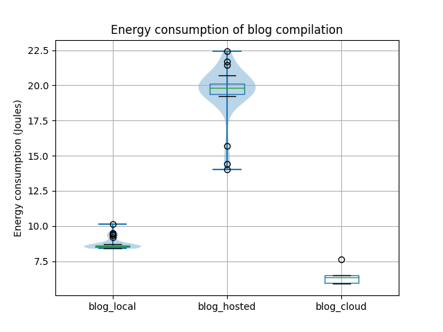
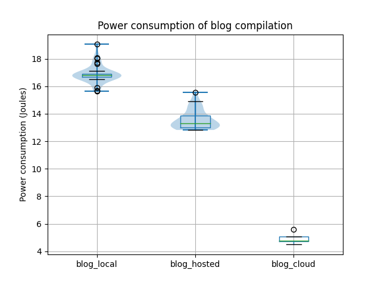

Text editors come in many shapes and sizes, from bare-bones options like NotePad, to fully specced word processors such as Microsoft Word.
<!-- COMMENT: this block can be removed if we need space. --> In the former you have a plain interface and minimal options to format your document. In the latter you can add in-text citations, math equations, and even rainbow colored titles.
We are going to be talking about another type of text editor, namely a document preparation systemthat seperates contents from formatting.
This seperation does mean that you have to compile your file; this process 'combines' the content and your formatting instructions into a final pdf.
The most well-known example of such a system is LaTeX, which is used to create most scientific papers since it has a lot of flexibility and it can handle equations very well.

Compiling LaTeX can be done locally or remotely using an online editor. 
[Overleaf](https://www.overleaf.com) is such a web editor where you can write your LaTeX text, compile it, and even collobarate with your peers. 
The process of compilation is now outsourced to the Overleaf servers. 
In theory this saves your own computer some power, since it only has to send a compilation request to Overleaf and receive the compiled pdf file.
This method does add extra network costs, however. 
In this blog we will take a closer look into the energy consumption of both local and cloud-based compilation.

We will start by explaining why the topic of energy consumption is relevant to you at all. 
There are two sides to this discussion.  
The first aspect is related to environmental sustainability.
The Overleaf servers are likely to have specific infrastructure in place dedicated to LaTeX compilation, which could possibly result in a more efficient system overall. 
However, using the cloud adds network costs, and there are also the added costs of running your browser.
When looking at the situation from an environmental perspective we would of course like to minimise overall energy consumption.  
The second aspect of the discussion is about your current energy needs in the moment of compilation. 
Maybe you are working on your blog post on LaTeX energy consumption in the train and there are no outlets nearby.
You'd like to save your laptop's energy. Which option would be best: compilation locally, or on the cloud (or even something in between)? 

In this blog we take a closer look at these questions. We measure the energy consumptions of a laptop in three different situations: local, self-hosted Overleaf and the Overleaf cloud. 
Let's see which of these holds up.

## Method

We conducted two experiments in three different experimental settings. 
The first experiment involves compiling a small blogpost, the second a large book. 
These two experiments were executed in the following three settings: locally using a bare-bones compiler directly, on a self-hosted Overleaf instance, and on the Overleaf cloud instance.
There were six experiments in total: `blog_local`, `book_local`, `blog_hosted`, `book_hosted`, `blog_cloud`, and`book_cloud`. 

The local experiments were fully automated using bash scripts. The self-hosted and cloud Overleaf experiments were automated with Selenium, but the cloud experiments required some manual steps.  
Each experiment was run 30 times, except for the cloud experiments which were run 5 times. The reason for this discrepancy being that the Overleaf experiments requires the tester to manually click the compilation button due to Overleaf's bot detection. To prevent the order of experiments influencing the resulting measurements, the experiments were randomly shuffled.

For each experiment, we took the following measurements during the compilation: the elapsed measurement time (seconds), the total energy consumption (Joules), and the average power (W) of the CPU and RAM.  
In addition to the experiment measurements, we also provide a baseline measurement to give an idea of how background processes impact the measurements. The baseline measurement is a 60 second measurement with the same settings as in the experimental setup but with no programs open except background processes.

### Experimental setup
The experiments were conducted on a HP Zbook G4 laptop with a Intel Core i7 7700HQ and 16GB 2133MT/s RAM running Ubuntu v22.04. The energy consumption was measured using pyRAPL v0.2.3.1.
The specific software used for compilation in each experiment setting can be found in the table below:

| Experiment type | Software         | Version |
| --------------- | ---------------- | ------- |
| Local           | xelatex          | 2.6     |
| Self-hosted     | Overleaf Toolkit | 3.2.0   |
|                 | Firefox          | 110.0.1 |
| Cloud           | Overleaf Online  | February 10, 2023 | 
|                 | Firefox          | 110.0.1 |

Before executing the experiments it is important to record the state of the system under test so that the state can be kept as consistent as possible between experiments.
In addition to the hardware and software specifications above, we made sure that the laptop was in the following state to minimize confounding factors:
 - Airplane mode turned on (i.e. no Bluetooth, no WiFi, no notifications)
 - Power cable plugged in
 - No external monitor or other peripherals
 - Screen brightness set to 100%
 - Screen saver timer turned off
 - No other programs open

Furthermore, the difference in CPU temperature between the first and later experiments may impact the results. We therefore first perform a warm-up routine that calculates fibonacci numbers for 30 seconds to minimize the temperature difference.  
All the local experiments were done first to prevent having to continuously open/close the browser and log in/out for the self-hosted and cloud experiments. The self-hosted Overleaf experiments were run next, followed by the Overleaf cloud experiments.

Summarized, the experiments were structured as follows:
- Warm up CPU
- Shuffle and run 60 (10 for the cloud) instances of the book and blog experiments (30 each, 5 for the cloud):
    - Start measuring
    - Compile book or blog (manually for the cloud experiment)
    - Stop measuring
    - Wait for 30 seconds

### Replication
The code used to automate the experiments can be found in the [replication package](https://github.com/OttoKaaij/latex-energy). The book used for one of the experiments is available on request. You can contact the authors [here](https://textbooks.open.tudelft.nl/textbooks/catalog/book/53).  
To get the package running, you need to do some non-trivial setup steps. 

1. Host a local version of [Overleaf](https://github.com/overleaf/toolkit) and install texlive-full to this overleaf instance.
2. Install [Firefox webdriver](https://github.com/mozilla/geckodriver/releases).
3. Install the dependencies with `pipenv install`
4. Since you can't (and shouldn't) run a browser as root, run `sudo chmod -R a+r /sys/class/powercap/intel-rapl` to give the user (and pyRAPL) access to the power data.
5. You should now be able to run the experiments with `pipenv run [bg|experiment|cloud]`.

## Results
From the results below we see that the self-hosted Overleaf has both the highest energy consumption and the highest power use. This seems reasonable as self-hosted Overleaf has more overhead than local compilation due to running Docker and providing a browser-based GUI. Furthermore, for the Overleaf cloud compilation has hidden server-side energy costs that we cannot measure, which explains the lower energy consumption and power.  
We can also see that compiling in the Overleaf cloud is, perhaps surprisingly, efficient and consumes barely more power than the baseline measurement.

| Experiment  | avg. Energy consumption (J) | avg. Power (W) | Time (s)
| ----------- | ------ | ----- | ----- |
| blog_local  | 8.73   | 16.90 | 0.52  |
| blog_hosted | 19.53  | 13.58 | 1.44  |
| blog_cloud  |	6.47   | 4.93  | 1.32  |
| book_local  |	208.17 | 18.77 | 11.09 |
| book_hosted |	668.98 | 19.03 | 35.15 |
| book_cloud  |	193.54 | 4.15  | 46.86 |
| Baseline    | 120.07 | 2.00  | 60.00 |

The comparison calculations below show that there is a statistical significance (Welch t-test p-value < 0.05) between all the results. The practical significance of these results is discussed in the next section.

#### Energy consumption comparison:
| Comparison              | p-value  | Mean diff | % change | Cohen's d |
| ----------------------- | -------- | --------- | -------- | --------- |
| local vs hosted (blog)  | 1.53e-25 | 9.92      | 54.13    | 8.13      |
| local vs hosted (book)  | 6.81e-60 | 442.17    | 68.58    | 92.94     |
| local vs cloud  (blog)  | 1.48e-4  | -2.93     | -53.44   | -6.45     |
| local vs cloud  (book)  | 6.15e-3  | -41.56    | -25.81   | -3.71     |

#### Power comparison:
| Comparison              | p-value  | Mean diff | % change | Cohen's d |
| ----------------------- | -------- | --------- | -------- | --------- |
| local vs hosted (blog)  | 7.08e-26 | -3.31     | -24.39   | -4.84     |
| local vs hosted (book)  | 6.91e-11 | 0.26      | 1.39     | 2.13      |
| local vs cloud  (blog)  | 1.82e-11 | -11.97    | -242.94  | -22.09    |
| local vs cloud  (book)  | 9.51e-08 | -14.62    | -352.36  | -52.11    |

<!--  
- TODO We were supposed to first check/ensure if the distribution is normal. 
-->

## Practical Significance
We have seen that our test results have *statistical* significance, i.e. that it is extremely unlikely that the differences in energy consumption result from chance. As a result, we can say with confidence that, whether the LaTeX source files in question are large or small, compiling them locally consumes less energy than compiling them via the self-hosted version of Overleaf. We moreover see that this is mostly due to time: for the book, local compilation consumes in total 68.6% less energy than self-hosted Overleaf compilation, but it is only 1.4% more efficient in power usage.

On the other hand, we see that local book compilation consumes 25.8% *more* energy than cloud Overleaf compilation, and has a tremendous 352.4% more power usage - here, again, time plays a significant factor, because the total energy consumption does not differ as much as the power usage, because cloud compilation uses less power but also takes about 4 times as long.

<!-- (but nevertheless the power usage is even 12.8% *more* - which is explained by the online compilation taking about 4 times as long. Similarly, local book compilation consumes 68.6% less energy than the hosted version, but it is only 1.4% more efficient in power usage.) -->

Out of practical considerations, it makes sense to be primarily concerned with the **total** energy consumption per compilation: if we need to compile a certain number of files, we would like to do so spending as little energy as possible. Since the differences in energy consumption (between cloud and local) are pretty overwhelming for both small and large files (53.4% and 25.8% respectively), not much is needed to argue that cloud compilation is worth it if we look at energy consumption in isolation.

If, however, we consider the total energy consumption used for a compilation (not just of your own device), it is more fair to compare the local compilation with self-hosted Overleaf compilation - in which case we see that local compilation is significantly better for small files already, consuming 39.6% less energy for the blog compilation.

However, practical significance is all about trade-offs. For example, online or hosted Overleaf compilation takes significantly more *time* than local compilation; the difference is a factor 3 or 4 for large files. If one has to compile large files, such as the book we used, often, it may be frustrating or impractical to have to wait 45 seconds for a compilation to finish. However, such troubles are also easily circumvented, e.g. by splitting up the source file in different sections and only recompiling the smaller section that you're currently working on.

Moreover, the use of Overleaf may offer other benefits - your data is stored in the cloud, so is back-upped automatically; you can easily collaborate with others by working on a file at the same time; you don't need to install any programs locally on your computer; and it's more user-friendly for non-programmers.

So luckily for those most concerned with the battery life of their laptop, or their own energy bills, lower costs go hand in hand with the benefits online Overleaf offers; however, for those who care about total energy consumption in relation to the environment, it may be worthwhile to give up the benefits offered by Overleaf, depending on the use-case, and be significantly more environmentally sustainable by compiling LaTeX files locally.

## Limitations
Measuring the total energy cost of any process can be difficult. 
For example, in an earlier version of the experiment we were constantly checking whether Overleaf had returned the compiled file, so we could accurately measure the energy consumption. 
It turned out that this while-loop was contribution to a major portion of the total energy. After adding a 100ms delay the cost was drastically lower.
Here we present two limitations of our set-up that we could not avoid: 
- Since part of our measurement process of the cloud-based experiment had to be manual to avoid bot detection, we could not properly shuffle the tests. Instead, we had to separate the cloud-based experiments from the rest.
- We were not able to measure the network or server cost of the cloud-based experiments. Although the self-hosted experiments can give us some indication, this does is not a true replica of the actual situation. Moreover, in that case the Docker container will also give us some unknown amount of overhead.
- The distribution indicated by the violin plots is mostly normal, but some of the experiments' distributions are skewed by outliers that should've been removed for a more accuracte data analysis.   

## Conclusion
If you are primarily concerned with the battery life of your device, compiling online in the cloud is your best bet. This is good news for those who really like the other benefits Overleaf offers. The only trade-off here is compilation time, which is significantly increased compared to local compilation, but for most this will probably not be a major concern.

However, for those concerned with energy consumption in relation to the environment, online Overleaf is probably not the better option, because the server spends additional energy on compilation - which unfortunately we cannot measure. We do however see this energy consumption back in the self-hosted Overleaf compilation to some extent: self-hosted Overleaf compilation is significantly more energy-intensive than local compilation. Self-hosted Overleaf may offer the benefits from online Overleaf in addition to enhanced privacy, but from an energy-aware perspective it's not your best option (both for the world and your private energy bill).

Of course, keep in mind that all of this should be taken with a grain of salt and is accompanied by a lot of 'buts' as our measurements aren't perfect, nor can we measure everything we want.

To mitigate the latter issue, we make an appeal to cloud services such as Overleaf to be more transparent about the energy consumption of their servers, so that users can make more informed decisions in line with their visions on environmental sustainability.

