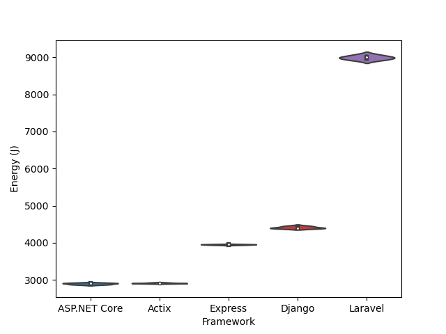
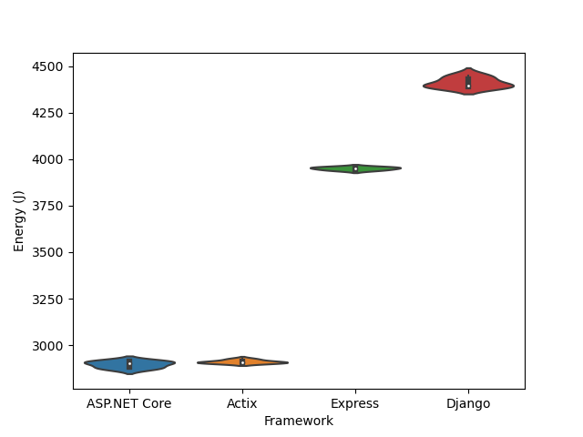

## Introduction

The number of internet users has grown rapidly over the past years to a
staggering 5.3
billion.[^1]
They browse, visit websites and interact with applications. It is incorporated
in daily life; the internet, once a luxury, has become commonplace. In the
background, invisible to the average user, a large infrastructure aims to
maintain the needs of the users. To support the rising demand, the required
server capacity increases. It may sound obvious, but the servers need energy to
keep the numerous processes running. While it would be interesting to establish
a holistic overview of the infrastructure behind the internet, the scope of
that is beyond what is feasible for this project. Even though considering the
total energy consumption is infeasible, we can look into specific parts of the
overall infrastructure. One of the parts that plays an important role is the
web frameworks used.

As applications become more sophisticated and more complex, they are also
optimized with regards to performance. Since it has been shown that higher
performance of web applications result in higher revenue,[^2] for instance
due to faster loading speed of web pages, corporations have a financial
incentive to further improve performance. Yet, the environmental aspect is cast
in shadow and is generally not one of the main motivators during the software
development process. There is little awareness of the impact software can have
on energy usage and a lack of attention persists with regards to increasing the
software developers’ understanding of the energy usage of the software they
develop. This is odd, seeing as the want of better performance is partially
driven by financial incentive; minimizing energy usage could potentially cut
costs too.

Therefore, rather than focusing on analyzing the performance, we take a closer
look at the energy consumption of several web application frameworks. Not only
does this allow for analyzing the relationship between performance and energy
consumption, it also allows for casting a light on potential energy consumption
outliers. Thus we have decided to compare the energy consumption of various
web application frameworks.

## Methodology

From the question, there are two main aspects we need to consider: how to
measure energy consumption and which frameworks to choose.

Energy consumption has to be measured. Since inspecting the hardware directly
by means of probing is not feasible, we have to rely on other options. Software
tools allow for measuring energy consumption without the need of invasive
actions. In order to measure the energy consumption of the frameworks, group
member Aaron developed a tool for measuring the power consumption of CPUs using
RAPL (Running Average Power Limit) counters, the source code of which can be
found on his GitHub.[^3]. This is a piece
of software that analyzes the average power consumption per CPU package over a
given time interval. There are a couple of caveats involved in measuring power
consumption using this tool, however. First, it measures the overall power
consumption. This means that besides the power consumption of the specific task
we want to measure, background tasks are included as well. They thus cause
noise in the data. The tool cannot, and is not expected to be able to, measure
a specific task, thus this issue has to be approached differently.

This means that we have to create an environment that ensures, or makes it more
likely, that the data obtained contains as little noise as possible, as energy
consumption tests are inherently flaky. Therefore, the confounding factors have
to be minimized. The way we achieve this is by means of zen mode. In this mode,
all other applications are closed, notifications are turned off, only the
required hardware is connected, and finally, all unnecessary services are
stopped. Other factors that may influence the results are the settings with
which the tool is run. For instance, since the experiments take a couple of
hours to complete, brightness could change if it were set to adapt to the time
of day. Consistency is required, and thus all settings are fixed during the
execution of the tests. Besides that, the room temperature is set such that it
does not fluctuate significantly in order to minimize its impact on the
results.

There is another factor that may influence the results, namely that of the
temperature of the hardware itself. Temperature difference will influence the
results and one way to solve this is by ensuring that the CPU has warmed up
prior to running the tests. To warm up the CPU, a CPU-intensive task (such as
computing a sequence of Fibonacci numbers) is run for one minute.

Furthermore, since we are conducting multiple tests in succession, tail energy
consumption has to be taken into account. The solution to this problem is
simple: add a delay between executions. This ensures that preceding tests do
not influence the next. Likewise, a delay is also added to accommodate the test
setup in every iteration.

TechEmpower, an IT consultancy firm, have since 2013 published 21 editions of
their TechEmpower Web Framework
Benchmarks (TFB),[^4] a
benchmark comparing the performance of various web frameworks. TFB, however,
does not consider said frameworks’ energy consumption. Since we argue that the
environmental perspective should also be taken into account during the
development of web applications, we decided to reuse a select few of the Docker
containers used in TFB and run one of the benchmarks whilst also measuring the
energy consumption. The benchmark we have chosen is JSON deserialization, a
common task for any framework that receives data, whether from an user or an
API.

The actual testing was done in the following way: for each framework under
test, we started a Docker container, gave it 5 seconds to get started, applied
15 seconds of light load (500 RPS (requests per seconds) with 16 parallel
connections) as warm-up, before subjecting it to 2 minutes of benchmark load
(3000 rps / 100 parallel connections). Finally, we allocated 10 seconds for
tail power usage measurements. The load tester (the program making the
requests) was run on a separate machine. The full test setup, including the
powertool and TFB benchmarks as submodules, can be found on team member
Jasper’s GitHub.[^5]

In order to narrow the scope of this project, a small subset of the frameworks
tested in TFB had to be selected. With the intent of maximizing the relevance
and variety of this report, we chose the following frameworks: Express
(JavaScript), Laravel (PHP), ASP.NET Core (C#) Django (Python) and Actix
(Rust). Our choices are influenced by the results of the 2022 edition of the
Stack Overflow Developer Survey,[^6] a survey with 73,268 responses, of which 73%
claim to be developers by profession. Even though the validity of the survey’s
responses cannot be verified, it still provides a decent approximation of the
current landscape of technologies in use. According to the survey, Express is
used by 23.19% of professional developers and is thus the fourth most popular
web framework, beaten only by Node.js (on which Express is based), React.js and
jQuery. Furthermore, given that Node.js is a runtime and not a framework per se
and that React and jQuery are frontend frameworks, Express can be viewed as the
most popular backend web framework on the list. Laravel, on the other hand, is
used by 10.3% of professional developers, which positions it just outside the
top ten. If we filter out all JavaScript-based frameworks, however, Lavarel is
in fifth place, only beaten by ASP.NET Core, ASP.NET, Django and Flask.
Considering that PHP is used by 21.42% of professional developers, making it
the 9th most popular language, Laravel seems like an apt choice. ASP.NET Core,
being the most popular non-JavaScript framework and sixth overall, was an easy
choice. Django was chosen for similar reasons: it’s the most popular Python
framework, and the tenth most popular overall. The final framework, Actix, is
more of a wildcard; it is a fairly young framework (development started in
2018) and does not appear in the survey. Rust, Actix’s implementation language,
however, is heavily featured: for the seventh year in a row, Rust is found to
be the “the most loved language with 87% of developers saying they want to
continue using it.” It is also the “most wanted technology”, meaning 17.6% “of
developers who are not developing with the language or technology […] expressed
interest in developing with it”. Hence, Actix is chosen in order to investigate
what energy efficiency gains (if any) can be made from actually making the
switch to one of these “wanted” technologies; if energy consumption is reduced
whilst also increasing developer satisfaction and the application’s
performance, the gains of the technology switch are threefold.

## Results[^7]

|  |
|:--:|
|Figure 1: Violin plot showing the different frameworks’ energy consumption in joules.|

All frameworks showed little to no variation in energy consumption across test
iterations. In fact, Laravel and Django were the only ones with any noticeable
variance, having a standard deviation of ~55 J and ~28 J respectively.

| Framework    |  Mean (J)      | Std (J)       | Min (J)     | Max (J)     |
| ------------ |  ---------     | ---           | ---         | ---         |
| ASP.NET Core |  2896.624      | 18.313332	    | 2873.05     |	2915.23     |
| Actix	       |  2911.244      | 9.214091	    | 2903.44     |	2925.94     |
| Django	   |  4412.538      | 27.514346	    | 4391.28     |	4452.36     |
| Express	   |  3951.104      | 8.249041	    | 3939.64     |	3960.16     |
| Laravel	   |  8992.206      | 54.808731	    | 8922.84     |	9069.24     |

## Discussion

From the results, it’s evident that energy consumption varies quite a lot
between frameworks, with one of them landing solidly in last place; in
comparison with every other framework, Laravel consistently uses at least twice
the amount of energy – in the case of Actix and ASP.NET Core, Laravel is three
times as energy-hungry. Some of this can be excused by pointing out that PHP is
an interpreted rather than compiled language, but so are Python and JavaScript,
and Laravel is outshined by both Django and Express.

|  |
|:--:|
|Figure 2: Violin plot excluding Laravel results.|

The extreme outlier of Laravel somewhat disguises the differences between the
other frameworks, so it’s constructive to do a separate plot without it. Here
the trend is much clearer: the compiled, statically typed languages (C# and
Rust) consistently outperform the interpreted, dynamically typed ones
(JavaScript and Python) by 24–34%. Differences in energy consumption between
ASP.NET Core and Actix are virtually nonexistent. If energy consumption is the
only metric that matters, our results speak quite plainly: use a compiled
language, and if you have to use an interpreted language, don’t use PHP. That
said, there are, of course, other factors which tend to determine the choice of
programming language and framework: interpreted languages are often chosen for
the simplicity and velocity of development they can offer, whereas compiled
languages tend to enter the discussion when performance becomes a priority.
These results suggest that energy efficiency can add to the argument for
compiled languages.

## Limitations

As stated earlier, the scope of this project is limited; ideally, we would have
measured the energy consumption during every TFB benchmark for every framework.
That is, however, a task on a wildly different scale than the one of this
project. Using a single test potentially also hides the different frameworks'
strengths and weaknesses; the frameworks might perform differently in other
tests. For a more accurate result we would have also wanted to run these tests
30 times each, allowing us to show statistical significance, 5 runs of each
test however limits the accuracy of this evaluation metric. One thing that
should be taken into account is that limiting the analysis of energy
consumption to only the framework(s) is not sufficient to determine the energy
consumption of websites, as the framework is usually one of many moving parts;
a given website will usually sit behind a web server/proxy (e.g. Apache,
nginx), potentially behind some cache (e.g. Varnish), and talk to a database of
some kind (e.g. PostgreSQL, SQLite). Still, frameworks are part of the equation
and worthy of consideration.

## Conclusion

In this paper, we attempted to measure and compare the energy consumption of a
select few web frameworks. We found there to be measurable differences in the
energy consumption of different web frameworks. Although we did not have time
to be able to show statistical significance, our experiment indicates that
there’s a good chance future work should be able to do so. In conclusion, we
found energy consumption to be an additional reason to pick a framework
utilising a compiled, statically typed language rather than an interpreted one.

## References

[^1]: [https://www.statista.com/topics/1145/internet-usage-worldwide/#topicOverview](https://www.statista.com/topics/1145/internet-usage-worldwide/#topicOverview).
[^2]: G. Pinto and F. Castor, “Energy efficiency,” Communications of the ACM, vol. 60, no. 12, pp. 68–75, Nov. 2017, [doi](https://doi.org/10.1145/3154384).
[^3]: [https://github.com/AaronvDiepen/rapl-powertool](https://github.com/AaronvDiepen/rapl-powertool).
[^4]: [TechEmpower Framework Benchmarks](https://www.techempower.com/benchmarks/#section=data-r21).
[^5]: [https://github.com/Jager567/Framework_Energy_Benchmark](https://github.com/Jager567/Framework_Energy_Benchmark).
[^6]: [Stack Overflow Developer Survey 2022](https://survey.stackoverflow.co/2022/).
[^7]: The code for visualizing and describing the results can be found in [this gist](https://gist.github.com/olepbr/7de38f9c45ec6683661cbdffc6984f4f).
