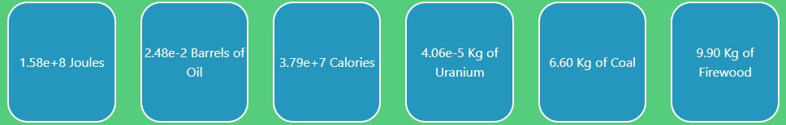
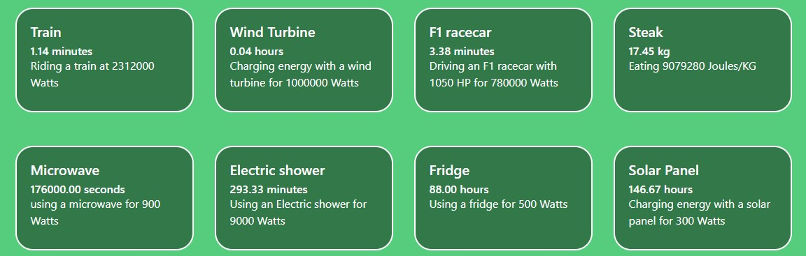

## 1 Introduction

Due to climate change and the energy crisis, reducing energy consumption becomes more important every
day. Understanding energy consumption, and finding possibilities for reducing our energy use, is important
both on an individual level and on a governmental level.
On an individual level, it is important for people to reduce their energy consumption to decrease global
pollution and individual costs. For sustainability-minded individuals, limiting their energy consumption is
an important part of reducing their carbon footprint. Since the majority of energy consumed in the world is
still powered by fossil fuels [22], sustainability-minded individuals will want to limit their energy consumption
as much as they can, to limit their impact on the environment.
Another important aspect for individuals is the fact that energy bills are a big part of their expenditures,
especially during the current energy crisis. A better understanding of how much and where energy is being
used can help reduce their costs. However, there are so many ways to reduce your energy consumption that
sometimes, it is hard to know where to start and how much effect your action has. Do you reduce your
energy consumption by only showering 5 minutes a day if you still leave all the lights on the house? All this
information can be found online, but searching for all data and comparing it takes too much time. Besides,
you need to have some background knowledge of energy, since will need to be able to convert between
different units of energy, for example, watts, kWh, joules, and calories.
On a governmental level, understanding energy consumption is important, since policymakers need to
have an accurate understanding of this domain to ensure a smooth transition to cleaner energy sources.
For example, based on an accurate understanding of energy consumption in their community, policymakers
can identify areas where energy savings are possible, and implement laws and policies that promote energy
efficiency.

## 2 Literature review

In the current situation, there are plenty of digital energy conversion tools that allow someone to convert a
unit of measurement to a desired second unit of measurement. However, there appears to be no such tool
that also demonstrates the context of what this unit of measurement means. This is a missed opportunity for
awareness of sustainability. For someone who is unfamiliar with the research field of sustainability, isolated
units of measurement are not sufficient for getting insight into this topic. If a policymaker learns that the
energy consumption of a certain industry is estimated to be around 5 GW, this will not give an insight into
the size of the energy consumption.
Several works over the years have focused on improving the energy literacy of consumers. Questionnaires
on these topics show that the awareness of the topic can be surprisingly low. For example, research showed
that only 36% of Americans were aware that the majority of their power was produced with coal, while
another 36% believed their power was mostly created with hydroelectric energy [7]. In a more recent study,
researchers found that more than 4 out of 10 Americans could not name a renewable energy source, while

over half of them believed that nuclear energy would contribute to climate change [16]. In order to make
informed decisions, both on a policy level as well as a consumer level, a more intuitive solution is needed. As
specified in [17], there are multiple definitions that are used in different fields. In this paper, they propose new
terminology to be able to differentiate between the levels of awareness. The author describes that consumers
typically underestimate the power usage of household appliances, which in turn leads to an underestimation
in their own power consumption. Upon examining other research, she refers to an anchor-and-adjustment
technique, where a watt value is specified for a light bulb and the person being interviewed has to guess
how much another household appliance would consume. Since the person being interviewed has no frame of
reference for the unit of measurement, they are consequently ill-informed about the scaling of this unit of
measurement.
Public understanding and literacy of science have always been difficult to obtain, even decades ago [26].
Looking at more current studies, we still see that the general public has difficulty assessing risks in [23].
Here, we see that the general public has difficulty dealing with systemic risks such as climate change. Not
only do they have trouble conceptualizing the magnitude of a problem, but they also are less susceptible
to the advice that experts give. Furthermore, we can see that they have trouble identifying and deploying
adequate risk strategies. This seems to be confirmed by [?], where the prioritization presented in finding 4
shows that although awareness of a problem is there, the respondents do not prioritize this risk over other
obstacles in their daily lives, which is likely due to the scope of the problem and its lengthy timeline.
This research does show that the general consumer has little knowledge of what the typically used units
of measurement mean and the effects of behavioural changes on climate change. Existing tools do allow for a
conversion of measurements but rarely opt to give an insight into the meaning behind units of measurement
and especially their scaling. To provide further intuitive guidance on what these units mean, additional
tooling would be helpful. This could work twofold. Firstly, readers of articles and reports could encounter
an unknown unit of measurement and use this tooling to obtain a clear frame of reference to be able to gauge
what these measurements mean. And secondly, researchers could help the reader relate their measurements
and impact by providing these more intuitive conversions within their research. This in turn could make
research more accessible with a lower barrier of entry.

## 3 Explanation of our solution

To fulfil the issues that are stated in the introduction, we have built a simple web application named
’EnergyConversion’. This web app contains a basic interface where the users can convert energy types into
other energy types. For example, the user can convert calories into KWh. When a user converts the energy,
it also sees what the user could have done with this energy. So for 44 kWh, the user could have been riding
a train for 1.14 minutes.

### 3.1 Functionalities

The functionalities are pretty simple. The user can input a number and select an energy type. See figure 1.
When a user changes the number or the energy type. The web app automatically gets reloaded. Therefore,
the user does not have to press a button or anything.

|  |
|:--:|
|Figure 1: Energy Conversion Input|

After the user has selected its input, the converted energy types are shown. The example of 44 kWh
can be seen in figure 2. Since some converted numbers can be extremely large, the numbers are shown in a
scientific notation.

|  |
|:--:|
|Figure 2: Energy Types|

Below the converted energy types, the user sees examples of things that use the same energy as the
energy converted by the user. An example is shown in figure 3. The examples are sorted by how helpful
the examples are. For example, it is not very useful to know that for 100 calories, you can ride the train for
0 seconds. The sorting is done by giving numbers that are really low or high the lowest priority. For some
examples, the data may not always be accurate due to context. This is further explained in chapter 7. The
explanation of how these examples are calculated is shown in chapter 4. This information is also visible to
the user by clicking on the button ’Where did we get this data’.

|  |
|:--:|
|Figure 3: Energy Conversion Examples|

The website can be viewed on:https://zegermouw.github.io/EnergyConversion

## 4 Review of existing metrics

### 4.1 Microwave

Upon researching various appliances websites, such as Coolblue [13], bol.com [11], or Amazon [9], we con-
cluded that microwaves typically have a maximal wattage within the range of 700-1000 watts. From these
websites, we also observed that a microwave has a median wattage of 900 W. Therefore, we have opted for
900 W as the default option for the comparison.

### 4.2 Showering

Showering is a more challenging activity to get an accurate value for since this is partly dependent on the
boiler you are using. To isolate this problem, we have chosen to base our estimation on electric showers.
Electric showers have a dedicated tank that they heat using an electric heating component. The inner
workings are similar to a kettle. After researching various websites [10] [14], we figured that an electric
shower has a typical power consumption of around 9000 W, or 9 kW, within a range of 8-10 kW. This also


allows for a different magnitude of measurements to be compared to this, as we are one order of magnitude
bigger than with the microwave example.

### 4.3 Train

For a train, we have opted to choose between the different Dutch trains, as they have to build specifications
that can be found online [12]. These trains can range from 1400-2400 kW, with most recent trains hovering
around 2000 kW. This again falls into a new magnitude and is a comprehensible example of energy usage.

### 4.4 Rocket

The rocket is a more challenging example, as most rocket engines measure their functionality in terms of
lift. However, these can be converted back into wattage. In this example, we have picked the rocket that
has launched people to the moon, the Saturn V rocket. This rocket can produce a wattage of around 60000
MW [8], the most significant wattage currently on the list.

### 4.5 Refrigerator

We used an American-style refrigerator as a reference for our comparison. This refrigerator differs from
typical refrigerators in that it is much bigger and contains multiple doors. Therefore, its wattage is higher
than an average European refrigerator: 500 W [20].

### 4.6 Windmill

For gathering information about windmill wattage, we consulted the information provided by a windmill
operator in the Netherlands, which stated that the average windmill in the Netherlands has a wattage of 1
MW [28]. We assumed that the windmills used in the Netherlands are similar to other windmills used in
the world, or at least similar to the ones used in the Global North. Thus, we used 1 MW as the wattage for
windmills.

### 4.7 Solar panel

Solar panels are available in a wide range of options, so it is essential to be clear about which solar panel
we use. For our application, we used a 300 W solar panel in our calculations, which is comparable with the
solar panels that are on the market today since these have a range of 250 to 400 watts of power [21]. Since
we assume that most consumers will not have a high-end solar panel, we have opted to use 300 W in our
calculations instead of 400 W.

### 4.8 Kilogram of beef

For beef, we consider the calorie intake that eating a kilogram of beef would get you. An alternative would be
the amount of energy stored as described inE=m∗c^2. However, most people think of calorie intake when
considering meat intake. While the estimates vary, they typically stay in the range of 2000-2500 calories per
kilogram of beef [1] [2]. If we convert this with our tool, we get a range of 8000 to 10500 kJ. Again, we will
go for an average rate of around 9000 kJ per kilo of beef consumed. This rather unique comparison option
in our list makes it possible for consumers to estimate how a tradeoff would look: ”Do I do an activity that
consumes a certain amount of energy, or would I rather have some beef instead?”

### 4.9 F1 car

An F1 car is also an intuitive way to represent a large amount of power. An F1 car engine has around 1050
horsepower [4] [15]. We can convert this to around 780 kW. Although this is not the highest it has been in
Formula One history [5], it is the most recent value and, therefore, the most accurate value to use here.


### 4.10 Rowing

For rowing, we have two types of rowing that can be considered: Aerobic rowing and sprint rowing. Aerobic
rowing mainly uses your aerobic systems to provide power, while sprint rowing dramatically relies on your
anaerobic systems. Your anaerobic system can deliver more power and are able to generate near-instant
power. However, this system quickly runs out of energy, as the molecules that have their own oxygen stored
within are quickly depleted. After this, your body will have to rely on the aerobic system, which requires
oxygen supplied by your circulatory system. Power output changes from person to person and mostly
depends on your mass. For the average human, the power output is around 300 W. For the average woman,
which weighs around 65 kg, the sprint rowing produces around 300 W. For a man, who is typically heavier
with an average of about 85 kg, the sprint rowing output is up to 400 W [3]. We will take the upper band
of the average woman, so for this metric, we have selected 300 W, as it is more inclusive since this value is
reachable by a majority of people.

### 4.11 100-meter dash of Usain Bolt

As described in [6], the peak power output delivered by Usain Bolt for his world record is 2600 W. This
peak power output is reached at the beginning of the race, at around 0.89 seconds. Upon diving more
profound into the mechanics of the 100-meter dash, we have discovered that the theoretical upper limit of
power output can be significantly higher, around 4400 W [24]. For the average human, the power output is
significantly lower, at around 60 W per kg of body weight, which would theoretically total 4200 W of output
for an average weight of 70 kg. This is a theoretical limit not typically achieved by the average human. Just
like sprint rowing, mentioned in??, the 100-meter dash greatly relies on the anaerobic system to deliver the
energy needed to do the exercise. This is due to the explosiveness and having only limited oxygen intake,
which alone would be insufficient to supply the energy needed.

### 4.12 Tour de France cyclist

For the Tour de France, power output is regularly measured to check the performance of participating
cyclists. The most power is generated in the sprints, which typically happen at the end of the race. For
example, Mark Cavendish, holder of the English record for most Tour stages won [6], produces an output of
1500 W in these final sprints, which can result in speeds of over 70 km/h.

### 4.13 Air conditioning

Air conditioners use an enormous amount of energy when they are in operation. Energy consumption of air
conditioners varies between models, from 500 to 4000 watts of energy. [25] For our calculations, we took the
rough average of this range, which is 2000 watts. We also assumed that the air conditioner is running at full
power, which is an important assumption since air conditioners go through a number of on/off-cycles each
hour, which means that they will use less power than the power stated “on the box” [25].

### 4.14 Cheetah top speed

For our information on the wattage of a cheetah running at top speed, we relied on [27], which has calculated
the locomotion dynamics of cheetahs in Botswana using GPS. With that research, they found that the
cheetah has a top speed of 93 km/h.

### 4.15 Cube of solar matter

All energy on Earth can ultimately be traced back to the sun, so we thought it would be an interesting
metric to compare the energy used to the power produced by one cubic metre in the core of the sun. We
found that the core of the sun has a wattage of 275 W, based on the information provided on the website of
the Library of Congress [18].


## 5 Design rationale

For our design rationale, we focused on the intuitiveness of the application. To enable this, we try to adhere
to the KISS principle, making it as easy as possible for users to extract the information or knowledge they
need. We started out with a simple minimum viable product. The feedback that we got was that it was
still too complex. The website was still cluttered, and our mission then was to give it a more structured
approach. Besides, we used a web app with Express to calculate the energy conversions. This was too
complex for a simple application. To get this result, we created a simple static website with not too many
buttons and components. This way, the amount of information that is presented is not overwhelming. After
this, the user needs to be able to easily search for the information that it wants. In the background, we
have a multitude of metrics that we can compute. Our objective then is to order these metrics such that the
visitor of the website has a captivating example presented to them. So we order these metrics in such a way
that the numbers associated with a certain metric are not small or large, because these orders of magnitude
are not beneficial for the website visitor.
With these changes, the user can easily convert their energy, and the website only uses 0.03g CO2 per
visitor^1.

## 6 Reception in relevant communities

In order to understand how people would use our tool in an everyday setting, we shared our web app with
a few relevant communities and asked them to try out the tool and give us some feedback on it. The
communities where we shared our web app were:

- https://climateaction.tech/: a community enabling climate action for tech workers, we shared our
  web app on their Slack channel
- https://www.reddit.com/r/sustainability/: a subreddit dedicated to sharing news about sustain-
  abiligy
- https://www.reddit.com/r/Green/: a subreddit for “issues relating to Green issues, including (but
  not limited to) Green Politics.” [19]

We got reactions on our Reddit posts in the relevant communities, the main points of which are listed
below. Unfortunately, we did not get any responses to our post on the Slack channel of ClimateAction.Tech.
Fromreddit.com/r/sustainability/, we got the following feedback:

- It would be useful to explicitly state the use cases on the website, to enable people to easily use our
  tool in everyday scnerio’s
- Integrate a third party plug-in with ChatGPT so that users can conversationally utilize its abilities.
  (Similar to Wolfram Alpha plugin allowing ChatGPT users to do calculations)


From reddit.com/r/Green/, we got one detailed comment, including multiple points of feedback:

- Use of upper-case “Calorie” to mean small calorie/”thermochemical calorie” rather than large calo-
  rie/kcal is confusing for laypeople
- You might want to give some examples of common/intuitively understandable energy inputs for people
  to try
- Let users use more accessible units as inputs. Very few people walk around having an intuitive under-
  standing of how much a joule is, but a lot of people might be interested in inputting ”hours driving a
  car” or ”days of running a desktop computer.”

(^1) https://www.websitecarbon.com/


- Implement unit conversion so that 1672000.00 seconds are shown as hours

All the comments seemed enthusiastic about the idea behind website, which is motivating. We will try
to implement some of the feedback above after we have finished the course.

## 7 Discussion

With our application, we have opted to create more understanding and awareness on the different energy
units of measurement and how we can more intuitively convey their meaning with more relatable terms.
Although this has benefits, it is also limited in changing its mindset. It requires the user to actively search
for the website upon stumbling on a measurement that the user wants to learn about. Active promotion
could increase this and can always be expanded upon.
From the other perspective, researchers that want to add this type of comparison would probably find
it to be infantilizing to their readers. Typically, they will write for conferences and for their peers. The
reviewers would disapprove of using such comparisons or languages in these scenarios. They would not be
considered scientific since they are oversimplistic in a research setting and would require more intensive
backing from additional sources.
In terms of the application, we need to note that the values we have chosen are typically averages within
a range. There is a variety of solar panels available for the consumer, which differ in their power production.
The same variety can also be found within exercising, where individuals have different power outputs for a
given exercise. While we could opt to provide a range, we found it preferable to simplify this in order for it
to be more accessible to the general public. Ranges, while helpful in conveying the spectrum of options, are
less likely to be immediately evident.
Lastly, we could also expand upon our measurement units. Expanding upon this allows for more relevant
comparisons, as we could sort these upon relevancy per user query. For now, we mainly focus on Joules
and its equivalents. mAh would be a unit of measurement that is typically abstract to a user and would be
searched for often. Adding this in a later stage would allow for more explanations.

## References

```
[1] Beef 101: Nutrition facts and health effects.https://www.healthline.com/nutrition/foods/beef#
nutrition.
```
```
[2] Calories in 100 g beef.https://www.nutritionix.com/food/beef/100-g.
```
```
[3] Everything you need to know about the watt - rowstudio.
```
```
[4] F1 car horsepower: How much do they really have? - flow racers. https://flowracers.com/blog/
f1-car-horsepower/.
```
```
[5] The incredible evolution of formula 1 horsepower — track evolution - youtube.https://www.youtube.
com/watch?v=9LK8hCsgd3U.
```
```
[6] Revealed: The science behind usain bolt power burst used to the 100m world record — the independent
— the independent.
```
```
[7] A risk to our energy future why america needs a refresher course on energy.
```
```
[8] Nasa - saturn v.https://www.nasa.gov/centers/johnson/rocketpark/saturn_v.html, 2011.
```
```
[9] Amazon.com : Microwave ovens. https://www.amazon.com/Microwave-Ovens-Small-Appliances/
b?node=289935, 2023.
```
```
[10] Electric shower guide for buyers. https://www.plumbworld.co.uk/blog/
electric-shower-buying-guide, 2023.
```
```
[11] Magnetron kopen? alle magnetrons online — bol.com. https://www.bol.com/nl/nl/l/
vrijstaande-magnetrons/48279/, 2023.
```
```
[12] Materieel — over ns — ns.https://www.ns.nl/over-ns/treinen-van-ns, 2023.
```
```
[13] Solo magnetron kopen? - coolblue - voor 23.59u, morgen in huis. https://www.coolblue.nl/
magnetrons/solo-magnetrons/magnetronvermogen:-899, 2023.
```
```
[14] Triton elektrische douches – elektrische douches. https://milli-elektrische-douches.com/
triton-elektrische-douches/, 2023.
```
```
[15]Berets, I.F1 car horsepower: This is how much power the engine has 2023.https://formulapedia.
com/f1-car-horsepower/.
```
```
[16]Bittle, S., Rochkind, J., and Ott, A.The energy learning curve™coming from different starting
points, the public sees similar solutions the energy learning curve™coming from different starting points,
the public sees similar solutions a report from public agenda by, 2009.
```
```
[17]Broek, K. L. V. D.Household energy literacy: A critical review and a conceptual typology.
```
```
[18]Cohen, H.Layers of the sun. Web Archive, 2001. Accessed on April 1, 2023.
```
```
[19]Cohen, H. reddit.com/r/green. https://www.reddit.com/r/Green/, 2023. Accessed on April 14,
2023.
```
```
[20]EnergySage. How many watts does a refrigerator use? https://news.energysage.com/
how-many-watts-does-a-refrigerator-use/, 2021. Accessed on March 30, 2023.
```
```
[21]EnergySage. What is the power output of a solar panel? https://news.energysage.com/
what-is-the-power-output-of-a-solar-panel/, 2022. Accessed on March 30, 2023.
```
```
[22]in Data, O. W. Energy production consumption. https://ourworldindata.org/
energy-production-consumption, March accessed 2023. Accessed on March 28, 2023.
```
```
[23]Klinke, A. Public understanding of risk and risk governance.Journal of Risk Research 24(2 2020),
2–13.
```
```
[24]Majumdar, A. S., and Robergs, R. A.The science of speed: Determinants of performance in the
100 m sprint.International Journal of Sports Science Coaching 6(2011).
```
```
[25]Marsh, J. How many watts does an air conditioner use? https://news.energysage.com/
how-many-watts-does-an-air-conditioner-use/, 2022. Accessed on April 1, 2023.
```
```
[26]Miller, S. Public understanding of science at the crossroads. Public Understand. Sci 10 (2001),
115–120.
```
```
[27]Wilson, A. M., Lowe, J. C., Roskilly, K., Hudson, P. E., Golabek, K. A., and McNutt,
J. W.Locomotion dynamics of hunting in wild cheetahs.Nature (London) 498, 7453 (2013), 185–189.
Place: LONDON Publisher: Springer Nature.
```
```
[28]Windcentrale. Hoeveel energie levert een windmolen op? https://www.windcentrale.nl/blog/
hoeveel-energie-levert-een-windmolen-op/. [Accessed: March 30, 2023].
```
