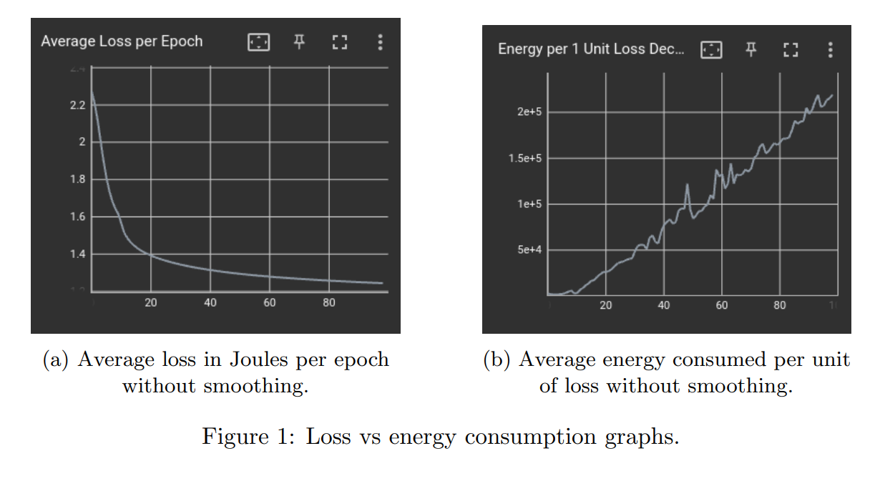
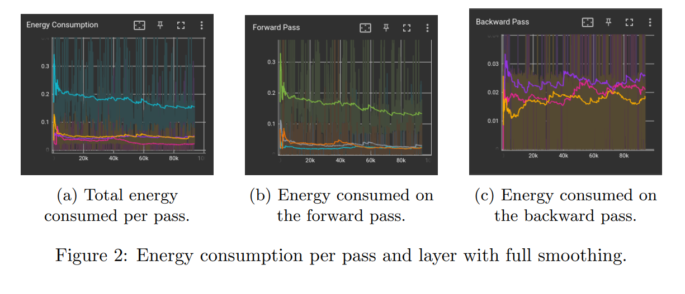
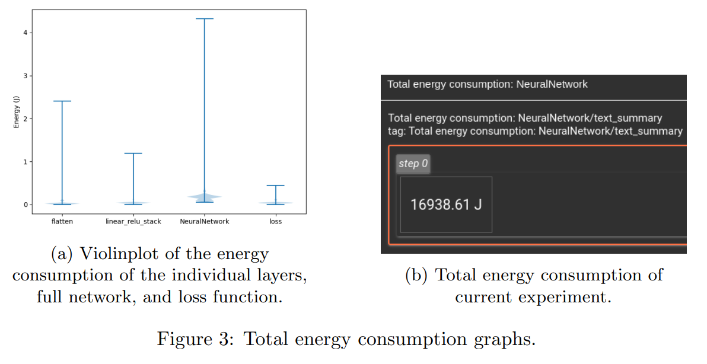

Introduction
============

In today's world, environmental challenges are a growing concern.
Addressing these challenges begins by increasing awareness of energy
consumption. This is especially relevant for the IT sector due to the
increasing energy demand [5]. Machine Learning (ML)
algorithms are known to consume a considerable amount of energy
[4]. Although there has been a recent surge in
sustainable software research and tools to measure or reduce energy
consumption [8], more extensive research efforts are
necessary. Large ML frameworks do not directly integrate energy and
carbon reporting tools, which means that developers are required to rely
on third-party tools. The available tools are often designed to report
the total energy consumption of the whole training loops, larger
programs or system-wide measurements. This means that with current
tooling ML developers cannot easily identify energy-intensive parts of
their models or specific in-depth energy consumption information.

We propose GATorch, a new energy-aware PyTorch framework extension.
PyTorch is the most commonly used ML and Deep Learning (DL) tool and the
primary choice for research experiments. The tool performs low-level
measurements that provide in-depth information about the energy
consumption of the model's training per layer. GATorch is seamlessly
integrated with PyTorch and generates a default report in Tensorboard
that gives an ML developer direct insight into the specific energy
consumption of their model.

This extension is targeted at ML engineers and researchers who may not
be aware of the energy impact of their ML pipeline. This solution can
create awareness due to its seamless integration and more complex
insights about the energy consumption of their model to potentially
reduce the model's consumption. We hope GATorch can encourage other
developers and other ML frameworks to implement their energy-aware
functionalities or improve the proposed solution.

GATorch can contribute to reducing some of the emissions from ML
development by creating awareness in the field of AI for sustainable
software engineering about their actual consumption and providing
insights for the developers on how to intelligently reduce energy
consumption.

We start discussing the related work in the field of Green AI and
measuring energy consumption. We then explain what functionality GATorch
provides and discuss relevant design choices. We then show the resulting
implementation of GATorch, followed by a discussion of its limitations
and future work.

Related Work
============

There is increasing effort in raising awareness for best environmental
practices in [Green AI](https://github.com/daviddao/green-ai), such as loose estimators like [ML CO2 Impact](https://github.com/mlco2/impact/) [6] or static analysis plugins like [EcoCode](https://github.com/green-code-initiative/ecoCode). Here, we
present a more in-depth measuring tool that seamlessly integrates with
an existing ML framework. To understand the architectural design choices
we needed to make for our proposed solutions, we investigated existing
related work. This section briefly describes the existing popular ML
frameworks and the different types of energy consumption measurement
tools it can use. Finally, we identified a gap in the current methods.

Many ML frameworks exist today, but PyTorch is arguably the [most commonly used](https://trends.google.com/trends/explore?geo=US&q=tensorflow,pytorch,scikit-learn). [PyTorch 2.0](https://pytorch.org/get-started/pytorch-2.0/) was recently released and introduces
module hooks that allow for code injection into the different layers and
passes of a user's model. TensorFlow is a direct competitor but does not
offer the same functionality, which increases the difficulty of
integrating an energy consumption measurement tool. scikit-learn is
smaller and somewhat different but still does not offer the same
extensibility as Pytorch.

There also exist several energy consumption measuring applications, but
most rely on the same features such as using Intel's RAPL and NVIDIA's
NVML for their data. Firstly, [CodeCarbon](https://github.com/mlco2/codecarbon) is a complete application
for measuring applications with longer run times and provides a large
dashboard with much information about the overall consumption.
[Eco2AI](https://github.com/sb-ai-lab/Eco2AI) provides similar measurements and estimates its equivalent
carbon emissions and saves this data to a file [2].
[Carbontracker](https://github.com/lfwa/carbontracker) is specifically designed for tracking and predicting
the energy consumption of the training of deep learning models and can
measure the consumption per epoch [1]. This permits the
plotting of energy usage in relation to the loss value. However, this
has not yet been implemented, and each of the beforementioned measuring
applications introduces a large time overhead when starting or stopping
measurements and can therefore not be used for smaller measurements.
[PyJoules](https://github.com/powerapi-ng/pyJoules) is simply a small wrapper around RAPL and NVML, which means
this application can be used for smaller measurements [9].

We identified in this related work that the current efforts into Green
AI are small-scale and generalizing. Most energy consumption measuring
applications work on a system or complete training level. The current
research is missing an application that can identify energy consumption
measurements more in-depth by looking at individual system components
and model elements, such as data loaders, utility functions, and
individual layers and passes. It needs to be seamlessly integrated with
existing ML frameworks and present the measurements in effective ways,
which allows ML developers more insight into their energy consumption
(over time) and reduces possible wasteful practices.

Methodology
===========

GATorch can provide more in-depth measurements than most other tools for
ML model training. In this section, we present how GATorch works. We
explain how we implemented our solution, explain the possibilities of
GATorch and the reasoning behind our design decisions.

GATorch utilizes hooks to add measuring functionality to the PyTorch
library. PyTorch offers two types of hooks, the forward and backward,
which respectively execute on the forward and backward passes of the
model. The energy consumption is measured per individual pass call and
layer, and the data is stored separately. The separation of this data
allows the user to get an in-depth insight into the energy consumption
of the entire process.

On top of that GATorch provides the user with the ability to choose
between multiple energy profilers. Currently, the library only provides
support for PyJoules, because of the large overhead of any other
measuring library, but it can be easily extended to add support for
other energy profilers.

Lastly, the library's main goal is to inform ML developers of the energy
consumption of their model's training. GATorch does this by showing
relevant visualizations and aggregated scores in a dashboard. GATorch
exports the graphs and aggregations to [Tensorboard](https://www.tensorflow.org/tensorboard), which is a
commonly used visualization dashboard for ML workflows. We chose this
tool as ML developers might already use it for plotting other metrics of
their models and this would then seamlessly integrate with those metrics
to give them a complete overview. GATorch provides these plots
separately too, allowing users to tweak them or use them in any other
dashboard configuration.

There are various ways to graph the collected data. By measuring the
passes and layers individually, we can generate plots that show their
relative impact. This allows the user to gain insight into the relative
energy consumption per layer and make choices with that information.
Another plot GATorch generates is the energy consumption compared to the
loss value. This could indicate to a developer that the model at a
certain point does not gain as much performance, while continuously
using energy. Lastly, for completeness, GATorch displays an overall power
consumption value.

Results
=======

Our project is publicly available on [GitHub](https://github.com/GreenAITorch/GATorch) under the MIT license.
ML developers are invited to use the tool and provide contributions. To
show the effectiveness of GATorch, we ran an exploratory experiment on a
Ubuntu 22.04 machine with an NVIDIA RTX 3080, 5th gen Intel CPU and 16GB
of RAM on the **FashionMINST** PyTorch tutorial with 100 epochs (ran
approximately 30 min). We briefly analyze the generated results.

In Figure 1, we show the default Tensorboard graphs that GATorch
generates. The first graphs show the average loss per epoch followed by
the average energy consumed per unit of loss. We observe that due to the
decrease in loss per epoch due to staggering performance improvements in
the later stages of training, the energy consumed per loss unit
therefore increases.

Figure 2 shows the total energy consumed per pass, which is additionally
separated into the energy consumption per forward and backward pass,
which allows developers to distinguish between layers. For this
experiment, we observe that even though the expected energy consumption
per pass should remain constant, we can see fluctuations even in the
fully smoothed lines. This indicates that the energy measurements are
probably influenced by other background processes, however, it does show
possible trends and relative comparison for the user.

Figure 3 shows one of the remaining graphs that GATorch can generate,
which developers can manually integrate with any preferred platform.
This violin plot can support the developer in critical thinking about
the used model architecture relative to the energy consumption. Lastly,
our tool can show the total energy consumption of the experiment.

Discussion
==========

GATorch does not include all features that could increase the potential
of this tool. In this section, we discuss the identified limitations of
the proposed solution and future work recommendations.

Limitations
-----------

Although the primary goal is to present effective energy consumption
information to developers to improve insights into Green AI initiatives.
A primary concern for any sustainable software engineering project is
its own environmental impact. This project adds additional processes to
the ML development cycle and should not have a significant impact on
performance and energy consumption. For example, we identified a
significant performance drop while using tools other than PyJoules such
as CodeCarbon, which seems to be an inherent architectural problem as it
is not designed for single-function measurements.

At the time this paper was written, [PyTorch 2.0.0](https://pytorch.org/get-started/pytorch-2.0/) had just been
released, which introduced the built-in backward pre-hook. This allowed
the solution to independently measure the forward and backward passes of
each layer. Currently, layers with the same name are aggregated, while
similarly named layers could still vary in individual energy
consumption, therefore it might be worth plotting these separately.
Likewise, the current implementation does not distinguish its
measurements between system components, which means the user does not
learn any of this in-depth information. For instance, the various
dependencies for energy consumption measurement libraries per system
components could limit the accuracy of the overall results.

Furthermore, the results obtained indicated that during training a model
consumes the most energy at the start and seems to drop in its
consumption towards the end of training. Since a more stable energy use
was expected, future work might investigate this behaviour further in
order to understand if it is determined by how PyTorch is implemented or
if it generalizes to all models trained under specific systems.

As mentioned before, [PyTorch 2.0.0](https://pytorch.org/get-started/pytorch-2.0/) is a recent release and it may
take some time before every ML developer upgrades to this version.
GATorch relies on functionality released in this version and is
therefore not compatible with older versions of PyTorch.

Future work
-----------

The final goal of the project is to provide a more detailed and accurate
representation of the energy consumption of the complete process of
developing an ML project. Ideally, the tool can measure each part of the
ML development processes, such as data loaders and pre-processors,
separately. This would require further development of the project,
including adding the hooks in PyTorch for the other functionalities in
this project.

Additionally, the fact that each measurement tool had a different impact
on the performance was detected during this project, however, it was not
further investigated. We recommend further research into the impact of
different energy measurement tools against a baseline PyTorch project.

Not only does an integrated energy reporting tool, like GATorch, raise
awareness but it can also be used to create intelligent energy-aware
training pipelines. The gathered data can be used to provide the
developer with suggestions for better Green AI practices. This allows
developers or tools to make decisions that reduce energy consumption.
This could be done by providing automatic action points to the user
based on the measured data that could reduce energy consumption by
following the **Green AI best practices**. For example, it can be used
to remove a layer that uses a higher-than-usual amount of energy, while
the accuracy improvement gained by it is negligible. Alternatively, it
would be possible to define an earlier stopping point, in case the
gained performance is no longer worth the extra energy investment.

Additionally, it would also be possible to adjust the hyper-parameters
based on the energy consumption measurements. The configuration of the
hyper-parameters can have a big effect on the total energy consumption
[7, 3]. The results from
existing research [7] could be used to create
suggestions for the adjustments that could reduce energy consumption.
However, the actual effects of the hyper-parameter may differ per model
and task. More research on the topic is required to discover whether
these patterns persist throughout multiple different models and tasks. A
more robust method to adjust the hyper-parameters would be to use
Bayesian optimisation in search of the optimal configuration
[7]. However, this process on its own requires energy
and should only be used in cases where the optimal configuration would
save more energy than the cost of finding it.

Conclusion
==========

ML models can use enormous amounts of energy and GATorch is an extension
of PyTorch that can run a detailed measurement of the training pipeline
and provide an insightful overview of the consumed energy per layer and
pass. This allows developers to gain actionable information about the
energy consumption of their model and improve awareness of sustainable
software engineering goals.

In conclusion, GATorch addresses the previously discussed problem, which
is the lack of visibility that ML developers have into the energy
consumption of their models. Although it may still not provide the full
breakdown of the pipeline, GATorch offers a more profound insight into
the ML pipeline than any other tool.

Ultimately, we believe that GATorch is a step in the direction of more
sustainable ML practices. In its current state, it can raise awareness
of energy consumption. Moreover, we believe that future research and
development can lead to a decision-making tool aimed at automatically
reducing energy consumption.

References
==========

[1] Lasse F. Wolff Anthony, Benjamin Kanding, and Raghavendra Selvan. Carbontracker: Tracking and predicting the carbon footprint of training deep
learning models. ICML Workshop on Challenges in Deploying and monitoring Machine Learning Systems, July 2020. arXiv:2007.03051.

[2] SA Budennyy, VD Lazarev, NN Zakharenko, AN Korovin, OA Plosskaya, DV Dimitrov, VS Akhripkin, IV Pavlov, IV Oseledets, IS Barsola, et al. Eco2ai: carbon emissions tracking of machine learning models as the first step towards sustainable ai. In Doklady Mathematics, pages 1–11. Springer, 2023.

[3] Hasan Farooq, Julien Forgeat, Shruti Bothe, Maxime Bouton, and Per Karlsson. Edge-distributed coordinated hyper-parameter search for energy saving son use-case. In 2022 IEEE International Conference on Communications Workshops (ICC Workshops), pages 421–426, 2022.

[4] Eva Garc´ıa-Mart´ın, Crefeda Faviola Rodrigues, Graham Riley, and H˚akan Grahn. Estimation of energy consumption in machine learning. Journal of
Parallel and Distributed Computing, 134:75–88, 2019.

[5] Anasuya Haldar and Narayan Sethi. Environmental effects of information and communication technology - exploring the roles of renewable energy, innovation, trade and financial development. Renewable and Sustainable Energy Reviews, 153:111754, 2022.

[6] Alexandre Lacoste, Alexandra Luccioni, Victor Schmidt, and Thomas Dandres. Quantifying the carbon emissions of machine learning, 2019.

[7] Lucas Høyberg Puvis de Chavannes, Mads Guldborg Kjeldgaard Kongsbak, Timmie Rantzau, and Leon Derczynski. Hyperparameter power impact in transformer language model training. In Proceedings of the Second Workshop on Simple and Efficient Natural Language Processing, pages 96–118, Virtual, November 2021. Association for Computational Linguistics.

[8] Tien-Ju Yang, Yu-Hsin Chen, Joel Emer, and Vivienne Sze. A method to estimate the energy consumption of deep neural networks. In 2017 51st Asilomar Conference on Signals, Systems, and Computers, pages 1916–1920, 2017.

[9] PowerAPI: A Software Library to Monitor the Energy Consumed at the Process-Level: A. Bourdon, A. Noureddine, R. Rouvoy, L. Seinturier. ERCIM
News, Special Theme: Smart Energy Systems, 92, pp.43-44. ERCIM, 2013.

