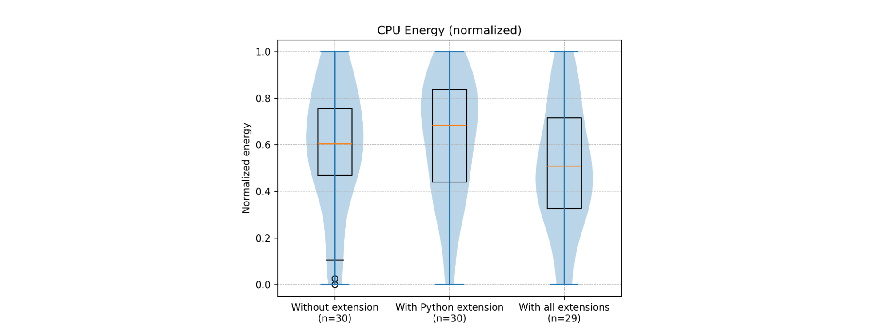

# Measuring the Energy Consumption of Different Profiles in Visual Studio Code

When we think of the energy consumption of a software application, we often think of the operational energy consumption of running a server in a data center. But software is developed using, well, software. And especially in larger teams working on software for long periods of time, the energy consumption can add up significantly.

Currently, the most-used IDE is Visual Studio Code (VS Code), used by around 74% of all software developers[^vscode]. VS Code uses a plugin structure to extend its functionality in numerous ways. For almost any language, there are plugins to integrate language-specific features in VS Code. For developers working in a multitude of languages, the number of plugins can grow quickly, while some of these plugins are unused when working in different languages. To tackle this, VS Code introduced profiles[^profiles], allowing users to select a subset of plugins for specific work situations.

In this experiment, we utilized EnergiBridge, a dedicated tool, to quantify the energy consumption variance between two distinct profiles within Visual Studio Code (VS Code). Specifically, we compared a profile devoid of any extensions against the default Python profile integrated with Python-related extensions. Our objective was to discern the extent of energy consumption attributed to extensions during code development.

However, it's important to note that we encountered procedural hurdles during the experiment. These challenges included unexpected technical issues and limitations that affected the data collection process. Despite these hardships, we were able to observe a tangible average escalation of 8.0% in energy consumption with the inclusion of plugins. This discernible increase vividly underscores the substantial influence that plugins exert on energy usage throughout the software development process in VS Code.


## Methodology

This experiment will make use of a relatively new feature in VS Code: Profiles[^profiles]. This feature allows us to launch VS Code with a predefined set of plugins and settings. We will be making use of the None and Python default profiles to measure the energy consumption of VS Code with the bare minimal settings and with standard Python plugins. As these default profiles might change over time, we have included an export of the profiles in our repository.

The experiment will be run on a _ASUS TUF Gaming_ _A15 FA507XI_FA507XI_ laptop into which the default 240W charger is plugged. No further devices are connected to the laptop. The operation system used is _Ubuntu 22.04.4 (LTS)_. 


### Preparation

Our experiment needs preparation. Some of these steps are automated, but not all, so we will describe the preparations we did to reduce sources of external influence on our experiment.

First, we had to ensure that VS Code had access to the defined profiles. We created the profiles using the _Create Profile _functionality, in which we copied the predefined profiles _None _and _Python_. For consistency, it is better to use the _Import Profile _functionality with the provided profiles from the repository. When the profiles were created, we ensured that VS Code was launched with these profiles to make sure all extensions were installed pre-emptively, instead of during the experiment. You can find the full versioning of the profiles in the [appendix](#appendix-python-profile-versions).

Then, to prepare for our experiment, we created a “Zen Mode”, where we made sure any user defined startup applications were closed and no ethernet cable and no external hardware were connected. Additionally, our experiment software automatically makes sure we have a fixed, low brightness and that Bluetooth and wifi are turned off.

For the experiment, we need an input file to dictate what the simulation will type out (more on that later). We used the first 173 lines of code from the file _executor.py_[^inputsrc] of the popular web framework Django. We chose this file based on the popularity of the framework and the quality of the code, making it a piece developers of varying expertise might find themselves writing.


### Experiment

With our “Zen Mode” enabled, we can run our experiment. The experiment[^repo] emulates a user writing code in VS Code by sending keystrokes to the system. Using the library _pynput_[^pynput] to automate keystrokes, we simulated a user opening VS Code (with the provided profile), opening a new file, writing the pre-defined lines of the Django file, and closing down the application. The code in the Django file causes the Python-related plugins to actively make suggestions based on what the simulation is typing. The effect on energy consumption is what this experiment is set to measure. To account for potential external factors, we ran our simulation 30 times for both the _None _and _Python _profiles. We shuffle the individual runs randomly to reduce the risk of external factors introducing a bias. 

The energy consumption of each run is measured using EnergiBridge[^energibridge]. EnergiBridge is a cross-platform tool which allows us to measure the resource usage and energy consumption of the entire system during the execution of a specific command. EnergiBridge makes estimates of the used energy by querying multiple tools and therefore the reported values are not the actual values. The whole experiment was run in one go, to reduce potential fluctuation in external temperature or time-dependent influences. We ran VS Code with the GPU disabled so all measurements are done on the CPU.

We expect both simulations to take the same amount of time, since they use the same input file. I.e. they enter the exact same keystrokes. This was confirmed from the gathered data. Note that due to autoindentation performed by the Python plugin (which could not be turned off) we had to also enable autoindentation for the “bare” profile to ensure equal usecases. 


## Results

During the run of our 4+ hour-long experiment, we sadly experienced some unexpected behavior resulting in only the first 18 data points being valid. From the terminal output we could determine that after the 18th test the experiment lost its focus and started typing in other windows. Time constraints prohibited us from re-running the full experiment, we will analyze our results based only on these 18 data points. 12 data points corresponded to the _None _profile simulation and 6 data points corresponded to the _Python _profile simulation. Although this is way less then the required 60 total data points, we will try to draw conclusions from the results we do have.

The data from the experiment has been plotted in combined box-, violin-plots in the figures below. From the plot for the runs _without_ the Python extensions, it can be assumed that the energy data has a normal distribution. This is backed up by the shape of the plot in combination with the Shapiro-Wilk test’s p-value (see appendix). However, the data from the runs _with_ the Python extensions does not share this property. We expect that this non-normal distribution is due to the lack of data points. As its p-value from the Shapiro-Wilk test does not explicitly rule out a normal distribution we will assume a normal distribution of the data.




Including all 30 data points will result in the plots as shown below. The data is clearly not normal in either version, which is likely the result of the simulation not typing in the designated window. The energy consumption is also much higher: likely the result of the simulation not closing the VS Code windows, increasing the number of windows open at the same time for every iteration. 

Another interesting observation during the execution of the experiment is that some outliers in terms of CPU temperature have been measured during the runs of the version without the Python extensions. However, according to our z_score test with a threshold of 3 standard deviations, these values are not outliers in our distribution, and as such the data generated during these runs have been incorporated into our final results.


The findings do reveal a notable contrast in energy consumption between the two versions of VS Code. Specifically, the version integrated with Python extensions exhibits an average energy consumption that is 8.0% higher compared to the version lacking these extensions. This discrepancy is further supported by the results of a t-test, which yields a p-value of 6.1e-8. Such a low p-value underscores the statistical significance of the observed difference, indicating that it is highly unlikely to have occurred by random chance.


## Conclusion

This experiment aimed to assess the energy consumption differences between using VS Code with and without plugins. Despite encountering procedural hurdles, we observed a distinct difference between the version with Python extensions and the version without. Having an average increase in energy consumption of 8.0% using the version with plugins, these findings signify the influence of plugins on energy consumption during software development using VS Code. 

The statistical significance, as indicated by the low p-value of 6.1e-8, underscores the reliability of these results. Converting the energy difference to Watts, we find an increase of 1.36 Watts using the few extensions in the Python profile. While this figure might seem insignificant at first glance, considering the cumulative effect across a large developer base, the resulting increase in energy consumption could be substantial.

Not only does this affect the individual developer, paying more for operational costs, but it has broader implications for environmental sustainability. Especially considering the many large organisations with large development teams. For instance, in a company with 1000 developers working 40 hours a week for four weeks, this could lead to an additional 217.06 kWh of energy consumption per month, translating to approximately €73.80 extra spent on development costs. Moreover, this contributes to 93.9 kilograms of CO2 emissions per month, equivalent to about 388 kilometres driven by an average passenger vehicle.

Given these implications, it's imperative for developers to carefully consider the usage and selection of plugins to mitigate both the environmental footprint and operational costs of software development. How might these findings influence plugin usage practices within development teams, and what strategies can be employed to minimize energy consumption without sacrificing productivity?


## Possible Improvements

Although our setup was made to minimize the potential influence of external factors, there are some actions we could have performed to increase the reliability even further. These are:

* Perform a “warm-up” of the processor. A cold start can result in the first few runs being more efficient, as the CPU is still cool.
* Kill any unnecessary services that are unrelated to the experiment, manually or automatically. Although we did close any “larger” applications, some unnecessary background services (e.g. printing service) might still be running and consuming energy.
* Have a cooldown between runs, to mitigate potential tail energy consumption. Tail energy refers to the effect that a task has on the CPU temperature, which takes some time before returning to a baseline temperature.

Apart from improving the experimental setup, we have future research ideas that might give a broader insight into the energy consumption of plugins in VS Code.

* Compare the energy consumption of a profile which combines plugins for different languages. This can highlight the sustainability of using profiles instead of always enabling all plugins.
* Compare the energy consumption of other preset profiles. This can show which languages consume more or less energy than others when developing in VS Code. The main difficulty lies in a good comparison, as VS Code does not run plugins on other languages.
* Compare the energy consumption of individual plugins. Currently, this is quite hard to do because of the lack of CLI options to run VS Code with only a specific set of plugins, and creating dozens of profiles can become quite a hassle.


## Appendix: Analysis Data Output
```
sim_0: {
  "time": {
    "shapiro-pvalue": 0.09066489454686147,
    "ttest-pvalue": 0.06985818015927328,
    "mean": 258494.08333333334,
    "median": 258476.0,
    "std": 94.69992813560573,
    "min": 258382,
    "max": 258717,
    "25p": 258426.5,
    "75p": 258510.75
  },
  "temp": {
    "shapiro-pvalue": 0.0013948120399672565,
    "ttest-pvalue": 0.0585579501505481,
    "mean": 46.760416666666664,
    "median": 46.4375,
    "std": 1.3961053839361681,
    "min": 45.5,
    "max": 50.75,
    "25p": 46.0625,
    "75p": 46.5625
  },
  "energy": {
    "shapiro-pvalue": 0.9391056164129185,
    "ttest-pvalue": 6.068511433449345e-08,
    "mean": 4391.502375284829,
    "median": 4392.812393188477,
    "std": 34.51026778992418,
    "min": 4317.844329833984,
    "max": 4447.62588500978,
    "25p": 4369.072200775136,
    "75p": 4409.739135742184
  }
},
sim_1: {
  "time": {
    "shapiro-pvalue": 0.5978235192420451,
    "ttest-pvalue": 0.06985818015927328,
    "mean": 258288.33333333334,
    "median": 258227.0,
    "std": 199.270893230519,
    "min": 258041,
    "max": 258634,
    "25p": 258161.75,
    "75p": 258402.5
  },
  "temp": {
    "shapiro-pvalue": 0.5674424423587358,
    "ttest-pvalue": 0.0585579501505481,
    "mean": 45.833333333333336,
    "median": 45.75,
    "std": 0.3510895738823483,
    "min": 45.25,
    "max": 46.375,
    "25p": 45.75,
    "75p": 46.03125
  },
  "energy": {
    "shapiro-pvalue": 0.3369949349728465,
    "ttest-pvalue": 6.068511433449345e-08,
    "mean": 4744.07547760009,
    "median": 4738.905250549316,
    "std": 39.59597393983487,
    "min": 4697.662902832031,
    "max": 4798.882629394517,
    "25p": 4707.886417388894,
    "75p": 4779.138832092285
  }
}
There are 12 samples for simulation 1
There are 6 samples for simulation 2
Outliers for sim 1:
    	Execution time: 0.
    	Energy: 0
    	Temp: 0
Outliers for sim 2:
    	Execution time: 0.
    	Energy: 0
    	Temp: 0
```

## Appendix: Additional Figures


## Appendix: Python Profile versions

Python plugin version: v2024.3.10611008 (pre-release)

Pylance plugin version: v2024.2.105 (pre-release)


---

[^vscode]: [https://survey.stackoverflow.co/2023/#section-most-popular-technologies-integrated-development-environment](https://survey.stackoverflow.co/2023/#section-most-popular-technologies-integrated-development-environment)

[^lsp]: [https://microsoft.github.io/language-server-protocol/](https://microsoft.github.io/language-server-protocol/)

[^profiles]: [https://code.visualstudio.com/updates/v1_75](https://code.visualstudio.com/updates/v1_75)

[^energibridge]: [https://github.com/tdurieux/EnergiBridge](https://github.com/tdurieux/EnergiBridge)

[^pynput]: [https://pypi.org/project/pynput/1.6.8/](https://pypi.org/project/pynput/1.6.8/)

[^inputsrc]: [https://github.com/django/django/blob/bcccea3ef31c777b73cba41a6255cd866bf87237/django/db/migrations/executor.py](https://github.com/django/django/blob/bcccea3ef31c777b73cba41a6255cd866bf87237/django/db/migrations/executor.py)

[^repo]: https://gitlab.com/RodinHaker/energibridge-plotter/
