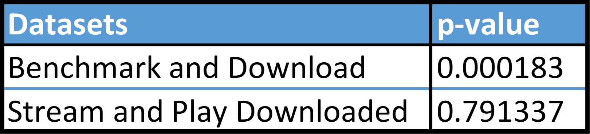

Spotify is a popular music and podcast streaming service that has gained immense popularity in the last few years. The platform is used by millions of people worldwide, with an impressive user base of around 433 million per month [1].
As the number of users on the platform continues to grow, it is essential to consider the environmental impact of such a substantial operation. Even small changes in energy consumption can have a significant effect on the energy footprint of the service.
For this project, we have taken an interest in the difference between listening to streamed media and downloaded media. In theory, the initial download generates an equal amount of energy as one stream. Subsequently, a downloaded song would require only half the energy to play compared to a streamed song. [3]
Spotify reports that around 42% of their GHG emissions come from listener streaming, this includes data traffic for streaming content on Spotify, downloads of our app, battery charges, and power supply of the devices used to listen, where devices stand for the majority of emissions [2]. There is a hypothesis that suggests a potential 80% reduction in GHG emissions if all songs were downloaded instead of streamed [3]. 
These numbers are impressive, but they only relate to greenhouse gas emissions. Additionally, since they were gathered in 2020, we're not sure if the hypothesis still holds. To investigate further, we're planning a small experiment to compare the amount of energy used by a computer when streaming a song versus playing an already downloaded song.

# Experimental Setup

**Hardware:**
 * MacBook Pro (15-inch, 2017), 2.8 GHz Quad-Core Intel Core i7, 16 GB 2133 MHz RAM, Radeon Pro 555 2 GB. 

**Software:**
 * macOS: Big Sur Version 11.6  
 * Spotify: Spotify for macOS (Intel) Version: 1.2.5.1006.g22820f93

**System settings:**
 * Closed all other applications 
 * Turned notifications off
 * Disconnected from a power outlet
 * Connected to a wireless network 
 * Turned off auto-adjust for brightness
 * Brightness was set to 70% 
 * Bluetooth was disabled 
 * Airdrop off
 * Sound off
 * Keyboard brightness off  

**Spotify software settings:**
 * Autoplay: off
 * Streaming quality: Normal
 * Download quality: Normal
 * Normalize volume: off
 * Volume level: off
 * All display settings: off
 * All social settings: off
 * All playback settings: off

We ran two experiments, each with slightly different conditions and at different times:

## Experiment 1
The first experiment was conducted on campus, consistently connected to the TU Delft University wireless WiFi 6 network. We assume the temperature to consistently be average room temperature, so around 19 degrees Celsius. 
We used one of the most streamed songs on Spotify: Shape of You by Ed Sheeran, which has a runtime of 3 minutes and 53 seconds.  We ran this experiment for 10 runs per condition.
This experiment was run on March 1st, 2023, from 12PM till 5PM
## Experiment 2
The second experiment was conducted in a different location. To account for the unstable network provided by the university, we conducted the second experiment at home with a more stable WiFi connection, using WiFi 4 with only 1 device connected to the network. The temperature was kept the same at 19 degrees Celsius. For this experiment we used a shorter song: As Far As the Compliments Went, which has a runtime of 30 seconds. This allowed us to have a higher amount of runs with 30 runs per condition.
This experiment was run on March 2nd, 2023, from 3PM till 5PM.

## Automation
We used a Python script to automate the execution of the experiment. A short description of the script:
 - Create a list of all runs of each of our 4 different conditions
 - Shuffle list
 - For each item in list, we run the corresponding condition:
   - Download song [Before measuring: delete song, clear cache]
   - Play downloaded song [Before measuring: download song]
   - Stream song  [Before measuring: clear cache]
   - Benchmark [Do nothing]
 - Log results to .csv file 
 - Pause in between runs 

The warm-up is implemented to ensure no ‘cold-start’ issues for measuring energy consumption. We run a script to calculate the next number in the Fibonacci sequence, since this is a highly energy-consuming task. After the warm-up, we wait 30 seconds before running our script. 
The script randomly selects 1 option from a list of 4: download a song, play a downloaded song, stream a song, and benchmark. 3 of the 4 conditions, 1, 2 and 3, require a manual step in which we as researchers need to either delete a song, clear the cache or check that a song is already downloaded. A 5 second pause is also added after these manual interventions to remove and tail end energy consumption that may be running in the background. The benchmark is in place to test the energy consumption of Spotify when it is idle. We run the benchmark and the downloading of a song tasks for 10 seconds each. This is as we could not measure the event that a song is finished downloading. The 10 seconds were enough to complete the download of a song, and the benchmark would allow us to measure the relative difference among the two. Each step is executed 10 times for the first experiment and 30 times for the second, however, which step is executed next is selected randomly to remove bias that might be present when executing the steps in a certain order from tasks that may be running in the background from the previous task. A pause is implemented between every run to prevent tail energy consumption from influencing the measurements of the next run. For the first experiment we ran a pause of 30 seconds, and for the second, we implemented a pause of 10 seconds.

A replication package can be found [here](https://github.com/GasparinoRocha/SSE_g2_Spotify_replicationpackage).

# Results

For both experiments, we focused on the Average Package Power values, since the measurements we want to compare all have the same time constraint - benchmark and download, 10 seconds, stream and playing downloaded, the length of the song.

## Experiment 1
After running the script, we obtained the following results.

|  | 
|:--:|
|Table 1: Experiment 1 - Average Package Power (Watts) results|

## Experiment 2
After running the script, we obtained the following results.

|  | 
|:--:|
|Table 2: Experiment 2 - Average Package Power (Watts) results|

# Data Analysis

## Experiment 1

The first analysis we employed was the Shapiro-Wilk test. With this evaluation we wanted to determine if the results were normally distributed. The results were the following.

|  | 
|:--:|
|Table 3: Experiment 1 - Shapiro-Wilk test results|

These values indicate that the Benchmark data is the only one that is normally distributed. Since this is the case, we chose the Mann-Whitney U Test to determine if there are significant differences between the Benchmark and the Download data, as well as between the Stream and Play Downloaded data. The results are as follows.

|  | 
|:--:|
|Table 4: Experiment 1 - Mann-Whitney U Test results|

We can now conclude that there is a significant difference between the Benchmark and Download data. Furthermore, the Download data shows more average power consumption than the Benchmark data in 100% of the cases. On the other hand, there is no significant difference between the Stream and Play Downloaded data.

To facilitate the understanding of these analysis, we constructed the following Violin plot, which works as a visualization tool of the distribution of each set.

|  | 
|:--:|
|Figure 1: Experiment 1 - Violin plot|

## Experiment 2

Once again, we started the analysis with the Shapiro-Wilk Normality test and obtained the following results.

|  | 
|:--:|
|Table 5: Experiment 2 - Shapiro-Wilk test results|

This time, none of the datasets are normally distributed. Because of this, we performed the Mann-Whitney U Test to determine if there are significant differences between the comparable datasets.

|  | 
|:--:|
|Table 6: Experiment 1 - Mann-Whitney U Test results|

Once more we conclude that there are significant differences between the Benchmark and Download data and that there are no significant differences between the Stream and Play Downloaded data. However, on the contrary of the last experiment, the Download data has a higher average power consumption than the Benchmark data in only 83.3% of the cases.

Finally, to visualize the data, we created a Violin plot.

|  | 
|:--:|
|Figure 2: Experiment 2 - Violin plot|

# Limitations

### Number of reruns
There are a couple of limitations to the results of this project. The main one being the number of reruns. We have done 30 runs for each action, due to time limitations. However we do not yet see a normal distribution form, thus we should have done more reruns. 

### WIFI connection (type & inconsistency)
Another impacting factor is the wifi connection. The type of wifi used in the project impacts the power consumption [5]. We ran experiment 1 connected to the public eduroam network with wifi 6. But due to the complicated setup of the TU - Delft network the computer might do more power consuming background task such as seleting which acces point to communicate with, or the Back Off Algorithm is triggered more often due to high network usage. For this reason experiment 2 is ran at a home network with wifi 4. However, the download speed can still not be kept consistent. Which impacts powerconsumption, as increased download speed increases cpu usage during downloading but because the download takes longer it can save energy over time.

### Other hardware components
In our experiment we have only looked at CPU power usage, but that means we neglect the increased power consumption for the other computer components such as different amount Disk read and write operations, possibly increased RAM usage and lastly the power consumption of the network card. An more accurate reading would be to measure the compleet energy consumption of the entire system.

### Difference between playing downloaded whilst connected to the internet and fully disconnected
One more wifi related impacting factor for real world usage is the necessity for an internet connection when streaming versus the ability to disconnect your computer from the internet when playing downloaded songs. Your computer and spotify do a lot more background tasks when it is connected to wifi. Thus, having the ability to disconnect from the internet is also a favorable argument for energy usage of playing downloaded songs. 

### Not generalized, only tested on 1 device
The study is done for one computer with a specific OS and spotify version. To be able to make a broad statement this study should have been repeated on a lot of different devices, operating systems and even different application versions. 

### Server side costs neglected in this study
Another favorable point for playing downloaded songs is the argument that this study is done from a consumer standpoint, neglecting the server side energy costs of streaming a song and the energy cost of transferring data over a network. 

# Future Studies

A couple of very interesting follow up studies can be done. One of which is a study done into the different energy consumption of playing a downloaded song whilst connected to the internet and while being fully offline. This can be very interesting as spotify probably still performs a lot of actions that impact energy consumption, such as sending user information to spotify, gathering friends activity, updating playlist and more. A study looking into these factors can show that whilst in our study there was not a significant difference there can be a significant difference in playing a downloaded song while the computer is offline versus streaming a song. 

Another study that can give more insight into the practical energy implication of downloading songs versus streaming songs can be a similar experiment but with different devices. As mentioned in the limitations this is only tested for one device, a specific macbook. However, in other studies it is shown that smartphones are overall the most popular device to play songs from [6, 7]. Meaning that macbooks do not represent the largest percentage of users, and a more relevant use case would be with a smartphone.

For a sustainability improvement that doesn’t require participation of the user, Spotify can elaborate on this study with a study into: how often, and when a person listens to a song more often. At the moment Spotify does cache songs, and with the combined information of when it is more energy efficient to play downloaded songs versus streaming, and the likelihood of a person playing a certain song multiple times. It can make its caching smarter and more sustainable by keeping the songs likely to be played again in its cache while removing the songs that likely will not surpass the threshold in number of streams for it to become more efficient to download a song. 

# Discussion

Whilst our results show no significant difference between downloading and streaming, it does not mean that both methods would produce the same amount of carbon emission. As mentioned in our limitations some factors are not considered, with two heavy influencing factors being: the ability to disconnect your device completely from the internet, and the other being the server side and network energy consumption. As sending data from the server to the device is not ‘free’ and itself has its own carbon footprint, and same goes for the increased load in constantly querying a song for streaming opposed to playing an already downloaded song. Thus when taking these facts into account it is probably still more sustainable and energy efficient to download your songs. Which is inline with the reports of spotify regarding its carbon footprint [8]. 

Our study showed that the only real difference in energy consumption was when it was downloading a song. Meaning that for users who want to save as much energy to extend their battery life, it does not matter if they stream a song or play a downloaded song. The only thing they should **not** do is download the song, even if they plan on playing it more often.

# Conclusion

From our experimentations, we were not able to find a difference between the average processor power used when streaming a song versus playing a downloaded song on Spotify. We were, however, able to determine that downloading a song uses more power than when the system is idle. These conclusions may suggest that in terms of pure processor energy use, streaming a song may be more energy efficient than playing a downloaded song. It is important to note that these results do not include any of the GHG emissions produced in the process, the server side energy consumption and the energy consumed by transferring the song data over the network. Our results may suggest that Spotify is running background tasks via the network that we cannot account for. An interesting follow up study could investigate the effect of turning off the network on processor power. 

# References

1: https://www.businessofapps.com/data/spotify-statistics/

2: https://www.lifeatspotify.com/diversity-equity-impact/climate-action

3: https://www.rollingstone.com/music/music-features/earth-day-climate-change-streaming-downloading-ajr-1339228/

4: https://lifeatspotify.com/reports/Spotify-Sustainability-Report-2020.pdf

5: https://www.cs.ru.nl/bachelors-theses/2020/Gunnar_Noordbruis___1008953___Energy_efficient_WLAN_using_WiFi_standards_on_an_Archer_C7_AC1750_access_point.pdf

6: https://techcrunch.com/2015/01/10/music-is-a-mobile-linchpin/?guccounter=1

7: https://www.statista.com/statistics/1102356/music-device-usage-worldwide/

8: https://www.rollingstone.com/music/music-features/earth-day-climate-change-streaming-downloading-ajr-1339228/
