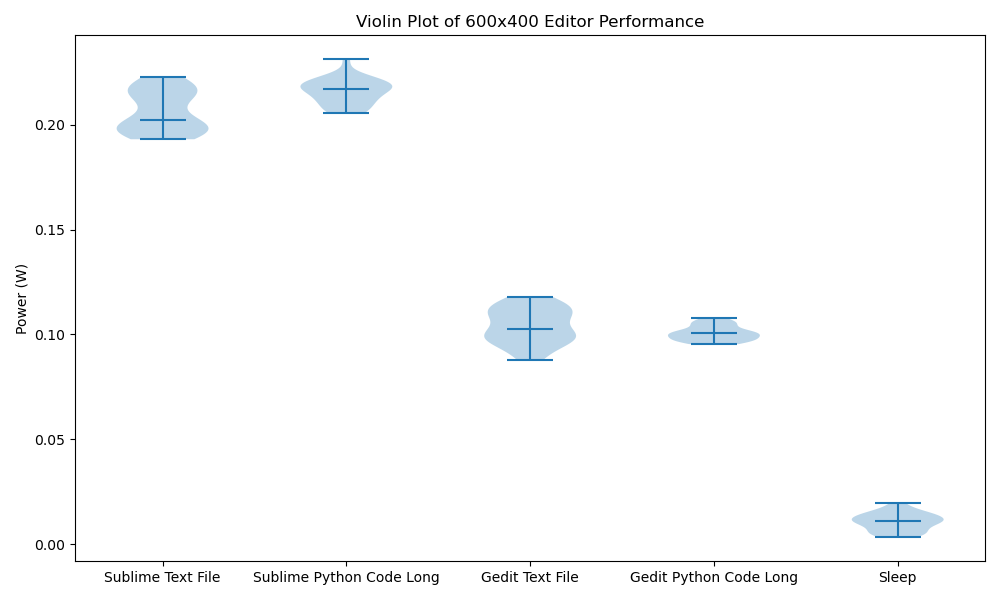

# Introduction
There exists a wide variety of text editors of various complexities. Some editors only consist of minimal functionality while others contain an array of features designed to improve user experience. Developers might use a text editor in many day-to-day tasks such as collecting notes, writing texts, or even performing (simple) coding. Most of these tasks are trivial and may not require a lot of time individually. However, because they are quite common, their combined text editor usage does become significant.

Given the frequent usage of a text editor, one would expect that people are inclined to stick to the same editor for all their tasks, preferably one with various features to simplify their work. This approach works well for work efficiency, but could potentially lead to excessive unnecessary energy usage. It is well established that in general, more complex software consumes more energy. Extending this principle to text editors led to our hypothesis that advanced text editors would require more power than their basic alternatives.

We designed an experiment to test this hypothesis by comparing the energy consumption of a more advanced text editor with that of a more basic alternative. This experiment demonstrates the distinct difference in power efficiency between two text editors, with "Sublime Text" representing the advanced option and "gedit" the basic one. These text editors were chosen as we use Sublime Text ourselves often and gedit is the Linux default editor. The goal of our research is to visualize the energy impact of these software applications and to inspire future research and larger experiments on the energy consumption of text editors.

In this blog, we will explore the energy usage of text editors. To start, we provide a detailed description of our experiment, indicating which variables were tested and how one might recreate the results. Next, we analyse the results of our experiment followed by a discussion, where we also describe what these results could mean on a more general level. Finally, we conclude this blog by offering developers recommendations on how they can utilize this new information.

# Methodology
In order to measure this accurately, `energibridge` [^1] was used, as this allows for detailed reporting of energy consumption. As mentioned previously, we compare the two editors. Additionally, the effects of using different window sizes, as well as the difference between writing normal text and writing code with syntax highlighting were investigated. These factors were chosen because initial exploratory experiments showed that these factors had a significant impact on energy consumption. More details are provided below.

[^1]: https://github.com/tdurieux/EnergiBridge

## Experiment procedure
The experiment was done using the following two scripts:

- **The main script**: Selects parameters for the experiment, sets up the experiment, and measures the energy consumption.
- **The Human Pretender script**: Takes a template as input and simulates a human tying this template out on a keyboard.

The full procedure is as follows:

1. An editor, window size and text format are chosen.
2. The editor is opened.
3. The window is resized to the specified window size.
4. The Human Pretender script is executed and monitored with `energibridge`.
5. Afterwards, the editor is closed and the output from energibridge is stored.

The following precautions were taken to make the results as reliable as possible:

- Two warmup iterations were done before the real experiment. The results of these iterations were discarded.
- There was a 5-second cooldown between each execution of an experiment with a set of parameters
- Every combination of parameters was tested 30 times, in a random order.
- The machine was plugged in, no USB devices were connected and the internet was turned off.

## Data collection
Not all of the output from `energibridge` was used for further investigation. To compute the total energy usage, the energy used by each core was summed up. Afterwards, this total energy was divided by the elapsed time to compute the average power. We found average power to be an appropriate metric because the activity of typing out some text or code can take an arbitrary amount of time. Finally, the average power of each iteration experiment was used for further analysis in the Results section.

## Hardware/software details
The experiment was conducted on a machine with the following hardware specifications:

- `AMD® Ryzen 5 3500u with radeon vega mobile gfx × 8`
- `AMD® Radeon graphics`
- `16 GB RAM`

Furthermore, the following relevant software versions were used:

- `Ubuntu 20.04.6`
- `Python 3.8`
- `energibridge 0.0.4`
- `pyautogui 0.9.54`

# Results
The results from the experiment are shown below:

The violin plots display the violin plots of power usage by gedit and Sublime for a regular text file and Python code. There are two different plots, one for fullscreen mode and one for 600x400. The violin plot for *sleep* is shown as well, which represents the power of doing nothing.

Looking at the violin plots, the energy consumption seems to be normally distributed. This is also confirmed by the Shapiro-Wilk test, given below, which evaluates the null hypothesis that the data set is normally distributed. Only for the Sublime Text File in 600x400 the null hypothesis was rejected. However, a single instance not seeming normal is reasonable for all-normal data. Therefore, we continue with the assumption that all energy consumption is normally distributed.

| Shapiro Wilk test (with p-value)   |     Fullscreen     |       600x400     |
| :--------------------------------- | :----------------: | ----------------: |
| Sublime Text File                  |    TRUE (0.7839)   |    FALSE (0.0038) |
| Sublime Python Code                |    TRUE (0.7844)   |    TRUE (0.3525)  |
| Gedit Text File                    |    TRUE (0.1601)   |    TRUE (0.2672)  |
| Gedit Python Code                  |    TRUE (0.2577)   |    TRUE (0.0953)  |
| Sleep                              |    TRUE (0.6480)   |    TRUE (0.6480)  |

Since the data is normal, we use the mean and standard deviation, given below, to evaluate the results.

| Mean Power in W (with standard deviation) | Fullscreen         |  600x400         |
| :---------------------------------------- | :----------------: | ---------------: |
| Sublime Text File                         |  0.2192 (0.0077)   |  0.2064 (0.0096) |
| Sublime Python Code                       |  0.2332 (0.0051)   |  0.2160 (0.0060) |
| Gedit Text File                           |  0.0942 (0.0095)   |  0.1040 (0.0083) |
| Gedit Python Code                         |  0.0966 (0.0039)   |  0.1006 (0.0035) |
| Sleep                                     |  0.0106 (0.0042)   |  0.0106 (0.0042) |

If we further analyze the difference between the violin plots of Fullscreen and 600x400 we can see that the performance of gedit remains constant, while the performance of Sublime is slightly worse in fullscreen.
The figures also display a large difference between the average power of Sublime and gedit, but to test whether the difference between the means of Sublime and gedit is significant, the Welch's t-test is used. This test was used instead of the Student t-test, because Welch's t-test accounts for possibly different variances, which is appropriate in this case. As can be seen in the table below, the difference in cases is significant, where Sublime consistently has significantly higher energy consumption.

| Welch's  t-test (with p-value) | Fullscreen         | 600x400            |
| :----------------------------: | :----------------: | :----------------: |
| Text File                      | TRUE (3.8223 e-50) | TRUE (3.5716 e-45) |
| Python Code                    | TRUE (3.9096 e-66) | TRUE (2.6891 e-52) |

# Discussion
##
In the previous section, we demonstrated that Sublime has a significantly higher energy consumption than gedit. This result aligns with our previous hypothesis where we expected that the more (complex) features of Sublime would cause this higher energy consumption. Some examples of what Sublime provides over gedit are its features designed for extensibility and performance such as the broad plugin ecosystem. One might not use all these plugins, but we believe that the background power usage of everything largely contributes to the difference observed.

We noted that there is quite a difference between the number of features of Sublime and gedit and that these extra features most likely led to a significant rise in energy consumption. However, in the grand scheme of all editors nowadays, this difference is relatively small. Consider IDEs like IntelliJ, these have plenty of extra features which potentially result in even larger differences in energy consumption compared to our "simple" text editors. This is promising, as future work can further increase awareness of potential energy savings in the realm of text editors, as will be discussed next paragraph.

## Limitations & Future Work
We mention that more features lead to worse results and that there potentially exists even "worse", which have even more features. We indeed suspect that the presence of more features causes the observed consumption difference, which is reflected in the experiment, where there are many inactive features which might use background energy. However, it is important not to see features as being negatively correlated with energy consumption, as these features might also aid user experience and make the use of the editor more efficient. For example, these more complex features might make coding easier for a user and save that user a lot of time, which reduces energy as well. The study is limited and the experiment was not designed to take these remarks into account. This leaves us with quite general results which are still true, but they are use-case dependent and can change in different settings.

The results provide significant findings, but the conducted tests might not be fully representative of real human behaviour inside Sublime and gedit, namely in the following ways:
(i) The human pretender script's typing inputs are slightly faster than a human and importantly at a constant speed. In real life, one might expect more of a start-stop writing style with a lot of additional background processing as well.
(ii) A large part of the features of both editors (especially Sublime) are directed towards software development. In our experiment, this aspect is not tested very thoroughly though it is important to the editor's everyday usage.

Besides not exactly replicating human behaviour, unnoticed environmental factors could have played a factor in our results. The entire experiment was run on a single device specified in our methodology section. Therefore, any oddities in the hardware or software of this machine could have biased our results and the real difference could vary slightly from what we observed.

As indicated by the limitations, there are multiple improvements that future works could make. To start, this research only demonstrated the complexity vs energy usage aspect of text editors and was meant to inspire larger-scale research considering more editors beyond our resources. Additionally, for continued research, the experiment setup should resemble more human-like behaviours and add more software development examples. Furthermore, additional metrics could be explored in an attempt to find an overall more complete representation of the human use of text editors. This could aid in designing more energy-efficient editors or improve the performance of current ones. Finally, continued research in this area could shed new light on the subject, sparking discussions, increasing awareness of the energy consumption of text/code editors, and increasing the competition in having more energy-efficient text editors.

# Conclusion
This study aimed to demonstrate the existence of the energy consumption versus complexity trade-off of text editors. This was achieved by an experiment comparing a "complex" text editor (Sublime Text) and a "simple" text editor (gedit). From the results, a significant consumption difference was observed in favour of the simpler editor gedit, indicating that the trade-off exists and that additional features can indeed make a text editor less energy efficient.

This research was only a demonstration of the trade-off, as due to limitations doing the full-scale research ourselves was simply not viable. To run a proper experiment it would require a lot more editors, ranging from the simplest editors like notepad, to the most feature-dense IDEAs like Intellij, to be tested. Furthermore, a larger variety of use cases with more human-like behaviour should be tested. To realize these tasks, a larger-scale setup is required, as time is the most limiting factor in imitating human-like activities. Experiments without the limitations of this experiment could delve deeper into the differences between current-day editors and test metrics to create better alternatives or improve the existing ones.

What can be taken away from the presented results our demonstration achieved, is that the trade-off between editor features and energy consumption exists. In the case of Sublime and gedit, if one cares not about additional features, we recommend using the more environmentally friendly editor, gedit. However, when additional features are considered, the use case becomes more important and the favouring choice might shift from the most energy-efficient to the editor best suited for the job. We strongly encourage you to investigate the energy consumption of your favourite text editors and choose the sweet spot for your own energy consumption and text editor needs!

## Reproducibility package
For the sake of reproducibility, the code for the experiment and data analysis is available [here](https://github.com/mdek2053/compare_editors).