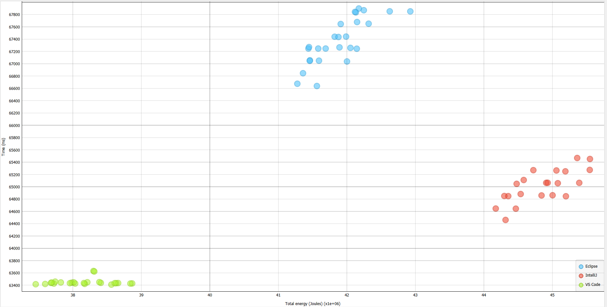
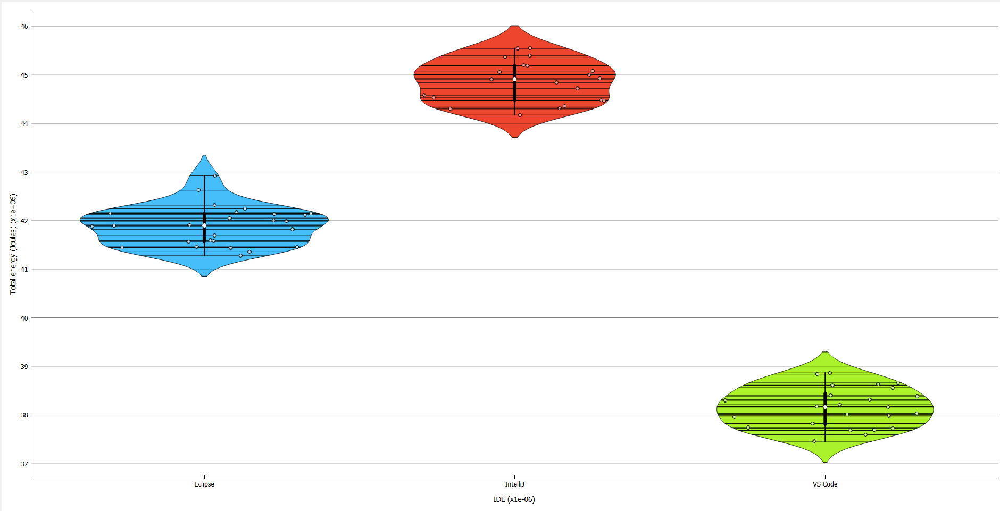
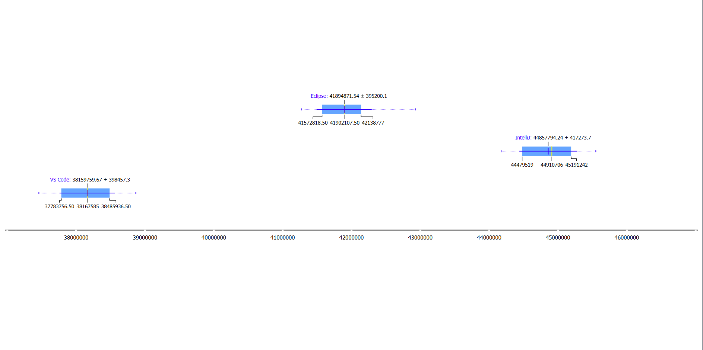

## Introduction
With sustainability becoming a more discussed topic each day, this also reaches the software engineering branch. Big Five companies Microsoft, Google and Meta already claimed to be carbon-free in 2030 [2,3,4]. Principles of sustainable software engineering have been written [5], explaining in what way software should be developed to make it more energy efficient. However, it raises a question: how does the choice of programming environment impact overall energy consumption?

Software can be written in an Integrated Development Environment like Eclipse and code editors like VSCode. IDE's provide more extended capabilities and work out of the box with complex projects requiring build tools like Gradle or Maven. Code editors on the other end are more lightweight and offer more freedom, but might be harder to setup with complex projects. Programmers often work on the go and battery life plays an important role. Are the extended capabilities of an IDE worth the possible increase in energy consumption? 

In this blog post, we aim to address a pivotal question: how do two of the most used IDEs measure up in terms of energy consumption against the world's most popular code editor: VS Code, when tasked with running a simple Java program named "Notemaker" [12]? The significance of using Notemaker for our project lies in its open-source nature and being entirely written in Java. Through a comparative analysis, we'll explore the performance and suitability of different development environments.

## Comparing the IDEs and Visual Studio Code
This blog post will conduct a comparative analysis of two IDEs to Visual Studio Code, assessing their energy consumption through the utilization of EnergiBridge [8]. To gauge the performance of these software platforms, we will be executing Notemaker within this software, utilizing their import and debug systems.

### Testing setup
Below, the testing setup is described. This includes all software used together with tools and computer setups. Other environmental factors which might impact the energy consumption is noted as well.

#### IDEs and Code editors
The following IDEs and code editors will be used during our experiments. For each IDE, community versions are used.
- JetBrains IntelliJ IDEA Community Edition - 2023.3.4
    - A closed source IDE that is the most used IDE for Java [11]. There are two versions of IntelliJ - a free community version, and a subscription-based Ultimate version which supports more languages, frameworks and build tools. For the project(s) that we will be testing in the experiment, we will be using the community version. This because the community version is sufficient for our experiment, and provides a better comparison of free, easy-to-access IDEs/editors.
- Eclipse IDE for Java Developers - 2023-12
    - A free and open source IDE primarily focused around developing Java projects that is currently the second most used IDE for Java [11].
- VS Code - 1.87.0
    - Free and closed source, VS Code is the worlds most used code editor. It is capable of having IDE-like features by using plugins. Since we want to emulate a normal usage scenario of VS Code, we will also be using it with several plugins:
        - Debugger for Java v0.56.2
        - Extension Pack for Java v0.25.15
        - IntelliCode v1.2.30
        - Language Support for Java(TM) by Red Hat v1.28.1
        - Test Runner for Java v0.40.1

#### Projects
The project that we will be using for the experiment is NoteMaker, a Java project for writing text documents [12]. It is a small and lightweight project that is similar to what computer science students may make during their studies. Additionally, it is open source, which aids in replicability of our study.

#### Tools
To measure the energy efficiency of the IDEs and VS Code, we will be using EnergiBridge - a command line tool for measuring the energy consumption while executing a set of tasks [8]. It can write the relevant energy consumption information to a csv file, from which we will extract the readings. The relevant columns are PACKAGE_ENERGY (J) and Time.

To ensure minimal variance between the tests, especially since we will be repeating them 30 times per IDE/editor, we will be using Ranorex Studio [9] as automation software. For each IDE we will create the test cases described in the following section where Ranorex Studio simulates a user clicking on relevant UI elements.

#### Hardware setup
The tests were run on an XMG FUSION 15 (L19) (ID: XFU15L19) laptop with the following specifications:
- **CPU:** Intel(R) Core(TM) i7-9750H CPU @ 2.60GHz 2.59 GHz
- **GPU:** NVIDIA GeForce GTX 1660 Ti | 6 GB GDDR6 
- **RAM:** 2 x 8 GB (16 GB) DDR4-2666 Corsair Vengeance 
- **Storage:** 1 x 1 TB M.2 Kingston A2000 | PCIe 3.0 x4 | NVMe 
- **System type:** 64-bit operating system, x64-based processor

The operating system used was Windows 10 Home, version 22H2, OS build 19045.4046.

### Procedure
This section will explain the testing procedure including automation and prerequisites.

Before doing the experiment, the hardware will undergo a warm-up phase to minimize confounding factors. This step is crucial because variations in hardware temperature can potentially influence the overall energy consumption measurements [10]. The warmup phase includes the following actions
1. Disabling Automatic Brightness
2. Disabling Internet
3. Killing Non relevant system processes
4. Run fibonacci for 5 minutes
    - This is a CPU intesive task which will warm up all system components to a stable temperature.

The latter is done to make sure hardware has a stable warmed up temperature because this might impact energy consumption readings.

Finally, room temperature will be held stable at 21 degrees celsius during these experiments. Once the warmup phase is completed, the following test will be executed 30 times using automation software:

1. Start EnergiBridge
2. Open IDE/Editor
5. Debug NoteMaker
6. Step into 6 times, 5 second delay between each step into
7. Continue NoteMaker (10 seconds)
8. Stop NoteMaker
10. Close IDE/Editor
11. Stop EnergiBridge

The experiments are repeated 30 times to reduce overall flakiness using Ranorex automation software. The order of the executed tests was randomized by using a random number generator and ordering the tests with our automation software accordingly.

The total consumed energy will be measured as follows:
- $E_s$ = Energy consumed at the start energibridge timestamp measured in joules.
- $E_f$ = Energy consumed at the final energibridge timestamp measured in joules.
- $E_c$ = $E_f - E_s$ : Energy consumed during the experiment.

After executing the experiments, outlier removal will be performed.

## Results

Following 30 test iterations for each of IntelliJ, Eclipse, and VS Code, the data required preparation for subsequent analysis. Notably, EnergiBridge reported a negative energy value in one of the Eclipse tests, which we excluded from our results. Additionally, outliers were observed, likely attributable to EnergiBridge's limitations as a measuring tool. Further discussion on this matter will be provided in our Limitations subsection. The outliers were removed using the Isolation Forest method.

The following plots show the results after outlier removal.

Scatter Plot: Here we can see the differences of our results with regards to energy and time. The three different programs under test are clearly separated: VS Code was the fastest and the most energy efficient. The tests for Eclipse needed on average the most time, while IntelliJ needed the most energy.

Violin Plot: Our results are not normal distributed. We tried to find possible reasons and solutions for this but even after re-running the experiment multiple times this could not be mitigated.

Boxplot:

| Program | Energy mean (Joules) | Energy median (Joules) |
| -------- | -------- | -------- | 
| IntelliJ     | 44.857.794     | 44.921.771     | 
| Eclipse     | 41.894.871    | 41.893.137     |
| VS Code     | 38.159.759     | 38.167.585      |

From this plot one could conclude that the IDEs use more energy compared to VS Code. The difference between the two IDEs is not as large as between the IDEs and the code editor. The mean value for vscode was approximatly $M_v =  38159759$  joules, while the mean value for the "most energy efficient IDE" Eclipse was $M_e = 41894871$ joules. 

Absolute Median Difference:

| / | Eclipse | VS Code |
| -------- | -------- | -------- |
| IntelliJ    | 3.028.634     | 6.754.186    |
| Eclipse    | -    | 3.725.552     |

With these results, we calculated the median percentage differences:

* VS Code is 15,03% more energy efficient than IntelliJ
* VS Code is 8,89% more energy efficient than Eclipse
* Eclipse is 6,74% more energy efficient than IntelliJ

## Discussion

The results of our study indicates a significant energy efficiency advantage for Visual Studio Code (VSCode) over IntelliJ and Eclipse, with VSCode being approximately 15% more energy-efficient. Within the IDEs, Eclipse is more  energy efficient by approximately 6.74%. This variance might be attributed to IntelliJ's richer feature set or a more elaborate debugger.

For tasks involving simple programs, such as those explored in this research, VSCode is an excellent choice. It not only provides robust features but also does so with a lower energy footprint when compared to IDEs.

When considering whether an IDE is justifiable in terms of increased energy consumption compared to a code editor like VSCode, the most important factor is project complexity: For the development of complex programs which require build tools, the extensive capabilities offered by IDEs may outweigh the increased energy consumption, making them a preferable choice.
## Limitations of our study and future work
### Generalization
We tested this setup using the NoteMaker software only, this means the energy consumption between IDE's and code editors could be different when using other software. 
In the future, similar experiments like these should be repeated for different types of software packages to get a more generalized overview of energy consumptions among IDE's and code editors.

### Scope
The scope for this research was small due to time constraints, we only tested one two IDE's and one code editor for one particular programming language. In the future, it would be interesting to look at multiple programming languages. For example, researchers could look at the energy consumption between compiled and interpreted programming languages. An interesting point to look at could also be the main use case of a programming language (GUI development, Web development) and how this influenced energy consumption.

### Hardware architecture
The experiments were executed on a single PC. Different hardware might result in different energy consumption statistics. In the future, experiments could be done on a broader spectrum of hardware to minimize this confounding factor.

### Isolating energy usage
Although we attempted to stop all unnecessary processes when running the tests, there were several that we had to keep running. This includes the EnergyBridge, which we used for energy measurements, and Ranorex. This could have affected the final energy measurements, since EnergiBridge does not isolate the energy usage of programs, but instead measures that of the entire system.

### Confounding factors
Although we controlled as many confounding factors as we could during the experiment, it is still possible that the energy usage data we collected was not entirely representative of the energy used by the IDE itself.

Although the outside temperature was kept constant, it was done so on a room level. Therefore, it is difficult to know if the temperature around the working PC was properly controlled, as it could have been influenced by the heat of the laptop, differences in air flow and proximity to windows or radiators.

Additionally, Energibridge was not able to give us CPU temperature readings. Thus, although we incorporated a warmup before the start of the experiment, it is difficult to tell if the warmup was adequate. This means that there is a chance that the initial readings cannot be compared to later readings due to differences in resistance.

### Project size

The powerfull capabilities of Integrated Development Environments (IDEs) lie in their seamless compatibility with complex projects that employ build tools or external dependencies. In our research, we tried to configure both IDEs and Visual Studio Code (VS Code) for use with JabRef, a Java reference manager. JabRef [7], being open-source software, relies on Gradle for building and managing external dependencies.

To gauge the efficiency of these IDEs, it would be essential to compare energy consumption data when working on a complex project like JabRef. This comparison aimed to show whether the expanded functionalities of IDEs justify the associated increase in energy consumption.

While attempting to set up JabRef with VS Code, we encountered challenges. The setup required a Docker container within the Windows Linux Subsystem. Unfortunately, we were unable to succesfully perform this setup within the time limit so its left for further research.

## Conclusion
Our research focused on comparing the energy consumption of Integrated Development Environments (IDEs) with the widely used code editor, Visual Studio Code (VSCode). To conduct this research, we employed the debuggers within each IDE and utilized a debugger Java extension for VSCode. The evaluation was carried out using the execution of the Java program "NoteMaker" [12], a straightforward Java application without external dependencies.

The findings revealed a notable difference in energy consumption, with VSCode demonstrating significantly lower energy usage in contrast to the IDEs. This outcome aligns with expectations, considering that code editors tend to be more lightweight and have fewer features, making them more efficient for simpler projects. It's worth noting that our study focused on a relatively straightforward Java program. For comprehensive insights into the energy impact of IDEs' extended functionalities, further research is essential. Future investigations should involve testing these features with more complex projects to determine whether the increased energy consumption associated with IDEs is justified by the benefits offered in handling larger and more complex coding tasks.

# Reproducibility
Ranorex files can be downloaded at: https://drive.google.com/drive/folders/1J7W0fQ8qG5YB0njX0k3-Fn-O0gcF42d9?usp=sharing

## References

[1] (2024), "Gradle Build Tool". February, 2024.

[2] Google (2022), "Net Zero Carbon".

[3] Facebook (2020), "Facebook's net zero commitment". November, 2020.

[4] Smith B (), "Microsoft will be carbon negative by 2030"

[5] Zimmergren (), "The Principles of Sustainable Software 
Engineering - Training".

[6] Garcia C (2023), "Data Center Energy Use - AKCP Monitoring". July, 2023.

[7] "JabRef - Free Reference Manager - Stay on top of your Literature".

[8] "tdurieux/EnergiBridge".

[9] "Test Automation for GUI Testing | Ranorex".

[10] Haywood A, Sherbeck J, Phelan P, Varsamopoulos G and Sandeep K (2015), "The relationship among CPU utilization, temperature, and thermal power for waste heat utilization", Energy Conversion and Management., May, 2015. Vol. 95
 
[11] C. Johnson, "Most Popular Java IDEs in 2023 | JRebel by Perforce". Accessed: Mar. 04, 2024. [Online]. Available: https://www.jrebel.com/blog/best-java-ide

[12] A. K. SINGH, ‘Abhishek1103/Notemaker’. Oct. 13, 2023. Accessed: Mar. 04, 2024. [Online]. Available: https://github.com/Abhishek1103/Notemaker
