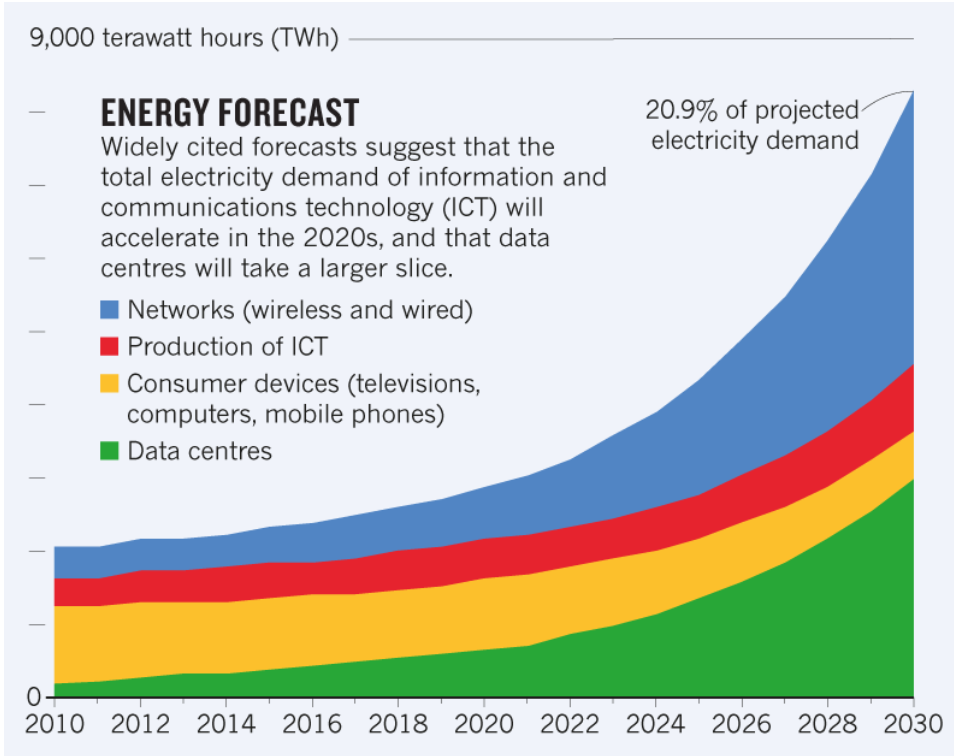
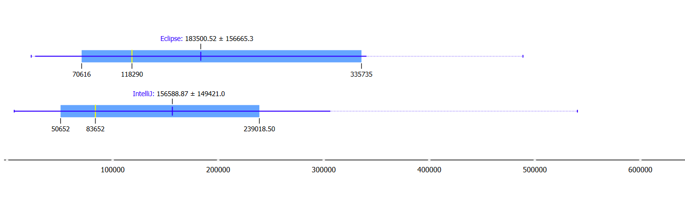
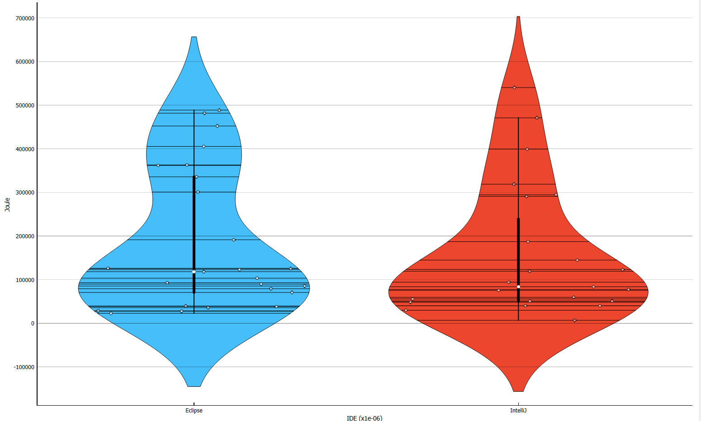

## Introduction
With sustainability becoming a more conversed about topic each day, this also reaches the software engineering branch. Big five companies Microsoft, Google and Meta already claimed to be carbon free in 2030 [2,3,4]. Principles of sustainable software engineering have been written [5], explaining in what way software should be built to make it more energy efficient. But what about the programs this software is written in, how does this impact overall energy consumption?

AKCP conducted an experiment focusing on energy forecasts within the Information and Communication Technology (ICT) sector [6]. The outcome of is visually represented in the graph below:

Figure 1: Trends in energy consumption in the ICT sector. [6]

Data centers and networks will  be the primary consumers of energy, but the production of ICT still has a significant influence. This specific sector is notably impacted by the software and the programs used in its development. The efficiency and sustainability of these production tools play a crucial role in shaping the overall energy consumption for this specific sector.

Software can be written in an Integrated Development Environment like Eclipse and code editors like VSCode. IDE's provide more extended capabilities and work out of the box with complex projects requiring build tools like Gradle or Maven. Code editors on the other end are more lightweight and offer more freedom, but might be harder to setup with complex projects. Programmers often work on the go and battery life plays an important role. Are the extended capabilities of an IDE worth the possible increase in energy consumption? 

In this blog post, we aim to address a pivotal question: how do two of the most used IDEs measure up in terms of energy consumption against the world's most popular code editor: VS Code, when tasked with running a package-intensive program named "JabRef" [7]? The significance of using Jabref for our project lies in its open-source nature, utilization of a build tool, and being entirely written in Java. Through a comparative analysis, we'll explore the performance and suitability of different development environments in handling the complexities posed by JabRef.

This experiment is done by a group of 3 students from the TU Delft, for a course that is focused on sustainable software engineering. 

## Comparing the IDEs
This blog post will conduct a comparative analysis of two IDEs to Visual Studio Code, assessing their energy consumption through the utilization of EnergiBridge [8]. To gauge the performance of these software platforms, we will be executing JabRef within this software, utilizing their import and debug systems.

### Testing setup
Below, the testing setup is described. This includes all software used together with tools and computer setups. Other environmental factors which might impact the energy consumption is noted as well.

- set up ide using jabref recommendations [7]

#### IDE's
For each IDE, community versions are used.
- Jetbrains IntelliJ
    - Most used JAVA IDE in the world. 
    - Closed source
- Eclipse IDE : Second most used JAVA IDE in the world.
    - Open Source
    - Might require more intervention to make projects work which use build tools.

#### Code editors
**NOTE:** we have not been able to get jabref running with VS Code and Docker. This section will be removed if we do not manage it by Monday, otherwise will be elaborated.

- VS Code : The worlds most used code editor, capable of having IDE-like features by using plugins
    - We will be using the JAVA VS code plugin for running JabRef
    - JabRef needs a docker container to run with vs code. - link to instructions

#### Projects
- Jabref: Java software for managing scientific references [7]
    - Opensource
    - Uses Gradle as build tool
        - Projects using build tools really show the easy-to-setup functionality of IDEs.

#### Tools
- EnergiBridge : Command line tool which is capable of measuring the energy consumption measured in joules, while executing a set of tasks.
- Docker: For running JabRef with VSCode, A docker container is needed.

#### Automation

- Ranorex studio [9]

#### Hardware setup

### Procedure
This section will explain the testing procedure including automation and prerequisites.

Before doing the experiment, the hardware will undergo a warm-up phase to minimize cofounding factors. This step is crucial because variations in hardware temperature can potentially influence the overall energy consumption measurements [10]. The warmup phase includes the following actions
1. Disabling Automatic Brightness
2. Disabling Internet
3. Killing Non relevant system processes
4. Run fibonacci for 5 minutes
    - This is a CPU intesive task which will warm up all system components to a stable temperature.

The latter is done to make sure hardware has a stable warmed up temperature because this might impact energy consumption readings.

Finally, room temperature will be held stable at 21 degrees celsius during these experiments. Once the warmup phase is completed, the following test will be executed 30 times using automation software:

1. Start energibridge
2. Open IDE/Editor
3. Let IDE/Editor index
4. Set breakpoint
5. Debug program
6. Step into/out 5 times
7. Continue program (20 seconds)
8. Stop energibridge
9. Clear cache
10. Close IDE/Editor

The experiments are repeated 30 times to reduce overall flakiness using Ranorex automation software. The order of the executed tests was randomized by using a random number generator and ordering the tests with our automation software accordingly.

The total consumed energy will be measured as follows:
- $E_s$ = Energy consumed at the start energibridge timestamp measured in joules.
- $E_f$ = Energy consumed at the final energibridge timestamp measured in joules.
- $E_c$ = $E_f - E_s$ : Energy consumed during the experiment.

## Results (These are only preliminary as we could not run the tests with the Code editor VS Code. These will be changed for the submission on Monday.)
Results of 30 test runs of IntelliJ and Eclipse after outlier removal using isolation forest:
Boxplot:

The mean value of the energy consumption of IntelliJ was 156588.87 Joules, while the mean value for Eclipse was 183500.52 Jule. The median value for IntelliJ is 83652 Joules, while it is 118290 Jule for Eclipse.
This suggests, that IntelliJ is more energy efficient than Eclipse.

Violin plots:

Our results are not normal distributed. We tried to find possible reasons and solutions for this but even after re-running the experiment multiple times where each test runs under the same conditions, this could not be mitigated. 

## Discussion (preliminary)

- Intellij more efficient than Eclipse: why?
  - Gradle project handling?
  - Differences in debuggers?
- Relevance of this: Should people switch to Intellij?
  - Arguments against switch:
    - Differences do not seem too significant
    - Intellij community version does not give complete functionality, whilst Eclipse is free by default
      - Intellij community vs ultimate does not appear to be too relevant to Jabref
      - Money / paying for subscriptipn is not something all developers can afford
    - Eclipse is opensource
  - Arguments for switch:
    - Even a small difference in energy consumption can add up over time - this experiment was only held for [time] each
    - (for jabref) the project was a lot simpler to get running in Intellij

## Code editor or IDE does it matter? (Not yet done as VS Code is still missing.)

## Limitations of our study and future work
### Generalization
We tested this setup using the JabRef software only, this means the energy consumption between IDE's and code editors could be different when using other software. 
For VSCode, JabRef also required a docker container which consumes more energy that just running it directly from the build tool. Each time the project was loaded in VSCode, a new fork would be created for the docker image [NOTE: check what the exact message was], and relevant extensions would be redownloaded. Although this is a relevant comparison in the specific case of loading and working on the open source Jabref project, this likely is not representative of a normal workflow with VSCode, which may be less energy-intensive.
In the future, similar experiments like these should be repeated for different types of software packages to get a more generalized overview of energy consumptions among IDE's and code editors.

### Scope
The scope for this research was small due to time constraints, we only tested one two IDE's and one code editor for one particular programming language. In the future, it would be interesting to look at multiple programming languages. For example, researchers could look at the energy consumption between compiled and interpreted programming languages. An interesting point to look at could also be the main use case of a programming language (GUI development, Web development) and how this influenced energy consumption.

### Hardware architecture
The experiments were executed on a single PC. Different hardware might result in different energy consumption statistics. In the future, experiments could be done on a broader spectrum of hardware to minumize this cofounding factor.

### Isolating energy usage
Although we attempted to stop all unnecessary processes when running the tests, there were several that we had to keep running. This includes the EnergyBridge, which we used for energy measurements, and Ranorex. This could have affected the final energy measurements, since EnergiBridge does not isolate the energy usage of programs, but instead measures that of the entire system.

The issue of not being able to isolate energy usage is especially present with the automation software we used, Ranorex. Due to the different layouts of the different IDEs, we had to create different "test" cases for each of them. Thus, when a certain action took more steps to complete in one IDE over another, the increased energy consumption may have come from Ranorex taking more time to automate cursor movement. Additionally, the different layouts in the IDEs could have caused Ranorex to spend differing amounts of time and energy to find UI elements.

### Confounding factors
Although we controlled as many condounding factors as we could during the experiment, it is still possible that the energy usage data we collected swas not entirely representative of the energy used by the IDE itself.

Although the outside temperature was kept constant, it was done so on a room level. Therefore, it is difficult to know if the temperature around the working PC was properly controlled, as it could have been influenced by the heat of the laptop, differences in air flow and proximity to windows or radiators.

Additionally, Energibridge was not able to give us CPU temperature readings. Thus, although we incorporated a warmup before the start of the experiment, it is difficult to tell if the warmup was adequate. This means that there is a chance that the initial readings cannot be compared to later readings due to differences in resistence.

## Conclusion
(Final conclusion will be added for the Monday submission as the results for VS Code are still missing. So no statement about the difference between IDEs and code editors can be made yet.)

# Reproducibility
Ranorex files can be downloaded at: https://drive.google.com/drive/folders/1J7W0fQ8qG5YB0njX0k3-Fn-O0gcF42d9?usp=sharing

## References

[1] (2024), "Gradle Build Tool". February, 2024.

[2] Google (2022), "Net Zero Carbon".

[3] Facebook (2020), "Facebook's net zero commitment". November, 2020.

[4] Smith B (), "Microsoft will be carbon negative by 2030"

[5] Zimmergren (), "The Principles of Sustainable Software 
Engineering - Training".

[6] Garcia C (2023), "Data Center Energy Use - AKCP Monitoring". July, 2023.

[7] "JabRef - Free Reference Manager - Stay on top of your Literature".

[8] "tdurieux/EnergiBridge".

[9] "Test Automation for GUI Testing textbar Ranorex".

[10] Haywood A, Sherbeck J, Phelan P, Varsamopoulos G and Sandeep K (2015), "The relationship among CPU utilization, temperature, and thermal power for waste heat utilization", Energy Conversion and Management., May, 2015. Vol. 95