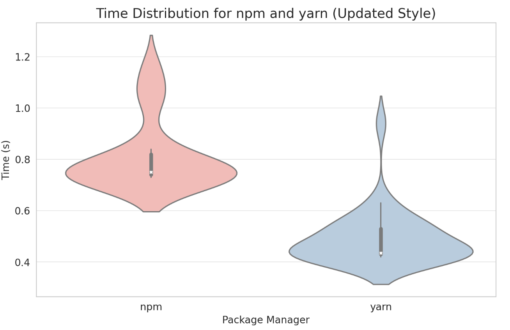
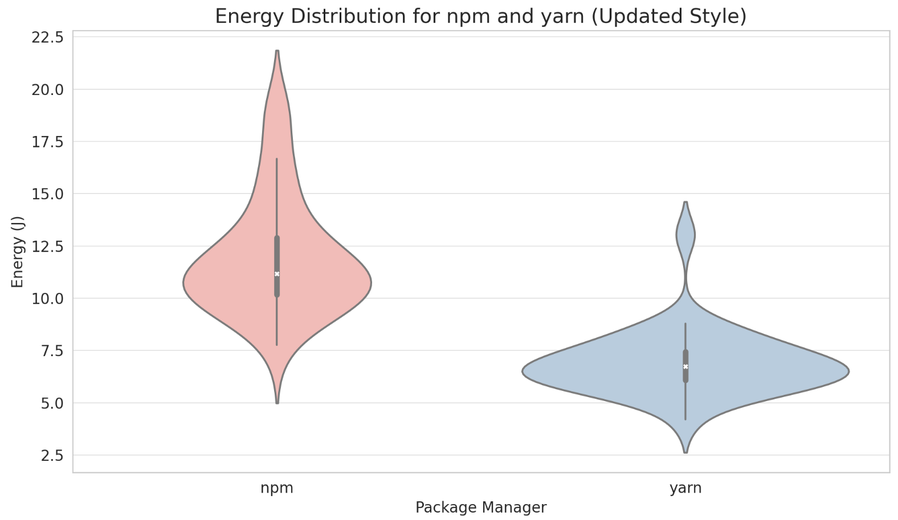
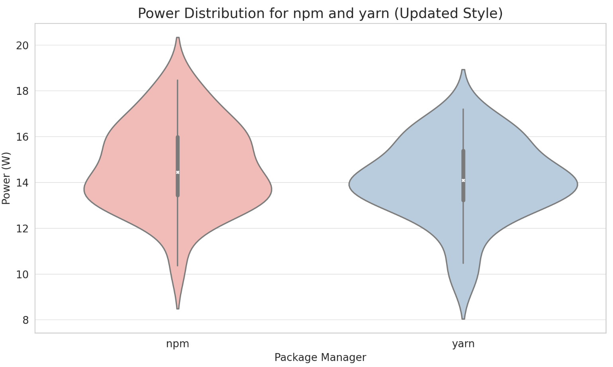

# Npm vs Yarn: Energy Efficiency
## **Introduction**

Software systems are becoming larger and more complex as time passes, however, so does the energy consumption of these ever-growing systems. Software development accounted for 150 TWh of energy use in 2023 ([Sharma, 2023]), representing an increase of approximately 23% each year. In our endeavour to have a more environmentally sustainable IT sector, we must also take a look at it's energy consumption through development computation.

In this project, we tackled what is some of the most used functionality in software development, package installation, and compare two different tools which handle that on their energy efficiency. When it comes to software development, no language is more used (and ironically despised) than JavaScript ([Vailshery, 2024]). The most popular package managers for JavaScript are [`npm`] and [`yarn`]; therefore our project aims to answer: **Which JavaScript package manager is more energy efficient, npm or yarn?** We ran package installation experiments and analysed the results based on time, energy consumption and efficiency distributions to answer the question. The setup for the automated experiment can be found in the following [repository].

We have found that ... TODO

Therefore, we can conclude that ... TODO

## **What are package managers**

Package managers are tools that help developers manage the libraries and dependencies used in their projects. These tools allow automating the process of installing, upgrading, configuring and removing computer software packages. They play an important role in modern software development, especially in handling complex dependencies, ensuring software version consistency and identifying vulnerabilities. 

Package installations are typically included in most stages of deployment within pipelines. This means they run with every push a developer makes. Having faster package installation is a great benefit to developers and we are interested in how the difference in speed may affect a difference in energy efficiency.

### What is `npm`?

Npm (Node Package Manager), released in 2010, is a package manager for JavaScript and is the default package management tool for Node.js. It allows developers to install, share, and distribute code from the npm repository. Npm is not only a command-line tool, but also a package database that allows developers to publish new packages, update packages, or manage package dependencies. With npm, developers can easily add, update or remove project dependencies, manage project versions and scripts, and publish and share their own open source libraries.

### What is `yarn`?

Yarn is a new JavaScript package manager developed by Facebook (now Meta) to improve on some of npm's shortcomings. Launched in 2016, yarn offers faster dependency installation, tighter package versioning, and better security. Yarn caches each package download, so installing the same package again doesn't require an internet connection, which greatly speeds up installation speed and hypothetically also energy efficiency. Although npm and yarn have a lot of overlap in functionality, they each have their own specialities in terms of performance, user interface and security.

## **Methodology**

This section will go over the setup of our experiments, including the energy measurement utility we used, the environment setup and the automation process.

## Energi Bridge utility for energy measurement

[Energi Bridge] is a software utility tool for measuring the energy usage of a system (process). When running the package installation, Energi Bridge gives us a precise energy measurement for the process of that specific task. This ensures a one-to-one comparison between npm and yarn.

### Docker containers for isolated experimentation

In the context of comparing power consumption during package installation with different package managers, the use of an isolated environment is crutial. The isolated environment that provides reliability since it ensures that the environment is consistent across runs. Additionally, since difference package managers can rely on different versions of dependencies, an isolated environment helps to avoid conflicts between the different requirements and dependencies.

[Docker] Containers provide a lightweight and isolated environment for running the experiments. Each package manager (npm and yarn) installs the same `package.json` within separate Docker containers to ensure independence and avoid interference. This process involves specifying a list of packages, initiating the installation process, and recording relevant metrics such as the time taken for installation and uninstallation, the energy and the power consumption for the procedure. The experiments are run 30 times for each package manager. Running the experiment 30 times provides more robust results and helps account for variability. The process repetitions result in reliability by encompassing average performance and revealing potential patterns or trends.

### Shell script for automated experimentation

The experiment runs using the `build.sh` file (or `windows-build.bat` for Windows). This script has been created to automate the experimentation by building the Docker images and running the installations/uninstallations for both package managers under the Energi Bridge measurement process. Automating experiments using scripts ensures consistency since all the experiments are guaranteed to conduct with the same set of instructions and parameters. Additionally, it is efficient because it allows us to run a large number of trials without manual intervention. Finally, the script writes a `.csv` file for each of the two experiments outputs (one for npm and one for yarn), which reduces the probability of human error if this procedure was to be executed manually.

### Additional setup procedures

Additional procedures are needed to ensure a fair experiment:
1. The shell script alternates between the use of npm and yarn such that the order in which the two were used does not influence the outcome. 

2. System settings – such as screen brightness, internet connection, background processes – were controlled throughout the experiments. 

3. Installation cache is removed after every run. Although this impedes one of yarn's advantages over npm, we want the different runs of the experiment to be in isolation of each other.

4. A CPU stress-test was run before the experimentation using [Cinebench] to ensure that the first runs did not have a temperature advantage.

## **Results**

### Time distribution for npm and yarn
The violin plot of the time distribution shows that npm's processing time distribution is relatively wide, which means that its processing time exhibits greater variability across runs. This width suggests that run times can fluctuate over a wide range in the use of npm. In contrast, yarn's time distribution looks more compact and consistent, suggesting that yarn's processing times are more stable and less variable across runs.

Additionally, in this graph, the median for yarn looks lower than the median for npm, this would indicate that yarn typically has faster processing times.

The violin plot for npm shows longer tails, which could indicate the presence of some extreme long processing time runs. In contrast, yarn's distribution may be more centred with shorter tails, indicating fewer extremes or less fluctuation in processing times.

### Energy distribution for npm and yarn

The violin plots of energy consumption show that the energy consumption distributions of npm and yarn show different patterns. npm's energy consumption distribution is likely to be wider, suggesting that its energy consumption is more variable across runs. In contrast, yarn's energy consumption distribution is likely to be relatively narrow, indicating that its energy consumption is more consistent across runs. If one looks at the white dots and thick black lines inside each violin plot, one can see the difference between the median (white dots) and interquartile range (thick black lines) of energy consumption for npm and yarn.

### Power distribution for npm and yarn

The violin plot of power usage shows the distributional characteristics of npm and yarn in terms of power usage. Similar to energy consumption, npm's power usage distribution may exhibit greater variability, while yarn shows a more consistent pattern of power usage.

This difference may indicate that yarn is more efficient in power management compared to npm, possibly because yarn better optimises the task execution process and reduces the need for high power consumption.

In summary, yarn exhibits high efficiency and consistency in time, energy and power distribution, making it a preferred tool when performing dependency management tasks, especially in scenarios where fast response and efficient energy use are sought. However, in the actual selection and use process, the most appropriate decision should be made based on the project requirements and environment characteristics, taking into account various factors.

## **Analysis**
### Are the results statistically significant?

In order to determine whether the experimental data meets the statistical significance of normal distribution, firstly we use the [Shapiro-Wilk] normality test. Based on the analysis we can see:
- The p-values for the time data (npm and yarn) are much less than 0.05, indicating that these data sets do not follow a normal distribution.
- The p-value for energy data (npm and yarn) is also much less than 0.05, again indicating that these data sets do not follow a normal distribution.
- The power data has p-values of 0.6659900546073914 and 0.2947884202003479 for npm and yarn respectively, indicating that the assumption of a normal distribution cannot be statistically rejected, and this is especially true for the power data for npm, but given the results of the other tests, we may need to use non-parametric tests for all variables to assess the statistical significance of the differences, and these tests do not rely on distributional assumptions about the data.

The Mann-Whitney U test is a non-parametric statistical test used to compare whether the medians of two independent samples differ. The test does not require the data to follow a normal distribution and is therefore suitable for analysing data sets that do not satisfy the assumption of a normal distribution for parametric tests. By comparing the ranks of two samples rather than comparing their values directly, the Mann-Whitney U test is able to assess the difference between two sample distributions independent of outliers.

In this experiment, the normal distribution test showed that the time and energy data did not follow a normal distribution, while the power data had inconsistent normality, so the Mann-Whitney U test was chosen to assess the difference in performance between npm and yarn in terms of time, energy and power. Based on the analysis we can see:

- Time data: p-value of 2.39 x 10-10, which is much less than 0.05, indicating that the difference between npm and yarn in time performance is statistically significant.
- Energy data: p-value of 4.20 x 10-10 , again much less than 0.05, indicating that the difference between npm and yarn in energy consumption is statistically significant.
- Power data: p-value is 0.3478, which is higher than 0.05, indicating that the difference in power usage between npm and yarn is not statistically significant.

The results of the test show that there is a statistically significant difference between npm and yarn in terms of time and energy consumption, implying that the two perform differently in these areas and that this difference is statistically significant. However, in terms of power usage, the difference between the two is not statistically significant, indicating that as far as power consumption is concerned, they perform similarly and there is no significant difference.

### Are the differences practically significant?

## Limitations and considerations

Talk about the fact that the number of runs is not automated. 

The stress test actually made it so that the first few runs were hotter than the later ones, since Cinebench is much more intensive than package installation

Internet connectio was over WiFi, which is not as stable as cable and could affect the results. Nothing could be done about this unfortunately. 

For future work, consider testing [Bun], a self-described npm and yarn killer. Consider increasing the amount of packages. Consider having more complicated inter-package dependencies. Consider using an existing benchmark such as the one implemented by Bun.

## **Conclusion**

[Vailshery, 2024]: <https://www.statista.com/statistics/793628/worldwide-developer-survey-most-used-languages/>

[Sharma, 2023]: <https://www.i-scoop.eu/sustainability-sustainable-development/it-sector-electricity-demand/>

[`npm`]: <https://www.npmjs.com/>

[`yarn`]: <https://yarnpkg.com/>

[Shapiro-Wilk]: <10.1093/biomet/52.3-4.591>

[repository]: <https://github.com/MissingCurlyBracket/npm-VS-yarn-Energy-Efficiency-Experiment>

[Energi Bridge]: <https://github.com/tdurieux/energibridge>

[Docker]: <https://www.docker.com/>

[Cinebench]: <https://www.maxon.net/en/cinebench>

[Bun]: <https://bun.sh/package-manager>