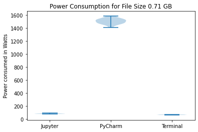
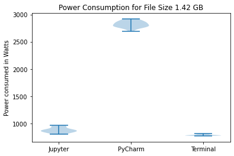
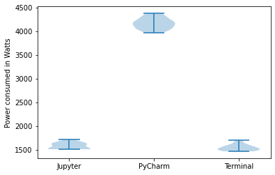
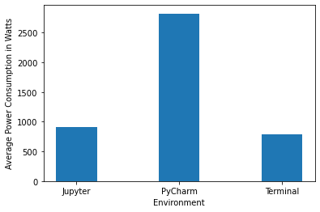
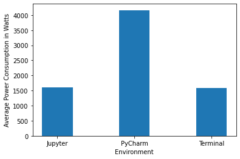

## Introduction
The TIOBE index, which indicates the popularity of programming languages, shows that Python is currently ranked as the top programming language of 2024[^1]. It is widely used in various software projects and executed through various environments. Python also remains a popular choice for data analysis and data science use cases due to its flexibility, scalability, and a wide range of libraries and tools which facilitate data manipulation easily. Its popularity can also be attributed to the fact that it is easy to learn and simple to use. \
However, very little is known about the energy consumption of the environments in which Python code is executed. In this experiment, we have chosen three ways to run a Python code which performs data analysis on a dataset-- Jupyter notebook, PyCharm IDE, and through Python's command line interface. The Python code uses Pandas[^2] to read and perform analysis queries on three e-commerce user behaviour datasets of three sizes-- 2,83 GB, 1,42 GB, and 0,71 GB. The question we aim to answer through this investigation is "Which of these three platforms is most efficient to run Python code during data analysis with regards to their power consumption and functionalities they provide?" \
In this article, we will begin by introducing each execution environment and discuss its strengths and weaknesses. Then, we will describe the methodology used to compare the energy consumption of each environment. Finally, we will present the results of our comparison and draw conclusions about the energy efficiency of each library. Overall, this report aims to provide valuable insights into the energy consumption of executing Python code in different environments.

## Methodology

We use the Python library ```Pandas``` for data analysis. ```Pandas``` is selected as it is a powerful tool for working with structured data. It offers a wide range of functionalities. We perform operations such as read, groupby, sort and unique on the data. These operations are performed on a large dataset for different file sizes:
* Full data size: 2,83 GB
* Half data size: 1,42 GB
* Quarter data size: 0,71 GB
 
The Python code is run on 3 environments:
* Terminal using CLI command
* PyCharm
* Jupyter Notebook


The motivation is to find which of the environments is most energy efficient for data processing and while keeping in mind the trade-offs of functionalities they offer. Link to the code repository can be found [here](https://github.com/GiovanniLoureiro/sse32/tree/main/project "code_repository").

**Python CLI** \
Python from the Command Line Interface (CLI) using the terminal allows you to execute Python code and interact with Python's interpreter directly from the command line or terminal. Running Python from the terminal gives flexibility and control over Python scripts and allows user to interact with the system seamlessly.

**PyCharm** \
PyCharm is a powerful integrated development environment (IDE) specifically designed for Python development. Developed by JetBrains, PyCharm provides a wide range of features to enhance productivity, including code completion, syntax highlighting, debugging tools, version control integration, and code refactoring.

**Jupyter Notebook** \
Jupyter is an open-source web-based application that allows users to create and share documents containing live code, equations, visualizations, and narrative text. Notebooks consist of cells that contain code, Markdown text, or raw content. Users can execute code cells interactively and see the results immediately within the notebook. Jupyter notebooks are widely used for data analysis, scientific computing, research, education, and collaborative projects. They enable reproducible research and facilitate the creation of interactive data-driven narratives.

### Dataset
We selected a dataset from Kaggle for the experiment. Link to the data can be found [here](https://www.kaggle.com/datasets/mkechinov/ecommerce-behavior-data-from-multi-category-store/data "Kaggle Dataset"). \
It contains behavior data for 7 months (from October 2019 to April 2020) from a large multi-category online store. Each row in the file represents an event. All events are related to products and users. Each event is like many-to-many relation between products and users. The description of the columns is given below.


| Column        | Description                                                |
|---------------|------------------------------------------------------------|
| event_time    | Time when event happened at (in UTC).                      |
| event_type    | Only one kind of event: purchase.                          |
| product_id    | ID of a product                                            |
| category_id   | Product's category ID                                      |
| category_code | Product's category taxonomy (code name). Optional.         |
| brand         | Downcased string of brand name. Optional.                  |
| price         | Float price of a product.                                  |
| user_id       | Permanent user ID.                                         |
| user_session  | Temporary user's session ID. Same for each user's session. |

The python code performs the following operations:
* Reads data from CSV
* Computes count of total purchases per category
* Computes maximum and average spend for each user
* Computes the number of brands purchased by each user
* Computes number of distinct user ids, product ids, category ids and brands

Python code can be found [here](https://github.com/GiovanniLoureiro/sse32/blob/main/project/main.py "main.py").

### Experiment Setup 
**Machine Specifications** \
The experiment is run on a MacBook Air. 

* **Model**  \
Name: MacBook Air (Model Identifier: MacBookAir10,1) \
System Firmware Version: 7459.121.3 \
OS Loader Version: 7459.121.3 \
Chipset Model: Apple M1 \
Total Number of Cores: 7 \
Vendor: Apple (0x106b) \
Metal Family: Supported, Metal GPUFamily Apple 7 \
RAM: 8 GB LPDDR4 
* **Graphics Processing Unit (GPU)** \
Type: Built-In \
Total Number of Cores: 8 (4 performance and 4 efficiency) 
* **Display** \
Type: Built-In Retina LCD \
Resolution: 2560x1600 Retina  

**Steps taken to obtain unbiased data** \
The following steps are taken to minimize competing tasks while executing the code:
* All other applications are closed and no background tasks are running.
* Notifications are turned off
* No external hardware is connected
* Laptop is put in flight mode
* Laptop is plugged in to charge
* Brightness is kept at a minimum
* Order of execution is shuffled in the automation
* There is one minute of sleep time between executions
* All readings are taken during the night to minimize temperature fluctuations
* PyCharm is used out-of-the-box, without any additional plugins

**Experiment Automation** \
The experiment is automated using a shell script that can be found [here](https://github.com/GiovanniLoureiro/sse32/blob/main/project/exec.sh "exec.sh"). Twenty readings are taken for each of the environments and file sizes. For each execution, the environment is launched, code is executed and energy readings for this process are stored to a CSV file. The order of execution is randomized. Details for running the experiment can be found below:
* Energibridge setup with LibreHardwareMonitor
* Python version: 3.9 
* Jupyter notebook version: 6.5.4 , IPython: 8.15.0
* PyCharm version: 2023.3 
* Open project in PyCharm and add ```main.py``` to PyCharm > Preferences > Tools > Startup tasks \
This step is required to ensure that the code runs on startup in PyCharm.

**Energy Measurement** \
EnergiBridge[^3] collects resource usage data. It uses LibreHardwareMonitor and measures CPU frequency, CPU usage, System power and Memory usage. 

## Results

We have created three violin plots for our results corresponding to the three data sizes. These plots visualize the power consumption for each run in Watts for the three environments. \



We have also created bar graphs to compare the mean power consumption. \




In each of the following sections, we will discuss the power consumption of the three environments. The code for visualizing the results can be found [here](https://github.com/GiovanniLoureiro/sse32/tree/main/visualization%20notebooks "analysis").

### PyCharm

On performing Shapiro-Wilk tests for the data collected for PyCharm for the three data sizes, we get p-values of 0.866, 0.721, and 0.793 for data sizes 2.83 GB, 1.42 GB, and 0.71 GB respectively. This indicates that the data is normally distributed. PyCharm consistently consumes the highest power based on the results for all three data sizes. The average power consumption is approximately 1500 W for the quarter data size while Jupyter and Terminal consume 100 W and 72 W respectively. This pattern can also be seen in the other two bar charts. Similarly, the violin plots also show that PyCharm's energy consumption consistently has a much higher mean and standard deviation.\
PyCharm, like many integrated development environments (IDEs), runs multiple background processes such as indexing and version control integration. These processes can consume CPU, memory, and disk I/O, contributing to higher energy consumption. PyCharm also performs various code analyses and inspections in real time to provide features like code completion, error highlighting, and code suggestions. These features require computational resources and can contribute to increased energy consumption.

### Jupyter Notebook

On performing Shapiro-Wilk tests for the data collected for Jupyter Notebook for the three data sizes, we get p-values of 0.08, 0.069 and 0.167 for data sizes 2.83 GB, 1.42 GB, and 0.71 GB respectively. This indicates that the data is normally distributed. Jupyter Notebook consumes significantly less power than PyCharm for all three data sizes. It can be seen from the bar charts that Jupyter's power consumption is comparable to Terminal. For the quarter data size, Jupyter consumes 100 W whereas Terminal consumes 72 W. For the half data size, Jupyter consumes 905 W whereas Terminal consumes 793 W. Similarly, for the full data size, Jupyter consumes 1608 W whereas Terminal consumes 1581 W. The average power consumption for both environments is much lower than that of PyCharm. \
Jupyter Notebook runs a Python kernel in the background, which executes code cells and manages the session. The interface runs on Google Chrome. Jupyter also does not facilitate debugging and there are fewer tools on the interface. Jupyter provides fewer functionalities that PyCharm and thus, consumes less power. However, it does provide some useful tools and it's energy consumption is quite low and comparable to Terminal.

### Terminal

On performing Shapiro-Wilk tests for Terminal, the data collected for the three data sizes, we get p-values of 0.077, 0.105, and 0.134 for data sizes 2.83 GB, 1.42 GB, and 0.71 GB respectively. \
Terminal consistently uses the lowest amount of power with the lowest standard deviation for the different data sizes. While running a Python code from Terminal, no software is started and no functionalities are present on the interface. This leads to the lowest energy consumption. However, Terminal also does not provide any tools to facilitate data analysis. Thus, despite it's sustainability, it is not a practical option to analyse data.


## Discussion and Conclusion
We observe that execution from the terminal consumes the least power while PyCharm consumes the most power for all file sizes. Jupyter Notebook's power consumption is comparable to the terminal execution, making it a suitable platform to run Python code as it provides features such as an interactive interface and an ability to combine code and visualization in a single document. PyCharm consumes considerably higher power, which can be attributed to the start-up operations rather than the actual power consumption of running the code. \
Moreover, power consumption does not increase linearly with the file size, especially in the case of Terminal and Jupyter. There is a large difference in the power consumption between the processing of the 0.71 GB file and the 1.42 GB file for both environments. \
We infer that PyCharm should only be used when operations such as debugging and refactoring are necessary, i.e., for larger projects. Thus, we conclude that Jupyter is an optimal option for data processing using Python. It is a greener platform compared to PyCharm, and it also provides many useful features of an IDE.

## Limitations
Comparison of Python environments is difficult as the usage of the various platforms is specific to the requirement. Depending on the use case, either of the options can be preferable. The readings are taken on a single computer with particular versions of the various softwares as mentioned above, making it difficult to generalize the results. Additionally, this experiment is done on the same code using only ```Pandas``` transformations. There is scope for a more diverse analysis with various libraries and operation to find the most energy-efficient environment. \
In this experiment, we have not been able to separate the application startup energy consumption from the energy consumption of the actual execution of code. This is especially evident in the case of PyCharm. Steps have been taken to cut down the bias of external factors and background processes, but it is not possible to eliminate this bias.

## Future Work
As part of future work, big datasets can be used for data analysis to emulate real world scenarios. In this experiment, we only use smaller datasets. Moreover, we have only used the pandas library in the Python code. In the future, the energy consumption of a wider variety of libraries and operations could be measured and compared. These steps would give us a more accurate picture of the energy consumption of data analysis scenarios employed in real-world use cases. The code can also be run on different machines to investigate if that impacts the results. Lastly, one could argue that running code is not the only action performed during data analysis. A substantial amount of time is spent on developing and debugging code. Thus, in the future, the entire process of writing, debugging, and running the code can be simulated to measure energy consumption.

### References
[1]:[TIOBE Index](https://www.tiobe.com/tiobe-index/) \
[2]:[Pandas Documentation](https://pandas.pydata.org/docs/) \
[3]:[EnergiBridge](https://github.com/tdurieux/energibridge) 