# Abstract

In this era, the digitalization of many aspects of life causes an ever-increasing energy demand. This stresses the energy suppliers and since green energy is not unlimited, causes them to use fossil fuels when demand is high, contributing to climate change. Reducing global energy consumption by spreading awareness of power data in technology and striving for more energy efficiency is imperative. Many tools already exist that can measure the energy consumption of devices, but there is a lack of easy-to-use data analysis tools for the required data. EnergiReporter is built to solve this problem, as it is an accessible, available, and flexible tool that guides users to visualize and interpret their energy consumption data, irrespective of their previous experience in data analysis. This web application can be accessed by anyone with a network connection and enables users to compare datasets, conduct statistical tests, and validate results easily. EnergiReporter offers a user-friendly solution for understanding and improving energy efficiency, contributing to a sustainable future.

# Introduction

Climate change is one of the main challenges we face today, having serious consequences on ecosystems and communities worldwide. Energy consumption is at the center of this problem, a key aspect being how we use energy. We need energy for all life-essential aspects such as electricity, heating, and transportation. Unfortunately, most of the energy production is still based on fossil fuels like coal, oil, and gas, which all contribute greatly to environmental damage. Fossil fuels increase the greenhouse effect and with that, global warming. As a result, more **and** more intense natural events/disasters occur every year making entire regions uninhabitable. Reducing our energy footprint is crucial to fight climate change and ensure a sustainable future.

In order to reduce on the abundant energy usage, one must first measure it and experiment with several strategies aimed at reducing the energy consumption. In the field of software engineering, measuring energy consumption is relatively easy to achieve, as several tools for software energy measurements already exist today. These tools are very powerful and can produce massive amounts of data. However, there is a downside to this, as all of this big data is difficult to interpret for humans. This causes problems for individuals or organisation trying to monitor and improve their energy efficiency. Many developers could potentially be discouraged from even trying to improve energy efficiency, as it can be tedious to find effective strategies without a proper overview of current and changing energy consumption.

In this article, we propose [`EnergiReporter`](https://energi-reporter.streamlit.app/), an application that developers can use to easily and smoothly visualize and compare the outputs of the energy consumption measurement tool `EnergiBridge`. This application removes the most tedious parts of energy measurement, which is the interpretation of large data files, and allows developers to track energy consumption effectively while updating and testing their code accordingly. We will discuss related systems, describe the implemented and deployed solution, validate the solution, discuss the limitations and possible future work, describe the dissemination strategy and end with the conclusion.

# Related work

Of course, some systems to tackle this or related problems already exist. First of all, the `Energibridge` [github repository](https://github.com/tdurieux/EnergiBridge) itself already contains a script that produces a graph that shows CPU power, CPU Temperature, CPU usage and Memory usage. However, this tool does not allow users to interpret and compare multiple runs of EnergiBridge at the same time, which makes the tool quite limited.

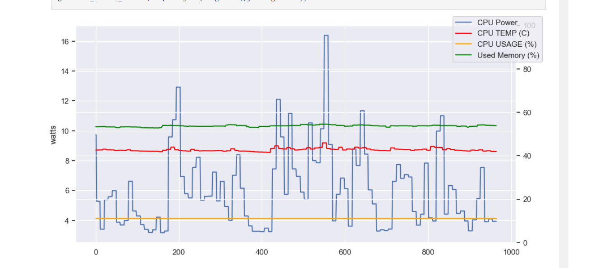

Furthermore, several programs to visualize data from CSV files exist, such as Microsoft Excel or Google Sheets. However, these require some knowledge of data visualization and some time and effort to turn this data into nice imagery, which may be very tedious for a developer solely trying to improve energy efficiency.

Finally, several visualization libraries for various programming languages exist, but again, these require knowledge of both the programming language, as well as the library code. Besides this, displaying a proper overview of energy statistics still takes energy and time, as the overview must be coded. Again, these solutions are not accessible enough for easy data interpretation.

# Solution description

We have decided to create a tool that allows users to easily upload `EnergiBridge` output CSV files and compare sets of files. The tool is called `EnergiReporter` and is available [online](https://energi-reporter.streamlit.app/) ([source code](https://github.com/tpenning/EnergiReporter)). The tool allows for data analysis of files that belong to a single group, as well as comparing two groups of files. The most important quality attributes are *accessibility*, *availability*, and *flexibility*. The application must be easy to use and accessible to everyone, irrespective of their previous knowledge on programming or data analysis. The tool must also be available, which is achieved by deploying the tool as a web application. Flexibility is important, as the tool should be flexible enough to support many additional data analysis components in the future. Below, we describe how the app was built and the features of the data analysis interface and the data comparison interface, respectively.

## Streamlit

The app was created using the popular data app building framework [`Streamlit`](https://streamlit.io/). Streamlit has many different standard elements which were utilized to allow easy file uploading and show various plots. Furthermore, it offers rapid prototyping. The abundance of documentation and examples combined with the easy-to-use live preview significantly sped up the development process. Additionally, as the project is open source and Streamlit is well documented, other developers might be inspired to extend the software and create even more energy consumption data analysis components. Finally, Streamlit provides free and quick app deployment services which allowed us to deploy EnergiReporter online, making it accessible to anyone with an internet connection.

## Data analysis

To analyze a group of related files, the "Data analysis" tab can be used. When this is opened, one or several files can be uploaded at the same time:

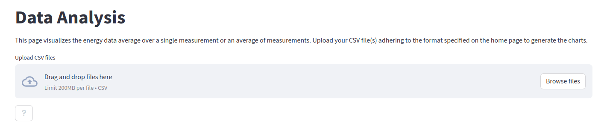

When these files are uploaded, `EnergiReporter` immediately generates several visualizations, which will be discussed in the following paragraphs. 

### Power consumption average over time

First of all, the power consumption average over time is shown:

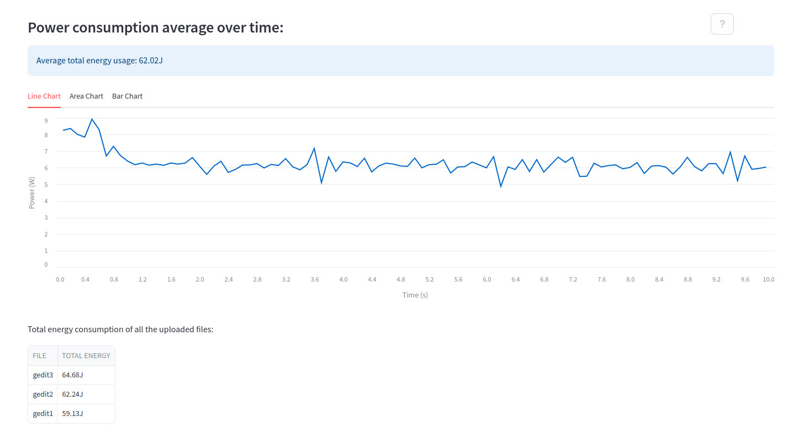

The average total energy consumption and a table of the energy consumption in each file are also reported. Furthermore, the application shows the average power consumption over time in either a line, area or bar chart:

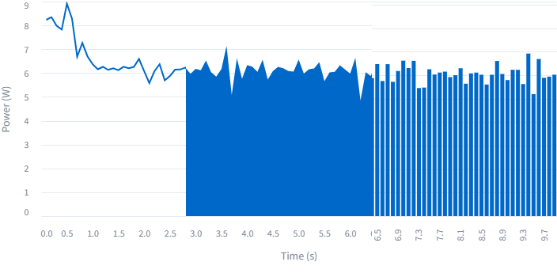

### Power consumption over time with error bands

Furthermore, the average power is also shown with error bands.

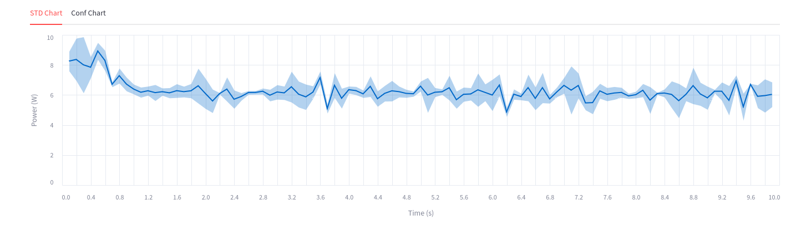

We offer two versions of the error bands, users can select to view the standard deviation (STD) of the confidence intervals (Conf) version.

### Data distribution of Power

Finally, details about the data distribution of power are shown:

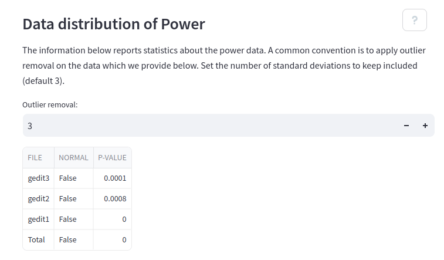

One can apply outlier detection and choose the amount of standard deviations outside of the mean in which points are removed. Furthermore, for each file, a normality distribution test is applied to show whether the data is normally distributed or not. Finally, the data distributions are shown as violin plots:

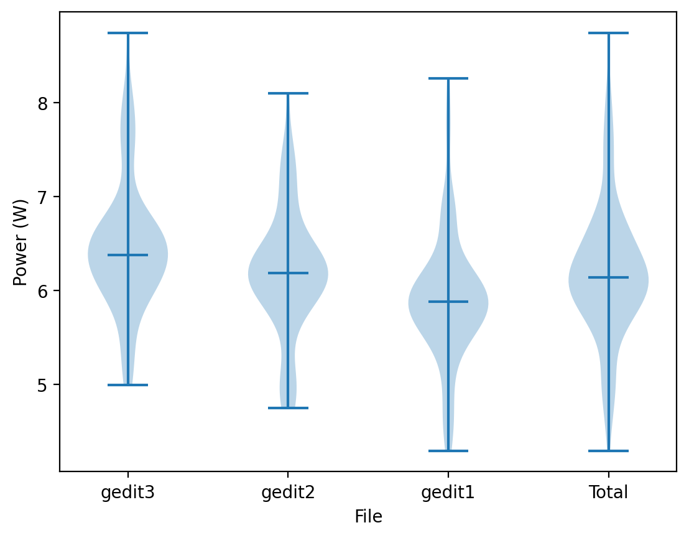

## Data comparison

Similarly to the data analysis, several files can be uploaded. However, it is now possible to divide the files into two groups and compare these groups.

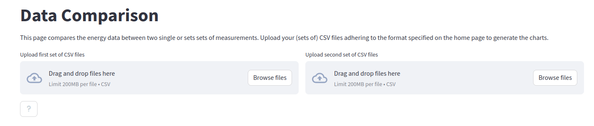

The rest of the visualizations are very similar to the data analysis, only showing the two different groups:

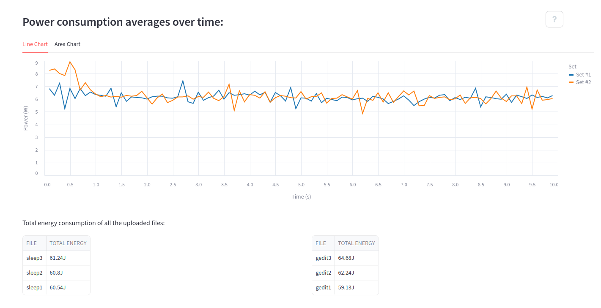

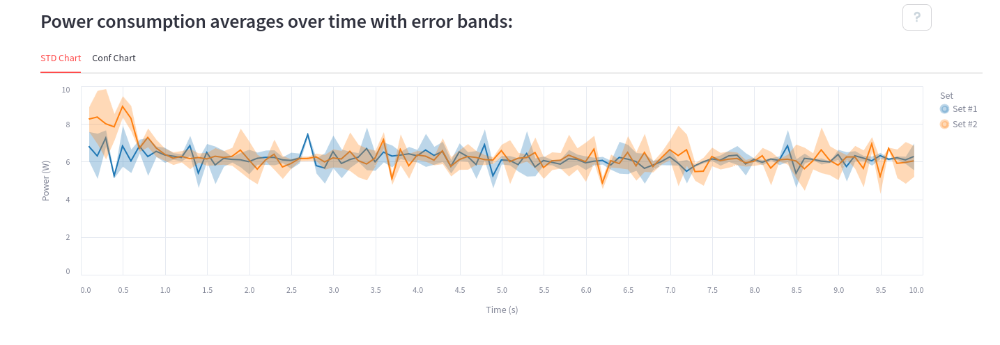

The data distribution of power is the same, but just shown for both datasets (along with the violin plots which are not shown)

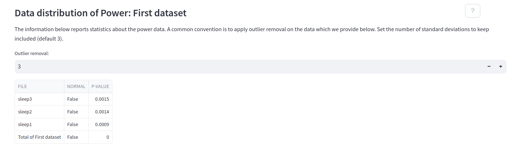

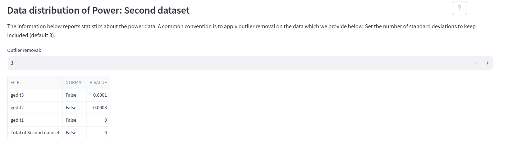

Finally, the data comparison shows the results of some statistical tests:

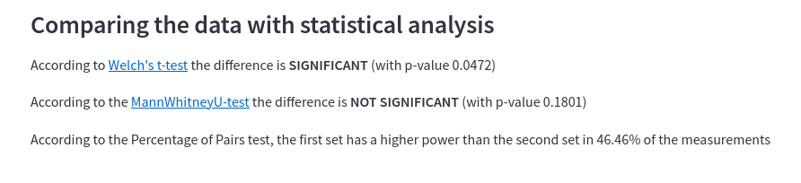

# Discussion

Of course, no tool should be taken for granted as a perfect application. In this section, we will discuss the dissemination strategy and the validation for transparency, showing how one might reproduce/validate our work. Additionally, we detail the limitations we faced when creating `EnergiReporter` and discuss some ideas where future work can extend our app.

## Dissemination & Validation

It is not only important that `EnergiReporter` works well, but also that it is accessible and attractive to use for developers. Again, the app is online available [here](https://energi-reporter.streamlit.app/), and as our app is open-source we have the code on a public [GitHub](https://github.com/tpenning/EnergiReporter). Furthermore, the Readme file contains a short description of the app, as well as installation instructions, running instructions, and some example usage scenarios with screenshots that immediately show a developer what this app offers them.

The example scenarios in the Readme detail real-life use cases with actual EnergiBridge data files. Along with the examples we provide all the information and files required for other developers to follow our validation or attempt similar tests on the application, either locally or online. In the validation process, the EnergiBridge data files were uploaded which generated the plots, tables, and statistical data shown in the images in the Readme and the solution description section. This validation might seem extremely simple, yet this is due to the application's simplistic and effective design. The system was designed with these quality attributes in mind which are highlighted by this simple validation covering most user-system interactions.

## Limitations & Future work

Currently, EnergiReporter was designed with the energy data file format of EnergiBridge in mind, limiting its use cases. The CSV input files must have *one* of the following energy or power columns: `CPU_POWER (Watts)`, `SYSTEM_POWER (Watts)`, `CPU_ENERGY (J)`, or `PACKAGE_ENERGY (J)`, along with a `Time` column with the values in `ms`. Different energy measurement utilities have differing CSV file formats, and while some may contain the required columns, others do not. Despite files from other services being able to benefit from the same report generation, the functionality of our app is purely limited to the EnergiBridge format. Extensions of our work could include more column energy/power possibilities common in these other measurement utilities. Additionally, some may report a `Delta` column instead of time as the logic behind it should be nearly identical. Do note that a `Time` column is generally preferred as it corrects itself better in the long run. For example, the delta column of EnergiBridge tends to round down to 99ms instead of 100ms which shifts the data after many steps.

Due to the nature of how Streamlit applications work, there are some limitations on the user experience. The pages implemented with the Streamlit framework work by (re)running the code whenever a user switches to the respective page. Considering our application, if a user switches between the "Data analysis" and the "Data comparison" pages this would cause the destination page's code to be rerun. Even if the user visited the page before they would have to re-upload their files, luckily this is easy to do, however, repeatedly uploading the same files is not a part of the ideal user experience. Future work can improve this part of the experience by implementing a caching system of sorts that would restore the files whenever a user visits a page.

Lastly, when designing `EnergiReporter`, it was chosen to have the data comparison only compare two sets of data to focus on the one-on-one difference. For specific use cases, a user might prefer to compare multiple sets using our plots instead which currently is not supported. Currently, the majority of the code can support more data sets, however, some sections rely on hard-coded information and therefore they do not scale. Future developers can easily upgrade the data set input capacity by increasing the defined information of these hard-coded aspects. Additionally, some input similar to how a user can select the outlier removal could be used to give the user control over how many data sets they want to compare.

# Conclusion

This report displayed the application `EnergiReporter` to easily interpret large files containing energy consumption data. The application is an easy-to-use web application to promote accessibility and availability, as the tool should be easy to use by any user seeking to grasp their energy consumption data, irrespective of their experience with data analysis and programming languages. With the application being open-source and the use of the well-documented app-building framework Streamlit, the app remains flexible for potential future improvements, which can be provided by any programmer interested in the matter. While there are many more potential upgrades to be included, `EnergiReporter` already provides a strong data analysis foundation based on the `EnergiBridge` CSV file format. The data is represented in easy-to-understand and clear graphs, with additional explanations. Analyzing your energy consumption data has never been so easy!

