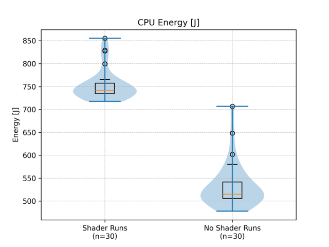

# Energy Consumption in Gaming: Minecraft Shaders

## **Introduction**

Modern video games can be surprisingly power-intensive, and how we configure their graphics can greatly influence energy use [1]. A study by Berkeley Labs claims that in California, computer gaming now accounts for about 5% of residential electricity [2]. Additionally, research highlights that gaming is not only one of the most significant plug loads in households but also among the most complex energy demands to analyze and optimize [2].

*Minecraft* is a widely popular sandbox game which supports the addition of shaders (small modifications which enhance lighting and effects) that can transform a mild workload into a demanding one. While these extensive graphical modifications can improve visual fidelity, they can also increase power consumption [3]. 

Thus, understanding the relationship between graphical settings and energy consumption is essential for investigating energy efficiency and minimizing the overall energy footprint of computer gaming.

This article focuses on comparing the energy consumption of Minecraft when running it **with shaders** versus **without shaders**. Our goal is to measure how much additional power is required to render advanced graphical effects provided by shaders, further discussing the implications for gamers and developers aiming for energy efficient gaming.

### *What are shaders?*

Graphical shaders are programs that run on the GPU (Graphics Processing Unit) to define how visual elements are rendered and displayed in a game or application [4]. 

Early GPUs relied on a fixed-function pipeline, offering developers a limited set of predefined graphical features that could be toggled on or off [4]. While this approach allowed for impressive visuals at the time, it restricted flexibility and creativity in rendering techniques.

To overcome these limitations, modern GPUs have evolved to support programmable shaders, which are custom programs that replace specific stages of the rendering pipeline. Instead of relying on built-in blending or lighting methods, developers could now write their shader programs to achieve precise visual effects.

This shift not only enhanced graphical capabilities but also compatibility across different hardware, paving the way for highly customizable and visually rich graphics in modern games.

### *Shaders in Minecraft*

Minecraft is a game that has a massive modding scene. Given the customizability of modern GPUs, the usage of shaders has become prevalent amongst the game’s player base. They enhance the game’s visuals with realistic lighting, shadows, and textures, and there are a variety of shader-packs to choose from which differ in implementation, fidelity, and design.

The rendering of shaders in Minecraft is mainly handled by the GPU (Graphics Processing Unit), as it is designed to process and render graphics quickly and efficiently. The GPU acquires information from the game’s graphics engine and applies the selected shader effects to create the desired improved graphical fidelity.

Minecraft (Java Edition) was developed using OpenGL’s fixed function pipeline, as the graphics were simple and only required basic functionality. Most shaders are therefore run with third-party tools such as _Iris_ or _Optifine_, rather than using built-in shader support, due to its lack of versatility [4].

Additionally, Minecraft is a CPU (Central Processing Unit) intensive game due to several factors, such as procedural terrain generation, physics calculations, or general game logic [5]. While shaders generally rely more on the GPU, they also require some processing power from the CPU to handle game tasks and calculations [5].

Enabling a shader-pack in Minecraft can therefore push GPU and CPU usage from minimal utilization to high usage, potentially increasing power consumption. This raises the need for analysis, which will be done in subsequent sections.

## **Methodology**

### *Objective of the Study*

The primary objective of this study is to compare the energy efficiency of playing Minecraft with shaders enabled versus without shaders. The experiment measures power consumption under both conditions to analyze the impact of graphical modifications on system energy use.

### *Selection of Shaders*

The selected shader-pack was Complementary Shaders (version 4.7.2) [6]. The shader-pack enhances lighting, reflections, and textures in Minecraft, and is generally appropriate for lower-end systems given its recommended system requirements.

### *EnergiBridge for Energy Measurement*

EnergiBridge [7] is a cross-platform software tool for energy measurement. It is designed to track resource usage (CPU frequency/usage, GPU usage, Machine temperature, Power draw, etc) for a specified command during execution, and outputs the collected data in CSV format for analysis. EnergiBridge gives a precise measurement for the energy consumption automated process of the experiment’s task. 

### *Automation Tool*

pyAutoGUI [8] is a tool allowing for the automation of keyboard/mouse inputs on the machine using Python. It also has functionality that detects images on the screen display, which was used in the experiment to navigate and play the game. Screenshots were taken on the machine the experiment was performed on and put in the `/Images` folder. The confidence was set to 70% to ensure that no bugs/mistakes could interfere with the program.

### *Experiment Setup (`mc_experiment.py`)*
The experiment starts with Minecraft already launched and running. It then follows a structured process to measure energy consumption with minimal bias. The methodology includes:

- **Warmup Phase:** A Fibonacci sequence warmup function (`warmup.fibonacci_warmup()`) is executed before starting the experiment to ensure system stability and prevent initial spikes in energy consumption.
- **Iteration-Based Execution:** The experiment consists of 30 iterations per condition (with shaders and without shaders), shuffled randomly to minimize potential external influences.
- **Automated Execution:** Each test instance is run using a subprocess command with `energibridge`, ensuring consistent logging of GPU and CPU energy consumption.
- **Output Logging:** Each test generates an output CSV file containing detailed energy consumption data.
- **Resting Periods:** A 20-second rest period is included between each iteration to prevent thermal throttling and ensure consistency.

### *Per Iteration Setup (`minecraft.py`)*

1. **Navigate and Load the World** (10 seconds)
2. **Run player experiment** (~40 seconds)  
   - **Buffer time** (5 seconds): _Load shaders if enabled_  
   - **Experiment Steps:**  
     - Teleport player to start location. Set time to day (for consistent lighting)  
     - Walk forward (~30 seconds) through the map (designed to benchmark shader-lighting) 
     - _Disable shaders if enabled_  
3. **Quit the world and navigate back to the title screen** (~10 seconds).  
4. **Rest period** (20 seconds) 

**Total experiment time per iteration:** ~60 seconds

### *Zen Mode*
The experiment additionally was conducted in ‘ZEN mode’ to ensure a controlled environment with reliable results:

- Closing all non-essential applications and non-critical system services to minimize background processes.
- Disconnected unnecessary hardware peripherals to eliminate external power influences.
- Set screen brightness to 100% and disable automatic brightness adjustments.
- Experimenting in a temperature-controlled room to prevent thermal variability.

### *Hardware Specifications:*
- **Processor:** Intel(R) Core(TM) i7-9750H CPU @ 2.60GHz
- **GPU:** NVIDIA Quadro P2000
- **Installed RAM:** 16.0 GB (15.8 GB usable)
- **Monitor Refresh Rate:** 60Hz
- **Desktop Resolution:** 1920 x 1080
- **Color Format:** RGB
- **Color Space:** Standard Dynamic Range (SDR)

### *Software Setup:*
- **Minecraft Version:** 1.21.4
- **Modded Instance:** Iris-Fabric-1.8.8+MC1.21.4
- **Shader-pack:** Complementary Shaders 4.7.2

### **Video of the Experiment**
The following [video](https://www.youtube.com/watch?v=WmE67KBySDA) demonstrates a side-by-side comparison of both experimental conditions (with and without shaders) in Minecraft.

## **Replication**

To ensure the experiment is replicable:
- The **same hardware and software settings** must be maintained across all runs.
- The **game world must be identical** for all test iterations.
- **All background processes and unnecessary peripherals must be disabled** to minimize external factors affecting energy consumption.

To replicate the experiment, the code for measuring energy consumption in Minecraft on Windows can be found in the **Energy Consumption** repository: [GitHub Link](https://github.com/Ayushkuruvilla/Energy_consumption).

## **Results**

We will compare the power consumption values collected from running Minecraft with and without shaders. Data will be presented in tabular and graphical formats to highlight differences in energy usage.
### *Results averaged over 30 runs*

| Metric            | Shaders Disabled | Shaders Enabled | Relative Difference (mean) | t-test p-value  |
|------------------|----------------|----------------|--------------------------|-----------------|
| Execution Time (s) | 65.336          | 65.488         | +0.23%                   | 1.538e-08      |
| CPU Energy (J)    | 533.224         | 752.289        | +41.08%                   | 3.583e-26      |
| CPU Power (W)     | 8.161           | 11.487         | +40.76%                   | 3.217e-26      |
| GPU Temp (°C)     | 55.76           | 58.20          | +4.38%                    | 0.0            |

### *Results from Median of 30 Runs*

| Metric            | Shaders Disabled | Shaders Enabled | Relative Difference (mean) | t-test p-value  |
|------------------|----------------|----------------|--------------------------|-----------------|
| Execution Time (s) | 65.264          | 65.463         | +0.30%                   | 1.538e-08      |
| CPU Energy (J)    | 515.039         | 741.409        | +43.95%                   | 3.583e-26      |
| CPU Power (W)     | 7.881           | 11.310         | +43.52%                   | 3.217e-26      |
| GPU Temp (°C)     | 56.000          | 59.000         | +5.36%                    | 0.0            |

| Energy (Normalized) | Power |
|---------------------|-------|
|  |  |

| Energy | Time |
|--------|------|
|  |  |

Running Minecraft with shaders significantly increases energy consumption and power usage while only slightly affecting execution time.
- **Time**: Minimal impact, with only a 0.23% increase in mean execution time and a 0.30% increase in median time when using shaders. The p-value suggests a statistically significant difference, but the effect size is negligible.
- **Energy**: Shaders caused a 41.08% increase in mean energy consumption and a 43.95% increase in median energy consumption, indicating a substantial rise in power demand.
- **Power**: The mean power usage rose by 40.76%, and the median power usage increased by 43.52%, reinforcing the conclusion that shaders place a significantly higher load on the system.
- **GPU Temperature**: The average GPU temperature rose by approximately 4-5%, confirming that shaders increase the thermal load, although the system’s cooling mechanism appears to handle the added heat efficiently.

While shaders have little effect on performance, they drastically increase resource consumption. The extremely low t-test p-values across all metrics confirm that these differences are statistically significant, making shaders costly in terms of power and energy efficiency.

| Shader Runs | No Shader Runs |
|------------|---------------|
|  |  |

**GPU Temperature: Shader Runs**
- The GPU exhibits noticeable fluctuations, suggesting that shader processing introduces varying workloads.
- The periodic variations might indicate a pattern in shader execution, possibly linked to frame rendering or computational cycles.
- The consistent oscillations suggest that the cooling system is effectively regulating temperature without excessive spikes.

**GPU Temperature: No Shader Runs**
- The GPU operates more stably with fewer fluctuations.
- Occasional small variations might be attributed to background tasks or minor system adjustments.
- The overall steadiness suggests a more predictable workload when shaders are not running.

| Shader Runs | No Shader Runs |
|------------|---------------|
|  |  |

**GPU Usage: Shader Runs**
- Shows higher GPU usage overall, with frequent spikes reaching around **40%**.  
- The pattern suggests **repetitive workload execution**, likely from running shader programs.  
- The usage fluctuates significantly, indicating periods of increased and decreased computation.

**GPU Usage: No Shader Runs**
- Shows much lower GPU usage, staying mostly below **10%**.  
- There are still small fluctuations, but they are **minor compared to the first image**.  
- This indicates a **significantly lower workload** when shaders are not running.

## **Discussion**
The results from the experiment suggest a noticeable trade-off between graphics quality and energy consumption for Minecraft. Although we observed that adding shader packs only increased the execution time by less than 1%, the additional power required to run the game is much more substantial. In particular, running Minecraft with shaders draws nearly 50% more power and the statistical significance derived from the t-test aligns with this observation. This was to be expected since introducing shaders adds additional overhead/load as the CPU manages the compilation and transfer of shader-related data between the GPU and the rest of the computer at runtime [9]. 

This discrepancy highlights an issue for the gaming community as a whole. While the environmental and financial implications of increased energy consumption may not be too noticeable at a personal level, the additional energy demand and emissions produced are remarkable for a game with over 200 million monthly active players [10]. 

Considering this, gamers should be more conscious of the economic and environmental impact of shader packs. Moreover, developing more computationally efficient shaders and optimizing the game around them would reduce Minecraft’s global environmental footprint while still delivering quality aesthetics for players worldwide.

## **Limitations and future work**

While our experiment offers extensive insights into the energy impact of shaders in Minecraft, several limitations should be noted:

**Limited shader configurations**

For this experiment, we focused our tests on complementary shaders 4.7.2 only. Given that different shaders make use of varying rendering techniques and optimizations, we would expect the results to differ substantially as well. For future work, a wider range of shaders could provide more insight into how their architectures affect energy consumption.

**Limited test duration**

The experiment runs only captured the energy consumption over short intervals. This may not fully represent realistic gameplay, where extended runtimes can result in accumulated hardware temperatures and increased computational load. 

**Variation in loading times**

Loading the world, enabling/disabling the shaders, or quitting the world could vary in time due to the implementation of the game or shader mod, which can cause inconsistencies in game performance. Although we implemented buffer waiting times to mitigate such effects, it may still lead to slight variations in time and energy usage in between runs.

**Interference from background processes**

Despite our efforts to eliminate as many background processes as possible during our tests to minimise interference, some system tasks cannot be disabled. Those processes could have had some minor effect on the energy measurements that we obtained.

**Limited hardware configurations**

The experiments were conducted using only one hardware setup. We anticipate that the energy consumption profiles would be noticeably different when using alternative setups that consist of other GPUs from Nvidia or AMD, which may have different architectures and capacities. Future studies should explore these differences in energy efficiency to provide a more comprehensive understanding.

## **Conclusion**

This study provides an empirical analysis of the energy consumption differences in Minecraft with and without shaders. Our findings highlight the potential trade-offs between visual fidelity and power efficiency, offering insights for gamers and developers seeking optimized performance and sustainability.

By following proper scientific measurement techniques, we ensure that our results remain valid and reproducible. This ultimately contributes to better energy efficiency practices in gaming and software development.

## **References**

[1] Pérez, C., Marcén, A. C., Verón, J., & Cetina, C. (2023). A Survey on Green Computing in Video Games: The Dawn of Green Video Games. arXiv preprint arXiv:2312.09053.

[2] Bourassa, N., Mai, J., Shehabi, A., & Mills, N. (2018). Green Gaming: Energy Efficiency without Performance Compromise.

[3] Konnurmath, G., & Chickerur, S. (2024). GPU Shader Analysis and Power Optimization Model. Engineering, Technology & Applied Science Research, 14(1), 12925-12930.

[4] Miller, Maddy. “What Are Shaders in Minecraft?” Madelinemiller.dev, 23 Feb. 2025, madelinemiller.dev/blog/what-are-minecraft-shaders/. Accessed 27 Feb. 2025.

[5] M., Winny. “Is Minecraft Server CPU Intensive?” Cloudpap, 22 Aug. 2023, cloudpap.com/blog/is-minecraft-server-cpu-intensive-answered/. Accessed 27 Feb. 2025.

[6] ComplementaryDevelopment. “GitHub - ComplementaryDevelopment/ComplementaryShadersV4.” GitHub, 2024, github.com/ComplementaryDevelopment/ComplementaryShadersV4. Accessed 27 Feb. 2025.

[7] tdurieux. “GitHub - Tdurieux/EnergiBridge.” GitHub, 4 Mar. 2024, github.com/tdurieux/energibridge. Accessed 27 Feb. 2025.

[8] asweigart. “GitHub - Asweigart/Pyautogui: A Cross-Platform GUI Automation Python Module for Human Beings. Used to Programmatically Control the Mouse & Keyboard.” GitHub, 2025, github.com/asweigart/pyautogui/tree/master. Accessed 27 Feb. 2025.

[9] Konnurmath, G., & Chickerur, S. (2024). GPU Shader Analysis and Power Optimization Model. Engineering Technology & Applied Science Research, 14(1), 12925–12930. doi.org/10.48084/etasr.6695

[10] Kumar, N. (2025, January 1). How many people play Minecraft 2025 (Active players). DemandSage. demandsage.com/minecraft-statistics. Accessed 27 Feb. 2025