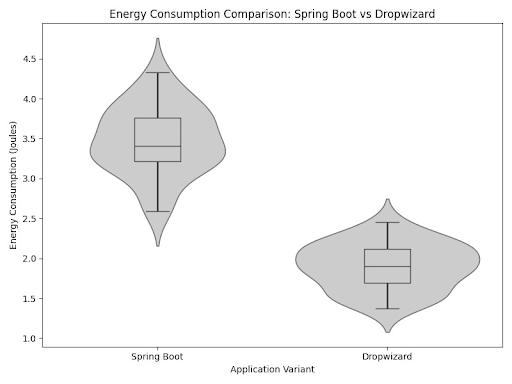

### Introduction 
With the rapid adoption of cloud computing and microservices architectures, software developers are increasingly concerned with not just performance and scalability, but also energy efficiency. Applications, particularly those deployed at scale, can have significant energy footprints, impacting both operational costs and environmental sustainability. A McKinsey report[^report] highlights two major factors behind software energy consumption. The first is communication overhead, specifically the energy cost of data transfer between microservices. The second factor is computation, where inefficient code with excessive abstraction and unnecessary features increases the processing time and energy usage.

In this study, we focus on the management of resources and computation cost, particularly at how applications are built. Spring Boot and Dropwizard are two popular Java-based frameworks used for building microservices and RESTful APIs. Spring Boot is widely adopted for its rich ecosystem, ease of integration with Spring components, and extensive configurability. However, its feature-heavy nature raises concerns about potential performance and energy overhead. In contrast, Dropwizard is designed for simplicity and speed, with a minimalistic approach that favors efficiency and fast startup times. These differences suggest that the two frameworks may have distinct energy consumption profiles, particularly in workloads involving frequent service initialization and high request loads.

This study compares the energy efficiency of the latest version of Spring Boot and Dropwizard in a combined scenario that includes both application startup and handling GET requests for image display. The focus is on evaluating how efficiently each framework serves users under a simulated load that requires minimal computation, emphasizing application startup and request handling rather than processing power. To add a real-world element, we included a UI framework, namely Thymeleaf, to examine how both Spring Boot and Dropwizard manage static resources and render templates. Another key consideration is the underlying application servers: Spring Boot uses Apache Tomcat, while Dropwizard runs on Jetty. We retained these default configurations since they reflect common setups in production environments.

### Methodology 

The following section highlights the design of steps taken for conducting the experiments. As mentioned previously, our objective is to compare the energy consumption between Dropwizard and Spring Boot for starting a service, so for that we had to run two experiments. The study consisted in the following phases:
- Writing the application using the two frameworks.
- Setting up the environment for the measurements.
- Measuring the consumption for the two scenarios.

The functionality of the application is equivalent in both implementations. They expose a GET endpoint that returns an HTML page rendered using Thymeleaf, with 6 different static images.

The experiments were conducted on a MacBook Air M2 with 8GB RAM running MacOS Sonoma 14.5. With the aim of having a reliable outcome of the experiment, we had to make sure that possible confounding factors could not disturb the measuring process. Therefore, we configured the settings of the laptop to be aligned with the “Zen mode” pipeline presented in the lectures. The configurations we settled on were as follows:
All applications to be closed.
All the notifications to be turned off.
No external hardware to be connected.
Auto brightness to be switched off, and a low level of brightness: the 5th step out of the total 16.
Wifi and Bluetooth connections to be closed.

An important aspect that had to be handled was the temperature of the hardware, which could influence the energy consumption. To avoid that, we included in the experiment script a CPU intensive task of computing a lot of square operations for a 1 minute before starting the experiment. Another important aspect was controlling the external temperature. We have kept the machine in one single place for the duration of all experiments at a stable 22.5℃.

A further precautionary step we had to consider was conducting the experiments multiple times. We decided to repeat it 30 times for each framework, so that random errors, environmental variations and inconsistencies do not affect the outcome. A sleep of one minute between executions was taken to prevent residual effects from previous measurements on future results.

For measuring the energy consumption of the two Java-based frameworks, Spring Boot and Dropwizard, we developed our own tool written in python. It relies on the powermetrics tool available natively on MacOS and on the well-known powermetrics.

PowerMetrics is a tool that provides extensive statistics regarding the machine: detailed information about processes, CPU usage, CPU interrupts, CPU power, and much more. We chose PowerMetrics to extract accurate CPU power usage.

In addition to PowerMetrics we used the established ps tool to extract the percentage of CPU used by the process we aim to evaluate. The way we did it is by running the command ps -eo pid,%cpu,comm . This command returns a list of 3-tuples, with PID, percentage of cpu used and the command of the process. We summed the percentage of cpu used by each process, obtaining the total cpu usage by percentage. Using the PID of the process we are evaluating we get its cpu usage and dividing it to the total cpu usage. Therefore, we get the percentage of active cpu used by the process.

The Python tool we developed combines data from both PowerMetrics and ps in the following manner. It gathers the total CPU power usage from PowerMetrics, and the percentage of active CPU used by the process we are measuring, and interpolates them to get the power used by the process in Watts. The tool then gathers this information once every 100ms, so multiplying the Wattage with 0.1 seconds, we get the amount of energy in Joules used by the process in 100ms. Then the tool can measure the energy consumption as long as the process is set to run and in the end produce a total amount of energy used for the time the process has run, also in Joules.

Leveraging this tool, we have computed an estimate accurate enough for the purposes of comparing the energy consumption of the two applications we developed. We have made the choice of developing our own tool to be able to control the way the energy is computed, as we wished to compute it in a way that it only takes into consideration the CPU power, therefore eliminating as many variables from the result as possible, and highlighting a clear difference between the two frameworks.

To be able to measure the energy consumed by the web servers, in each of the 30 iterations, we first started the application, and set a 60 second limit. This limit means that at the end of the 60 seconds the server will be shut down. After starting the server and waiting for a few seconds to make sure it is able to handle requests, we started our load simulation tool. This is a python script that would send 20 GET requests to the application through Selenium and the Chrome driver. After sending a request, we would wait a short amount of time and then scroll to the end of the page to make sure all images are loaded. We made sure to not use any caching, while at the same time disabling the GPU in the Chrome driver so that the CPU power measurements would be accurate. For reproducibility, the test setup can be found on [Github](https://github.com/anaterna/sustainablesoftware).

### Results 

The energy consumption measurements for both the Spring Boot and Dropwizard web servers were collected over a 60-second period while handling 20 GET requests from our load simulation script. The results are visualized in the violin plot, Figure 2, which displays the distribution of energy consumption values for each framework.
The data shows a clear difference between the two frameworks. Spring Boot consistently consumed more energy, with values mostly ranging from 2.8 to 4.2 Joules. The median energy consumption was approximately 3.5 Joules, and the larger spread of the samples indicates some variability. The density plot suggests that most values clustered between 3.2 and 3.8 Joules, with occasional peaks reaching up to 4.5 Joules.
Dropwizard, on the other hand, demonstrated significantly higher energy efficiency, ranging from about 1.3 to 2.3 Joules. The median consumption was around 1.9 Joules, and the samples were much more concentrated, indicating more stable energy usage. The majority of the values fell between 1.7 and 2.1 Joules, suggesting a more consistent and efficient performance compared to Spring Boot.
The results indicate that Dropwizard is notably more energy-efficient than Spring Boot under similar conditions. The wider distribution of energy consumption measured in the Spring Boot variant of the application suggests that the greater features of this framework come with noticeably higher overhead.
Overall, these findings suggest that Dropwizard is the better choice in scenarios where energy efficiency is more important than number of features.

### Discussion

The results show a clear indication that the Dropwizard version of the application consumes less energy. This is to be expected. The two frameworks have very different design philosophies, which are very likely to affect their energy consumption in their default packaging.

On one hand, Dropwizard is a lightweight and minimalist framework that only includes essential dependencies needed to run the service. This will result in fewer CPU cycles for startup and less memory usage.

On the other hand, Spring Boot is very feature-rich out of the box. It packages more dependencies and has features like component scanning[^scan] to find the classes that should be instantiated as Spring beans[^beans]. This will result in more work done for the startup.

The embedded webservers that come by default with the two frameworks also play a role in the comparison. In performance comparisons[^servlets], it was found that Jetty (used by Dropwizard) is faster and spawns fewer threads than Tomcat (used by Spring Boot).

However, considering the bigger picture, it is very important to consider that Spring Boot promotes convention over configuration. This might facilitate various integrations, limit the overall development effort (and hence the energy consumption to develop the application). This is a trade-off that is ideally managed on a per-usecase basis.

### Limitations and Future Work

One limitation of the Python tool we developed to compute the energy consumption of a process is related to the sampling mechanism. In fact, any energy measurement tool which works based on a sampling rate will be limited in this case. Due to our testing strategy where we computed the energy consumed by the web server when receiving requests (instead of an idle state), the measurements can sometimes “miss” the request. We have chosen a relatively fast sample rate (an interval of 100ms), but if a request would have been handled in between two measurements, the tool would fail to measure the impact of handling that request. Being able to sample at an even smaller interval would help minimize this issue, but running the experiment for 30 times can also help in mitigating this.

Another limitation of our testing setup is the narrow scope of the app. Real world workloads for applications written using the two frameworks can contain database interactions (e.g. CRUD endpoints), WebSocket connections, use caching mechanisms and use different methods of fetching data (e.g. GraphQL, REST).

Extending the test bench with a broader range of use cases can better highlight the differences between the two frameworks. A granular comparison, based on every specific use case can also reveal if one of the frameworks is more efficient at doing a particular task.

Another interesting starting point for future work is observing how the distribution of requests affects energy consumption. For this study, we have used a load simulator with sequential requests. The experiment can be modified to include concurrent requests, which could consume more power. Frequent context switching and synchronization mechanisms add overhead which will lead to higher CPU usage and hence more power draw. One way to implement this would be to use a load testing tool such as Grafana k6 [^K6].

### Conclusions

This study highlights the trade-offs between energy efficiency and development convenience in modern microservice frameworks. We performed our analysis using the “Zen mode’’ experimentation framework and the PowerMetrics tool to measure the CPU usage of the applications. Both Spring Boot and Dropwizard support efficient application development but their architectures lead to different energy consumption patterns. Specifically, we revealed that Spring Boot requires more energy during both startup and request handling as opposed to Dropwizard due to its various features and configurations which add flexibility, but introduce performance costs. Therefore, developers should consider whether the benefits provided by Spring Boot align with their actual needs or whether Dropwizard, with its lightweight design, can be a better choice for performance-critical applications.

These findings, while not novel, emphasize the need to evaluate what features of a framework are truly beneficial or can be optimized. A promising direction for future research is the use of AI-driven optimizations to address inefficiencies. For instance, machine learning could analyze application usage patterns and determine which features are not utilized and be dynamically disabled.

[^report]: [Making software and data architectures more sustainable](https://www.mckinsey.com/capabilities/mckinsey-digital/our-insights/tech-forward/making-software-and-data-architectures-more-sustainable)
[^K6]: [Load Testing for Engineering Teams - Grafana K6](https://k6.io)
[^scan]: [Spring Component Scanning](https://www.baeldung.com/spring-component-scanning)
[^beans]: [Introduction to the Spring IoC Container and Beans](https://docs.spring.io/spring-framework/reference/core/beans/introduction.html)
[^servlets]: [Comparing Embedded Servlet Containers in Spring Boot](https://www.baeldung.com/spring-boot-servlet-containers)