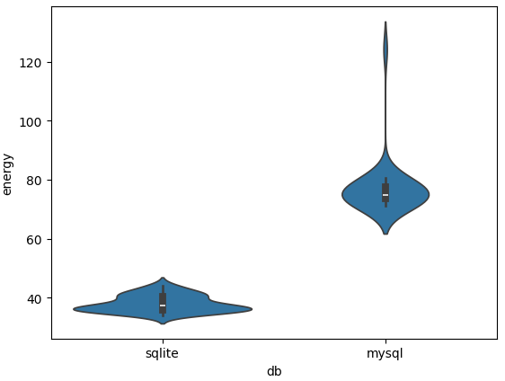
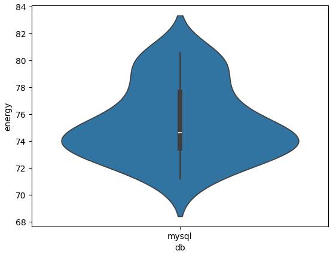
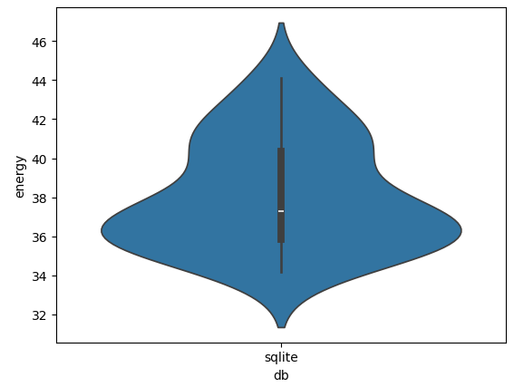

# Measuring energy consumption of SQL databases

In this report, we will investigate and measure the differences between energy consumptions of two SQL relational database management systems (RDBMS). The Structured Query Language[^sql], also reffered to as SQL or sequel, is a well-known cross-platform language most commonly used for managing relational databases. It is used to create, query, change, delete, define and control access to data. SQLite[^sqlite] is based on SQL as its parent language, but uses a local file system to store the database instead of a separate server process to run the database.

For the standard SQL database, we will make use of mySQL[^mysql], as it has been the most popular open-source relational database according to the DB-Engines ranking[^dbengine]. As for SQLite, we chose it because it is the most widely deployed database engine in the world today and is, according to them, "used by literally millions of applications with literally billions and billions of deployments"[^sqlite_users].

By focusing on these two widely adopted databases, our comparison aims to provide insights that are relevant to real-world scenarios.

## Rationale

Large-scale database production systems typically place a higher priority on concurrency, scalability, and performance than on energy usage. Additionally, as a significant portion of the internet relies on databases for storing and managing data, optimizing their energy efficiency is crucial for building a more sustainable digital infrastructure. Indeed, using an energy-efficient database system can help cut power usage, extend device battery life, and reduce overall environmental impact.

By comparing SQLite, which uses a file-based structure, with MySQL, which functions as a server-based RDBMS, we hope to see whether or not the lack of a dedicated database server has a substantial effect on energy usage. Our results may be helpful to researchers, developers, and organizations who want to improve their databases for more energy-efficient projects.

## Experimental setup

This project will use a Brazilian ecommerce public dataset of orders made at Olist Store, containing real world commercial data which has been anonymised. "The dataset has information of 100k orders from 2016 to 2018 made at multiple marketplaces in Brazil. Its features allows viewing an order from multiple dimensions: from order status, price, payment and freight performance to customer location, product attributes and finally reviews written by customers."[^dataset]

From this dataset, we used 5 tables, namely 'customers' (99441 rows), 'geolocation' (1000163 rows), orders (99441 rows), 'products' (32951 rows), 'sellers' (3095 rows).

For our setup, we made use of 'zen mode' in order to minimise superfluous energy usage, not relevant to the measurements. This meant shutting off all processes not associated with the experiment, connecting only required hardware, turning off notifications, setting screen brightness to a (fixed) minimum, turning off bluetooth and wifi. Moreover, for consistency and accuracy, we disconnected power from the computer during the whole experiment. Finally, to warm up the system (and thus the processor) during our experiment, we first ran five queries to both databases totaling about 100 seconds.

The experiment follows the magic number of experiments, repeating 30 times for each database (for a total of 60), with 1 select-all query to each of the 5 tables per experiment.

One experiment, i.e. the queries to all tables, would take approximately 2-3 seconds each. As such, we incorporated 20 seconds (slightly lower than the usual 1 minute) of rest after each test run, which we thought should be enough in order to prevent tail energy consumption from previous runs from overflowing into the next. We considered several factors, namely the fact that the experiments are not extremely resource-intensive and we also open and close connections each time to mitigate caching effects.

Finally, of note is that the order of testing the databases was shuffled in order to try and circumvent any confounding factors as much as possible.

### Specifications

The experiment was conducted at a temperature of 18.5 degrees Celsius.

The hardware used to run the experiments was as follows:

- OS: Windows 11
- CPU: Intel Core i7-10750H @ 2.60GHz
- RAM: 16GB
- Storage: 512GB SSD

As for software, we used:

- Python 3.10.0
- MySQL 8.0.41 (Windows x86, 32-bit)
- SQLite 3.49.1 (Windows x64, 64-bit).

To measure energy consumption EnergiBridge[^energibridge] (v0.0.7), a cross-platform energy measurement program, was used.

## Results
<!-- stat		             	p -->
<!-- shapiro mysql:	(0.9252632856369019, 	0.04153070226311684) -->
<!-- shapiro sqlite:	(0.915923535823822, 	0.021052313968539238) -->
<!-- #non-normal: -->
<!-- mannwhitneyu:	(870.0, 		            4.461750341666232e-11) -->

<!-- Mean difference: 37.283578806910015 -->
<!-- Percentage change: 49.46321041252181 -->
<!-- Cohen's d: 31.75638868642015 -->

<!-- mysql energy usage mean: 75.37638276198814 -->
<!-- sqlite mean: 38.092803955078125  -->

\
*Figure 1: The raw energy consumption by the SQL and SQLite databases.*

After running the experiment we compare the energy usage of the SQL and SQLite databases. The results of the exepriment can be found in Figure 1. To compare the distributions we remove the outliers of the results (see Figures 2 and 3) and check if they are normally distributed. The experiment produced one outlier for the SQL database. To check normallity of the distributions we perform the Shapiro-Wilk test. This results in a p-value of 0.04153 for the SQL energy distribution and a p-value of 0.02105 for the SQLite energy distribution. This means both distributions are not normally distibuted. Therefore, to measure the significance of the difference of the distributions we perforn the Mann–Whitney U test, resulting in a U value of 870.0 and p-value of 4.46175 e-11 << 0.05. This signifies that the difference in distributions is significant.

\
*Figure 2: The result of the mySQL runs, normalized with 1 glaring outliers removed.*

\
*Figure 3: The results of the SQLite runs, also normalized (no outliers).*

The mean energy consumption for MySQL and SQLite was 75.38 and 38.09, respectively, with a mean difference of 37.28 and a percentage reduction of 49.46%. This substantial difference suggests a notable reduction in energy consumption when using SQLite over MySQL.

To further quantify the effect size, we computed Cohen's d, which measures the standardized difference between the two means. The resulting value of 31.77 again indicates a large effect size. These findings will be discussed in further detail in the next section.

Besides the difference in energy consumption we also measure the duration of the experiments. We observe an mean runtime of 5.00 seconds for the SQL databse and a mean runtime of 3.20 seconds for the SQLite database. This mean difference effect size of 1.80 seconds (percentage reduction of 56.25%) also indicates a relevant difference in time.

## Discussion

<!-- - the goal: provide insight for developers in testing
- smaller queries and one user -> SQLite -->
We see that the energy usage of the queries to the SQL database is significantly larger than for the SQLite database. With this experiment our aim was to provide insights for developers in the testing phase of a database. These results are based on smaller databases with queries that are not overly complex to follow the general usecase when testing databases. These results are also aimed at a single user making requests and should not be translated to large databases with many users. Under these conditions we show that based on energy efficiency the SQLite database is superior over the SQL database.

<!-- - SQLite is also easier in use -> also good for testing
- but besides easier -> also more energy efficient and faster
- for testing instances use SQLite -->
The advantages SQLite has in usability over an SQL database already make it favorable to use during the testing phase of a system. Hearby we also show that SQLite is favorable in time and energy efficiency. Therefore, our advise for developers is to opt for SQLite in the development stages of the database to improve the developers time efficiency and reduce the impact of energy usage during development.

### Future work

As stated previously, the experiments might not be resource-intensive enough to have a significant impact on the energy consumption. Therefore, it would be interesting to enhance the experiment by running more SQL queries in succession, resulting in a higher energy profile.

Moreover, the MySQL server is a service running permanently in the background, and to remove any noise from this process it would be better to run the standard SQL variant first and quit the server after, so it doesn't affect the energy consumption of the SQLite experiment.

## Conclusion

## References

[^dataset]: [https://www.kaggle.com/datasets/olistbr/brazilian-ecommerce](https://www.kaggle.com/datasets/olistbr/brazilian-ecommerce)
[^dbengine]: [https://db-engines.com/en/ranking](https://db-engines.com/en/ranking)
[^energibridge]: [https://github.com/tdurieux/EnergiBridge](https://github.com/tdurieux/EnergiBridge)
[^github]: [https://github.com/HuibSprangers-leiden/course_sustainableSE/tree/code](https://github.com/HuibSprangers-leiden/course_sustainableSE/tree/code)
[^mysql]: [https://www.mysql.com/](https://www.mysql.com/)
[^sql]: [https://www.iso.org/standard/76583.html](https://www.iso.org/standard/76583.html)
[^sqlite]: [https://www.sqlite.org/index.html](https://www.sqlite.org/index.html)
[^sqlite_users]: [https://www.sqlite.org/mostdeployed.html](https://www.sqlite.org/famous.html)
