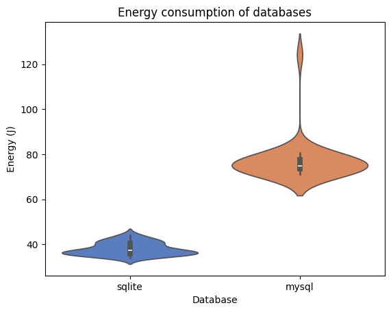

# Measuring energy consumption of SQL databases

In this report, we investigate and measure the differences between energy consumptions of two SQL relational database management systems (RDBMS), namely MySQL and SQLite.

The Structured Query Language[^sql], also reffered to as SQL or sequel, is a well-known cross-platform language most commonly used for managing relational databases. It is used to create, query, change, delete, define and control access to data. SQLite[^sqlite] is based on SQL as its parent language, but uses a local file system to store the database instead of a separate server process to run the database.

As mentioned, we will make use of MySQL[^mysql] as the standard SQL database, as it is the most popular open-source RDBMS according to the DB-Engines ranking[^dbengine].

We compare it against SQLite, because it is the most widely deployed database engine in the world today and is, according to them, "used by literally millions of applications with literally billions and billions of deployments"[^sqlite_famous].

By focusing on these two widely adopted databases, our comparison aims to provide insights that are relevant to real-world scenarios.

## Rationale

Large-scale database production systems strive to implement a shared repository of enterprise data, typically placing a higher priority on concurrency, scalability, and performance than on energy usage. SQLite strives to provide local data storage for individual applications and devices to promote economy, efficiency, reliability, independence, and simplicity[^sqlite_whentouse]. As a result, we hypothesise SQLite to be more energy-efficient than MySQL, which is designed for larger-scale applications.

These two databases are directly comparable but SQLite is trying to solve a different problem than SQL database engines such as MySQL. We believe in a world where they can co-exist in the development ecosystem; one where SQLite is used for development and testing locally with a single developer on a single machine, and MySQL would be used for production. To this end, this experiment targets only at the testing phase of the development of an application.

Additionally, as a significant portion of the internet relies on databases for storing and managing data, optimising their energy efficiency (at least on local machines) could be immensely beneficial for building a more sustainable digital infrastructure. Indeed, using an energy-efficient database system can help cut power usage, extend device battery life, and reduce overall environmental impact. Our results may be helpful to researchers, developers, and organisations who want to improve awareness and reduce energy consumption of databases for more energy-efficient projects.

## Experimental setup

The code for this experiment can be found in our [GitHub repository](https://github.com/HuibSprangers-leiden/course_sustainableSE/tree/code).

This project will use a Brazilian ecommerce public dataset of orders made at Olist Store, containing real world commercial data which has been anonymised. "The dataset has information of 100k orders from 2016 to 2018 made at multiple marketplaces in Brazil. Its features allows viewing an order from multiple dimensions: from order status, price, payment and freight performance to customer location, product attributes and finally reviews written by customers."[^dataset]. We selected this dataset since it is of relevant size to make informative measurements, but it is not unrealisticaly large for the development/testing phase of a database.

From this dataset, we used 5 tables, namely 'customers' (99441 rows), 'geolocation' (1000163 rows), orders (99441 rows), 'products' (32951 rows), 'sellers' (3095 rows).

For our setup, we made use of 'zen mode' in order to minimise superfluous energy usage, not relevant to the measurements. This meant shutting off all processes not associated with the experiment, connecting only required hardware, turning off notifications, setting screen brightness to a (fixed) minimum, turning off bluetooth and wifi. Moreover, for consistency and accuracy, we disconnected power from the computer during the whole experiment. Finally, to warm up the system (and thus the processor) during our experiment, we first ran five queries to both databases totaling about 100 seconds.

The experiment follows the magic number of experiments, repeating 30 times for each database (for a total of 60), with 1 select-all query to each of the 5 tables per experiment. This will allow us to compute significance scores and reason about the differences of the databases.

One experiment, i.e. the queries to all tables, would take approximately 2-5 seconds each. As such, we incorporated 20 seconds (slightly lower than the usual 1 minute) of rest after each test run. We argue that should be enough for the shorter lentgh experiment to prevent tail energy consumption from previous runs from overflowing into the next. We considered several factors, namely the fact that the experiments are not extremely resource-intensive and we also open and close connections each time to mitigate caching effects.

Finally, of note is that the order of testing the databases was shuffled in order to try and circumvent any confounding factors as much as possible.

### Specifications

The experiment was conducted at a temperature of 18.5 degrees Celsius.

The hardware used to run the experiments was as follows:

- OS: Windows 11
- CPU: Intel Core i7-10750H @ 2.60GHz
- RAM: 16GB
- Storage: 512GB SSD

As for software, we used:

- Python 3.10.0
- MySQL 8.0.41 (Windows x86, 32-bit)
- SQLite 3.49.1 (Windows x64, 64-bit).

To measure energy consumption EnergiBridge[^energibridge] (v0.0.7), a cross-platform energy measurement program, was used.

## Results

\
_Figure 1: Violin plots for the raw energy consumption by the MySQL and SQLite databases._

After running the experiment we compare the energy usage of the SQL and SQLite databases. The results of the exepriment can be found in Figure 1. To compare the distributions, we removed the outliers (using z-scores) and checked whether they were normally distributed. To check for the normality of the distributions we performed the Shapiro-Wilk test, which resulted in a p-value of 0.04153 for the MySQL energy distribution and a p-value of 0.02105 for the SQLite energy distribution. This means we can safely assume that both distributions are not normally distibuted. Therefore, to measure the significance of the difference of the distributions, we perforn the Mann–Whitney U test, resulting in a U value of 870.0 and p-value of 4.46175 e-11 << 0.05. This signifies that the difference in distributions is significant.

\
_Figure 2: Violin plot for the MySQL runs, with outliers removed (using z-scores)._

\
_Figure 3: Histogram-density plot for the MySQL runs, with outliers removed (using z-scores)._

\
_Figure 4: Violin plot for the SQLite runs, with outliers removed (using z-scores)._

\
_Figure 5: Histogram-density plot for the SQLite runs, with outliers removed (using z-scores)._

The mean energy consumption for MySQL and SQLite was 75.38 and 38.09 respectively, with a mean difference of 37.28 and a percentage reduction of 49.46%. This substantial difference suggests a notable reduction in energy consumption when using SQLite over MySQL.

To further quantify the effect size, we computed Cohen's d, which measures the standardized difference between the two means. The resulting value of 31.77 again indicates a large effect size. These findings will be discussed in further detail in the next section.

Besides the difference in energy consumption we also measure the duration of the experiments. We observe an mean runtime of 5.00 seconds for the SQL databse and a mean runtime of 3.20 seconds for the SQLite database. This mean difference effect size of 1.80 seconds (percentage reduction of 56.25%) also indicates a relevant difference in time.

## Discussion

Firstly, we believe the rest time between experiments should have been higher. This would have given more accurate results, as the tail energy consumptions of both database types would have been mitigated better. Moreover, running more queries (e.g. running 10 and averaging them) would have given less variable results, which is a possible explanation as to why our data was not normally distributed.

While we recognise the issues with the experiments, we see that there is a significant difference in energy consumption between the two databases. The energy usage of the queries to MySQL is significantly larger than for the SQLite database. With this experiment, our aim was to provide insights for developers in the testing phase of a database. These results are based on smaller databases with queries that are not overly complex to follow the general usecase when testing databases. These results are also aimed at a single user making requests and should not be translated to large databases with many users. Under these conditions, we show that based on energy efficiency the SQLite database is superior over the SQL database.

The advantages SQLite has in usability over an SQL database already make it favorable to use during the testing phase of a system. Hereby, we also show that SQLite is favorable in time and energy efficiency.

As such, an argument could be made for developers to opt for SQLite to test applications (and their databases) locally, at least in the development stages of the database to improve the developers time efficiency and reduce the impact of energy usage during development. Then once deploying the application, the database can be switched to any other SQL database, such as MySQL, to handle the larger scale of the application. This would increase the complexity (as there would be a need to migrate), but the benefits (such as the energy-effiency) of using SQLite during development could outweigh this.

### Future work

As stated previously, the experiments might not have been run for a long enough time to properly create a normalised distribution while accounting for tail consumption of energy. Furthermore, it would be interesting to enhance the experiment by running more SQL queries in succession. If the distribution were to continue to be abnormal, this may then indicate a flaw in our setup.

Moreover, the MySQL server is a service running permanently in the background, and to remove any noise from this process it would be better to run the standard SQL variant first and quit the server after, so it doesn't affect the energy consumption of the SQLite experiment. At the same time, running the two programs seperately instead of randomly switching between them might taint the data. Still, stopping and restarting the server for each run of MySQL might also serve as an alternative, this would most definitely increase its energy profile in a non-representative way, since the MySQL server would be kept running in the background in any realistic usage scenario. Perhaps running the server on a separate device would solve this issue, but even in that case, any sort of connection between the devices, whether wireless or over a cable, would presumably still create noise in the energy profile. Finding the ideal scenario to be albe to compare the energy profile of a serverless profile against one that does use a server could be a subject of interest all on its own.

## Conclusion

In this study, we compared the energy consumption of MySQL, a widely used SQL-based relational database management system, and SQLite, a lightweight, serverless database. Our experiments, conducted under controlled conditions, showed a significant reduction in both energy usage and query execution time when using SQLite over MySQL. Specifically, SQLite exhibited a 49.46% reduction in energy consumption and a 56.25% reduction in execution time, reinforcing its suitability for local development environments where energy efficiency and performance are key considerations.

While our study highlights SQLite’s advantages in terms of sustainability and efficiency, we acknowledge the limitations of our experimental setup, such as potential tail energy effects and variability in energy measurements. Future work could refine these experiments by incorporating longer test durations, alternative measurement strategies, and exploring the impact of different query complexities on energy consumption.

Despite these considerations, our findings suggest that developers can benefit from using SQLite during the development and testing phases, where its energy-efficient and lightweight nature offers tangible advantages. For production environments requiring concurrency, scalability, and robustness, MySQL or similar server-based database solutions remain essential. By adopting SQLite during development and transitioning to a larger-scale database for deployment, developers may achieve a balance between efficiency, performance, and environmental sustainability.

## References

[^dataset]: [https://www.kaggle.com/datasets/olistbr/brazilian-ecommerce](https://www.kaggle.com/datasets/olistbr/brazilian-ecommerce)
[^dbengine]: [https://db-engines.com/en/ranking](https://db-engines.com/en/ranking)
[^energibridge]: [https://github.com/tdurieux/EnergiBridge](https://github.com/tdurieux/EnergiBridge)
[^github]: [https://github.com/HuibSprangers-leiden/course_sustainableSE/tree/code](https://github.com/HuibSprangers-leiden/course_sustainableSE/tree/code)
[^mysql]: [https://www.mysql.com/](https://www.mysql.com/)
[^sql]: [https://www.iso.org/standard/76583.html](https://www.iso.org/standard/76583.html)
[^sqlite]: [https://www.sqlite.org/index.html](https://www.sqlite.org/index.html)
[^sqlite_famous]: [https://www.sqlite.org/mostdeployed.html](https://www.sqlite.org/famous.html)
[^sqlite_whentouse]: [https://www.sqlite.org/whentouse.html](https://www.sqlite.org/whentouse.html)
