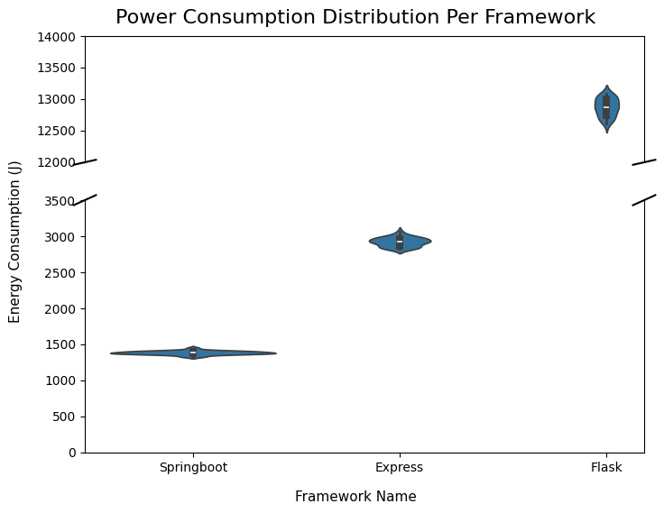

# Introduction

With more people spending time online than ever before, the world generates nearly 400 million terabytes of data per day ([Statista, 2024](https://www.statista.com/statistics/871513/worldwide-data-created/)). As technological demands rise, backend servers must handle complex data streams, from video and audio to AI-powered applications, while maintaining low latency and high reliability. However, this increasing demand comes at a cost: in 2022, European data centers consumed **2.6% of global energy** ([European Commission, 2024](https://publications.jrc.ec.europa.eu/repository/handle/JRC135926)), and in 2023, US-based data centers consumed **4.4% of national energy expenditures**([Shehabi et. al., 2024](https://eta-publications.lbl.gov/sites/default/files/2024-12/lbnl-2024-united-states-data-center-energy-usage-report.pdf)). While a significant portion of this energy is used to cool servers  ([Jin et. al., 2020](https://www.sciencedirect.com/science/article/abs/pii/S0306261920303184)), the computational overhead of processing millions of backend requests per second also contributes significantly to their power consumption.

Given the massive energy demands of data centers, even minor improvements to backend frameworks could help reduce overall power consumption. Some frameworks handle requests more efficiently, requiring fewer CPU cycles or better utilizing system resources, resulting in lower energy consumption per request. But how big an impact can a backend framework really have? In this project, we compare the energy consumption of **Express.js**, **Spring Boot**, and **Flask** to see if software choices can help data centers become even more efficient.

## Backend frameworks
Backend frameworks are software tools that enable backend functionality in web applications. Their attributions range from server-side logic to database interactions, user authentication, and API communication. They ensure that data is processed between the server and the client.

When a user interacts with a website or app, for example, by submitting a form, making a purchase, or loading personalized content, the backend framework processes the request, retrieves the necessary data, and sends the response. This enables applications to run smoothly without requiring users to interact directly with the server or database.

### Express.js
**[Express.js](https://expressjs.com/)** is a _Node.js_ framework that simplifies server-side application development with its lightweight skeleton and customizable routing via middleware modules for both web and mobile applications. Its design enables developers to quickly create APIs and online apps by drawing on JavaScript's asynchronous event-driven architecture. Its adaptability allows it to work with a wide range of libraries, making it a popular choice for scalable, real-time applications.

### Flask
**[Flask](https://flask.palletsprojects.com/en/latest/)** is a simple _Python_ [microframework](https://medium.com/codex/what-are-microframeworks-best-ones-you-should-consider-using-f77eacc44dcb#9873) that offers the necessary tools for building a web app without any strict structure. Because of its lightweight nature, it is compatible with a wide range of other database management, form validation, and user authentication extensions. Flask's considerate design and ease of implementation make it an ideal choice for both small and rapidly evolving projects. 

### SpringBoot
[**SpringBoot**](https://spring.io/projects/spring-boot) is a powerful open-source Java framework included in the Spring package that provides solutions for various products. This framework automatically configures the boilerplate, giving you the freedom to add whatever extensions you want. It provides support for database connections, authentication services, and web servers. Spring enables developers to build scalable, production-ready applications with minimal setup time.

# Methodology 

## Tools
To measure the energy consumption of **Flask**, **Express.js**, and **Springboot**, we set up a reproducible testing repository with minimal external interference. Let's take a closer look at how we organized the experiment!

[**Energibridge**](https://github.com/tdurieux/energibridge) is a command-line tool for measuring the energy consumption of computer processes that can be integrated into a containerized development pipeline. In our case, the process would be the currently running server. The tool outputs the values as `.csv` files, allowing you to track your operations' "energy footprint".

For each framework, we use the [**Apache Benchmark**](https://httpd.apache.org/docs/2.4/programs/ab.html) as it is lightweight and comes installed in most Unix systems. Using this benchmarking tool, we can specify the amount of requests we want to be made concurrently. As it is a simple command-line tool, this way we also mitigate the unnecessary overhead that some load-testing frameworks can have which might affect energy readings. in In our case, we make 10,000 requests with 150 concurrent requests.

## Experimental Setup

We created a containerized Docker environment for each framework, resulting in three isolated server instances. Using Docker containers, we eliminate unnecessary local processes and ensure that energy measurements reflect only the server's activity. Each container runs solely on developer-supplied resources, leading to more consistent data.

For the dataset the frameworks will use for querying, we based it on three `.tsv` files from the [IMDb database](https://developer.imdb.com/non-commercial-datasets/), namely `title.basics.tsv`, `title.ratings.tsv`, and `name.basics.tsv`. We reduced the size of the original dataset by considering only the first 50,000 entries from each of the `.tsv` files.

For each framework, the entries of the `.tsv` files were stored in-memory within datastructures that were most appropriate for the programming language -- an array of objects for Express, a list of dictionaries for Flask and a HashMap for Springboot. These data structures are instantiated when the respective docker containers are built. We followed this approach instead of connecting to an externalk datrabase to mitigate the effects of database connection and timeouts towards the energy consumption measurement for each framework.

## Experiment Procedure

The experiment was completed with an automation script. 

Before the experiment was conducted, the device on which the experiment was run was prepared in order to not collect any energy consumption data from outside influences. All notifications were shut off, all applications were closed, the device was connected to a power plug at all times and connected to wired internet instead of wireless to ensure consistent energy readings. Furthermore, a warm-up phase of completing just one iteration of the experiment was completed and the results discarded. 

The procedure of one iteration of the experiment (with thirty in total) that the script takes is as follows:

1. The order in which the frameworks are tested are shuffled.
2. For each framework:
  - The Docker container for that framework is built.
  - The Apache benchmark command is run with energibridge to collect energy data while the benchmarking script is running.
  - The Docker container is torn down after the benchmarking test is complete.
3. In between each framework, the script sleeps for 60 seconds to ensure no tail energy consumption is recorded.

## Hardware Specifications

The experiment is performed by running the automated batch script on a **Windows 11 Home** laptop that is not running any other services (except for NVIDIA-related ones) and has been warmed up by running one iteration of the experiment. Throughout the experiment, the PC was kept at room temperature and the laptop was plugged into a non-fast-charging power supply.

| **Laptop** | **Lenovo Yoga Pro 9**                    |
|------------|------------------------------------------|
| CPU        | Inter (R) Core(TM) Ultra 9 185H 3.20 GHz |
| RAM        | 32 GB                                    |
| GPU        | NVIDIA GeForce RTX4060 Laptop            |
| OS         | Windows 11 Home 24H2                     |

##### Table 1: Laptop specifications used in our experiment

# Results
After running the experiment, we collected 30 data samples for each framework. With these, we **removed outliers** and began comparing.

The diagram below shows the power consumption in Joules of each framework across all the runs. To better visualize the values, we have removed a section of the Y axis that didn't contain any data.

**SpringBoot** had the most consistent and low power consumption of the three frameworks, despite the common belief that JavaScript-based frameworks would perform better due to their lightweight nature. Additionally, it consumed nearly **90% less energy** than _Flask_! This could be attributed to Java's execution in the [Java Virtual Machine](https://docs.oracle.com/en/java/javase/22/vm/java-virtual-machine-technology-overview.html) (JVM), which supports advanced just-in-time (JIT) compilation and multi-threading. In contrast, Flask (Python) and Express (Node.js) run in interpreted or event-driven environments, which can result in more volatile resource usage. Furthermore, Spring Boot benefits from extensive optimizations within the Spring ecosystem, which contribute to its consistent and efficient power consumption. The combination of both environments also explains the little variance in Spring's consumption.

Then, let's analyze the combination of energy efficency and computation time. This is being shown in the diagram below, displaying the distribution of the Energy Delay Product (EDP).

Again, we see how much better performing _SpringBoot_ is compared to the others. Java's JVM might play a big role into how energy is being consumed for running the code.

## Reliability

Considering how many extra steps were performed before running the experiment, are these values just pure coincidence? Will another person be able to obtain the same clear differences? 

We will use the Shapiro-Wilk method to conduct a statistical significance test on energy consumption. For _Springboot_, _Express.js_, and _Flask_, we get **0.58**, **0.36**, and **0.18** respectively, indicating that the data is normally distributed. This leads to the conclusion that our experimental data is not significantly skewed by any external factors and that further runs of the same experiment will provide the same conclusions.

To support our findings, the conclusions are consistent with what other blogs have said (see [Node.js vs SpringBoot: "Hello World" performance comparison](https://medium.com/deno-the-complete-reference/node-js-vs-springboot-hello-world-performance-comparison-59b4d461526c) or [How fast is Spring?](https://spring.io/blog/2018/12/12/how-fast-is-spring)).

## Limitations
Our experiment aimed to be as close to a real-life setting as feasible. This meant that rather than using a basic request answer body, we chose data processing, which is handled differently by each computer language's internals. This may result in a difference in the amount of energy utilized by each framework, which could be related to Flask's slower response time to the 1000 API calls compared to the other two.

Furthermore, _Flask_ has the most variability in data, which can be linked to the Apache Benchmark crashing the local server in a couple of cases. 

# Conclusions

 - Java performs well on a continuous environment, however think of how taiored it is for your application's goals

# Replication Package
If you would like to run the experiments and view the raw data used in the analysis, check out our [repository](ADD LINK HERE).

