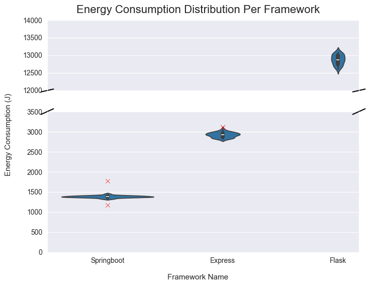
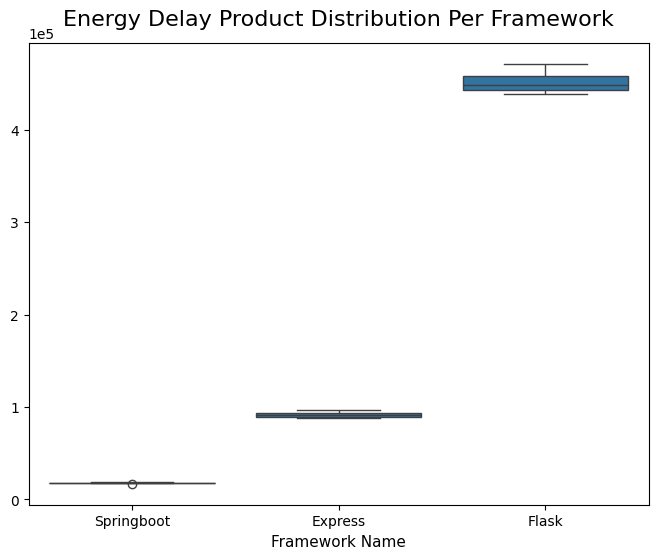

# Introduction

With more people spending time online than ever before, the world generates nearly 400 million terabytes of data per day ([Statista, 2024](https://www.statista.com/statistics/871513/worldwide-data-created/)). As technological demands rise, backend servers must handle complex data streams, from video and audio to AI-powered applications, while maintaining low latency and high reliability. However, this increasing demand comes at a cost: in 2022, European data centers consumed **2.6% of global energy** ([European Commission, 2024](https://publications.jrc.ec.europa.eu/repository/handle/JRC135926)), and in 2023, US-based data centers consumed **4.4% of national energy expenditures**([Shehabi et. al., 2024](https://eta-publications.lbl.gov/sites/default/files/2024-12/lbnl-2024-united-states-data-center-energy-usage-report.pdf)). While a significant portion of this energy is used to cool servers  ([Jin et. al., 2020](https://www.sciencedirect.com/science/article/abs/pii/S0306261920303184)), the computational overhead of processing millions of backend requests per second also contributes significantly to their power consumption.

Given the massive energy demands of data centers, even minor improvements to backend frameworks could help reduce overall power consumption. Some frameworks handle requests more efficiently, requiring fewer CPU cycles or better utilizing system resources, resulting in lower energy consumption per request. But how big an impact can a backend framework really have? In this project, we compare the energy consumption of **Express.js**, **SpringBoot**, and **Flask** to see if software choices can help data centers become even more efficient.

## Backend frameworks
Backend frameworks are software tools that enable backend functionality in web applications. Their attributions range from server-side logic to database interactions, user authentication, and API communication. They ensure that data is processed between the server and the client.

When a user interacts with a website or app, for example, by submitting a form, making a purchase, or loading personalized content, the backend framework processes the request, retrieves the necessary data, and sends the response. This enables applications to run smoothly without requiring users to interact directly with the server or database.

### Express.js
**[Express.js](https://expressjs.com/)** is a Node.js framework that simplifies server-side application development with its lightweight skeleton and customizable routing via middleware modules for both web and mobile applications. Its design enables developers to quickly create APIs and online apps by drawing on JavaScript's asynchronous event-driven architecture. Its adaptability allows it to work with a wide range of libraries, making it a popular choice for scalable, real-time applications.

### Flask
**[Flask](https://flask.palletsprojects.com/en/latest/)** is a simple Python [microframework](https://medium.com/codex/what-are-microframeworks-best-ones-you-should-consider-using-f77eacc44dcb#9873) that offers the necessary tools for building a web app without any strict structure. Because of its lightweight nature, it is compatible with a wide range of other database management, form validation, and user authentication extensions. Flask's considerate design and ease of implementation make it an ideal choice for both small and rapidly evolving projects. 

### SpringBoot
[**SpringBoot**](https://spring.io/projects/spring-boot) is a powerful open-source Java framework included in the Spring package that provides solutions for various products. This framework automatically configures the boilerplate, giving you the freedom to add whatever extensions you want. It provides support for database connections, authentication services, and web servers. Spring enables developers to build scalable, production-ready applications with minimal setup time.

# Methodology 

## Tools
To measure the energy consumption of Flask, Express.js, and SpringBoot, we set up a reproducible testing repository with minimal external interference. Let's take a closer look at how we organized the experiment!

[**Energibridge**](https://github.com/tdurieux/energibridge) is a command-line tool for measuring the energy consumption of computer processes that can be integrated into a containerized development pipeline. In our case, the process would be the currently running server. The tool outputs the values as `.csv` files, allowing you to track your operations' "energy footprint".

For each framework, we use the [**Apache Benchmark**](https://httpd.apache.org/docs/2.4/programs/ab.html) as it is lightweight and comes installed in most Unix systems. Using this benchmarking tool, we can specify the amount of requests we want to be made concurrently. As it is a simple command-line tool, this way we also mitigate the unnecessary overhead that some load-testing frameworks can have which might affect energy readings. in In our case, we make 10,000 requests with 150 concurrent requests. This reflects a real-world scenario where tens of thousands if not hundreds of thousands of requests could be made to an API in minutes.

## Experimental Setup

We created a containerized Docker environment for each framework, resulting in three isolated server instances. Using Docker containers, we eliminate unnecessary local processes and ensure that energy measurements reflect only the server's activity. Each container runs solely on developer-supplied resources, leading to more consistent data.

For the dataset the frameworks will use for querying, we based it on three `.tsv` files from the [IMDb database](https://developer.imdb.com/non-commercial-datasets/), namely `title.basics.tsv`, `title.ratings.tsv`, and `name.basics.tsv`. We reduced the size of the original dataset by considering only the first 50,000 entries from each of the `.tsv` files.

For each framework, we store the entries of the .tsv files in-memory within three Map (or equivalent) data structures with the key as the primary key and the value as the object representation of the entries. This results in three Maps representing the basic information of movies, ratings of movies, and basic information of industry professionals. This is done when the docker container of each framework are instantiated. We followed this approach instead of connecting to an external database to mitigate the effects of database connection towards the energy consumption measurement for each framework

Moreover, within each framework, we implemented an endpoint called `/filter` to simulate the average real-world GET API endpoint that performs some data manipulation. The `/filter` endpoint takes in genre, number of votes, and average rating as query parameters. It subsequently returns JSON list of industry professionals from `name.basics.tsv` whose known-for titles matches the genre parameter, and have number of votes and average rating of at least those provided in the corresponding query parameters. In our experiments, we query the aforementioned endpoint with the Drama genre, number of votes of at least 100, and average rating of at least 9 via Apache Benchmark. 

## Experiment Procedure

The experiment was completed with an automation script (available within our [repository](https://github.com/reglayass/sse-project1)). 

Before the experiment was conducted, the device on which the experiment was run was prepared in order to not collect any energy consumption data from outside influences. All notifications were shut off, all applications were closed, the device was connected to a power plug at all times and connected to wired internet instead of wireless to ensure consistent energy readings. Furthermore, a warm-up phase of completing just one iteration of the experiment was completed and the results discarded. 

The procedure of one iteration of the experiment (with thirty in total) that the script takes is as follows:

1. The order in which the frameworks are tested are shuffled.
2. For each framework:
  - The Docker container for that framework is built.
  - The Apache benchmark command is run with energibridge to collect energy data while the benchmarking script is running.
  - The Docker container is torn down after the benchmarking test is complete.
3. In between each framework, the script sleeps for 60 seconds to ensure no tail energy consumption is recorded.

## Hardware Specifications

The experiment is performed by running the automated batch script on a **Windows 11 Home** laptop that is not running any other services (except for NVIDIA-related ones) and has been warmed up by running one iteration of the experiment. Throughout the experiment, the PC was kept at room temperature and the laptop was plugged into a non-fast-charging power supply.

| **Laptop** | **Lenovo Yoga Pro 9**                    |
|------------|------------------------------------------|
| CPU        | Inter (R) Core(TM) Ultra 9 185H 3.20 GHz |
| RAM        | 32 GB                                    |
| GPU        | NVIDIA GeForce RTX4060 Laptop            |
| OS         | Windows 11 Home 24H2                     |

##### Table 1: Laptop specifications used in our experiment

# Results
Before moving to data analysis, we prepared the data that we collected from the 30 iterations of the experiment. Since we are interested in energy consumption and the time elapsed for each experiment, we extract the relevant data (`PACKAGE_ENERGY` and `Time`) from the `.csv` files created by Energibridge. Since `PACKAGE_ENERGY` is cumulative, to get the value for the energy consumption for one iteration (one reading) of the experiment we subtract the first reading for `PACKAGE_ENERGY` made by Energibridge from the very last one. Finally, to remove outliers, a z-score test is run against the energy readings, and the data points which deviate from the mean by more than 2 standard deviation are removed.

## Testing Normality of Samples

To check the distribution of our data, we perform the Shapiro-Wilk test on each of the frameworks. If the p-value from this test is >0.05, we can safely assume that the data is normally distributed.

| **Framework**     | **p-value**                              |
|-------------------|------------------------------------------|
| SpringBoot        | 0.365                                    |
| Express           | 0.182                                    |
| Flask             | 0.586                                    |

##### Table 2: p-values per framework.

After ensuring normal distribution of our data, we can begin to further analyze the data by visualizing it. The plot below shows violin plots for each for the framework based on energy consumption. The y-axis of the plot was broken as there was a significant gap in energy readings between the frameworks.

##### Figure 1: Energy consumption diagram each framework. The red markers represent outliers detected and removed from the dataset via Z-score outlier removal with a threshold of 2.

Additional, we outline the mean energy consumption of each framework measured from our experiments in Table 3.

| **Framework**     | **Mean Energy Consumption (J)**          |
|-------------------|------------------------------------------|
| SpringBoot        | 1385.402                                 |
| Express           | 2922.147                                 |
| Flask             | 12873.86                                 |

##### Table 3: Mean Energy Consumption per framework.

## Energy Delay Product Distribution
We also wanted to observe the energy delay product distribution for our frameworks, which would penalize slow runs and give more importance to the actual runtime of the application. A low EDP would signal an energy-efficient application, while a high EDP would signal that either the time or energy consumption is relatively high, making for a less efficient application overall. The plot for this can be seen below.

##### Figure 2: Boxplot for Energy Delay Product distribution per framework
 
## Statistical Significance between Samples
To ensure the statistical significance in comparing the readings we took for each framework, we perform Welch’s t-test for each pair of the three frameworks we experimented on. We utilized a threshold of p-value < 0.05 for the comparisons to be statistically significant. Table 4 outlines our results for the Welch's t-tests.

|            | SpringBoot | Express   | Flask |
|------------|------------|-----------|-------|
| SpringBoot |     -      | -         | -     |
| Express    | 6.657 e-49 | -         | -     |
| Flask      | 2.430e-56  | 1.512e-66 | -     |

##### Table 4: P-value from the pairwise Welch's t-tests. Note that the results for each pair is symmetric.

# Discussion
SpringBoot had the most consistent and low energy consumption of the three frameworks, despite the common belief that JavaScript-based frameworks would perform better due to their lightweight nature. Additionally, it consumed nearly 90% less energy than _Flask_. This could be attributed to Java's execution in the [Java Virtual Machine](https://docs.oracle.com/en/java/javase/22/vm/java-virtual-machine-technology-overview.html) (JVM), which supports advanced just-in-time (JIT) compilation and multi-threading. In contrast, Flask (Python) and Express (Node.js) run in interpreted or event-driven environments, which can result in more volatile resource usage. Furthermore, Spring Boot benefits from extensive optimizations within the Spring ecosystem, which contribute to its consistent and efficient energy consumption. The combination of both environments also explains the little variance in Spring's consumption.

From the plot in Figure 2, we can see that SpringBoot is not only the smallest energy consumer but is also the most efficient. Flask is once again the least efficient framework, given that it took more time on average to run the benchmarking test and seeing as it was also the highest energy consumer out of the 3 frameworks. The EDP distribution for Express lies closer to SpringBoot's. However, if we look back to Figure 1, we can see that the energy consumption for Express is about twice as much as SpringBoot's, but the energy product distribution is very close. We can conclude from this that while Express is not a large energy consumer, it is slower, thus making for a slightly less efficient framework.

To support our findings, the conclusions are consistent with what other blogs have said (see [Node.js vs SpringBoot: "Hello World" performance comparison](https://medium.com/deno-the-complete-reference/node-js-vs-springboot-hello-world-performance-comparison-59b4d461526c) or [How fast is Spring?](https://spring.io/blog/2018/12/12/how-fast-is-spring)).

## Limitations
Our experiment aimed to be as close to a real-life setting as possible. As mentioned previously, for our benchmarking tool we specified 10 thousand requests with 150 concurrent requests. This mimics a real-world usage of an API that connects to a datacenter, as you can have tens of thousands or hundreds of thousands requests per minute. However, we are of course limited by the fact that our Docker containers simulating the datacenters were locally hosted and thus the performance of the containers was dependent on the performance of the testing device. This limitation also meant that using a database connection would result in more time-outs and maximum pooling issues, which led to our decision to use local data for each of the frameworks, which meant the performance of these frameworks hinged on the performance of data processing for each of the frameworks. Furthermore, _Flask_ has the most variability in data, which can be linked to the Apache Benchmark crashing the local server in a couple of cases. 

# Conclusion
This experiment aimed to determine if a developer could influence server energy consumption by comparing three popular backend frameworks: _Flask_, _Express.js_, and _SpringBoot_. Over the course of 30 trials, we used _Apache Benchmark_ to simulate concurrent API requests while running each framework in its own _Docker_ container. Our findings show that Spring Boot provides the best balance of energy efficiency and processing speed. This advantage is most likely attributed to Java's internal optimizations, such as JIT compilation and multi-threading, which differ significantly from Python and JavaScript execution models.

Although the way backend communication is implemented may have a minor impact on total energy consumption in data centers, our statistically significant results indicate that even minor optimizations can contribute to significant efficiency gains. As digitalization progresses, energy consumption will become an even more critical factor, making efficient backend decisions increasingly important.

# Replication Package
If you would like to run the experiments and view the raw data used in the analysis, check out our [repository](https://github.com/reglayass/sse-project1).

