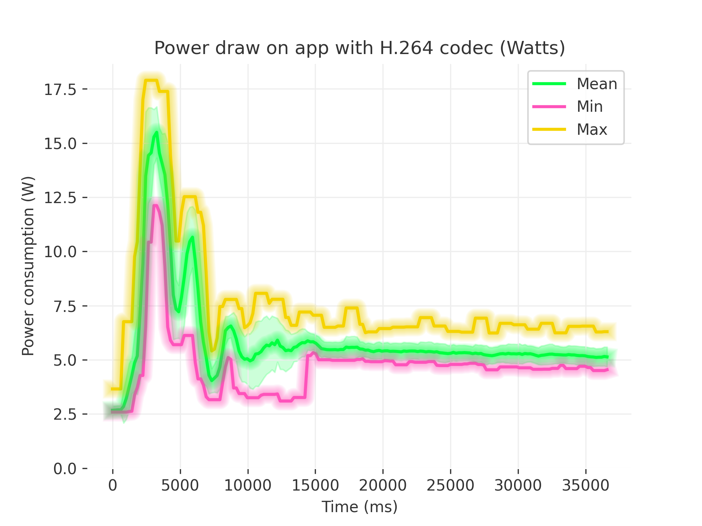
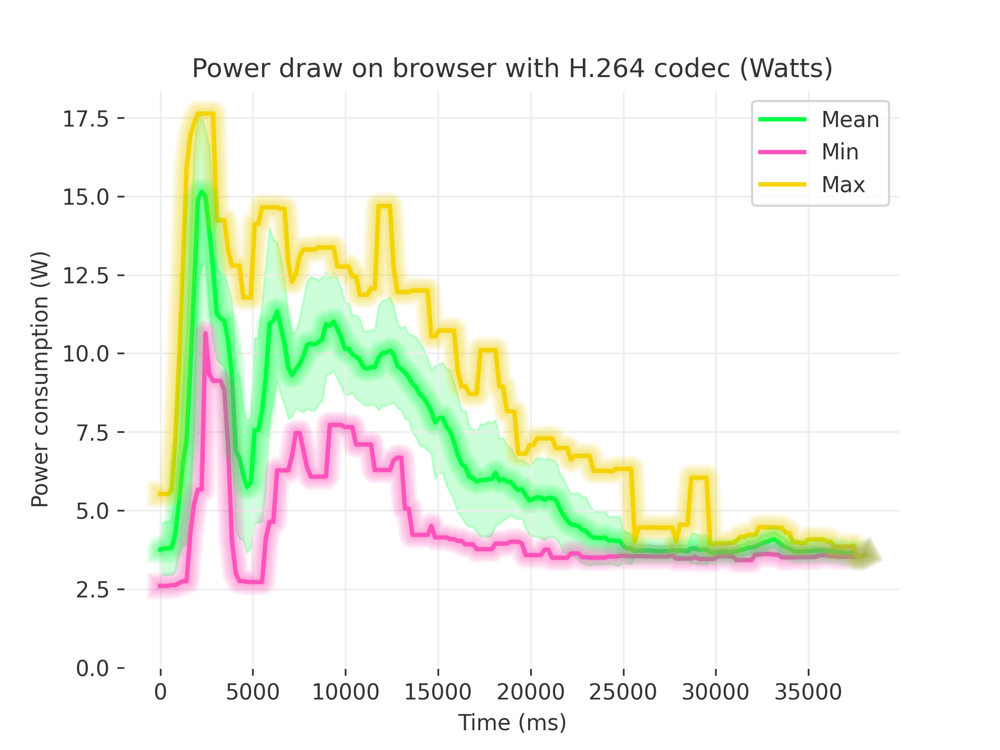
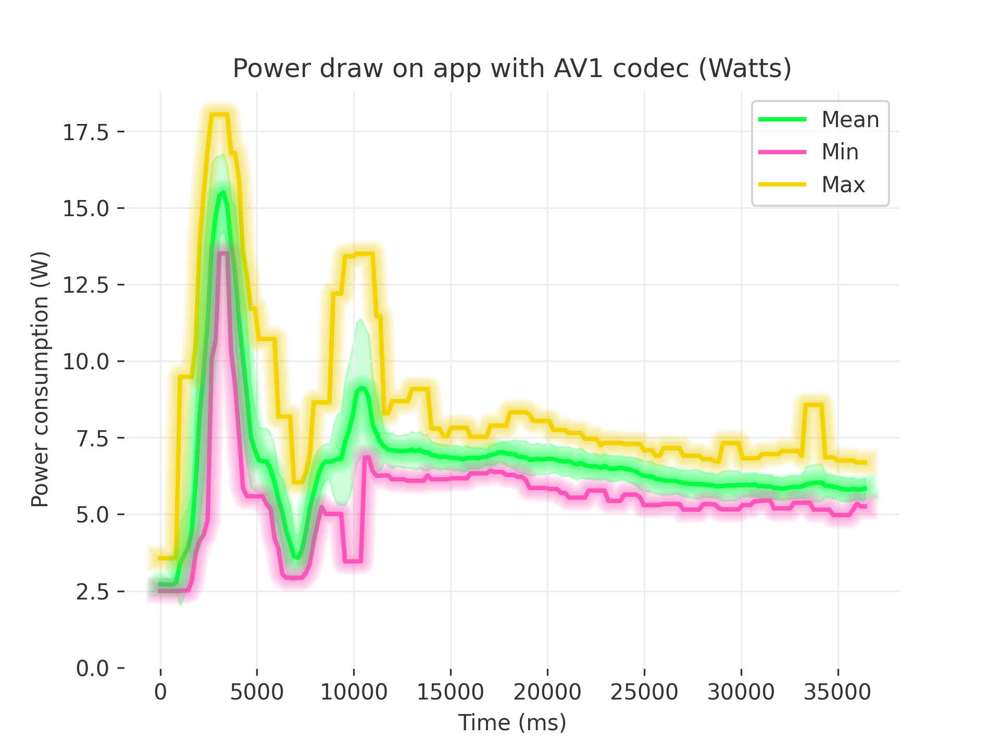
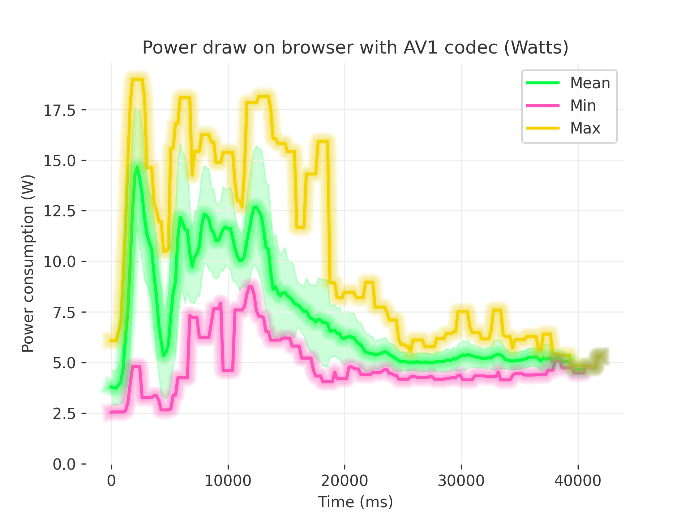
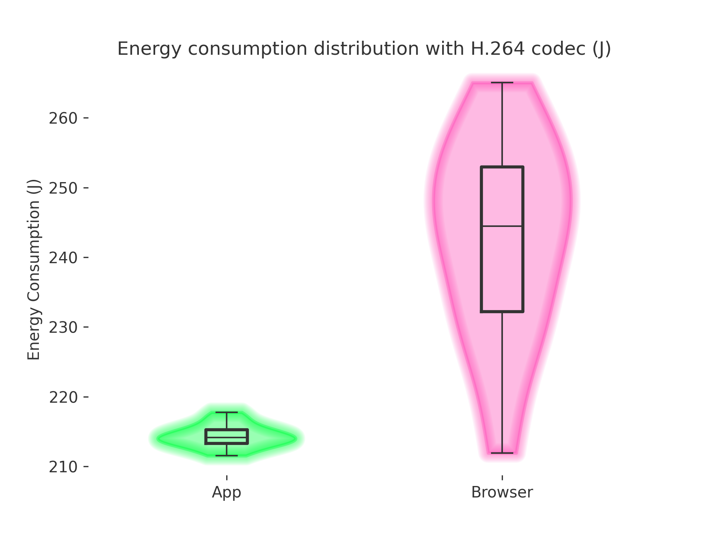
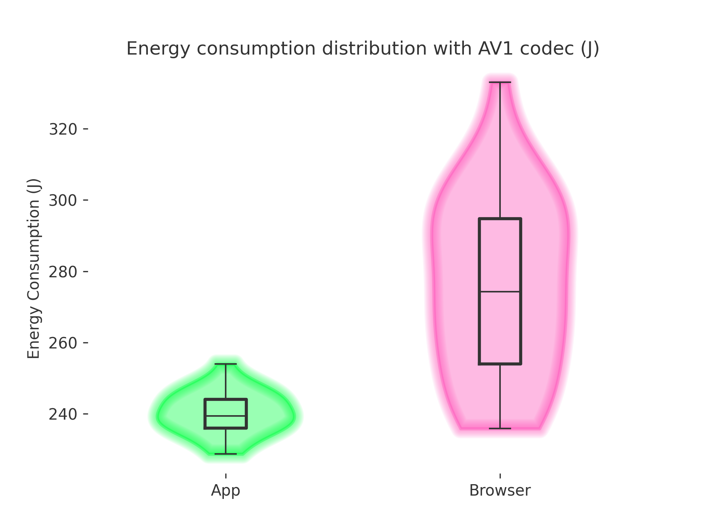

## Introduction

Energy efficiency is a growing concern all over the world, and as sofware and AI develops in giant steps, it is also a concern in the software development area. As applications become more resource-intensive, understanding the energy consumption of different software configurations is essentail.

This study follows a systematic methodology to ensure unbiased and replicable energy measurements. The results of this experiment will help users and developers make informed decisions about optimizing software for energy efficiency.

All code used for these experiments can be found [here](https://github.com/Jeroentjuuh/CS4575_project_1).

### Program under test

We will be comparing the energy usage of [Jellyfin](https://jellyfin.org/), a free open-source media server that is used for managing and streaming a media library. In this experiment, we compare the energy consumption of streaming a small piece of a movie using the web browser interface versus the Jellyfin client native application. By measuring the energy consumption of these two approaches, we aim to identify which method is more energy-efficient and under which circumstances.

### Video codecs

We also investigate the difference between different video codecs, limiting our experiment to codecs that are supported on the webbrowser. A video codec is a piece of software that is used to compress and store video. The most popular codecs are H.264 and its more modern successor H.265, which are used in .mp4 files for example. A new codec that is gaining in popularity with users and streaming services is AV1, which is an open source codec aimed at achieving high image quality with low file sizes or bandwidth requirements. Since H.265 is not supported on webbrowsers, we will be testing H.264 and AV1.

### Difference between app and browser

To explain any differences between the energy usage of the browser and the native app, it is important to know the differences between the two. The interface of the browser and the native app are the same. For the webbrowser we will use Google Chrome which uses the V8 engine. The native app is written in C++ and uses QTWebEngine, which integrates the Chromium web engine into Qt. Qt is a framework for creating cross-platform user interfaces. This means that the user interface in both the webbrowser and the native app use the same V8 engine.

The media player used for video and audio playback differes between the browser and native app. The webbrowser uses proprietary video codecs for which Google pays a licensing fee. The native app uses [mpv](https://github.com/mpv-player/mpv), which is an open-source media player. This means that the native app and Google Chrome use different softwar for decoding videos. It is also important to note that mpv supports a very large variety of video and audio codecs, whereas webbrowsers only support a small number of audio and video codecs. When an unsupported audio and/or video format is played back via the browser, the Jellyfin server will convert the unsupported format to H.264 in real-time. This uses a very large amount of energy, as video transcoding use 100% CPU on all cores. Therefore, playing unsupported formats (such as the popular H.265) on the browsers is guaranteed to use massively more energy than playing the same video in the native app. Because this result would not be particularly interesting, we did not measure this.

## Methodology

### Experimental Setup

To compare the browser version to the native app we created an automatic testing script. We chose to use the Google Chrome browser and downloaded the most recent version of the MacOS Jellyfin application (v1.11.1) and Jellyfin server v10.10.3. The task consists of logging in to the jellyfin server, searching for a video and watching for a predefined amount of time before closing either the browser or app. Whichever we were testing.

For these experiments we had the automated script watch 30 seconds of video. To also include different video codecs we ran experiments on the movie '2 Fast 2 Furious' which with an H.264 codec, and on the movie 'Moana 2' with an AV1 codec. For these experiments the same browser was used, and the same Jellyfin application was used.

### Hardware setup

The experiments are performed using a MacOS laptop - see specs in the table below - for which all applications are closed that are not necessary to run MacOS. Additionaliy, all notifactions are disabled and even things like Bluetooth and AirDrop are disabled.
For the experiments the intention was to run on a wired ethernet connection, as it is generally considered that wifi uses more energy than ethernet to transmit the same data. We do note, however, that this was not possible due to this specific laptop not having an ethernet connection and we were not in possesion of an usb-C to ethernet adapter. Therefore, to make sure we are consistent along all tests we ran connected to the hotspot of one of our group members.

For the hardware setup we aimed to minimize any hardware related energy usage. With that in mind we wanted to run the experiments with the screen turned off. We ran in to an issue where one of the tests proved just a tiny bit flakey, therefore we had to inspect if our experiment had failed or not. We decided to have the screen on, but on a predefined brightness and with any automatic adjusting of screen brightness turned off. So we could still provide consistency along the different experiment runs. The video was also played back with the sound muted.

Lastly, the machine was connected to the power outlet at all times. This was done to mitigate any inference in energy usage because of power saving modes. The laptop was also fully charged prior to starting experiments. We also made sure the system wouldn't sleep by using a builtin macos function called [caffeinate](https://ss64.com/mac/caffeinate.html). For which we had an extra terminal open.

These settings all aimed to minimize external interference of energy measurement and for easier replicability. And therefore had a controlled environment.

| Laptop       | MacBook Pro 14-inch 2023                |
| ------------ | --------------------------------------- |
| CPU          | Apple M2 Max (8p/4e) @ 3.49GHz/2.42Ghz  |
| RAM          | 64 GB 6400MT/s                          |
| GPU          | 30-core @ 13.6 TFLOPS                   |
| OS           | MacOS Sequoia v15.3.1                   |
| Display      | 14-inch Liquid Retina XDR @ 3024 x 1964 |
| Battery      | 70-watt-hour lithium-polymer battery    |
| Power supply | 96W USB-C Power Adapter 20.5V 4.7A      |

### Measurement Approach

We used pyEnergiBridge to measure the energy consumption of the Jellyfin web browser interface and the Jellyfin native application while playing the same movie. The measurement process involves the following:

- Starting the energy measurement: Using EnergiBridgeRunner.start() before launching the playback.
- Using the browser or application interface to navigate to the movie
- Playing the movie for a fixed duration (30 seconds)
- Stopping the measurement: Using EnergiBridgeRunner.stop() after the playback ends.
- Recording the energy consumption (J) and execution time in a csv file.
- After each measurement sleep for 30 seconds to make sure the next measurement does not include any tail energy consumption

We used the energy consumption method over the average power draw since we include the energy startup cost of opening the browser or app and also close the application afterward. Therefore, this is a very defined task for which we can best use energy consumption.

## Results

### Power Draw on the App

Plot description:

- X-axis (Time in milliseconds).
- Y-axis (Power in watts): the total system power draw.
- Lines:

  - Green (Mean): the average power across multiple measurements at each time slice.
  - Green area: standard deviation of the mean power.
  - Pink (Min): the lowest power measurement observed at each time step.
  - Yellow (Max): the highest power measurement observed at each time step.

General Shape: there is a pronounced spike in the first ~7s, after which the power draw stabilises, and eventually settling into a moderately stable range.
If we go more in more depth, we can divide the graphs in sections. In the startup phase we can observe that the initial spike to nearly 18W is common at the start of the application. The power draw then drops as the application finishes starting at ~5 seconds. In the second phase, power draw then peaks again while searching for and starting the playback of the movie between ~5 and ~15 seconds as the application is making requests, loading thumbnails, and playback starts performing video initialization, buffering, and possibly hardware-acceleration handshakes. The difference between min and max indicates short bursts of higher CPU/GPU activity, we could see this section as the settling section. The third section from ~15s onward, after the first peak, the power consumption drifts with less dramatic peaks.

### Power Draw on the Web Browser

Plot description:

- Similar Layout: same axes for time (ms) and power (W).
- Lines: same as the previous plot.

General Shape: it also features a high spike initially, followed by a decline, however this happens later than with the native app. Especially the startup phase and the searching phase in the webbrowser uses a lot more energy compared to the native app.
In this graph we can also divide it into different sections. The first section from 0 to ~5s, the peak reaches almost 18W again, for the same reasons (startup) as with the native app. The second section from ~5-20s, during the searching for the movie, is also way more power intensive compare to the native app. The last section from ~20 seconds onwards, there is a mild downward trend while playing the movie. The mean goes from ~9-11W at the start of playback down to around ~3-5W at the end depending on the codec.

### Power draw comparison between browser and app

Both the browser and app have similar behavior, but the browser uses a lot more energy, especially during the startup and searching phase. We also notice that the native app quickly settles into a stable power draw once streaming has started, while the browser takes longer to reach it's most efficient point. This may be due to the different codecs used by mpv and Google Chrome, and could also be related to the V8 engine from Chrome optimizing functions more and more if they are frequently used.

### Energy Consumption Distribution (Violin + Box Plot)

Plot description:

- X-axis: Two categories, App (green) and Browser (pink).
- Y-axis: Total energy consumption in Jules (J) over the entire test.
- Violin Plots: Show the overall distribution (thick areas indicate more frequent values)
- Box Plots: Show the median line, interquartile range, and possible outliers.

Three observations are clear from the distributions:

- The native app is a lot more consistent in the total energy used compared to the webbrowser. Comparing the spread of the two distributions clearly indicates that the webbrowser may use very different amounts of energy to perform the test.
- The native app uses significantly less energy compared to the webbrowser. As seen in the graphs above, this is both caused by the startup and search phases using more energy in the browser. In addition, the energy usage while streaming takes longer to settle than witht the native app, and even then is still higher in the browser.
- H.264 is more efficient than AV1 when it comes to energy usage. This is to be expected and in line with what was mentioned in the introduction. The AV1 codec is designed to use less bandwidth/storage than H.264. This does however result in it requiring more processing power to encode and decode, which is confirmed by our experiment.

### Statistical significance

To test whether the collected data resembles a normal distribution, we use the Shapiro-Wilk test. From the table below, we can conclude that all results resemble a normal distribution (p-value threshold is 0.05).

| Run type      | Statistic | p-value |
| ------------- | --------- | ------- |
| App H.264     | 0.97      | 0.76    |
| Browser H.264 | 0.97      | 0.48    |
| App AV1       | 0.99      | 0.98    |
| Browser AV1   | 0.96      | 0.31    |

To test the significance of the results, we used Welch's t-test. From the table below, we can conclude that the results are statistically significant (p-value thereshold 0.05).

| Comparison            | Statistic | p-value |
| --------------------- | --------- | ------- |
| App vs. Browser H.264 | 10.1      | 1.6e-11 |
| App vs. Browser AV1   | 7.35      | 2.1e-08 |

## Implications of the Results

- Start-Up Cost vs. Steady State: Both the App and the Browser show significant spikes in power usage at the beginning of the test. This penalty can be attributed to video buffering, decoding initialization and other overhead tasks. After a few seconds, power usage declines and settles into a more stable range. This represents normal playback once the buffering is complete and the decoder is running smoothly. The initial burst could be minimized, by optimizing buffering and preloading. If the app or browser could predict how much data was going to be needed for the next few seconds of playback, it might fetch it more efficiently, hence reducing the size or duration of the initial spike. Similarly, if the initial part of the video was delivered at a lower bitrate, just for a few seconds, it could shorten the time spent in high CPU/GPU usage while decoding large frames. Furthermore, making sure that the GPU driver or integrated graphics driver is up to date can help ensure the best hardware decode path is used. Additionally, only initializing components of the player like advanced UI elements, could help the system not to overload the system at once.
- Total energy perspective: The browser has significantly higher total energy consumption compared to the app. Because of the higher energy usage in the first phases and slower settling of energy usage, the overall consumption is higher. This suggests the browser is performing more tasks than the native app, might keep certain components active or run at a higher baseline power state. The app might have less work to do upfront, and then settles more efficiently, resulting in a lower median total energy usage. We think that the total energy usage could be minimized by doing the following: with respect to the browser, it could help to use an incognito window for fewer add-ons and to have a minimal environment. For app specific purposes, reducing data processing once the playback is stable could help minimize the total energy usage. On top of that, modern GPUs can also reduce clock speeds when load is low, so dynamic clocking could be crucial. In addition, scaling down CPU frequency when full power is not needed could also help, even though this is normally done automatically.
- Practical implications:
  - Battery impact: On laptops, tablets, or phones, every extra watt of power draw can shorten playback time. If the browser constantly runs at a higher energy consumption baseline, the battery will drain quicker over a long playback.
  - Performance tuning: if we are aiming to minimize system power, we need to identify and remove overhead. This could be done by using profiling tools like Intel Power Gadget (Mac/Windows) or powertop (Linux) or by optimizing code. For the app we could ensure efficient video decode libraries, and for the browser we could limit background pages, or unnecessary DOM updates.
  - User experience: the initial spikes can generate heat and noise (due to the fans trying to cool down the device). This could be fixed by making a proper thermal management and by watching the video in lower resolution.

## Limitations

While this study provides valuable insights into the energy consumption differences between the Jellyfin web browser interface and the native application, several limitations must be acknowledged:

- Operating System: We tested exclusively on macOS, and results will likely vary on other operating systems due to differences in power management, hardware optimization, and system architecture.
- Caching: We didn’t account for caching in the native app, which might store more data than the browser and affect power use over time.
- Hardware: We tested on just one device, so the results might be different on others with different CPU, GPU, and power management capabilities.
- Network Influence: Due to limitations of the machine used for testing, we were not able to use a wired network connection, which could have influenced energy measurements.
- Duration: We measured energy use for only around 40 seconds, so we might have missed longer-term trends like power-saving features or background processes (such as software updates or notifications). These factors can affect energy consumption, but since our experiment was short, their impact over time remains unknown.

Despite these limitations, our study provides a useful baseline for comparing the energy efficiency of Jellyfin’s web and native app streaming experiences. Future work could expand on these findings by testing multiple operating systems, hardware configurations and so on.

## Conclusion

Our study compared the energy consumption of streaming videos through the Jellyfin web browser interface and the Jellyfin native app. The results shows that both methods follow a similar power usage pattern, with an initial spike (~18W) followed by stabilization. However, the browser tends to have a significantly higher median energy consumption and more peaks than the app, indicating a less steady baseline. At the same time, the browser occasionally shows short bursts of activity that keep its peak power levels elevated. We also conclude from the violin plots that browser energy usage is unstable. As we see normal distributed spread of energy usage compared to the app version, for which the energy usage is very stable.

From our comparison of AV1 against H264 we also conclude that AV1 uses more energy, which is to be expected since it is a computationally heavier algorithm. This comparison is consistent across the browser version and the native version. We also conclude that the native version is consistently better when considering energy usage than the browser version.

While these findings provide insight into the energy efficiency of both approaches, our study had some limitations which should be kept in mind. As a result, the findings may not fully apply to all other scenarios. But, given these limitations and this scenario we can conclude that a user should use the native version over the browser version of Jellyfin.

As future research these experiments should be ran for more codecs, devices, operating systems and a onger playback duration could also be considered to get a more complete picture of energy efficiency in native applications versus browser applications.
