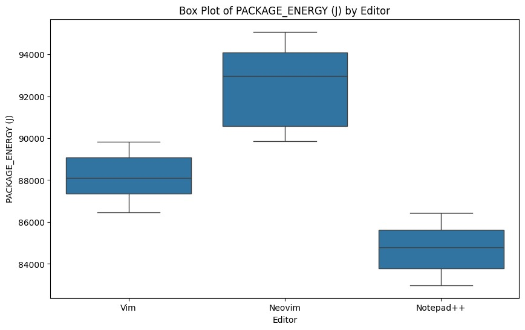
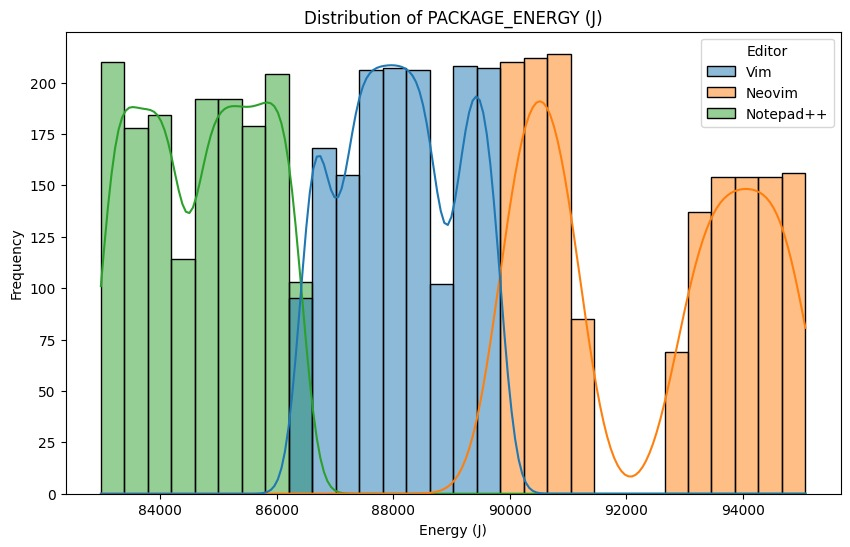
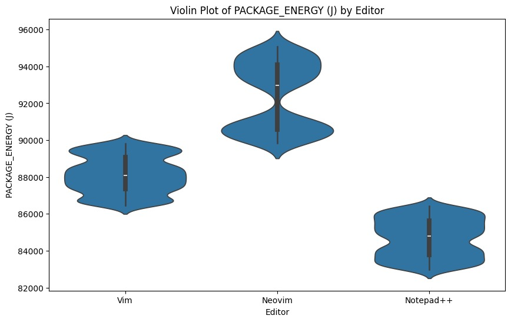

## Introduction

Energy efficiency in software applications is becoming more important, especially for sustainable computing. While a lot of research has looked at reducing power use in hardware and systems, the energy efficiency of software tools, particularly command-line applications, has not been studied as much. Text editors are commonly used in a developer's daily tasks, making them a key focus for analyzing energy consumption.

This study seeks to measure and compare the energy use of four popular command-line text editors on Windows: `Notepad++` [^1], `Vim` [^2], and `Neovim` [^3]. We will use an automated script to perform a set sequence of tasks in each editor—creating a new file, typing a short paragraph, and exiting without saving. Energy consumption will be tracked using EnergiBridge, a tool for measuring power.

[^1]: https://notepad-plus-plus.org/downloads/
[^2]: https://www.vim.org/download.php
[^3]: https://neovim.io/

By examining the energy usage of these editors, we hope to shed light on how design choices in software impact power efficiency. The results could assist developers and system administrators in choosing text editors that are more energy-efficient, especially in situations where power is limited, like on laptops, embedded systems, and in remote computing.

## Methodology

To measure energy consumption accurately and consistently `EnergiBridge` [^4] was used.

EnergiBridge is a command-line tool designed to monitor and record the energy consumption of different tasks. It measures power usage in Joules and logs the data in CSV format. The key parameters extracted for analysis include the following:
**PACKAGE_ENERGY (J)** value, which quantifies the total energy consumed during the experiment, **Time** metric, which records the duration of each test execution.

[^4]: https://github.com/tdurieux/EnergiBridge

Windows Scripting using VBScript is used to automate text input into the selected editors. This ensures that the typing activity remains consistent across test iterations, minimizing variations introduced by manual input.

Task automation via batch scripting is used to streamline the testing process. A batch script is responsible for opening each text editor, executing the VBScript typing automation, initiating energy measurement through EnergiBridge, and ensuring that the editor is closed once the task is completed.

## Testing Setup:

## Software and Hardware Configuration

This section outlines the software, tools, and environmental factors used in the experiment to measure energy consumption during text input in various text editors. The objective is to assess the power usage of different editors while performing a standardized text input task under controlled conditions.

## Text Editors

The experiment evaluates three text editors, each selected based on their unique characteristics and common usage in software development and text processing.

- **Notepad++ (v8.6.3)** is a widely used, lightweight, and open-source text editor known for its efficiency and minimal system resource usage.

- **Vim (v9.1)** is a modal text editor that is highly favored among developers due to its keyboard-centric design and lightweight nature.

- **Neovim (v0.9.5)** is a modern reimplementation of Vim that introduces enhancements in extensibility, maintainability, and plugin support while maintaining Vim’s core philosophy.

## Hardware Setup

The tests were conducted on an HP Victus 15-fa1xxx laptop, which was selected for its modern hardware configuration, ensuring reliable performance during the experiment. The specifications of the system are as follows:

- **CPU**: Intel(R) Core(TM) i7-13620H CPU @ 2.40GHz
- **GPU**: NVIDIA GeForce RTX 4060 with 8 GB GDDR6 VRAM
- **RAM**: 16 GB (2 × 8 GB DDR4)
- **Storage**: 1 TB NVMe SSD
- **System Type**: 64-bit operating system, x64-based processor
- **Operating System**: Windows 11 Home, version 24H26

## Testing Procedure

To ensure consistency and accuracy in energy measurements, a structured testing procedure was followed.

## Pre-Test Setup
Before initiating the experiment, several preparatory steps were taken to minimize variability and external influences on energy consumption measurements.

- **System warm-up period was observed** to ensure that the device reached a stable operating temperature before measurements began. This prevents fluctuations in power consumption caused by cold starts or sudden CPU activity spikes.

- **Automatic brightness adjustment and power-saving features were disabled** to prevent the system from altering its power state dynamically during the test. Since energy measurements are highly sensitive to such fluctuations, these settings were manually configured to remain constant throughout the experiment.

- **Background applications were closed** before each test run to further isolate the impact of the text editors. Any non-essential processes, such as web browsers and background services, were terminated to reduce their influence on energy readings.

- **Internet connectivity was disabled** to prevent background network activity from interfering with the tests. Disabling network connections ensures that power usage reflects only the activities relevant to the text editor under evaluation.

## Experiment Execution

Each text editor was tested multiple times to ensure the reliability of results. The following steps were performed **30 times** for each text editor:

- **Start EnergiBridge** – The energy monitoring tool was initiated before launching the text editor to begin recording power consumption.

- **Launch the Text Editor** – The text editor under test was opened through an automated script to ensure uniform execution.
Simulated Typing – A pre-defined paragraph was automatically typed into the editor using a VBScript script to maintain consistency across all trials.

- **Close the Editor** – Once the typing process was completed, the script executed the necessary commands to exit the editor.
Stop EnergiBridge – The energy measurement tool was stopped after the editor was closed, finalizing the data recording for that iteration.

- **Wait for Cool-Down** – A brief waiting period was introduced between iterations to allow the system to return to its baseline power state before the next test cycle began.

The entire process was executed 30 times for each text editor, culminating in a total of 90 test runs. By performing multiple iterations, we can minimize variability in the measurements and enhance the statistical reliability of our findings.

This approach guarantees that the results accurately depict the energy consumption traits of each text editor, yielding valuable insights into their relative efficiency. The data gathered from these experiments will be used to identify which text editor exhibits the most efficient energy usage patterns.

## Results

To analyze the energy consumption of different command-line text editors, we executed 30 iterations for each editor: Vim, Neovim, and Notepad++. The recorded energy usage data was processed and visualized using box plots, histograms, and violin plots to examine variations in consumption.

**Box Plot Analysis**

- **Median Energy Consumption**

  Notepad++ is the most energy-efficient text editor in this study, using about 85,000 joules of energy on average.Vim uses a bit more energy, with a median of around 88,000 joules, but it’s still less than Neovim.Neovim has the highest average energy use at about 93,000 joules, which means it needs more power than both Vim and Notepad++.This pattern indicates that Neovim's extra features, like asynchronous processing and better plugin architecture, could be the reason for its higher energy consumption.

- **Interquartile Range (IQR) & Variability**

  Notepad++ has the smallest interquartile range (IQR), which means it uses energy in a very steady way during different sessions, with only a few ups and downs. Vim has a slightly bigger IQR, showing that there are some changes in how much energy it uses, but it still stays pretty stable overall. Neovim has the largest IQR, suggesting that its energy use is more unpredictable across different runs. This bigger IQR for Neovim might mean it's more affected by changes in the system or other programs running in the background, causing its energy use to vary more.

- **Maximum and Minimum Energy Consumption**

  Neovim not only has the highest median but also reaches the highest peak energy consumption, around 94,500 J. This upper bound suggests that Neovim occasionally spikes in energy usage, possibly due to additional background operations. Vim remains within a tighter range, not exceeding 90,000 J, meaning its power consumption is relatively predictable. Notepad++ maintains the lowest energy range, rarely surpassing 86,000 J, which confirms its efficiency.

**Histogram and Kernel Density Estimation Analysis**

- **Overall Distribution Patterns**

  The distribution of Notepad++ (Green) is left-skewed, indicating that the software often runs at a low and constant level of energy most of the runtime is spent between 83,500 and 85,500J.The KDE curve displays a smooth distribution with two clear peaks, which show at least some subtle differences in energy use during tests.The energy consumption measurement of Vim (Blue) has a distribution which appears more normal compared to Notepad++ and Neovim, it was centered around 88,000 and 89,000J. It depicts that it is more consistent in energy use than it’s two peer text editors.Neovim (Orange) has a bimodal distribution, where energy use can be divided into two main clusters with peak around 90,500J and 94,000J. It is visible that long task running in Neovim sometimes hyper consuming the power in unusual manner, likely due to background tasks, asynchronous processes, or internal adjustments.

- **Variability and Stability**

  Notepad++ is highly stable, with most values clustered within a narrow band. Vim remains stable but consumes slightly more energy, with its values tightly packed around its mean. Neovim shows the highest variability, as indicated by the spread of its histogram bins and the bimodal nature of its KDE curve. This means Neovim might have unpredictable spikes in energy usage.

**Violin Plot Analysis**

This violin plot supports the patterns seen in the box plot and distribution plot.It shows that Notepad++ is the most energy-efficient, Vim has a moderate level of energy use, and Neovim uses the most energy with greater variability.Notepad++ displays a tight energy usage pattern, which means it has low variability.Vim is fairly stable but has a bit more variation compared to Notepad++.Neovim, on the other hand, has a broader and more dispersed distribution, suggesting that its energy consumption varies a lot.

## Implications

**Impact on Battery Life and Energy Efficiency**

- Neovim’s higher and more variable energy consumption might be attributed to its modernized architecture, which includes enhanced background processes, better extensibility, and higher resource utilization.

- Vim, despite being terminal-based, does not always have the lowest energy usage, suggesting that certain configurations or processing overheads contribute to its energy footprint.

- Notepad++ maintains a strong advantage in energy efficiency, making it a preferable choice for users looking to minimize power usage.

**Trade-Offs Between Features and Energy Consumption**

- Neovim’s increased power consumption suggests that modern features like Lua scripting, asynchronous execution, and plugin support contribute to higher CPU usage.

- Vim, while still feature-rich, maintains a lower energy footprint, making it a better choice for users prioritizing efficiency.

- Notepad++ offers a graphical user interface (GUI) yet consumes the least energy, showing that GUI-based editors can be optimized for efficiency.

- Users must decide between powerful features and lower energy consumption, depending on their priorities.

**Performance Considerations in Server and Cloud Environments**

- Vim’s lower power usage makes it well-suited for low-resource environments such as SSH sessions, embedded systems, and cloud instances.

- Neovim’s higher CPU usage could increase cloud computing costs, as power consumption often correlates with billing in pay-per-use cloud services.

**Relevance to Developers and Power Users**

- Developers working in high-performance computing, AI, and software compilation may benefit from selecting an energy-efficient editor to maximize available system resources.

- System administrators and writers who work with multiple text editors simultaneously can improve overall system responsiveness by using an editor with lower power demands.

- Choosing an energy-efficient editor can result in faster processing times, reduced CPU load, and improved multitasking performance.

**Sustainable Computing Considerations**

- As organizations and individuals focus on reducing their carbon footprint, choosing energy-efficient software can contribute to sustainability efforts.

- Large-scale deployments in corporate offices, educational institutions, and data centers could benefit from using lightweight editors to reduce overall energy consumption.

## Limitations & Future Work

Certain aspects of this experiment may limit the validity of these results.

- **Baseline energy usage** – The energy used while the editors were running was recorded, but not the base energy usage of the machine the experiment was run on. This means that the amount of added energy consumption of the editors is unknown, just the difference in energy between editors.

- **Run on a single machine** – While variability between editors was kept to a minimum, the experiment was run on a single machine only, so it is unknown whether results could be different if run on a different machine, or with different installations of the editors.'

- **Brief sequence of instructions** – The editors are only open for a short time and only process simple input (typing characters and exiting the program). It remains to be seen how they perform on more complex input sequences.

- **Variability in editors** – While Vim and Neovim are similar command line editors, Neovim being based on Vim, Notepad++ instead possesses a GUI and more sophisticated features, such as syntax highlighting. These results show no significant impact of this difference, but more research in different editors would be needed to truly gauge if there is any impact.

- **Isolation of the experiment** – The experiment was conducted with only the programs necessary running, including internet access being severed and background applications closed. Although this setup made for a more convenient experimental environment, it does not present a true-to-life scenario, where a user of the editor would likely also have other applications active.

- **Modularity of editors** – The versions of NeoVim and Notepad++ used for the experiments were plain installations with no plugins or modifications, however, they do provide support of such. Therefore, the impact of extended versions of these editors still remains unknown.

As this is only an exploratory look into energy consumption of text editors, it can be extended in multiple ways. Firstly, this experiment could be repeated for other editors, both command line editors, like GNU Emacs or Nice Editor, and GUI editors, such as Sublime Text. Instead of only having the processes necessary for the experiment running, a more realistic setup with other programs running in the background would provide further insights, and so would changing the input sequence the editors receive to be more complex. Finally, even repeating the same process on another machine could lead to more clear insights into the energy performance of these editors.

## Conclusion

In this test, we tried to find out if there is a change in how much power text editors use while they are on, and which one out of three we chose uses the least power. We looked at the power use of Vim, Neovim, and Notepad++ and found big gaps in how well they save power. Notepad++ turns out to be the best at saving power. It always uses the least power and does not change much. Vim uses a bit more power than Notepad++, but it is still better than Neovim. Neovim uses the most power and its use changes a lot. The data shows that Neovim's extra parts and tasks in the back make it use more power, while Vim keeps a good mix of use and saving power. For those who need long battery life or work in places with low power, Notepad++ is the best pick. Vim is still a good choice for people who work in terminal settings. Neovim has lots of features but might not suit those who want to save energy. The study shows how the design of software affects how much power it uses. It points out how key it is to think about power use when picking a text editor.

## Reproducibility package
For the sake of reproducibility, the code for the experiment and data analysis is available [here](https://github.com/raghavtalwar7/Compare-editors).

---