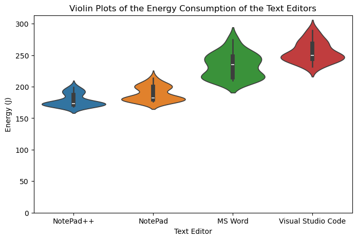

# Comparing Energy Consumption of Note-Taking Applications
## Introduction
Everyone has to take notes sometimes; university classes, business meetings, grocery lists, etc. Many people will start up their favorite text editor and start typing without giving it much further thought.
Considering that just about everyone takes notes at least once a day, minor improvements in energy consumption can be cumulatively massive, which justifies looking into the energy consumption of different text editors.
Therefore, this report researches the energy consumption of several text editors which may be used to quickly take notes on windows machines.
The energy consumption of each text editor was measured in Joules using Energibridge while given the task of taking a short 50 character note in the editor.
We hope this will result in recommendations regarding software which may be used to take quick notes in an energy efficient manner.

For this study, we selected text editors commonly used by EEMCS students. The selected text editors are:
- Notepad: A minimalist text editor that comes pre-installed on Windows. Its simplicity and lack of advanced features makes it a likely candidate for low energy consumption.
- Notepad++: An open-source text editor that offers more functionality than Notepad, such as syntax highlighting and plugin support. While still relatively lightweight, it may have a higher energy footprint compared to Notepad.
- Microsoft Word: A well known text editor that offers a wide range of advanced features for document creation, formatting, and collaboration. Its extensive feature set should cause it to be more energy-intensive than simpler editors.
- Visual Studio Code: A highly customizable code editor that is popular among developers. It is packed with features such as plugins, debugging tools, and interface customized to write software, making it likely to consume significantly more energy than simpler editors.


### Problem statement
This report aims to evaluate the energy consumption of several widely-used text editors on Windows machines, with the goal of identifying which software options are most energy-efficient for everyday note-taking.
By understanding the energy demands of different text editors, we hope to provide recommendations that will help users, particularly students and professionals, make informed choices about which software to use based on its energy efficiency.

## Methodology
In this experiment we test the energy consumptions of various text editors while simulating natural typing behavior. 
To perform this experiment we set up an automated test script which starts up a text editor, types 50 characters while simulating human behavior and then proceeds to close the text editor. 
The energy consumption measurment begins after we launch the text editor and ends after we close it.

### Setup

#### Hardware
We run the experiment on a single computer with the following specifications:

1. Processor: AMD Ryzen 7 5800H 
2. Graphics Card: Nvidia RTX 3070
3. RAM: 16GB
4. Storage: 1TB SSD

#### Software
The following text editors will be tested:
1. VS Code
2. Notepad
3. Notepad++
4. Word

We have chosen these editors as they are widely available and very commonly used by students.
Each editor is installed with default settings and the experiment was ran on Windows 11.

### Tooling
EnergiBridge will be used to measure the energy consumption of the computer during the experiment. In addition, we will use Autohotkey scripts to simulate launch and close the editors as well as to simulate keystrokes.

### Controlled Variables

CPU temperature must be similar for all measurments to avoid skewing the results. This is ensured by letting the CPU cool down for 1 minute between measurments.
The experiment will be run 30 times per editor to account for variability in measurments.
The order of measurements will be random to reduce systematic impact between measurmenets.
There will be no interaction with the computer while running the computer to minimize variability.

### Experiment
#### Setup
Before running the experiment we need to ensure that the computer is in "Zen mode". This means that the only software that is running on our computer is the software whose energy consumption we want to measure.
In practice this is impossible, but we can limit the effect of background processes by ensuring the following:

- all applications are closed;
- all peripherals and other hardware are disconnected, for our experiment these included:
    - External monitor
    - Bluetooth keyboard
    - Bluetooth mouse
- turn off notifications;
- remove any unnecessary services running in the background (e.g., web server, file sharing, etc.);
- disconnect the computer from the internet since it's not required for our experiment

#### Warmup 
Before beginning the experiment we perform a warmup procedure. This procedure is used to warmup the CPU to ensure fairness throughout the experiment as starting with a cool CPU which later warms up can skew the results.
This is because having heat increases the resistance of an electrical circuit meaning more energy is required for the same amount of work. Therefore beginning with an already hot CPU helps prevent this.

Our warmup procedure consists of running multiple fibonacci sequences for 5 minutes on all CPU cores.

#### Running the experiement

After ensuring the computer is in "Zen mode" and that our CPU is warm we can begin running our experiment. The experiment performs the following actions:

1. Launches an editor
2. Begins measuring energy consumption using Energi Bridge
3. Types 50 characters
4. Closes the editor
5. Stops measuring energy consumption
6. Wait for 1 minute
7. Repeat

The aforementioned sequence is repeated 30 times for each of the four editors we selected making a total of 120 measuremenets.

## Results

The results from our experiments are illustrated in the violin plot below:



The violin plot shows the total energy consumption for NotePad++, NotePad, MS Word and Visual Studio Code.This violin plot was created after the rejecting outliers using the z-score. After performing the outlier rejection, we kept all the runs except for one run of the Visual Studio Code. Thus we kept 29 runs for Visual Studio Code and 30 runs for the rest of the editors.

We find that Notepad++ performs the best amongst the text editors we have tested with an average energy consumption of 188.87J. The next best performing text editor is Notepad with an average energy consumption of 178.33J, which is an 5.91% increase from the average energy usage of Notepad++. Furthermore, Microsoft Word has an average energy consumption of 233.62J in our tests, which is an increase of 23.69% compared to Notepad. Lastly, Visual Studio Code consumes the most energy in our test with an average energy consumption of 255.07J. This is an increase 9.18% from Microsoft Word. It is also noteworthy that the most energy intensive editor in our test, Visual Studio Code, consumes 43.03% more energy than our most efficient text editor i.e. Notepad++.

### Analysis

The first step in our analysis would be to check if our data is normally distributed. This is required as it would inform which test we would need to use to test for statistical significance. To ascertain if our data is normally distributed, we employed the Shapiro-Wilks test. The results of the Shapiro-Wilks test is described in the table below:

| Editor             | Is Data Normal? | P-Value |
|--------------------|-----------------|---------|
| NotePad            | False           | 0.00085 |
| NotePad++          | False           | 0.00012 |
| Microsoft Word     | False           | 0.012   |
| Visual Studio Code | True            | 0.067   |

We find that after the z-score outlier rejection, we find that only the data from Visual Studio Code is normally distributed. The data for Notepad, Notepad++ and Microsoft Word are not normally distributed. This could be due to a variety of reason. Firstly, it is possible that there is software specific behavior that is periodically executed which changes the distribution of the energy consumption. For example, in Microsoft Word, the spell check or the autosave features may cause spikes in the energy usage. Another explanation for this could be background tasks that are competing for system resources. An example of this could be check for system updates or garbage collection that will increase energy usage, thus causing the distribution of the results to change.

Since the data of three out of four text editors are not normally distributed, we opted for the Mann-Whitney U test to test for statistical significance. The Mann-Whitney U test is a non-parametric test, thus it does not assume that the data has a normal distribution. The results for the Mann-Whitney t-test are illustrated in the table below. 

| Test                            | Is it Significant? | P-Value |
|---------------------------------|--------------------|---------|
| NotePad vs NotePad++            | ✅                  | 0.0000  |
| NotePad vs Visual Studio Code   | ✅                  | 0.0000  |
| NotePad vs MS Word              | ✅                  | 0.0000  |
| NotePad++ vs Visual Studio Code | ✅                  | 0.0000  |
| Visual Studio Code vs MS Word   | ✅                  | 0.0002  |

We observe that all pairings of our data are statistically significant, with the P values being either 0 or close to 0. This indicates that there is strong evidence that the distribution of the energy data are different.

## Discussion
### Implication
From our experiments we can see a clear difference in the energy consumption of the more lightweight text editors (Notepad, Notepad++) compared to the heavier text editors. 
We do have to note the fact that data was not normally distributed. This could potentially be caused by processes running in the background with a variable amount of energy consumption such as garbage collection.

Of course heavier text editors include functionalities that the more lightweight editors do not possess, such as spelling and grammar checking, syntax highlighting for programming and more.
Our hypothesis was that these extended features could lead to a higher energy consumption. Our results prove this, with a p value < 0.005 for all comparisons when executing the Mann whitney test.
It is interesting that the energy consumption of Notepad++ is lower than Notepad. Notepad++ has a more extensive feature set than Notepad, but consumes less energy. 
This does indicate that more features does not necessarily indicate a higher energy consumption.
Furthermore, there is a small caveat. While additional features might lead to a higher power consumption, it might also allow the user to more quickly write their notes.
Features such as grammar and spelling checkers, table creation or even image insertion could cause a student to be able to save a lot of time writing their notes, leading to a smaller total energy consumption.

### Further research & limitations
While our study investigated the energy consumption of 4 text editors that are commonly used at EEMCS, there are many more text editors used. 
Further studies could investigate the energy consumption of other text editors, potentially also including web based editors.

Our experiment does not cover an entire workflow, which would also include opening the application and saving the file. 
The reason for the exclusion of these actions were the high variability of opening applications and difficulty with saving files using autohotkeys.
It could be the case that a much larger amount of energy is used when performing one of these actions compared to the typing part. 
Further research could take into accounts these additional actions.

While our experimental setup aimed to reduce external influences, the non-normal distributed data suggests this might not have been entirely effective.
Future research might be able to isolate the experiment even further, leading to more accurate results.

Our study only involved typing 50 characters to reduce the runtime of the experiment. However, due to this shorter time, the experiment is more vulnerable to variance. 
Furthermore, it might be the case that some editors have an increased energy consumption when more is written in the file. Future research could look into the effects of longer text being typed on the different editor's energy consumption.

## Conclusion
We aimed to determine which text editor is most energy efficient for note taking on windows computers. This was done by comparing the four popular text editors Word, Notepad, Notepad++ and Visual studio code.
Our results indicate that Notepad++ has the lowest energy consumption, with Notepad following closely behind. Both of these text editors are considerably more lightweight, with a much smaller feature set.
Both Word and Visual Studio Code used a lot more energy, with Visual Studio Code using the most of all text editors investigated.

While the more heavy weight editors consume more energy, their additional functionality might be worth their increased energy consumption. 
Selecting the best editor to use is thus highly dependent on if a user needs these extended capabilities. 
Thus our recommendation is that if the additional features of the more heavy text editors are unnecessary, to use one of the more lightweight editors, preferably Notepad++.

### References
- [EnergiBridge](https://github.com/tdurieux/EnergiBridge)
- [AutoHotKey](https://www.autohotkey.com/)
- [Notepad++](https://notepad-plus-plus.org/downloads/)
- [Word](https://www.microsoft.com/nl-nl/microsoft-365/get-office-and-microsoft-365-oem-download-page)
- [Visual Studio Code](https://code.visualstudio.com/)

## Replication
Code for this project can be found [HERE](https://github.com/NovoGSP/SustainableSE-Group16)
To replicate the results, follow these steps:

### Prerequisites
Ensure you have:
- Administrator privileges on your system
- Python installed (`python --version` to check)
- EnergiBridge installed
- AutoHotkey installed

### Steps to Run
1. Open **Command Prompt** as Administrator:
   - Press `Win + S`, type **cmd**, right-click **Command Prompt**, and select **Run as Administrator**.
   
2. Navigate to the project directory:
   ```sh
   cd path\to\your\project

To replicate our experiment you can run the following:

```sh
python python_script.py
python warmup.py
script.bat
```
This sequence will create the batch script which runs the experiment, then warmup the CPU and then initiate the experiment.
Make sure that you run these from an elevated command prompt with administrator rights.
The experiment does not work on any distribution of linux as they do not support autohotkey.

