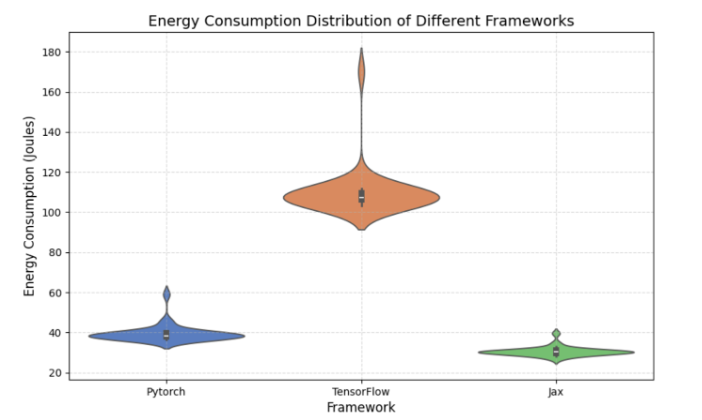

# Comparing the Energy Consumption of Different Python Machine Learning Libraries

## Introduction

There has been a growing interest in the Artificial Intelligence field over the last few years, especially considering the significant progress that has been made recently. However, the training of larger and larger models by corporations also raised concerns about the substantial increase in the energy required to train and maintain these sophisticated systems.

The aim of this project was to showcase an energy consumption comparison in a common software use case. For this we have chosen to compare the same neural network architecture implemented by different machine learning libraries. We deemed this use case to be of significant interest, as we know training AI models is consuming more and more power worldwide, so measuring the energy consumption between libraries could give us a good insight into this issue that is becoming more and more relevant as time goes by.

For our comparison, we chose three distinct popular libraries: [PyTorch](https://pytorch.org/), [TensorFlow](https://www.tensorflow.org/) and [JAX](https://github.com/jax-ml/jax). We chose these libraries because PyTorch and TensorFlow represent the two most widely used deep learning frameworks in both industry and research settings, meanwhile JAX is also growing in popularity. The libraries also use different architectural approaches. We ran the experiment for each of them, keeping the hyperparameters the same so the experiment process would be as representative as possible.

After this introduction section, we will cover our proposed methodology for the experiments in more detail, then we will show the results we obtained. After this, the findings will be analysed and discussed. Finally, we will draw some conclusions from the experiments in the last section and consider future improvements.

## Methodology

In order to measure and compare the energy consumption of the three selected ML frameworks (PyTorch, TensorFlow, and JAX), we designed a controlled experimental setup. We use all three libraries to train a model with identical model architectures, training parameters, and hardware configurations to ensure valid comparisons of energy efficiency across these frameworks.

### Dataset and Model Architecture

To ensure consistency across frameworks, we implemented identical neural network architectures and training procedures in each library. A synthetic dataset was generated using NumPy with a fixed random seed to guarantee consistency across all experiments. The dataset consisted of 1,000 samples with 10 features each, and binary classification targets were created from the sum of the first three features (positive sum resulting in class 1, negative sum in class 0).

In each framework, we implemented an identical neural network with the following architecture:
- Input layer: 10 neurons
- First hidden layer: 64 neurons with ReLU activation
- Second hidden layer: 32 neurons with ReLU activation
- Output layer: 1 neuron with sigmoid activation (binary classification)

All networks used Xavier/Glorot initialization for weights to ensure consistency across implementations. The implementations for each framework maintained identical hyperparameters:
- Optimizer: Adam
- Learning rate: 0.001
- Beta1: 0.9
- Beta2: 0.999
- Epsilon: 1e-7
- Loss function: Binary Cross Entropy
- Batch size: 32
- Training epochs: 10

This architectural and hyperparameter consistency was important to ensure that any observed differences in energy consumption could be attributed to the framework implementations rather than differences in the neural network configurations.

### Experiment Procedure

Our experimental procedure followed a specific method to ensure reliable and reproducible energy measurements:
1. **Preparations**: We minimized external influences by stopping background tasks, maintaining a constant screen brightness, disabling Wi-Fi, and keeping the machine plugged in.
2. **System Warmup**: Prior to benchmarking, the system was warmed up by running a Fibonacci sequence calculation for 5 minutes.
3. **Benchmark Execution**: Each framework was tested for 30 times each to obtain statistically significant results. We shuffled the running of the different libraries in order to avoid any potential biases.
4. **Cool-down Periods**: A 60-second cooldown period was enforced between each framework test.
5. **Data Collection**: For each run, [EnergiBridge](https://github.com/tdurieux/EnergiBridge) recorded total energy consumption in Joules.

### Hardware and Software Configuration

All experiments were conducted under the following conditions:
- **Hardware**: `HP Zbook Power G11 Mobile Workstation with Intel(R) Core(TM) Ultra 7 155H 1.40 GHz`
- **Memory**: `RAM 16.0 GB`
- **Operating System**: `Windows 11`
- **Python Version**: `3.10`
- **Python Libraries**:
  - `PyTorch 2.6.0`
  - `TensorFlow 2.14.0`
  - `Jax 0.4.34`
  - `Flax 0.10.3`
  - `Keras 3.24.0`
  - `Pandas 2.2.3`
  - `Numpy 2.2.3`
  - `Optax 0.2.4`
- **Environment Variables**: All frameworks configured to use CPU-only processing

By standardizing the hardware and software environment, we eliminated potential variables that could influence the energy consumption measurements.

## Results

This section presents the energy consumption analysis for the Neural Network using PyTorch, TensorFlow, and JAX. The comparison includes differences in energy use, percentage changes, effect sizes, and normality tests.

### Energy Consumption Differences

The mean energy consumptions of PyTorch, TensorFlow and Jax are indicated in the table below (in joules):

| Framework | Mean Energy Consumption (Joules) |
|-----------|--------------------------------|
| PyTorch   | 39.52                          |
| TensorFlow| 109.73                         |
| Jax       | 30.56                          |

The results show that TensorFlow used much more energy than PyTorch, with a mean difference of 70.21 J. On the other hand, JAX used slightly less energy than PyTorch, with a mean difference of -8.96 J. Comparing TensorFlow and JAX, TensorFlow consumed 79.17 J more energy on average.

Looking at percentage changes, TensorFlow used 177.68% more energy than PyTorch, and 72.15% more energy than Jax. In addition, Pytorch used 22.67% more energy than Jax.

All results summarized in the table below:

| Comparison           | Mean Difference (J) | Percentage Change (%) |
|----------------------|---------------------|----------------------|
| Tensorflow vs. PyTorch | +70.21              | +177.68%             |
| Jax vs. PyTorch      | -8.96               | -22.67%              |
| TensorFlow vs. Jax   | +79.17              | +72.15%              |

### Effect Size Analysis

The Cohen's d values show how big the energy differences are. The difference between PyTorch and TensorFlow was very large (8.11), meaning TensorFlow used a lot more energy. With Jax this difference was even larger (9.53) which indicated that Jax is more energy efficient than TensorFlow and PyTorch. The final comparison PyTorch and Jax confirming the evidence (2.69).

### Normality Testing

The Shapiro-Wilk test checks if the energy consumption data follows a normal distribution. The results are indicated in the table below:

| Framework  | Shapiro-Wilkinson Result           |
|------------|-----------------------------------|
| PyTorch    | W = 0.556, p = 2.20 × 10⁻⁸        |
| TensorFlow | W = 0.363, p = 2.48 × 10⁻¹⁰       |
| Jax        | W = 0.791, p = 4.57 × 10⁻⁵        |

Since all p-values are very small (less than 0.05), we can say the data is not normally distributed. This means we should use non-parametric statistical tests for further analysis. The distributions of different frameworks w.r.t to their energy consumptions are plotted in the figure below.

### Performance Evaluation

For the evaluation of performance and resource consumption, statistical significance was used. The Mann-Whitney test was utilized to compare the energy consumption across three frameworks (PyTorch, TensorFlow, and JAX).

The Mann-Whitney test examines how the measurements in two groups relative to one another and determine if the discrepancy between those groups are not randomly calculated. In this approach, small p-value (commonly under 0.05) indicate the framework's energy usage is consistently higher or lower than the other framework in a statistically. A U-Value close to zero typically indicates the first group is use lower in resource usage. With maximum U value, it suggests the first group is higher energy consumption.

From the results, PyTorch had consistently lower resource consumption than TensorFlow (U=0.0), and the p-value near 3.02e-11 proved that this difference was not based on random chances. Meanwhile, PyTorch ranked higher in Joules compared to JAX (U=879.0), indicate that PyTorch generally consumed more energy than JAX. Lastly, TensorFlow's U-value of 900 against JAX shows it always ranked higher, with a p-value of 3.02e-11 showing significant separation in favor of JAX's lower usage.

In actual numbers, Pytorch shows an average of 39.52 Jules. TensorFlow shows an average of 109.73 Joules, and JAX shows 30.56 Joules. The Mann-Whitney outcome shows Torch's U-value against TensorFlow was 0 corresponds to PyTorch being consistently below 110 Joules in those comparisons. The large U-values of 879 and 900 indicated PyTorch and TensorFlow measured well above JAX nearly every time. Consequently, these tests confirm that JAX ranks the lowest in energy usage, PyTorch sits in the middle, and TensorFlow ends up being the most resource-intensive by a wide margin.

| Comparison            | Mean Energy Consumption (Framework 1) | Mean Energy Consumption (Framework 2) | Mann-Whitney U | P-value  |
|-----------------------|---------------------------------------|---------------------------------------|----------------|----------|
| PyTorch vs TensorFlow | 39.51743                              | 109.73103                             | 0.0            | 3.02e-11 |
| PyTorch vs JAX        | 39.51743                              | 30.53429                              | 879.0          | 2.37e-10 |
| TensorFlow vs JAX     | 109.73103                             | 30.53429                              | 900.0          | 3.02e-11 |

## Discussion

In this section, we take a critical look at our results and discuss them in detail. We examine the key findings, assess their implications, and consider potential explanations for the observed trends.

It looks like JAX seems to be the most energy efficient library when it comes to this specific use case and this neural network architecture, with PyTorch being second and TensorFlow being a distant third. PyTorch consumes slightly more energy than JAX on average, but TensorFlow seems to use a sizable amount more than both Pytorch and JAX.
This result is not what we expected before conducting the experiment. We were of the opinion that the libraries would consume a somewhat similar amount of power, given their popularity.

We assume that these results most likely roughly generalize to larger neural network implementations, taking into account the large difference between TensorFlow and the rest of the libraries. These results are likely not representative of other models and architectures, such as the SVM or Logistic Regression implementation from these libraries.

The large Cohen's d values suggest that these differences are significant and unlikely to be due to randomness. While the difference between PyTorch and JAX is smaller, it is still notable, reinforcing the idea that JAX remains the most energy-efficient one among the three for this specific case.

The Shapiro-Wilk test results indicate that the energy consumption data does not follow a normal distribution for any of the three libraries. The low p-values obtained also suggest strong deviations from normality.

PyTorch demonstrated significantly lower energy consumption than TensorFlow, with a U-value of 0.0 and an extremely small p-value (3.02e-11). This suggests that PyTorch consistently consumed fewer resources than TensorFlow in all measured instances. In contrast, when comparing PyTorch to JAX, the results indicate that PyTorch generally consumed more energy, as reflected by a U-value of 879.0. Similarly, TensorFlow exhibited the highest energy consumption compared to JAX, as indicated by a U-value of 900 and a statistically significant p-value of 3.02e-11.

While PyTorch outperformed TensorFlow in efficiency, both popular frameworks showed higher resource demands than JAX. This efficiency gap raises an interesting question about the trade-offs between developer experience and computational sustainability. It might be possible that the older architectures of PyTorch and TensorFlow may prioritize flexibility and ecosystem compatibility at the expense of resource optimization.

These findings challenge the common practice of selecting frameworks based primarily on community support, API familiarity, or feature availability. For applications with significant computational requirements or deployment at scale, energy efficiency should be taken into consideration as a selection criterion. Organizations with lots of resources might reduce their environmental impact by using more efficient frameworks.

## Future improvements

In this final section we consider the limitations of the project and look at future avenues and possible improvements for this comparison.

One limitation of our study is that we did not account for potential hardware-specific optimizations. Different CPUs may give different energy consumption patterns due to architecture-specific optimizations or differences in power efficiency. Also, different batch sizes, model complexities, and hyperparameter configurations may influence energy consumption. Future work could take these factors into account to assess the robustness of these findings across different conditions.

It is possible TensorFlow might perform more efficiently in large-scale production environments with specialized hardware, such as TPU accelerators, which are designed specifically for TensorFlow workloads. Similarly, JAX's performance could be more advantageous for large-scale distributed training tasks.

This project could be expanded in the future in a number of different ways. One of them would be to test multiple models and architectures, not just a neural network, but maybe other classifying models on different tasks of varying complexity and measure the energy consumption between different library implementations. Another way to improve the validity of the project would be to perform the tests taking into consideration the hardware that the training is running on, with multiple types of machines running the experiments, so the effects of the implementations could be generalized across a range of machines. A final way in which the project can be improved is testing more popular machine learning libraries and comparing them to each other, expanding on the three we have used here.

## Reproducibility Package
The code for running the experiment and the data analysis can be found [here](https://github.com/matteo-fregonara/sse-1).