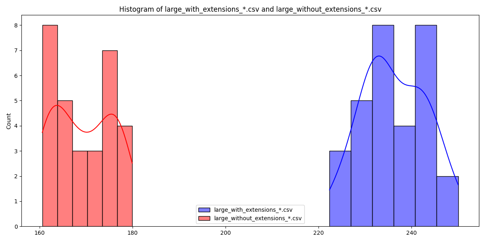
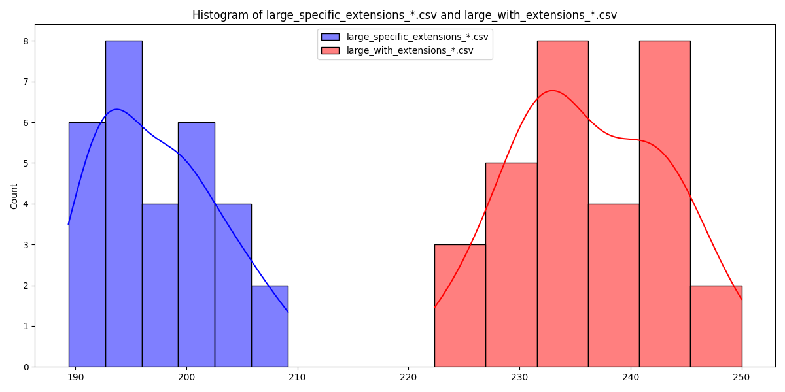
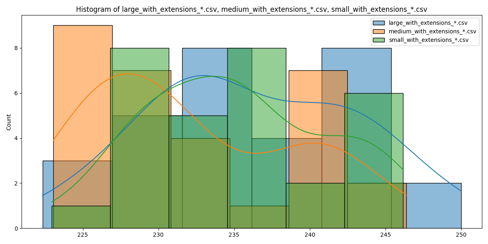
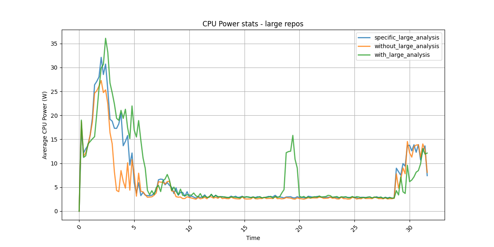

# Investigating the impact of extensions on power usage of VS Code

## Introduction

With the global climate crisis becoming more and more severe, sustainability is an increasingly important topic in many industries, one of those being software engineering.
In their day-to-day work, software engineers are mostly concerned with the performance and the user experience of their software, while sustainability is often barely considered.
This ignorance and sometimes negligence is unjust as the use development tools and workflows consume limited resources such as electrical power.
Raising awareness of the environmental impact of these tools is therefore of important task.

One category of tools very frequently used by software engineers are Integrated Development Environments (IDEs).
IDEs provide developers with an environment to efficiently write code and manage their repositories.
An example of a very popular IDE used by many developers is Visual Studio Code (VSCode), an open source IDE that allows developers to install extensions with additional tools to further facilitate software development.

Developers often install numerous extensions on their IDEs and keep them enabled even when they are not in use.
This can unknowingly lead to increased energy consumption and a larger environmental footprint.
Frequent activities such as opening multiple repositories may cause significant spikes in energy usage, especially when many extensions are enabled.
To address this issue, we decided to analyze these startup processes in detail with the goal of exploring the impact of running extensions on power consumption and raising awareness about the environmental impacts of using these extensions in software development, providing recommendations for managing extensions more sustainably.

## Research Questions

The main research question we aim to answer is: _What is the impact of running extensions in Visual Studio Code on energy and power consumption on startup?_

To answer this question, we investigate the following sub-questions:

1. What is the energy usage of starting Visual Studio Code with and without extensions?
2. What is the impact of running only extensions relevant to the project on power usage?
3. What is the impact of running extensions on different-sized repositories?

## Experiment setup

### Independent variables

We want to test the impact of different configurations of extensions in VSCode.
To do this, we decided to open VSCode with different extension configurations enabled, for different-sized Python repositories (see Table 1).
Extensions are chosen by popularity on the [VSCode Marketplace](https://marketplace.visualstudio.com/vscode) and whether the repositories required them to run.
With this subset, we created 3 different extension configurations, found in Table 1.
We have the configuration with all extensions enabled, and with all extensions disabled, to see the difference in energy usage caused by the use of extensions.
Lastly, we also have a configuration where we only enable extensions for Python, but not extensions for other languages.
We chose this last configuration because, if this would significantly lower energy usage compared to having enabled all extensions, it would be a change people could easily carry out without experiencing many drawbacks.

To see if the size of the repository had any impact on power usage, we chose to use three repositories of different sizes, further detailed in Table 2. We chose to limit this project to only exploring Python projects so that we have clear distinction between the different extension sets.

**Table 1**: Extension configurations.

| Configuration                  | Extensions enabled                                                                                         |
|--------------------------------|------------------------------------------------------------------------------------------------------------|
 | All extensions enabled         | Python, Python Debugger, Pylance, Jupyter, Docker, C/C++ Intellisense, GitHub Copilot, GitHub Copilot Chat |
 | Only Python extensions enabled | Python, Python Debugger, Pylance, Jupyter                                                                  |
 | No extensions enabled          | -                                                                                                          |

**Table 2**: Repositories used and their sizes.

| Repository name                                                | Repository size | #Files in repository | License |
|----------------------------------------------------------------|---------------|----------------------|---------|
| [Polymath](https://github.com/samim23/polymath) (small)        | 140 KB        | 35                   | MIT     |
| [Leapcast](https://github.com/dz0ny/leapcast) (medium)         | 273 KB        | 47                   | MIT     |
| [Beholder](https://github.com/chrisranderson/beholder) (large) | 64.7 MB       | 79                   | - |

### Dependent variables

The metric we are most interested in is the energy usage of the program.
However, since we consider energy consumption over time, this may sometimes be noted by power consumed.
Measurements will be done using EnergiBridge.
More information about how we perform these measurements can be found in the methodology section.

### Ensuring valid results / Controlled Variables

All tests are run on an HP Zbook Power G11 Mobile Workstation. This laptop has an Intel Core Ultra 7 - 155H processor.
To properly measure the power consumption of running VSCode and the impact of extensions running, we want to keep external factors as consistent as possible.
To this end we do a few things.
First of all, we put the computer running the test in 'zen' mode.
This entails:

- Closing all other applications
- Turning off notifications, wifi, and Bluetooth
- Killing all unnecessary services that may be running in the background
- Disconnecting all external hardware (except for keeping the battery plugged into a power outlet)
- Turning off auto brightness

Furthermore, to minimize the effect of warm-up we ran a few test instances of our code before starting our measurements.
We also tried to keep the room temperature as stable as possible, by not changing the settings of the thermostat.

## Methodology

Instructions on how to set up and rerun the experiments can be found in the README.

Each combination of an extension configuration and repository was run 30 times to ensure validity.
Though we tried to keep external factors as consistent as possible, we also decided to shuffle the executions of different combinations.
So one iteration for each of the combinations is done before moving on to the next iteration.
This is to account for the changes to external factors that could change over time, like the temperature of the hardware.

Because this will result in a lot of tests that need to be run, we automated the testing process using a script.
To do this, we installed all plug-ins beforehand.
When the script launches VSCode it uses a specific command-line flag to disable certain extensions (or no flag to enable all plugins).

For each of these combinations in an iteration, we choose to keep VSCode open for 30 seconds to collect our data.
We decided to only keep the program open, and not to run anything because of two reasons:
First, most time spent programming is done without running code.
Second, most plugins enhance the development environment and do not influence the runtime experience.
After energy consumption measurements have been made using the pyEnergiBridge library, all VSCode processes on the computer are killed.
Between each execution we have 15-second rest intervals to prevent us from accidentally measuring the tail energy consumption from previous measurements.
This interval was determined to be sufficient because when looking at a graph of energy usages over time the tail energy usage of all killed VSCode processes seems to be dissipated by that point.

When combining the results, we make use of outlier detection and removal.
Specifically, we remove all data points which deviate more than 3 standard deviations from the mean.

## Results

After executing the methodology described in the previous section, we obtain power consumption results for each run configuration.
In order to answer our research questions, we perform statistical analysis on our results.
First, we check if the results are normally distributed.
We will test this using the Shapiro-Wilk test.
For this, we need to calculate the p-value of the results.
If this value is smaller than 0.05, the data is not normally distributed. The results of this analysis can be seen in Table 3.

**Table 3**: For each run configuration (repository size and extensions) we check if the power consumption is normally distributed.

| Setup                        | CORE\_ENERGY\_SUM Normal | CORE\_ENERGY\_SUM p-value | CPU\_ENERGY\_SUM Normal | CPU\_ENERGY\_SUM p-value |
|------------------------------|--------------------------|---------------------------|-------------------------|--------------------------|
| Large without extensions     | False                    | 1.4549536014411581e-36    | False                   | 0.014707446971148449     |
| Large with specific extensions | False                    | 1.3571559804795941e-36    | True                    | 0.15449294372805272      |
| Large with extensions        | False                    | 2.432848872325712e-37     | True                    | 0.7519645658191211       |
| Medium with extensions       | False                    | 1.9917297518311493e-37    | False                   | 0.01412321946426844      |
| Small with extensions        | False                    | 3.344680756212622e-37     | True                    | 0.23479465946677192      |

Since most of the data is not normally distributed, we use the Mann-Whitney U test to compare the means of the different configurations.
Figures 1-2 and Tables 4-5 describe the results of this test.

Figure 1 shows a histogram of the energy consumption in Joule, when starting the VSCode with or without extension enabled.
A clear difference between the range of energy consumed between the two configurations can be seen.
Table 4 also confirms this difference, showing that without extensions enables, an average of 29% less power is used to start up Visual Studio Code.

**Figure 1**: Histograms of energy (J) consumption with versus without extensions.

**Table 4**: Comparison of means of energy consumption with or without extensions using Mann-Whitney U test.

| Configuration       | Energy Usage (J)      |
|---------------------|-----------------------|
| No extensions       | 169.35                |
| All extensions      | 236.23                |
| p-value             | 3.019859359162157e-11 |

Figure 2 shows a histogram of the energy consumption, when starting VSCode with or without Python extensions enabled.
There is a clear difference in the amount of energy consumed with or without having the non-project-specific extensions enabled.
Predictably, however, this difference is smaller than when comparing running VSCode with or without any extensions.
Tables 5 also confirms this difference, showing a 17% reduction in energy use when disablingng non-Python extensions.

**Figure 2**: Histograms of energy (J) consumption specific versus all extensions

**Table 5**: Comparison of means of energy consumption with specific or with all extensions using Mann-Whitney U test.

| Configuration       | Energy Usage (J)      |
|---------------------|-----------------------|
| Specific extensions | 197.37                |
| All extensions      | 236.23                |
| p-value             | 3.019859359162157e-11 |

### Comparison of different-sized repositories

In order to test whether repository size also influences the power consumption of VSCode extensions, we also perform the Mann-Whitney U Test for different repository sizes to compare them.
The results of this comparison can be seen in Figure 3 and Table 6.

**Figure 3**: Histograms of energy consumption.

**Table 6**: Comparison of means of energy consumption with all extensions for different repository sizes using Mann-Whitney U test.

| Configuration 1 | Configuration 2 | Mann-Whitney U Test Statistic | p-value | Significant Difference | Avg Energy Usage Configuration 1 (J) | Avg Energy Usage Configuration 2 (J) |
|-----------------|-----------------|------------------------------|---------|------------------------|--------------------------------------|--------------------------------------|
| Large           | Medium          | 609.0                        | 0.01911239675982854          | True                    | 236.23084716797166                   | 232.24507802327182                   |
| Large           | Small           | 484.0                        | 0.6204037206277525           | False                   | 236.23084716797166                   | 235.17551371256607                   |
| Medium          | Small           | 315.0                        | 0.04675584239277178          | True                    | 232.24507802327182                   | 235.17551371256607                   |

Figure 4 show the power usages over time while starting VSCode.
A clear peak is shown when starting VSCode at the start, and a second, smaller peak at the end when shutting down VSCode.
Additionally, there is a third peak (at t =\[18,20]), when running all extensions.
This peak only occurs for that configuration, and not when running only the specific extension set, indicating that this peak must be caused by the non-python extensions.
This is most likely caused by a non-Python extension starting or running a background process after a set amount of time.
Outside this third peak, The difference in these configurations do not seem to make much of a difference while the program is idle, as indicated by overlap of all three lines in the graph.

**Figure 4**: Average CPU power over time for large repository for each extension configuration.

## Conclusions

From the results of the Mann-Whitney U tests we can conclude:

- There is a significant difference in energy consumption on startup of VSCode when using extensions as opposed to not using extensions.
- Idle, or non-used, extensions have a significant impact on energy consumption of VSCode on startup.
- We cannot say with confidence that the repository size influences the energy consumption of VSCode on startup due to insignificant results of the large versus small repository comparison.
- Non-Python extensions can cause a small delayed spike in energy usage

### Answers to the research questions

1. The average power usage of starting Visual Studio code, and keeping it open for 30 seconds is ~235 Joule using our selection of extensions, and ~170 Joule without any extentions.
2. Running only relevant extensions can significantly decrease the amount of power used.
3. We cannot confidently answer if the size of the repository has a significant impact on the power usage of starting VSCode with extensions, due to only using three different repositories and insignificant results for the large versus small repositories comparison.

Thus, we can answer the main question by concluding that running extensions significantly increases the power usage of opening VSCode.

### Recommendations

Because of the above conclusions, we recommend that people working with an IDE more carefully consider which extensions are beneficial to run, and which are not worth the increase in energy consumption.
Furthermore, we also recommend that idle extensions and those unnecessary for a project should be disabled, as they still consume energy otherwise.
Developers should only enable extensions they deem necessary for a task.
A way of doing this would be to create extension profiles (similar to our configurations) with necessary extensions for a task (e.g. developing in Python).
At the start of a task, a developer can then select the extension profiles required for that task so they only use the necessary extensions and save energy.

## Discussion and Future Work

Given the results and conclusions above, there are a few things to discuss.
First, we can see that idle extensions we selected have an impact of approximately 39 J on startup of VSCode.
To put this into perspective, this is the amount of energy it takes to charge a typical smartphone battery 0.2%.
This may not seem like a significant difference at all, but considering that developers restart VSCode numerous times a day and that they often use more idle extensions than those used in this research, the total quickly adds up.

Although our methodology leads to significant results, there are a few limitations of our work to be highlighted, which can be improved on in future work.
First, due to the scope of the project, we limited our research to only three repositories, one at a time.
This is not very realistic as software developers may typically work on various repositories throughout the day.
Therefore, running the experiments on many more repositories could lead to more realistic results and recommendations.
Secondly, we only measure energy consumption on startup of VSCode, but it could also be interesting to investigate energy consumption in other circumstances such as while writing code, navigating the repository and executing build commands.
All our test were also run on the same hardware. This makes for more fair comparisons between the different results. However, this also makes it hard to generalize the results for different hardware set-ups.

Due to this, in the future, an interesting follow-up study would be to measure the energy consumption caused by the use of extensions while actively working in the IDE. This could either be done for a set of extensions, or on specific extensions which are predicted they consume a lot of power (GitHub Copilot for example).
Another study could also be done on the effect of extensions when keeping the IDE idle open for longer. This could be done to see if there are more Energy consumption spikes like the one in Figure 4.
Lastly, a study could be done where the tests are repeated on different hardware set-ups, to see if relative difference stay consistent, so results can be generalized.
