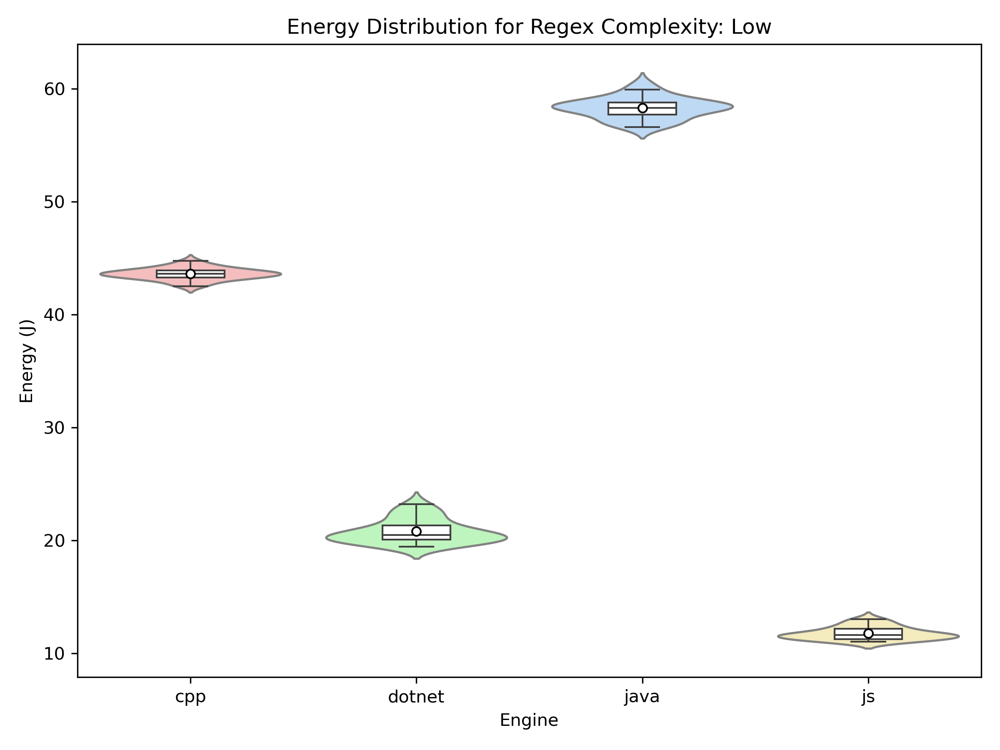
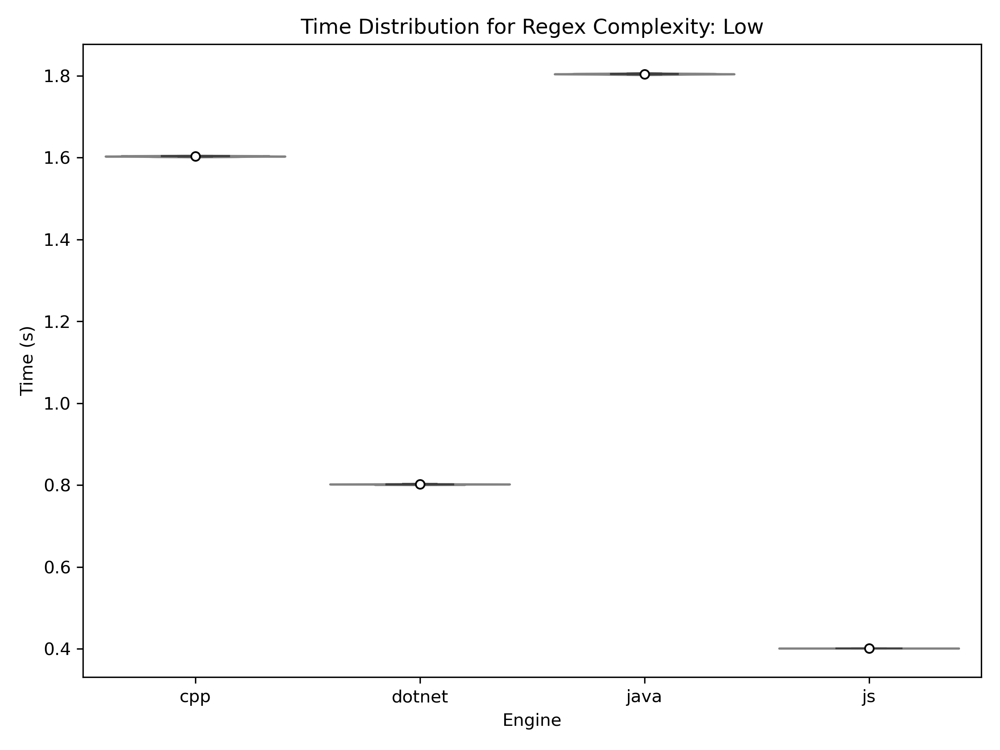
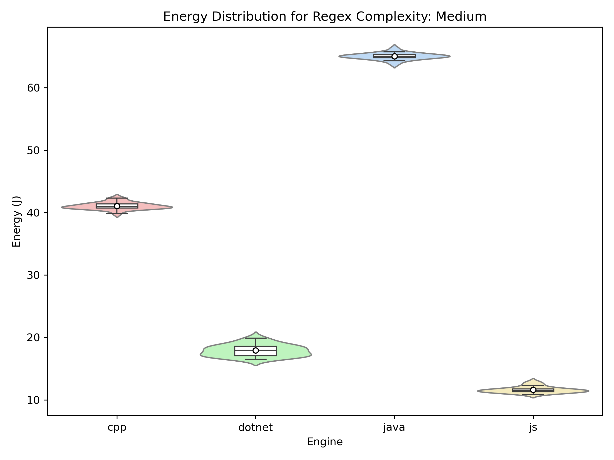
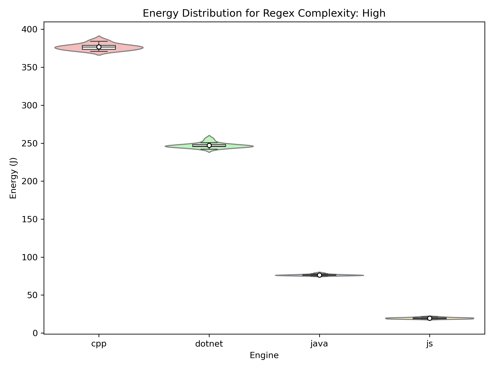

# Introduction

Regular Expessions (**RegEx**) are a powerful tool in software development, allowing for fast pattern matching across text files and code. However, despite their speed, performing RegEx search is CPU-intensive and can lead to unintended matching due to its greedy nature[^1]. As the scale of code repositories grows[^2] and the demand for energy-efficient computing increases[^3], understanding the energy consumption of RegEx engines across different libraries is an important area of study.

RegEx functionality varies across libraries, each with its own engine and energy demands. This experiment explores energy usage across popular RegEx libraries when using the pattern matching functionality **`CTRL+F`** in an IDE (Integrated Development Environment) or text editor. The selected libraries are based on their use in popular IDEs[^13], which commonly rely on RegEx engines from **Java**[^8],[^9],[^10],[^12], **JavaScript**[^7], **.NET**[^14] and **C++**[^11]. This experiment compares their energy usage and impact in controlled searches.

In this blog, we explore the question: **How energy efficient is `CTRL+F` in different RegEx engines?** We outline the experiment’s motivation, methodology, implementation, and hardware setup. Our findings aim to guide developers in understanding the energy impact of different RegEx engines and help them make informed choices when using tools for large-scale code searches. 

# Motivation

Pattern matching is a powerful, yet computational expensive tool. The complexity varies depending on the pattern, engine and input size, with worst-case scenarios reaching exponential time O(2n)[^15], particularly with patterns prone to "catastrophic backtracking"[^21]. This is caused when the engine explores an exponential number of paths to match. Therefore, evaluating RegEx engines across pattern complexities is crucial to identifying inefficiencies and optimising real-world searches.

The need for such optimisation is amplified by the rapid growth of code repositories, where research highlights the challenge of navigating repositories expanding in size and complexity[^17]. Tools like `CTRL+F`, powered by RegEx engines, are crucial in enabling developers to efficiently search and navigate these vast code bases.

Finally, optimising RegEx search aligns with the broader goal of creating sustainable software. Research points towards the ICT (Information, Communication and Technology) sector impacting 14% of the global carbon footprint by 2040[^18], forcing us to acknowledge that improving the efficiency of RegEx search can help reduce unnecessary computational overhead and contribute towards greener development.

# Methodology

## Experiment Procedure
We conduct a controlled experiment to isolate RegEx processing and systematically measure energy consumption across libraries and complexity levels. This allows us to evaluate how efficiently different implementations execute RegEx searches. The procedure is outlined below.

### 1. Corpus Generation
To standardise the RegEx test environment, we use the largest Python file we found in the NumPy repository, as Python is the most widely used programming language[^6]. To ensure a significant computational load, we expand the file to 100MB by repeating its content. The final .txt file ensures uniform processing across different RegEx engines.

### 2. Setting the Laptop to Zen Mode
Before conducting experiments, we ensure a controlled environment by setting the device to [Zen Mode](https://surfdrive.surf.nl/files/index.php/s/V8f66pd7V7sQYx6). This minimises interruptions for consistent measurements. We define Zen Mode  as follows:

- Close all applications. 
- Turn off notifications.
- Only the required hardware should be connected. 
- Kill unnecessary services running in the background. 
- Switch off the network. 
- Fix display brightness.
- Set room temperature (if possible) to 25°C.

### 3. System Warm-up
The laptop warms up by running Fibonacci computations for 300 seconds before any measurement, helping the CPU reach a stable thermal state and reducing fluctuations.

### 4. Execution of RegEx Search Experiments
Each RegEx engine undergoes the same testing conditions, ensuring a fair comparison. **Four RegEx libraries** are tested, the choice of which is explained in the [Motivation](#motivation) section:
- **Java (Pattern Matcher)**
- **JavaScript (RegExp Object)**
- **C++ (Boost.RegEx)**
- **.NET (RegEx Class)**

For each RegEx library, we test **three levels of RegEx complexity**:
- **Low complexity (`def`)**: Matches function definitions in Python code. This pattern is simple, consisting of a direct string match with no advanced RegEx operations. It represents basic text searches.
- **Medium complexity (`\bclass\s+\w+`)**: Identifies class declarations in Python. It includes word boundaries and whitespace matching, making it moderately complex. This level introduces structured patterns that involve multiple token types, representing a common use case in code analysis.
- **High complexity (`(?<=def\s)\w+(?=\()`)**: Captures function names using lookaheads and lookbehinds. This requires additional computational effort due to its non-fixed width constraints. It represents complex search scenarios that involve context-sensitive patterns and backtracking, making it computationally expensive.

Each experiment involves a distinct combination of a RegEx engine and complexity level. To minimise bias from external factors, the execution order of experiments is randomly shuffled. For each combination, **30 runs** are conducted. The procedure for each experiment is as follows:

1. **Initialise the RegEx engine** for the current library.
2. **Serialise and save the engine state** to a temporary pickle file to prevent differences in engine startup times from affecting measurements.
3. **Load the engine state** from the pickle file and perform RegEx search.
4. **Measure energy consumption (Joules) and time (seconds)** using the [EnergiBridge](https://github.com/tdurieux/EnergiBridge) [^5] tool for step 3, executed in a Python subprocess. We measure energy (Joules) rather than power (Watts) because RegEx libraries primarily operate as a one-off computation rather than a continuous process. Power represents rate of energy consumption (Joules per second), which is more relevant for continous tasks. However, since RegEx libraries typically execute as a single, finite task, the total energy consumed during execution is a more appropriate metric.
5. Log energy consumption in a **CSV format**.
6. After each run, the system is put to **rest for 60 seconds** to revert to a steady-state operating temperature, limiting thermal tail effects.

### 5. Statistical Analysis
Once the experiments are completed, statistical analysis is performed to evaluate RegEx engine performance. The chosen statistical tests ensure that our findings are significant.

#### Normality Testing
**Shapiro-Wilk Test** checks data normality (p-value ≥ 0.05 indicates normality), guiding test selection. In this case, we hypothesise the data will be normal and use parametric statistical tests.

#### Outlier Detection
The **IQR (Inter-Quartile Range)** is used to identify and remove outliers, preventing extreme values from skewing the results. After testing both IQR and the **Z-Score method**, the prior was more effective at identifying outliers. A data point is considered an outlier if it lies below the **Lower Bound = Q1 - 1.5 * IQR** or above the **Upper Bound = Q3 + 1.5 * IQR**. 

#### Statistical Significance Tests
Even if, on average, one RegEx engine has lower energy consumption than another, it might be just random difference. We use **two-sided parametric Welch’s t-tests** to help us determine whether these differences in energy consumption are conclusive and significant, assuming a normal distribution. Welch's t-test identifies whether two distributions have significantly different means. If the p-value is less than 0.05, the difference is significant.

#### Effect Size Analysis

Effect size metrics are used to quantify the practical significance of differences between RegEx engines:

- **Mean Difference (&Delta;&mu;)**: Measures raw difference in performance between two engines.
- **Percentage Change**: Measures relative difference in performance.
- **Cohen’s d Effect Size**: Measures magnitude of performance differences.

## Hardware/Software Details
We run the experiments on a machine with the following hardware specifications:

- `Intel® Core™ i7-10750H CPU @ 2.60GHz   2.59 GHz`
- `NVIDIA GeForce GTX 1650 Ti`
- `16 GB RAM`

Furthermore, we run the experiments with the following software versions:

- `Python 3.12`
- `energibridge 0.0.7`

The other software requirements regarding employed code libraries can be found in the `requirements.txt` (or `environment.yml` if you are using Conda) in our Github repository, which is linked in the [Replication Package](#replication-package) section.

# Results
The results from the experiment are presented in the violin plots below (without outliers). They illustrate the energy consumption (in Joules) and execution time (in seconds) of regular expressions across different levels of complexity. Furthermore, this section performs the Shapiro-Wilk test for normality and computes the effect changes between distributions.

## Low Complexity Pattern

| Low Complexity Energy | Low Complexity Time |
|----------------------|----------------------|
|  |  |

For the **low complexity** pattern, the energy consumption and processing time distributions show differences across engines. **Java** is the most energy-intensive (~60J, ~1.8s), while **C++** is moderate (~45J, ~1.6s). Following these, **.NET** consumes less (~20J, ~0.8s), and **JavaScript** shows the most efficient handling of simple RegEx tasks (~10J, ~0.4–0.5s).

## Medium Complexity Pattern

| Medium Complexity Energy | Medium Complexity Time |
|--------------------------|------------------------|
|  |  |

The **medium complexity** pattern showcases consistent rankings with the low complexity pattern between the energy consumptions and processing times. **Java** still takes the most amount of energy and time taken (~70J, ~2s), exceeding its low-complexity pattern usage. For the other three engines, the consumptions and processing times stay similar. **C++** (~40J, ~1.6s), **.NET** (~20J, ~0.7s), and **JavaScript**, remaining the most efficient (~10J, ~0.4s).

## High Complexity Pattern

| High Complexity Energy | High Complexity Time |
|------------------------|----------------------|
|  |  |

For **high complexity** RegEx patterns, the results show significant increases in both execution time and energy consumption. **C++** and **.NET** experience sharp spikes, their consumption being (~400J, ~14s) and (~250J, ~9s), respectively. This shows that these two engines struggle to process complex patterns efficiently. **Java** and **Javascript** have energy consumptions and processing times that are more consistent with the other two pattern complexities, standing at (~70-80J, ~2s) and (~10J, ~0.4s), respectively. This demonstrates that certain engines manage complexity significantly better than others.

## Statistical Tests

### Shapiro-Wilk Normality Tests

Initially, the Shapiro-Wilk Test showed non-normal distributions for both energy and time, which we attributed to the presence of outliers after visually inspecting the plots. After removing outliers using the 1.5 IQR method, we reran the tests. The tables below summarise the Shapiro-Wilk p-values for energy consumption post-outlier removal. The exclusion of time results is justified in the [Discussion](#discussion) section.

| Complexity | Engine | Shapiro-p-value |
|------------|--------|-----------------|
| Low        | C++    | 0.989373        |
| Low        | .NET   | 0.013857        |
| Low        | Java   | 0.723034        |
| Low        | JS     | 0.138883        |
| Medium     | C++    | 0.238653        |
| Medium     | .NET   | 0.299012        |
| Medium     | Java   | 0.806078        |
| Medium     | JS     | 0.156827        |
| High       | C++    | 0.633164        |
| High       | .NET   | 0.755118        |
| High       | Java   | 0.012378683     |
| High       | JS     | 0.333185        |

Energy distributions for engine and complexity combinations are mostly normal (p > 0.05), except for Java in high complexity (p = 0.012378683) and .NET in low complexity (p = 0.013857). However, given the vast majority of the measurements follow a normal distribution, we proceed with tests for normal data.

## Parametric Significance Test - Welch's t-test

The following table summarises the p-values from **Welch's t-tests** comparing pairs of RegEx engines (C++, .NET, Java, Javascript) for **energy** metrics.

| Complexity | Comparison      | Energy p-value               |
|------------|-----------------|------------------------------|
| Low        | C++ vs .NET     | 4.55e-58                     |
| Low        | C++ vs Java     | 5.79e-65                     |
| Low        | C++ vs JavaScript | 4.47e-64                 |
| Low        | .NET vs Java    | 6.72e-71                     |
| Low        | .NET vs JavaScript | 1.13e-31                 |
| Low        | Java vs JavaScript | 3.84e-76                 |
| Medium     | C++ vs .NET     | 1.35e-52                     |
| Medium     | C++ vs Java     | 2.78e-44                     |
| Medium     | C++ vs JavaScript | 6.57e-70                 |
| Medium     | .NET vs Java    | 4.90e-71                     |
| Medium     | .NET vs JavaScript | 1.09e-36                 |
| Medium     | Java vs JavaScript | 2.18e-67                 |
| High       | C++ vs .NET     | 3.37e-07                     |
| High       | C++ vs Java     | 7.24e-08                     |
| High       | C++ vs JavaScript | 1.74e-07                 |
| High       | .NET vs Java    | 2.64e-08                     |
| High       | .NET vs JavaScript | 7.06e-08                 |
| High       | Java vs JavaScript | 1.05e-08                 |

As seen on this table, p-values are extremely small (p < 0.05), which strongly indicates **statistically significant differences** between each pair of engines for energy metrics. Thus, the effect sizes are examined in the next subsection to understand the magnitude of these differences.

## Effect Sizes

The following table summarises the effect sizes for energy (in joules) from comparisons between pairs of RegEx engines across different complexity levels.

| Complexity | Comparison      | Mean Difference (Joules) | Percent Change (%) | Cohen’s d          |
|------------|-----------------|--------------------------|--------------------|-------------------|
| Low        | C++ vs .NET     | 23.1619                  | 129.2737           | 29.3839            |
| Low        | C++ vs Java     | -23.9762                 | -36.8553           | -44.5968           |
| Low        | C++ vs JavaScript | 29.4681             | 253.8029           | 55.4820            |
| Low        | .NET vs Java    | -47.1380                 | -72.4588           | -60.8094           |
| Low        | .NET vs JavaScript | 6.3063              | 54.3147            | 8.0046             |
| Low        | Java vs JavaScript | 53.4443             | 460.3046           | 103.6916           |
| Medium     | C++ vs .NET     | 22.8214                  | 109.7879           | 27.1405            |
| Medium     | C++ vs Java     | -14.7042                 | -25.2163           | -19.0978           |
| Medium     | C++ vs JavaScript | 31.8477             | 270.8041           | 58.6233            |
| Medium     | .NET vs Java    | -37.5256                 | -64.3527           | -37.6765           |
| Medium     | .NET vs JavaScript | 9.0264              | 76.7519            | 10.4847            |
| Medium     | Java vs JavaScript | 46.5520             | 395.8356           | 58.8379            |
| High       | C++ vs .NET     | 129.8053                 | 52.5452            | 33.9700            |
| High       | C++ vs Java     | 300.3934                 | 392.9411           | 105.4453           |
| High       | C++ vs JavaScript | 357.2846             | 1826.9605          | 121.7050           |
| High       | .NET vs Java    | 170.5881                 | 223.1443           | 72.2337            |
| High       | .NET vs JavaScript | 227.4793             | 1163.2064          | 94.0288            |
| High       | Java vs JavaScript | 56.8912             | 290.9109           | 57.2439            |

The effect size analysis reveals **significant differences** in energy consumption among RegEx engines, which increase with complexity. For high complexity patterns, C++ consumes the most energy, followed by .NET, Java, and JavaScript, with Cohen’s d values indicating extremely large effect sizes. The most striking difference is C++ consuming 1826.96% more energy than JavaScript. This suggests the efficiency differences between RegEx engines and underscores the engine selection importance.

For low and medium pattern complexity, Java consistently consumes more energy, while JavaScript is the most energy-efficient. The negative mean differences for C++ vs Java and .NET vs Java indicate that Java is the least optimal for lower complexity RegEx tasks. These findings suggest that developers should prioritise JavaScript or .NET when dealing with simpler RegEx patterns.

# Discussion
The experimental results indicate that the energy consumption of RegEx search is highly dependent on the underlying RegEx engine. Additionally, the complexity of the pattern being matched plays a crucial role, with different engines exhibiting varying relationships to it.  

The energy consumption was directly correlated to the time taken for the engine to complete a task. This suggests consistent energy consumtion during the experiments and minimal power spikes.

We explain the non-normality occasionally observed in the results due to the RegEx engines relying on non-deterministic finite automaton (NFA) algorithms. This means the engines can take unpredictably varied execution paths (even for the same input), that don't follow the assumptions of normality. Thus, we only consider energy measurements in our statistical analysis.

## JavaScript
The JavaScript (JS) RegEx engine consistently performed the best across all complexities of patterns. And what is more, the energy consumption showed little to no variation across levels of pattern complexity. 

These findings suggest JS's RegEx and its integration with [Irregexp](https://blog.chromium.org/2009/02/irregexp-google-chromes-new-regexp.html), is highly optimised for the type of queries evaluated. A part of what makes this integration so effective at reducing energy consumption accross all levels of complexity evaluated is possibly the use of the highly optimised [RegExp Interpreter](https://v8.dev/blog/speeding-up-regular-expressions) for infrequent/simple patterns. 

Despite the impressive results, JS's RegEx implements the more conservative [ECMAScript specifications](https://262.ecma-international.org/). It sacrifices a few common features of Regular Expressions such as [Atomic Groups](https://www.regular-expressions.info/atomic.html),  [Conditional-Patterns](https://www.regular-expressions.info/conditional.html) and more. This decision to omit certain features may contribute to its speed and efficiency in pattern matching.

## Java
Java RegEx results indicate the engine is optimised for high complexity queries, where it performed second to JS. It is likely that Java employs sophisticated methods to address the [catastrophic backtracking problem](https://www.regular-expressions.info/catastrophic.html). For simpler patterns, Java's relatively poor performance could be a tradeoff neccassary for efficient backtracking. However, as simpler patterns are likely the majority use-case, we find it questionable that Java optimised specifically for high-complexity patterns at the cost of simpler ones.

## C++ (Boost) and C# (.NET)
Both of these engines exhibit similar relationships with complexity of pattern. .NET, clearly the superior of the two, shows particularly impressive results for low and medium complexity patterns. Its RegEx engine benefits from its deep integration within the .NET framework and the [continuous iterative improvements](https://devblogs.microsoft.com/dotnet/regex-performance-improvements-in-net-5/) made over many years.

When it comes to high complexity patterns, both RegEx engines behave more unpredictably, as reflected in the distributions of time and energy. The leap in energy consumption was expected in high complexity patterns as both search time and memory usage (for storing expanded states) increase due to the inclusion of backtracking.

## Implications

The findings of this study have important implications in the domain of software sustainability. Given that JavaScript’s RegExp engine consistently outperformed other engines across all complexity levels, developers should consider leveraging JavaScript-based tools or libraries for RegEx processing, especially in energy-constrained environments.

For developers working in Java, C++, or .NET environments, optimisation strategies should be explored to mitigate excessive energy consumption. Techniques such as pre-compiling RegEx patterns, using non-backtracking RegEx approaches, and leveraging alternative search methods like indexed text searching can help improve efficiency.

### Implications on Sustainability

At first glance, the energy consumed by a single RegEx operation (10-400J) appears minuscule compared to daily activities, such as boiling water in a kettle, which takes 165,000 joules[^19], or charging your phone, which could take around 29,000 joules[^20]. However, in large-scale systems where RegEx operations are executed millions of times daily, these small amounts accumulate significantly. For instance:

**JavaScript Engine**: 1 million executions x 10 joules = 10 million joules (10 MJ)

**C++** Engine: 1 million executions x 400 joules = 400 million joules (400 MJ)

This difference of 390 million joules (390 MJ) is equivalent to boiling approximately 2,300 kettles, or charging around 13,500 smartphones. Thus, we highlight the need for developers to make informed choices about the tools they use, as even minor efficiency improvements can have a meaningful impact at scale.

# Limitations and Future Work

This study provides valuable insights into RegEx library energy consumption, but several limitations need addressing:

1. **Pattern Coverage**: Testing was limited to only three patterns. Future work should conduct a comprehensive study to select the most commonly used RegEx patterns and evaluate them for better real-world representation.
2. **Single-File Testing**: Experiments were conducted on a single file, whereas real-world searches often span multiple files, which adds disk I/O and memory overhead. Future studies should consider multi-file scenarios.
3. **Device & OS Variability**: Results were based on a single machine, with energy usage potentially varying across different hardware and operating systems. Cross-platform testing on diverse devices is needed.
4. **Thermal Fluctuations**: Despite system cooldowns, CPU temperature variations could affect energy measurements. Future research could account for these fluctuations more rigorously.

# Conclusion

This study highlighted significant variations in the energy efficiency of different RegEx engines, and demonstrated that JavaScript consistently outperforms Java, .NET, and C++ in both execution time and energy consumption. While the differences may seem minor in isolated cases, their impact is substantial when scaled across large-scale applications. Optimising RegEx usage is crucial for reducing computational overhead, minimising energy costs, and promoting sustainable software development. Developers should consider leveraging more efficient engines or alternative search techniques to mitigate excessive energy consumption.

# Replication Package
For the sake of reproducibility, the code for the experiment and data analysis can be found [here](https://github.com/ianjoshi/regex-energy). 

# References

[^1]: Winslow, R. (2021, February 18). Regex basics. Canonical Ltd. Retrieved February 27, 2025, from [https://ubuntu.com/blog/regex-basics](https://ubuntu.com/blog/regex-basics)

[^2]: GitHub. (2024, November 22). Octoverse: AI leads Python to top language as the number of global developers surges. GitHub. Retrieved February 27, 2025, from [https://github.blog/news-insights/octoverse/octoverse-2024/#the-state-of-open-source](https://github.blog/news-insights/octoverse/octoverse-2024/#the-state-of-open-source)

[^3]: Atadoga, A., Umoga, U., Lottu, O., & Sodiya, E. (2024, February). Tools, techniques, and trends in sustainable software engineering: A critical review of current practices and future directions. World Journal of Advanced Engineering Technology and Sciences, 11, 231-239. [https://doi.org/10.30574/wjaets.2024.11.1.0051](https://doi.org/10.30574/wjaets.2024.11.1.0051)

[^4]: JetBrains. (2024, October 11). Find and replace text using regular expressions. JetBrains. Retrieved February 27, 2025, from [https://www.jetbrains.com/help/idea/tutorial-finding-and-replacing-text-using-regular-expressions.html](https://www.jetbrains.com/help/idea/tutorial-finding-and-replacing-text-using-regular-expressions.html)

[^5]: Sallou, J., Cruz, L., & Durieux, T. (2023, December 21). EnergiBridge: Empowering software sustainability through cross-platform energy measurement (Version 1.0.0). GitHub. [https://doi.org/10.48550/arXiv.2312.13897](https://doi.org/10.48550/arXiv.2312.13897)

[^6]: Carbonnelle, P. (2025, February). PYPL Popularity of Programming Language Index. Retrieved February 27, 2025, from [https://pypl.github.io/PYPL.html#google_vignette](https://pypl.github.io/PYPL.html#google_vignette)

[^7]: Lourens, R. (2024, November 13). VSCode: Search issues. GitHub. Retrieved February 27, 2025, from [https://github.com/microsoft/vscode/wiki/Search-Issues#notes-on-regular-expression-support](https://github.com/microsoft/vscode/wiki/Search-Issues#notes-on-regular-expression-support)

[^8]: JetBrains. (2024, October 11). Finding and replacing text using regular expressions in IntelliJ IDEA. JetBrains. Retrieved February 27, 2025, from [https://www.jetbrains.com/help/idea/tutorial-finding-and-replacing-text-using-regular-expressions.html](https://www.jetbrains.com/help/idea/tutorial-finding-and-replacing-text-using-regular-expressions.html)

[^9]: JetBrains. (2024, October 11). Finding and replacing text using regular expressions in PyCharm. JetBrains. Retrieved February 27, 2025, from [https://www.jetbrains.com/help/pycharm/tutorial-finding-and-replacing-text-using-regular-expressions.html](https://www.jetbrains.com/help/idea/tutorial-finding-and-replacing-text-using-regular-expressions.html)

[^10]: JetBrains. (2024, October 11). Finding and replacing text using regular expressions in Webstorm. JetBrains. Retrieved February 27, 2025, from [https://www.jetbrains.com/help/webstorm/tutorial-finding-and-replacing-text-using-regular-expressions.html](https://www.jetbrains.com/help/webstorm/tutorial-finding-and-replacing-text-using-regular-expressions.html)

[^11]: Ho, D. (2003, November 25). Notepad++ [Computer software]. GitHub. [https://github.com/notepad-plus-plus/notepad-plus-plus](https://github.com/notepad-plus-plus/notepad-plus-plus)

[^12]: Google. Pattern. Android Developers. Retrieved February 27, 2025, from [https://developer.android.com/reference/java/util/regex/Pattern](https://developer.android.com/reference/java/util/regex/Pattern)

[^13]: PYPL (2025, February). Top IDE Index. Retrieved February 27, 2025, from [https://pypl.github.io/IDE.html](https://pypl.github.io/IDE.html)

[^14]: Microsoft (2024, September). Use regular expressions in Visual Studio. Retrieved February 27, 2025, from [https://learn.microsoft.com/en-us/visualstudio/ide/using-regular-expressions-in-visual-studio?view=vs-2022](https://learn.microsoft.com/en-us/visualstudio/ide/using-regular-expressions-in-visual-studio?view=vs-2022)

[^15]: Wikipedia. (n.d.). Regular expression: Implementations and running times. Retrieved February 27, 2025, from [https://en.wikipedia.org/wiki/Regular_expression#Implementations_and_running_times](https://en.wikipedia.org/wiki/Regular_expression#Implementations_and_running_times)

[^16]: Atwood, J. (2006, June 6). Regex performance. Coding Horror. Retrieved February 27, 2025, from [https://blog.codinghorror.com/regex-performance/](https://blog.codinghorror.com/regex-performance/)

[^17]: Ma, Y., Yang, Q., Cao, R., Li, B., Huang, F., & Li, Y. (2018). How to understand whole software repository? arXiv. [https://arxiv.org/abs/2406.01422](https://arxiv.org/abs/2406.01422)

[^18]: Belkhir, L., & Elmeligi, A. (2018). Assessing ICT global emissions footprint: Trends to 2040 & recommendations. Journal of Cleaner Production, 177, 448-463. [https://doi.org/10.1016/j.jclepro.2017.12.239](https://doi.org/10.1016/j.jclepro.2017.12.239)

[^19]: SEE Sustainability. (n.d.). Boiling water - how much energy? SEE Sustainability Blog. Retrieved February 28, 2025, from [https://seesustainability.co.uk/blog/f/boiling-water---how-much-energy#:~:text=A%20kettle%20or%20a%20boiling,in%20the%20form%20of%20heat](https://seesustainability.co.uk/blog/f/boiling-water---how-much-energy#:~:text=A%20kettle%20or%20a%20boiling,in%20the%20form%20of%20heat)

[^20]: Warden, P. (2015, October 8). Smartphone energy consumption. Pete Warden's Blog. Retrieved February 28, 2025, from [https://petewarden.com/2015/10/08/smartphone-energy-consumption/](https://petewarden.com/2015/10/08/smartphone-energy-consumption/)

[^21]: Regular-Expressions.info. (n.d.). Catastrophic backtracking. Retrieved February 28, 2025, from [https://www.regular-expressions.info/catastrophic.html](https://www.regular-expressions.info/catastrophic.html)