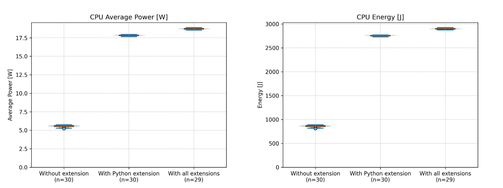

# Measuring the Energy Consumption of Different Profiles in Visual Studio Code

When we think of the energy consumption of a software application, we often think of the operational energy consumption of running a server in a data centre. But software is developed using, well, software. And especially in larger teams working on software for long periods, the energy consumption can add up significantly.

Currently, the most-used IDE is Visual Studio Code (VS Code), used by around 74% of all software developers[^vscode]. VS Code uses a plugin structure to extend its functionality in numerous ways. For almost any language, there are extensions to integrate language-specific features in VS Code. For developers working in a multitude of languages, the number of extensions can grow quickly, while some of these extensions are unused when working in different languages. To tackle this, VS Code introduced profiles[^profiles], allowing users to select a subset of extensions for specific work situations.

In this experiment, we utilize EnergiBridge[^energibridge], a dedicated tool, to quantify the energy consumption variance between distinct profiles within Visual Studio Code (VS Code). Specifically, we compared a profile without any extensions against the default Python profile, containing 15 extensions, and a profile with 71 extensions. Our objective was to discern the extent of energy consumption attributed to extensions during code development.

Our results show a power increase of over 200% when running VS Code with the Python extensions compared to no extensions. Furthermore, we measured a 5% increase in power when comparing the Python profile to the profile with 71 extensions. We conclude that using a task or language-specific profile during development can decrease the energy consumption and related carbon emission of the software development process, without losing functionality or effectiveness.


## Methodology

This experiment will make use of a relatively new feature in VS Code: Profiles[^profiles]. This feature allows us to launch VS Code with a predefined set of extensions and settings. We will be making use of the _None_ and _Python_ default profiles to measure the energy consumption of VS Code with the bare minimal settings and with standard Python extensions. We will also create an _All_ profile, which extends the Python profile with numerous extensions used to develop in other languages, based on the extensions used by ourselves. As these default profiles might change over time, we have included an export of all used profiles in our repository.

The experiment will be run on a _Lenovo 80NV Y700-15ISK_ laptop with an _Intel i7-6700HQ CPU_, into which the default 135W charger is plugged. No further devices are connected to the laptop. The operating system used is _Windows 10 Pro version 10.0.19045_. 


### Preparation

Below are the steps to prepare our experiment, and the steps to reduce sources of external influence on our experiment.

First, we had to ensure that VS Code had access to the defined profiles. We created the profiles using the _Create Profile_ functionality, in which we copied the predefined profiles _None_ and _Python_. Then we made a list of our own installed extensions and made a copy of the Python profile called “_All”_, to which we added these extensions. For consistency, it is better to use the _Import Profile_ functionality with the provided profiles from the repository. When the profiles were created, we ensured that VS Code was launched with these profiles to ensure all extensions were installed pre-emptively, instead of during the experiment. You can find the full versioning of the profiles in the repository[^repo].

Then, to prepare for our experiment, we created a “Zen Mode”, where we made sure any user-defined startup applications were closed and no ethernet cable and no external hardware were connected. Additionally, we set the screen brightness to its lowest settings and made sure that Bluetooth and wifi were turned off, as well as turned aeroplane mode on. Battery management settings were set to “Better performance”, which is in between best battery life and best performance.

For the experiment, we need an input file to dictate what the simulation will type out (more on that later). We used the first 173 lines of code from the file _executor.py_[^inputsrc] of the popular web framework Django. We chose this file based on the popularity of the framework and the quality of the code, making it a piece developers of varying expertise might find themselves writing.


### Experiment

With our “Zen Mode” enabled, we can run our experiment. The experiment[^repo] emulates a user writing code in VS Code by sending keystrokes to the system. Using the library _pynput_[^pynput] to automate keystrokes, we simulated a user opening VS Code (with the provided profile), opening a new file, writing the pre-defined lines of the Django file, and closing down the application. The code in the Django file causes the Python-related extensions to actively make suggestions based on what the simulation is typing. The effect on energy consumption is what this experiment is set to measure. To account for potential external factors, we ran our simulation 30 times for both the _None_ and _Python_ profiles. We shuffle the individual runs randomly to reduce the risk of external factors introducing a bias. After each run, there is a 30-second cooldown to avert any trail energy consumption. Before the experiment, we ran at least 1.5 minutes of calculations to warm up the processor, to prevent the first runs from being influenced by a cold processor.

The energy consumption of each run is measured using EnergiBridge[^energibridge]. EnergiBridge is a cross-platform tool that allows us to measure the entire system's resource usage and energy consumption during the execution of a specific command. EnergiBridge makes estimates of the used energy by querying multiple tools and therefore the reported values are not the actual values. The whole experiment was run in one go, to reduce potential fluctuation in external temperature or time-dependent influences. We ran VS Code with the GPU disabled so all measurements are done on the CPU.

We expect all simulation runs to take the same amount of time since they use the same input file. I.e. they enter the same keystrokes. This was confirmed by the gathered data. Note that due to auto-indentation performed by the Python extensions (which could not be turned off), we had to also enable auto-indentation for the “bare” profile to ensure equal use cases. 


## Results

Due to some unexpected behaviour with Energibridge, we had some invalid runs and one incorrect run. In the invalid runs, EnergyBridge crashed. In that case, we automatically ignored the run and performed an additional one. In one case, the energy counter overflowed, so it was a valid run, but could not be easily used. Therefore, we end up with 30 runs for the _None_ and _Python_ profiles, and 29 runs for the _All_ profile.

The data from the experiment has been plotted in combined box-, violin-plots in the figures below. All runs can be assumed to be normally distributed. This is backed up by the shape of the plot in combination with the Shapiro-Wilk test’s p-value, all being above 0.1 (see appendix). 





Our results show that, on average, the _None_ profile consumes 5.55 Watts, the _Python_ profile consumes 17.83 Watts, and the _All_ profile consumes 18.72 Watts. There is a noticeable difference between the profiles with and without extensions and a smaller difference between _Python_ and _All_ profiles. Specifically, the energy consumption of the _Python_ profile is 221% higher than without extensions, and the _All_ profile is 238%. The _All_ profile consumes 5.2% more energy than the _Python_ profile. All these differences are significant according to the t-tests, indicating that it is highly unlikely to have occurred by random chance.


## Conclusion

This experiment aimed to assess the energy consumption differences between using VS Code with different profiles. We observed a distinct difference between the profiles with and without profiles, accounting for an increase of over 200%. This means that extensions consume most of the power in VS Code. However, VS code is not made to be used without extensions, and using it with the _None_ profile would be frustrating to the developer.

Interestingly, the results show a 5% energy decrease by using a specific profile. This means that, as a developer, we can save energy while performing the same tasks without decreasing our effectiveness (as all Python-related extensions were included in the _All_ profile). This 5% decrease equals a difference of 0.89 Watts of power. While this figure might seem insignificant at first glance, considering the cumulative effect across a large developer base, the resulting increase in energy consumption could be substantial.

Not only does this affect the individual developer, paying more for operational costs, but it also has broader implications for environmental sustainability. Especially considering the many large organisations with large development teams. Take a large company like Google, having more than 20,000 software developers working 40 hours a week for one year, this could lead to an additional 40,000 kWh of energy consumption per year, translating to approximately €5,158.07 extra spent on development costs. Moreover, this contributes to 27944 kilograms of CO2 emissions per year, equivalent to about 115,285 kilometres driven by an average passenger vehicle or 3.5 homes’ energy use for one year[^epa].

Given these implications, developers should consider the usage of VS Code profiles, and the selection of extensions to mitigate both the environmental footprint and operational costs of software development. Especially when profiles can be employed to minimize energy consumption without sacrificing productivity.


## Possible Improvements

Although our setup was made to minimize the potential influence of external factors, there are some actions we could have performed to increase the reliability even further. These are:


* Have a longer cooldown between runs, to mitigate potential tail energy consumption. Tail energy refers to the effect that a task has on the CPU temperature, which takes some time before returning to a baseline temperature. We deemed our experiment not high-intensive enough to work up the processor temperature, and the wait time adds up to the duration of the whole experiment. As such we “only” did a 30-second cooldown.

Apart from improving the experimental setup, we have future research ideas that might give a broader insight into the energy consumption of extensions in VS Code.


* Compare the energy consumption of other preset profiles for input files of different languages. This can show which languages consume more or less energy than others when developing in VS Code. The main difficulty lies in a good comparison, as the input file will differ.
* Compare the energy consumption of individual extensions. Currently, this is quite hard to do because of the lack of CLI options to run VS Code with only a specific set of extensions, and creating dozens of profiles can become quite a hassle.


## Appendix - Raw data

This is an output of our analysis script:

```
Stats for Without extension, with 30 samples:
{
  "time": {
    "shapiro-pvalue": 0.013990259097065144,
    "mean": 154.84703333333334,
    "median": 154.7975,
    "std": 0.14889805983363918,
    "min": 154.571,
    "max": 155.173,
    "25p": 154.7705,
    "75p": 154.9615
  },
  "energy": {
    "shapiro-pvalue": 0.1783566435932919,
    "mean": 859.3978352864597,
    "median": 860.4095764159977,
    "std": 19.91504914962031,
    "min": 816.020507812501,
    "max": 889.5811767578033,
    "25p": 850.4991455078186,
    "75p": 871.5579833984376
  },
  "power": {
    "shapiro-pvalue": 0.15396983610888082,
    "mean": 5.550080084787804,
    "median": 5.559441294960446,
    "std": 0.13270629634400402,
    "min": 5.264139004693101,
    "max": 5.7546037594465425,
    "25p": 5.4937010385082035,
    "75p": 5.628065232737943
  }
}
Outliers for time: 0
Outliers for temp: 0
Outliers for energy: 0
Outliers for power: 0
Stats for With Python extension, with 30 samples:
{
  "time": {
    "shapiro-pvalue": 0.016286380393750903,
    "mean": 154.6482,
    "median": 154.6585,
    "std": 0.07867121455780408,
    "min": 154.433,
    "max": 154.877,
    "25p": 154.6245,
    "75p": 154.696
  },
  "energy": {
    "shapiro-pvalue": 0.19328245204345001,
    "mean": 2756.968941243489,
    "median": 2759.4894104003843,
    "std": 10.928462596848673,
    "min": 2730.6185913086033,
    "max": 2772.866577148439,
    "25p": 2749.178314208997,
    "75p": 2766.002822875974
  },
  "power": {
    "shapiro-pvalue": 0.5445117187967425,
    "mean": 17.827361758408774,
    "median": 17.843045292778815,
    "std": 0.07085177065064542,
    "min": 17.657677676883406,
    "max": 17.95514285902909,
    "25p": 17.782308409825,
    "75p": 17.881285610867064
  }
}
Outliers for time: 0
Outliers for temp: 0
Outliers for energy: 0
Outliers for power: 0
Stats for With all extensions, with 29 samples:
{
  "time": {
    "shapiro-pvalue": 0.33020058701160726,
    "mean": 154.98903448275863,
    "median": 154.996,
    "std": 0.12700732608753473,
    "min": 154.742,
    "max": 155.2,
    "25p": 154.929,
    "75p": 155.065
  },
  "energy": {
    "shapiro-pvalue": 0.5260116625787468,
    "mean": 2900.8107047245385,
    "median": 2900.864624023447,
    "std": 13.530993500164794,
    "min": 2875.2147827148524,
    "max": 2925.734497070287,
    "25p": 2891.707214355471,
    "75p": 2911.388610839852
  },
  "power": {
    "shapiro-pvalue": 0.6108608752206262,
    "mean": 18.7162295457841,
    "median": 18.72154119970842,
    "std": 0.08541468146730213,
    "min": 18.542730651524945,
    "max": 18.882851699311427,
    "25p": 18.668306754466684,
    "75p": 18.77157642546521
  }
}
Outliers for time: 0
Outliers for temp: 0
Outliers for energy: 0
Outliers for power: 0
Comparing Without extension and With Python extension
--
- time:
t-test p-value: 1.0009746627016408e-07
mean of Without extension: 154.85, With Python extension: 154.65
Absolute difference in mean (154.85 - 154.65): 0.19883333333334008
Relative increase in mean (154.85 -> 154.65): -0.13%
Relative increase in mean (154.65 -> 154.85): 0.13%
median of Without extension: 154.80, With Python extension: 154.66
Absolute difference in median (154.80 - 154.66): 0.13900000000001
Relative increase in median (154.80 -> 154.66): -0.09%
Relative increase in median (154.66 -> 154.80): 0.09%
- energy:
t-test p-value: 7.224593180806841e-84
mean of Without extension: 859.40, With Python extension: 2756.97
Absolute difference in mean (859.40 - 2756.97): 1897.5711059570294
Relative increase in mean (859.40 -> 2756.97): 220.80%
Relative increase in mean (2756.97 -> 859.40): -68.83%
median of Without extension: 860.41, With Python extension: 2759.49
Absolute difference in median (860.41 - 2759.49): 1899.0798339843866
Relative increase in median (860.41 -> 2759.49): 220.72%
Relative increase in median (2759.49 -> 860.41): -68.82%
- power:
t-test p-value: 2.983313127623203e-82
mean of Without extension: 5.55, With Python extension: 17.83
Absolute difference in mean (5.55 - 17.83): 12.27728167362097
Relative increase in mean (5.55 -> 17.83): 221.21%
Relative increase in mean (17.83 -> 5.55): -68.87%
median of Without extension: 5.56, With Python extension: 17.84
Absolute difference in median (5.56 - 17.84): 12.283603997818368
Relative increase in median (5.56 -> 17.84): 220.95%
Relative increase in median (17.84 -> 5.56): -68.84%
--
Comparing Without extension and With all extensions
--
- time:
t-test p-value: 0.0002783114646793104
mean of Without extension: 154.85, With all extensions: 154.99
Absolute difference in mean (154.85 - 154.99): 0.1420011494252833
Relative increase in mean (154.85 -> 154.99): 0.09%
Relative increase in mean (154.99 -> 154.85): -0.09%
median of Without extension: 154.80, With all extensions: 155.00
Absolute difference in median (154.80 - 155.00): 0.19849999999999568
Relative increase in median (154.80 -> 155.00): 0.13%
Relative increase in median (155.00 -> 154.80): -0.13%
- energy:
t-test p-value: 5.101430462604956e-94
mean of Without extension: 859.40, With all extensions: 2900.81
Absolute difference in mean (859.40 - 2900.81): 2041.4128694380788
Relative increase in mean (859.40 -> 2900.81): 237.54%
Relative increase in mean (2900.81 -> 859.40): -70.37%
median of Without extension: 860.41, With all extensions: 2900.86
Absolute difference in median (860.41 - 2900.86): 2040.4550476074494
Relative increase in median (860.41 -> 2900.86): 237.15%
Relative increase in median (2900.86 -> 860.41): -70.34%
- power:
t-test p-value: 2.643506340861197e-91
mean of Without extension: 5.55, With all extensions: 18.72
Absolute difference in mean (5.55 - 18.72): 13.166149460996294
Relative increase in mean (5.55 -> 18.72): 237.22%
Relative increase in mean (18.72 -> 5.55): -70.35%
median of Without extension: 5.56, With all extensions: 18.72
Absolute difference in median (5.56 - 18.72): 13.162099904747972
Relative increase in median (5.56 -> 18.72): 236.75%
Relative increase in median (18.72 -> 5.56): -70.30%
--
Comparing With Python extension and With all extensions
--
- time:
t-test p-value: 5.347127858030897e-16
mean of With Python extension: 154.65, With all extensions: 154.99
Absolute difference in mean (154.65 - 154.99): 0.3408344827586234
Relative increase in mean (154.65 -> 154.99): 0.22%
Relative increase in mean (154.99 -> 154.65): -0.22%
median of With Python extension: 154.66, With all extensions: 155.00
Absolute difference in median (154.66 - 155.00): 0.3375000000000057
Relative increase in median (154.66 -> 155.00): 0.22%
Relative increase in median (155.00 -> 154.66): -0.22%
- energy:
t-test p-value: 6.920122246419776e-44
mean of With Python extension: 2756.97, With all extensions: 2900.81
Absolute difference in mean (2756.97 - 2900.81): 143.84176348104938
Relative increase in mean (2756.97 -> 2900.81): 5.22%
Relative increase in mean (2900.81 -> 2756.97): -4.96%
median of With Python extension: 2759.49, With all extensions: 2900.86
Absolute difference in median (2759.49 - 2900.86): 141.3752136230628
Relative increase in median (2759.49 -> 2900.86): 5.12%
Relative increase in median (2900.86 -> 2759.49): -4.87%
- power:
t-test p-value: 1.6628744407463373e-43
mean of With Python extension: 17.83, With all extensions: 18.72
Absolute difference in mean (17.83 - 18.72): 0.8888677873753252
Relative increase in mean (17.83 -> 18.72): 4.99%
Relative increase in mean (18.72 -> 17.83): -4.75%
median of With Python extension: 17.84, With all extensions: 18.72
Absolute difference in median (17.84 - 18.72): 0.8784959069296043
Relative increase in median (17.84 -> 18.72): 4.92%
Relative increase in median (18.72 -> 17.84): -4.69%
--
```

---

[^vscode]: [https://survey.stackoverflow.co/2023/#section-most-popular-technologies-integrated-development-environment](https://survey.stackoverflow.co/2023/#section-most-popular-technologies-integrated-development-environment)

[^lsp]: [https://microsoft.github.io/language-server-protocol/](https://microsoft.github.io/language-server-protocol/)

[^profiles]: [https://code.visualstudio.com/updates/v1_75](https://code.visualstudio.com/updates/v1_75)

[^energibridge]: [https://github.com/tdurieux/EnergiBridge](https://github.com/tdurieux/EnergiBridge)

[^pynput]: [https://pypi.org/project/pynput/1.6.8/](https://pypi.org/project/pynput/1.6.8/)

[^inputsrc]: [https://github.com/django/django/blob/bcccea3ef31c777b73cba41a6255cd866bf87237/django/db/migrations/executor.py](https://github.com/django/django/blob/bcccea3ef31c777b73cba41a6255cd866bf87237/django/db/migrations/executor.py)

[^repo]: [https://gitlab.com/RodinHaker/energibridge-plotter/](https://gitlab.com/RodinHaker/energibridge-plotter/)

[^epa]: [https://www.epa.gov/energy/greenhouse-gas-equivalencies-calculator](https://www.epa.gov/energy/greenhouse-gas-equivalencies-calculator)
