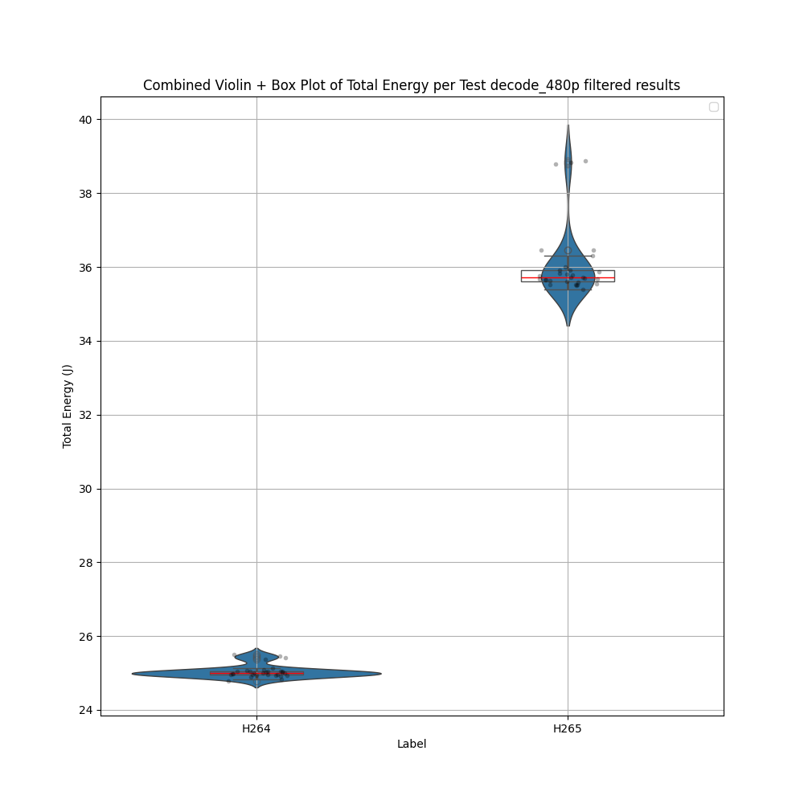
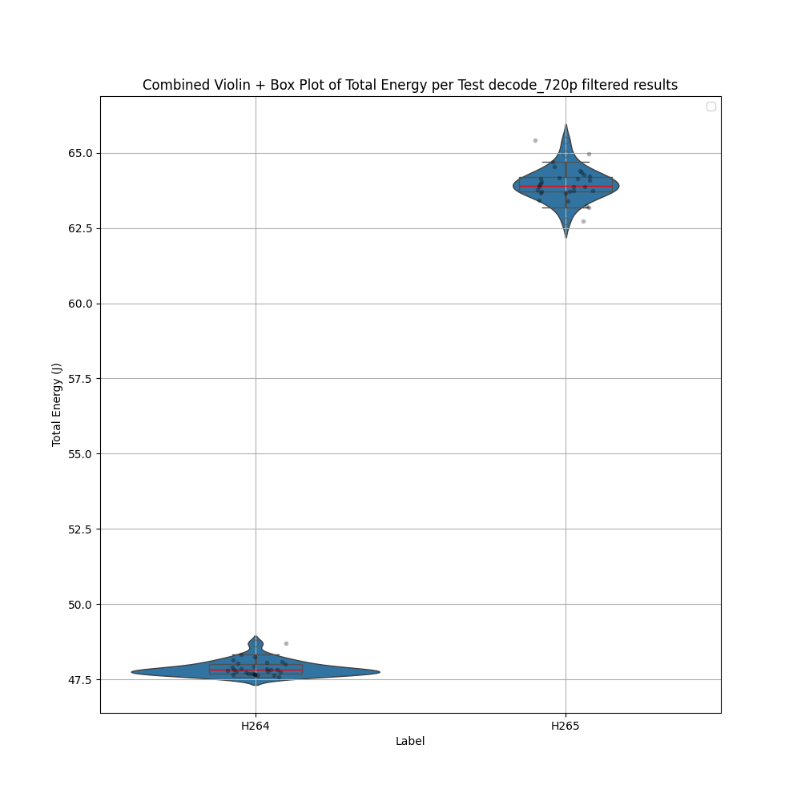
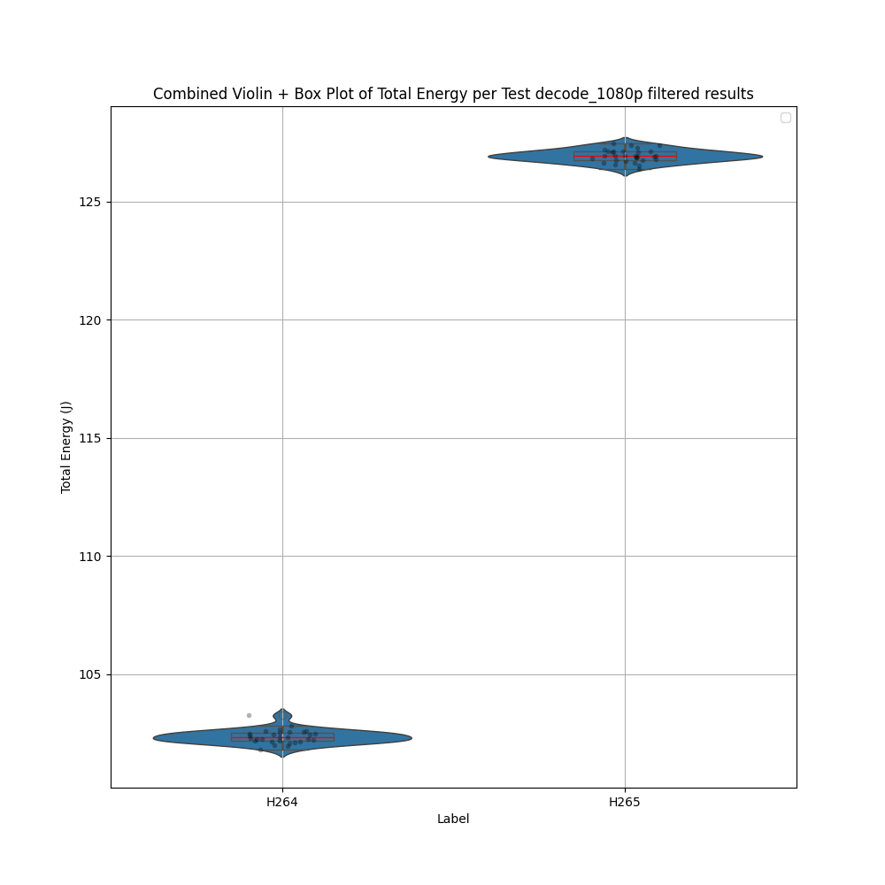

## Introduction
Video decoding is a process that occurs almost constantly in everyday digital life. Whether watching videos on streaming platforms like YouTube or Netflix, participating in video calls,  or scrolling through social media, video decoding happens continuously across billions of devices worldwide. 

As video streaming and high-definition content become increasingly prevalent, the energy efficiency of video decoding has become a critical concern. With the rise of mobile devices, cloud-based streaming services, and embedded systems, understanding the power consumption of video decoding is essential for minimizing environmental impact, reducing overall energy costs, and optimizing battery life.

Two widely used video compression standards, H.264 (AVC) and H.265 (HEVC), dominate modern video encoding. H.265, the newer standard, promises superior compression efficiency, reducing bandwidth usage while maintaining visual quality. However, its increased computational complexity raises questions about its energy efficiency during decoding. While H.265 is more efficient in terms of storage and transmission, its impact on energy consumption during playback remains an open question.

By measuring and comparing the energy consumption of H.264 and H.265 video decoding on different CPU's, this study aims to provide insights into the sustainability of modern video technologies. The findings could help software developers, hardware manufacturers, and content distributors make informed decisions about choosing the optimal codec for energy-conscious and environmentally responsible applications.

### Research Question  

How does the energy consumption of video decoding compare between the H.264 and H.265 codecs,  and what are the implications for device efficiency and environmental sustainability?

## Experimental Setup

### Environment
We will conduct tests on an Acer laptop with the following hardware specifications:
- Series: Aspire 5 (A515-54G-59MW)
- CPU: Intel i5-10210U @ 1.60 GHz
- RAM: 16GB DDR4 @ 2400 MHz
- OS: Windows 11, v 24H2
- Screen resolution: 1920 x 1080


During these experiments, we minimized background activity to reduce external interference. Wi-Fi and Bluetooth were disabled, and airplane mode was enabled. The screen was turned off, and the device remained connected to the charger throughout the experiment to ensure consistent power conditions.

### Tools & Methods
We evaluate the energy consumption of decoding a video that was previously encoded using the H.264 or H.265 codec. In the following, we will discuss the decoding software and energy measurement software that we used to do our experiments.

Encoding and decoding were performed using [FFmpeg](https://www.ffmpeg.org/) (version 7.1), a free and open-source software suite used for handling multimedia files. Both H.264 and H.265 are lossy compression formats, where the Constant Rate Factor (CRF) determines the level of quality loss—lower values retain higher quality at the cost of larger file sizes. Additionally the preset controls the trade-off between encoding speed and compression efficiency. For this experiment, videos were encoded using **CRF 23** and the **medium preset**, which are the default settings in FFmpeg. These values provide a balanced trade-off between compression efficiency, encoding speed, and output quality.

We measure energy consumption using [EnergiBridge](https://github.com/tdurieux/EnergiBridge) (version 0.0.7). Each decoding experiment is repeated 30 times, with a 1-minute break between runs to prevent residual CPU activity from affecting subsequent measurements.

Energy consumption is measured from the start of decoding until completion. To prevent file writing from affecting the results, the decoded video is directed to a null output, avoiding delays caused by writing large uncompressed video files. This approach aligns with real-world use cases, where videos are typically buffered and displayed on-screen rather than written to disk.

We chose this method over playing the actual video to isolate the decoding process. However, in real-world scenarios, video decoding may not always occur all at once, as streaming and playback often involve partial or on-demand decoding.

### Video specifications and encoding results
The video used for the experiment was downloaded from the TU Delft YouTube channel in 4K resolution and can be found [here](https://www.youtube.com/watch?v=rlVE2fivjs4). It has a duration of 1 minute and 44 seconds with a frame rate of 25 fps. Originally encoded in VP9, the video was transcoded into H.264 and H.265 at three different resolutions: 480p, 720p, and 1080p. This resulted in the following set of videos:

| **Encoding** | **Resolution** | **Bitrate** | **File Size** | 
|-|-|-|-| 
| VP9 (Original)| 3840x2160 |7731 kbps | 95.9 MB |
| H.264 | &nbsp; 854x480 | 700 &nbsp; kbps | 8.76 MB | 
| H.264 | 1280x720 | 1291 kbps | 16.0 MB | 
| H.264 | 1920x1080 | 2689 kbps | 33.4 MB | 
| H.265 | &nbsp; 854x480 | 619 &nbsp; kbps | 7.76 MB |
| H.265 | 1280x720 | 1026 kbps | 12.8 MB |
| H.265 | 1920x1080 | 1853 kbps | 23.0 MB |

We observe that H.265 indeed achieves better compression, particularly at higher resolutions. While we cannot guarantee that the video quality of H.264 and H.265 is exactly the same, using a fixed constant rate factor (CRF) and preset ensures that the quality remains comparable across both codecs.


### Results

#### Energy Consumption: H.264 vs. H.265

To evaluate the energy efficiency of H.264 and H.265 decoding, we analyzed energy consumption across 480p, 720p, and 1080p resolutions.

We visualized our results using a combination of violin plots and box plots, which provided a clear picture of energy consumption distribution for both codecs. 

Here are the Violin + Box Plots of the experiments, with [removed outliers](#outlier-removal)








One immediate takeaway is that H.265 consistently required more energy than H.264 for all resolutions. But how significant is this difference? To dig deeper, we needed to validate these observations with statistical tests.

##### Checking Normality
We used the **Shapiro-Wilk** test to assess whether the energy consumption data followed a normal distribution. A p-value < 0.05 indicates significant deviation from normality, meaning the data is not normally distributed.

##### Outlier Removal
To ensure extreme values weren’t skewing our results, we applied outlier removal using a **Z-score** threshold of 3 (within standard deviations). Interestingly, this step had minimal impact—suggesting that most of our data points were valid and not extreme anomalies. We verified this by comparing results before and after filtering, which showed no major changes in distribution.


##### Then we chose the Statistical Test

If both distributions were normal, we applied **Welch’s T-test**, which compares means while accounting for unequal variances. Otherwise, we used the **Mann-Whitney U test**, a non-parametric test suitable for comparing medians.


| Resolution | Normality (H.264) | Normality (H.265) | Statistical Test Used | Energy Difference (J) | Relative Difference (%) |  
|------------|------------------|------------------|--------------------|-----------------|-----------------|  
| **480p**   | ❌ Non-normal (p = 0.0002) | ❌ Non-normal (p = 0.0000) | **Mann-Whitney U** | 10.72 J | **30.00%** (H.264 more efficient) |  
| **720p**   | ❌ Non-normal (p = 0.0010) | ✅ Normal (p = 0.6275) | **Mann-Whitney U** | 16.09 J | **25.18%** (H.264 more efficient) |  
| **1080p**  | ✅ Normal (p = 0.2624) | ✅ Normal (p = 0.9251) | **Welch’s T-test** | 24.58 J | **19.36%** (H.264 more efficient) |  

From the table above we can see that:
* H.264 is consistently more energy-efficient than H.265 across all tested resolutions.
* The percentage efficiency gap narrows as resolution increases, but the absolute difference in Joules increases.
* Statistical tests confirm a significant difference in all cases, proving that H.265 requires more energy to decode.


### Discussion
Our results show that H.264 consumes 19.36% less energy than H.265 during 1080p video decoding. This suggests that while H.265 offers better compression, it does not necessarily result in lower energy consumption during playback. The increased computational complexity of H.265 decoding likely contributes to the higher energy usage, as it requires more processing power to decompress the video compared to H.264.

Interestingly, we observed that the relative difference in energy consumption decreased significantly as the resolution increased. This implies that the higher decoding cost of H.265 may be less of a drawback at higher resolutions, where the benefits of H.265’s compression efficiency are more pronounced. As the resolution increases, H.265's superior compression can offset its decoding complexity, leading to a more balanced trade-off between energy usage and file size.

Given that video decoding is an everyday activity, a 19.36% reduction in energy consumption is highly impactful. While saving 24.8 joules on a single 2 minute video can seem insignificant, considering the vast scale of video consumption—especially on platforms like YouTube—such reductions can lead to substantial energy savings globally. With billions of video views daily, even a small decrease in energy per video can result in millions of joules saved over time, contributing to a reduction in the overall environmental footprint of video streaming.

## Limitations
### Impact of File Size
H.265 offers significantly more efficient compression, resulting in smaller file sizes. This reduction can lower energy consumption in areas not measured in our experiments, such as networking and disk access, beyond just reducing storage requirements. Future research could further investigate these aspects to better understand the overall energy impact and determine the optimal codec choice for different use cases.

### Limited generalization
Our study was conducted using a single video, which may limit the generalizability of the results. Additionally, we only tested the default constant rate factor and preset settings, meaning performance and energy consumption may vary under different encoding configurations. Future research should investigate a broader range of videos and encoding parameters to provide more comprehensive insights.

### Single hardware configuration
The study was conducted using a single hardware platform. The energy consumption observed may vary across different devices, operating systems, or configurations. Expanding the range of hardware used could provide a more comprehensive view of codec performance in real-world scenarios.

### Hardware acceleration
This study did not take advantage of hardware acceleration. Utilizing specialized hardware such as GPUs or dedicated video encoding/decoding units could lead to different energy consumption results. Future work could include testing with hardware acceleration to assess its impact on energy efficiency.

## Challenges Encountered
During our experiments, we attempted to measure the energy consumption of the video **encoding** tasks with **EnergiBridge**, but unfortunately, we encountered issues that prevented the tool from functioning as expected. Despite multiple troubleshooting attempts, we were unable to gather reliable data from these trials.

Specifically, we sometimes encountered the following error:
``` shell
thread 'main' panicked at /rustc/07dca489ac2d933c78d3c5158e3f43beefeb02ce\library\core\src\time.rs:954:31:overflow when subtracting durations
```
The impact of the error was that EnergiBridge would stop measuring and return control back to our automated script. However, since we used EnergiBridge as a wrapper command for our FFMPEG encoding/decoding, and EnergiBridge would not kill its child process, the encoding/decoding continued. A new experiment would then start, which meant that we had two processes running at the same time. In practice, we experienced that the amount of simultaneous processes could reach well over 10, slowing the computer down significantly, probably because of a lack of enough resources.

The error was encountered on both Intel and AMD processors. RAPL was used to measure energy consumption on Intel hardware. The AMD hardware reports different data, which suggest RAPL was not used in these cases. Furthermore, increasing the sleep time between experiments seemed to reduce the amount of overflows. On the Intel hardware we run our experiments with a sleep time of 150 seconds, which was more than the experiments themselves took. This prevented multiple encoding/decoding processes to be running at the same time. At the same time, the number of overflows seemed to be smaller, indicating that the FFMPEG process might pollute something which leads parallel experiments to fail. Moreover, the overflow was only encountered on experiments where libx264 was used to decode videos into various resolutions. This is surprising as libx264 is less computationally expensive compared to libx265.

## Summary & Key Takeaways

### Overview of Experimental Findings  
Our experimental analysis systematically compared the energy consumption of H.264 and H.265 video decoding across different resolutions. Throughout our tests, H.264 consistently demonstrated lower energy consumption compared to H.265. The rigorous statistical analysis confirms that these differences are significant, indicating that the observed variations are not simply due to chance. Our experiments, conducted under controlled conditions, provide clear evidence that, from an energy efficiency standpoint, H.264 outperforms H.265 across all resolutions.

### Broader Implications and Final Considerations  
Beyond the immediate results, our study reveals an interesting trend related to video resolution. While the absolute energy difference between the two codecs increases with higher resolutions, the relative percentage difference decreases. This suggests that as the video resolution rises, the advantage of H.264 in terms of energy efficiency becomes proportionally smaller, even though the total energy saved is greater. These findings emphasize that codec selection should consider both the decoding energy and the broader implications, such as storage efficiency and network transmission, which are critical for large-scale and high-resolution video applications.

In conclusion, our study offers a comprehensive overview of how the energy efficiency of video decoding is affected by codec choice and video resolution. While H.264 shows clear benefits in terms of lower energy consumption, the decision between using H.264 or H.265 must also account for factors like compression efficiency and overall system sustainability.


---

## Replication Package
### How to Reproduce the Experiment
Instructions on how to reproduce the experiment can be found on our [GitHub Repository](https://github.com/JamilaSeyidova/sse-group22).

