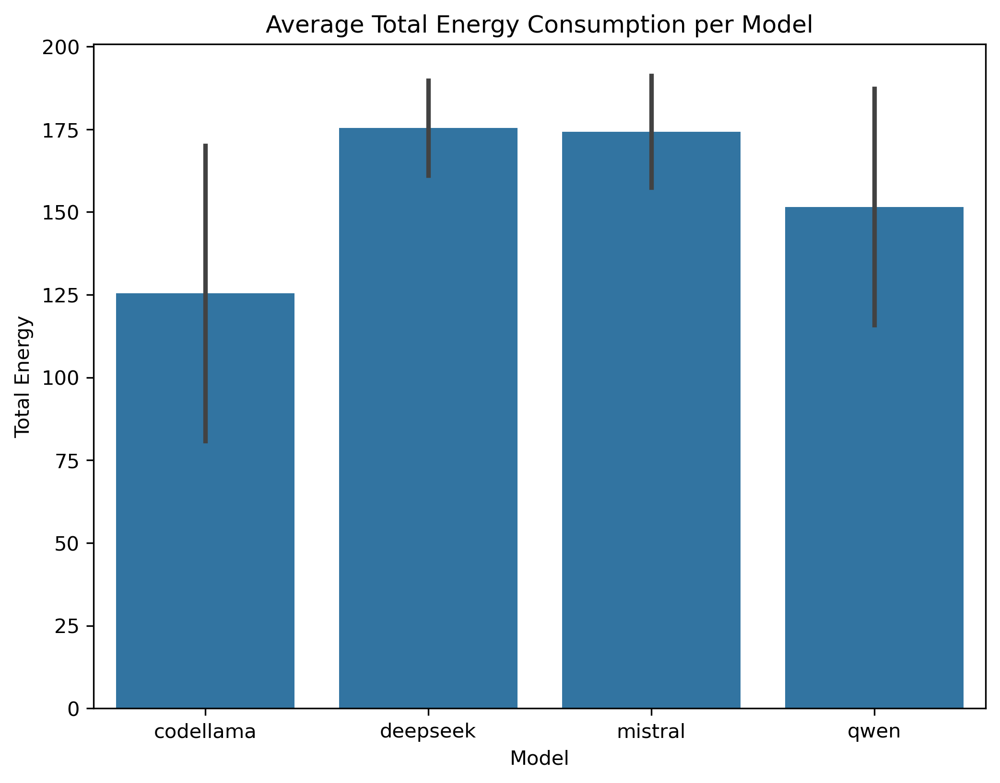
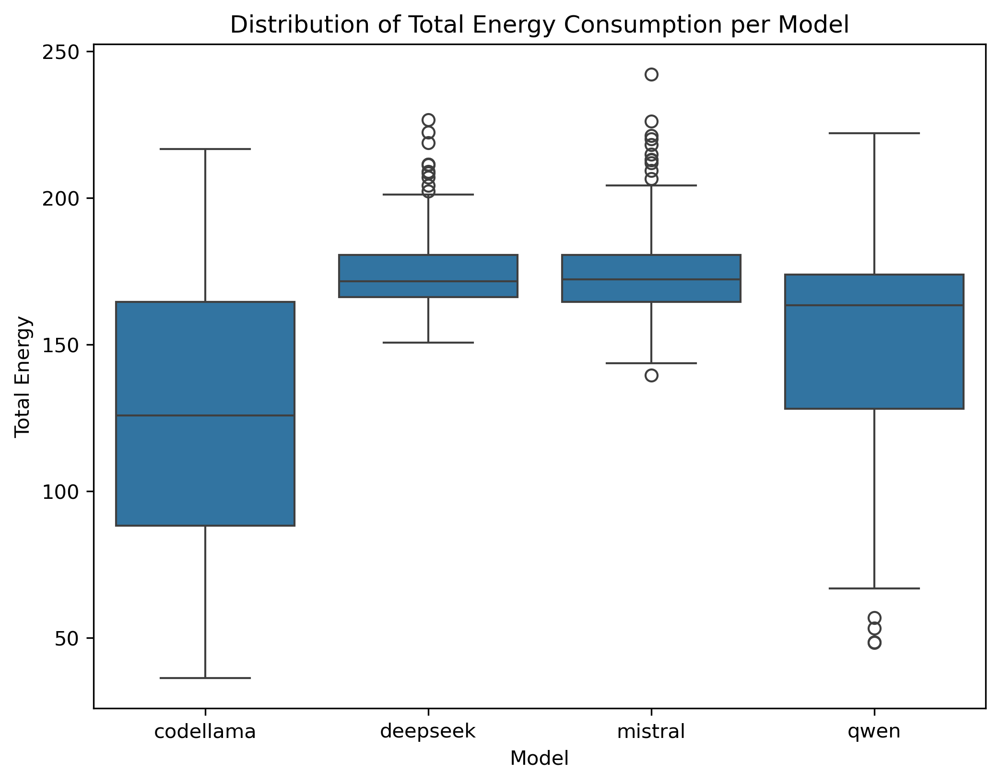
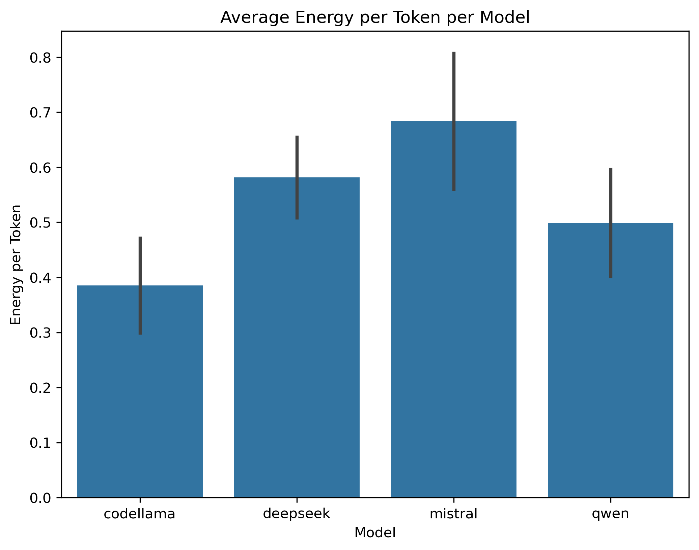
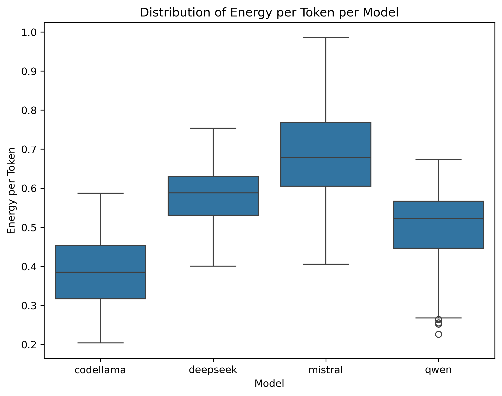

### Introduction
Artificial Intelligence (AI) technology has gained widespread attention, particularly when considering Large Language Models (LLMs). Despite taking off rapidly and being used in various development contexts, LLMs faced criticism pertaining to sustainability. Previously, Gebru equated the carbon footprint of training one BERT model to that of a transatlantic flight [(2021)](https://dl.acm.org/doi/10.1145/3442188.3445922), while more recent research shows that the carbon footprint of one ChatGPT query is 20 times higher than that of a web search query [(Ding and Shi, 2024)](https://ieeexplore.ieee.org/abstract/document/10765824). Despite such criticisms, there are no signs of investments in LLM technology slowing down, a fact which makes it essential for scientists to investigate how LLMs can be developed to be more energy efficient. 

This boom in LLM-based technologies was swiftly followed by the rise of Large Language Models (LLMs) for code, which helps speed up development processes. Despite the advantages of using such tools, users may have fears related to data privacy [(Yao et al., 2023)](https://arxiv.org/abs/2312.02003). We suspect this may lead to an increased interest in running LLMs on a local backend. Thus, while we can identify notable research into the energy consumption of LLM technologies, we find it equally important to investigate these aspects for local inference processes.

Generally, meaningfully tackling the topic of LLM sustainability is a two-step process. Firstly, one needs to understand how (un)sustainable current LLMs are by performing empirical evaluations. Only after can one work on solutions that contribute to improving sustainability in this field. Our blog post tackles the first step. In particular, we focus on local LLM inference processes.

This study evaluates the energy consumption of local LLM inference. In particular, we test the inference process of [Qwen2.5-7B-Instruct](https://huggingface.co/Qwen/Qwen2.5-7B-Instruct), [DeepSeek-R1-Distill-Qwen-7B](https://huggingface.co/deepseek-ai/DeepSeek-R1-Distill-Qwen-7B), [CodeLlama-7b-Instruct-hf](https://huggingface.co/codellama/CodeLlama-7b-Instruct-hf), and [Mistral-7B-Instruct-v0.3](https://huggingface.co/mistralai/Mistral-7B-Instruct-v0.3), with [llama.cpp](https://github.com/ggml-org/llama.cpp) as backend. We run these models against the [HumanEval dataset](https://github.com/openai/human-eval), a state-of-the-art LLMs for code benchmark, and measure their energy consumption per token for every query. The primary argument for choosing these models is that they are open source. Moreover, we deemed it essential to include DeepSeek in our research due to two assumptions: (1) given the current political landscape, Western users exhibit increased privacy concerns for technology originating from China, making them more likely to run Deepseek locally, and (2) DeepSeek's public research suggests that this model was cheaper to develop, a fact which motivates us to investigate if it is also more energy efficient.

### Methodology

To evaluate the energy efficiency of LLMs for code, we designed an experiment involving four models, Codellama, Deepseek, Gwen and Mistral. The selection of these models is motivated by their parameter parity (approximately 7B parameters) and open-source availability. By limiting our experiments to these models, we aim to isolate the effects of model architecture on energy consumption.

To reduce confounding variables, all experiments were executed on the same device under identical conditions using a script: 
- root run check
- operating system check
- all other applications closed
- adaptive screen brightness disabled
- screen saver disabled
- consistent screen brightness set
- Wi-Fi interface turned off
- Bluetooth and Airdrop disabled
- display sleep disabled

Once the experiment is complete, the script reverts the Wi-Fi and display sleep settings to their original states and reminds the user to re-enable any manually disabled features like adaptive brightness, Bluetooth, and Airdrop. The script can be found in the repository linked at the end of this page. This controlled environment ensures that differences in energy consumption can be attributed primarily to the model characteristics rather than hardware or system optimizations.

The HumanEval benchmark was selected as the dataset to evaluate the models on code generation tasks. This benchmark provides standardized test cases to assess correctness and also enables us to quantify energy consumption per generated token in a reproducible manner.

Our primary metrics are energy consumption measured as total energy per problem and energy per token generated for a problem, in order to differentiate between single-token and multi-token settings. We used the measurement tool provided in the lab, [EnergiBridge](https://github.com/tdurieux/EnergiBridge), to capture the energy metric.

After conducting the experiment, descriptive statistical analyses were performed on the collected data to summarize the tendencies and variability of energy consumption across the different configurations.

### Results

After collecting the raw energy consumption data (total energy and energy per token for each model-task pair), we performed descriptive statistical analyses using [Python](https://www.python.org/) scripts and [JASP](https://jasp-stats.org/). Specifically, for each of the four models we computed:

- **Mean** and **Standard Deviation (SD)** of energy consumption to capture average behavior and overall variability.  
- **Minimum** and **Maximum** values to observe the full range of consumption.  
- **Box plots** to visualize the distributions of both total energy and energy per token across all HumanEval tasks.  
- **Bar charts** with error bars (the standard deviations) to highlight differences in mean energy consumption among models.  

In total, we ran 164 HumanEval tasks per model, collecting two primary measures:

1. **Total Energy (in Joules) per task**  
2. **Energy per Token (in Joules) per task**  

[The detailed energy report can be found here.](resources/aggregated_energy.html)

#### Total Energy Consumption
[//]: # (![image]&#40;../img/p1_measuring_software/g23_llm_inference/bar_total_energy.png&#41;)

[//]: # (![image]&#40;../img/p1_measuring_software/g23_llm_inference/box_total_energy.png&#41;)

[//]: # (![image]&#40;../img/p1_measuring_software/g23_llm_inference/bar_energy_per_token.png&#41;)

[//]: # (![image]&#40;../img/p1_measuring_software/g23_llm_inference/box_energy_per_token.png&#41;)
When considering the total energy consumption:
- **Codellama** recorded the **lowest mean total energy** at approximately **125.45 J** (SD = 44.60) ([Figure 1](#fig:bar_total_energy)). Its distribution ranged widely (36.27–216.62 J), indicating that while it often consumed low energy, some tasks required substantially more.  

- **Deepseek** had the **highest mean total energy** of about **175.44 J** (SD = 14.32), with values ranging from 150.71 J to 226.70 J ([Figure 2](#fig:box_total_energy)). Notably, its narrower range suggests more consistent consumption, albeit at a higher level.  

- **Mistral** (mean = 174.30 J, SD = 16.86) also showed relatively high total energy consumption, comparable to Deepseek but with a slightly broader spread (139.49–242.13 J) ([Figure 2](#fig:box_total_energy)).  

- **Qwen** fell between Codellama and Deepseek/Mistral in total energy usage (mean = 151.57 J, SD = 35.68), with a range of 48.47–222.113 J ([Figure 2](#fig:box_total_energy)).

Overall, **Codellama** stands out for **lowest total energy** on average, while **Deepseek** and **Mistral** are at the higher end. **Qwen** remains in an intermediate position but with moderate variability.

<figure id="fig:bar_total_energy" style="text-align: center;">
  
  <figcaption>Figure 1: Bar Total Energy</figcaption>
</figure>

<figure id="fig:box_total_energy" style="text-align: center;">
  
  <figcaption>Figure 2: Box Total Energy</figcaption>
</figure>

#### Energy per Token
When normalizing energy consumption by the number of tokens generated:
- **Codellama** again appears the most efficient, averaging **0.385 J/token** (SD = 0.086) ([Figure 3](#fig:bar_energy_per_token)).  

- **Deepseek** uses **0.582 J/token** (SD = 0.073) ([Figure 3](#fig:bar_energy_per_token)).  

- **Mistral** has the **highest average energy per token**, at **0.684 J/token** (SD = 0.123), although its total energy is similar to Deepseek’s ([Figure 3](#fig:bar_energy_per_token)).

- **Qwen** requires **0.499 J/token** (SD = 0.097), placing it between Codellama and Deepseek in terms of per-token consumption ([Figure 3](#fig:bar_energy_per_token)).

Hence, **Codellama** is consistently the most energy-efficient model, both in total energy and energy per token. **Mistral** stands out for having the highest per-token usage, and **Deepseek** ranks slightly below Mistral on that metric but shows the highest total energy consumption. **Qwen** tends to cluster between the extremes.

<figure style="text-align: center;">
  
  <figcaption>Figure 3: Bar Energy per Token</figcaption>
</figure>

<figure style="text-align: center;">
  
  <figcaption>Figure 4: Box Energy per Token</figcaption>
</figure>

#### Overall Comparison
These results suggest that while **Codellama** maintains the lowest energy footprint overall, there can be task-level variability (as indicated by its wide range). **Deepseek** and **Mistral** consistently draw higher power, whether measured as total energy or on a per-token basis, with **Mistral** being the least efficient per token. **Qwen** generally remains in an intermediate position, as it balances moderate total consumption and moderate per-token usage.

To further contextualize these results, we compared the percentage differences between the models relative to Codellama, as it was the most energy-efficient model:

For total energy consumption:
- **Deepseek**: ((175.44 J - 125.45 J) / 125.45 J) × 100 ≈ 40% higher than Codellama.
- **Mistral**: ((174.30 J - 125.45 J) / 125.45 J) × 100 ≈ 39% higher than Codellama.
- **Qwen**: ((151.57 J - 125.45 J) / 125.45 J) × 100 ≈ 21% higher than Codellama.

For energy per token:
- **Deepseek**: ((0.582 J/token - 0.385 J/token) / 0.385 J/token) × 100 ≈ 51% more energy per token than Codellama.
- **Mistral**: ((0.684 J/token - 0.385 J/token) / 0.385 J/token) × 100 ≈ 78% more energy per token than Codellama.
- **Qwen**: ((0.499 J/token - 0.385 J/token) / 0.385 J/token) × 100 ≈ 30% more energy per token than Codellama.

### Discussion

Our results of the analysis of energy consumption across the four models provide valuable insights into their energy efficiency characteristics. These findings are relevant for both developers and users of LLMs, as we strive to align with sustainability goals and minimize environmental impact. Users, particularly organizations, may prioritize environmentally responsible technologies to meet social responsibility objectives. Additionally, energy efficiency correlates with lower operational costs.

Codellama emerged as the most energy-efficient model, both in terms of total energy consumption and energy per token. This suggests Codellama could result in reduced environmental impact and cost savings in large-scale deployments. However, its wide range of total energy consumption (36.27–216.62 J) indicates that its efficiency can vary significantly depending on the task. This variability may come from differences in task complexity or the model's adaptability to specific tasks. This suggests it may require careful monitoring to avoid energy spikes in practice.

In contrast, Deepseek and Mistral demonstrated consistency, although higher energy consumption overall. Our results suggest that Deepseek operates with a high but predictable energy demand, which could be advantageous in environments where predictability is valued over efficiency, especially if Deepseek gives a performance advantage (e.g.: higher accuracy of response) on certain tasks. Mistral, on the other hand, not only consumed a similar amount of total to Deepseek, but also had the highest energy per token. This makes Mistral the least efficient model on a per-token basis, which could be a significant drawback in applications requiring extensive text generation. Deepseek seems to be a better alternative in this case.

Qwen occupied an intermediate position, with moderate scores for both metrics. Its balanced performance makes it a viable option for users seeking a compromise between efficiency and capability. However, its moderate variability suggests that its energy demands can still fluctuate depending on the task at hand.

### Limitations & Future work

Since we solely compared the power output of four models, there is a large variety of options that could be available for future work. The first is the most straightforward, namely, comparing a larger variety of models, with more varied parameters as well. The models we looked at gave a good idea of their power usage. However, seven billion parameter models are used in much smaller quantities, as their performance typically does not measure up to their larger counterparts in exchange for their efficiency. Additionally, there are models such as ChatGPT and Gemini which may be more commonly used, compared to the open-source alternatives we investigated.

Initially, we wanted to compare the energy consumption across different models, but with different backends. A variety of different backends were considered for this, such as [mistral.rs](https://github.com/EricLBuehler/mistral.rs), [vLLM](https://docs.vllm.ai/en/latest/#), [mlx-lm](https://pypi.org/project/mlx-lm/) and [exllamav2](https://github.com/turboderp-org/exllamav2) alongside [llama.cpp](https://github.com/ggml-org/llama.cpp) that we ended up using. However, we encountered challenges getting mistral.rs and vLLM working, due to subpar documentation and a lack of GPU acceleration on Mac, as well as Deepseek not being supported by mistral.rs. Due to these challenges and our limited availability regarding time and hardware options, we settled on using a single backend, namely llama.cpp, which was chosen due its popularity, and due to many existing applications being built on top of it. 
As backends have minimal to no impact on model output, model performance can be maintained, although optimizations can still be made to improve energy efficiency. Improving parallelization, for instance, could affect generation speed, which in turn could affect the energy consumption. Furthermore, the assorted backends likely have different energy requirements. Llama.cpp is more commonly used to run models locally, whereas vLLM is typically used in server based applications.

Additionally, our study focuses solely on energy efficiency and does not take into consideration performance metrics, such as accuracy of generated code or speed of generation. Since we had to limit the response to 100 tokens per task, we did not use the HumanEval scores themselves. This meant we were unable to consider the actual outputs of the LLMs. Future studies could have large benefits from including this aspect, as an incredibly power-efficient model with unusable outputs provides incredibly limited utility. For example, Codellama could be most energy efficient but perform very poorly in terms of accuracy, which would make it unusable for code generation tasks. Conversely, it is also easier to weigh if performance improvements are worth higher energy consumption. For instance, as Deepseek typically utilizes more tokens than the other models, the total output power may be higher than its energy per token could suggest. Investigating whether this correlates with higher benchmark scores would provide valuable insight. Additionally, analyzing how models generate computationally efficient code could help clarify trade-offs between inference cost and long-term execution efficiency.

Another limitation is the fact that our analysis is based on a specific set of tasks, namely HumanEval, and the results may not generalize over other datasets. HumanEval consists of 164 programming questions, which include a function signature, a docstring, a partial implementation, and unit tests. Therefore, our results might be different for another set of tasks, and we cannot conclude which model is generally most energy efficient, but just within this given context. This also limits ourselves from drawing conclusions about which models are most energy efficient for which type of tasks, as we do not compare different subsets. For future work, we could test against benchmarks such as [BigCodeBench](https://github.com/bigcode-project/bigcodebench) which covers seven distinct domains and 1140 detailed tasks. 

Finally, we simply measured the energy that the model consumed by generating the code. Another option, however, is to measure the energy consumption of executing the generated program, rather than the model. There have been studies like this one, for instance by [Cursaru, Duits, et al. (2024)](https://arxiv.org/abs/2405.03616), however, the focus of the study was solely on code generated by Codellama. Combining results from the energy efficiency of the model itself, along with the energy efficiency of the code generated would paint a much more complete picture and could be expanded to a wider variety of models as well. 

### Conclusion

For this project, we investigated the power consumption of four code LLMs: Codellama, Mistral, Deepseek and Qwen. We ran the HumanEval benchmark and recorded energy metrics throughout by using EnergiBridge. Our results indicate that Codellama demonstrated best results in both total energy consumption as well as energy per token. Qwen followed, consuming 21% more total energy, and 30% more energy per token compared to Codellama. Deepseek and Mistral were approximately on par in total energy consumption, with 40% and 39%, however Deepseek produced better results in energy per token at 51% greater energy consumption than Codellama, whereas Mistral performed significantly worse at 78% more energy per token. From these results we recommend the usage of Codellama in energy sensitive applications. 

However, our approach has limitations. Our experiment was only done on one backend: `llama.ccp`. Furthermore, time constraints restricted us to only consider the HumanEval dataset, which is limited in scope. Thus, we see value in future research on more datasets. Going further, our experiment only considers coding-related tasks, but increased privacy concerns could lead to an increase in back-ends that are accessible to a non-coding userbase, too. Thus, future empirical research that explores non-coding related avenues could be equally relevant.

Although we are currently unable to determine exactly what factors may have contributed to these results, our findings highlight the necessity of further research to improve understanding of  energy efficiency trade-offs and optimization for code LLMs, as there is relevance for both developers and users.

### Reproducibility
To reproduce our results, you can access [our repository](https://github.com/emihalache/sse).

