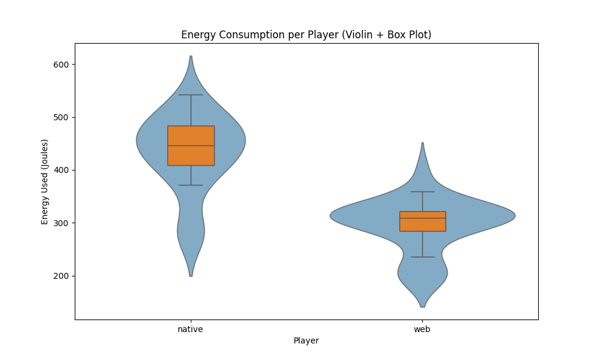
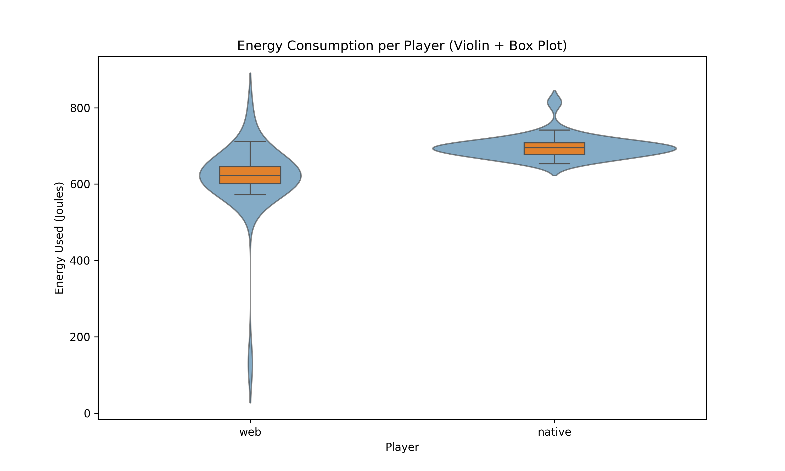
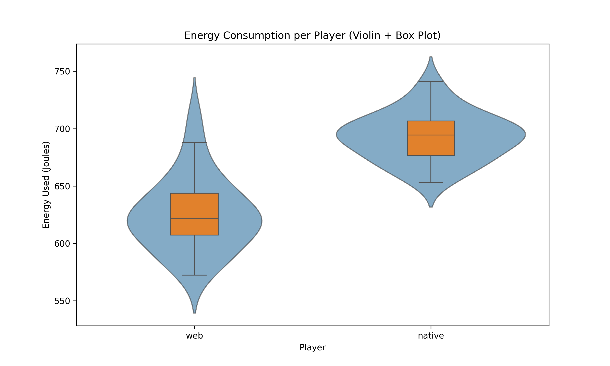

# Native vs. Web: Analysing the Energy Consumption of Spotify Apps

## Introduction
The way music is consumed and distributed has changed dramatically over the past few decades. The rise of digital streaming platforms such as Spotify has transformed music into an on-demand service, replacing the need to purchase physical products such as CDs or vinyl. [^music_industry_shift] 

Today, streaming generates over 67% of global music revenues [^global_music_report], confirming its dominance in the industry. With 675 million monthly active users [^spotify_report] and a market share of over 30% [^streaming_stats], Spotify is the clear leader in the music streaming market. While this shift has made music more accessible than ever, it also poses questions about its environmental impact, since streaming requires a service provider, constant network data transmission, and device power.

In recent years, web-based streaming has become more and more popular as it eliminates the need for users to install additional applications on their devices. While web applications are often favoured for their accessibility and convenience, native applications often offer more features to the user. In this article, we compare the energy consumption of Spotify's web and native applications. By analysing these differences, we aim to provide valuable insights to help users make better decisions about their streaming habits and to help developers choose between developing native and web apps.

## Methodology
This chapter describes the methodology used to compare the energy consumption of Spotify's web and native applications. It covers the design of the experiment and how the experiment itself was conducted, including the automation and setup of the experiment.

### Design of the experiment
The first thing to do before conducting the experiment is to design it. This involves identifying a specific use case for the application, in our case Spotify's web and native application. It is also important to design the experiment in such a way that it mimics actual user behaviour and is realistic.

First, we designed and conducted an experiment with both applications (native and web) open at the same time. We switched between the windows and randomly played exactly one song in each test run. However, the disadvantage of this type of experiment was that the other window that was open in the background affected the accuracy of the measurement. Also, playing a random song for each run has an effect on energy consumption. Thus, the data were not really normally distributed. The result of this first experiment can be found in the chapter [Results of the initial setup without closing and opening (web)app](#results-of-the-initial-setup-without-closing-and-opening-webapp).

The aim in designing the revised experiment was to minimize any bias from other applications and to focus only on the application being run. In addition, we still wanted to play more than one song to mimic realistic user behaviour, but we also wanted the data to be normally distributed across the experiment. So we had to design the individual runs to be similar, but with a certain degree of randomness built in.

For the final experiment, we decided to have 30 runs per application. The runs themselves are randomly mixed. For a single run, we first open the application (i.e. web or native). We then wait a few seconds for the application to fully load so that the opening has no effect on the energy measurement. We did not want to include the start of the application in this measurement as we only wanted to focus on the use case of playing music. Next, the energy measurement is started and four songs are played in random order. Each song is played for 20 seconds. Including the delays for starting and searching for the songs, a run takes about 2 minutes. After the run, the application is closed and we pause for 1 minute. So the whole experiment takes about 3 hours.

### Experiment setup
In general, testing the power consumption of applications is difficult because multiple runs can give different results. For this reason, we have chosen to perform 30 runs per application. However, there are several other factors that can affect the measurement. To reduce any bias as much as possible, we did the following before starting the experiment:

- Let the device run for at least one hour to warm it up.
- Charge the device's battery to 100% and plug it in.
- Close all applications (except the console running the automated test script).
- Disable all unnecessary background services (e.g. cloud sync, software updater, ...).
- Turn off all notifications.
- Ensure that no additional hardware is connected to the device (e.g. remove USB mouse).
- Establish a stable internet connection - preferably a wired connection.
- Turn off automatic brightness.
- Disable any power-saving modes on the device.
- Log in to the Spotify native and web application beforehand and ensure that the volume in both applications is set to 100%. Close applications before starting the experiment.
- Ensure that the room temperature remains approximately the same throughout the experiment.

### Experiment execution
Since it would be impossible to manually run 60 experiments without introducing bias from user input, we automated the testing process using a _Python_ script. The Spotify apps are mostly controlled via keyboard shortcuts using the _pyautogui_ library. The energy measurements are done using [EnergiBridge](https://github.com/tdurieux/EnergiBridge), which is a cross-platform energy measurement utility.[^energi_bridge]

The script starts with an initialization and warm-up phase before actually running the experiments. During this phase, the brightness of the display and the volume of the speakers are automatically adjusted. To warm up, a simple Fibonacci sequence is computed for five minutes. Afterwards, the experiment is run as described in the [Design of the experiment](#design-of-the-experiment) chapter.

### Replication
To replicate this experiment, check out our public [GitHub repository](https://github.com/famulenz-pkrumpl/SSE_Spotify). It contains all the necessary scripts as well as instructions on how to set up the experiment.[^sse_github_repo]

## Hardware setup

For our comparison, we used the following two software applications:

| Software                     | Version        |
|------------------------------|----------------|
| Spotify - Music and Podcasts | 1.257.463.0    |
| Google Chrome                | 133.0.6943.128 |

The experiments were conducted on a DELL XPS 15 9560 with 16GB RAM and Windows 10 Pro Version 22H2.

### Hardware Settings
To have consistent experiment results, our test script automatically sets the brightness and the volume of the system to the level specified in the `.env` file.
Our settings were as follows:

 - Brightness 50%
 - Volume 10%
 - Internet connection via Wi-Fi
 - Google Chrome was used as the browser

### Spotify Settings
To make sure, the experiments are as consistent as possible we adjusted the following settings in the Spotify native app:

 - Auto adjust quality should be disabled
 - Streaming quality: Normal
 - Download [quality]: Normal
 - Clear cache

And these settings should be *ENABLED* at both, the native and the web app:

 - Show the now-playing panel on click of play
 - Display short, looping visuals on tracks (Canvas)

### Spotify Accounts
For our experiment, we used two separate Spotify accounts, one for the native app and one for the web app.
This was done to prevent previously saved songs from being displayed and interfering with the experiment.
It is also important to use a non-premium Spotify account for the experiments because the audio quality of premium accounts is higher and thus, more energy will be consumed ([more information](#limitations-and-issues)).

## Results 

### Results of the initial setup without closing and opening (web)app
As discussed in the methodology, our initial approach was to keep the app and the web browser open during all experiments. The results, as can be seen in Figure 1, show a plot without a normal distribution. We assume that the results with a lower energy consumption might have benefited from internal caching. This led us to change our setup to open and close the (web)app for every run.

*Figure 1: Violin and Box plots of energy consumption (J) without outliers.*

### Results improved setup
#### Violin and Box Plots and Outliers Removal
We have plotted the data[^sse_github_repo] collected from the experiment into two violin and box plots, as can be seen in Figure 2. It is clear from the plots that both the results for the web and native version contain outliers. We used the Shapiro-Wilk test to check if our results are normal, the results of this test can be seen in Table 1. The p-values for the web version (2.1 × 10-8) and for the native version (5.0 × 10-4) reported by the Shapiro-Wilk are smaller than 0.05 and thus the data is not normally distributed. We therefore used z-score outlier removal to remove outliers, we had to apply this twice before the p-value of the Shapiro-Wilk test was larger than 0.05, as can be seen in Table 2. The violin and box plots for the data without outliers can be seen in Figure 3. We removed three data points, two from the web version (129.5J and 788.4J) and one from the native version (814.3J).

*Figure 2: Violin and Box plots of energy consumption (J) with outliers.*

| Shapiro-Wilk            	| W      	| p-value     	|
|-------------------------	|--------	|-------------	|
| With outliers web       	| 0.5549 	| 2.1 * 10-8 	|
| With outliers native    	| 0.8456 	| 5.0 * 10-4 	|
| Without outliers web    	| 0.9573 	| 0.3002      	|
| Without outliers native 	| 0.9882 	| 0.9809      	|

*Table 1: Values reported by Shapiro-Wilk with and without outliers.*

*Figure 3: Violin and Box plots of energy consumption (J) without outliers.*

#### Welch's t_test and Significance
To determine the significance of our results we used Welch’s t-test, which reported a t-statistic of -9.3 and a p-value of 3.21 × 10-12. Since p < 0.05 we conclude that there is a statistically significant difference. From the t-statistic, we conclude that the native version consumes significantly more energy.

#### Effect Size
To get an insight into the effect size of our experiments we computed multiple values, including the average difference, percent change and Cohan's d, these can be seen in Table 2.

|                	| Web   	| Native 	| Difference 	|
|----------------	|-------	|--------	|------------	|
| Minimum value  	| 572.4 	| 653.2  	| 80.8       	|
| Maximum value  	| 711.4 	| 741.2  	| 29.8       	|
| Average        	| 625.3 	| 692.7  	| 67.4       	|
| Percent change 	|       	|        	| 10.78%     	|
| Cohan's d      	|       	|        	| 2.4        	|

*Table 2: Effect size analysis.*

## Discussion
In a similar paper published in 2023, R. Horn et al. compared native and web applications on Android devices in terms of energy consumption, including Spotify, and concluded that web applications consumed 53% more energy than their native counterparts.[^Android_vs_WebApp] We also assumed something similar for our experiment on a Windows machine. However, the [results](#results) show that the opposite is true. The native version of Spotify consumes about 10.78% more energy than the web counterpart.

To understand where these differences come from, we looked at the differences between the applications. First, the two applications differ in terms of functionality. The web application only offers one bitrate that automatically adjusts the streaming quality depending on the internet connection available. In the native application, on the other hand, you can choose between different audio qualities and also switch off the automatic quality adjustment. Moreover, the native application also implements caching.

However, the most significant difference between the web and native versions of Spotify is the technical implementation. Browsers are highly optimized these days as there is a lot of competition between different companies. Chrome's V8 JavaScript engine is written in C++ and compiles the code directly into machine code as the program runs, which is very efficient.[^chrome_v8_engine] On the other hand, Spotify's native version uses the same codebase as the web version, but uses the [Chromium Embedded Framework](https://bitbucket.org/chromiumembedded/cef/src/master/) to run the code natively.[^spotify_architecture]

For companies like Spotify, using the same code base for both web and native apps saves a lot of money. However, the frameworks used to transform web applications into native applications happen to be less efficient than running the application directly in the browser. 

## Limitations and Issues
The experiment methodology has a few issues, such as not being able to cover all the use cases. The experiment only collects data for a maximum of 2 minutes per data point, but this can be increased to around 5-10 minutes. The native and the web app versions have different audio qualities, video playback, and UI which might affect measurements. The used energy of the application depends a lot on the quality of the audio stream. This quality depends on various factors, one of which is the quality setting of the native app. In our experiments, we set it to *Normal*, corresponding to an AAC bitrate of approximately 96 kbit/s. It is not possible to adjust the audio quality in the web app, which means the music will be played with an AAC bitrate of 128 kbit/s for non-premium Spotify accounts and 256 kbit/s for premium accounts.[^spotify_audio_quality]

Another issue with testing the web app version was that it was only tested on one browser and one operating system. It could be the case that the native app runs more efficiently on a different operating system and architecture. This method also doesn't identify which features or which processes are consuming the most energy in the web app. This is a more useful insight for developing a more sustainable software product.

Furthermore, not all use cases are covered in our experiments. The native app, in particular, offers more configuration options, which may further impact the results. For example, offline mode is not considered in our experiments. This mode could lead to lower energy consumption since no data transfer is required. The native app also lacks the option to turn off caching. This eventually leads to automatic downloads of some music and therefore, less data needs to be transferred and the energy consumption may decrease.

## Conclusion
In this article, we conducted an experiment on the difference in energy consumption between Spotify's web and native applications. The main goal was to raise awareness of the sustainability aspects of using either web or native applications. As our experiment shows, the Spotify web application is about 11% more efficient than its native counterpart. The main reason for this is the different technologies used in the background to run the same codebase in both web and native environments.

In conclusion, users are better off using Spotify's web implementation rather than its native counterparts. They will use less power, which is good for battery life, but they will also have to sacrifice some functionality. In general, this is true not only for Spotify, but for most web applications that also have a native counterpart. In the end for both users and developers, it is a trade-off between usability and energy efficiency.

## Future Work
The future work would involve looking at covering more use cases of the Spotify app. This would involve testing different features within the app, such as different video qualities, and how they affect the energy consumption in both the native and web app versions. This can be extended for different browsers and for different native versions of Spotify across different operating systems and architectures. Other similar music players such as Apple Music / YouTube Music can be examined to see how well they perform in terms of energy consumption when compared to Spotify. The song selection could also be improved, currently the same four songs are being tested for 20 seconds each per run. The better approach would involve testing for longer periods with a bigger variety of songs from multiple genres. Additionally, a more detailed comparison of the energy consumption of different Spotify features could help to identify features that have a disproportionately high energy consumption. If there are some features that are rarely used but contribute a lot to the baseline energy consumption, Spotify could consider removing them.

[^music_industry_shift]: [An Economic Analysis of the Effects of Streaming on the Music Industry in Response to Criticism from Taylor Swift](https://scholarworks.uni.edu/cgi/viewcontent.cgi?params=/context/mtie/article/1154/&path_info=05_Zehr_music_streaming.pdf)
[^global_music_report]: [IFPI - Global Music Report](https://www.ifpi.org/wp-content/uploads/2024/04/GMR_2024_State_of_the_Industry.pdf)
[^spotify_report]: [2024 Earnings](https://newsroom.spotify.com/2025-02-04/spotify-reports-fourth-quarter-2024-earnings/?utm_source=chatgpt.com)
[^streaming_stats]: [Music Streaming Services Stats (2025)](https://explodingtopics.com/blog/music-streaming-stats)

[^energi_bridge]: [EnergiBridge GitHub](https://github.com/tdurieux/EnergiBridge)
[^sse_github_repo]: [GitHub repository with source code of experiment](https://github.com/famulenz-pkrumpl/SSE_Spotify)

[^spotify_WebApp_vs_Native]: [Spotify Desktop vs Web Player: Which Spotify Has Better Features?](https://softwarekeep.com/blogs/comparisons/spotify-desktop-vs-spotify-web-player)

[^chrome_v8_engine]: [The V8 JavaScript Engine \| JIT, Compilation, and More: What Makes V8 a JavaScript Powerhouse](https://noncodersuccess.medium.com/the-v8-javascript-engine-jit-compilation-and-more-what-makes-v8-a-javascript-powerhouse-da54f310373a)
[^spotify_architecture]: [Spotify R&D Engineering - Building the Future of Our Desktop Apps](https://engineering.atspotify.com/2021/04/building-the-future-of-our-desktop-apps/)

[^Android_vs_WebApp]: [R. Horn et al., "Native vs Web Apps: Comparing the Energy Consumption and Performance of Android Apps and their Web Counterparts," 2023 IEEE/ACM 10th International Conference on Mobile Software Engineering and Systems (MOBILESoft), Melbourne, Australia, 2023, pp. 44-54](https://www.ivanomalavolta.com/files/papers/MOBILESoft_2023.pdf)
[^spotify_audio_quality]: [Spotify Audio Quality](https://support.spotify.com/uk/article/audio-quality/)
