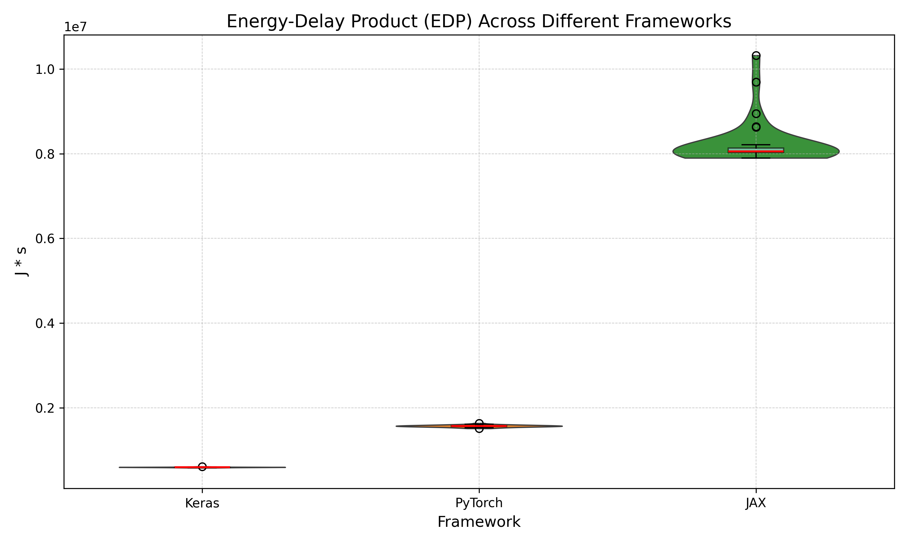

## Introduction

As machine learning (ML) models become more complex and operate on a larger scale,
their computational demands have increased, leading to increased
energy consumption. Training large-scale deep learning models
can require as much energy as powering multiple households for
weeks, with some studies estimating that training a single deep
learning model can emit as much carbon as five cars over their
lifetime [Strubell et al., 2019](https://aclanthology.org/P19-1355/). Given the rapid expansion of AI applications across industries, optimizing the energy efficiency of ML frameworks is critical for reducing both operational costs and environmental impact.

This report investigates the energy efficiency of three widely
used ML frameworks: Keras, PyTorch, and JAX. Each of these
frameworks offers distinct design philosophies and computational
optimizations which may significantly impact their
energy consumption. While extensive research has been done to compare these frameworks in terms
of training speed and model accuracy, fewer studies have focused on their power
consumption and energy efficiency. Moreover, research has also highlighted inconsistencies in ML implementations
across libraries, showing that even the same conceptually identical ML method can yield different results depending on the library used [Liem & Panichella, 2020](https://arxiv.org/abs/2012.08387).
While such discrepancies affect correctness and reproducibility, another critical but often overlooked aspect is the sustainability of these ML frameworks.
Given the scale at which these ML libraries can be deployed in the real world,
small differences could quickly lead to significant practical differences in energy consumption.

By systematically measuring energy usage for the exact same workload across
different frameworks for multiple iterations,
this study aims to provide insights into how ML engineers can make more
sustainable choices when selecting a ML framework. The results will be valuable
for researchers, developers, and organizations seeking to balance model
performance with environmental responsibility and associated costs.

For this experiment, we aim to compare the energy consumption of Keras (using TensorFlow), PyTorch and JAX when training a Convolutional Neural Network (CNN) for the popular and widely used MNIST dataset of handwritten digits.
We have implemented the exact same CNN architecture for each framework, and then we measure energy usage of each.

## Methodology

### CNN architecture used

The CNN architecture used is shown in the figure below


- **Convolutional Layer (64 filters, 3x3, ReLU, same padding)** – Extracts local features while maintaining spatial dimensions.
- **Pooling Layer (2x2, stride 2)** – Reduces spatial size to retain essential features efficiently.
- **Convolutional Layer (128 filters, 5x5, ReLU, same padding)** – Captures more complex patterns with a larger receptive field.
- **Pooling Layer (2x2, stride 2)** – Further reduces spatial dimensions to improve computational efficiency.
- **Flatten Layer** – Converts multi-dimensional feature maps into a 1D vector for classification.
- **Fully Connected Layer (10 units, softmax activation)** – Produces class probabilities for final classification.

### Hardware and software setup

The experiment was conducted on a computer with the following hardware/software:

- OS: Microsoft Windows 11 Pro (10.0.26100 Build 26100)
- CPU: AMD Ryzen 5 3600 6 cores@3593Mhz, 12 logical cores
- RAM: 16GB
- GPU: NVIDIA RTX 2060 Super
- Python 3.11.8
- Poetry 1.8.3 (dependency management)
- TensorFlow (keras) 2.18.0
- Torch 2.6.0
- Jax 0.5.0
- Other dependencies can be found in the GitHub repository used to carry out the [experiment](https://github.com/flazedd/cs4575-project1)
- [EnergiBridge 0.0.7](https://github.com/tdurieux/EnergiBridge/releases/tag/v0.0.7) is used and the necessary files are already included in the repository

Other important settings which have been changed on the machine under which the experiment runs (Zen mode):

- All applications are closed in task manager, except an Administrator Powershell which executes the experiment
- Notifications are turned off
- A single monitor is connected
- Internet connection is disabled

### Energy Measurement

Energy measurement was performed using the [EnergiBridge](https://github.com/tdurieux/EnergiBridge) tool, which measures CPU energy consumption in joules at specific timestamps. By recording these timestamps alongside the CPU energy values, we can compute the average power used during an experiment with the formula:

$$P_{avg} = \frac{E}{\Delta t}$$

Here, $E$ denotes the CPU energy consumed (in joules) over the time span $\Delta t$, which is the difference between the experiment's start and end times (in seconds). Additionally, we use the Energy Delay Product (EDP) metric to penalize slower executions by emphasizing runtime. In our case, the EDP is defined as:

$$EDP = E \times \Delta t$$

The unit for EDP is $J\cdot s$.

### Dataset

The [MNIST dataset](https://www.kaggle.com/datasets/hojjatk/mnist-dataset) was used for training and
evaluating the CNN described earlier.

 <!-- It has to be mentioned that the datatype transformation 
 pipeline differs per framework, in our implementations the execution flow is as follows:

- Keras: PyTorch tensor -> NumPy array
- JAX: PyTorch tensor -> NumPy array -> JAX array
- PyTorch: PyTorch tensor -->

<!-- We assume that the energy usage in the actual training of the CNN is far more significant than the energy usage in the datatype transformation, and thus consider this a negligible difference for the energy measurement results. However, for larger datasets a similar datatype transformation pipeline has to be used to ensure the reliability of the experiments. -->

### Evaluation

The task of each framework consists of training the CNN for 3 epochs and then evaluating the accuracy.
Before starting the energy measurement of this task, the CPU is warmed up for 5 minutes by doing calculations to prevent cold starts which affect energy consumption.
Then, a sequence of timestamped power measurements are taken for each framework during their execution, in which they complete 3 epochs of training and evaluation of their accuracy.
After the execution of a framework, an idle time of 1 minute is introduced instead of
directly measuring the next framework to prevent tail energy usage from influencing the energy usage of the next framework to be evaluated.
This will be done for a total of 35 iterations, each iteration the order of frameworks evaluated
is shuffled randomly to mitigate any potential order bias.
This results in 35 .csv files generated by EnergiBridge which contain
the energy measurements for each framework which will be used for further analysis.

## Results

### Time

The violin plot below shows for each framework the distribution of the obtained execution times in seconds.
We see that TensorFlow (Keras) has the fastest execution time on average followed by PyTorch and JAX since
the distributions do not overlap. We can also observe that Keras and PyTorch have similar distribution shapes,
while JAX has a wider distribution indicating more variability in its runtimes. Also, JAX is roughly 3 times as slow on average than PyTorch.


### Energy

The violin plot below shows the distribution of the energy consumed by the different frameworks.
We observe that Keras has the lowest energy consumption and the smallest width in distribution, closely followed by PyTorch and then JAX.
This indicates that Keras is the most efficient framework and has the least variability
in the energy consumed which makes it the most consistent of these three.


### Power

The violin plot below shows the distribution of the average power used by each framework over the span of its
execution time. On average, Keras has the highest power consumption, followed by PyTorch and then JAX.
Also, Keras has to largest distribution width, followed by PyTorch and then JAX.


### Energy-Delay Product
The EDP punishes implementations which have low average power, but which take long to complete by squaring the time taken to complete. 
JAX has both of these properties as seen in previous plots. Therfore it should be no surprise that JAX scores
worst on the EDP metric. Keras performs best, followed by PyTorch.



To summarize, TensorFlow (Keras) has the overall lowest execution time and least amount of energy consumed.
Then PyTorch follows on both metrics and JAX comes in last place on both metrics.
For average power, JAX performed best, followed by PyTorch and then Keras.
Keras scored best on the EDP metrics, followed by PyTorch and then JAX.

<!-- Show some violin box plots for each framework here...
Some p-values etc.
Is the data observed normal? shapiro wilk test
Effect size analysis -->

## Analysis

### Statistical significance

This section answers the question if the differences in performance are statistically significant.
First, we assess the distribution of the data using the Shapiro-Wilk test, which tests for normality:

| Metric     | Keras  | PyTorch | JAX    |
| ---------- | ------ | ------- | ------ |
| **Time**   | 0.0000 | 0.0000  | 0.0045 |
| **Energy** | 0.0000 | 0.0000  | 0.0066 |
| **Power**  | 0.0000 | 0.0001  | 0.0003 |
| **EDP**    | 0.0000 | 0.0000  | 0.0051 |

Each cell is the p-value of the Shapiro-Wilk test for certain combination of metric and framework.
Since all p-values are significantly below 0.05, we need to reject the hypothesis that this data follows a normal distribution.
Therefore, the Mann-Whitney U test will be used to compare the distributions.

The table below presents the p-values for the respective statistical tests comparing the distributions of each framework across time, energy, and power metrics.

| Metric | Keras vs PyTorch | Keras vs JAX | PyTorch vs JAX |
| ------ | ---------------- | ------------ | -------------- |
| Time   | 1.43e-14         | 1.10e-13     | 1.09e-13       |
| Energy | 1.44e-14         | 1.10e-13     | 1.10e-13       |
| Power  | 3.90e-05         | 1.10e-13     | 1.10e-13       |
| EDP    | 1.44e-14         | 1.10e-13     | 1.10e-13       |

As can be observed, each p-value is significantly below 0.05,
confirming that the observed differences between frameworks in time, energy, power consumption
and EPD are statistically significant.

### Practical significance

Machine learning applications benefit from a vast amount of data processing and many training iterations, this process is notorious for consuming large amounts of energy. For example, it is estimated that it took about 10 gigawatt-hour (GWh) of energy consumption to train ChatGPT-3, which is equivalent to the yearly electricity consumption of a 1000 U.S. households according to the [University of Washington](https://www.washington.edu/news/2023/07/27/how-much-energy-does-chatgpt-use/). ChatGPT-3 received hundreds of millions of queries per day which used up around 1 GWh which equals the daily energy consumption of about 33,000 US households. Therefore, any slight difference in energy consumption of ML frameworks can already have a huge impact.

The tables below show the percentage increase for the different metrics time,
energy, power and EPD. This highlights the significant relative differences between
frameworks. For example, in table 1 it can be seen that PyTorch needs about 47.11% more
time to complete the same task and consumes 41.07% more energy. If we apply this to
a large machine learing task like the ChatGPT-3 example, it would mean that you
could either choose to use PyTorch
or you could choose to use Keras and give about 410 US households free
electricity for a year. This highlights how big of a difference the choice in ML framework
can make.

### Table 1: Keras vs. Torch

| Metric     | Keras (Median) | Torch (Median) | Percentage Increase/Decrease |
|------------|---------------|---------------|----------------------------|
| **Time**   | 34.8795 s     | 51.2845 s     | **+47.03%**                |
| **Energy** | 2244.1858 J   | 3165.7848 J   | **+41.07%**                |
| **Power**  | 64.1953 W     | 61.6155 W     | **-4.02%**                 |
| **EDP**    | 78221.6761 J⋅s | 161881.9898   | **+106.95%**               |

---

### Table 2: Torch vs. JAX

| Metric     | Torch (Median) | JAX (Median)  | Percentage Increase/Decrease |
|------------|---------------|--------------|----------------------------|
| **Time**   | 51.2845 s     | 188.3840 s   | **+267.33%**               |
| **Energy** | 3165.7848 J   | 10605.8137 J | **+235.01%**               |
| **Power**  | 61.6155 W     | 56.2227 W    | **-8.75%**                 |
| **EDP**    | 161881.9898 J⋅s | 1976934.6552 | **+1121.22%**              |


---

### Table 3: Keras vs. JAX

| Metric     | Keras (Median) | JAX (Median)  | Percentage Increase/Decrease |
|------------|---------------|--------------|----------------------------|
| **Time**   | 34.8795 s     | 188.3840 s   | **+440.1%**               |
| **Energy** | 2244.1858 J   | 10605.8137 J | **+372.59%**               |
| **Power**  | 64.1953 W     | 56.2227 W    | **-12.42%**                |
| **EDP**    | 78221.6761 J⋅s | 1976934.6552 | **+2427.35%**              |


## Discussion

It should come as no surprise that TensorFlow (Keras) is the most efficient framework, since its design philosophy is to prioritize performance and scalability for large-scale models. As shown in [Table 1](#table-1-keras-vs-torch), Keras completes the task in 34.8795 seconds, whereas PyTorch takes 51.2845 seconds, a **47.03% increase** in execution time. Similarly, energy consumption for PyTorch is 3165.7848 J, which is **41.07% higher** than Keras. The power consumption difference is marginal at **-4.02%**, indicating that the increased energy usage is primarily due to the longer execution time rather than significantly higher power draw.

PyTorch is more geared towards small-scale models and prioritizes simplicity and adaptability according to [Simplilearn]. This aligns with the results in [Table 2](#table-2-torch-vs-jax), where PyTorch outperforms JAX in both time and energy consumption. PyTorch completes the task in 51.2845 seconds, while JAX takes 188.3840 seconds, marking a **267.33% increase**. The energy consumption follows a similar pattern, with JAX consuming 10605.8137 J, a **235.01% increase** compared to PyTorch.

The JAX framework coming in last might be because experiments were executed on the CPU, and a key
feature of JAX is that it uses Accelerated Linear Algebra (XLA) and just-in-time (JIT) compilation to
achieve better performance on GPUs and TPUs according to their [Github]. This is further emphasized in
[Table 3](#table-3-keras-vs-jax), where JAX performs significantly worse than Keras.
JAX takes 188.3840 seconds, which is **440.1% longer** than Keras, and consumes 10605.8137 J,
a **372.59% increase** in energy consumption. However, the JAX framework might not have come to full
fruition in this experiment since only CPU performance is considered here.

[Simplilearn]: https://www.simplilearn.com/keras-vs-tensorflow-vs-pytorch-article
[Github]: https://github.com/jax-ml/

## Limitations & future work

We set a seed for each ML framework so that it performs the same
computations across iterations which reduces variability.
A limitation is that we couldn't get the frameworks to all start at the same point
so that they would produce the same exact weights and accuracy and so on.
Still, this should not affect the energy measurements since all frameworks
have gone through the same amount of epochs of training.
For future work, different versions of the same framework could be
used to examine energy efficiency differences between versions. This is relevant
because when you select a ML framework to work with, you also have to select some
version to use. For a future experiment, it would be interesting to see if the same results can be achieved
if all frameworks are forced to run on a GPU instead of a CPU since this would put the GPU optimizations of the frameworks
to the test.

## Conclusion

In this report, we conducted an experiment to assess the energy efficiency of the popular ML
frameworks TensorFlow (Keras), PyTorch, and JAX. We found that TensorFlow (Keras) had the fastest
execution time and consumed the least amount of energy when tasked with training a convolutional
neural network for 1 epoch and evaluating its accuracy. The second fastest and most energy-efficient
framework was PyTorch, but it already took 47.03% more time and consumed 41.07% more energy compared
to TensorFlow (Keras). The JAX framework performed worst, taking 267.33% more time and consuming
235.01% more energy compared to the PyTorch framework (which already came in second).
Given the large scale at which ML frameworks are usually deployed, these relative differences
in energy consumption can lead to monumental differences in practice.

## Appendix - Raw data

```
 Results for keras

Computed Metrics:
Time metrics:
   - Shapiro Wilk P-Value: 0.0000
   - Mean: 36.2505
   - Median: 34.8795
   - Variance: 4.5214
   - Standard Deviation: 2.1264
   - Minimum Value: 34.4310
   - Maximum Value: 39.6740
Energy metrics:
   - Shapiro Wilk P-Value: 0.0000
   - Mean: 2280.8008
   - Median: 2244.1858
   - Variance: 3447.2364
   - Standard Deviation: 58.7132
   - Minimum Value: 2228.1145
   - Maximum Value: 2391.7502
Power metrics:
   - Shapiro Wilk P-Value: 0.0000
   - Mean: 63.0329
   - Median: 64.1953
   - Variance: 4.1178
   - Standard Deviation: 2.0292
   - Minimum Value: 59.5871
   - Maximum Value: 65.0524
EDP metrics:
   - Shapiro Wilk P-Value: 0.0000
   - Mean: 82800.4633
   - Median: 78221.6761
   - Variance: 49644450.0919
   - Standard Deviation: 7045.8818
   - Minimum Value: 76818.9476
   - Maximum Value: 94890.2980

 Results for torch

Computed Metrics:
Time metrics:
   - Shapiro Wilk P-Value: 0.0000
   - Mean: 53.0967
   - Median: 51.2845
   - Variance: 10.7275
   - Standard Deviation: 3.2753
   - Minimum Value: 50.2790
   - Maximum Value: 59.4990
Energy metrics:
   - Shapiro Wilk P-Value: 0.0000
   - Mean: 3243.1234
   - Median: 3165.7848
   - Variance: 19852.0582
   - Standard Deviation: 140.8973
   - Minimum Value: 3113.2096
   - Maximum Value: 3523.2371
Power metrics:
   - Shapiro Wilk P-Value: 0.0001
   - Mean: 61.1454
   - Median: 61.6155
   - Variance: 1.3523
   - Standard Deviation: 1.1629
   - Minimum Value: 58.9696
   - Maximum Value: 62.9612
EDP metrics:
   - Shapiro Wilk P-Value: 0.0000
   - Mean: 172644.3010
   - Median: 161881.9898
   - Variance: 341157133.9347
   - Standard Deviation: 18470.4395
   - Minimum Value: 157161.0491
   - Maximum Value: 209212.5008

 Results for jax

Computed Metrics:
Time metrics:
   - Shapiro Wilk P-Value: 0.0045
   - Mean: 189.3094
   - Median: 188.3840
   - Variance: 24.6799
   - Standard Deviation: 4.9679
   - Minimum Value: 182.8080
   - Maximum Value: 198.9250
Energy metrics:
   - Shapiro Wilk P-Value: 0.0066
   - Mean: 10646.4496
   - Median: 10605.8137
   - Variance: 100134.6492
   - Standard Deviation: 316.4406
   - Minimum Value: 10213.5692
   - Maximum Value: 11224.4220
Power metrics:
   - Shapiro Wilk P-Value: 0.0003
   - Mean: 56.2342
   - Median: 56.2227
   - Variance: 0.1376
   - Standard Deviation: 0.3709
   - Minimum Value: 55.7063
   - Maximum Value: 57.6958
EDP metrics:
   - Shapiro Wilk P-Value: 0.0051
   - Mean: 2016970.2339
   - Median: 1976934.6552
   - Variance: 12721490671.5248
   - Standard Deviation: 112789.5858
   - Minimum Value: 1867122.1636
   - Maximum Value: 2232818.1397
Comparison between libraries keras and torch
Statistical comparsion for Time
    Test Used: Mann-Whitney U Test
    t-test p-value: 1.431043465585207e-14
    Mean difference: -16.84615
    Median difference: -16.404999999999994
Statistical comparsion for Power
    Test Used: Mann-Whitney U Test
    t-test p-value: 3.895012892950288e-05
    Mean difference: 1.8874427142707404
    Median difference: 2.579774947563898
Statistical comparsion for Energy
    Test Used: Mann-Whitney U Test
    t-test p-value: 1.435085306393668e-14
    Mean difference: -962.3226577758796
    Median difference: -921.5989837646484
Statistical comparsion for EDP
    Test Used: Mann-Whitney U Test
    t-test p-value: 1.435085306393668e-14
    Mean difference: -89843.83762622911
    Median difference: -83660.31374945049
---
Comparison between libraries keras and jax
Statistical comparsion for Time
    Test Used: Mann-Whitney U Test
    t-test p-value: 1.0965760742430788e-13
    Mean difference: -153.0588214285714
    Median difference: -153.50449999999998
Statistical comparsion for Power
    Test Used: Mann-Whitney U Test
    t-test p-value: 1.0974523199407617e-13
    Mean difference: 6.798626303680386
    Median difference: 7.9726290566429725
Statistical comparsion for Energy
    Test Used: Mann-Whitney U Test
    t-test p-value: 1.0974523199407617e-13
    Mean difference: -8365.648763765606
    Median difference: -8361.627891540527
Statistical comparsion for EDP
    Test Used: Mann-Whitney U Test
    t-test p-value: 1.0974523199407617e-13
    Mean difference: -1934169.770596946
    Median difference: -1898712.9790588988
---
Comparison between libraries torch and jax
Statistical comparsion for Time
    Test Used: Mann-Whitney U Test
    t-test p-value: 1.0948255331253563e-13
    Mean difference: -136.2126714285714
    Median difference: -137.09949999999998
Statistical comparsion for Power
    Test Used: Mann-Whitney U Test
    t-test p-value: 1.0974523199407617e-13
    Mean difference: 4.911183589409646
    Median difference: 5.3928541090790745
Statistical comparsion for Energy
    Test Used: Mann-Whitney U Test
    t-test p-value: 1.0974523199407617e-13
    Mean difference: -7403.326105989727
    Median difference: -7440.028907775879
Statistical comparsion for EDP
    Test Used: Mann-Whitney U Test
    t-test p-value: 1.0974523199407617e-13
    Mean difference: -1844325.9329707169
    Median difference: -1815052.6653094483
---
```
