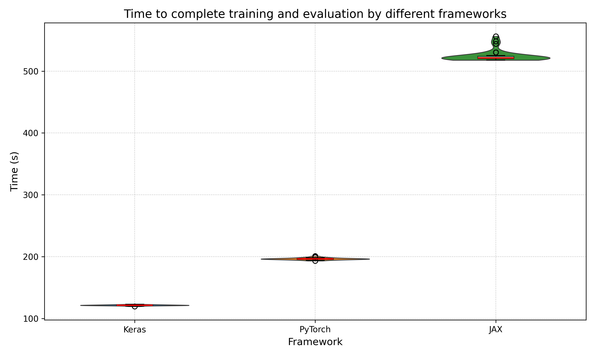
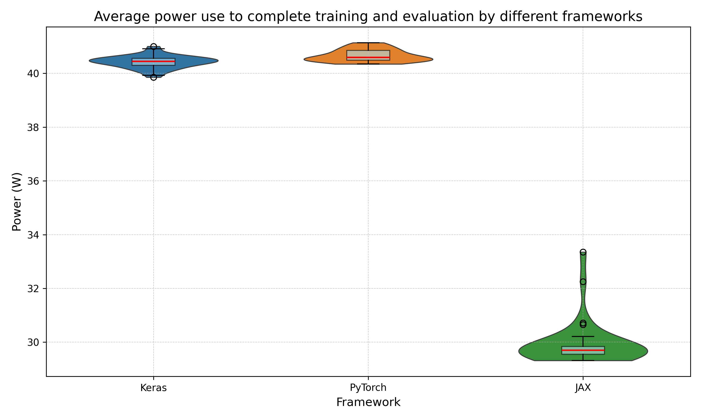

## Introduction

As machine learning (ML) models become more complex and operate on a larger scale,
their computational demands have increased, leading to increased
energy consumption. Training large-scale deep learning models
can require as much energy as powering multiple households for
weeks, with some studies estimating that training a single deep
learning model can emit as much carbon as five cars over their
lifetime [Strubell et al., 2019](https://aclanthology.org/P19-1355/). Given the rapid expansion of AI applications across industries, optimizing the energy efficiency of ML frameworks is critical for reducing both operational costs and environmental impact.

This report investigates the energy efficiency of three widely
used ML frameworks: Keras, PyTorch, and JAX. Each of these
frameworks offers distinct design philosophies and computational
optimizations which may significantly impact their
energy consumption. While extensive research has been done to compare these frameworks in terms
of training speed and model accuracy, fewer studies have focused on their power
consumption and energy efficiency. Moreover, research has also highlighted inconsistencies in ML implementations
across libraries, showing that even the same conceptually identical ML method can yield different results depending on the library used [Liem & Panichella, 2020](https://arxiv.org/abs/2012.08387).
While such discrepancies affect correctness and reproducibility, another critical but often overlooked aspect is the sustainability of these ML frameworks.
Given the scale at which these ML libraries can be deployed in the real world,
small differences could quickly lead to significant practical differences in energy consumption.

By systematically measuring energy usage for the exact same workload across
different frameworks for multiple iterations,
this study aims to provide insights into how ML engineers can make more
sustainable choices when selecting a ML framework. The results will be valuable
for researchers, developers, and organizations seeking to balance model
performance with environmental responsibility and associated costs.

For this experiment, we aim to compare the energy consumption of Keras (using TensorFlow), PyTorch and JAX when training a Convolutional Neural Network (CNN) for the popular and widely used MNIST dataset of handwritten digits.
We have implemented the exact same CNN architecture for each framework, and then we measure energy usage of each.

## Methodology

### CNN architecture used

The CNN architecture used is shown in the figure below


- **Convolutional Layer (64 filters, 3x3, ReLU, same padding)** – Extracts local features while maintaining spatial dimensions.
- **Pooling Layer (2x2, stride 2)** – Reduces spatial size to retain essential features efficiently.
- **Convolutional Layer (128 filters, 5x5, ReLU, same padding)** – Captures more complex patterns with a larger receptive field.
- **Pooling Layer (2x2, stride 2)** – Further reduces spatial dimensions to improve computational efficiency.
- **Flatten Layer** – Converts multi-dimensional feature maps into a 1D vector for classification.
- **Fully Connected Layer (10 units, softmax activation)** – Produces class probabilities for final classification.

### Hardware and software setup

The experiment was conducted on a computer with the following hardware/software:

- OS: Microsoft Windows 11 Pro (10.0.26100 Build 26100)
- CPU: AMD Ryzen 5 3600 6 cores@3593Mhz, 12 logical cores
- RAM: 16GB
- GPU: NVIDIA RTX 2060 Super
- Python 3.11.8
- Poetry 1.8.3 (dependency management)
- TensorFlow (keras) 2.18.0
- Torch 2.6.0
- Jax 0.5.0
- Other dependencies can be found in the GitHub repository used to carry out the [experiment](https://github.com/flazedd/cs4575-project1)
- [EnergiBridge 0.0.7](https://github.com/tdurieux/EnergiBridge/releases/tag/v0.0.7) is used and the necessary files are already included in the repository

Other important settings which have been changed on the machine under which the experiment runs (Zen mode):

- All applications are closed in task manager, except an Administrator Powershell which executes the experiment
- Notifications are turned off
- A single monitor is connected
- Internet connection is disabled

### Energy measurement

Energy measurement was done by using the tool [EnergiBridge](https://github.com/tdurieux/EnergiBridge), which is able to measure the CPU energy used in joules at a specific timestamp. Using the timestamps and the CPU energy, we can calculate the average power used during an experiment, we use the following formula: $P_{avg} = \frac{E}{\Delta t}$, where $E$ is the CPU energy (in Joules) used in the timespan $\Delta t$, which is the difference between the beginning and the end time of the experiment in seconds.

### Dataset

The [MNIST dataset](https://www.kaggle.com/datasets/hojjatk/mnist-dataset) was used for training and evaluating the CNN described earlier. It has to be mentioned that the datatype transformation pipeline differs per framework, in our implementations the execution flow is as follows:

- Keras: PyTorch tensor -> NumPy array
- JAX: PyTorch tensor -> NumPy array -> JAX array
- PyTorch: PyTorch tensor

We assume that the energy usage in the actual training of the CNN is far more significant than the energy usage in the datatype transformation, and thus consider this a negligible difference for the energy measurement results. However, for larger datasets a similar datatype transformation pipeline has to be used to ensure the reliability of the experiments.

### Evaluation

The task of each framework consists of training the CNN for 3 epochs and then evaluating the accuracy.
Before starting the energy measurement of this task, the CPU is warmed up for 5 minutes by doing calculations to prevent cold starts which affect energy consumption.
Then, a sequence of timestamped power measurements are taken for each framework during their execution, in which they complete 3 epochs of training and evaluation of their accuracy.
After the execution of a framework, an idle time of 1 minute is introduced instead of
directly measuring the next framework to prevent tail energy usage from influencing the energy usage of the next framework to be evaluated.
This will be done for a total of 35 iterations, each iteration the order of frameworks evaluated
is shuffled randomly to mitigate any potential order bias.
This results in 35 .csv files generated by EnergiBridge which contain
the energy measurements for each framework which will be used for further analysis.

## Results

### Time

The violin plot below shows for each framework the distribution of the obtained execution times in seconds. We see that TensorFlow (Keras) has the fastest execution time on average followed by PyTorch and JAX since the distributions do not overlap. We can also observe that Keras and JAX have similar widths of their distribution, while PyTorch has a wider distribution indicating more variability in its runtimes.



### Energy

The violin plot below shows the distribution of the energy consumed by the different frameworks. We observe that Keras has the lowest energy consumption and the smallest width in distribution compared to PyTorch and and JAX. This indicates that Keras is the most efficient framework and has the least variability in the energy consumed.


### Power

The violin plot below shows the distribution of the average power used by each framework over the span of its execution time. It should come as no surprise that Keras performs best here as well since we previously saw it performed the fastest and using the least energy. Here, it also has the narrowest distribution followed by PyTorch and then JAX.



To summarize, TensorFlow (Keras) has the overall lowest execution time and least amount of energy consumed. Then PyTorch follows on both metrics and JAX comes in last place on both metrics.

<!-- Show some violin box plots for each framework here...
Some p-values etc.
Is the data observed normal? shapiro wilk test
Effect size analysis -->

## Analysis

### Statistical significance

This section answers the question if the differences in performance are statistically significant. First, we assess the distribution of the data using the Shapiro-Wilk test, which tests for normality:

- For the Time data, the Shapiro-Wilk test produced p-values of **0.00148** (Keras), **1.07e-05** (PyTorch), and **1.41e-06** (JAX), all of which are below 0.05. This indicates that the execution times are not normally distributed.
- For the Energy data, the Shapiro-Wilk test yielded p-values of **1.53e-06** (Keras), **1.04e-05** (PyTorch), and **2.67e-06** (JAX), also below 0.05, indicating that the energy consumption data is not normally distributed.
- For the Power data, the Shapiro-Wilk test produced p-values of **0.354** (Keras), **0.881** (PyTorch), and **2.26e-09** (JAX). Since the p-values for Keras and PyTorch are above 0.05, we cannot reject the hypothesis that power data follows a normal distribution, but for JAX, the low p-value suggests it is not normally distributed.

Given these results, we apply different statistical tests:

- For time and energy data, which are not normally distributed, we use the Mann-Whitney U test.
- For power data, since it follows a normal distribution for Keras and PyTorch, we apply the t-test for these comparisons. However, since JAX's power data is not normally distributed, we use the Mann-Whitney U test when comparing it with other frameworks.

The table below presents the p-values for the respective statistical tests comparing the distributions of each framework across time, energy, and power metrics.

| Metric | Keras vs PyTorch | Keras vs JAX | PyTorch vs JAX |
| ------ | ---------------- | ------------ | -------------- |
| Time   | 3.11e-13         | 3.11e-13     | 1.42e-13       |
| Energy | 3.11e-13         | 3.11e-13     | 1.54e-13       |
| Power  | 8.09e-21         | 5.38e-12     | 1.68e-04       |

As can be observed, each p-value is significantly below 0.05, confirming that the observed differences between frameworks in time, energy, and power consumption are statistically significant.

### Practical significance

Machine learning applications benefit from a vast amount of data processing and many training iterations, this process is notorious for consuming large amounts of energy. For example, it is estimated that it took about 10 gigawatt-hour (GWh) of energy consumption to train ChatGPT-3, which is equivalent to the yearly electricity consumption of a 1000 U.S. households according to the [University of Washington](https://www.washington.edu/news/2023/07/27/how-much-energy-does-chatgpt-use/). ChatGPT-3 received hundreds of millions of queries per day which used up around 1 GWh which equals the daily energy consumption of about 33,000 US households. Therefore, any slight difference in energy consumption of ML frameworks can already have a huge impact.

The tables below show the percentage increase for the different metrics time, energy and power. This highlights the significant relative differences between frameworks. For example, in table 1 it can be seen that PyTorch needs about 20% more time to complete the same task and consumes 22.34% more energy. If we apply this to the ChatGPT-3 example it would mean that you could either choose to use PyTorch or you could choose to use Keras and give 223 US households a year of free electricity. This highlights how big of a difference the choice in ML framework can make.

### Table 1: Keras vs. Torch

| Metric     | Keras (Median) | Torch (Median) | Percentage Increase/Decrease |
| ---------- | -------------- | -------------- | ---------------------------- |
| **Time**   | 122.4320 s     | 146.8430 s     | **+20.00%**                  |
| **Energy** | 6835.5719 J    | 8372.7679 J    | **+22.34%**                  |
| **Power**  | 55.6824 W      | 57.0860 W      | **+2.54%**                   |

---

### Table 2: Torch vs. JAX

| Metric     | Torch (Median) | JAX (Median) | Percentage Increase/Decrease |
| ---------- | -------------- | ------------ | ---------------------------- |
| **Time**   | 146.8430 s     | 169.0740 s   | **+15.14%**                  |
| **Energy** | 8372.7679 J    | 9733.5067 J  | **+16.26%**                  |
| **Power**  | 57.0860 W      | 57.6347 W    | **+0.96%**                   |

---

### Table 3: Keras vs. JAX

| Metric     | Keras (Median) | JAX (Median) | Percentage Increase/Decrease |
| ---------- | -------------- | ------------ | ---------------------------- |
| **Time**   | 122.4320 s     | 169.0740 s   | **+38.06%**                  |
| **Energy** | 6835.5719 J    | 9733.5067 J  | **+42.37%**                  |
| **Power**  | 55.6824 W      | 57.6347 W    | **+3.51%**                   |

## Discussion

It should come as no surprise that TensorFlow (Keras) is the most efficient framework, since its design philosophy
is to prioritize performance and scalability for large-scale models. As shown in [Table 1](#table-1-keras-vs-torch),
Keras completes the task in 122.432 seconds, whereas PyTorch takes 146.843 seconds, a **20% increase** in execution time.
Similarly, energy consumption for PyTorch is 8372.7679 J, which is **22.34% higher** than Keras. The power consumption difference is marginal at **2.54%**, indicating that the increased
energy usage is primarily due to the longer execution time rather than significantly higher power draw.

PyTorch is more geared towards small-scale models and prioritizes simplicity and adaptability [^1].
This aligns with the results in [Table 2](#table-2-torch-vs-jax), where PyTorch outperforms JAX in both time and energy consumption.
PyTorch completes the task in 146.843 seconds, while JAX takes 169.074 seconds, marking a **15.14% increase**.
The energy consumption follows a similar pattern, with JAX consuming 9733.5067 J, a **16.26% increase** compared to PyTorch.

The JAX framework coming in last might be because experiments were executed on the CPU, and a key feature of JAX is that it uses Accelerated Linear Algebra (XLA) and just-in-time (JIT) compilation to achieve better performance on GPUs and TPUs [^2].
This is further emphasized in [Table 3](#table-3-keras-vs-jax), where JAX performs significantly worse than Keras. JAX takes 169.074 seconds, which is **38.06% longer** than Keras, and consumes 9733.5067 J, a **42.37% increase** in energy consumption.
However, the JAX framework might not have come to full fruition in this experiment since only CPU performance is considered here.

[^1]: https://www.simplilearn.com/keras-vs-tensorflow-vs-pytorch-article
[^2]: https://github.com/jax-ml/jax

## Limitations & future work

We set a seed for each ML framework so that it performs the same
computations across iterations which reduces variability.
A limitation is that we couldn't get the frameworks to all start at the same point
so that they would produce the same exact weights and accuracy and so on.
Still, this should not affect the energy measurements since all frameworks
have gone through the same amount of epochs of training.
For future work, different versions of the same framework could be
used to examine energy efficiency differences between versions. This is relevant
because when you select a ML framework to work with, you also have to select some
version to use. For a future experiment, it would be interesting to see if the same results can be achieved
if all frameworks are forced to run on a GPU instead of a CPU since this would put the GPU optimizations of the frameworks
to the test.

## Conclusion

In this report, we conducted an experiment to assess the energy efficiency of the popular ML
frameworks TensorFlow (keras), PyTorch and JAX. We found that TensorFlow (keras) had the fastest execution time
and consumed the least amount of energy when tasked with training a convolutional neural network
for 3 epochs and evaluating its accuracy. The next fastest and most energy efficient framework was PyTorch, but it already
took 20% more time and consumed 22.34% more energy compared to TensorFlow (keras). The JAX framework performed worst,
it took 15.14% more time and consumed 16.26% more energy compared to the PyTorch framework (which already came in second).
Given the large scale at which ML frameworks are usually deployed, these relative differences in energy consumption can
lead to monumental differences in practice.

## Appendix - Raw data

```
Results for keras
    Computed Metrics:
        Time metrics:
           - Shapiro Wilk P-Value: 0.0014803026570007205
           - Mean: 123.002
           - Median: 122.432
           - Variance: 1.788742176470587
           - Standard Deviation: 1.3374386626947
           - Minimum Value: 120.963
           - Maximum Value: 127.216
        Energy metrics:
           - Shapiro Wilk P-Value: 1.5384083553726668e-06
           - Mean: 6845.649355207171
           - Median: 6835.5718994140625
           - Variance: 3710.765857599451
           - Standard Deviation: 60.916055827667066
           - Minimum Value: 6775.3468170166
           - Maximum Value: 7123.433639526367
        Power metrics:
           - Shapiro Wilk P-Value: 0.3542410135269165
           - Mean: 55.65677862440097
           - Median: 55.68238838296795
           - Variance: 0.10700652647108559
           - Standard Deviation: 0.3271185205259488
           - Minimum Value: 55.0263478861252
           - Maximum Value: 56.31315321942131
        EDP metrics:
           - Shapiro Wilk P-Value: 2.8950482374057174e-05
           - Mean: 842095.0584529366
           - Median: 836058.799017334
           - Variance: 259804798.2829092
           - Standard Deviation: 16118.461411775916
           - Minimum Value: 823976.7254043274
           - Maximum Value: 906214.7338859863

Results for torch
    Computed Metrics:
        Time metrics:
           - Shapiro Wilk P-Value: 1.067574521584902e-05
           - Mean: 148.58786486486488
           - Median: 146.843
           - Variance: 12.362340897897887
           - Standard Deviation: 3.5160120730591764
           - Minimum Value: 145.029
           - Maximum Value: 157.444
        Energy metrics:
           - Shapiro Wilk P-Value: 1.0490580280020367e-05
           - Mean: 8474.958240405933
           - Median: 8372.767913818361
           - Variance: 57020.00269249967
           - Standard Deviation: 238.78861508141395
           - Minimum Value: 8203.943466186527
           - Maximum Value: 9077.440338134766
        Power metrics:
           - Shapiro Wilk P-Value: 0.881283164024353
           - Mean: 57.03249311925684
           - Median: 57.08597323577703
           - Variance: 0.2483396088482403
           - Standard Deviation: 0.49833684275622275
           - Minimum Value: 55.64636414696145
           - Maximum Value: 58.08655018725248
        EDP metrics:
           - Shapiro Wilk P-Value: 7.465992553079559e-07
           - Mean: 1260058.7796568878
           - Median: 1225637.7454837947
           - Variance: 4306742280.254107
           - Standard Deviation: 65625.77451165134
           - Minimum Value: 1208924.9736053469
           - Maximum Value: 1429188.5165972898

Results for jaxx
    Computed Metrics:
        Time metrics:
           - Shapiro Wilk P-Value: 1.4070428733248264e-06
           - Mean: 169.12454054054055
           - Median: 169.074
           - Variance: 2.4534184774774763
           - Standard Deviation: 1.5663391961760633
           - Minimum Value: 166.871
           - Maximum Value: 176.49
        Energy metrics:
           - Shapiro Wilk P-Value: 2.6666066332836635e-06
           - Mean: 9705.295853898331
           - Median: 9733.506744384766
           - Variance: 22396.322025863778
           - Standard Deviation: 149.65400771734707
           - Minimum Value: 9015.234390258789
           - Maximum Value: 9889.344192504883
        Power metrics:
           - Shapiro Wilk P-Value: 2.2558599432898063e-09
           - Mean: 57.39366244169991
           - Median: 57.63466348940825
           - Variance: 1.4035393622125207
           - Standard Deviation: 1.1847106660330702
           - Minimum Value: 51.08070933343979
           - Maximum Value: 58.527327191178756
        EDP metrics:
           - Shapiro Wilk P-Value: 0.9578214883804321
           - Mean: 1641298.258073566
           - Median: 1639171.4396193086
           - Variance: 530707755.768724
           - Standard Deviation: 23037.09521117461
           - Minimum Value: 1591098.7175367738
           - Maximum Value: 1692066.7913375853

Comparison between libraries keras and torch
    Statistical comparsion for Time
        Test Used: Mann-Whitney U Test
        t-test p-value: 3.109392573549192e-13
        Mean difference: -25.585864864864888
        Median difference: -24.410999999999987
    Statistical comparsion for Power
        Test Used: Independent T-test
        t-test p-value: 8.094416047488892e-21
        Mean difference: -1.3757144948558704
        Median difference: -1.4035848528090824
    Statistical comparsion for Energy
        Test Used: Mann-Whitney U Test
        t-test p-value: 3.110745274579672e-13
        Mean difference: -1629.3088851987623
        Median difference: -1537.1960144042987
    Statistical comparsion for EDP
        Test Used: Mann-Whitney U Test
        t-test p-value: 3.110745274579672e-13
        Mean difference: -417963.72120395117
        Median difference: -389578.9464664607
---
Comparison between libraries keras and jaxx
    Statistical comparsion for Time
        Test Used: Mann-Whitney U Test
        t-test p-value: 3.105337740391047e-13
        Mean difference: -46.122540540540555
        Median difference: -46.64200000000001
    Statistical comparsion for Power
        Test Used: Mann-Whitney U Test
        t-test p-value: 5.379590301036822e-12
        Mean difference: -1.7368838172989385
        Median difference: -1.9522751064402968
    Statistical comparsion for Energy
        Test Used: Mann-Whitney U Test
        t-test p-value: 3.110745274579672e-13
        Mean difference: -2859.6464986911606
        Median difference: -2897.934844970703
    Statistical comparsion for EDP
        Test Used: Mann-Whitney U Test
        t-test p-value: 3.110745274579672e-13
        Mean difference: -799203.1996206294
        Median difference: -803112.6406019746
---
Comparison between libraries torch and jaxx
    Statistical comparsion for Time
        Test Used: Mann-Whitney U Test
        t-test p-value: 1.4154840872576973e-13
        Mean difference: -20.536675675675667
        Median difference: -22.231000000000023
    Statistical comparsion for Power
        Test Used: Mann-Whitney U Test
        t-test p-value: 0.00016845076564589394
        Mean difference: -0.3611693224430681
        Median difference: -0.5486902536312144
    Statistical comparsion for Energy
        Test Used: Mann-Whitney U Test
        t-test p-value: 1.5385322563477485e-13
        Mean difference: -1230.3376134923983
        Median difference: -1360.7388305664044
    Statistical comparsion for EDP
        Test Used: Mann-Whitney U Test
        t-test p-value: 1.4184035096127283e-13
        Mean difference: -381239.47841667826
        Median difference: -413533.69413551386
---
```
