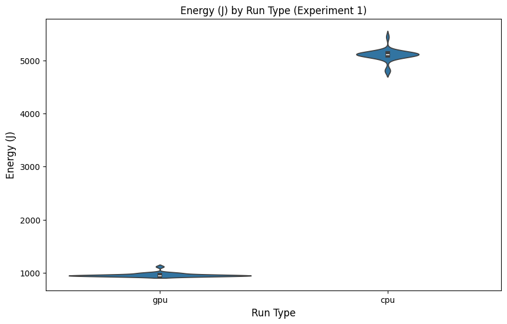

[Project Source GitHub](https://github.com/Matthijs-Vossen/SSE-group3-project1/tree/main) (contains automated scripts for easy replication and a readme explaining how to use them)

# Comparing energy consumption between rendering modes in Blender

*Matthijs Vossen, Melle Koper, Roan Rosema, Scott Jochems*

*In modern digital content creation pipelines, rendering can be a major bottleneck—not only in terms of time but also energy consumption. As sustainability becomes a priority, understanding the energy footprint of different rendering modes in Blender is essential for individuals, studios, and the broader 3D community. In this study, we compare the energy usage of CPU versus GPU rendering on multiple machines using an automated pipeline. We present our experimental setup, discuss our findings, and propose recommendations for more sustainable rendering practices.*

## Introduction
In the world of digital content creation, rendering is a vital process that transforms 3D models into high-quality images or animations. This process is often computationally demanding, requiring substantial processing power and energy consumption. Blender, a widely used open-source 3D rendering tool, offers multiple rendering options, including the Cycles engine. Cycles employs path-based ray tracing to produce photorealistic results, making it a preferred choice for artists and studios alike.

The cycle engine has two different modes: CPU and GPU rendering. While both modes produce identical visual outputs, GPUs typically outperform CPUs in rendering speed due to their specialized architecture. As a result, CPU rendering is usually only selected when a GPU is unavailable. However, GPUs generally consume more power than CPUs, raising the question of whether their faster performance offsets their higher energy demand. Given the growing emphasis on energy-efficient computing, we want to investigate the differences in energy consumption between these two rendering approaches. In this report we aim to answer the following question: *How does energy consumption differ between CPU and GPU rendering in Blender's Cycles engine?*

To investigate this, we designed an experiment that systematically measures and compares the energy usage of CPU and GPU rendering in Blender. By automating data collection and following a structured methodology, we seek to provide valuable insights into the sustainability of rendering workflows.

In this blog, we will present our experimental setup, analyze the results and provide a discussion about our findings. Beyon raw numbers, we'll also explore why why these results matter-shedding light on who is most affected and how small differences in energy consumption can translate into large impacts at scale. Finally, we will offer practical recommendations for optimizing rendering efficiency and reducing energy consumption.

## Background

Energy consumption in software systems has become a critical topic as organizations and individuals become more environmentally conscious. Large production studios, for instance, often maintain render farms running 24/7 to meet project deadlines [^1]. Even a slight improvement in energy efficiency can translate into substantial cost savings and a reduced carbon footprint over thousands of render jobs.

For freelancers and hobbyists, rendering might happen on a single workstation or laptop. While the scale is smaller, energy usage still directly impacts electricity bills, thermal management, and hardware longevity. In addition, many cloud providers now offer GPU-based rendering services (e.g., AWS Deadline Cloud) [^2]; understanding the comparative energy draw of CPU vs. GPU modes can inform both pricing models and user choices.

Why Blender?
- Popularity and Accessibility: As an open-source tool with a massive community, Blender is often a go-to for 3D enthusiasts and professionals.
- Flexibility: Blender’s support for both CPU and GPU rendering (not to mention various third-party render engines) provides a solid testing ground.
- Industry Adoption: From indie projects to big-budget movies, Blender is increasingly used across different production scales.

By focusing on Blender, this study’s findings have relevance for a broad audience—including individual artists, small studios, large production houses, and cloud service providers aiming to optimize sustainability in their pipelines.

## Methodology

### Experimental Setup
To measure the energy consumption of different rendering modes in Blender, we designed an automated experiment that runs Blender rendering tasks using either the CPU or GPU while tracking power usage. The key components of our setup include:

- `Blender`: An open-source 3D graphics software.
- `energibridge`: A power measurement tool that monitors and logs energy consumption.
- `python` automation script: A custom script that manages the execution of experiments, collects data, and ensures reproducibility.

For our experiments, we used a Donut.blend scene [^3].

### Experiment Design
We performed rendering tasks under two different conditions:
- CPU Rendering: Blender renders the scene using only the CPU, the CPU is limeted to 90% of its cores due to issues with energibridge.
- GPU Rendering: Blender renders the scene using the GPU when available.

Each experiment measured:
- Total energy consumption (Joules)
- Rendering duration (seconds)

To ensure reliable results, we ran 30 iterations per mode, alternating CPU and GPU runs randomly to avoid systematic biases due to system state changes.

### Automation Process
The experiment was fully automated using a Python script. The script follows these steps:

1. **Prepare the environment**:
   - Ensure that required directories exist.
   - Initialize a results file.

2. **Run an experiment**:
   - Construct and execute the `energibridge` command to measure energy consumption.
   - Launch Blender in background mode with the specified rendering configuration (CPU or GPU).
   - Capture `energibridge` output and extract energy and duration using regular expressions.
   - Log the results in a CSV file.

3. **Pause between runs**:
   - Introduce a short delay (one minute) between experiments to ensure proper measurement cleanup between runs.

4. **Repeat for all runs**:
   - Run 30 experiments per mode (CPU and GPU), randomly interleaved.

### Data Collection and Processing
The energy measurements and execution times are stored in a CSV file for stastical analysis.

### Hardware setup
To understand the difference between CPU and GPU processing we ran the experiments on 3 different machines. Each machine ran 30 experiments per mode, randomly interleaved. 
|Experiment|Operating System | OS Build | CPU | GPU | RAM |
| ---- | ---- | ----- | ----- | ---- | ---- |
| 1 | Windows 10 | 19045.5487 | Intel Core I7-8750H | Nividia Quadro P1000 | 16 GB |
| 2 | Windows 10 22H2 | 19045.5487 | AMD Ryzen 5 5600X | Nvidia GeForce RTX 3060 | 16 GB |
| 3 | Mac OS | 15.3.1 | M1 chip | M1 chip | 8 GB |

In our experiments, we will reference to these machines in order of this table (experiment 1 corresponds to the machine of the first row in this table etc.).

### Reproducibility
To facilitate replication of our results, we provide:
- The Python script used for automation which can be found [here](https://github.com/Matthijs-Vossen/SSE-group3-project1).
- Python version: 3.9
- Blender version: 4.3
- Configuration details of the environment (Blender version, hardware specifications, etc.).

## Results
In our results, we look at all the experiments that were ran on the 3 different machines. We take a look at the mean and standard deviations and compare the results between CPU and GPU runs. The raw CSV files of our results can be found in the [GitHub](https://github.com/Matthijs-Vossen/SSE-group3-project1/tree/main).

To analyze our results further we used the following statistical tests:
- Shapiro-Wilk test: Checks if a dataset is normally distributed
    - W-statistic: Measures how well the data fits a normal distribution. A value close to 1 means the data has a normal distribution.
    - p-value: If p-value < 0.05, the data is not normal
- Mann-Whitney U test: Compares the distributions of two independent groups
    - U-statistic: Measures how much one group is greater than the other
    - p-value: If p-value < 0.05, the distributions are significantly different
    - Effect size: The probability that a value from one group is larger than a value from the other group

### Statistical analysis - Experiment 1

We have created violin plots for each of the experiments, displaying the power consumption for each run for the three environments.

    
    

    

We have also generated histograms to further show the distribution of the power consumption.

From the distributions of our results for both the GPU and CPU runs, we can see that using a GPU has a significant lower power consumption in comparison to using a CPU.

#### Shapiro-Wilk Test for Normality (Before Outlier Removal)

| Dataset | W-statistic | p-value | Normality |
|---------|-------------|---------|-----------|
| CPU     | 0.6621284486142135 | 8.68e-07 | NOT normally distributed |
| GPU     | 0.5468214049273163 | 2.49e-08 | NOT normally distributed |

Both CPU and GPU data are not normally distributed based on the Shapiro-Wilk test, as the p-values are extremely small (much less than 0.05)

#### After Removing Outliers

| Dataset | Data Count (Before) | Data Count (After) |
|---------|---------------------|---------------------|
| CPU     | 28                  | 24                  |
| GPU     | 29                  | 25                  |

#### Shapiro-Wilk Test for Normality (After Outlier Removal)

| Dataset | W-statistic | p-value | Normality |
|---------|-------------|---------|-----------|
| CPU     | 0.8767462000578112 | 0.0072 | NOT normally distributed |
| GPU     | 0.6178100626072826 | 6.83e-07 | NOT normally distributed |

Even after removing outliers, both datasets still do not follow a normal distribution (p-values still very small).

#### Mean and Standard Deviation

| Statistic    | Value           |
|--------------|-----------------|
| Mean CPU energy (J)    | 5108.39         |
| Mean GPU energy (J)    | 957.90          |
| Mean Difference | -4150.50     |
| Percent Change | -81.25%       |
| Standard deviation CPU | 25.166859005829743 |
| Standard deviation GPU | 17.215238806171357 |

The difference in means is large (-4150.50), with a percent change of -81.25%, indicating that the power consumption of using a CPU is significantly higher than that of a GPU.

#### Mann-Whitney U Test

| Statistic            | Value           |
|----------------------|-----------------|
| U-statistic          | 600.0           |
| p-value              | 2.10e-09        |
| Median CPU energy (J)          | 5106.52         |
| Median GPU energy (J)          | 951.91          |
| Median Difference    | -4154.61        |
| Percentage of Pairs  | 100.0%          |
| Common Language Effect Size | 1.0      |

The Mann-Whitney U test supports the Welch’s t-test results with a very small p-value (2.10e-09), confirming a significant difference between CPU and GPU data. The effect size is 1.0, indicating a very strong difference in the data distributions.

---

### Experiment 2
Below you can find the violin plots and histogram of our second experiment.

    
    

    

Similar to the first experiment, the GPU has a lower power consumption than the CPU.

#### Shapiro-Wilk Test for Normality (Before Outlier Removal)

| Dataset | W-statistic | p-value | Normality |
|---------|-------------|---------|-----------|
| CPU     | 0.7246072118982436 | 3.63e-06 | NOT normally distributed |
| GPU     | 0.6554537915845106 | 3.73e-07 | NOT normally distributed |

- Both CPU and GPU data are not normally distributed (p-values are very small).

#### After Removing Outliers

| Dataset | Data Count (Before) | Data Count (After) |
|---------|---------------------|---------------------|
| CPU     | 30                  | 26                  |
| GPU     | 30                  | 26                  |

#### Shapiro-Wilk Test for Normality (After Outlier Removal)

| Dataset | W-statistic | p-value | Normality |
|---------|-------------|---------|-----------|
| CPU     | 0.6812709697517356 | 2.97e-06 | NOT normally distributed |
| GPU     | 0.6163482172571866 | 4.59e-07 | NOT normally distributed |

The data remains not normally distributed even after outlier removal.

#### Mean and Standard Deviation

| Statistic    | Value           |
|--------------|-----------------|
| Mean CPU energy (J)    | 4023.75         |
| Mean GPU energy (J)    | 408.68          |
| Mean Difference | -3615.06     |
| Percent Change | -89.84%       |
| Standard deviation CPU | 171.26024207866303 |
| Standard deviation GPU | 23.491292465930133 |

The difference in means is -3615.06, and the percent change is -89.84%, again indicating a large gap between the two datasets.

#### Mann-Whitney U Test

| Statistic            | Value           |
|----------------------|-----------------|
| U-statistic          | 676.0           |
| p-value              | 6.55e-10        |
| Median CPU energy (J)          | 3921.90         |
| Median GPU energy (J)          | 396.23          |
| Median Difference    | -3525.66        |
| Percentage of Pairs  | 100.0%          |
| Common Language Effect Size | 1.0      |

The Mann-Whitney U test again supports the Welch’s t-test results with a significant p-value (6.55e-10), showing a strong difference between CPU and GPU data.

---

### Experiment 3

Below are the violin plots and histogram of our third experiment.

    
    

    

#### Shapiro-Wilk Test for Normality (Before Outlier Removal)

| Dataset | W-statistic | p-value | Normality |
|---------|-------------|---------|-----------|
| CPU     | 0.9456079241790886 | 0.1288  | Normally distributed |
| GPU     | 0.2907303594807158 | 5.90e-11 | NOT normally distributed |

- Interpretation: CPU data is normally distributed (p-value > 0.05), while GPU data is not normally distributed.

#### After Removing Outliers

| Dataset | Data Count (Before) | Data Count (After) |
|---------|---------------------|---------------------|
| CPU     | 30                  | 26                  |
| GPU     | 30                  | 26                  |

#### Shapiro-Wilk Test for Normality (After Outlier Removal)

| Dataset | W-statistic | p-value | Normality |
|---------|-------------|---------|-----------|
| CPU     | 0.9620472715401516 | 0.4334  | Normally distributed |
| GPU     | 0.815307385390901 | 0.00032 | NOT normally distributed |

After removing outliers, CPU data is still normally distributed, while GPU data remains not normally distributed.

#### Mean and Standard Deviation

| Statistic    | Value           |
|--------------|-----------------|
| Mean CPU energy (J)    | 1248.24         |
| Mean GPU energy (J)    | 331.52          |
| Mean Difference | -916.72      |
| Standard deviation CPU | 10.069017954813779 |
| Standard deviation GPU | 10.290060256698752 |

The difference in means is -916.72, and the percent change is -73.44%, confirming the data disparity.

#### Mann-Whitney U Test

| Statistic            | Value           |
|----------------------|-----------------|
| U-statistic          | 676.0           |
| p-value              | 6.55e-10        |
| Median CPU energy (J)          | 1249.14         |
| Median GPU energy (J)          | 328.58          |
| Median Difference    | -920.56         |
| Percentage of Pairs  | 100.0%          |
| Common Language Effect Size | 1.0      |

Similar to the previous experiments, the Mann-Whitney U test shows a strong difference in the datasets with a significant p-value, supporting the results of the Welch’s t-test.

---

### Key Results:

When just looking at the mean energy usages for each experiment, we can see the CPU using 432.84% more joules than when using the GPU. For experiment 2, this percentage goes to 884.33%. Experiment 3 has the lowest difference, with a percentage difference of 277.88%.

The mean runtime of each experiment are as follows:
| Experiment | Mean runtime in sec (CPU) | Mean runtime in sec (CPU) | 
| ------| ------ | ------- | 
| 1 | 106.08 | 47.17 | 
| 2 | 58.38 | 11.59 | 
| 3 | 61.57 | 29.92 | 

We see that the mean runtime for the CPU is 124.49% higher than the GPU for experiment 1. In experiment 2 the runtime for the CPU is 403.71% higher than the GPU and in experiment 3 the runtime for the CPU is 105.78% higher than the GPU.

When looking at the energy usage per second we get the following results:
| Experiment | Mean Joules/sec (CPU) | Standard Deviation (CPU) | Mean Joules/sec (GPU) | Standard Deviation (GPU) |
| ------| ------ | ------- | ------- | ------ |
| 1 | 48.32 | 0.94 | 20.16 | 2.73 |
| 2 | 67.69 | 1.84 | 34.05 | 1.82 |
| 3 | 20.26 | 0.18 | 11.16 | 1.18 |

We see here that the mean Joules per second of the CPU is 139.68% higher than that of the GPU in experiment one. For experiment 2 and 3 the percentages are 98.80% and 81.54% respectively.

## Discussion
When analysing the results of our experiments, it becomes clear that the GPU outperforms the CPU significantly on all three machines tested. Not only does the GPU outperform the CPU in energy performance, but also render time and power consumption

To fully understand the implications of our results, it is important to put them into context. To help put our results into perspective, consider the average EU household in 2022 consumed 1 584 kWH, which can be converted to  5.7024 * 10^9 Joules [^4]. In contrast, the mean amount of energy used from the worst case CPU experiment, experiment 1, was 5108.39 Joules. In that same experiment the GPU consumed significantly less at 957.90 Joules. It is obvious that relative to the yearly energy usage of a single household, a simple render of a single scene does not have a large impact. It is however important to remember that when scaling to thousands of renders, or when rendering more complicated scenes, the choice of using the GPU instead of the CPU becomes ever more important.

Our experiments highlight that rendering using the GPU is significantly more energy-efficient, therefore more cost-effective and environmentally friendly compared to CPU rendering. While the upfront investment in a GPU might be high, the long-term savings in power consumption and rendering time could make it a sustainable option, particularly for large scale production environments where marginal gains are crucial.

## Limitations & Future Work
Our study had several limitations that could be addressed in future work, these limitations were as follows:
1. Measurement Constraints:
	- We encountered issues with energibridge overflow when CPU usage goes to 100%. This required limiting CPU usage to 90%, potentially impacting the full “real-world” scenario of 100% CPU load.
	- Background processes and thermal throttling could skew results slightly, even though we attempted to control these factors by alternating runs and introducing cooldown periods.
2. Scene Complexity & Variety:
	- We tested a single donut scene. Results may differ for more complex scenes with advanced features (e.g., volumetrics, hair particles) or simpler scenes with fewer geometry/texture requirements.
3. Hardware Specifics:
	- Our tests covered a limited range of CPUs and GPUs. Different architectures (AMD GPUs, Intel Arc, etc.) or multi-GPU setups could yield different energy profiles.
	- Apple Silicon (M1) is unique in its integrated CPU-GPU design, which may not generalize to discrete GPUs.
4. Future Directions:
	- Multi-GPU Tests: Assess whether multiple GPUs in parallel save more energy per render compared to single GPUs.
	- Different Render Engines: Compare energy consumption across Blender’s Cycles, Eevee, or other engines like LuxCore or Octane.
	- Further Automation: Integrate real-time monitoring for thermals, fan speeds, or driver-level power states to provide a more holistic view of performance and efficiency.

[^1]: Patoli, Muhammad Zeeshan, et al. "An open source grid based render farm for blender 3d." 2009 IEEE/PES Power Systems Conference and Exposition. IEEE, 2009.

[^2]: [AWS Deadline Cloud](https://aws.amazon.com/deadline-cloud/)

[^3]: [Link](https://free3d.com/3d-model/donut-716088.html) to Donut.blend file

[^4]: "Electricity and Heat statistics," Eurostat, n.d. [Online]. Available: https://ec.europa.eu/eurostat/statistics-explained/index.php?title=Electricity_and_heat_statistics#:~:text=%3A%20Eurostat%20(nrg_bal_c)-,Consumption%20of%20electricity%20per%20capita%20in%20the%20household%20sector,capita%20(1%20584%20kWh).
