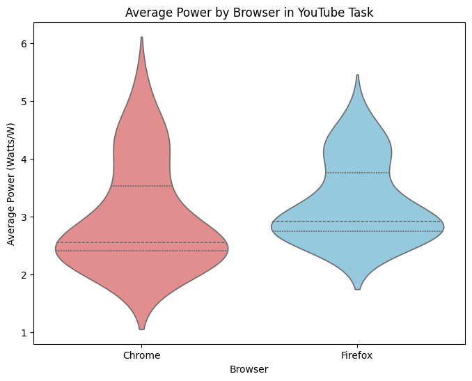
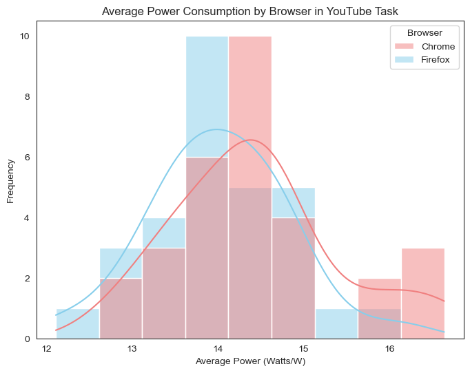

# Group 4 - The browser energy efficiency revolution: An empirical study of energy consumption from the perspective of user behavior


When 3.7 billion browser users scroll through social media feeds, watch videos, or browse the web, they’re often unaware of the hidden energy consumption differences quietly shaping the digital world’s carbon footprint. These differences might seem small on an individual level, but when scaled across billions of users, they add up to significant environmental impacts.

In this study, we set out to uncover the energy efficiency of everyday web browsing by using an automated testing framework. For the first time, we modeled real user behaviors—like watching YouTube videos and scrolling through Reddit—to measure how much energy popular browsers consume. We compared Firefox 121 and Chrome 122 across three operating systems: MacOS 15.3.1, Fedora, and Windows 11. Using advanced system-level energy isolation techniques, we ensured our measurements were precise and reflective of real-world usage.

Our research aimed to answer critical questions: Is there a meaningful difference in energy efficiency between browsers? How do user behaviors amplify these differences? And can switching browsers or operating systems lead to scalable energy savings? These questions aren’t just technical—they have real-world implications for users, organizations, and the planet

To make these findings actionable, we analyzed user statistics to understand how many people use Firefox across different operating systems. By calculating the potential energy savings of browser migration strategies, we provide practical insights for individuals and organizations looking to reduce their environmental impact.

Our testing methodology focused on two of the most widely used browsers: Google Chrome, known for its speed and feature-rich experience, and Mozilla Firefox, which prioritizes privacy and customization. We used a specialized tool called Energibridge to measure energy consumption during common tasks, ensuring our data was both accurate and relevant to real-world usage.

To capture the full picture, we designed user-centric test scenarios that mimic everyday activities, like streaming videos and browsing content-heavy websites. These scenarios go beyond technical benchmarks, offering practical insights into how small choices—like which browser to use—can have a big impact on energy consumption.

## Test Protocol
To accurately measure the energy consumption of browsers during typical user activities, we designed a rigorous test protocol. This protocol ensures consistency across all experiments while capturing real-world usage patterns. Here’s how we conducted our tests:

### Baseline Task
Every test began with a 60-second idle period to establish a baseline for energy consumption. This step helped us account for the system’s background energy usage, ensuring that our measurements focused solely on the browser’s activity. The implementation for this task can be found [here](https://github.com/D4vidHuang/SSE_EnergyMeasurement/blob/linux_test/linux_scripts/auto_sleep_script.sh).

### Iterations
Each test case was repeated 30 times to ensure statistical significance. Every iteration lasted 2 minutes, divided into two phases: 60 seconds of active browsing or video playback, followed by 60 seconds of idle time. This structure allowed us to measure both the energy consumed during active use and the system’s return to baseline during idle periods. The implementation for the iteration script is available [here](https://github.com/D4vidHuang/SSE_EnergyMeasurement/blob/linux_test/linux_scripts/auto_script.sh).

### Test Cases
We focused on two common user activities to evaluate browser energy efficiency: video streaming and social media browsing

1. **Video Streaming (YouTube):** o measure energy usage during video playback, we automated the process of playing a YouTube video using Python and Selenium. The script navigates to a specific video, clicks the play button, and monitors energy consumption for 60 seconds. Below our implementation:

  ```Python
  def play_youtube_video(duration_seconds=60):
      driver = webdriver.Firefox()  # Ensure geckodriver is in PATH

      try:
          driver.get("https://www.youtube.com/watch?v=dQw4w9WgXcQ")
          wait = WebDriverWait(driver, 5)
          try:
              accept_all_button = wait.until(EC.element_to_be_clickable((By.XPATH, "//button[.//span[contains(text(), 'Accept all')]]")))
              accept_all_button.click()
              time.sleep(5)
          except TimeoutException:
              print("Accept all not found")
          try:
              play_button = wait.until(EC.element_to_be_clickable((By.XPATH, "//button[contains(@class, 'ytp-large-play-button')]")))
              play_button.click()
              print("Clicked Play button.")
          except:
              print("Play button not found or already playing.")
          time.sleep(duration_seconds)
      
      finally:
          driver.quit()
  ```

2. **Social Media Browsing (Reddit):** To assess energy consumption during social media use, we automated scrolling through Reddit. The script loads the Reddit homepage, waits for the page to load, and then simulates user scrolling for 60 seconds. Below our implementation: 

  ```python
    def browse_reddit(duration_seconds=60):
    driver = webdriver.Firefox()  # geckodriver is assumed to be in PATH

    try:
        driver.get("https://www.reddit.com")

        time.sleep(5)  # Initial wait

        start_time = time.time()
        while time.time() - start_time < duration_seconds:
            driver.execute_script("window.scrollTo(0, document.body.scrollHeight);")
            time.sleep(2)  # Wait briefly between scrolls

    finally:
        driver.quit()
  ```

## Testing Configuration

### Software Versions
We used the latest stable versions of the browsers and tools at the time of testing. Google Chrome was tested on version 133.0.6943.99, while Mozilla Firefox was evaluated on version 135.0. For energy measurement, we relied on Energibridge v0.0.7, a specialized tool that captures detailed energy consumption data during browser tasks.

### Test Environment
Our experiments spanned three operating systems—Linux, MacOS, and Windows—to capture a comprehensive picture of energy efficiency across platforms.

On **Linux**, we used an ASUS Zenbook 14 UX3405MA equipped with an Intel® Core™ Ultra 9 185H processor and 32 GB of RAM. The system ran Fedora Linux 41 (Workstation Edition) with Linux kernel version 6.12.15-200.fc41.x86_64 and the Wayland windowing system.

For **MacOS**, we tested on a Macbook Air M3 verion, equipped with Apple M3 chip and 16 GB of RAM. The system ran MacOS Sequoia 15.3.1.

On **Windows**, we used a high-performance personal PC featuring an Intel® Core™ i9-12900K processor and 32 GB of RAM. The system ran Windows 11 Professional, version 23H2 (Build 22631.4890).

### Experimental Controls
To ensure consistency across tests, we implemented strict controls to minimize system interference and variability.

First, we activated Zen Mode, a set of practices designed to reduce background activity. This involved closing all non-essential applications, disabling notifications, and disconnecting unnecessary peripherals like USB drives and external displays. We also stopped background services such as web servers and file-sharing tools. Network connectivity was carefully managed, with wired connections preferred over wireless for stability.

Next, we employed Configuration Freezing to lock key settings and eliminate variability. Display brightness and resolution were fixed at consistent values, and automatic brightness adjustment was disabled. Power management features, including dynamic power-saving modes, were turned off to prevent fluctuations in energy usage. Network conditions were stabilized to ensure consistent performance during tests.

By enforcing these rigorous controls, we minimized external factors that could skew our results. This approach not only ensures the accuracy of our findings but also makes it possible for others to reproduce our experiments under the same conditions.

# Statistical Significance Testing Formulas

## T-Statistic
The T-Statistic measures the significance of the difference between the means of two samples. It is calculated as:

$$
t = \frac{\bar{X}_1 - \bar{X}_2}{\sqrt{\frac{s_1^2}{n_1} + \frac{s_2^2}{n_2}}}
$$

where:
- $\bar{X}_1$, $\bar{X}_2$ are the means of the two samples,
- $s_1^2$, $s_2^2$ are the variances of the two samples,
- $n_1$, $n_2$ are the sizes of the two samples.

---

## P-Value
The P-Value represents the probability of observing the current or a more extreme test statistic under the null hypothesis. For a two-sample t-test, it is given by:

$$
p = 2 \cdot \text{CDF}_t(-|t|; \text{df})
$$

where:
- $\text{CDF}_t$ is the cumulative distribution function of the t-distribution,
- $|t|$ is the absolute value of the t-statistic,
- $\text{df}$ is the degrees of freedom, calculated as:

$$
\text{df} = \frac{\left(\frac{s_1^2}{n_1} + \frac{s_2^2}{n_2}\right)^2}{\frac{(s_1^2/n_1)^2}{n_1-1} + \frac{(s_2^2/n_2)^2}{n_2-1}}
$$

---

### Significance Criterion
- If $p < \alpha$ (typically $\alpha = 0.05$), reject the null hypothesis, indicating a significant difference between the two sample means.
- If $p \geq \alpha$, there is insufficient evidence to reject the null hypothesis.


# Testing Results


## MacOS

This section summarizes the **macOS** test outcomes for **Chrome** and **Firefox** under two common usage scenarios: **Reddit browsing** and **YouTube video playback**. All values have been baseline-corrected using an average sleep energy measurement of **240.68 Joules**, following outlier removal.

### Reddit Browsing Task

After cleaning and analyzing the data, we found that the baseline average energy consumption (post-outlier removal) was **240.68 Joules**. During the data cleaning process, one negative outlier (Iteration 59: -0.065 Joules) was excluded. The statistical analysis revealed a **t-statistic of 12.43** and a **p-value of 7.20e-18**. The t-statistic indicates a significant difference in energy consumption between the two browsers, and the p-value is extremely small, far below the standard significance threshold of 0.05. This suggests that the observed difference is highly unlikely to be due to random variation, providing strong evidence of a statistically significant difference. As shown in the figures, Chrome demonstrates significantly lower average energy consumption than Firefox for the Reddit browsing task.

<div style="display: flex;">
  
  
    </div>

### YouTube Playback Task

After cleaning and analyzing the data, we found that the baseline average energy consumption (post-outlier removal) was **240.68 Joules**. No negative outliers were detected during the data cleaning process. The statistical analysis revealed a **t-statistic of 1.26** and a **p-value of 0.211**. The p-value is above the standard significance threshold of 0.05, suggesting that there is no statistically significant difference between the energy consumption of Chrome and Firefox for YouTube playback. As shown in the figures, the average energy consumption of both browsers is quite similar, making it difficult to conclude which one is more efficient in this scenario.

<div style="display: flex;">
  
   
  </div>

---

## Windows

This section summarizes the **Windows** test outcomes for **Chrome** and **Firefox** under two common usage scenarios: **Reddit browsing** and **YouTube video playback**. All values have been baseline-corrected using an average sleep energy measurement of **455.0382 Joules**, following outlier removal.

---

### Reddit Browsing Task
<div style="display: flex;">
  
  
</div>

- **Baseline Average Energy (post-outlier removal):** 455.0382 Joules  
- **Data Cleaning:** No negative outliers were detected.  
- **Statistical Analysis:**  
  - **t-statistic:** 19.22  
  - **p-value:** 7.80e-27  

**Interpretation:** As shown in Figures, Chrome demonstrates a statistically significant lower energy consumption for Reddit browsing compared to Firefox. The **p-value (7.80e-27)** confirms that this difference is highly significant and unlikely due to random chance.

From a sustainability perspective, this means that **using Chrome for Reddit browsing could result in measurable energy savings**, reducing power consumption and contributing to a lower environmental footprint. Over time, this could lead to more efficient resource use and lower electricity costs for users.

<div style="display: flex;">
  
  
  </div>   

### YouTube Playback Task

<div style="display: flex;">
  
  
</div>

- **Baseline Average Energy (post-outlier removal):** 455.0382 Joules  
- **Data Cleaning:** No negative outliers were detected.  
- **Statistical Analysis:**  
  - **t-statistic:** -1.88  
  - **p-value:** 0.0652  

**Interpretation:** In Figures, the YouTube playback energy usage for Chrome and Firefox appears more similar. The **p-value (0.0652)** suggests that the difference in average energy consumption is **not statistically significant** at the 0.05 threshold, although it is marginally close.

As shown in the figure, the energy usage for YouTube playback appears quite similar between the two browsers. This indicates that for **YouTube playback, both browsers perform similarly in terms of energy consumption**, meaning there is no clear advantage in choosing one over the other purely for energy efficiency purposes.

<div style="display: flex;">
  
  
  </div>  

## Linux
This section summarizes the **Linux** test outcomes for **Chrome** and **Firefox** under two common usage scenarios: **Reddit browsing** and **YouTube video playback**. All values have been baseline-corrected using an average sleep energy measurement of **502.46 Joules**, following outlier removal.


### Reddit Browsing Task
After cleaning and analyzing the data, we found that the baseline average energy consumption (post-outlier removal) was **502.46 Joules**. The statistical analysis revealed a **t-statistic of 10.77** and a **p-value of 1.81e-15**. The t-statistic indicates a substantial gap in efficiency. On the other hand, the p-value is very small, far below the standard significance threshold of 0.05. This means the probability of observing such a difference by random chance is almost zero. As shown in **Figures 5** and evidenced with the averages shown in [Table 1](#table-1-reddit-scrolling), Chrome (17.533 W) demonstrates a statistically significant lower energy consumption for Reddit browsing compared to Firefox (21.013 W).


<div style="display: flex;">
  
  
</div>


### YouTube Playback Task
The statistical analysis revealed a **t-statistic of -0.96** and a **p-value of 0.336**.  On one hand the p-value is too large, indicating that the differences may be due to random variation. Along side this, the t-statistic is very small (negative!), indicating no real difference between average power consumptions. Unlike the results for reddit browsing, there seems to be no statistically significant difference between both browsers. This is further evidenced by nearly identical mean power averages as seen in [Table 2](#table-2-youtube-streaming)


<div style="display: flex;">
  
  
</div>

---

## Results Table
### Table 1: Reddit Scrolling

Average Normalised Power in Watts

|          | Linux         | Windows         | MacOS                      |
|----------|:-------------:|:---------------:|:---------------------------:|
| **Firefox**  | 21.013 | Text is centered | And this is right-aligned  |
| **Chrome**   | 17.553    | Even more text   | And even more to the right |

### Table 2: Youtube Streaming

Average Normalised Power in Watts

|          | Linux         | Windows         | MacOS                      |
|----------|:-------------:|:---------------:|:---------------------------:|
| **Firefox**  | 16.928 | Text is centered | And this is right-aligned  |
| **Chrome**   | 17.108    | Even more text   | And even more to the right |

# Conclusion

By focusing on user-centric scenarios and emphasizing the real-world impact of our findings, this project aims to provide valuable insights into the energy consumption of web browsers. Through our testing, we hope to encourage users to make informed decisions that contribute to a more sustainable digital environment.

# Limitations
Despite the valuable insights derived from our user-centric energy consumption measurements, this study has certain limitations. We only tested two browsers, Chrome and Firefox, in specific versions, leaving other browsers like Safari, Edge, or older releases unexamined. Our usage scenarios—YouTube playback and Reddit browsing—represent only a fraction of real-world browsing behaviors, which can include gaming, multi-tab usage, and complex web applications. Additionally, the hardware environments for Linux, macOS, and Windows were restricted to specific devices, limiting the broader applicability of our findings. Network conditions, which we attempted to standardize, may also vary greatly in practice and influence energy usage. Lastly, although we minimized background processes, real-world situations often involve concurrent tasks (e.g., antivirus scans, syncing) not fully represented in our controlled tests.

# Future Work
As for future work, expanding the scope of browsers and versions would provide a more comprehensive view of how different rendering engines and optimizations impact energy consumption. More complex user scenarios, including video conferencing, multi-tab workflows, and gaming, could offer richer insights into how browsing choices affect power draw. Longitudinal studies over extended periods would highlight browser performance in routine daily usage, while testing on a wider range of hardware—including older and ARM-based devices—would improve generalizability. Varying network conditions, such as bandwidth and latency, merit further exploration for their potential to affect browser energy efficiency. Finally, continued refinement of automated testing frameworks and tools (like Energibridge) could yield more granular and scalable data, deepening our understanding of how browser behavior influences energy use.
