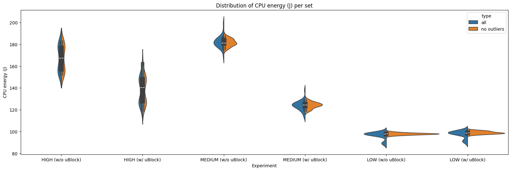
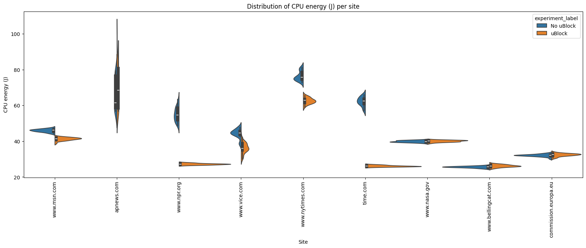

# Introduction
<!-- This problem takes another level if we are counting on these measurements to make **groundbreaking research contributions** in this area. Some research projects in the past have underestimated this issue and failed to produce replicable findings. Hence, this article presents a roadmap on how to properly set up a scientific methodology to run energy efficiency experiments. It mostly stems from my previous work on [doing research and publishing](/publications) on Green Software.

This article is divided into two main parts: 1) how to set up energy measurements with minimum bias, and 2) how to analyse and take scientific conclusions from your energy measurements.
Read on so that we can get your paper accepted in the best scientific conference. -->

Since its inception, the web has rapidly evolved from a basic information-sharing platform into a profit-driven medium, where online advertising is one of the primary revenue sources. Ads do exist for a reason. They support a significant portion of online content, as most people won't pay real money for most of what they consume. Whether it's a reputable news establishment or a niche blog, every website needs server space and developer support, which requires some degree of financial investment. 

However, the rise of online advertising has had a very negative impact on the users. Their overabundance has made the browsing experience cluttered and intrusive. Even worse is the fact that rely on invasive tracking, which exploits user data without clear consent and also facilitates the spread of malicious websites. In response, ad blockers have become a critical tool for users aiming to improve their user experience, privacy, and security while browsing. Even the [FBI recommends ad blockers](https://www.standard.co.uk/news/tech/fbi-recommends-ad-blocker-online-scams-b1048998.html) to avoid falling prey to schemes run by potentially fraudulent websites. 

The debate around ad blockers has recently been intensified with Google Chrome’s announcement to weaken and remove many ad-blocking extensions, [including uBlock Origin](https://www.theverge.com/2024/10/15/24270981/google-chrome-ublock-origin-phaseout-manifest-v3-ad-blocker), one of the most widely used and effective ad blockers. This decision has sparked significant backlash from users who rely on these tools to improve their browsing experience. Beyond the implications for user experience and privacy, this move also raises questions about the broader impact of ad blockers on environmental efficiency and energy consumption.

Thus, in this report, we aim to explore the energy consumption of web browsers with and without ad blockers. Our hypothesis is that ad blockers reduce energy consumption by minimizing the number of extra requests and scripts executed during browsing, thereby decreasing the computational workload needed. Some studies have previously examined the energy consumption associated with ad blocking[1, 2], and generally found a significant decrease in energy consumption when using these extensions, though some exceptions have shown instances of increased consumption. 

# Methodology
This report analyzes the **average energy consumption** of web browsers with and without ad blockers. We focus on energy consumption as it provides insight into the continuous usage of browsers over time. All measurementes are conducted using [EnergiBridge](https://github.com/tdurieux/EnergiBridge). For the measurement, we choose Joules as the unit because it provides a cumulative energy measure, which tells us exactly how much energy was consumed in total, independent of time variations.

For this study, we use Chromium version 135.0.7026.0, as it serves as the foundation for many of the most widely used browsers, including Google Chrome, Microsoft Edge, and Brave, making it a strong representative choice. Testing on Chromium ensures that the results are relevant to a broad range of browsers built on the same engine. The ad blocker tested is uBlock Origin version 1.62.0, one of the most popular extensions, with approximately 39 million downloads, according to Chrome Web Store.

## Testing Setup
Our study evaluate Chromium's energy consumption when browsing websites grouped by advertisement density. We classify websites into three categories — high, medium, and low ad density — with each one containing three different websites.

A **step** is defined as launching Chromium and navigating through all three websites of one category. For each **experimental trial**, we conduct six steps: three (one for each category) with uBlock Origin enabled and three without. To reduce bias, the order of website sets was randomized during each trial. Because hardware temperature can influence energy consumption, the very first trial (used as a warm-up) is excluded from the final analysis. In total, we repeated this trial 30 times.

Within each step, the following actions are performed:
1) Launch Chromium through EnergiBridge.
2) Open a new tab with the designated website.
3) Wait 5 seconds to ensure all resources load completely.
4) Close tab.
5) Wait 1 second to allow the tab to close properly.
6) Repeat steps 2–5 for every website in the current set.
7) Close Chromium and wait 5 seconds before continuing to the next step.

After each trial, we reset all caches and user data genereated before continuing to the next one. Note also that we configure the startup of the browser to enable developer mode automatically, this is a necessary setting for activating uBlock Origin.

Finally, we ensure that configuration settings are kept consistent across the different devices. When executing the experiments we make sure that the laptop was in "zen mode", which includes: 
- No unnecessary applications/services running
- All external hardware disconnected from the device
- Notifications turned off
- Stable internet connection over ethernet cable
- Screen brigtness display at 100% 

## Experimental Setup
The experiments were conducted on one device, for which the specifications are as follows:

| Laptop | Acer Nitro V15               |
|--------|------------------------------|
| CPU    | AMD Ryzen 7 7735H            |
| RAM    | 32 GB                        |
| OS     | Fedora Linux 41              |

<!--Is there more relevent info to add here?-->

As a data processing step we remove the leading 5 seconds of data and only keep 18 seconds of data, 6 seconds for each website. This is done to ensure that the data is consistent across all trials and that the data is not skewed by the loading and closing of the browser, which we found to not be deterministic.

# Results
> The replication package for these experiments can be found on our [Github repository](https://github.com/JortvD/cs4575-g5). 

In figure 1, added below, we present the violin plots for each set, split into two categories: with and without uBlock Origin. The blue plots represent the original distribution, while the orange plots show the distribution with outliers removed.

**Figure 1:** Distribution of CPU total energy (J) per set and experiment

We present a more detailed view of the CPU energy consumption per set in table 1, including the mean, standard deviation, and the Shapiro-Wilk test for normality. We also present the results of the Welch t-test and the Mann-Whitney U test for the difference between the two distributions, depending on if the data is normally distributed or not respectively.

**Table 1: Details on CPU energy per set, all in Joule (J)**

| Set    | Mean (No uBlock) | Mean (With uBlock) | Std Dev (No uBlock) | Std Dev (With uBlock) | Shapiro-Wilk (No uBlock) | Shapiro-Wilk (With uBlock) | t-test (p) | U-test (p) |
|:-------|-----------------:|--------------------|---------------------|-----------------------|--------------------------|----------------------------|-----------|-----------|
| HIGH   | 167.109          | 137.896           | 11.508              | 11.865                | 0                        | 0.026                      | N/A       | <0.001    |
| MEDIUM | 181.628          | 124.173           | 3.465               | 2.871                 | 0.622                    | 0.826                      | <0.001    | N/A       |
| LOW    | 97.948           | 99.112            | 0.95                | 1.243                 | 0.796                    | 0.419                      | <0.001    | N/A       |

In addition we show the mean change and effect size, using Cohen's d, in table 2.

**Table 2: Effect of uBlock on CPU energy consumption across ad density levels, all in Joule (J)**

| Set    |   Mean diff (ΔX) |   Mean change (%) |   Effect size (Cohen's d) |
|:-------|-----------------:|------------------:|--------------------------:|
| HIGH   |          -29.212 |          -17.481% |                       N/A |
| MEDIUM |          -57.455 |          -31.633% |                   -18.058 |
| LOW    |            1.163 |            1.188% |                     1.052 |

## A Lot of Ads - HIGH
As can be seen, and verified by the Shapiro-Wilk test, the distributions are not normal. There a few possible reasons for why the distributions have two peaks:

- One reason could be the browser cache. The script ran the browser twice for each website before resetting the cache, once with the adblock add-on and once without, chosen at random. This might have caused the websites to load faster the second time, consuming less energy and creating two peaks in the distributions.
- Another reason has to do with the network. It is possible that sometimes the websites loaded faster and other times slower, resulting into multiple peaks.

Despite the distributions not being normal, we can use Mann–Whitney U-test to see there is a significant decrease in energy consumption when using uBlock for this set of websites, with $p<0.001$.

## Some Ads - MEDIUM
Some interesting observations can be made here.

For one, the second peak in the distributions no longer exists or is very small if outliers are included. This can possibly be explained by the caching effect not being as signifcant, possibly because the websites with many ads rely on more resources and so cache is used more often.

In addition, we still see that the browser with the adblock is clearly more energy efficient, with a significant decrease in energy consumption, $p<0.001$. Here we should also remark that the effect size is very large, -18.058, which indicates a very strong effect.

## (Almost) no Ads - LOW
<!--.png)-->

As we can see again, the caching effect is minimal for these websites too, which we expect is for the same reasons as before.

In terms of energy efficiency, we can see that the distributions appear to be almost identical. Because of the small standard deviations of both groups of data there is a significant increase in energy consumption when using the adblock, $p<0.001$. However, the effect size of this increase is around 1%.

Therefore our results show that in all cases examined, using an adblock is beneficial for energy efficiency.

## Per site
We can also extend the granularity to show results per website by splitting our collected data in 3 blocks of 6 seconds. Here we visualize the domains, not the full URL. In figure 2 we present a violin plot of the energy consumption per website, split into two categories: with and without uBlock Origin.

**Figure 2:** Distribution of CPU energy (J) per site

We also provide detailed information per website in tables 3 and 4.

**Table 3: CPU energy consumption per website, all in Joule (J)**

| Domain               |   Mean (No uBlock) |   Mean (With uBlock) |   Std dev (No uBlock) |   Std dev (With uBlock) |   Shapiro-Wilk (No uBlock) |   Shapiro-Wilk (With uBlock) | t-test (p)   | U-test (p)   |
|:---------------------|-------------------:|---------------------:|----------------------:|------------------------:|---------------------------:|-----------------------------:|:-------------|:-------------|
| www.msn.com          |             45.958 |               41.294 |                 0.835 |                   0.853 |                      0.758 |                        0.061 | <0.001       | N/A          |
| apnews.com           |             66.957 |               69.932 |                 9.102 |                  11.969 |                      0     |                        0.003 | N/A          | 0.149        |
| www.npr.org          |             55.04  |               27.226 |                 3.936 |                   0.425 |                      0.474 |                        0.605 | <0.001       | N/A          |
| www.vice.com         |             44.294 |               36.205 |                 2.545 |                   2.917 |                      0.035 |                        0.809 | N/A          | <0.001       |
| www.nytimes.com      |             76.414 |               62.587 |                 2.638 |                   1.669 |                      0.103 |                        0.941 | <0.001       | N/A          |
| time.com             |             62.127 |               26.137 |                 2.568 |                   0.413 |                      0.563 |                        0.329 | <0.001       | N/A          |
| www.nasa.gov         |             39.895 |               40.058 |                 0.512 |                   0.509 |                      0.18  |                        0.505 | 0.275        | N/A          |
| www.bellingcat.com   |             25.621 |               26.211 |                 0.471 |                   0.702 |                      0.788 |                        0.944 | <0.001       | N/A          |
| commission.europa.eu |             32.104 |               32.419 |                 0.679 |                   0.797 |                      0.14  |                        0.259 | 0.124        | N/A          |

**Table 4: Effect of uBlock on CPU energy consumption per website, all in Joule (J)**

| Domain               |   Mean diff (ΔX) | Mean change (%)   | Effect size (Cohen's d)   | Ad-density Set |
|:---------------------|-----------------:|:------------------|:--------------------------|:---------------|
| www.msn.com          |           -4.664 | -10.148%          | -5.525                    | HIGH           | 
| apnews.com           |            2.975 | 4.442%            | N/A                       | HIGH           | 
| www.npr.org          |          -27.813 | -50.533%          | -9.935                    | HIGH           | 
| www.vice.com         |           -8.089 | -18.261%          | N/A                       | MEDIUM         | 
| www.nytimes.com      |          -13.827 | -18.095%          | -6.265                    | MEDIUM         | 
| time.com             |          -35.99  | -57.929%          | -19.571                   | MEDIUM         | 
| www.nasa.gov         |            0.163 | 0.408%            | 0.319                     | LOW            | 
| www.bellingcat.com   |            0.589 | 2.3%              | 0.986                     | LOW            | 
| commission.europa.eu |            0.315 | 0.98%             | 0.425                     | LOW            | 

# Conclusion
Our findings supports our initial hypothesis that ad-blocking can substantially reduce energy usage, supporting our hypothesis that blocking ads decreases CPU energy consumption. This effect is most pronounced on websites with moderate to high ad density, where enabling uBlock Origin resulted in a noticeable reduction in energy consumption—exceeding 30% in some cases (see Table 2). The reasoning behind this is straightforward: blocking ads prevents unnecessary network requests and reduces the number of scripts, animations, and video-based advertisements loaded onto the page, thereby lowering CPU workload and energy use.

However, when browsing ad-free websites, the results indicate that the ad blocker does not contribute any energy savings. In fact, a slight increase in energy consumption was observed, likely due to the ad blocker introducing a small, fixed computational overhead while operating.

In the future, we could improve based on three main aspects:

1. Increase Sample Size and Experiment Repetitions. Conducting more trials and increasing the sample size would strengthen the statistical significance of the findings. Previously the analysis of CPU energy distributions revealed non-normal distributions for ad-heavy sites. Given that the number of repetitions in our experiments was 30, another likely reason that is not related to cachings is this sample size may not be sufficient for the distribution to fully converge, particularly for datasets with high variance. Our findings indicate that ad-heavy sites exhibit a higher standard deviation compared to the other sets, suggesting that more trials may be required to converge a stable and meaningful distribution. Increasing the number of repetitions could help reduce variability and provide a clearer picture of the underlying energy consumption patterns.

2. Since our study focuses on Chromium-based browsers, future research should examine whether the same trends hold for other browser engines such as Mozilla Firefox (Gecko), Microsoft Edge (Chromium-based), and Tor Browser (which prioritizes privacy but may have different energy implications). Similarly, evaluating alternative ad blockers (e.g., AdBlock Plus, Ghostery, Privacy Badger) could determine if their filtering mechanisms have varying impacts on CPU energy usage.

3. Analyze GPU and Network Energy Consumption. While our study primarily focused on CPU energy consumption, the energy consumed by the GPU and network interface could also be interesting to look at. GPU is often used for rendering rich media ads, and ad-blocking may shift some computational load from the GPU to the CPU. Similarly, blocking ads reduces data transmission, which could decrease energy consumption on wireless devices by lowering network activity and bandwidth usage.

# References
[1] Khan, K. A., Iqbal, M. T., & Jamil, M. (2024). Impact of Ad Blockers on Computer Power Consumption while Web Browsing: A Comparative Analysis. European Journal of Electrical Engineering and Computer Science, 8(5), 18-24.

[2] Kent Rasmussen, Alex Wilson, and Abram Hindle. (2014). Green mining: energy consumption of advertisement blocking methods. In Proceedings of the 3rd International Workshop on Green and Sustainable Software (GREENS 2014). Association for Computing Machinery, New York, NY, USA, 38–45. https://doi.org/10.1145/2593743.2593749
<!-- #### 👉 Note 1:
If you are a **software developer** enthusiastic about energy efficiency but you are not particularly interested in scientific experiments, this article is still useful for you. It is not necessary to do "everything by the book" but you may use one or two of these techniques to reduce the likelihood of making wrong decisions regarding the energy efficiency of your software.

--- 

## Unbiased Energy Data ⚖️

There are a few things that need to be considered to minimise the bias of the energy measurements. Below, I pinpoint the most important strategies to minimise the impact of these biases when collecting the data.

### Zen mode 🧘🏾‍♀️

The first thing we need to make sure of is that the only thing running in our system is the software we want to measure. Unfortunately, this is impossible in practice – our system will always have other tasks and things that it will run at the same time. Still, we must at least minimise all these competing tasks:

- all applications should be closed, notifications should be turned off;
- only the required hardware should be connected (avoid USB drives, external disks, external displays, etc.);
- turn off notifications;
- remove any unnecessary services running in the background (e.g., web server, file sharing, etc.);
- if you do not need an internet or intranet connection, switch off your network;
- prefer cable over wireless – the energy consumption from a cable connection is more stable than from a wireless connection.

### Freeze your settings 🥶

It is not possible to shut off the unnecessary things that run in our system. Still, we need to at least make sure that they will behave the same across all sets of experiments. Thus, we must fix and report some configuration settings. One good example is the brightness and resolution of your screen – report the exact value and make sure it stays the same throughout the experiment. Another common mistake is to keep the automatic brightness adjustment on – this is, for example, an awful source of errors when measuring energy efficiency in mobile apps.

---

### 

Nevertheless, using statistical metrics to measure effect size is not enough – there should be a discussion of the **practical effect size**. More important than demonstrating that we came up with a new version that is more energy efficient, you need to demonstrate that the benefits will actually be reflected in the overall energy efficiency of normal usage of the software. For example, imagine that the results show that a given energy improvement was only able to save one joule of energy throughout a whole day of intensive usage of your cloud software. This perspective can hardly be captured by classic effect-size measures. The statistical approach to effect size (e.g., mean difference, Cohen's-*d*, and so on) is agnostic of the context of the problem at hand.
 -->
