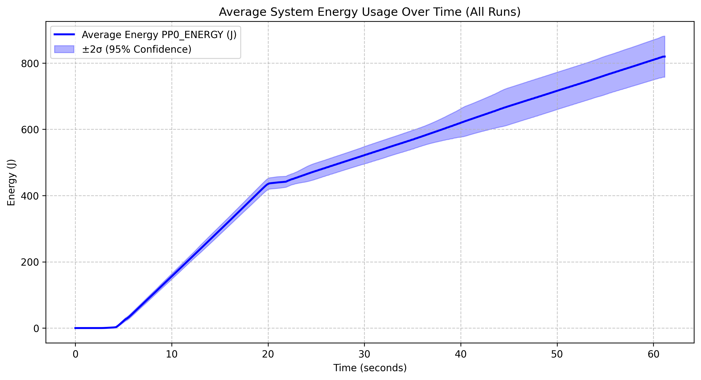
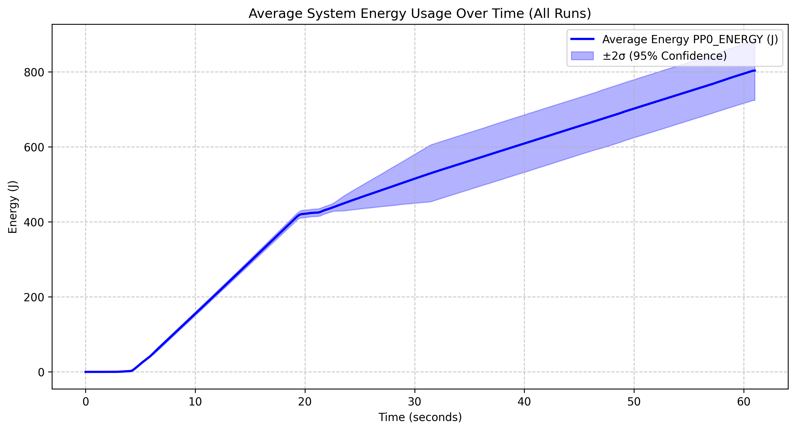
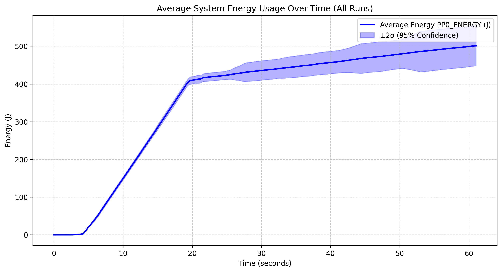
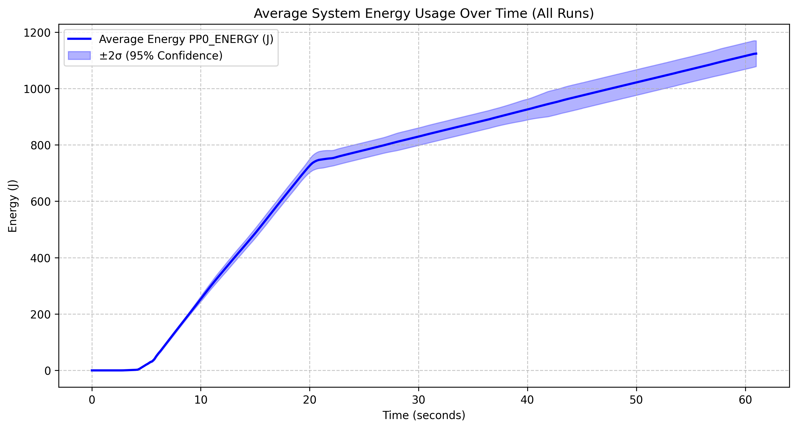
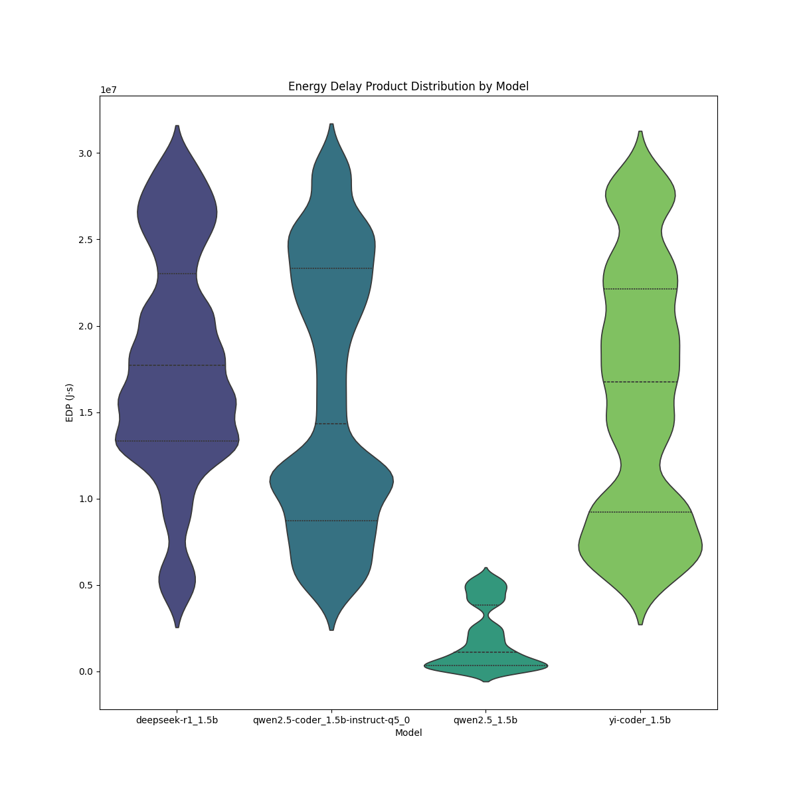
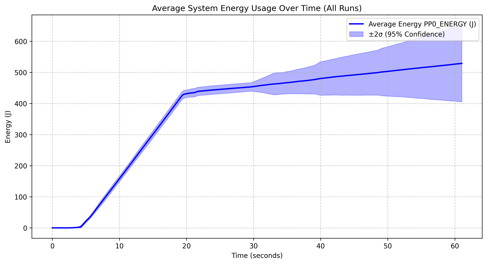
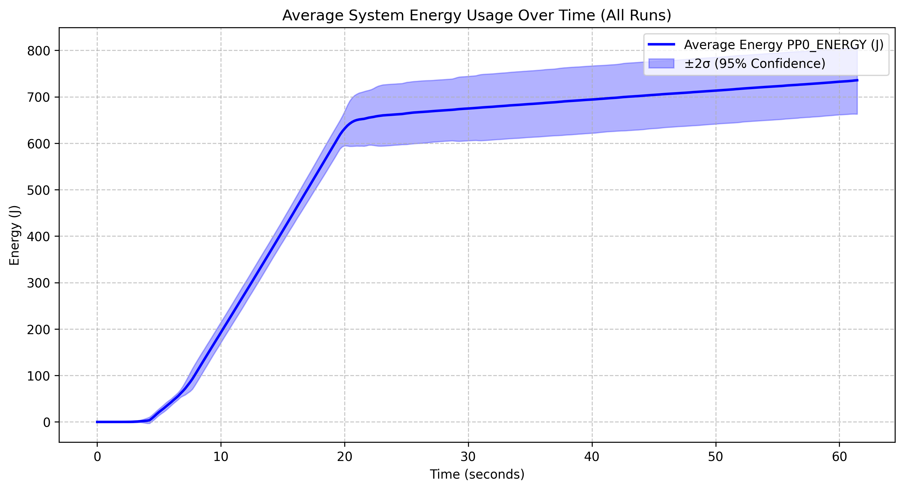
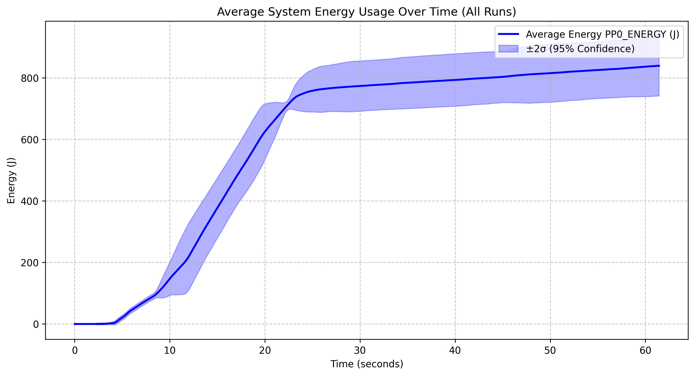
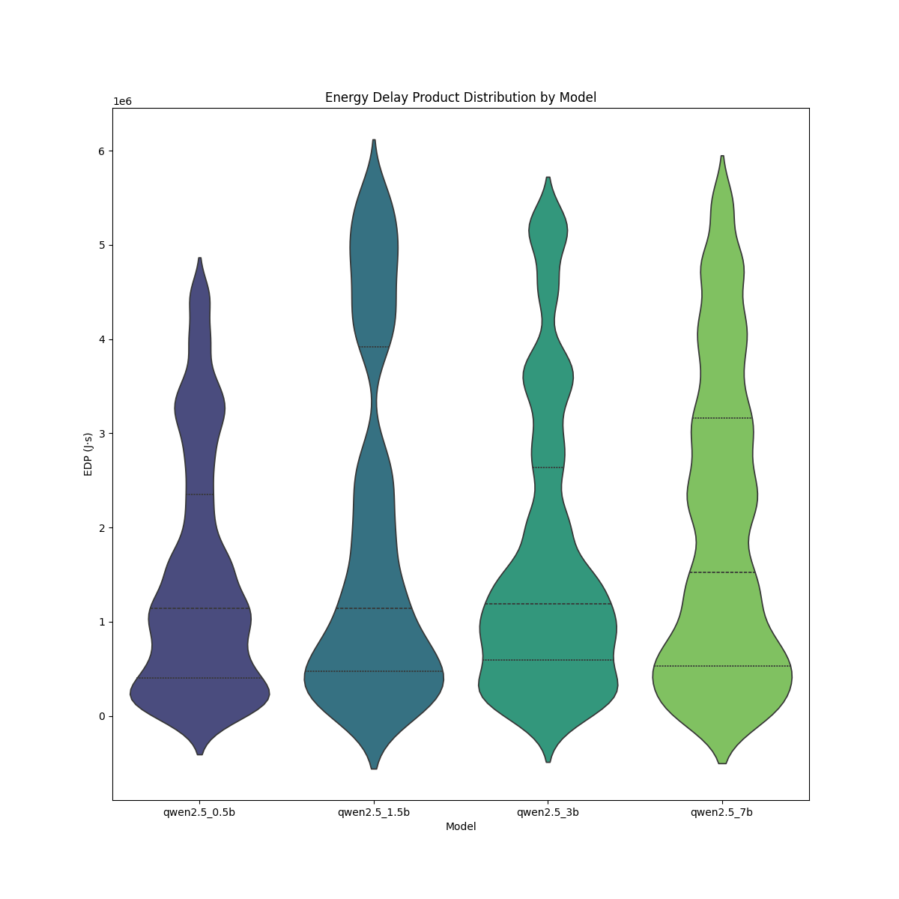

## Introduction

Large Language Models (LLMs) are everywhere. From coding assistants to chatbots and even AI-powered creativity tools. While these models are incredibly
powerful, they also come with a hidden cost: energy consumption. Running LLMs, especially on local machines, can be computationally intensive, which means
higher electricity usage and a bigger carbon footprint. Wanting to reduce the overall consumption of LLMs, we conducted experiments comparing the energy 
usage of different models.

Before diving into the experiments, let's set the scene by explaining some core concepts and giving background information. In the case of machine learning,
inference refers to the process of running a trained model to generate responses, which in the context of energy consumption, might seem lightweight
compared to the heavy lifting of training. However, without the hyper-optimized infrastructure of cloud providers, inference can still be power-hungry,
especially when running LLMs on local machines without cloud-scale optimizations (Patterson et al., 2021). Moreover, with AI becoming an integral part of
daily computing, measuring this energy consumption is more relevant than ever.

In this blog post, we'll explore just how much energy LLMs consume under different conditions. Specifically, we'll compare:

- The same model running with a different number of parameters.
- Different models running with the same number of parameters to see how architecture affects energy consumption.

By the end of this study, we aim to highlight energy-efficient choices for those working with LLMs—whether you're a researcher, developer, or AI enthusiast.

## Why Measuring LLM Energy Consumption Matters

With the rapid rise of AI, energy efficiency is no longer just a side concern—it's a big deal. Here's why:

### Environmental Impact

AI's environmental impact is often discussed in the context of training massive models, with studies showing that training a large Transformer model can
emit just as much CO₂ as five cars over their entire lifetime (Strubell et al., 2019). However, as mentioned previously, inference is where the real-world,
everyday energy consumption happens—especially considering that LLMs are integrated into consumer devices, chatbots, and in various other applications.
Measuring inference energy helps us identify eco-friendly ways to deploy AI.

### Cost Considerations

For developers running LLMs on personal GPUs or cloud instances, energy usage translates directly into money spent on electricity and compute time. Say we
have two models which perform similarly, but one is significantly more power-hungry, wouldn't you rather use the energy-efficient one? Knowing which 
configurations are more power-efficient can help reduce these costs (Henderson et al., 2020).

### Hardware Performance & Thermals

Ever noticed your GPU fans kicking into overdrive when running AI models? That's because LLMs can push hardware to its limits, generating heat and
potential wear over time. Measuring energy use can also give insights into optimizing workloads without overloading your system.

Inference isn't free—it uses compute power, generates heat, and may even throttle performance if pushed too hard. Understanding energy consumption
can help optimize setups for better efficiency without having to sacrifice speed.

## What has been done so far?

While there's been a lot of research into the energy demands of training AI models, inference-specific information remains a field which hasn't been
explored extensively.

However, some related areas include:

### Trends in AI Inference Energy Consumption

A recent study, Trends in AI Inference Energy Consumption: Beyond the Performance-vs-Parameter Laws of Deep Learning (Pellissier Tanon et al., 2023), 
highlights how inference energy consumption grows with model complexity. The paper discusses the scalability of energy costs in AI inference and the need 
for efficient architectures as models become larger.

### Energy Consumption of AI Inference

Some preliminary research has looked at how running Transformer-based models affects power usage, but many focus on cloud-scale performance rather than 
local machine inference (Sharir et al., 2020).

### MLPerf Inference Benchmarks

While MLPerf provides benchmarks for inference speed, energy efficiency metrics are still evolving. Our study will contribute real-world measurements 
for commonly used LLMs on local setups (Mattson et al., 2020).

### Hardware-Specific Optimizations

GPU makers like Nvidia, AMD, and Apple have introduced AI accelerators (Tensor Cores, RDNA AI Engines, Neural Engines) to improve inference efficiency,
but real-world power savings still need testing (Jouppi et al., 2017).

This study helps bridge the gap by providing practical, real-world energy consumption data for querying LLMs on local machines.

## Hypothesis & Key Questions

Before diving into experiments, let's define what we expect to find:

**Hypotheses:**

1. Different parameters within the same model will lead to noticeable differences in energy consumption. We predict that lower number of parameters will
2. reduce power draw.
2. Different models with the same parameters will consume energy differently. Some models/architectures are simply more efficient than others.

## Methodology

In order to accurately measure the energy consumption of different LLMs during runtime, we designed an experiment aiming to capture CPU usage and memory
consumption. This section will explain the key steps taken to ensure reliable and reproducible results.

### 1. Experimental Setup

We conducted all measurements on a controlled local environment in order to reduce/eliminate variations which could be caused by different machines or
cloud optimisations.

More specifically, the hardware used during the experiments was the following:

- **Processor:** Intel Core i7-10750H CPU @ 2.60Hz(TM)
- **Memory:** 16GB RAM
- **GPU:** Integrated Intel(R) UHD Graphics and NVIDIA Quatro T10000 with Max-Q Design
- **Power Monitoring Tool:** Intel RAPL (Running Average Power Limit) + EnergiBridge
- **Operating System:** Windows 10

This setup ensured that all models were tested under identical hardware conditions, aiming to minimise external factors which could influence the energy
consumption of the models.
Before each test we disabled all possible background processes and services to ensure that the energy consumption was solely due to the model running. We 
had to keep some processes running to ensure the system was operational, but these were kept to a minimum to avoid interference with the measurements. (Some
examples of these processes include firewalls, antivirus software, and system services.)

### 2. Model Selection & Execution

As mentioned previously, our experiment includes two distinct parts.

In the first part we will measure and compare the power consumption of different models, all with the same number of parameters.

We selected four different LLMs for this part:

1. **Qwen2.5-coder:1.5b-instruct-q5_0**: an instruction-tuned model using Q5 quantization. (1.1 GB)
2. **Yi-coder:1.5b**: a base model offering an efficient solution aimed at code generation with fewer computational resources (866 MB)
3. **Deepseek-r1:1.5b**: a model optimized for reasoning and code generation. (1.1 GB)
4. **Qwen2.5:1.5b**: similar to 1. without the Q5 quantization. (986 MB)

In the second part, we will measure and compare the power consumption of the same model but with different versions in terms of number of parameters.

We selected the following LLM's to achieve this:

1. **Qwen2.5:0.5b** (397 MB)
2. **Qwen2.5:1.5b** (986 MB)
3. **Qwen2.5:3b** (1.9 GB)
4. **Qwen2.5:7b** (4.7 GB)

Each model was run under the same conditions using the llama engine. This framework was chosen for its efficiency and the simplicity to leverage 
quantized models, allowing us for a better control over energy usage.

### 3. Measuring CPU & Power Consumption

During the measuring process, we logged the resource usage every 200 milliseconds to capture fluctuations over time.

For energy consumption, we relied on Intel RAPL (Running Average Power Limit), which is a built-in way of power monitoring that energy usage. We recorded:

- **PP0 Energy Consumption:** Total power drawn by the CPU during inference.
- **PP1 Energy Consumption:** Energy used by RAM for model execution. (In replication package but as the model used CPU only it was not used in the analysis)

These metrics allowed us to determine whether energy consumption was CPU-bound or influenced more by memory access patterns.

### 4. Testing Procedure

To ensure consistency, each model underwent the following sequence of tests:

1. **Baseline Measurement:** A 5 second wait, where we measure and record the system's idle power consumption.
2. **Model Querying:** Each model was loaded and allowed to run an initial inference with the following prompt: "What is your name?". The model was run for 15 seconds, before stopping it.
3. **Cooldown:** The following 40 seconds were left idle, to measure the energy consumption right after the model was queried. After the cooldown time was finished, we stopped measuring energy consumption.
4. **Repetition:** To avoid variability due to other factors we randomized the order of runs and used a 3 minute delay between runs. At the end, an average energy consumption was computed.
5. **Real-Time Logging:** CPU usage and power consumption data were logged continuously from the moment inference started until it completed.
6. **Post-Processing & Analysis:** Data was processed using Python to extract trends, identify power consumption peaks, and compare overall efficiency.

The replication package can be found in this [GitHub release](https://github.com/Rav0702/SSE/releases/tag/0.1)

### 5. Data Validation & Error Reduction

To minimize noise in the results, we took the following precautions:

- **Repeated Trials:** Each test was repeated thirty times to account for fluctuations in system background processes.
- **Temperature Monitoring:** We ensured that temperature difference did not influence energy measurements by tracking CPU temperatures throughout testing.

## Experimental Results

In the first part of our results, we analyse the power consumption of different models having the same number of parameters. In the second part, we compare
the power consumption of the same model with different numbers of parameters.

### Part 1: Model Comparison

#### Energy Consumption of Different Models with 1.5b Parameters

| | |
|---|---|
|  **Deepseek r1 1.5B** |  **Qwen 2.5 coder instruct 1.5B q5_0** |
|  **Qwen 2.5 1.5B** |  **Yi coder 1.5B** |

### Overall Patterns

All four models show a similar general pattern: minimal energy consumption for the first 10 seconds, followed by a sharp increase between 10-20 corresponding to the model loading phase and continued inference.
and then a more gradual linear increase after the 20-second mark. The model was stopped at the 20 second mark so all energy usage after this point is due to the increased CPU usage and memory access patterns during inference.

### Model-Specific Observations

The **Deepseek r1 1.5B** model reaches approximately 800J by the 60-second mark and has relatively narrow confidence intervals, 
indicating stable performance across runs. The **Qwen 2.5 coder instruct 1.5B q5_0** model follows an almost identical energy profile to Deepseek r1,
reaching about 800J, with its quantized version (q5_0) not providing significant energy savings over non-quantized models at this scale. The
**Qwen 2.5 1.5B** model shows slightly lower overall energy consumption, reaching about 500J, with a similar pattern but a less steep curve after the
initial spike, suggesting it may be more energy-efficient than its specialized coder variant. However, both Qwen models showcase wide confidence intervals indicating more variability across runs
The **Yi coder 1.5B** model stands out with significantly higher energy consumption, reaching approximately 1200J, 
showing a steeper ongoing increase that suggests less efficient energy use during extended operation.

### Comparative Analysis

- **Most Efficient**: Qwen 2.5 1.5B appears to be the most energy-efficient model
- **Least Efficient**: Yi coder 1.5B is clearly the least efficient, using nearly twice the energy of the other models
- **Quantization Impact**: The quantized Qwen model doesn't show substantial energy savings compared to its non-quantized counterpart at this scale

### Energy-Delay Product (EDP) Analysis

The **Deepseek r1 1.5B** model has a relatively wide and high EDP distribution suggesting moderate variability and higher overall energy-delay cost.
The **Qwen 2.5 coder instruct 1.5B q5_0** model follows a similar trend but appears to have a slightly wider spread, indicating
greater variation in efficiency across different runs. The **Qwen 2.5 1.5B** model shows a much lower EDP, with its distribution heavily
skewed toward lower values, suggesting significantly better energy efficiency compared to the other models. The **Yi coder 1.5B** model,
on the other hand, exhibits the highest EDP values, indicating higher energy consumption and delay, and wider variability,
making it the least efficient in this comparison.  

Overall, **Qwen 2.5 1.5B** stands out as the most energy-efficient model, while **Yi coder 1.5B** appears to be the least efficient in terms of EDP. 
The **Deepseek r1 1.5B** and **Qwen 2.5 coder instruct 1.5B q5_0** models perform similarly, though the latter exhibits a slightly wider spread,
indicating more fluctuation in performance.

### Part 2: Parameter Comparison

#### Energy Consumption of Qwen 2.5 with Different Parameters

|                                                                                                                                                                                  |                                                                                                                                                                                  |
|----------------------------------------------------------------------------------------------------------------------------------------------------------------------------------|----------------------------------------------------------------------------------------------------------------------------------------------------------------------------------|
|  **Qwen 2.5 0.5B** |  **Qwen 2.5 1.5B** |
|  **Qwen 2.5 3B**       |  **Qwen 2.5 7B**       |

### Parameter Size Impact

The **Qwen 2.5 0.5B** model reaches approximately 525J by the 60-second mark, with wider confidence intervals in the latter half, indicating 
variable performance, and despite having the fewest parameters, it does not show dramatically lower energy consumption than the 1.5B model.
The **Qwen 2.5 1.5B** model reaches around 500J by the end of the run, maintains relatively narrow confidence intervals throughout, and exhibits 
an energy profile surprisingly similar to the 0.5B model, suggesting diminishing returns on parameter efficiency. The **Qwen 2.5 3B** model peaks 
at around 750J, consumes slightly more energy than the smaller models as expected, and has very narrow confidence intervals, indicating highly
consistent performance. The **Qwen 2.5 7B** model reaches roughly 850J by the end of the run, has significantly wider confidence intervals, 
particularly between 10-25 seconds, and exhibits a more variable ramp-up phase compared to the other models.

### Comparative Insights

- **Scaling Efficiency**: There isn't a perfectly linear relationship between parameter count and energy consumption, which is somewhat surprising
- **Most Consistent**: The 3B model shows the most consistent performance with the narrowest confidence intervals
- **Most Variable**: The 7B model shows the most variability, particularly during the loading/initialization and stopping phase

### Energy-Delay Product (EDP) Analysis

The **qwen2.5_0.5b** and **qwen2.5_7b** models exhibit the widest distributions, indicating higher variability in their EDP values. In contrast, 
the **qwen2.5_0.5b** model has the most compact distribution, suggesting lower variance in energy efficiency. The **qwen2.5_3b** model shows a
relatively uniform spread, implying more consistent performance. The median EDP values appear higher for **qwen2.5_1.5b** and **qwen2.5_7b**, which suggests
these models may be less energy-efficient. As model size increases from **0.5b to 7b**, there is a noticeable upward trend in EDP values, hinting at reduced efficiency at larger scales.
The larger models, particularly also exhibit more extreme values, which may suggest inconsistencies in energy efficiency.

## Key Takeaways & Next Steps

This analysis highlights significant variations in energy efficiency across different LLMs. While some models, like Qwen 2.5 family,
appear to be well-optimized for lower power consumption, others like Yi coder demand significantly more energy for similar tasks. 
These findings suggest that developers and researchers should carefully consider model selection when optimizing for power efficiency,
especially in environments where energy costs and sustainability are concerns.

Further research could explore how these trends hold across different hardware setups, such as GPUs vs. CPUs, or the impact of
additional optimizations like batch processing and quantization. By identifying best practices for energy-efficient inference, we can
make AI deployment more sustainable without sacrificing performance. In our constantly evolving digital world, it remains imperative for
us computer scientists to extend our efforts in the search for new ways to reduce the environmental impact of software, always aiming for a
better and more sustainable future.

## References

- Henderson, P., Hu, J., Romoff, J., Brunskill, E., Jurafsky, D., & Pineau, J. (2020). Towards the Systematic Reporting of the Energy and Carbon Footprints of Machine Learning. Journal of Machine Learning Research, 21(248), 1-43.
- Jouppi, N. P., Young, C., Patil, N., et al. (2017). In-Datacenter Performance Analysis of a Tensor Processing Unit. ACM/IEEE 44th Annual International Symposium on Computer Architecture (ISCA).
- Mattson, P., et al. (2020). MLPerf: An Industry Standard Benchmark Suite for Machine Learning Performance. 2020 ACM/IEEE 47th Annual International Symposium on Computer Architecture (ISCA).
- Patterson, D., Gonzalez, J., et al. (2021). Carbon Emissions and Large Neural Network Training. arXiv preprint arXiv:2104.10350.
- Pellissier Tanon, T., et al. (2023). Trends in AI Inference Energy Consumption: Beyond the Performance-vs-Parameter Laws of Deep Learning. Sustainable Computing: Informatics and Systems, 38, 100774.
- Sharir, O., Peleg, B., & Shoham, Y. (2020). The Cost of Training NLP Models: A Measurement Study. arXiv preprint arXiv:2004.08900.
- Strubell, E., Ganesh, A., & McCallum, A. (2019). Energy and Policy Considerations for Deep Learning in NLP. Proceedings of the 57th Annual Meeting of the Association for Computational Linguistics, 3645–3650.
