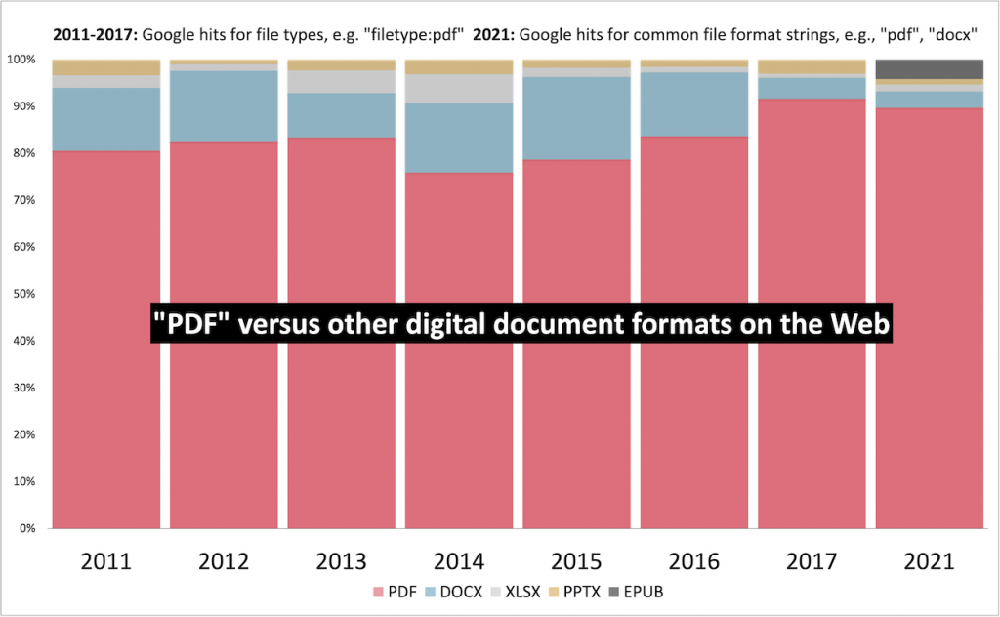
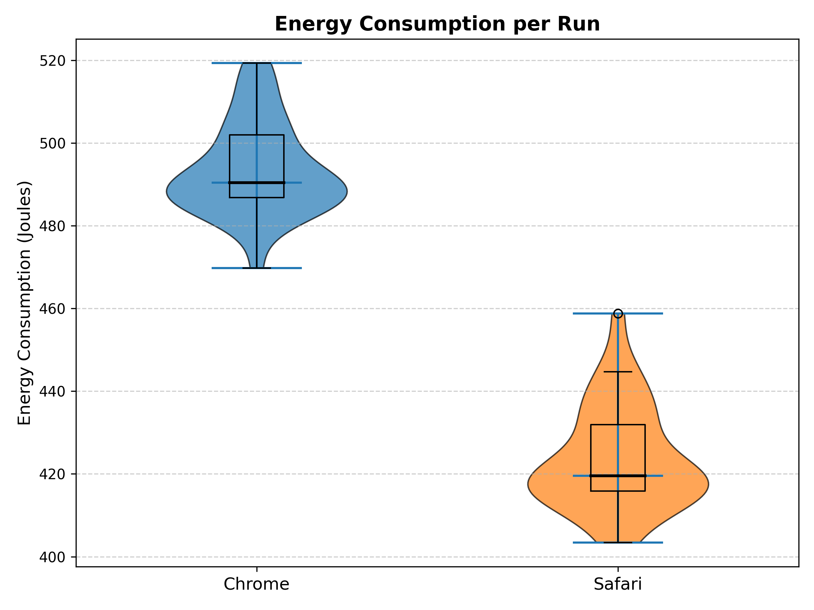
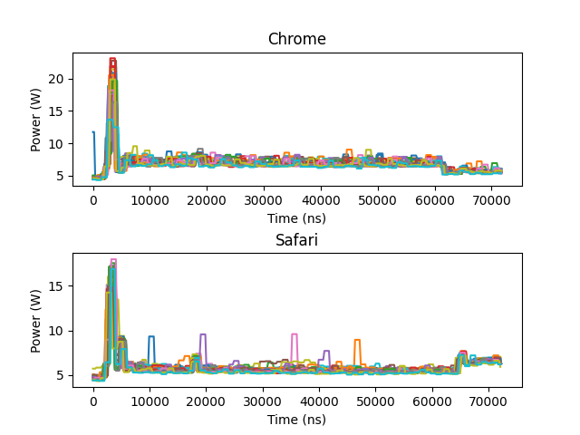

# 1. Introduction

## 1.1 Context & Motivation

Portable Document Format (PDF) has become a universal standard for sharing and viewing documents across various settings (Aperto, [2020](https://doi.org/10.1007/978-3-662-48986-4_301355)). Johnson ([2021](https://pdfa.org/pdfs-popularity-online/)) has demonstrated that PDFs are by far the most commonly used document format. The graph below, taken from Johnson ([2021](https://pdfa.org/pdfs-popularity-online/)), highlights the significant difference in usage, with over 80% of digital documents being in PDF format. While reading PDFs is generally considered a lightweight task, differences in software architectures can lead to varying levels of energy consumption. Seemingly minor design choices, such as background services or rendering complexity, can have a considerable impact on power usage, particularly when documents are viewed for extended periods (Procaccianti et al., [2016](https://doi.org/10.1016/j.jss.2016.02.035)).

*Graph showing the distribution of different digital document formats (Johnson, [2021](https://pdfa.org/pdfs-popularity-online/))*

For users who frequently view PDFs, inefficient software can result in shorter battery life, more frequent recharging, and an overall higher environmental footprint. 

## 1.2 Relevance for Students

Students are among the most impacted by PDFs, as textbooks, lecture notes, and assignment materials are predominantly shared in this format, requiring prolonged screen time on laptops. Even a slight improvement in power efficiency can reduce mid-day charging needs, minimize battery wear, and potentially lower electricity costs over a semester.

Sustainability has also become an increasing priority in higher education (Machado et al., [2023](https://doi.org/10.1016/j.jss.2016.02.035)). By identifying which PDF reader consumes less power, this project can provide students with both practical benefits, such as fewer recharges and longer battery life, and environmentally conscious alternatives that align with current sustainability initiatives.

## 1.3 Research Objective

The primary objective of this project is to measure and compare the energy consumption of two PDF readers under typical usage conditions. By determining which reader is more efficient, the findings aim to provide practical insights for users, particularly students, who seek longer battery life and a reduced environmental footprint.

# 2. Methodology

For this project we designed an experimental setup to try and ensure accurate and reliable measurements. This section details the hardware and software environment, the controlled testing conditions, the energy measurement tools employed, and the step-by-step procedure followed during the experiments.

## 2.1 Hardware and Software Environment

### Test Device

The experiments were conducted on a MacBook Pro (M3, 2024) with the following specifications:

- **Processor:** Apple M3 (8-core CPU)
- **Graphics:** Integrated Apple GPU (8-core)
- **Memory:** 18 GB LPDDR4
- **Storage:** 512 GB SSD (NVMe)
- **Power Source:** Connected to the original Apple charger
- **Peripherals:** No external devices were connected during testing

We used the following browsers:
  - **Google Chrome:** 133.0.6943.127
  - **Safari:** 17.3
  

### PDF Readers and Automation Tools

The study focused on two widely used PDF readers:

- **Built-in Google Chrome PDF Reader**: Google Chrome’s PDF reader is integrated directly into the browser, offering a fast and convenient way to open and view PDF files without requiring any additional software. It supports basic functions such as zooming, searching text, and navigating through pages. Its cross-platform nature makes it a common choice for users across different operating systems, including Windows, macOS, and Linux.

- **Built-in Safari PDF Reader**: Safari’s PDF reader, integrated into Apple’s default web browser on macOS and iOS devices, provides a streamlined PDF viewing experience. Like Chrome’s PDF reader, it offers basic features like zooming, text search, and page navigation. However, Safari benefits from better integration with macOS.

To automate user interactions such as scrolling and text searching within the PDFs, **Python 3.x** scripts and the library `pyautogui` were used.

### Test Document

The same **13-page PDF document**, containing a research paper, was used for all tests.

## 2.2 Controlled Testing Environment
To isolate the PDF reader as the primary variable affecting energy consumption, a controlled environment was established with the following measures:

### Operating System and Settings

The device operated on **macOS Sonoma 14.3 (23C71)**. To maintain consistency across all test runs, the following system settings were applied:

- Screen brightness was set to a constant **80%**.
- All notifications were disabled to prevent interruptions.
- The power mode was configured to **"Better Performance"** to ensure optimal operation during tests.

### Network and System Load Management

- The device was connected to a **stable Wi-Fi network** with an approximate throughput of **250 Mbps** via **802.11ax**.
- All **non-essential applications** were closed to minimize background processes.
- **System updates** and scheduled tasks were disabled to prevent unexpected resource usage.

## 2.3 Energy Measurement Tools

Measuring energy consumption was achieved using [EnergiBridge](https://github.com/tdurieux/EnergiBridge), a tool designed for detailed power measurement. The key metrics recorded during each test included:

1. **Total Energy Consumption (Joules):**  
   - Determined by calculating the total power over the elapsed time between initial and final values from EnergiBridge's logs.

2. **Average Power Consumption (Watts):**  
   - Calculated by averaging the power readings over the duration of each test.

### Data Analysis

Each run’s time-series log is aggregated into a single total energy value (in Joules). Outliers are subsequently filtered using a z-score threshold of 3.0. Afterward, a Shapiro-Wilk test determines whether the resulting distributions are normally distributed. If both sets of runs pass normality, a Welch’s t-test is performed; otherwise, a Mann–Whitney U test is used.

## 2.4 Experimental Procedure

The following standardized procedure was implemented for each test run:

### 1. Pre-Test Warm-Up

To stabilize the CPU temperature and prevent artificially low energy readings in initial runs, a **30-second CPU-intensive Fibonacci sequence calculation script** was executed before commencing measurements.

### 2. Automated Testing Routine

For each PDF reader, an automated script performed the following actions:

1. **Launch** the PDF reader and open the test document.
2. **Scroll** through all 13 pages at a controlled pace (~1 min per 5 pages).
3. **Perform text searches** using the word `"LLM"`, and skipping to the 10th occurrence, to simulate typical user behavior.
4. **Close** the application upon completion of the tasks.

### 3. Repetition and Randomization

Each PDF reader underwent **30 test runs**. To mitigate the impact of temporal factors like **CPU temperature fluctuations** or **background process variations**, the sequence of tests was randomized:

- **Reader A → Reader B → Reader A → Reader B** (instead of running all tests for one reader first).

### 4. Timing and Logging

- **EnergiBridge logging** started **immediately before** the script initiated the PDF reader and concluded **after** the reader was closed.
- Each test lasted approximately **3 minutes**, including scrolling, searching, and other tasks.

### 5. Post-Test Cooldown

A **60-second interval** was observed between consecutive tests to allow the system to return to baseline conditions, to ensure that residual effects from previous runs did not influence subsequent measurements.

# 3. Results

This section presents the findings of the energy consumption analysis for Chrome and Safari when viewing PDFs. The results include detected runs, summary statistics, normality testing, and statistical comparisons.

### 3.1 Outlier Detection

Using a Z-score threshold of 3.0, no outliers were detected in either dataset:

| Browser | Outliers Detected | Total Runs |
|---------|-----------------|------------|
| Chrome  | 0               | 30         |
| Safari  | 0               | 30         |

### 3.2 Summary Statistics

The summary statistics for energy consumption (Joules) per run are presented below. As no outliers were detected, both sets of statistics (outlierds in/excluded) remain identical.

| Browser | Minimum Energy (J) | Maximum Energy (J) | Variance (J) | Mean Energy (J) |
|---------|-------------------|-------------------|-------------|---------------|
| Chrome  | 469.79            | 519.33            | 119.58      | 493.54        |
| Safari  | 403.41            | 458.75            | 153.11      | 423.73        |

### 3.3 Normality Testing

To determine whether the energy consumption data followed a normal distribution, a normality test was conducted on both datasets:

| Browser | Normality Test Result |
|---------|----------------------|
| Chrome  | Normally distributed |
| Safari  | Normally distributed |

### 3.5 Statistical Comparison

A Welch’s t-test was performed to compare the energy consumption between Chrome and Safari. The results of the test are as follows:

| Test | Test Statistic | p-value |
|------|---------------|---------|
| Welch’s t-test | 22.77 | 2.43 × 10⁻³⁰ |

With a p-value significantly lower than 0.05, the test indicates a **statistically significant difference** in energy consumption between Chrome and Safari.

### 3.6 Visualization

The following plots illustrate the findings:

1. **Violin Plot of Energy Consumption per Run:** This plot compares the energy consumption distribution for Chrome and Safari. 
2.**Time Series Plot of Power Consumption:** Displays power usage patterns over time for both PDF readers. 

---

# 4. Discussion

## 4.1 Interpretation of Results

The results indicate a **statistically significant difference** in energy consumption between Chrome and Safari when used as PDF readers on macOS. Chrome exhibited a higher mean energy consumption per run, averaging **493.54 J**, compared to **423.73 J** for Safari. This **16.5% increase** in energy usage suggests that Chrome is less efficient when rendering and interacting with PDFs under the conditions tested.

The variance in energy consumption was also noticeably different between the two browsers. Safari showed a higher variance (**153.11 J**) compared to Chrome (**119.58 J**), suggesting that its power consumption fluctuates more based on interactions such as scrolling and text searching. Chrome, on the other hand, maintained a more consistent but overall higher energy consumption pattern. 

The time-series analysis further revealed that both browsers exhibited the **highest energy usage at the start of each run**, followed by a gradual decline and stabilization in power consumption. This aligns with the expected behavior, as initial document loading and rendering likely demand the most system resources. After this stage, energy usage remains relatively stable, with occasional peaks during user interactions.

## 4.2 Potential Explanations

Several factors may explain the observed differences in energy consumption. One of the most significant factors is **Safari’s deep integration with macOS**. As Apple’s native browser, Safari benefits from **optimized power management and rendering efficiency**, reducing unnecessary CPU and memory usage when handling PDFs. In contrast, Chrome is a **cross-platform application**, meaning it relies on a more generic rendering engine that may not be as finely tuned to macOS’s power-saving features.

Another key factor is **background processes**. Chrome is known for running multiple background tasks, such as extension management, preloading, and sandboxing for security. Even when used solely as a PDF reader, these processes could contribute to its higher energy consumption. Safari, being more tightly controlled by Apple, likely has fewer power-intensive background tasks running in the background.

Memory and CPU allocation strategies may also play a role. The higher variance in Safari’s energy consumption suggests that it **dynamically adjusts its resource usage** based on user interactions, leading to greater fluctuations in power draw. Chrome, on the other hand, may allocate resources more steadily, resulting in a more uniform but higher energy consumption.

## 4.3 Limitations and Implications

While the experiment was conducted under controlled conditions, some **limitations** should be acknowledged. The study was performed on a **single hardware configuration**, meaning that results might differ on other macOS devices or operating system versions. Additionally, while automation scripts were used to simulate user interactions, real-world usage may involve different browsing patterns and behaviors, potentially affecting energy consumption in ways not captured by this study.

Despite these limitations, the findings hold **important implications** for users and developers alike. For users, especially students and professionals who rely on their laptops for prolonged periods, choosing Safari over Chrome for PDF viewing could lead to **longer battery life** and a **lower energy footprint** over time. On a broader scale, the results emphasize the importance of **software optimization** in reducing energy consumption. Developers can use these insights to design more power-efficient applications by minimizing unnecessary background processes and leveraging platform-specific optimizations.

---

# 5. Conclusion

This study investigated the energy consumption of Safari and Chrome's built-in PDF readers on a MacBook. The results showed that Safari consumed **16.5% less energy** than Chrome, likely due to its deeper integration with macOS, while Chrome's higher background activity likely contributed to increased power usage. These findings highlight how software choice can impact battery life, reinforcing the relevance of energy-efficient applications for users who rely on PDFs for extended periods.

---

# 6. Replication Package

All code and data used in this study are available on [GitHub](https://github.com/Ahmed-Driouech/SSE-project1.git). The repository is **license-free**, meaning it can be used, modified, and redistributed without restrictions.

To **replicate the experiment**, follow these steps:
1. Run `main.py` to execute the **measurement phase**, which will record energy consumption data.
2. Once the experiment is completed, run `analysis.py` to process the results.

The script will output **summary statistics** in the console, and all generated plots will be saved to the `results/` directory.

---

# 7. References
Aperto, F., & , S. (2020). Portable Document Format. _Definitions_. [https://doi.org/10.1007/978-3-662-48986-4_301355](https://doi.org/10.1007/978-3-662-48986-4_301355).

Johnson, D. (2021, July 21). _PDF’s popularity online_. PDF Association. [https://pdfa.org/pdfs-popularity-online/](https://pdfa.org/pdfs-popularity-online/).

Machado, C., Davim, J., Alberti, M., García, J., Suárez, N., Juan, G., Mosquera, C., & , F. (2023). Sustainability in the Modernization of Higher Education: Curricular Transformation and Sustainable Campus—A Literature Review. _Sustainability_. [https://doi.org/10.3390/su15118615](https://doi.org/10.3390/su15118615).

Procaccianti, G., Fernandez, H., & Lago, P. (2016). Empirical evaluation of two best practices for energy-efficient software development. _J. Syst. Softw._, 117, 185-198. [https://doi.org/10.1016/j.jss.2016.02.035](https://doi.org/10.1016/j.jss.2016.02.035).
