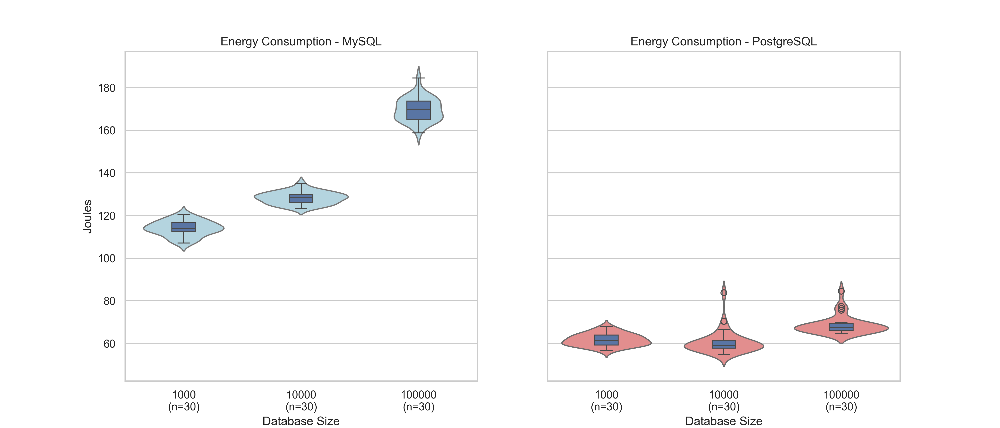
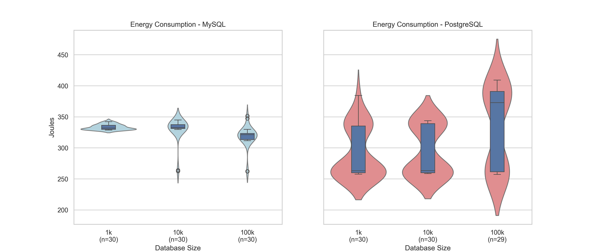
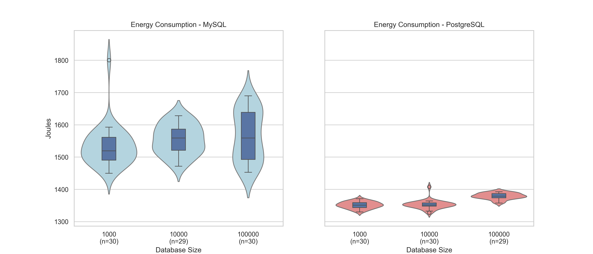

# Comparing the Energy Consumption of Different Database Management Systems
As the issue of global warming persists, there is an increasing necessity for sustainable practice. This, too, is becoming an emerging concern in the ICT sector, which accounts for 14% of the global greenhouse gas emissions by 2040[^greenhouse]. To address this challenge, tech giants such as Google, Amazon, Meta and Microsoft initiated efforts to reduce their carbon footprint – for instance, by utilizing clean energy sources that are generated by solar, wind and nuclear. Nevertheless, clean energy remains a limited resource, and, with the rapid expansion of the ICT sector, the energy being used by data centers often continue to rely heavily on fossil fuels to meet growing energy demands[^fossil]. This highlights the need of shifting our focus to energy efficiency.

At the same time, data plays a pivotal role in data centers. Through it insights can be drawn, innovations can be made, and efficiency can be achieved. With data centers proliferating across various industries and global data generation estimated to reach 402.74 exabytes per day[^datagenerated], it sheds light to the importance of handling these data effectively. Database management systems (DBMS), as fundamental components of data infrastructure, play a key role in storing and managing this vast amount of information.

As regulations tightens and environmental goals become more ambitious, the increasing demand for data centers continue to outpace the availability of clean energy. This is further exacerbated with the proliferation of data centers operations across multiple sectors. Given these constraints, it is essential to explore the energy consumption of different DBMSs, in an effort to optimize the resource allocation of limited resources in data center environments. 

In this blog, we will perform a preliminary study on two different DBMSs. The aim is to measure the energy consumption and its behavior with different configurations.


# Background

## Database Management Systems (DBMS)

DBMS are responsible for managing and retrieving data efficiently. PostgreSQL and MySQL are two widely used open-source relational DBMSs. PostgreSQL is known for its advanced features and data integrity, while MySQL is valued for its speed and ease of use [^databases].

## Database Benchmarks
Database benchmarks are tools used to evaluate the performance, scalability, and efficiency of DBMSs under different workloads [^benchmarks]. They simulate real-world database operations such as read/write queries, transactional processing, and concurrency handling. These benchmarks help identify performance bottlenecks and compare different DBMSs based on standardized metrics like throughput, latency, and resource utilization.

## Sysbench

Sysbench is a versatile, open-source system benchmarking tool primarily designed to evaluate the performance of various system components, such as CPU, memory, and disk I/O [^sysbench]. It provides a range of tests, including those focused on multi-threading, file I/O, and system performance, making it an ideal choice for general system performance evaluation.

Beyond its broad capabilities, Sysbench is particularly well-suited for database benchmarking. It allows users to simulate transactional workloads, stress-test DBMSs, and measure query execution times under varying conditions. This makes it a useful tool for assessing the performance of database systems, helping users understand how their databases will perform under real-world workloads and stress scenarios. Specifically, it provides support for MySQL and PostgreSQL, which are the DBMSs we decided to test in this experiment. 


# Methodology
The goal of our research was to find the energy efficiency of different DBMSs. This would be done by executing a series of queries to various databases and measuring the energy of each. In order to have a comparison against some industry standard benchmarks, we decided to make use of SysBench, an open source database benchmarking software to allow us to perform the tests. 

To measure the energy output of each test, EnergiBridge is run simultaneously with the tests. EnergiBridge records all energy used in the target computer, but so long as we keep everything happening during the tests the same, we should be able to compare results. Keeping the same environment should mean that the energy consumed through regular processes is the same and the only difference in energy output is from the tests performed. It is not perfect, but it is the best method we have to compare. To reduce variance as much as possible, any background processes should also be disabled, and an outline for how this was done can be seen in the ‘disabling processes’ section. This is done to minimize variance due to external factors as much as possible. All compared experiments were also run on the same experimental setup to ensure that no physical differences could impact results. In the end, only a Windows device ran the final experiment, but all setup was also made for a Linux device as tests were performed for an older, now obsolete experiment. 

Initially, experiments were done by simply setting SysBench to execute queries for 1 minute and this output would be recorded, but later a decision was made to test the output for a set amount of queries instead. This was done as simply running it for a fixed duration could also be affected by the rate in which the DBMS completes queries, and as such if the throughput is higher it could potentially show a higher energy usage despite higher efficiency per query. A true use case is also done per query so this was deemed a better signifier than time. 

Energibridge was set to run for a set duration every time. It was decided that even for executions that run for less time than the allocated duration, we would simply record the idle data which fills up the allocated time. This allows us to compare the energy usage by simply looking at the relative difference between them, as this would be the amount of energy that would be saved/consumed by using one DBMS over the other under these conditions. If we were to stop the process 2 seconds earlier in test A than test B, the passive energy output of the device would also influence the results. If the device consumed 20 joules per second while not executing anything, but test A and B consumed the exact same amount of energy per query, then test B would measure an additional 40 joules more than test A despite the energy per query being constant. By continuing for the entire allocated duration, the only measured differences are due to the energy consumed by the queries. 
# Disabling processes
## Linux
A simple restart was performed before execution, wifi and bluetooth were disabled and no applications were running apart from the databases and shell script. 

## Windows
Windows by default has many applications running in the background at all times, and often attempts to make as much use of the system at all times even if it is not strictly necessary. This can influence our test results significantly, and as such a powershell script, ```scripts/win_disable_services.ps1```  was created to disable several services in order to get a more controlled result. This would disable services, create a backup and then restore them after the test was completed. A list of services that are disabled can be seen in the Appendix, section A. Disclaimer: use at your own risk, we cannot guarantee it will have no problems if you would like to run our script.


# Experimental Setup

The experiments require a valid installation of PostgreSQL, MySQL, SysBench and EnergiBridge.

To execute one test, a few requirements must be met: The desired database exists, is accessible to SysBench, it is populated with the appropriate number of tables with their relevant data, and we must be able to record the energy usage of the full test. We will go through the requirements in the order of initial database setup, SysBench setup, and finally EnergiBridge execution. 

Both MySQL and PostgreSQL instances must be created and their respective servers must be running. A user with create, update, insert, delete, and to create references must be available, and have access to the target database. 

Preparing the database for SysBench is done by populating the database with the relevant data for the test using a SysBench ‘populate’ command. The SysBench lua script that is used is oltp_read_write, including some simple read-and-write queries. In the preparation step, the tables with the relevant size are created and populated, but if these tables already exist this process has some complications. As such, we remove all relevant tables from the db before running the populate command. Running is done in the same manner with all the same parameters and will be run on the newly populated database.

EnergiBridge was simply run with a specific time set. It is set to start recording 1 second before we start the SysBench script to ensure that it is recording by the time SysBench begins execution. 

## Configuration
To be able to gather enough data in a timely and relatively unbiased manner, a shell script was made to be able to automatically set everything up as required, and execute it.  This was prepared for both Windows using wsl and a native Linux bash shell script. To avoid any sort of bias, a list of all the execution settings was made and randomly shuffled so the order in which they are executed is random and interleaved, reducing bias in case of random events such as a background process starting up only during the second half of testing for example. 

The exact scripts involve creating 24 tables within the PostgreSQL and MySQL  databases ```(--tables=24)```, with each table containing a set number of rows determined by the ```--table-size=$TABLE_SIZE``` parameter. The table size can be varied to simulate different database loads, with the options being 1,000, 10,000, or 100,000 rows per table. This variation in table size allows for a more granular understanding of how the database handles different data volumes, with larger table sizes increasing the complexity and execution time of queries.
The benchmark is run with a single thread ```(--threads=1)```, ensuring that the performance is measured in a controlled, single-threaded environment, which isolates the database performance without the influence of multi-threading overhead. The number of transactions to be executed is controlled by the ```--events=$NUM_OF_TRANSACTIONS``` parameter, set to 1,000 transactions, which corresponds to 20000 queries. 
To further mitigate statistical anomalies and the influence of random processes, each execution setting is repeated 30 times. This repetition helps to smooth out any unexpected fluctuations and ensures that the results are statistically reliable. Additionally, before the first test execution, a warm-up phase is performed by running a Fibonacci script for 5 minutes, ensuring that the system reaches a stable state. Then, EnergiBridge is set to run for 10 seconds every iteration, during which the database transactions are performed. After each test execution, a 60-second cooldown period is observed to allow the system to recover, ensuring that any residual effects from the previous test (such as temperature changes) do not impact subsequent results. For further instructions on how to run the experiments and generate the results, refer to the ```README.md``` file in our Github Repository [^repo].  

# Result
From the experiments, we have gathered the raw data, processed them, and created a violin boxplot, which can be seen below:



The plot seems to suggest that MySQL consumes more energy overall, as the left plot shows consistently higher energy consumption across all database sizes. Moreover, in the case of MySQL, the energy consumption increases as the database size grows, reaching around 180 Joules for the largest database size. This showcases a clear relation between energy consumption and querying in a database with larger sizes. The distributions are also relatively compact, meaning energy usage is fairly consistent across repetitions. 

An interesting aspect to note is the significantly lower energy consumption by PostgreSQL. The right plot shows much lower energy consumption across all database sizes. Even with the largest database size, PostgreSQL stays below 80 joules, when excluding the outliers. In comparison, MySQL exceeds 160 joules. Moreover, the distribution for PostgreSQL appears wider and more varied, appearing to be more prone to outliers. Suggesting some variability in energy consumption across runs. 

The table below gives us the average energy consumption and the joules per transaction for each configuration. Here, outliers were removed by using the interquartile range method:

| Database Size | MySQL - Avg Energy (J) | MySQL - Joules/Transaction | PostgreSQL - Avg Energy (J) | PostgreSQL - Joules/Transaction |
|---------------|------------------------|----------------------------|-----------------------------|:-------------------------------:|
| 1,000         | 113.947                | 0.114                      | 61.682865                   | 0.062                           |
| 10,000        | 128.221                | 0.123                      | 59.427120                   | 0.059                           |
| 100,000       | 169.754                | 0.170                      | 67.212449                   | 0.067                           |


 
# Discussion
The experiment would suggest that MySQL consistently consumes more energy than PostgreSQL, with energy usage increasing as the database size grows. MySQL also exhibits a more stable energy consumption pattern across runs, while PostgreSQL, despite its lower overall energy usage, shows more variability and outliers. This indicates that while PostgreSQL may be more energy-efficient, its performance in terms of energy use is less predictable.
These findings highlight the importance of energy efficiency when selecting a database management system. For environments where minimizing power consumption is a priority, PostgreSQL appears to be a better option. However, in scenarios where consistency and predictability are more critical, MySQL may still be preferable despite its higher energy usage.

# Limitations
There are some key limitations to consider. One significant factor is that the experiment was conducted with Energybridge running on Windows, while the databases were hosted on WSL. Even though external programs were shut down to reduce interference, the differences between Windows and WSL could have influenced the results. Performing the experiment on other environments might yield a different result. On the tests executed for the obsolete time based test, the linux device had significantly lower energy output, the two machines were different but the difference is so severe that it should still be noted that either windows or the wsl setup may have influenced the results more than desired. These graphs can be seen in Appendix B. 
Additionally, because the experiment was designed with a fixed number of queries rather than a time-based approach, to measure energy consumption, the Energybridge timer was set to 10 seconds, which was arbitrarily chosen. This method introduces potential inaccuracies, as execution times can vary slightly between runs due to system processes or background activity, which may impact the precision of energy measurements. Though it is worth mentioning that in the experiment script steps are taken to ensure that SysBench does not run longer than EnergiBridge.
Another limitation is that the benchmarking tool used only supports MySQL and PostgreSQL, limiting the scope of the analysis, in terms of open source DBMSs. Including additional DBMSs, both relational and non-relational, would provide a more comprehensive understanding of energy efficiency across different systems.


# Appendix

## A - Services we disable in windows before doing the tests with our script.

	# General Services
	"wuauserv",			# Windows Update
	"SysMain",			# Superfetch / SysMain
	"WSearch",			# Windows Search
	"BITS",				# Background Intelligent Transfer Service
	"WerSvc",			# Windows Error Reporting
	"DPS",				# Diagnostic Policy Service
	"DiagTrack",			# Connected User Experiences and Telemetry
	"TermService",			# Remote Desktop Services
	"bthserv",			# Bluetooth Support Service
	"Spooler",			# Print Spooler
	"WinDefend",			# Windows Defender
	"WpnService",			# Windows Push Notifications
	"Widgets",			# Windows Widgets
	"edgeupdate",			# Microsoft Edge Updater
	"edgeupdatem",		# Microsoft Edge Updater
	"WbioSrvc",			# Windows Hello Biometrics
	"RemoteRegistry",		# Remote Registry Service
	"InstallService",		# Microsoft Store Install Service
	"WaaSMedicSvc"		# Windows Update Medic Service

	# Internet Services
	"NlaSvc",			# Network Location Awareness
	"Netman",			# Network Connections
	"Dhcp",			# DHCP Client (Disables automatic IP assignment)
	"Dnscache",			# DNS Client (Prevents domain resolution)
	"WlanSvc",			# WLAN AutoConfig (Disables Wi-Fi)
	"LanmanWorkstation",	# Workstation Service (Disables SMB file sharing)
	"Tcpip",			# TCP/IP Protocol Driver (Kills internet access)
	"SharedAccess",		# Internet Connection Sharing (ICS)

	# Xbox Services
	"XblAuthManager",		# Xbox Live Auth
	"XblGameSave",		# Xbox Game Save
	"XboxNetApiSvc",		# Xbox Networking
	"GamingServices"		# Gaming Services


## Appendix B - Comparison of linux vs windows device energy output for old test

This is a comparison for the total energy output used in the now changed 60 seconds long SysBench test. The first image displays the result as tested on a linux device and the second displays the same experiment run on a windows device using wsl for the SysBench setup.



Linux output. Results generally range from ~250 to 420 J.





Windows output of the same test. Results are universally over 1000 joules higher. These are different devices but the difference is so severe that future tests should be done to see if the wsl setup was influencing more.


---


[^greenhouse]: [Assessing ICT global emissions footprint: Trends to 2040 & recommendations](https://www.researchgate.net/publication/322205565_Assessing_ICT_global_emissions_footprint_Trends_to_2040_recommendations)

[^fossil]: [AI-fuelled cloud storage boom threatens Irish climate targets, report warns](https://www.theguardian.com/world/2024/dec/10/ai-fuelled-cloud-storage-boom-threatens-irish-climate-targets-report-warns)

[^datagenerated]: [Amount of Data Created Daily (2024)](https://explodingtopics.com/blog/data-generated-per-day) 

[^databases]: [A Performance Benchmark for the PostgreSQL and MySQL Databases](https://www.mdpi.com/1999-5903/16/10/382#:~:text=Our%20quantified%20results%20show%20PostgreSQL's,is%20about%2013%20times%20faster)

[^benchmarks]: [Lauca: A Workload Duplicator for Benchmarking Transactional Database Performance](https://ieeexplore.ieee.org/document/10416761)

[^sysbench]: [SysBench manual](https://imysql.com/wp-content/uploads/2014/10/sysbench-manual.pdf)

[^repo]: [GitHub Repository](https://github.com/kahming0/SSE1).