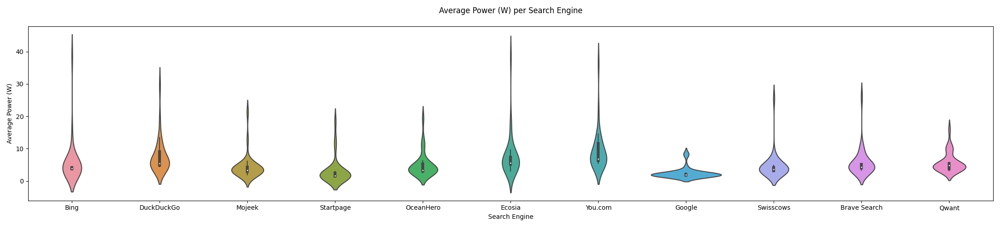

# Introduction

With search engines becoming an inseparable part of our daily digital routines, their environmental impact extends beyond the servers that power them. While mainstream discussions often spotlight the vast energy demands of server farms, a closer look reveals a hidden cost: every search query triggers energy-intensive processes on your personal device, either through the number of requests made or the content that the search engine loads for each of the query results. Just as sustainable software engineering has sparked debates on the energy efficiency of development tools, this post turns the focus to the user's side of the equation, specifically a developer's.

Popular search engines such as Google, Bing, and DuckDuckGo are now being evaluated not only for their performance but also for their energy footprints. For example, recent data shows that Google processes roughly 8.3–8.5 billion searches every day—equating to nearly 96,000 queries per second—which underscores the immense scale of user activity and its cumulative energy demands on personal devices as well as data centers[^searches]. In parallel, sustainability-driven alternatives like Ecosia—renowned for initiatives such as tree planting [^ecosia]—offer a new perspective on digital responsibility. Our analysis zeroes in on the energy consumed by your device—from the instant a query is typed until the results are rendered—capturing metrics like power draw and CPU load.

This investigation raises a pivotal question: How does energy consumption vary across different search engines from the user’s perspective? We hypothesize that platforms optimized with sustainability in mind could reduce the energy demands on individual devices, shifting the focus from large-scale infrastructure to everyday digital interactions. This is not about modifying browser settings or visual themes; it’s about measuring the real-world energy impact of each query. Specifically, from the prespective of a student and a developer, we implore you to think which search engine is the best to use so that our energy usage is at a minimal amount while we continue to access accurate, relevant, and timely information without compromising performance or usability.

In this blog post, we outline our rigorous experimental setup—employing controlled devices and precise energy measurement tools—to offer actionable insights into reducing your digital carbon footprint. Join us as we detail our methodology, unveil our findings, and explore the implications for greener software practices and sustainable digital habits.

# Methodology
### Experimental Overview
We compare 12 different search engines: Google[^google], Bing[^bing], Yahoo[^yahoo], DuckDuckGo[^duckduckgo], Brave Search[^brave], Ecosia[^ecosia], OceanHero[^oceanhero], Startpage[^startpage], Qwant[^qwant], Swisscows[^swisscows], Mojeek[^mojeek],You.com[^youcom]

---

### Research Question and Hypothesis

**Research Question**  
How does energy consumption vary across different search engines during common search activities?

**Hypothesis**  
Search engines optimized for sustainability (e.g., Ecosia) will consume less energy than mainstream alternatives (e.g., Google).

---

### Experiment Setup

#### Software and Hardware
- **Hardware**:
  - **Laptop**: Dell XPS 15 7590  
  - **CPU**: Intel Core i9-9980HK @ 2.40GHz  
  - **RAM**: 16GiB DDR4 @ 2667 MHz  
  - **GPU**: NVIDIA GeForce GTX 1650 Mobile / Max-Q, Intel UHD Graphics 630
  - **OS**: Ubuntu 24.04.2 LTS (linux)
  - **Battery**: DELL GPM0365  
  - **Wi-Fi**: Intel Wi-Fi 6 AX200  
  - **Power Supply**: Dell charger, 19.5V 7.7A  

- **Software**:  
  - **Python (v. 3.19)**: used to write the script to run the automated tests and log/analyze the results
  - **Selenium (v. 4.29.0)**: a python package used to simulate the (Chromium based) browser along with clicks and any realistic input a user would make
  - **EnergiBridge (v. 0.0.7)**: The energy profiler **EnergiBridge**[^energibrigde] is used to measure and log power consumption.  

#### Procedure

Prior to any measurements, the system is placed in a **Zen mode** by closing all applications and unnecessary background services, disabling notifications and removing additional hardware, minimizing CPU and disk activity. This setup minimizes external variables that could otherwise impact energy usage. A brief **warm-up** follows, introducing a CPU-intensive task, calculating a Fibonacci seqeuence, for 5 minutes to bring the system to a consistent operating temperature to ensure more accurate energy measurements.

Under these conditions, **identical search queries** (for instance, “climate change effects”) are performed on each search engine from the prespective of the profile user we chose (a student developer). Based on the article[^developersearches] "The hidden insights in developers’ Google searches", the average developer makes around 16 searches a day, searching for a variety of information like how to use an API, troubleshoot or learn to use a new technology. Due to time constraints we run 1 query "angular route uib tab".

During this process, energy usage, CPU load, and other relevant performance metrics are recorded. To ensure reliability, the test is repeated **30** times and the order of search engines is randomized to avoid systematic bias. After doing a query with a search engine, we wait **60 seconds** before continuing to let the CPU return to normal levels. In addition, an additional **1 minute rest interval** is observed between test iterations so the system can return to an idle state before the next measurement. Due to the experiment's scale, we automated the query search using **Selenium**.

Throughout each iteration, **Energibridge** logs timestamps to mark the start and end of the test window, and all power samples within that interval are aggregated to determine the total energy (in Joules) consumed by the search operation. 

Finally, we employ statistical tests to measure the differences between all the engines and see if our data is valid (as in if they are normal) and if there is any statistical difference.

<!-- Insert description on preliminary results and discovery of cookie/automation time and why baseline was introduced -->
During the initial runs, we observed unexpected variations in the recorded energy consumption. After investigating potential sources of discrepancy, we identified two key factors affecting our measurements:

 1. Cookie and Automation Detection: Search engines often modify their behavior when automated scripts perform queries, sometimes loading additional elements, triggering bot detection mechanisms, or introducing CAPTCHAs. Therefore we had to mimic humanlike behaviour by including random sleeps. This introduces variability in response times and energy consumption.
 2. Baseline Measurement: To differentiate the energy cost of executing a search query from the inherent cost of simply loading the website, we measured the baseline time required to load the search engine's homepage and accept additional cookies without any query search for 30 iterations and averaged them. We then added this baseline time to the start timestamp of our query search experiment so that our results reflects the actual energy consumption solely for executing the query search. 

# Results
In this experiment, we measured energy and power consumption to evaluate the efficiency of various search engines. The distributions of these metrics were analyzed over the 30 iterations—both by calculating their averages and by examining their overall spread. Below is an explanation of how these metrics were derived and a description of their outputs.

## Performance Metrics:

From Energibridge we extracted a variety of metrics, including:

- **Time**: A timestamp (in milliseconds) that indicates when the measurement was taken.
- **Delta**: The elapsed time (in milliseconds) since the previous measurement. This is added as a buffer to the start and end time to map the timestamps because of inconsistencies.
- **Package Energy (J)**: The cumulative energy consumption of the CPU package (in joules). This reflects how much energy the processor has used.
- **Total Memory**: The total amount of system memory available on the machine.

### Energy Consumption & Power
With these metrics we have calculated the following;

**Total Energy consumption** was computed as:   
       
   - Total Energy (J) = `E_end` - `E_begin`  
  
  Where `E_begin` and `E_end` are the energy values at the start and end of executing a query. 

**Power** is the rate at which energy is used, measured in watts (`W`), where 1 W = 1 J/s.
  
  - Power (W) = (`ΔEnergy` / `Δt`) * 1000
    
Here, `ΔEnergy` is the difference between consecutive energy measurements (in joules) and `Δt` is the time difference (in milliseconds) for the duration of the query execution.

The plots show the distribution of `Average Power (W)` and `Total Energy (J)` across 30 iterations for each search engine, with violin plots illustrating the density of values.
<!-- Violin plots side-by-side -->

  
  

###### Figure 1: Violin plots for the distribution per search engine for the metrics average power and total energy consumed 

To further illustrate how these metrics affect efficiency, we also examined the temporal behavior of the power values and the total energy averaged over the 30 iterations. The line plot shows the average power (W) over time (in seconds), highlighting power-consumption patterns, while the histogram summarizes each search engine’s overall energy usage by displaying the average total energy (J).
<!-- Aggregated metrics and histogram side-by-side -->

  
  

###### Figure 2: a) Average power over time  b) a histogram for the total energy per search engine 

### Energy Delay Product (EDP)
  As can be seen from figure 2a) time plays an signifcant role in our experiment. That is why we also measured the EDP. It is a metric that balances energy efficiency and execution speed. It is defined as:

EDP = `E` * `t`^`w`

where `E` is the total energy and `t` the duration. `w` is an exponent that emphasizes the impact of execution time on overall efficiency. It represents the weight given to the execution time. It can take on different values depending on the focus of the measurement: 
   - w = 1: Emphasizes energy efficiency, which is ideal when minimizing energy consumption is the   primary concern.
   - w = 2: Provides a balanced view, considering both energy consumption and performance.
   - w = 3: Focuses on performance efficiency, placing greater importance on faster execution times.

We chose w = 1 as our main value to prioritize energy efficiency in our analysis.
<!-- Energy Delay Product image -->
This plot illustrates the distribution of EDP values for `w=1` across all iterations per search engine. It highlights the variability and central tendency of EDP, showing how energy efficiency trades off with execution time.

  

###### Figure 3: Energy Delay Product per search engine

## Additional Factors
The bar plot quantifies the percentage of Selenium overhead versus actual query time in raw duration, showing its influence on measurements and the importance of baseline subtraction. The memory plot tracks average used memory over time, providing context on resource utilization alongside energy metrics.
<!-- Selenium impact image -->

  
<!-- 

<!-- Memory image -->
<!-- 
 -->
  

###### Figure 4: a) Percentage of baseline duration to the total query search duration  b) Memory usage per search engine

## Analysis
The analysis leverages statistical tests and pairwise comparisons to evaluate differences in energy and power metrics across search engines. 
## Percentage comparison
Heatmaps visualize these comparisons:
- These show the percentage change in `Average Power (W)` and `Total Energy (J)` between pairs of search engines, with color intensity indicating the magnitude of difference. Positive values indicate Engine B consumes more than Engine A, and vice versa.

<!-- Heatmaps side-by-side -->
<!-- Heatmaps side-by-side -->

  
  

###### Figure 5: a) Heatmap comparsion of Average Power percentage change  b) Total Energy percentage change

## Statistical Evaluation  
The statistical evaluation of the energy and power metrics provides insight into the differences between search engines and the reliability of these differences.

### Normality Assessment

For each search engine, the Shapiro–Wilk test was used to determine if the data for `Average Power (W)` and `Total Energy (J)` are normally distributed:

- **A p-value < 0.05** indicates that the data does not follow a normal distribution.
- When data is non-normal, it suggests that the underlying distributions have outliers or are skewed, which can impact the choice of statistical tests for further analysis.

The table below summarizes the test statistics and corresponding p-values for each search engine for the two metrics. For instance, some search engines have very low p-values (e.g., DuckDuckGo with p-value 8.72 *10^-6 for Average Power), indicating a significant departure from normality, whereas others like Bing have higher p-values, suggesting the data for those metrics are closer to normally distributed.
  
| Metric                         |     Bing |   Brave Search |   DuckDuckGo |     Ecosia |    Google |    Mojeek |   OceanHero |     Qwant |   Startpage |   Swisscows |     You.com |
|:-------------------------------|---------:|---------------:|-------------:|-----------:|----------:|----------:|------------:|----------:|------------:|------------:|------------:|
| Average Power (W) - Stat       | 0.958493 |     0.972241   |  0.733245    | 0.88404    | 0.92902   | 0.913593  | 0.788108    | 0.913853  | 0.756176    |   0.92663   | 0.760878    |
| Average Power (W) - p-value    | 0.408906 |     0.722376   |  8.71619e-06 | 0.00701417 | 0.0734411 | 0.0241558 | 0.000111283 | 0.0427885 | 3.45185e-05 |   0.0644427 | 2.3474e-05  |
| Total Energy (J) - Stat        | 0.960868 |     0.883144   |  0.933326    | 0.902688   | 0.9719    | 0.923369  | 0.817257    | 0.936237  | 0.74704     |   0.973414  | 0.713108    |
| Total Energy (J) - p-value     | 0.456122 |     0.00671238 |  0.103737    | 0.015419   | 0.67303   | 0.0476219 | 0.000276575 | 0.134423  | 1.88191e-05 |   0.712884  | 3.26145e-06 |

###### Table 1: Shapiro-Wilik test result for the metrics Average Power (w) and Total Energy (J) per search engine (the data has outliers removed)

## Pairwise Comparisons and Effect Size
Once normality is assessed, pairwise comparisons between search engines are performed to understand the differences in energy consumption and power usage. The analysis employs:

- **Welch's t-test** for normally distributed data.
- **Mann–Whitney U test** for non-normal data.

Along with the significance tests (using a threshold of p < 0.05 to denote statistical significance), effect sizes are calculated to quantify the magnitude of the differences. Effect sizes, such as Cohen's d for normal data or common effect size (U1/(N1*N2) for non-normal data, provide a standardized measure to compare differences across groups. They help answer not just whether a difference is statistically significant, but also how large that difference is in practical terms.

### Visualizing Effect Size and Significance

The scatter plot visualizes the effect sizes along with the significance levels:

- **Points with larger effect sizes** indicate more substantial differences between search engines.
- The visualization helps to quickly identify which comparisons are both statistically significant (i.e., \(p < 0.05\)) and meaningful in magnitude.

<!-- Effect size image -->

  

###### Figure 6: Statistical signifance check for normal data via Welch's test (left side) and non normal data Nabb-Whitney U (right side) against effect size. 

### Importance of the Findings

Understanding both the statistical significance and the effect size is crucial:
- **Statistical significance** tells us if the observed differences are unlikely to be due to chance.
- **Effect size** reveals the practical importance of these differences. This dual insight is vital for making informed decisions about which search engines are more energy efficient or perform better in terms of power consumption.

The departure from normality is mainly due to the random waiting times implemented to bypass bot detection, which introduces variability in the energy and power measurements. Additionally, delayed DOM node loading and potential memory leaks, as observed with Ecosia’s increasing memory usage, further contribute to inconsistencies. These factors create irregular fluctuations in resource consumption, leading to skewed distributions and outliers in the data that depend on the run and can't always be automatically removed (from furthe reruns).

In summary, the statistical evaluation not only confirms that there are measurable differences in energy and power metrics among search engines but also highlights the extent of these differences. This comprehensive approach ensures that the conclusions drawn are robust and meaningful for real-world applications.

# Discussion and Future Work

- **Interpretation of Results:**  
The results highlight significant differences in energy consumption, response time, and power usage across search engines, with some engines demonstrating consistently higher resource demands. Startpage exhibits the longest response times and the highest energy delay product (EDP) across all weighting factors, suggesting that its privacy-focused architecture may introduce additional processing overhead. Meanwhile, Ecosia shows an early and steep rise in power consumption within the first few seconds of a query, which may indicate intensive initial computations or resource-heavy query handling. In contrast, OceanHero maintains a more consistent energy level over time, suggesting that its search mechanism is more evenly distributed in terms of power usage. The scatter plots confirm that Ecosia and Startpage are among the highest in total energy consumption per query, while other search engines exhibit more stable patterns.

A key pattern in the results is the relationship between response time and energy efficiency. For most search engines, average power consumption decreases as duration increases, implying a more optimized energy distribution over time. However, Startpage deviates from this trend by showing an increase in power usage after six seconds, suggesting additional post-processing or a delayed retrieval mechanism. Violin plots further reinforce that Ecosia, Bing, and You.com display greater variability in power consumption, whereas Google and Mojeek maintain relatively stable energy profiles. Notably, while Google is known for data-heavy operations, its total energy consumption is among the lowest, alongside Mojeek. On the other hand, You.com emerges as the most energy-demanding search engine overall, followed closely by Bing, suggesting that some search engines prioritize search features or user interface enhancements over efficiency.

Comparative analysis across search engines supports these trends, particularly in percentage change comparisons of power and total energy. The largest differences are observed when comparing You.com with other search engines, reinforcing its higher energy consumption per query. Additionally, memory usage trends highlight Ecosia’s pronounced peak early in the search process, while Startpage shows a delayed but sharp increase after six seconds, indicating that different search engines may allocate resources at different stages of query execution. These findings suggest that sustainability in search engines is not just about total energy consumption but also how and when power is utilized. While some search engines optimize for fast response times with minimal energy use, others may sacrifice efficiency for enhanced privacy, features, or rendering.

- **Limitations:**
One of the key limitations of this study is that it only considers the client-side energy consumption, meaning the power usage of the user's device while performing search queries. However, search engines rely on extensive backend infrastructure, including data centers, caching mechanisms, and network requests, which also contribute significantly to their overall energy footprint. Since this study does not have access to backend server energy consumption data, it presents only a partial view of the environmental impact of different search engines. Future research would benefit from incorporating end-to-end energy consumption analysis, including network energy usage and server-side power draw, to provide a more holistic comparison of search engine sustainability.

Another limitation is the controlled testing environment, which does not fully replicate real-world usage conditions. The experiment was conducted with a fixed set of developer-focused queries, a single test system, and under an isolated "Zen mode" to minimize background noise. However, in everyday scenarios, search engine energy consumption could be influenced by factors such as hardware variations, network conditions, browser configurations, and concurrent background processes. Additionally, packet loss and TCP retransmissions were reported during testing, requiring additional CPU work and increasing energy usage in some cases. Poor network conditions can introduce inconsistencies in energy consumption, making it difficult to isolate search engine efficiency from network-related inefficiencies. These external factors may cause differences in energy efficiency that this study does not account for, limiting the generalizability of the results to a broader audience.

A further limitation resulted from the methodological adjustments required during the experimental design. Originally, the plan was to execute 16 queries per iteration. However, given that executing 16 queries would have required: query duration * 16 * 12 * 60-second wait per query * 30 iterations, plus an additional 30 minutes of total  waiting time of the 1 min wait per iteration + the uniform sleeps to appear more humanlike in the selenium queries —the estimated total runtime would have been roughly 100 hours. Consequently, the experiment was reduced to a single query per iteration. It could be debated that query-side handling is managed on the search engine side rather than on the client side, and therefore might not be applicable to our study; however, this remains a methodological constraint.

Another practical challenge encountered was the failure of Yahoo when using Selenium. Inspection of the process revealed that Yahoo's homepage contained a large number of advertisements, which made it difficult to reliably locate the search bar within the imposed 15-second timeout constraint.

Finally, an important limitation concerns the timing of the baseline measurements relative to the actual experiments. The baseline measurements were taken during peak usage hours, whereas the main experiment was conducted overnight during off-peak hours. As a result, the baseline measurement (which did not include the query search component) exceeded the total duration (loading page, accepting cookies, and performing the query search) recorded during off-peak hours. This discrepancy was particularly evident in the data for Ecosia. Since rerunning the experiment was not feasible, we accounted for this by dividing the baseline measurement by a factor of **4**, based on a study [^peak] that found mean response times for search engines ranged from 2 to 9 seconds during off-peak hours, while during peak hours, the response time increased to 15 seconds and in some cases reached up to 30 seconds.
  
- **Future Research:**  
Future research should explore a more comprehensive measurement approach that includes both client-side and server-side energy consumption. Collaborating with search engine providers or leveraging publicly available data on server energy usage could help assess the total environmental cost of search queries. Additionally, measuring the energy impact of different types of searches (e.g., text vs. image/video searches) and incorporating network-level energy consumption (such as data transfer between the user and the search engine) would provide a more complete understanding of search engine sustainability.

Another promising direction for future work is expanding the scope of testing across different user conditions. This could involve testing on a range of devices (laptops, desktops, smartphones), varying internet speeds, and different browser types to analyze how search engine energy consumption changes under diverse circumstances. In addition to this, exploring how search engine settings—such as enabling dark mode, reducing JavaScript execution, or using lightweight search alternatives—impact energy efficiency could offer actionable recommendations for reducing digital carbon footprints. Lastly, with the rise of AI-powered search engines like Perplexity AI or ChatGPT-based search tools, future studies should investigate whether AI-driven search assistance consumes more or less energy compared to traditional keyword-based search engines.

Another addition to one of the plots was temperature measurements. Temperature measurements were taken using a Mac laptop’s built-in thermal sensors, but the results were similar across search engines and did not contribute significantly to the analysis. Future research could explore longer-term trends or external factors to assess their impact on energy efficiency.

And finally, future work could explore the sustainability impact of cookies, as some search engines required a baseline measurement due to automation protection. Investigating how cookies influence energy consumption and whether they introduce inefficiencies could provide further insights into the hidden environmental costs of web tracking.

# Conclusion
The study reveals significant variations in energy efficiency across search engines, with Startpage displaying the longest response times and highest energy delay product, likely due to its privacy-focused design, while Ecosia exhibited an initial power spike, suggesting intensive early-stage computations. Contrary to expectations, Google and Mojeek were among the most energy-efficient, while You.com and Bing consumed the most energy per query. These findings indicate that search engine sustainability is shaped not only by total energy consumption but also by backend processing and query execution strategies. However, the study's focus on client-side energy use excludes backend infrastructure, and network inconsistencies such as packet loss may have influenced results. Additionally, automation protection required the use of a baseline mechanism, highlighting the potential sustainability impact of web tracking practices. Future research should expand the scope to include server-side energy consumption, explore network-level energy efficiency, and investigate the environmental impact of cookies and tracking mechanisms to provide a more comprehensive understanding of sustainable search engine usage.

# Replication Package

For researchers interested in replicating this study, the complete replication package is available at our GitHub repository [^replication].

# Appendix

  
Click to Expand Table

| Metric           | Engine A     | Engine B     |   Mean A |   Mean B | Test Used      |   Statistic |     p-value |   Effect Size |   Percentage Change (%) |   Effect Size (non normal) |   Effect Size (Cohen's d) | Significant   |
|:-----------------|:-------------|:-------------|---------:|---------:|:---------------|------------:|------------:|--------------:|------------------------:|---------------------------:|--------------------------:|:--------------|
| Total Energy (J) | Bing         | DuckDuckGo   | 21.5772  | 17.4906  | Welch t-test   |    0.89813  | 0.37433     |     0.231896  |              -18.9397   |                nan         |                       nan |               |
| Total Energy (J) | Bing         | Mojeek       | 21.5772  |  7.21708 | Mann-Whitney U |  849        | 3.82489e-09 |   nan         |              -66.5523   |                  0.943333  |                       nan | *             |
| Total Energy (J) | Bing         | Startpage    | 21.5772  | 20.6812  | Mann-Whitney U |  662        | 0.00176656  |   nan         |               -4.15294  |                  0.735556  |                       nan | *             |
| Total Energy (J) | Bing         | OceanHero    | 21.5772  | 20.6523  | Mann-Whitney U |  522        | 0.290472    |   nan         |               -4.28657  |                  0.58      |                       nan |               |
| Total Energy (J) | Bing         | Ecosia       | 21.5772  | 15.552   | Mann-Whitney U |  751        | 8.88288e-06 |   nan         |              -27.924    |                  0.834444  |                       nan | *             |
| Total Energy (J) | Bing         | You.com      | 21.5772  | 27.588   | Mann-Whitney U |  133        | 2.87897e-06 |   nan         |               27.8569   |                  0.147778  |                       nan | *             |
| Total Energy (J) | Bing         | Google       | 21.5772  |  7.56281 | Welch t-test   |    3.3247   | 0.00223966  |     0.858434  |              -64.9501   |                nan         |                       nan | *             |
| Total Energy (J) | Bing         | Swisscows    | 21.5772  | 13.2545  | Welch t-test   |    1.82485  | 0.0752236   |     0.471174  |              -38.5716   |                nan         |                       nan |               |
| Total Energy (J) | Bing         | Brave Search | 21.5772  | 13.6639  | Mann-Whitney U |  741        | 1.74791e-05 |   nan         |              -36.6745   |                  0.823333  |                       nan | *             |
| Total Energy (J) | Bing         | Qwant        | 21.5772  | 13.0082  | Welch t-test   |    2.01505  | 0.0521408   |     0.520285  |              -39.7135   |                nan         |                       nan |               |
| Total Energy (J) | DuckDuckGo   | Bing         | 17.4906  | 21.5772  | Welch t-test   |   -0.89813  | 0.37433     |    -0.231896  |               23.365    |                nan         |                       nan |               |
| Total Energy (J) | DuckDuckGo   | Mojeek       | 17.4906  |  7.21708 | Mann-Whitney U |  830        | 2.01522e-08 |   nan         |              -58.7373   |                  0.922222  |                       nan | *             |
| Total Energy (J) | DuckDuckGo   | Startpage    | 17.4906  | 20.6812  | Mann-Whitney U |  557        | 0.115362    |   nan         |               18.2417   |                  0.618889  |                       nan |               |
| Total Energy (J) | DuckDuckGo   | OceanHero    | 17.4906  | 20.6523  | Mann-Whitney U |  399        | 0.455297    |   nan         |               18.0768   |                  0.443333  |                       nan |               |
| Total Energy (J) | DuckDuckGo   | Ecosia       | 17.4906  | 15.552   | Mann-Whitney U |  595        | 0.0326509   |   nan         |              -11.0834   |                  0.661111  |                       nan | *             |
| Total Energy (J) | DuckDuckGo   | You.com      | 17.4906  | 27.588   | Mann-Whitney U |  157        | 1.52917e-05 |   nan         |               57.7306   |                  0.174444  |                       nan | *             |
| Total Energy (J) | DuckDuckGo   | Google       | 17.4906  |  7.56281 | Welch t-test   |    4.64394  | 3.48923e-05 |     1.19906   |              -56.7607   |                nan         |                       nan | *             |
| Total Energy (J) | DuckDuckGo   | Swisscows    | 17.4906  | 13.2545  | Welch t-test   |    1.53633  | 0.129895    |     0.39668   |              -24.2189   |                nan         |                       nan |               |
| Total Energy (J) | DuckDuckGo   | Brave Search | 17.4906  | 13.6639  | Mann-Whitney U |  643        | 0.00442719  |   nan         |              -21.8785   |                  0.714444  |                       nan | *             |
| Total Energy (J) | DuckDuckGo   | Qwant        | 17.4906  | 13.0082  | Welch t-test   |    2.02788  | 0.0485116   |     0.523597  |              -25.6276   |                nan         |                       nan | *             |
| Total Energy (J) | Mojeek       | Bing         |  7.21708 | 21.5772  | Mann-Whitney U |   51        | 3.82489e-09 |   nan         |              198.975    |                  0.0566667 |                       nan | *             |
| Total Energy (J) | Mojeek       | DuckDuckGo   |  7.21708 | 17.4906  | Mann-Whitney U |   70        | 2.01522e-08 |   nan         |              142.35     |                  0.0777778 |                       nan | *             |
| Total Energy (J) | Mojeek       | Startpage    |  7.21708 | 20.6812  | Mann-Whitney U |   89        | 9.83289e-08 |   nan         |              186.558    |                  0.0988889 |                       nan | *             |
| Total Energy (J) | Mojeek       | OceanHero    |  7.21708 | 20.6523  | Mann-Whitney U |   47        | 2.66947e-09 |   nan         |              186.159    |                  0.0522222 |                       nan | *             |
| Total Energy (J) | Mojeek       | Ecosia       |  7.21708 | 15.552   | Mann-Whitney U |   91        | 1.15665e-07 |   nan         |              115.489    |                  0.101111  |                       nan | *             |
| Total Energy (J) | Mojeek       | You.com      |  7.21708 | 27.588   | Mann-Whitney U |   22        | 2.60985e-10 |   nan         |              282.26     |                  0.0244444 |                       nan | *             |
| Total Energy (J) | Mojeek       | Google       |  7.21708 |  7.56281 | Mann-Whitney U |  385        | 0.340288    |   nan         |                4.79038  |                  0.427778  |                       nan |               |
| Total Energy (J) | Mojeek       | Swisscows    |  7.21708 | 13.2545  | Mann-Whitney U |   98        | 2.02829e-07 |   nan         |               83.6552   |                  0.108889  |                       nan | *             |
| Total Energy (J) | Mojeek       | Brave Search |  7.21708 | 13.6639  | Mann-Whitney U |  108        | 4.44405e-07 |   nan         |               89.3272   |                  0.12      |                       nan | *             |
| Total Energy (J) | Mojeek       | Qwant        |  7.21708 | 13.0082  | Mann-Whitney U |  115        | 7.59915e-07 |   nan         |               80.2413   |                  0.127778  |                       nan | *             |
| Total Energy (J) | Startpage    | Bing         | 20.6812  | 21.5772  | Mann-Whitney U |  238        | 0.00176656  |   nan         |                4.33288  |                  0.264444  |                       nan | *             |
| Total Energy (J) | Startpage    | DuckDuckGo   | 20.6812  | 17.4906  | Mann-Whitney U |  343        | 0.115362    |   nan         |              -15.4275   |                  0.381111  |                       nan |               |
| Total Energy (J) | Startpage    | Mojeek       | 20.6812  |  7.21708 | Mann-Whitney U |  811        | 9.83289e-08 |   nan         |              -65.1031   |                  0.901111  |                       nan | *             |
| Total Energy (J) | Startpage    | OceanHero    | 20.6812  | 20.6523  | Mann-Whitney U |  234        | 0.00144233  |   nan         |               -0.139417 |                  0.26      |                       nan | *             |
| Total Energy (J) | Startpage    | Ecosia       | 20.6812  | 15.552   | Mann-Whitney U |  415        | 0.610008    |   nan         |              -24.801    |                  0.461111  |                       nan |               |
| Total Energy (J) | Startpage    | You.com      | 20.6812  | 27.588   | Mann-Whitney U |  125        | 1.60621e-06 |   nan         |               33.3968   |                  0.138889  |                       nan | *             |
| Total Energy (J) | Startpage    | Google       | 20.6812  |  7.56281 | Mann-Whitney U |  811        | 9.83289e-08 |   nan         |              -63.4314   |                  0.901111  |                       nan | *             |
| Total Energy (J) | Startpage    | Swisscows    | 20.6812  | 13.2545  | Mann-Whitney U |  494        | 0.520145    |   nan         |              -35.91     |                  0.548889  |                       nan |               |
| Total Energy (J) | Startpage    | Brave Search | 20.6812  | 13.6639  | Mann-Whitney U |  533        | 0.222573    |   nan         |              -33.9307   |                  0.592222  |                       nan |               |
| Total Energy (J) | Startpage    | Qwant        | 20.6812  | 13.0082  | Mann-Whitney U |  425        | 0.717189    |   nan         |              -37.1014   |                  0.472222  |                       nan |               |
| Total Energy (J) | OceanHero    | Bing         | 20.6523  | 21.5772  | Mann-Whitney U |  378        | 0.290472    |   nan         |                4.47854  |                  0.42      |                       nan |               |
| Total Energy (J) | OceanHero    | DuckDuckGo   | 20.6523  | 17.4906  | Mann-Whitney U |  501        | 0.455297    |   nan         |              -15.3094   |                  0.556667  |                       nan |               |
| Total Energy (J) | OceanHero    | Mojeek       | 20.6523  |  7.21708 | Mann-Whitney U |  853        | 2.66947e-09 |   nan         |              -65.0544   |                  0.947778  |                       nan | *             |
| Total Energy (J) | OceanHero    | Startpage    | 20.6523  | 20.6812  | Mann-Whitney U |  666        | 0.00144233  |   nan         |                0.139611 |                  0.74      |                       nan | *             |
| Total Energy (J) | OceanHero    | Ecosia       | 20.6523  | 15.552   | Mann-Whitney U |  709        | 0.000132495 |   nan         |              -24.696    |                  0.787778  |                       nan | *             |
| Total Energy (J) | OceanHero    | You.com      | 20.6523  | 27.588   | Mann-Whitney U |  225        | 0.000903069 |   nan         |               33.583    |                  0.25      |                       nan | *             |
| Total Energy (J) | OceanHero    | Google       | 20.6523  |  7.56281 | Mann-Whitney U |  845        | 5.46175e-09 |   nan         |              -63.3803   |                  0.938889  |                       nan | *             |
| Total Energy (J) | OceanHero    | Swisscows    | 20.6523  | 13.2545  | Mann-Whitney U |  774        | 1.72903e-06 |   nan         |              -35.8205   |                  0.86      |                       nan | *             |
| Total Energy (J) | OceanHero    | Brave Search | 20.6523  | 13.6639  | Mann-Whitney U |  712        | 0.000110577 |   nan         |              -33.8384   |                  0.791111  |                       nan | *             |
| Total Energy (J) | OceanHero    | Qwant        | 20.6523  | 13.0082  | Mann-Whitney U |  704        | 0.000178356 |   nan         |              -37.0136   |                  0.782222  |                       nan | *             |
| Total Energy (J) | Ecosia       | Bing         | 15.552   | 21.5772  | Mann-Whitney U |  149        | 8.88288e-06 |   nan         |               38.7424   |                  0.165556  |                       nan | *             |
| Total Energy (J) | Ecosia       | DuckDuckGo   | 15.552   | 17.4906  | Mann-Whitney U |  305        | 0.0326509   |   nan         |               12.465    |                  0.338889  |                       nan | *             |
| Total Energy (J) | Ecosia       | Mojeek       | 15.552   |  7.21708 | Mann-Whitney U |  809        | 1.15665e-07 |   nan         |              -53.5939   |                  0.898889  |                       nan | *             |
| Total Energy (J) | Ecosia       | Startpage    | 15.552   | 20.6812  | Mann-Whitney U |  485        | 0.610008    |   nan         |               32.9805   |                  0.538889  |                       nan |               |
| Total Energy (J) | Ecosia       | OceanHero    | 15.552   | 20.6523  | Mann-Whitney U |  191        | 0.000132495 |   nan         |               32.7951   |                  0.212222  |                       nan | *             |
| Total Energy (J) | Ecosia       | You.com      | 15.552   | 27.588   | Mann-Whitney U |   79        | 4.31061e-08 |   nan         |               77.3917   |                  0.0877778 |                       nan | *             |
| Total Energy (J) | Ecosia       | Google       | 15.552   |  7.56281 | Mann-Whitney U |  793        | 4.11271e-07 |   nan         |              -51.3709   |                  0.881111  |                       nan | *             |
| Total Energy (J) | Ecosia       | Swisscows    | 15.552   | 13.2545  | Mann-Whitney U |  532        | 0.22823     |   nan         |              -14.7728   |                  0.591111  |                       nan |               |
| Total Energy (J) | Ecosia       | Brave Search | 15.552   | 13.6639  | Mann-Whitney U |  526        | 0.264326    |   nan         |              -12.1407   |                  0.584444  |                       nan |               |
| Total Energy (J) | Ecosia       | Qwant        | 15.552   | 13.0082  | Mann-Whitney U |  438        | 0.864994    |   nan         |              -16.3571   |                  0.486667  |                       nan |               |
| Total Energy (J) | You.com      | Bing         | 27.588   | 21.5772  | Mann-Whitney U |  767        | 2.87897e-06 |   nan         |              -21.7876   |                  0.852222  |                       nan | *             |
| Total Energy (J) | You.com      | DuckDuckGo   | 27.588   | 17.4906  | Mann-Whitney U |  743        | 1.52917e-05 |   nan         |              -36.6008   |                  0.825556  |                       nan | *             |
| Total Energy (J) | You.com      | Mojeek       | 27.588   |  7.21708 | Mann-Whitney U |  878        | 2.60985e-10 |   nan         |              -73.8398   |                  0.975556  |                       nan | *             |
| Total Energy (J) | You.com      | Startpage    | 27.588   | 20.6812  | Mann-Whitney U |  775        | 1.60621e-06 |   nan         |              -25.0357   |                  0.861111  |                       nan | *             |
| Total Energy (J) | You.com      | OceanHero    | 27.588   | 20.6523  | Mann-Whitney U |  675        | 0.000903069 |   nan         |              -25.1402   |                  0.75      |                       nan | *             |
| Total Energy (J) | You.com      | Ecosia       | 27.588   | 15.552   | Mann-Whitney U |  821        | 4.31061e-08 |   nan         |              -43.6276   |                  0.912222  |                       nan | *             |
| Total Energy (J) | You.com      | Google       | 27.588   |  7.56281 | Mann-Whitney U |  858        | 1.69472e-09 |   nan         |              -72.5866   |                  0.953333  |                       nan | *             |
| Total Energy (J) | You.com      | Swisscows    | 27.588   | 13.2545  | Mann-Whitney U |  814        | 7.69496e-08 |   nan         |              -51.9554   |                  0.904444  |                       nan | *             |
| Total Energy (J) | You.com      | Brave Search | 27.588   | 13.6639  | Mann-Whitney U |  803        | 1.8731e-07  |   nan         |              -50.4716   |                  0.892222  |                       nan | *             |
| Total Energy (J) | You.com      | Qwant        | 27.588   | 13.0082  | Mann-Whitney U |  805        | 1.59641e-07 |   nan         |              -52.8485   |                  0.894444  |                       nan | *             |
| Total Energy (J) | Google       | Bing         |  7.56281 | 21.5772  | Welch t-test   |   -3.3247   | 0.00223966  |    -0.858434  |              185.307    |                nan         |                       nan | *             |
| Total Energy (J) | Google       | DuckDuckGo   |  7.56281 | 17.4906  | Welch t-test   |   -4.64394  | 3.48923e-05 |    -1.19906   |              131.271    |                nan         |                       nan | *             |
| Total Energy (J) | Google       | Mojeek       |  7.56281 |  7.21708 | Mann-Whitney U |  515        | 0.340288    |   nan         |               -4.57139  |                  0.572222  |                       nan |               |
| Total Energy (J) | Google       | Startpage    |  7.56281 | 20.6812  | Mann-Whitney U |   89        | 9.83289e-08 |   nan         |              173.459    |                  0.0988889 |                       nan | *             |
| Total Energy (J) | Google       | OceanHero    |  7.56281 | 20.6523  | Mann-Whitney U |   55        | 5.46175e-09 |   nan         |              173.077    |                  0.0611111 |                       nan | *             |
| Total Energy (J) | Google       | Ecosia       |  7.56281 | 15.552   | Mann-Whitney U |  107        | 4.11271e-07 |   nan         |              105.638    |                  0.118889  |                       nan | *             |
| Total Energy (J) | Google       | You.com      |  7.56281 | 27.588   | Mann-Whitney U |   42        | 1.69472e-09 |   nan         |              264.785    |                  0.0466667 |                       nan | *             |
| Total Energy (J) | Google       | Swisscows    |  7.56281 | 13.2545  | Welch t-test   |   -2.63484  | 0.0118451   |    -0.680313  |               75.2596   |                nan         |                       nan | *             |
| Total Energy (J) | Google       | Brave Search |  7.56281 | 13.6639  | Mann-Whitney U |  102        | 2.78287e-07 |   nan         |               80.6723   |                  0.113333  |                       nan | *             |
| Total Energy (J) | Google       | Qwant        |  7.56281 | 13.0082  | Welch t-test   |   -3.89961  | 0.000258301 |    -1.00688   |               72.0017   |                nan         |                       nan | *             |
| Total Energy (J) | Swisscows    | Bing         | 13.2545  | 21.5772  | Welch t-test   |   -1.82485  | 0.0752236   |    -0.471174  |               62.7912   |                nan         |                       nan |               |
| Total Energy (J) | Swisscows    | DuckDuckGo   | 13.2545  | 17.4906  | Welch t-test   |   -1.53633  | 0.129895    |    -0.39668   |               31.9591   |                nan         |                       nan |               |
| Total Energy (J) | Swisscows    | Mojeek       | 13.2545  |  7.21708 | Mann-Whitney U |  802        | 2.02829e-07 |   nan         |              -45.5501   |                  0.891111  |                       nan | *             |
| Total Energy (J) | Swisscows    | Startpage    | 13.2545  | 20.6812  | Mann-Whitney U |  406        | 0.520145    |   nan         |               56.0306   |                  0.451111  |                       nan |               |
| Total Energy (J) | Swisscows    | OceanHero    | 13.2545  | 20.6523  | Mann-Whitney U |  126        | 1.72903e-06 |   nan         |               55.8131   |                  0.14      |                       nan | *             |
| Total Energy (J) | Swisscows    | Ecosia       | 13.2545  | 15.552   | Mann-Whitney U |  368        | 0.22823     |   nan         |               17.3335   |                  0.408889  |                       nan |               |
| Total Energy (J) | Swisscows    | You.com      | 13.2545  | 27.588   | Mann-Whitney U |   86        | 7.69496e-08 |   nan         |              108.14     |                  0.0955556 |                       nan | *             |
| Total Energy (J) | Swisscows    | Google       | 13.2545  |  7.56281 | Welch t-test   |    2.63484  | 0.0118451   |     0.680313  |              -42.9418   |                nan         |                       nan | *             |
| Total Energy (J) | Swisscows    | Brave Search | 13.2545  | 13.6639  | Mann-Whitney U |  457        | 0.923442    |   nan         |                3.08841  |                  0.507778  |                       nan |               |
| Total Energy (J) | Swisscows    | Qwant        | 13.2545  | 13.0082  | Welch t-test   |    0.110385 | 0.912598    |     0.0285014 |               -1.85888  |                nan         |                       nan |               |
| Total Energy (J) | Brave Search | Bing         | 13.6639  | 21.5772  | Mann-Whitney U |  159        | 1.74791e-05 |   nan         |               57.9142   |                  0.176667  |                       nan | *             |
| Total Energy (J) | Brave Search | DuckDuckGo   | 13.6639  | 17.4906  | Mann-Whitney U |  257        | 0.00442719  |   nan         |               28.0057   |                  0.285556  |                       nan | *             |
| Total Energy (J) | Brave Search | Mojeek       | 13.6639  |  7.21708 | Mann-Whitney U |  792        | 4.44405e-07 |   nan         |              -47.1814   |                  0.88      |                       nan | *             |
| Total Energy (J) | Brave Search | Startpage    | 13.6639  | 20.6812  | Mann-Whitney U |  367        | 0.222573    |   nan         |               51.3561   |                  0.407778  |                       nan |               |
| Total Energy (J) | Brave Search | OceanHero    | 13.6639  | 20.6523  | Mann-Whitney U |  188        | 0.000110577 |   nan         |               51.1451   |                  0.208889  |                       nan | *             |
| Total Energy (J) | Brave Search | Ecosia       | 13.6639  | 15.552   | Mann-Whitney U |  374        | 0.264326    |   nan         |               13.8183   |                  0.415556  |                       nan |               |
| Total Energy (J) | Brave Search | You.com      | 13.6639  | 27.588   | Mann-Whitney U |   97        | 1.8731e-07  |   nan         |              101.904    |                  0.107778  |                       nan | *             |
| Total Energy (J) | Brave Search | Google       | 13.6639  |  7.56281 | Mann-Whitney U |  798        | 2.78287e-07 |   nan         |              -44.6512   |                  0.886667  |                       nan | *             |
| Total Energy (J) | Brave Search | Swisscows    | 13.6639  | 13.2545  | Mann-Whitney U |  443        | 0.923442    |   nan         |               -2.99588  |                  0.492222  |                       nan |               |
| Total Energy (J) | Brave Search | Qwant        | 13.6639  | 13.0082  | Mann-Whitney U |  383        | 0.325527    |   nan         |               -4.79908  |                  0.425556  |                       nan |               |
| Total Energy (J) | Qwant        | Bing         | 13.0082  | 21.5772  | Welch t-test   |   -2.01505  | 0.0521408   |    -0.520285  |               65.8747   |                nan         |                       nan |               |
| Total Energy (J) | Qwant        | DuckDuckGo   | 13.0082  | 17.4906  | Welch t-test   |   -2.02788  | 0.0485116   |    -0.523597  |               34.4585   |                nan         |                       nan | *             |
| Total Energy (J) | Qwant        | Mojeek       | 13.0082  |  7.21708 | Mann-Whitney U |  785        | 7.59915e-07 |   nan         |              -44.5188   |                  0.872222  |                       nan | *             |
| Total Energy (J) | Qwant        | Startpage    | 13.0082  | 20.6812  | Mann-Whitney U |  475        | 0.717189    |   nan         |               58.986    |                  0.527778  |                       nan |               |
| Total Energy (J) | Qwant        | OceanHero    | 13.0082  | 20.6523  | Mann-Whitney U |  196        | 0.000178356 |   nan         |               58.7643   |                  0.217778  |                       nan | *             |
| Total Energy (J) | Qwant        | Ecosia       | 13.0082  | 15.552   | Mann-Whitney U |  462        | 0.864994    |   nan         |               19.5559   |                  0.513333  |                       nan |               |
| Total Energy (J) | Qwant        | You.com      | 13.0082  | 27.588   | Mann-Whitney U |   95        | 1.59641e-07 |   nan         |              112.082    |                  0.105556  |                       nan | *             |
| Total Energy (J) | Qwant        | Google       | 13.0082  |  7.56281 | Welch t-test   |    3.89961  | 0.000258301 |     1.00688   |              -41.861    |                nan         |                       nan | *             |
| Total Energy (J) | Qwant        | Swisscows    | 13.0082  | 13.2545  | Welch t-test   |   -0.110385 | 0.912598    |    -0.0285014 |                1.89409  |                nan         |                       nan |               |
| Total Energy (J) | Qwant        | Brave Search | 13.0082  | 13.6639  | Mann-Whitney U |  517        | 0.325527    |   nan         |                5.041    |                  0.574444  |                       nan |               |

###### Table : Pairwise comparisons Total Energy (J) using **Welch’s t-test (normal data)** and **Mann-Whitney U test (non-normal data).**

  
Click to Expand Table

 
| Metric            | Engine A     | Engine B     |   Mean A |   Mean B | Test Used      |     Statistic |     p-value |   Effect Size |   Percentage Change (%) |   Effect Size (non normal) |   Effect Size (Cohen's d) | Significant   |
|:------------------|:-------------|:-------------|---------:|---------:|:---------------|--------------:|------------:|--------------:|------------------------:|---------------------------:|--------------------------:|:--------------|
| Average Power (W) | Bing         | DuckDuckGo   |  5.7471  |  7.74194 | Mann-Whitney U | 119           | 1.02773e-06 |           nan |              34.7104    |                  0.132222  |             nan           | *             |
| Average Power (W) | Bing         | Mojeek       |  5.7471  |  4.37237 | Mann-Whitney U | 661           | 0.00185748  |           nan |             -23.9204    |                  0.734444  |             nan           | *             |
| Average Power (W) | Bing         | Startpage    |  5.7471  |  3.01882 | Mann-Whitney U | 794           | 3.80526e-07 |           nan |             -47.4723    |                  0.882222  |             nan           | *             |
| Average Power (W) | Bing         | OceanHero    |  5.7471  |  4.95812 | Mann-Whitney U | 604           | 0.0232434   |           nan |             -13.7283    |                  0.671111  |             nan           | *             |
| Average Power (W) | Bing         | Ecosia       |  5.7471  |  7.73433 | Mann-Whitney U | 143           | 5.85868e-06 |           nan |              34.578     |                  0.158889  |             nan           | *             |
| Average Power (W) | Bing         | You.com      |  5.7471  |  9.37204 | Mann-Whitney U |  83           | 6.01039e-08 |           nan |              63.0742    |                  0.0922222 |             nan           | *             |
| Average Power (W) | Bing         | Google       |  5.7471  |  2.43938 | Welch t-test   |   2.64163     | 0.0125549   |           nan |             -57.5547    |                nan         |               0.682066    | *             |
| Average Power (W) | Bing         | Swisscows    |  5.7471  |  4.64491 | Welch t-test   |   0.770973    | 0.444461    |           nan |             -19.1782    |                nan         |               0.199064    |               |
| Average Power (W) | Bing         | Brave Search |  5.7471  |  5.74832 | Welch t-test   |  -0.000841845 | 0.999332    |           nan |               0.0212059 |                nan         |              -0.000217364 |               |
| Average Power (W) | Bing         | Qwant        |  5.7471  |  5.68199 | Mann-Whitney U | 346           | 0.12597     |           nan |              -1.13293   |                  0.384444  |             nan           |               |
| Average Power (W) | DuckDuckGo   | Bing         |  7.74194 |  5.7471  | Mann-Whitney U | 781           | 1.02773e-06 |           nan |             -25.7667    |                  0.867778  |             nan           | *             |
| Average Power (W) | DuckDuckGo   | Mojeek       |  7.74194 |  4.37237 | Mann-Whitney U | 806           | 1.47332e-07 |           nan |             -43.5236    |                  0.895556  |             nan           | *             |
| Average Power (W) | DuckDuckGo   | Startpage    |  7.74194 |  3.01882 | Mann-Whitney U | 822           | 3.96477e-08 |           nan |             -61.0069    |                  0.913333  |             nan           | *             |
| Average Power (W) | DuckDuckGo   | OceanHero    |  7.74194 |  4.95812 | Mann-Whitney U | 719           | 7.19879e-05 |           nan |             -35.9576    |                  0.798889  |             nan           | *             |
| Average Power (W) | DuckDuckGo   | Ecosia       |  7.74194 |  7.73433 | Mann-Whitney U | 432           | 0.795846    |           nan |              -0.0982738 |                  0.48      |             nan           |               |
| Average Power (W) | DuckDuckGo   | You.com      |  7.74194 |  9.37204 | Mann-Whitney U | 241           | 0.00205233  |           nan |              21.0554    |                  0.267778  |             nan           | *             |
| Average Power (W) | DuckDuckGo   | Google       |  7.74194 |  2.43938 | Mann-Whitney U | 856           | 2.0338e-09  |           nan |             -68.4914    |                  0.951111  |             nan           | *             |
| Average Power (W) | DuckDuckGo   | Swisscows    |  7.74194 |  4.64491 | Mann-Whitney U | 799           | 2.57212e-07 |           nan |             -40.0033    |                  0.887778  |             nan           | *             |
| Average Power (W) | DuckDuckGo   | Brave Search |  7.74194 |  5.74832 | Mann-Whitney U | 716           | 8.66343e-05 |           nan |             -25.751     |                  0.795556  |             nan           | *             |
| Average Power (W) | DuckDuckGo   | Qwant        |  7.74194 |  5.68199 | Mann-Whitney U | 632           | 0.00728836  |           nan |             -26.6077    |                  0.702222  |             nan           | *             |
| Average Power (W) | Mojeek       | Bing         |  4.37237 |  5.7471  | Mann-Whitney U | 239           | 0.00185748  |           nan |              31.4413    |                  0.265556  |             nan           | *             |
| Average Power (W) | Mojeek       | DuckDuckGo   |  4.37237 |  7.74194 | Mann-Whitney U |  94           | 1.47332e-07 |           nan |              77.0651    |                  0.104444  |             nan           | *             |
| Average Power (W) | Mojeek       | Startpage    |  4.37237 |  3.01882 | Mann-Whitney U | 776           | 1.4918e-06  |           nan |             -30.9569    |                  0.862222  |             nan           | *             |
| Average Power (W) | Mojeek       | OceanHero    |  4.37237 |  4.95812 | Mann-Whitney U | 376           | 0.277189    |           nan |              13.3967    |                  0.417778  |             nan           |               |
| Average Power (W) | Mojeek       | Ecosia       |  4.37237 |  7.73433 | Mann-Whitney U | 106           | 3.80526e-07 |           nan |              76.8911    |                  0.117778  |             nan           | *             |
| Average Power (W) | Mojeek       | You.com      |  4.37237 |  9.37204 | Mann-Whitney U |  61           | 9.26029e-09 |           nan |             114.347     |                  0.0677778 |             nan           | *             |
| Average Power (W) | Mojeek       | Google       |  4.37237 |  2.43938 | Mann-Whitney U | 794           | 3.80526e-07 |           nan |             -44.2093    |                  0.882222  |             nan           | *             |
| Average Power (W) | Mojeek       | Swisscows    |  4.37237 |  4.64491 | Mann-Whitney U | 347           | 0.12967     |           nan |               6.23319   |                  0.385556  |             nan           |               |
| Average Power (W) | Mojeek       | Brave Search |  4.37237 |  5.74832 | Mann-Whitney U | 199           | 0.000212646 |           nan |              31.4692    |                  0.221111  |             nan           | *             |
| Average Power (W) | Mojeek       | Qwant        |  4.37237 |  5.68199 | Mann-Whitney U | 196           | 0.000178356 |           nan |              29.9521    |                  0.217778  |             nan           | *             |
| Average Power (W) | Startpage    | Bing         |  3.01882 |  5.7471  | Mann-Whitney U | 106           | 3.80526e-07 |           nan |              90.3756    |                  0.117778  |             nan           | *             |
| Average Power (W) | Startpage    | DuckDuckGo   |  3.01882 |  7.74194 | Mann-Whitney U |  78           | 3.96477e-08 |           nan |             156.456     |                  0.0866667 |             nan           | *             |
| Average Power (W) | Startpage    | Mojeek       |  3.01882 |  4.37237 | Mann-Whitney U | 124           | 1.4918e-06  |           nan |              44.837     |                  0.137778  |             nan           | *             |
| Average Power (W) | Startpage    | OceanHero    |  3.01882 |  4.95812 | Mann-Whitney U | 110           | 5.18568e-07 |           nan |              64.2403    |                  0.122222  |             nan           | *             |
| Average Power (W) | Startpage    | Ecosia       |  3.01882 |  7.73433 | Mann-Whitney U |  83           | 6.01039e-08 |           nan |             156.204     |                  0.0922222 |             nan           | *             |
| Average Power (W) | Startpage    | You.com      |  3.01882 |  9.37204 | Mann-Whitney U |  75           | 3.08105e-08 |           nan |             210.453     |                  0.0833333 |             nan           | *             |
| Average Power (W) | Startpage    | Google       |  3.01882 |  2.43938 | Mann-Whitney U | 291           | 0.0191124   |           nan |             -19.1944    |                  0.323333  |             nan           | *             |
| Average Power (W) | Startpage    | Swisscows    |  3.01882 |  4.64491 | Mann-Whitney U | 111           | 5.59991e-07 |           nan |              53.8649    |                  0.123333  |             nan           | *             |
| Average Power (W) | Startpage    | Brave Search |  3.01882 |  5.74832 | Mann-Whitney U | 100           | 2.37682e-07 |           nan |              90.4159    |                  0.111111  |             nan           | *             |
| Average Power (W) | Startpage    | Qwant        |  3.01882 |  5.68199 | Mann-Whitney U |  97           | 1.8731e-07  |           nan |              88.2187    |                  0.107778  |             nan           | *             |
| Average Power (W) | OceanHero    | Bing         |  4.95812 |  5.7471  | Mann-Whitney U | 296           | 0.0232434   |           nan |              15.9128    |                  0.328889  |             nan           | *             |
| Average Power (W) | OceanHero    | DuckDuckGo   |  4.95812 |  7.74194 | Mann-Whitney U | 181           | 7.19879e-05 |           nan |              56.1467    |                  0.201111  |             nan           | *             |
| Average Power (W) | OceanHero    | Mojeek       |  4.95812 |  4.37237 | Mann-Whitney U | 524           | 0.277189    |           nan |             -11.814     |                  0.582222  |             nan           |               |
| Average Power (W) | OceanHero    | Startpage    |  4.95812 |  3.01882 | Mann-Whitney U | 790           | 5.18568e-07 |           nan |             -39.1136    |                  0.877778  |             nan           | *             |
| Average Power (W) | OceanHero    | Ecosia       |  4.95812 |  7.73433 | Mann-Whitney U | 187           | 0.000104066 |           nan |              55.9932    |                  0.207778  |             nan           | *             |
| Average Power (W) | OceanHero    | You.com      |  4.95812 |  9.37204 | Mann-Whitney U | 106           | 3.80526e-07 |           nan |              89.0239    |                  0.117778  |             nan           | *             |
| Average Power (W) | OceanHero    | Google       |  4.95812 |  2.43938 | Mann-Whitney U | 816           | 6.52774e-08 |           nan |             -50.8004    |                  0.906667  |             nan           | *             |
| Average Power (W) | OceanHero    | Swisscows    |  4.95812 |  4.64491 | Mann-Whitney U | 418           | 0.641424    |           nan |              -6.31719   |                  0.464444  |             nan           |               |
| Average Power (W) | OceanHero    | Brave Search |  4.95812 |  5.74832 | Mann-Whitney U | 271           | 0.00831461  |           nan |              15.9374    |                  0.301111  |             nan           | *             |
| Average Power (W) | OceanHero    | Qwant        |  4.95812 |  5.68199 | Mann-Whitney U | 263           | 0.00582817  |           nan |              14.5996    |                  0.292222  |             nan           | *             |
| Average Power (W) | Ecosia       | Bing         |  7.73433 |  5.7471  | Mann-Whitney U | 757           | 5.85868e-06 |           nan |             -25.6937    |                  0.841111  |             nan           | *             |
| Average Power (W) | Ecosia       | DuckDuckGo   |  7.73433 |  7.74194 | Mann-Whitney U | 468           | 0.795846    |           nan |               0.0983704 |                  0.52      |             nan           |               |
| Average Power (W) | Ecosia       | Mojeek       |  7.73433 |  4.37237 | Mann-Whitney U | 794           | 3.80526e-07 |           nan |             -43.468     |                  0.882222  |             nan           | *             |
| Average Power (W) | Ecosia       | Startpage    |  7.73433 |  3.01882 | Mann-Whitney U | 817           | 6.01039e-08 |           nan |             -60.9686    |                  0.907778  |             nan           | *             |
| Average Power (W) | Ecosia       | OceanHero    |  7.73433 |  4.95812 | Mann-Whitney U | 713           | 0.000104066 |           nan |             -35.8946    |                  0.792222  |             nan           | *             |
| Average Power (W) | Ecosia       | You.com      |  7.73433 |  9.37204 | Mann-Whitney U | 229           | 0.00111426  |           nan |              21.1745    |                  0.254444  |             nan           | *             |
| Average Power (W) | Ecosia       | Google       |  7.73433 |  2.43938 | Mann-Whitney U | 848           | 4.1825e-09  |           nan |             -68.4604    |                  0.942222  |             nan           | *             |
| Average Power (W) | Ecosia       | Swisscows    |  7.73433 |  4.64491 | Mann-Whitney U | 779           | 1.19368e-06 |           nan |             -39.9443    |                  0.865556  |             nan           | *             |
| Average Power (W) | Ecosia       | Brave Search |  7.73433 |  5.74832 | Mann-Whitney U | 690           | 0.00039881  |           nan |             -25.6779    |                  0.766667  |             nan           | *             |
| Average Power (W) | Ecosia       | Qwant        |  7.73433 |  5.68199 | Mann-Whitney U | 624           | 0.0103147   |           nan |             -26.5355    |                  0.693333  |             nan           | *             |
| Average Power (W) | You.com      | Bing         |  9.37204 |  5.7471  | Mann-Whitney U | 817           | 6.01039e-08 |           nan |             -38.6782    |                  0.907778  |             nan           | *             |
| Average Power (W) | You.com      | DuckDuckGo   |  9.37204 |  7.74194 | Mann-Whitney U | 659           | 0.00205233  |           nan |             -17.3932    |                  0.732222  |             nan           | *             |
| Average Power (W) | You.com      | Mojeek       |  9.37204 |  4.37237 | Mann-Whitney U | 839           | 9.26029e-09 |           nan |             -53.3466    |                  0.932222  |             nan           | *             |
| Average Power (W) | You.com      | Startpage    |  9.37204 |  3.01882 | Mann-Whitney U | 825           | 3.08105e-08 |           nan |             -67.7891    |                  0.916667  |             nan           | *             |
| Average Power (W) | You.com      | OceanHero    |  9.37204 |  4.95812 | Mann-Whitney U | 794           | 3.80526e-07 |           nan |             -47.0966    |                  0.882222  |             nan           | *             |
| Average Power (W) | You.com      | Ecosia       |  9.37204 |  7.73433 | Mann-Whitney U | 671           | 0.00111426  |           nan |             -17.4744    |                  0.745556  |             nan           | *             |
| Average Power (W) | You.com      | Google       |  9.37204 |  2.43938 | Mann-Whitney U | 858           | 1.69472e-09 |           nan |             -73.9718    |                  0.953333  |             nan           | *             |
| Average Power (W) | You.com      | Swisscows    |  9.37204 |  4.64491 | Mann-Whitney U | 820           | 4.68563e-08 |           nan |             -50.4386    |                  0.911111  |             nan           | *             |
| Average Power (W) | You.com      | Brave Search |  9.37204 |  5.74832 | Mann-Whitney U | 770           | 2.31679e-06 |           nan |             -38.6652    |                  0.855556  |             nan           | *             |
| Average Power (W) | You.com      | Qwant        |  9.37204 |  5.68199 | Mann-Whitney U | 762           | 4.11776e-06 |           nan |             -39.373     |                  0.846667  |             nan           | *             |
| Average Power (W) | Google       | Bing         |  2.43938 |  5.7471  | Welch t-test   |  -2.64163     | 0.0125549   |           nan |             135.597     |                nan         |              -0.682066    | *             |
| Average Power (W) | Google       | DuckDuckGo   |  2.43938 |  7.74194 | Mann-Whitney U |  44           | 2.0338e-09  |           nan |             217.374     |                  0.0488889 |             nan           | *             |
| Average Power (W) | Google       | Mojeek       |  2.43938 |  4.37237 | Mann-Whitney U | 106           | 3.80526e-07 |           nan |              79.2414    |                  0.117778  |             nan           | *             |
| Average Power (W) | Google       | Startpage    |  2.43938 |  3.01882 | Mann-Whitney U | 609           | 0.0191124   |           nan |              23.7539    |                  0.676667  |             nan           | *             |
| Average Power (W) | Google       | OceanHero    |  2.43938 |  4.95812 | Mann-Whitney U |  84           | 6.52774e-08 |           nan |             103.254     |                  0.0933333 |             nan           | *             |
| Average Power (W) | Google       | Ecosia       |  2.43938 |  7.73433 | Mann-Whitney U |  52           | 4.1825e-09  |           nan |             217.062     |                  0.0577778 |             nan           | *             |
| Average Power (W) | Google       | You.com      |  2.43938 |  9.37204 | Mann-Whitney U |  42           | 1.69472e-09 |           nan |             284.198     |                  0.0466667 |             nan           | *             |
| Average Power (W) | Google       | Swisscows    |  2.43938 |  4.64491 | Welch t-test   |  -2.70477     | 0.0101391   |           nan |              90.4138    |                nan         |              -0.698369    | *             |
| Average Power (W) | Google       | Brave Search |  2.43938 |  5.74832 | Welch t-test   |  -3.90801     | 0.000374945 |           nan |             135.647     |                nan         |              -1.00904     | *             |
| Average Power (W) | Google       | Qwant        |  2.43938 |  5.68199 | Mann-Whitney U |  60           | 8.48477e-09 |           nan |             132.928     |                  0.0666667 |             nan           | *             |
| Average Power (W) | Swisscows    | Bing         |  4.64491 |  5.7471  | Welch t-test   |  -0.770973    | 0.444461    |           nan |              23.729     |                nan         |              -0.199064    |               |
| Average Power (W) | Swisscows    | DuckDuckGo   |  4.64491 |  7.74194 | Mann-Whitney U | 101           | 2.57212e-07 |           nan |              66.6759    |                  0.112222  |             nan           | *             |
| Average Power (W) | Swisscows    | Mojeek       |  4.64491 |  4.37237 | Mann-Whitney U | 553           | 0.12967     |           nan |              -5.86746   |                  0.614444  |             nan           |               |
| Average Power (W) | Swisscows    | Startpage    |  4.64491 |  3.01882 | Mann-Whitney U | 789           | 5.59991e-07 |           nan |             -35.0079    |                  0.876667  |             nan           | *             |
| Average Power (W) | Swisscows    | OceanHero    |  4.64491 |  4.95812 | Mann-Whitney U | 482           | 0.641424    |           nan |               6.74316   |                  0.535556  |             nan           |               |
| Average Power (W) | Swisscows    | Ecosia       |  4.64491 |  7.73433 | Mann-Whitney U | 121           | 1.19368e-06 |           nan |              66.5121    |                  0.134444  |             nan           | *             |
| Average Power (W) | Swisscows    | You.com      |  4.64491 |  9.37204 | Mann-Whitney U |  80           | 4.68563e-08 |           nan |             101.77      |                  0.0888889 |             nan           | *             |
| Average Power (W) | Swisscows    | Google       |  4.64491 |  2.43938 | Welch t-test   |   2.70477     | 0.0101391   |           nan |             -47.4828    |                nan         |               0.698369    | *             |
| Average Power (W) | Swisscows    | Brave Search |  4.64491 |  5.74832 | Welch t-test   |  -1.0103      | 0.316556    |           nan |              23.7553    |                nan         |              -0.260858    |               |
| Average Power (W) | Swisscows    | Qwant        |  4.64491 |  5.68199 | Mann-Whitney U | 230           | 0.00117376  |           nan |              22.3273    |                  0.255556  |             nan           | *             |
| Average Power (W) | Brave Search | Bing         |  5.74832 |  5.7471  | Welch t-test   |   0.000841845 | 0.999332    |           nan |              -0.0212014 |                nan         |               0.000217364 |               |
| Average Power (W) | Brave Search | DuckDuckGo   |  5.74832 |  7.74194 | Mann-Whitney U | 184           | 8.66343e-05 |           nan |              34.6819    |                  0.204444  |             nan           | *             |
| Average Power (W) | Brave Search | Mojeek       |  5.74832 |  4.37237 | Mann-Whitney U | 701           | 0.000212646 |           nan |             -23.9365    |                  0.778889  |             nan           | *             |
| Average Power (W) | Brave Search | Startpage    |  5.74832 |  3.01882 | Mann-Whitney U | 800           | 2.37682e-07 |           nan |             -47.4834    |                  0.888889  |             nan           | *             |
| Average Power (W) | Brave Search | OceanHero    |  5.74832 |  4.95812 | Mann-Whitney U | 629           | 0.00831461  |           nan |             -13.7466    |                  0.698889  |             nan           | *             |
| Average Power (W) | Brave Search | Ecosia       |  5.74832 |  7.73433 | Mann-Whitney U | 210           | 0.00039881  |           nan |              34.5495    |                  0.233333  |             nan           | *             |
| Average Power (W) | Brave Search | You.com      |  5.74832 |  9.37204 | Mann-Whitney U | 130           | 2.31679e-06 |           nan |              63.0396    |                  0.144444  |             nan           | *             |
| Average Power (W) | Brave Search | Google       |  5.74832 |  2.43938 | Welch t-test   |   3.90801     | 0.000374945 |           nan |             -57.5637    |                nan         |               1.00904     | *             |
| Average Power (W) | Brave Search | Swisscows    |  5.74832 |  4.64491 | Welch t-test   |   1.0103      | 0.316556    |           nan |             -19.1954    |                nan         |               0.260858    |               |
| Average Power (W) | Brave Search | Qwant        |  5.74832 |  5.68199 | Mann-Whitney U | 413           | 0.589451    |           nan |              -1.1539    |                  0.458889  |             nan           |               |
| Average Power (W) | Qwant        | Bing         |  5.68199 |  5.7471  | Mann-Whitney U | 554           | 0.12597     |           nan |               1.14592   |                  0.615556  |             nan           |               |
| Average Power (W) | Qwant        | DuckDuckGo   |  5.68199 |  7.74194 | Mann-Whitney U | 268           | 0.00728836  |           nan |              36.2541    |                  0.297778  |             nan           | *             |
| Average Power (W) | Qwant        | Mojeek       |  5.68199 |  4.37237 | Mann-Whitney U | 704           | 0.000178356 |           nan |             -23.0486    |                  0.782222  |             nan           | *             |
| Average Power (W) | Qwant        | Startpage    |  5.68199 |  3.01882 | Mann-Whitney U | 803           | 1.8731e-07  |           nan |             -46.8703    |                  0.892222  |             nan           | *             |
| Average Power (W) | Qwant        | OceanHero    |  5.68199 |  4.95812 | Mann-Whitney U | 637           | 0.00582817  |           nan |             -12.7397    |                  0.707778  |             nan           | *             |
| Average Power (W) | Qwant        | Ecosia       |  5.68199 |  7.73433 | Mann-Whitney U | 276           | 0.0103147   |           nan |              36.1202    |                  0.306667  |             nan           | *             |
| Average Power (W) | Qwant        | You.com      |  5.68199 |  9.37204 | Mann-Whitney U | 138           | 4.11776e-06 |           nan |              64.9429    |                  0.153333  |             nan           | *             |
| Average Power (W) | Qwant        | Google       |  5.68199 |  2.43938 | Mann-Whitney U | 840           | 8.48477e-09 |           nan |             -57.0683    |                  0.933333  |             nan           | *             |
| Average Power (W) | Qwant        | Swisscows    |  5.68199 |  4.64491 | Mann-Whitney U | 670           | 0.00117376  |           nan |             -18.2521    |                  0.744444  |             nan           | *             |
| Average Power (W) | Qwant        | Brave Search |  5.68199 |  5.74832 | Mann-Whitney U | 487           | 0.589451    |           nan |               1.16737   |                  0.541111  |             nan           |               |

###### Table : Pairwise comparisons Average Power(W) using **Welch’s t-test (normal data)** and **Mann-Whitney U test (non-normal data).**

# References
[^replication]: [GitHub repository](https://github.com/IlmaJaganjac/sustainableSE_9/)
[^energibrigde]: [Energibridge repo](https://github.com/tdurieux/EnergiBridge)  
[^greenspector]:[Greenspector - Environmental impact of search engines apps](https://greenspector.com/en/search-engines/)  
[^google]: [Google](https://www.google.com)  
[^bing]: [Bing](https://www.bing.com)  
[^yahoo]: [Yahoo](https://www.yahoo.com)  
[^duckduckgo]: [DuckDuckGo](https://duckduckgo.com)  
[^brave]: [Brave Search](https://search.brave.com)  
[^ecosia]: [Ecosia](https://www.ecosia.org)  
[^oceanhero]: [OceanHero](https://oceanhero.today)  
[^startpage]: [Startpage](https://www.startpage.com)  
[^qwant]: [Qwant](https://www.qwant.com)  
[^swisscows]: [Swisscows](https://swisscows.com)  
[^mojeek]: [Mojeek](https://www.mojeek.com)  
[^metager]: [MetaGer](https://metager.org)  
[^youcom]: [You.com](https://you.com)  
[^perplexity]: [Perplexity AI](https://www.perplexity.ai)
[^developersearches]: [Developer Searches](https://medium.com/design-bootcamp/the-hidden-insights-in-developers-google-searches-47f05030cd2d)
[^searches]: [Amount of Searches](https://explodingtopics.com/blog/google-searches-per-day)
[^peak]: [Peak vs off peak hours](https://scielo.org.za/scielo.php?script=sci_arttext&pid=S0038-23532010000600020)
