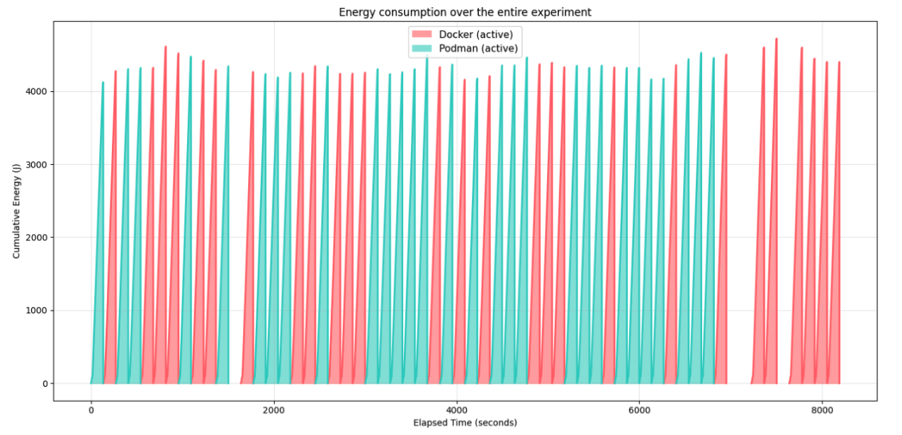
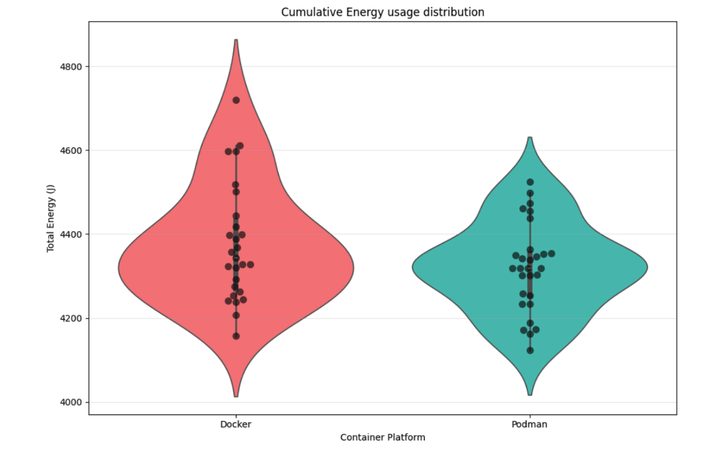
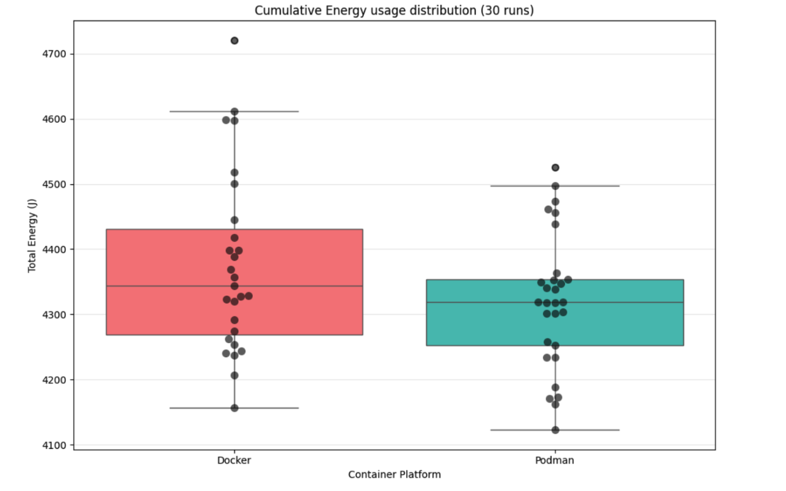
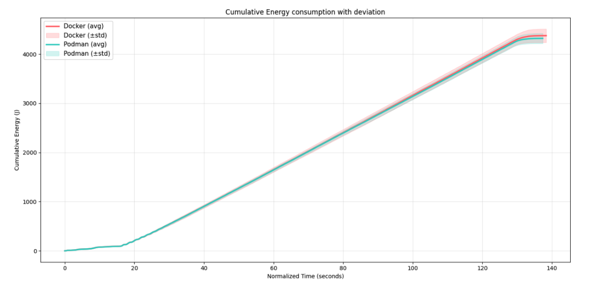

## Introduction

Every time you run `docker run`, a daemon that's been sitting in the background since boot quietly handles the request. It manages for instance networking, volumes, and image layers; it never really switches off. Podman takes the opposite stance: no daemon, no middleman, just a direct call to the container runtime.

This architectural difference is well-known. Its energy implications are not.
Data centres already consume roughly 1-2% of global electricity[^1], and container workloads are a growing slice of that. At the scale of millions of deployments, even a small per-container overhead adds up to something meaningful. Docker's always-on `dockerd` is a natural suspect. However, until now, nobody has measured whether it actually costs you energy during active workloads.

We decided to find out. We built a realistic multi-service RESTful web application, deployed it under both Docker and Podman, hammered it with 2,000 HTTP requests per trial, and measured full-system energy consumption across 30 runs each. The question we set out to answer is simple: **Does Docker's daemon architecture impose a measurable energy penalty compared to Podman's daemonless model during active workloads?**
The answer is less clear-cut than we expected. Specifically:

> During active workload execution, is Docker's incremental energy consumption higher, lower, or indistinguishable from Podman?

---

## Background

### Docker: the daemon-based model

Docker works with a *daemon process*; a long-running background process called `dockerd` is always present on the host, even when no containers are running. Every Docker CLI command (and every API call from Docker Compose) is a request sent to this daemon over a Unix socket. The daemon then delegates low-level container management to `containerd` and then finally to the OCI runtime `runc`.

This way of doing this is convenient: the daemon manages networking, the image and everything else via this daemon background process. This background process has energy costs, which might form a problem at scale.

### Podman: the daemonless model

Podman takes a fundamentally different approach: there is no long-running daemon. Each `podman` invocation is a self-contained process that directly calls into the OCI runtime (`crun` by default). Because there is no daemon in the middle, its energy consumption might show different behaviour over active workloads.

Podman also introduces the concept of **pods** — groups of containers that share a network namespace, mirroring the Kubernetes Pod model. This makes Podman a natural fit for Kubernetes-oriented workflows, while `podman compose` provides a compatible interface for Docker Compose files.

### EnergiBridge

Energy measurements in this study are collected with **EnergiBridge**[^2], a cross-platform power monitoring tool that reads hardware energy output data and writes CSV output per defined run. EnergyBridge additionally also reports on system metrics like CPU and memory usage. It monitors the entire system at once: the total joules (and other metrics) reported reflect everything the system consumes during the measurement window. This means we get a nice overview of all energy consumption.

---

## Methodology

### Experiment Setup

To compare Docker to Podman, we created a RESTful multi-service network application that could be deployed both using Docker Compose and Podman Compose. The network workload consists of a three-service stack mimicking a realistic web application:

- **Frontend**: a Go HTTP server that serves three static "pages" of increasing payload sizes: 50 MB (`/page1`), 100 MB (`/page2`), and 150 MB (`/page3`). The large payloads ensure that network I/O rather than computation dominates the workload.
- **Backend**: a Go REST API backed by a MySQL database modelling a simple CPU webshop (`cpus`, `suppliers`, `orders` tables). It exposes stress endpoints:
  - `/stress/sql?intensity=N`: runs a heavy cross-join aggregate query N times.
  - `/stress/mem?size_mb=M&seconds=S`: allocates M MB, holds it for S seconds, then streams it over the network.
  - `/seed?count=N`: populates the database with N CPUs, linked suppliers, and orders.
- **Database**: MySQL 8, seeded before the load test begins.

The three services are orchestrated with a single `compose.yaml` file. For Docker, this is managed by `docker compose`; for Podman, by `podman compose` using the same file.

All containers are started based on an image that already contains the built binaries of the servers such that the starting time of the containers is minimized. Only the database container takes more time to start (around 15 seconds). This is both an advantage and a disadvantage. For one, this takes time away from the actual networking-based stress test. However, this also adds realism to the experiment. Starting containers is an essential part of using containerization technology. We attempted to offset this startup time by increasing the duration of the network stress test to around two and a half minutes.

The load test (`loadtest.sh`) fires **2000 HTTP requests** at concurrency **15** across the eight distinct endpoints in round-robin order using `xargs` and `curl`. The database is seeded with two batch calls before the load test begins, so the query load is realistic and consistent.

[](https://mermaid.live/edit#pako:eNptk31v2jAQxr-K5arTJvGSEJJCRJHGS7tKILWDv0aqySQHsUjsyHbaMuC77xIYZBUXKbLj5_nd-WLvaCgjoD5dK5bFZD4KBMHQ-fL44YfUhizK95SFMRfwelQUMZkvEskiA9o0dIwLl6UzYCiFYWhTv8fijSspUhBIHMo0kxrIzLBw45ORDDegiFTkWUYpE5UkRTyMFw9oNSAiMgP1xkPoLVWz3-P9R1kwDA_LBVC9Ju9_cg_GiwFmuW7-OZ7Nyffnpyu-0WDxdbqdvUzIiBm2ZBq-_bfHIm5vyRPWpQRLShV5SOT75_SkXu_vC85LDoqD3iP6osG6qlQkTrCpZI5dJRHXRvFlbrgU1b6T-_v-PqDNjK1hYdedV5KxbfEvdED32K5rWiSB1uQLaWqAqNgzCVmSlI7ByVGpBeuYmW3Cxfp0JHACx_Ow4kni36zc4qkhVm7Av3Ec5zSuv_PIxH4r-6g6rx-EE6qMM8rzvH-oiOmYKcW2PnGJW-Xhxs5mB6yzebXqdiyrqhwNTkqwsWI4Ky3bvesuaQ3PPo-ov2KJhhpNQaWsmNNdAQmoiSGFgPo4jGDF8sQENBAH9GVM_JIypb5ROTqVzNfxmZNnETMw4gzvwUWCDQY1lLkw1Hecbsmg_o5-UN-2nUbHcjy763Tad57rtWp0i5-7TsPuepZn2R3L89qWd6jRP2Vaq-G23Hbb9txW27Jt1EPEjVTT45Uub_bhL4TpLwM)

### Experimental Procedure

Each trial follows this sequence:

1. Start the containers with the target runtime (`docker` or `podman`).
2. Wait for all health checks to pass (`container-ready.sh`).
3. Run the workload.
4. Stop and remove the containers.

EnergiBridge wraps the container runtime-specific measurement script, so the energy counter captures the full lifecycle: startup, running, and teardown of either Podman or Docker. 35 independent trials are performed per container runtime (70 trials total). The first 10 trials are used as warm-up trials.

Trial order within each workload is randomised to avoid systematic order effects. However, the warm-up trials are taken into account. This means that the remaining 60 trials have exactly 30 measurements per container runtime.

### Controlled Environment

The experiment was conducted in an environment with the following constraints:

- The computer used to conduct the experiments:
  - Is a Dell Optiplex 7050 with an Intel Core i7 vPro 7th Gen with 8 cores and 4 DDR4 4GB RAM cards, totalling 16GB of RAM, no swap.
  - Runs NixOS 25.11 as its operating system without a desktop environment and with minimal applications installed; look at the replication package for more information about the configuration.
  - Has no screen attached
  - Has no Wi-Fi or Bluetooth cards; Ethernet cable detached during the experiment.
  - Has no USB peripherals.
- Room temperature held at a stable value between 20°C and 21°C throughout the measurement period.

### Software Specifications

| Software | Version |
|----------|---------|
| Docker | 28.5.2 |
| Podman | 5.7.0 |
| EnergiBridge | main on GitHib repo (see `shell.nix` for more information) |

### Replication Package

To ensure replicability, there is a replication package available. This contains a simple script to start the test, called `test.sh`, it requires two parameters, length and seed. For the experiment result in this blog, length 35 and seed 107 were used. The replication package also explains what the prerequisites are. The replication package can be found here: https://github.com/KaspervanM/course_sustainableSE-group-10-measurement.

---

## Results

As mentioned in the experiment procedure, we have run the experiment 35 times for both Docker and Podman. The runs were interleaved based on a random seed, and the first 5 runs for each were not considered, being part of the warmup phase. Finally, we have run outlier analysis using IQR bounds, and removed 4 datapoints in total for being outliers.

This first graph shows the total experiment with the cumulative energy per trial. This graph visualizes how the trials are interleaved and where the outlier data points are removed. The latter is visible where there is a blank space in the timeline, as this experiment has no idle time.

The second graph shows the non-cumulative energy used (power), averaged over all runs over the runtime. Extremely interesting is that the line pattern at the start is almost exactly identical for both Docker and Podman. More divergence of the mean can be identified near the end. Podman trials seem to finish slightly sooner on average.

The third graph is a violin plot which shows the distribution of cumulative energy usage at the end of all the runs. This visualization provides intuition about the density and distribution of all the trials for both Docker and Podman. Note that the y-axis starts at 4000.

The fourth graph shows the same exact data, but in a boxplot for more exact readings on the mean, the inter-quartile ranges and remaining anomalous points. Again, note that the y-axis does not start on 0.

Finally, in the fifth graph, the cumulative energy usage over run time can be seen. As can be seen in the instantaneous view of graph 2, the main difference is the diverging towards the end of each run. Because this is a cumulative graph, the deviation is much less visible compared to the instantaneous power usage from graph 2. The energy usage at the start of each run is surprisingly similar between the two containerization tools.

Based on the data, some tests have been performed. These are namely the Shapiro-Wilks Normality Test for both Docker and Podman and the Welch Independent t-test. Also, Cohen's d and the 95% confidence interval of mean difference between the Docker and Podman trials have been calculated. All tests have been performed on the cumulative energy consumption per trial. We chose to compare cumulative energy consuption over power usage because a significant part of the trials was the starting of the containers. This, together with the inclusion of the stopping of the containers make the trial represent a bounded scenario rather than a continuous use case, which is why we deemed energy a more fitting metric than power. The results are as follows:

| Test | Result |
|----------|---------|
| Shapiro-Wilks Normality Test Docker | Test Statistic: 0.937108, P-value: 0.103385 |
| Shapiro-Wilks Normality Test Podman | Test Statistic: 0.963938, P-value: 0.409227 |
| Welch Independent t-test | T-statistic: 1.673487, P-value: 0.100724  |
| Cohen's d | d = 0.452133 |
| 95% confidence interval of mean difference | 95% CI: [-11.147813 J, 121.850844 J] |

---

## Discussion

The main research question we aimed to answer is whether the Docker container runtime has any runtime energy consumption difference from that of Podman for identical workloads. The results indicate insignificant difference between the two container runtimes. The shapiro-wilkins normality test with an α value of 0.05 fails to reject normality for both the Docker and Podman data, which calls for a parametric test. Across the 30 analysed trials per runtime (minus outliers), the Welch t-test did not detect a statistically significant difference in cumulative energy consumption (p = 0.1007). Additionally, the mean difference's 95% confidence interval, ranging from -11 J to +122 J, includes 0. This implies we cannot say with 95% confidence that there is even a difference in engergy consumption between the two container runtimes under our test conditions.
While the Welch t-test does not find a statistically significant difference, the effect size tells a more nuanced story. A Cohen's d of 0.45 is considered a medium effect, and though this experiment did not find significant differences between energy consumption of Podman and Docker, the results are interesting nonetheless. That is because it could be an indication that a different type of workload could, in fact, provide significant results.

The figures provide important nuance beyond the summary statistics. Figure 2 is particularly telling: the mean instantaneous power traces for Docker and Podman are nearly indistinguishable during the first portion of each run, when the load test is actively firing requests. This suggests that the `dockerd` daemon does not impose meaningful overhead during the peak request-handling phase — the daemon's role as a mediator for network and volume I/O does not appear to translate into measurable extra energy draw when the workload is saturating the system. The divergence between the two runtimes only emerges towards the end of each run, pointing to teardown and daemon housekeeping as the more likely source of Docker's slightly higher total. Figure 5 corroborates this: in the cumulative view the gap is narrow throughout the run and only opens up in the final stretch. The violin and box plots (Figures 3 and 4) show overlapping distributions with broadly similar spread, consistent with the non-significant t-test result, though Docker's distribution appears shifted slightly upward — again in line with the asymmetric confidence interval.

The math changes at a data-centre scale. If the observed mean difference of ~55 J reflects a real effect, a modest deployment of 10,000 container lifecycle runs per day would amount to roughly 550 kJ, or about 153 Wh, of additional energy daily. Across a year, that is approximately 56 kWh per 10,000 daily runs, purely from the container runtime choice. For hyperscale operators running millions of such workloads, this would no longer be negligible.

---

## Limitations and Future Work

**Single hardware platform.** All experiments ran on one machine. The RAPL energy counters and their relationship to actual power usage differ across CPU microarchitectures (Intel vs. AMD vs. ARM). Results should be replicated on diverse hardware before generalising.

**Podman Compose vs. native Pods.** This study uses `podman compose` to maintain parity with the Docker Compose workflow. Podman's native Pod model (where containers share a network namespace without a compose layer) could exhibit different energy characteristics and merits its own study. Also, `podman compose` is an independent project from Podman, which might have its own drawbacks compared to a native solution.

**Warm vs. cold image cache.** We pre-pull images before trials begin, so image-layer decompression is excluded from measurements. Including cold-start scenarios would capture the energy cost of first-time deployments.

**Limited workload diversity.** Two workloads cannot characterise the full range of container use cases. Future work could extend to GPU-accelerated workloads (matrix multiplication), long-running idle services, and high fan-out microservice topologies.

**Daemon idle baseline.** We do not separately measure the steady-state idle cost of `dockerd`. Isolating this baseline would help decompose the total overhead into daemon-specific and workload-specific components.

---

## Conclusion

This study set out to answer whether Docker's always-on daemon architecture imposes a measurable energy penalty over Podman's daemonless model during active workloads. The short answer is: probably not a large one, but the question remains genuinely open.
Across 30 analysed trials per runtime, Docker's mean cumulative energy consumption was slightly higher than Podman's, but the Welch t-test did not find this difference to be statistically significant (p = 0.10). The medium effect size (Cohen's d = 0.45) and an asymmetric confidence interval ranging up to +122 J in Docker's favour suggest the study may be underpowered rather than the effect being truly zero. Practically, at developer-workstation scale this difference is inconsequential; at data-centre scale, it warrants further investigation.
The most actionable insight from this work is perhaps not the number itself, but the shape of the difference. Power consumption traces show Docker and Podman behaving nearly identically during the peak load phase, diverging only towards the end of each run. This suggests that teardown and daemon housekeeping, rather than active request handling, is where the overhead accumulates. Future work should isolate this: measure dockerd's idle baseline separately, test with longer-running workloads, and replicate on ARM and AMD hardware where RAPL characteristics differ.
For developers and operators who care about energy efficiency today: the daemon architecture alone is unlikely to be your biggest lever. But if you are already operating at scale and evaluating Podman for Kubernetes-native workflows, energy efficiency is one more reason, modest but real, to consider the switch.

---

## References

1. International Energy Agency. *Data Centres and Data Transmission Networks*. [iea.org](https://www.iea.org/energy-system/buildings/data-centres-and-data-transmission-networks), 2023.

2. Durieux, T. *EnergiBridge: A Cross-Platform Energy Measurement Tool*. [github.com/tdurieux/EnergiBridge](https://github.com/tdurieux/EnergiBridge), 2024.

3. Sustainable SE Course, Group 10. *Container Runtimes Energy Comparison*. [course_sustainableSE-group-10/2023](https://luiscruz.github.io/course_sustainableSE/2023/p1_measuring_software/g10_Container_Runtimes.html), 2023.

---

## Appendix

Declaration of AI Usage:
Large language models (ChatGPT and Claude) were used to rephrase text and improve style, structure, and grammar. They were not used to generate new content, but rather to improve the overall clarity, consistency, and readability of the report. In addition to LLMs, Grammarly has been used to correct any grammar mistakes.
