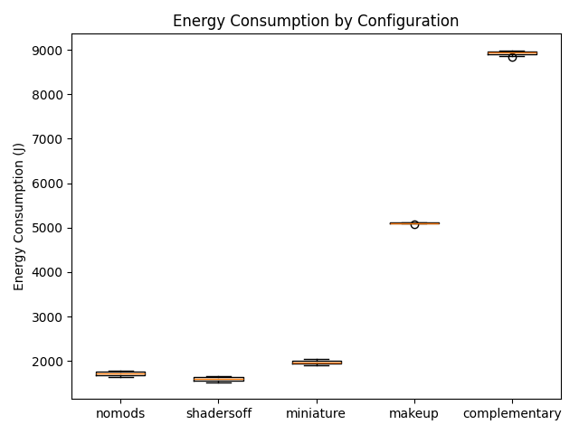
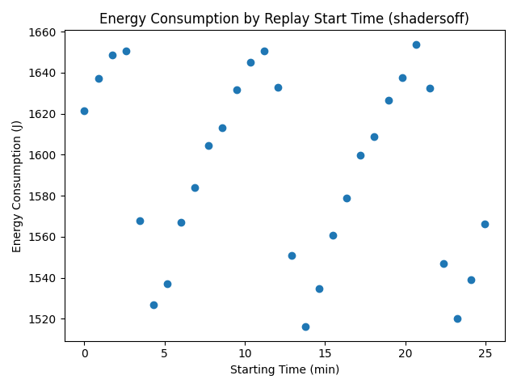
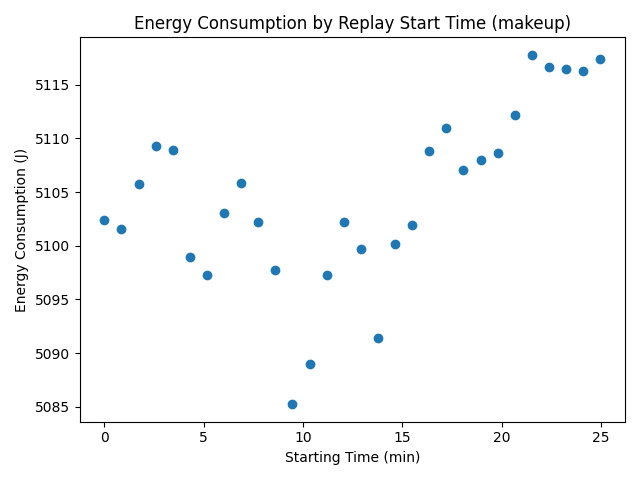
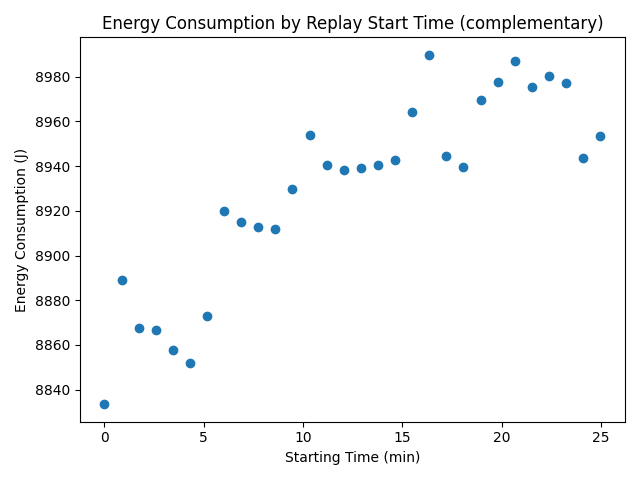
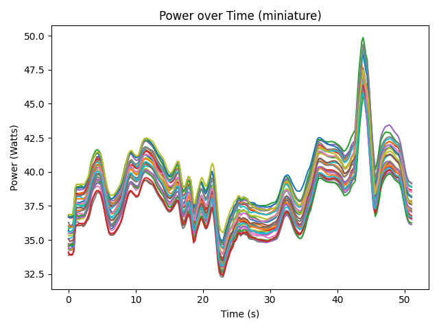
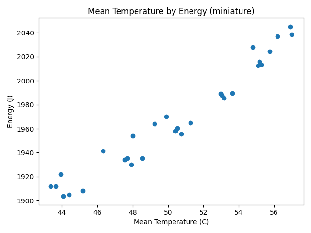

Minecraft is a popular sandbox video game that allows players to build and explore virtual worlds. It has a very extensive modding ecosystem, and many developers have created content and performance mods to enhance the gaming experience. One of the most popular types of modifications are custom shader packs, also called "shaders". These are used to improve the graphics and visual effects of the game, improving the experience for players with high-end hardware.

Shaders add features such as dynamic lighting, shadows, reflections, complex environmental animations, and more. As expected, these improvements require more computational resources, especially from the GPU. Shaders are therefore notorious for increasing power usage and heating up players' machines.

There is a sub-genre of shaders which still overhaul the game graphics, but advertise high efficiency or a minimal performance impact. We will evaluate the energy usage of a selection of popular shaderpacks in a standardized scenario. With this we want to discover whether players can regain near-default energy efficiency by switching to one of these "efficient" packs, or if enabling even an efficient shader has a significant energy cost.

---
## Research Questions

In order to stay on track and within scope of the goals of this exploration, we have defined the following research questions:

**RQ1.** How does the energy consumption of Minecraft change when using shaders compared to the vanilla version of the game?

**RQ2.** How does the energy consumption vary across different shader packs?

---
## Methodology
Here we describe our hardware and software setup, how the experiments were conducted and how we will evaluate the results. 

### Hardware/Software Setup
We will be using a Linux machine with a high-end Nvidia GPU and AMD CPU to ensure that the game can run without performance bottlenecks. The specifications of the machine are:
- OS: openSUSE Tumbleweed x86_64 20260212
- CPU: Ryzen 7 5700X
- GPU: NVIDIA Geforce RTX 4070
- RAM: 2x8GB DDR4 3200 MT/s
- Display: 1440p 165Hz

To measure the energy consumption of the GPU we used [EnergiBridge](https://github.com/tdurieux/energibridge) .

To reduce the impact of outside sources, we:
- closed all other programs.
- disconnected from the network.
- used a single monitor.

Next, we need to choose actual shader packs to test. We decided to use the most downloaded shader on the popular modding website [Modrinth](https://modrinth.com/discover/shaders). To compare different shader packs, we chose two additional packs that claim to "provide the best quality / performance ratio." and to be "extremely lightweight." We will use the latest version of the game supported by all three shader packs, which is the most recent version of the game, `1.21.11`. The shader packs used are:

- **[Complementary Shaders - Reimagined](https://modrinth.com/shader/complementary-reimagined)**: The most downloaded shader pack
- **[MakeUp - Ultra Fast](https://modrinth.com/shader/makeup-ultra-fast-shaders)**: Claims to "provide the best quality / performance ratio."
- **[Miniature Shader](https://modrinth.com/shader/miniature-shader)**: Claims to be "extremely lightweight."

### Software Setup
Since Vanilla Minecraft does not support shaders or mods by default, a mod loader will be needed. We will be using the [Fabric Mod Loader](https://fabricmc.net/) for this purpose, which is a popular and modern modding platform for Minecraft. To install shaders, we will be using the [Iris](https://irisshaders.dev/) mod. Iris depends on [Sodium](https://github.com/CaffeineMC/sodium), a performance-enhancing rendering engine mod for Minecraft. To ensure comparability, our base test will be conducted with Sodium activated and Iris shaders deactivated, to account for possible power usage differences attributed to the optimizations Sodium provides. A test will also be conducted without Iris or Sodium, to assess the energy performance of the vanilla renderer.

For reproducibility of the tests, we will be using the [Replay Mod](https://www.replaymod.com/), which allows us to record and replay gameplay demos to re-render the exact same scene. This way, we will have a consistent game scenario for each test, which we can re-render with the different shaders. Note that while the gameplay demo is rendered in-engine, all gameplay and world generation is pre-simulated. This means that the CPU usage in this test is not representative of real gameplay. This test focuses on GPU power usage, since the GPU is most affected by shaders. 

When playing the demo, VSync limited the game to running at at maximum of 165 frames-per-second, which is a realistic refresh rate for this class of machine. Since the game will render the same amount of frames under each shader, improved performance should translate into lower energy usage. 

We ran the experiment using the following software versions:
- Minecraft: 1.21.11
- Iris: 1.10.5
- Sodium: 0.8.3
- Replay Mod: 2.6.25
- Java: 21

The minecraft graphics settings were left unchanged, except for raising the maximum FPS to let VSync limit it instead.

### Experiment Setup
In order to ensure the power measurement experiment is reproducible, we created a custom script that automates the warming-up of the GPU, and then collects power usage measurements over 30 iterations. Automation is achieved by sending the Replay Mod keyboard shortcut for play \(P\) and then starting EnergiBridge to measure the GPU power usage, with a sleep timer equal to the time of the replay (50 seconds). In the case of the warming-up rounds, no measurements are taken, and the replay just runs its course for 5 rounds.

The same replay was played using five different configurations, at 30 iterations each. One configuration with only Replay Mod installed (`nomods`), one with Sodium and Iris installed and active (`shadersoff`), and finally one configuration for each of the shader packs (`complementary`, `makeup` and `miniature`). The configurations were played back-to-back, with a 5 minute break between each. In the replay, the following significant game actions were taken:
- Player walking around in the overworld in a vanilla environment.
- Glowstone light source covered with glass, experienced in day and night time.
- Building a structure and cover to experience different shading and light conditins during daytime.
- Switching between daytime and nighttime.
- Introducing a new light source (campfire) during nighttime.

### Replication package

This project includes a [replication package](https://github.com/Samuel3k/SustainableSEshaders/releases/tag/replication-package) to make it easy to repeat our experiment. It consists of two parts: a [Prism Launcher](https://prismlauncher.org/) profile and the test automation script. The profile can be loaded into the Prism Launcher to obtain out exact game configuration used in our testing. The replay we used can be found in the ReplayMod menu and is simply called `Benchmark_replay`.

Since we ran our experiments on a 1440p 165Hz display, so a reacreation could either use one with the same specification or manually lock the game to these values through the settings.

The script outputs the resulting EnergiBridge logs in the directory it was called from. In order to run the experiment, open the replay and let it play to the end, such that pressing `P` will cause it to start from the beginning. Activating the script will then run the entire testing routine for the activated shader. 

In the script, update the path for EnergiBridge and set the required amount of (warmup) runs. Also make sure the user executing the script has the required permissions to run EnergiBridge.

Shaders can be switched using the Minecraft graphics settings. To run the `nomods` experiment, disable the Sodium and Iris mods by editing the profile in Prism Launcher.

---

## Evaluation
Initial exploration showed the data was non-normal, with the Shapiro-Wilk test giving a p-value less than 0.05 for shadersoff and complementary, and also giving fairly low values for the others. Because of this, we used the Mann-Whitney U test to check whether the energy usage is significantly different from the baseline, `nomods`. To measure the effect size we used the median difference. 

|configuration       |shapiro t           |shapiro p|
|--------------------|--------------------|---------|
|nomods              |0.9485              |0.1538   |
|shadersoff          |0.9159              |0.0210   |
|miniature           |0.9424              |0.1057   |
|makeup              |0.9645              |0.4017   |
|complementary       |0.9269              |0.0406   |

## Results

The Mann-Whitney U test showed that all of other configurations were significantly different from `nomods`.

|configuration       |p-value             |Median difference   |Median diff. (%)    |
|--------------------|--------------------|--------------------|--------------------|
|nomods              |1.00000000          |0.0000              |0.0000              |
|shadersoff          |0.00000000          |120.7421            |-7.0087             |
|miniature           |0.00000000          |239.6106            |13.9086             |
|makeup              |0.00000000          |3381.6529           |196.2943            |
|complementary       |0.00000000          |7217.2207           |418.9370            |

The boxplots above show the distributions of energy consumption for each configuration. The baseline energy use is 1722.75 J. The `shadersoff` configuration actually decreases energy consumption by 7%, likely because of the optimizations that sodium includes. `miniature` only slightly increases energy use by 13.91%, while `makeup` and `complementary` result in much larger increases of 196% and 418% respectively.

To investigate the non-normality, energy consumption was plotted against the time each iteration was started. This revealed a repeating pattern of energy increasing and falling over the course of about 5 minutes. Similar patterns were present in `shadersoff`, `nomods` and `miniature`. `makeup` and `complementary` did not have repeating patterns, but the energy measurements still do not appear random.

---

## Discussion

The power measurements were extremely consistent between runs, following nearly the exact same curve each time. An illustrative example is below, but the other configurations behave similarly. It's even possible to see specific events, like the placing of a campfire around 43 seconds, causing a lighting recalculation and briefly increasing power draw.

As mentioned before, the energy consumption data was non-normal. When ordering the iterations by time, the energy values show structure instead of random variation. We believe this is due to the behaviour of the GPU fans. The particular GPU used in the experiment (RTX 5070 Asus Dual OC) uses passive cooling when running at a low temperature. When the temperature rises to a certain value during the benchmark, the GPU fans activate and quickly cool it back down. Then once the temperature is low enough, the fans stop, letting the temperature slowly rise again. Because higher temperature correspond to higher power usage, this creates the pattern we see in the graph. MakeUp and Complementary stress the GPU enough to get the fans constantly spinning, so there is no rising and falling pattern in their results.

To test this explanation, we plotted the average run temperature against energy consumption. The result is below and shows a clear positive correlation, supporting our hypothesis. The non-repeating patterns occur for the heavier makeup and complementary, which suggests the patterns are from different fan behaviour at higher power use, and thus higher and faster increasing temperatures.

While this means our data is non-normal, it also shows that our setup is very consistent, with the main factor affecting energy consumption being temperature rather than sources of noise. It also gives us very tight bounds on energy consumption, as can be seen in the boxplot from before.

We see only a minor energy impact using `miniature`, with energy usage in the same ballpark as `nomods` and `shadersoff`. If minimizing energy consumption is the goal, an optimized configuration using Sodium (and potentially other optimization mods) is best. For a more "proper" shader, `makeup` improves the visuals substantially, while using 41% less energy than `complementary`, showing that shader choice has a large impact on energy consumption

---

## Limitations and Future Work
In this experiment we limited ourselves to testing GPU energy consumption, since GPU load is the most affected by using shaders. However, for a complete picture we would need to take the CPU into account as well. This would require an entirely different testing setup, as the CPU usage when replaying a pre-simulated demo is not representative of real gameplay. A solution could be to create a script that replays pre-recorded inputs in a regular game session. However, this is challenging to achieve consistently due to various game mechanics being dependent on pseudo-random number generation.

Our experiment also only covered one of the many gameplay scenarios Minecraft players encounter. Future experiments should include multiple demos, particularly in different biomes and dimensions, as various shaders have unique effects for these.

While the results are promising in our test setup, they do not generalize to all setups. Our setup used a modern high-end GPU, which consistently reached the 165 frames-per-second cap. This meant that improvements in per-frame rendering effiency translated in lower power usages over the whole run. 

However, consider the following scenario:
A low-end PC runs the game with the FPS locked at 60. Suppose the MakeUp shader reaches this maximum, utilizing around 100% of the GPU and consuming *x* joules. Then suppose the Complementary shader reaches only 30 fps while using 100% of the GPU, also consuming *x* joules for the run. Despite using half of the energy to render a single frame, switching out Complementary for MakeUp would not reduce the energy used in a gaming session.

As mentioned in the Discussion section, our results were impacted by varying GPU temperatures over time. Future experiments should address this, for example by setting a constant fan speed for the GPU and increasing the amount of warm-up runs. 

---

## Conclusion

Based on the observed results, we can firmly conclude that players concerned about energy efficiency do not have to forgo visual improvements entirely. The lightweight Miniature shader has been shown to provide its enhancements at near baseline energy costs (+14%). It therefore fullfills its promise as a high-efficiency shader, despite included advanced effects not present in the base game (e.g. real-time reflections and shadows)

More heavy hitting shaders like MakeUp and Complementary, while more visually appealing, were measured to cause an energy surge of +196% and +419% respectively. Thus, it is reasonable to conclude that MakeUp constitutes a well balanced tradeoff between energy consumption and visual enhancements, as it is still uses 41% less energy than Complementary.

The research questions can then be safely answered:

- *RQ1. How does the energy consumption of Minecraft change when using shaders compared to the vanilla version of the game?* Shaders universally increase energy consumption, though the magnitude varies extensibly.

- *RQ2. How does the energy consumption vary across different shader packs?* The difference between packs are substantial enough to meaningfully inform the choice of shader.

Interestingly, as briefly mentioned, the fact that Sodium alone decreases energy consumption by 7% is a noteworthy sidenote, and shows that general optimization mods can meaningfully reduce energy consumption, regardless of shader choice, and perhaps shows that performance optimization hasn't been a primary goal in the development and maintanance of vanilla Minecraft.
