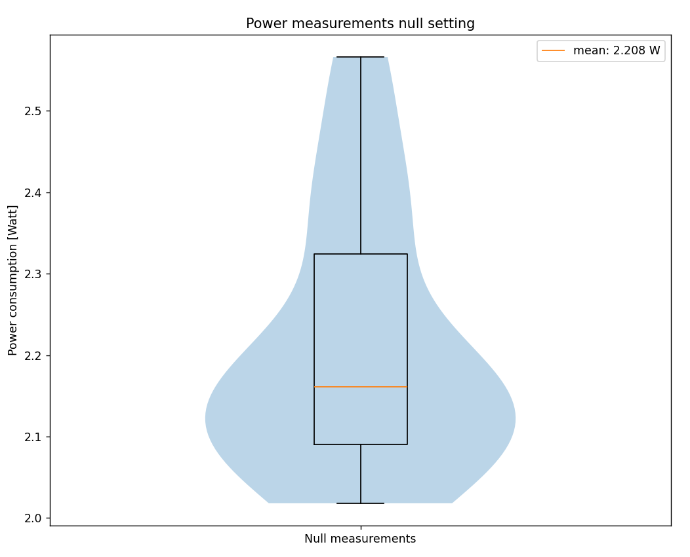
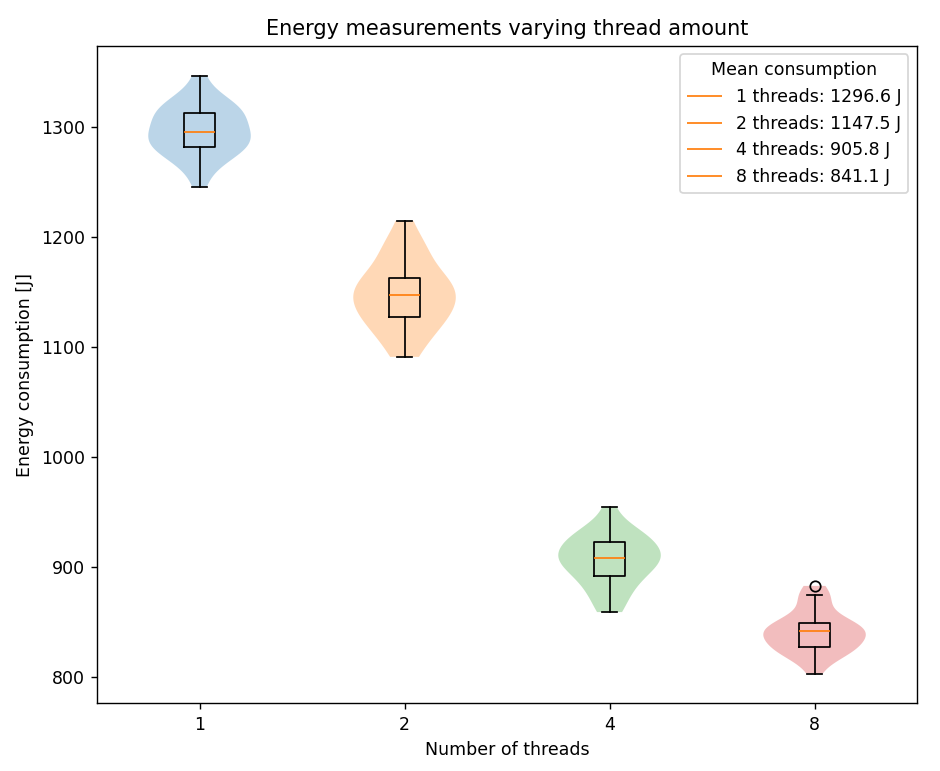

# Introduction
Most programs are initially written in a _single-threaded_ fashion. A single-threaded program has only one thread of execution. This means that the program performs one execution at a time, in a sequential matter. This makes developing, debugging and maintaining the program simple, as the program as a whole is easier to reason about. However, many modern operating systems have multi-core processors, which have the capability of executing many tasks in parallel. With single-threaded programs, most of these cores are left unused. This can become especially noticeable if _blocking_ requests are involved, where the execution of the entire program is halted until a task finishes.

A common solution to this program is to make the program _multi-threaded_. Multi-threaded programs run tasks concurrently, or in parallel. Each thread executes its own execution path of the program, allowing the program to execute multiple tasks at a time. Now, a blocking request could be executed on a different thread, allowing to program to continue execution without having to wait for the request to complete.

With many cores being available on modern operating systems, this paradigm becomes increasingly common. The increased efficiency of the program's execution seems like an obvious reason to take advantage of it. However, when making this change, energy consumption is often left out of the equation. In this report, we will investigate how single-threaded and multi-threaded programs compare in energy consumption, and what considerations a developer should take in mind when choosing between the two paradigms.

More specifically, we will investigate how the memory usage of the same program differs given a single-threaded and multi-threaded implementation. For this, we will take into account the overhead of creating a thread, the number of threads used and the effect of reusing threads.

# Methodology
We will use Java as testing language. Java has APIs available that allows us to easily configure the number of threads and whether threads are reused. Furthermore, in Java threads are OS threads, which is what we want to measure. Languages like Go have coroutines that are lightweight versions of threads, which are managed by the Go runtime and not the OS. Because these threads barely have any overhead, they are less interesting to study.

We will measure the energy consumption using EnergiBridge[^1]<sup>,</sup>[^2]. EnergiBridge is a cross-platform energy measurement utility which internally uses LibreHardwareMonitor[^3] to measure the energy consumption of a program. EnergiBridge is designed to support multiple operating systems and processor brands, which makes it not only easy to use, but also easy to compare different hardware setups. EnergiBridge can be used from the command line. For example, to measure the energy usage of visiting `google.com` using Google Chrome for ten seconds, one can use the following command:

```shell
energibridge -m 10 -- google-chrome google.com
```

For a more detailed usage guide, see the GitHub page.

To aid the reproducibility of our results, we will abstract away the usage of EnergiBridge in PowerShell scripts. Because EnergiBridge requires elevated permissions, the scripts will automatically trigger a User Account Control (UAC) prompt that asks for the required permissions. Because running a PowerShell script with elevated permissions carries some risk, the reader is invited to audit the scripts first.

Because multi-threaded programs draw more power simultaneously, one should measure the _total_ energy consumption across all processors. Luckily, this is what LibreHardwareMonitor does; it measures the energy/power sensors at the package level. Here package level refers to the entire physical CPU chip. Thus, because the energy measurements are tied to hardware sensors, they automatically include all active threads running on all cores.

However, because all cores are always measured, there will be a significant amount of background noise that will be captured in the measurements. Therefore, to make our measurements as accurate as possible, one must eliminate as many sources of background memory consumption as possible, and only measure the memory consumption as a consequence of executing the program. For this, we will first perform a null-measurement, which will measure the energy consumption of the system when nothing is being done. On Windows, the `timeout` command sleeps (in contrast to busy waiting) for an amount of time. The `null_measurement.ps1` script measuresures sleeping for ten seconds for a total of thirty iterations.

```shell
./null_measurement.ps1
```

Moreover, one should ensure that the measurements are consistent and reproducible. For this, we will adhere to the following criteria and configuration settings when performing the measurements:

- all applications should be closed;
- notifications should be turned off;
- only the required hardware should be connected (no USB drives, external disks, external displays, etc.);
- unnecessary services running in the background should be stopped (e.g., web server, file sharing, etc.);
- network connections should be switched off;
- brightness is fixed to the lowest possible;
- volume is turned off.

In our case, the device that was used to perform the measurements has the following specifications:

- the operating system is Windows 11;
- the CPU is TODO;
- the installed physical memory (RAM) is TODO;
- the resolution is 1920 x 1080, with a refresh rate of 60 hertz;

To reduce variance, each specific measurement will be performed thirty times. Additionally, between each measurement, there is a configurable pause that allows the processor to cool down.

In the next section we will discuss in more detail what particular program we used for measuring energy consumption.

# Implementation
To measure the differences in energy consumption, we will use the X/Y/Z as test program. This program lends itself well for this experiment because it is not easily optimised by the compiler/CPU, ...

# Hardware setup
To be able to ensure that the measurements are consistent and reproducible some precautions had to be taken. Most importantly all the collected measurements were made on the same device, as using only one device makes it easier to have a consistent setup. 
In our case, the device that was used to perform the measurements has the following specifications:

- the operating system is Windows 11;
- the CPU is an Intel Core i7-12700H;
- the installed physical memory (RAM) is 16 GB;
- the resolution is 1920 x 1080, with a refresh rate of 60 hertz;

Additionally the following criteria and configuration settings were used when performing the measurements:

- the device is disconnected from the internet;
- bluetooth is turned off;
- no external devices are connected (eg., USB-drives, computer mouse, external dispalys, etc.);
- the device is connected to a power supply;
- the brightness of the device is set to the maximum and is not dynamic;
- screen timeouts are turned off (the device should not enter sleep mode while collecting measurements);
- all applications are closed such that they do not keep on running in the background;
- unnecessary services running in the background are stopped (e.g., web server, file sharing, etc.);
- only a powershell is opened that is used to run the scripts for the measurements;

Besides the setting of the device itself the environment can also have an impact on the performance. Therefore some addition thing had to be ensured like:

- The temperature of the room is consistent somewhere around 20 degrees Celsius;
- Make sure the room is big, such that the device will not raise the room temperature;
- The laptop is placed in the shadows, such that the sun will not heat it up;
- There are no external heating or cooling devices close enough to the device to have an influence;

After ensuring that all the above mentioned conditions were met, the scripts to make the measurements were ready to be run.

# Results
After running all the tests the following plots can be made:

The first plot shows the average power consumption for the null measurements. The mean power over 28 runs (2 were left out as outliers) shows that the device uses around 2.2 W when in an idle state.



This second plot shows the programs total energie consumption in Joules, for each experiment with different amounts of threads. For each experiment around 0 to 3 measurements were labeled as outliers and were left out from this plot. As already mentioned using more threads for computations also speeds up the process. To still be able to compare the experiments, we want to isolate the energy consumption of the program itself. To do this we subtract the found background power consuption (2.2 W) multiplied by the time it took each measurement to run:
$J_{program} = J_{total} - P_{null} * \Delta t$



Interestingly using more threads clearly reduces the total energy consumption. This means that parallelizing a program will not only speed up the run time, but can also reduce the total energy it will consume. We however have to keep in mind that this does not mean that the program draws less power. On the contrary, the third plot shows that using more threads increases the power usage of the program:


This indicates that when continuously running a multi-threaded program as opposed a single threaded program, will use a lot more energy. Only when running the program a (small) finite amount of times it will be beneficial for the energy consumption to use multiple threads compared to a single one.


# Statistical analysis of the results

## Normality testing

Before choosing our statistical tests, we first check whether the data from each configuration follows a normal distribution. For this, we use the Shapiro-Wilk test. Under the null hypothesis, the data is normally distributed; we reject normality at a significance level of α = 0.05.

| Configuration | Shapiro-Wilk p-value | Normal? |
|---------------|---------------------|---------|
| null          | 0.00176             | No      |
| threads_1     | 0.9999              | Yes     |
| threads_2     | 0.95544             | Yes     |
| threads_4     | 0.86007             | Yes     |
| threads_8     | 0.49363             | Yes     |

The null measurement does not follow a normal distribution (p = 0.00176 < 0.05). This is expected: idle energy consumption is influenced by background activity, which introduces irregular spikes. 

All thread configurations are clearly normally distributed (all p-values well above 0.05). This allows us to use parametric tests for comparison.

## Descriptive statistics

| Configuration | Mean (J)   | Std. dev. (J) | Relative to 1 thread |
|---------------|-----------|----------------|----------------------|
| threads_1     | 1296.574  | 22.389         | baseline             |
| threads_2     | 1147.454  | 30.183         | −11.5%               |
| threads_4     | 905.818   | 22.795         | −30.1%               |
| threads_8     | 841.099   | 18.767         | −35.1%               |

A trend shows that energy consumption decreases as the number of threads increases. Going from 1 to 2 threads already saves about 149 J per run (11.5%), and doubling again to 4 threads saves a further 242 J. The jump from 4 to 8 threads, however, only gives an additional 65 J savings (a 7.1% reduction from 4 threads). This suggests smaller returns as more threads are added.

## Effect size (Cohen's d)

Because all thread configurations are normally distributed, we compute Cohen's d to quantify how strongly the distributions differ. Cohen's d is the difference in means divided by the pooled standard deviation. By convention, d = 0.2 is considered small, d = 0.5 medium, and d = 0.8 large.

| Comparison              | Mean diff. (J) | Pooled SD (J) | Cohen's d |
|------------------------|-----------------|---------------|-----------|
| 1 thread vs. 2 threads | 149.12          | 26.57         | 5.61 |
| 1 thread vs. 4 threads | 390.76          | 22.59         | 17.30 |
| 1 thread vs. 8 threads | 455.48          | 20.66         | 22.05 |
| 4 threads vs. 8 threads| 64.72           | 20.88         | 3.10 |

All effect sizes are far above the "large" threshold (d > 0.8), meaning the differences are statistically significant. The distributions barely overlap at all. Even the smallest comparison (4 vs. 8 threads) has d = 3.10, which means the two groups are clearly separated.

## Practical significance

A single run of the workload on 1 thread uses about 1297 J. On 8 threads, that drops to 841 J, which is a saving of roughly 456 J per execution. Over a year, that adds up to about 4.6 kWh per machine assuming 100 workloads a day. For a server consisting of many machines processing thousands of such tasks daily, the cumulative savings become meaningful both in cost and in carbon footprint.

It is worth noticing, that these savings come from a CPU-heavy hashing workload where parallelism directly reduces total execution time. In workloads that are I/O-bound, memory-bound, or that have heavy synchronisation overhead, the energy savings from threading could be smaller.. Our results should not be generalised to all workloads without further investigation.

## Diminishing returns

The data shows clear diminishing returns. Doubling from 1 to 2 threads saves 149 J; from 2 to 4 saves 242 J (the biggest absolute gain); from 4 to 8 saves only 65 J. The marginal gain per additional thread decreases sharply at higher thread counts. This is consistent with Amdahl's law: as more threads are added, the inherently sequential portions of the program (thread creation, task dispatch, result aggregation) become the bottleneck. At some point, adding more threads will stop helping — and may even hurt due to increased context switching and contention.

## Limitations

A few limitations should be noted:

- We only tested one workload (SHA-512 hashing). Different workloads may behave differently under threading.
- The null measurement's non-normality suggests that background noise is not perfectly stable. On a different machine or OS, this may be more or less of an issue.
- We did not test thread counts beyond 8 (because of hardware limitaiton), which means we cannot say where the optimal number of threads lies for this specific workload and hardware.
- The measurements were performed on a single machine. Hardware differences will affect the results.

# Conclusion and future work
A.

# References

[^1]: Sallou, J., Cruz, L., & Durieux, T. (2023). _EnergiBridge: Empowering software sustainability through cross-platform energy measurement_. arXiv. https://doi.org/10.48550/arXiv.2312.13897

[^2]: Durieux, T. (n.d.). _EnergiBridge_. GitHub. https://github.com/tdurieux/EnergiBridge

[^3]: LibreHardwareMonitor. (n.d.). _LibreHardwareMonitor_. GitHub. https://github.com/LibreHardwareMonitor/LibreHardwareMonitor
