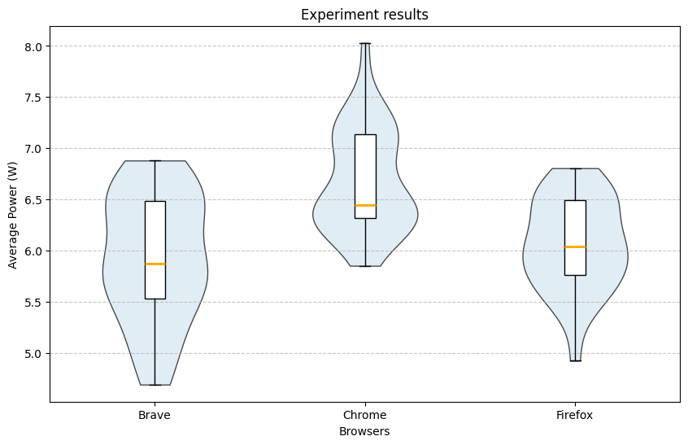

## Introduction

Software systems play an increasingly central role in modern society. Web browsers, in particular, are among the most frequently used applications on personal computers. Millions of users spend hours each day browsing the web, streaming video, and interacting with web-based applications. While functionality and performance are often prioritised, the environmental footprint of these everyday tools is rarely considered by end users.

The environmental impact of Information and Communication Technologies (ICT) is substantial. In 2020, ICT accounted for approximately 4.6% of global electricity consumption. Projections estimate that this figure may rise to around 14% by 2040. As software engineers, understanding and improving the energy efficiency of widely used applications is therefore an important contribution to environmental sustainability.

Green Software Engineering emphasises the need to measure, analyse, and improve the energy consumption of software systems. Reliable empirical measurement is a prerequisite for meaningful optimisation. This study contributes to that effort by comparing the energy efficiency of three major web browsers: Chrome, Firefox, and Brave, during a common workload: video streaming.

Video streaming represents one of the most common use cases of modern browsers and typically involves sustained CPU usage, network activity, and GPU acceleration. Even small differences in average power consumption per user may scale to significant energy savings when multiplied across millions of daily users.

This project investigates whether the choice of web browser significantly affects energy consumption during video streaming under controlled experimental conditions. Using EnergiBridge for energy measurement and statistical analysis techniques introduced in the course, we aim to quantify both the statistical and practical significance of any observed differences.

---

## Experiment Design

The goal of this experiment is to compare the energy efficiency of three web browsers: Chrome, Firefox, and Brave, while performing an identical video streaming task under controlled conditions.

These three browsers were selected for several reasons. First, they represent a large share of the global browser market and are among the most widely used desktop browsers worldwide. As a result, any observed differences in energy efficiency have potential large-scale societal relevance. Even small improvements in average power consumption could translate into significant cumulative energy savings when multiplied across millions of users.

Second, the three browsers are built on different underlying architectures. Google Chrome and Brave are both based on the Chromium engine, but Brave incorporates additional privacy-oriented modifications and built-in content blocking features. Mozilla Firefox, on the other hand, uses the Gecko engine, which differs substantially from Chromium-based implementations. Including both Chromium-based and non-Chromium-based browsers allows us to compare not only individual products but also different rendering engine architectures.

Third, Chrome serves as a natural baseline because of its dominant market share and widespread adoption. Firefox represents an alternative independent engine with a long-standing reputation for performance and open-source development. Brave was included as a modern Chromium-based browser that markets itself as privacy-focused and potentially more efficient due to reduced background tracking and content filtering.

### Experimental Setup

All experiments were conducted on the same machine running macOS (exact hardware and OS version reported in the replication package).

The following configuration was used:

- Same device and operating system
- Same video (fixed YouTube URL)
- Same streaming resolution and playback conditions
- Screen brightness fixed to a constant value
- Device connected to power
- Notifications disabled (Do Not Disturb mode enabled)
- Background applications terminated before each run

To minimise interference from external factors, unnecessary services were terminated before each measurement. No external hardware (e.g., additional monitors or USB devices) was connected.

### Measurement Tool

Energy measurements were collected using **EnergiBridge**, a measurement tool developed at TU Delft. EnergiBridge provides system-level power readings at regular intervals. During each experimental run, system power (in Watts) was sampled approximately every 0.2 seconds.

To estimate total energy consumption (in Joules), we numerically integrated the power curve over time using the trapezoidal rule. The total energy was divided by the run duration to obtain the **average power consumption** in Watts. Since video streaming is a continuous workload, average power is the most appropriate metric.

### Experimental Procedure

Each browser was tested 30 times. To reduce bias caused by ordering effects, the sequence of browser executions was randomised.

Each individual run followed the same procedure:

1. All target background applications were closed.
2. A CPU warm-up phase was executed to stabilise the system state.
3. The browser was launched with the fixed video URL.
4. A stabilisation period was applied before measurement to avoid capturing startup energy spikes.
5. Power measurements were collected for a fixed 180-second window.
6. The browser was closed and a cooldown period was applied before the next run.

A pause of approximately one minute was introduced between runs to reduce carry-over effects.

### Variables

**Independent variable:**
- Browser (Chrome, Firefox, Brave)

**Dependent variable:**
- Average system power consumption (Watts) during the 180-second measurement window

**Controlled variables:**
- Same machine and OS
- Same video content
- Same brightness level
- Same measurement tool and configuration
- Same run duration
- Same number of repetitions (30 per browser)

### Hardware and Software Configuration

All experiments were conducted on a MacBook Air equipped with an Apple M1 processor and 8 GB of RAM. The device was running macOS 26.3 and was connected to a power source during all measurements.

Browser versions:

- Google Chrome 145.0.7632.111
- Mozilla Firefox 148.0 (64-bit)
- Brave Browser 1.87.191

The experiment automation and data processing were implemented in Python 3.14. Energy measurements were collected using EnergiBridge 0.0.7.

---

### Automation & Implementation

To ensure reproducibility and eliminate human-induced timing errors, the entire experiment was automated in Python. Even a few seconds of inconsistency between browser launches could introduce measurement noise larger than the differences we aimed to detect. Automation also made it practical to complete all 90 trials (30 per browser) without any operator interaction, preventing fatigue or distraction from influencing the results.

**System preparation.** Before any measurement begins, the script handles two critical setup steps. First, it programmatically locks screen brightness to 50% using macOS's private `DisplayServices` framework. This guarantees a constant and reproducible display power load across every run, regardless of ambient light or system defaults:


Second, a predefined list of common background applications: Slack, Spotify, Discord, OneDrive, Zoom, and others, is automatically detected and quit via AppleScript before measurements start, removing a major source of background CPU and network noise.

**CPU warm-up.** After setup, the system runs a 5-minute warm-up phase by computing Fibonacci numbers in a tight loop. This stabilises CPU clock frequency and thermal state before any browser is launched, preventing cold-start thermal effects from skewing the first few runs of the session.

**Randomised execution order.** Rather than testing all 30 Chrome runs consecutively, followed by Firefox and then Brave, the script builds a flat list of all 90 executions and shuffles it uniformly at random:

```python
executions = BROWSERS * RUNS_PER_BROWSER
random.shuffle(executions)
```

This is an important design decision: it distributes any time-of-day effects, OS maintenance tasks, thermal drift, or gradual system fluctuations evenly across all three browsers, rather than systematically biasing one group.

**Per-run pipeline.** Each individual trial follows a fixed sequence: (1) the target browser is launched with the fixed YouTube URL and autoplay flags to ensure playback starts immediately. (2) a 15-second stabilisation window allows the browser to fully initialise and begin streaming before measurement starts, avoiding startup energy spikes. (3) EnergiBridge is invoked as a subprocess for exactly 180 seconds, writing timestamped power readings to a per-run CSV file. (4) the browser is closed gracefully via AppleScript, followed by a `killall` call to guarantee a clean process state. (5) a 60-second cooldown allows the system to return to baseline before the next trial begins.

```python
energibridge_cmd = ["energibridge", "-o", output_filename, "--summary", "sleep", str(MEASUREMENT_SECONDS)]
proc = subprocess.Popen(energibridge_cmd)
```

After all 90 runs complete, the script restores the original brightness and relaunches any applications that were quit at the start, leaving the machine in its original state. The full automation script, raw CSV measurement files, and analysis code are available in the replication package file.

---

## Results and Analysis

After running the experiment, we obtained 30 runs per browser. Power samples (every ~0.2 seconds) were integrated using the trapezoidal rule (`np.trapezoid`) to estimate energy in Joules. Energy was then divided by runtime to compute average power.







Brave had the lowest recorded power usage (4.7 W) and the lowest median (5.87 W), but also the highest interquartile range (0.95). Firefox had the second lowest median (6.05 W) and the lowest IQR (0.74). Chrome had the highest recorded measurement (8.03 W) and the highest median (6.45 W).

Visual inspection suggested that distributions were not perfectly normal. A Shapiro–Wilk test showed statistical significance only for Chrome.

### Shapiro–Wilk Test Results

| Browser  | p-value |
|-----------|----------|
| Brave     | 0.207    |
| Chrome    | 0.026    |
| Firefox   | 0.550    |

Because normality could not be assumed for all groups, we used the **Mann–Whitney U test** with Bonferroni correction (α = 0.0167).

### Mann–Whitney U Test Results

| Pair                  | p-value        | Significant |
|-----------------------|---------------|-------------|
| Brave vs Chrome       | 0.0001        | Yes         |
| Brave vs Firefox      | 0.384         | No          |
| Chrome vs Firefox     | < 0.0001      | Yes         |

Thus, Chrome consumed statistically significantly more power than both Brave and Firefox. The difference between Brave and Firefox was not statistically significant.

### Effect Sizes

To quantify the magnitude of differences, we computed the median difference and the Common Language Effect Size (CLES).

| Pair                  | Median Difference (W) | CLES  |
|-----------------------|-----------------------|--------|
| Brave vs Chrome       | 0.576                 | 0.786 |
| Firefox vs Chrome     | 0.403                 | 0.808 |

Brave consumed less power than Chrome in approximately 79% of pairwise comparisons, while Firefox consumed less power than Chrome in approximately 81% of comparisons.

---

## Discussion

Despite controlling experimental variables (closing applications, fixed brightness, stabilisation periods), some distributions deviated from normality. This may be due to background OS activity, caching effects, temperature variation, or hardware-level fluctuations. Given the relatively low overall power consumption (5–7 W), small system variations may significantly influence results.

It is also important to recognise that much of the total power consumption is attributable to the operating system and hardware (e.g., display). Therefore, the relative differences between browsers may be somewhat masked by baseline system energy use.

From a practical perspective, a difference of approximately half a watt may appear small for a single device. However, when scaled across millions of users streaming video daily, such differences could translate into meaningful cumulative energy savings.

Nevertheless, results are limited to a single machine and hardware configuration. CPU architecture, GPU acceleration, thermal design, codec selection, adaptive bitrate algorithms, and caching mechanisms may influence outcomes.

---

## Responsible AI and Responsible Software Engineering

Although this study does not develop or deploy an Artificial Intelligence system, principles of responsible AI and responsible research remain relevant. In particular, transparency, reproducibility, and proper disclosure of tool usage are essential when conducting empirical software measurements.

First, we emphasise reproducibility. All experiments were conducted under controlled and documented conditions, including fixed hardware, operating system, browser versions, and measurement configurations. The replication package contains the scripts, configuration details, and raw data necessary to reproduce the results. Ensuring that experiments can be independently verified is a cornerstone of responsible scientific practice.

Second, we acknowledge the role of automation and computational tools in this project. Data processing, numerical integration, and statistical testing were implemented in Python. Any use of Large Language Models (LLMs) for writing assistance, structuring text, or improving clarity did not affect the experimental design, raw measurements, or statistical results. All methodological decisions, data collection procedures, and analytical steps were performed and validated by the authors.

Third, we consider the broader societal impact of energy-efficiency research. Software systems are deployed at global scale, and even small improvements in energy efficiency can translate into meaningful reductions in electricity consumption and carbon emissions. However, it is important not to overstate findings. The measured differences are context-dependent and limited to a single hardware configuration and workload. Responsible communication requires clearly stating these limitations to avoid misleading conclusions.

Finally, we recognise that energy measurements at small scales (e.g., a single device) can be sensitive to noise and environmental factors. Overgeneralising statistically significant results without considering practical significance may lead to incorrect design decisions. Therefore, we complement statistical testing with effect size analysis and practical interpretation.

By adhering to transparency, reproducibility, and cautious interpretation, this study aims to align with the principles of responsible AI and responsible software engineering research.

## Conclusion and Future Work

This study compared the power consumption of Chrome, Firefox, and Brave during video streaming. Both Brave and Firefox were found to consume statistically significantly less power than Chrome. Although Brave had the lowest median power consumption, the difference between Brave and Firefox was not statistically significant.

Because power consumption was relatively low, small environmental or system variations may have influenced measurements. Additionally, baseline operating system energy consumption may have reduced the visible magnitude of browser-specific differences.

Future work could extend this experiment to:

- Different operating systems (Windows, Ubuntu)
- Different device types (phones, tablets)
- Different streaming platforms
- Various browser configurations (hardware acceleration, extensions, energy-saving modes)
- Different video resolutions
- Carbon-intensity-aware reporting
- Energy per hour of streaming

Expanding the experimental scope would improve both generalisability and societal relevance of the findings.

Artifacts and replication package: https://github.com/ibrahimbadr95/course_sustainableSE/tree/script_to_automate/2026/p1_measuring_software/Replication%20package 
