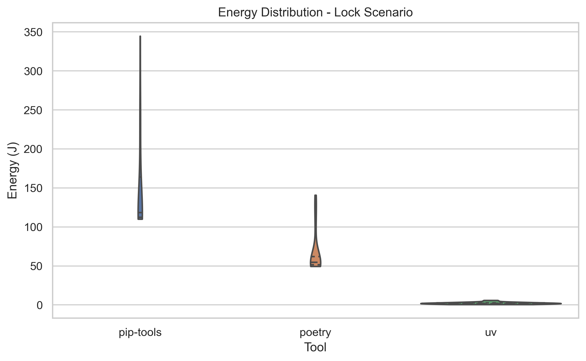
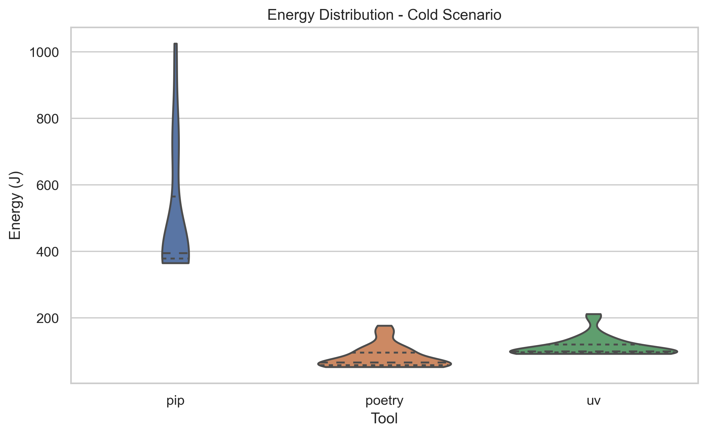
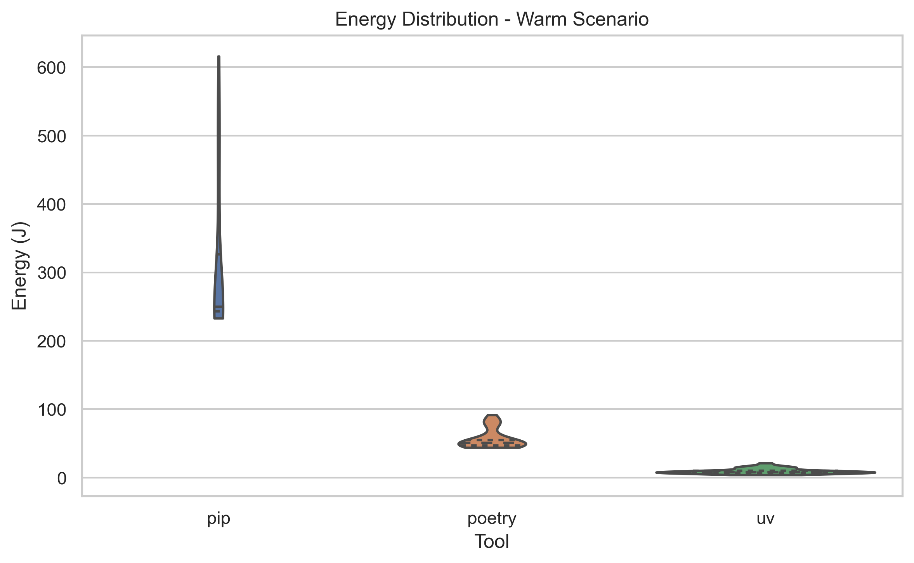
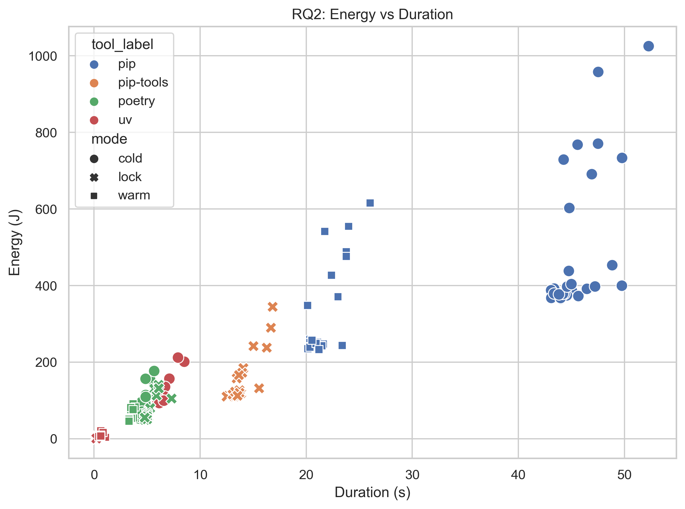

---
author: Calin Georgescu, Elia Jabbour, Wojciech Mundała, Daniel Rachev
group_number: 14
title: "Measuring the Energy Consumption of Python Package Managers: pip, uv, and poetry"
image: "img/g14_package_managers/project_cover.png"
date: 12/02/2026
summary: |-
  This article investigates the energy consumption of three Python package
  managers: pip, uv, and poetry. We run controlled experiments across common
  dependency management tasks and compare their energy usage, execution time,
  and consistency. The goal is to identify which tool is the most energy-efficient
  under realistic development workflows.
identifier: p1_measuring_software_2026 # Do not change this
all_projects_page: "../p1_measuring_software" # Do not change this
---

## 1. Introduction & Problem Definition

Python is the undisputed king of data science and backend development, powering everything from simple scripts to massive enterprise platforms. However, this popularity comes with a hidden cost: its fragmented packaging ecosystem. Every time a developer initializes a project, or a CI/CD pipeline triggers a build, dependencies must be resolved, downloaded, and installed.

While the *speed* of these package managers is a frequent topic of benchmarks, the *energy cost* of these millions of daily installations is rarely quantified. In the context of Green Software Engineering, optimizing these high-frequency, repetitive tasks can lead to massive aggregate energy savings.

In this experiment, we pit the industry standards against a new challenger to determine the most energy-efficient tool for Python dependency management.

### The Contenders
*   **`pip`**: The ubiquitous standard tool included with Python. It is widely compatible but historically slower in resolution.
*   **`poetry`**: A developer-favorite known for its deterministic dependency resolution and developer experience, written in pure Python.
*   **`uv`**: The new challenger written in Rust, claiming extreme performance and aggressive parallelization.[1]

### The Hypothesis
We hypothesize that **`uv`**, due to its compiled Rust architecture and efficient resource management (such as hardlinking), will consume significantly less energy than its Python-based counterparts (`pip`, `poetry`) across all scenarios.[2]

### Research Questions
To validate this, we define three specific research questions:
*   **RQ1 (Installation):** How does energy consumption differ between tools during a **cold install** (network-heavy) versus a **warm install** (disk-heavy)?
*   **RQ2 (Correlation):** Is there a correlation between execution time and energy consumption? (i.e., *Is faster always greener?*)
*   **RQ3 (Resolution):** Is there a significant energy difference in the pure **dependency resolution (locking)** phase between Rust-based `uv`, Python-based `poetry`, and `pip-tools`?

---

## 2. Background & Motivation

### Scale & Impact
The scale of Python's ecosystem is massive. The Python Package Index (PyPI) serves billions of requests per day. Consider a standard CI/CD pipeline: for every commit, a fresh virtual environment is often created, and dependencies are installed from scratch. If a tool can reduce the energy footprint of this process by even 10%, the aggregate savings across millions of daily runs would be substantial. This aligns directly with the principles of **Green Software Engineering**: reducing the carbon intensity of software at the source.[3]

### Developer Experience (DX) vs. Energy
Traditionally, developers optimize for "Time to Interactive." Waiting for dependencies to lock or install breaks the flow state.[4] However, speed and energy are not always perfectly correlated. A tool might consume more power (Watts) to finish a task faster, potentially resulting in the same total energy (Joules). Our goal is to determine if `uv`'s speed advantage translates into a "Green Win-Win" - improving the developer experience while simultaneously reducing environmental impact.

### The Mechanics: Locking vs. Installing
To understand energy consumption, we must distinguish between the two phases of package management:
1.  **Resolution (Locking):** A CPU-intensive mathematical puzzle. The tool must traverse the dependency graph to find a set of package versions that satisfy all constraints (e.g., Package A needs `numpy>1.20` but Package B needs `numpy<1.25`).
2.  **Installation:** An I/O-intensive process. The tool downloads files from the network, unpacks wheels, and moves files to the site-packages directory.
3.  **Caching:** Modern tools use local caches to avoid redownloading. Efficient caching strategies (like reflink/hardlinks) can drastically reduce disk I/O and energy usage.

---

## 3. Methodology

To ensure scientific rigor, we designed a controlled experiment following the guidelines for reliable energy measurements.

### 3.1 The Workload
To ensure our results are applicable to real-world scenarios, we avoided trivial "Hello World" dependencies. Instead, we utilized the dependency tree of **Apache Airflow**.

This workload was selected because:
1.  **Complexity:** It contains **3** direct dependencies and **154** total pinned packages (**151** transitive dependencies).
2.  **Stress Test:** This level of complexity is required to stress-test the resolution algorithms (locking) and generate a measurable energy footprint that distinguishes the tools from background OS noise.

### 3.2 The Scenarios
We measured three distinct scenarios to isolate different computing resources (CPU vs. Network vs. Disk).

**Scenario A: Dependency Resolution (Locking)**
*   **Goal:** Measure the solver efficiency of dependency resolution under stable (metadata-warm) conditions.
*   **Action:** For each repetition, we first executed one **unmeasured** lock command in a temporary workspace to prime metadata caches. We then measured a second lock command in a fresh temporary workspace using `poetry lock`, `uv lock`, and `pip-compile` (from `pip-tools`).

**Scenario B: Cold Install (Network + I/O)**
*   **Goal:** Simulate a fresh CI/CD pipeline run.
*   **Pre-condition:** Before every single run, we executed specific commands to **purge the local cache** (e.g., `pip cache purge`, `uv cache clean`).
*   **Action:** We measured the time and energy required to create a fresh virtual environment and install all dependencies from the internet.

**Scenario C: Warm Install (Disk I/O)**
*   **Goal:** Simulate local development or cached CI runners.
*   **Pre-condition:** The cache was fully populated, but the virtual environment was deleted.
*   **Action:** We measured the re-installation of dependencies using local artifacts.

### 3.3 Experimental Protocol
We adhered to a strict protocol to minimize confounding factors:

*   **Hardware:** All experiments were conducted on a **Apple MacBook Pro (14-inch, 2021) with M1 Pro chip and 16GB Unified Memory running macOS.**
*   **Measurement Tool:** We used **Energibridge**[5] to sample telemetry (including `SYSTEM_POWER (Watts)`, `Delta`, and `Time`). In the analysis, energy was computed by integrating system power over time (`SYSTEM_POWER x Delta`), yielding Joules.
*   **Sample Size:** We performed **30 repetitions** per tool, per scenario, to ensure statistical significance.
*   **Randomization:** The execution order was shuffled (e.g., `pip` → `uv` → `poetry` → `uv`...) to mitigate temporal biases such as thermal throttling or OS background tasks.
*   **Execution Command:** The full randomized benchmark suite was executed with:
    `./scripts/run_all.sh --runs 30 --interval 200 --cooldown 60 --pause 30 --seed 42 --python python3.14`
*   **Python Version:** All tools were restricted to use **Python 3.14** to ensure fairness.
*   **Zen Mode:**
    *   All non-essential applications were closed.
    *   Screen brightness was fixed at 0%.
    *   A **60-second cooldown** was enforced between runs, with an additional **30-second pause** when switching tool/mode combinations.

### 3.4 Statistical Analysis
Before hypothesis testing, we ran a Shapiro-Wilk normality check (`alpha = 0.05`) on energy distributions for each tool within each scenario. All tested groups were non-normal (all p-values < 0.05), including **Cold** (`pip`: 9.25e-07, `poetry`: 2.64e-05, `uv`: 7.24e-07), **Lock** (`pip-tools`: 7.74e-07, `poetry`: 1.69e-07, `uv`: 2.06e-02), and **Warm** (`pip`: 3.60e-07, `poetry`: 8.91e-06, `uv`: 6.99e-04).

Therefore, we used non-parametric inference: Kruskal-Wallis for omnibus comparisons, followed by pairwise two-sided Mann-Whitney U tests with Holm-Bonferroni correction and Cliff's delta for effect size.

Regarding outliers, we did **not** apply z-score outlier removal. We removed only invalid runs during data-quality checks (e.g., empty/failed runs) and kept all valid measurements for statistical analysis.

---

## 4. Results

We present our findings stratified by scenario to isolate the specific performance characteristics of each tool. All energy measurements are reported in Joules (J), computed by integrating sampled system power over elapsed time (`SYSTEM_POWER x Delta`). Execution time is reported in seconds (s).

### 4.1 Scenario A: Dependency Resolution (Locking)
This scenario measured dependency resolution of Apache Airflow under metadata-warm conditions (one unmeasured priming lock run before each measured run). Under this setup, locking is predominantly a CPU-bound task involving complex SAT-solving algorithms.

**Descriptive Statistics:**
*   **`uv`**: Mean Energy: **2.15 J** | Mean Time: **0.21 s**
*   **`poetry`**: Mean Energy: **66.65 J** | Mean Time: **5.15 s**
*   **`pip-tools`**: Mean Energy: **148.75 J** | Mean Time: **13.89 s**

**Statistical Analysis:**
The Kruskal-Wallis test indicated a significant difference between the groups (H ≈ 73.4, p < 0.001). Post-hoc Mann-Whitney U tests with Holm-Bonferroni correction confirmed that **`uv` is significantly more efficient than both `poetry` and `pip-tools`** (p < 0.001), with a large effect size (Cliff's δ = 1.0).

**Observation:**
The difference here is stark. `uv` completes the resolution task almost instantaneously, consuming **~30x less energy than `poetry`** and **~70x less energy than `pip-tools`**. This confirms that Rust's performance benefits in computational logic directly translate to massive energy savings.

---

### 4.2 Scenario B: Cold Install (Network + I/O)
This scenario simulates a fresh CI/CD environment where packages must be downloaded from the internet and installed. This involves Network, CPU (unpacking), and Disk I/O.

**Descriptive Statistics:**
*   **`poetry`**: Mean Energy: **81.95 J** | Mean Time: **4.60 s**
*   **`uv`**: Mean Energy: **113.18 J** | Mean Time: **6.41 s**
*   **`pip`**: Mean Energy: **494.83 J** | Mean Time: **45.60 s**

**Statistical Analysis:**
Surprisingly, while both modern tools vastly outperformed `pip`, **`poetry` was the most energy-efficient tool in this specific cold install benchmark**, beating `uv` by approximately 31 Joules on average. This difference was statistically significant (p < 0.001, Cliff's δ = -0.60). `pip` was the clear loser, consuming nearly **6x more energy** than `poetry`.

**Observation:**
This result contradicts the general narrative that "`uv` is always faster." In a network-bound scenario, the overhead of `uv`'s environment management or specific download strategy might have outweighed its parsing speed for this specific dependency tree. However, compared to the legacy `pip`, both tools represent a massive step forward in green software engineering.

---

### 4.3 Scenario C: Warm Install (Disk I/O)
This scenario simulates a local development environment where packages are cached. The tool only needs to link or copy files from the cache to the virtual environment.

**Descriptive Statistics:**
*   **`uv`**: Mean Energy: **9.56 J** | Mean Time: **0.61 s**
*   **`poetry`**: Mean Energy: **56.60 J** | Mean Time: **3.41 s**
*   **`pip`**: Mean Energy: **308.16 J** | Mean Time: **21.43 s**

**Statistical Analysis:**
`uv` reclaims the crown here with decisive margins. It is **~6x more efficient than `poetry`** and **~32x more efficient than `pip`**. The statistical tests confirm these differences are significant (p < 0.001, Cliff's δ = 1.0).

**Observation:**
The data here validates the efficiency of **hardlinks** (or reflinks). `uv` is likely not copying file content but simply creating pointers on the filesystem, an operation that costs negligible energy compared to `poetry` and `pip`'s file copying mechanisms.

---

### 4.4 RQ2: The Correlation Between Time and Energy
We plotted the execution duration against the total energy consumed for every single run across all scenarios to answer: *"Is faster always greener?"*

**Result:**
We calculated a Spearman correlation coefficient of **ρ = 0.96** (p ≈ 0).

**Observation:**
The correlation is extremely strong and positive. There are no outliers in the "High Power, Low Time" quadrant. This suggests that for package managers, optimizations that reduce execution time (like parallel downloads, faster resolving, or hardlinking) do not come at the cost of significantly higher power draw. **In this domain, optimizing for performance is optimizing for sustainability.**

---

## 5. Discussion

### 5.1 The "Rust Factor" in Locking (RQ3)
Our hypothesis that `uv`'s Rust architecture would dominate in CPU-bound tasks was strongly confirmed by the Locking results (Scenario A, measured after metadata-cache priming). Dependency resolution is a complex constraint satisfaction problem (SAT). Python, being an interpreted language with a Global Interpreter Lock (GIL), inherently struggles with the massive number of computations required to traverse the dependency graph of a project like Apache Airflow.

`uv`, leveraging Rust, completes this task in **0.21 seconds**. It is so fast that the energy consumption is barely distinguishable from the system idling. For developers who frequently update dependencies, switching to `uv` eliminates both the waiting time and the energy cost of the "resolving dependencies..." spinner.

### 5.2 The Cold Install Anomaly (RQ1)
The Cold Install results (Scenario B) provided a nuance to our hypothesis. While `uv` is marketed as the speed king, **`poetry` actually consumed 27% less energy** in our specific test setup.

Why? We propose several theories:
1.  **Overhead:** `uv` is an all-in-one tool that manages Python versions and environments itself. On a cold run, it might be performing initialization checks that `poetry` (which relies on an existing Python interpreter) skips.
2.  **Network Saturation:** In a cold install, the bottleneck is often the network bandwidth, not the CPU. If both tools saturate the network connection, the tool with the lighter metadata parsing or lower fixed overhead wins.
3.  **Workload Specificity:** The Apache Airflow dependency tree might simply be a "lucky" case for Poetry's specific resolver heuristics.

Regardless of the winner between `uv` and `poetry`, the real story is the **inefficiency of `pip`**. It consumed nearly **500 Joules** per run. Replacing `pip` with either modern tool in a CI/CD pipeline results in an energy reduction of **~80-83%**.

### 5.3 The Mechanics of Caching (RQ1)
The Warm Install (Scenario C) highlights the importance of **file system mechanics**. `uv`'s ability to perform an install in **0.6 seconds** (consuming < 10J) compared to `pip`'s 21 seconds (~300J) is a testament to the power of **hardlinks**.

Instead of physically copying megabytes of data from the cache to the virtual environment (a read/write intensive operation), `uv` instructs the filesystem to point two filenames to the same data on the disk. This creates a "Green Win-Win": the developer gets their environment instantly, and the disk controller consumes almost no power.

---

## 6. Threats to Validity

To ensure scientific integrity, we must acknowledge the limitations of our study:

*   **Network Volatility:** The "Cold Install" scenario relies on downloading files from PyPI. While we ran 30 repetitions to smooth out variances, fluctuations in internet speed or PyPI latency could affect the energy readings for `pip` and `uv` more than CPU-bound tasks.
*   **Locking Cache Priming:** Locking runs were measured after an unmeasured metadata-cache priming step. This improves stability and comparability, but it means our lock results do not represent first-ever cold-start locking on a fresh machine cache.
*   **Hardware Specificity:** Our experiments were conducted on an **Apple Silicon (M-series)** architecture. The efficiency of Rust binaries vs. Python interpretation might differ on x86_64 architectures (Intel/AMD).
*   **Project Bias:** We analyzed a single, highly complex project (Apache Airflow). While this stresses the resolver, results might differ for smaller, simpler projects where the overhead of the tool itself (start-up time) plays a larger role than the algorithm's efficiency.
*   **Power Metric:** Energy was derived from sampled system power (`SYSTEM_POWER x Delta`) provided by EnergiBridge. This is an indirect software-based measurement, not a direct hardware power probe.

---

## 7. Conclusion

In the quest for Green Software Engineering, optimizing the tools we use millions of times a day is a high-leverage activity. Our experiment pitted the Python ecosystem's standard (`pip`), the developer favorite (`poetry`), and the Rust-based challenger (`uv`) against each other.

**Key Takeaways:**
1.  **Abandon `pip` for CI/CD:** Using `pip` for fresh installs is an energy disaster. Switching to `poetry` or `uv` can reduce energy consumption by over **80%**.
2.  **`uv` is the King of Cache:** For local development and cached CI pipelines, `uv` is unmatched. Its use of hardlinks makes it **6x more efficient** than Poetry and **30x more efficient** than pip.
3.  **Faster is Greener:** We found a near-perfect correlation between execution time and energy. You do not need to choose between developer productivity and environmental sustainability.

**Final Recommendation:**
For the most energy-efficient development lifecycle, we recommend **`uv`**. Its slight deficit in our specific Cold Install benchmark is vastly outweighed by its dominance in Locking and Cached installations - the two tasks developers perform most frequently.

### Replication Package
To support open science and allow others to verify our findings, we have made our entire experimental suite available. You can find the automation scripts, the raw CSV data from Energibridge, and the Jupyter Notebook used for analysis in our repository:

[**Link to GitHub Repository**](https://github.com/Elia-J/python-package-manager-energy-benchmark)

---

## 8. References
[1] Marsh, C. (2024). "uv: Python packaging in Rust." Blog post.

[2] Pereira, R. et al. (2017). "Energy Efficiency across Programming Languages."

[3] Jagroep, E. et al. (2017). "Awakening Awareness on Energy Consumption in Software Engineering."

[4] Lammers, A. (2024). "Why uv is Changing Python Package Management."

[5] Sallou, J. et al. (2023). "EnergiBridge: Empowering Software Sustainability through Cross-Platform Energy Measurement."

