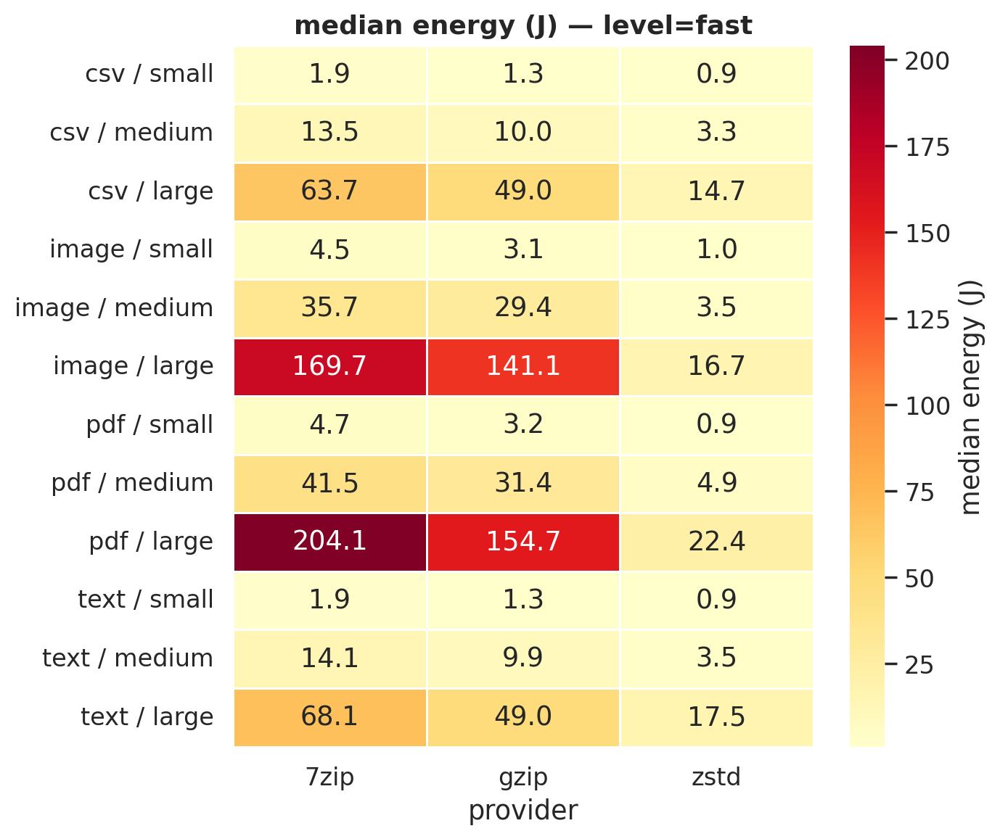
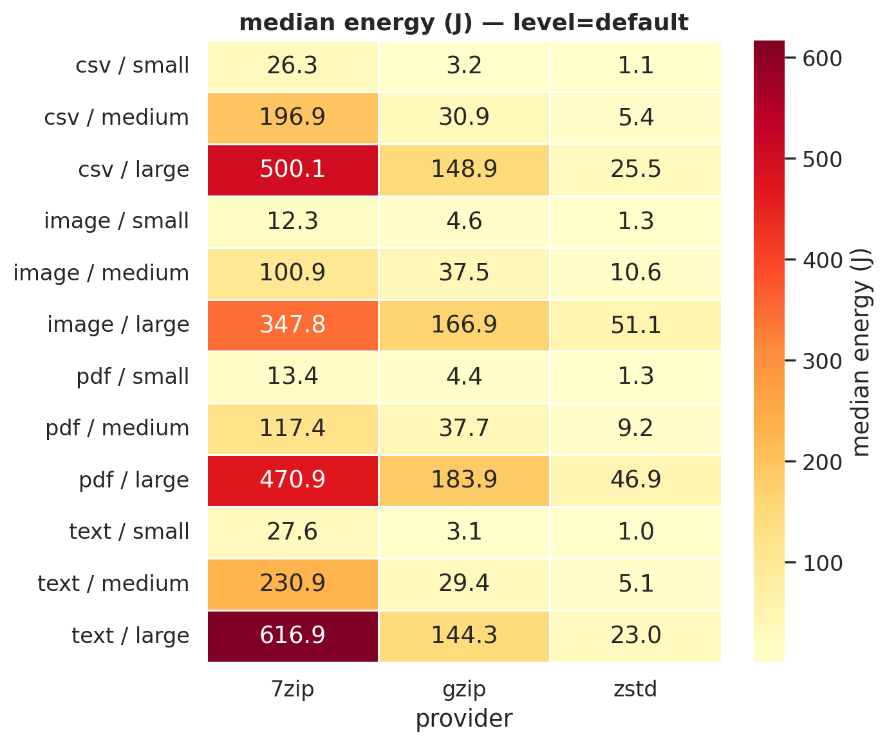
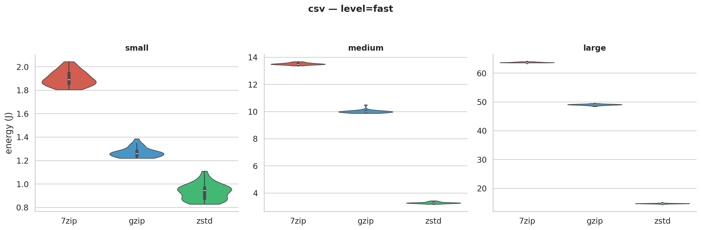
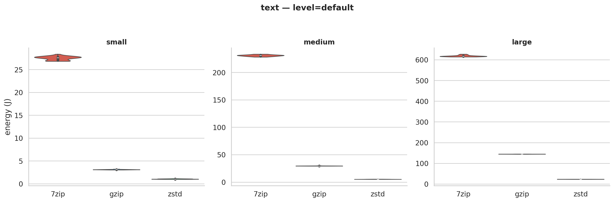
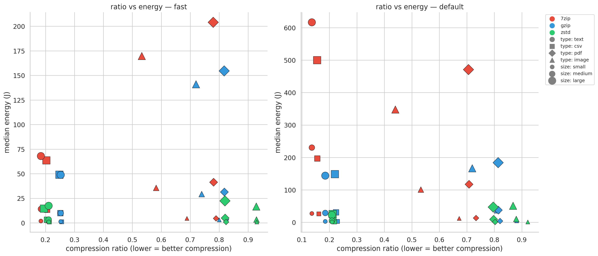
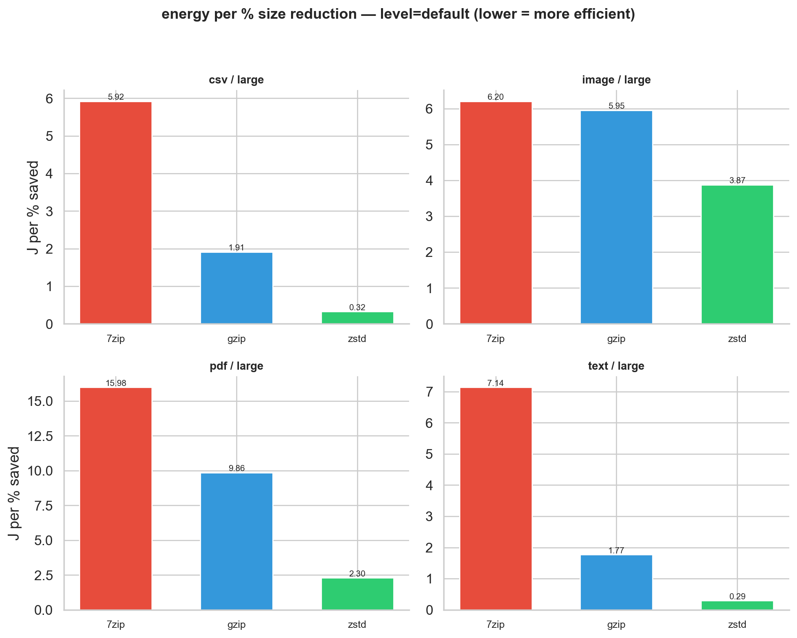
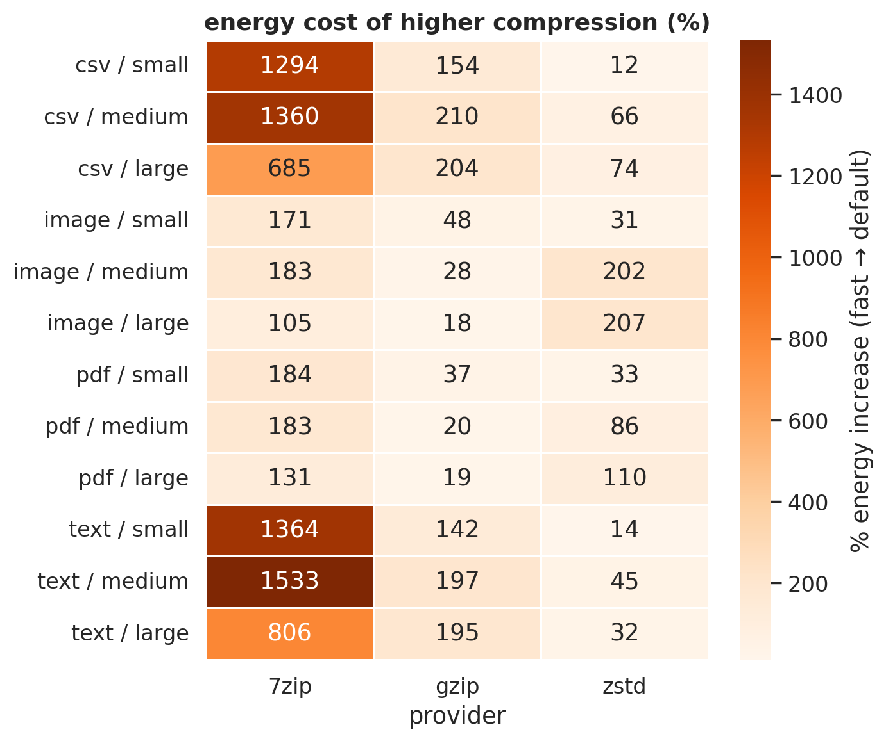
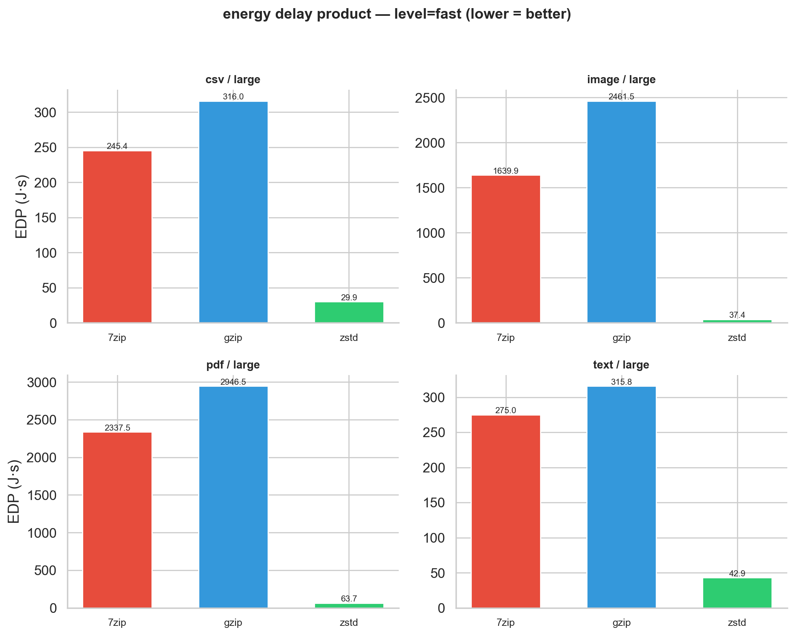
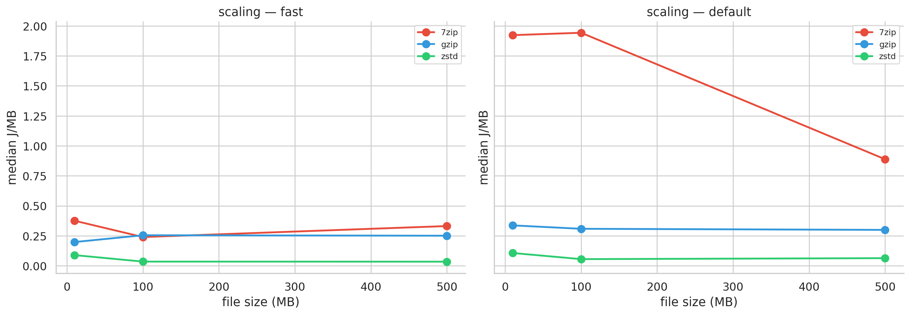

Every time a server rotates its logs, a CI pipeline bundles an artifact, or a cloud service packages data for transfer, some compression tool quietly burns through CPU cycles. On a single machine, nobody notices. But at the scale of thousands of servers running these jobs hourly, the choice of compression tool starts showing up on the electricity bill. We wanted to know: does that choice actually matter, and if so, when?

We pitted three widely-used tools against each other: 7-Zip (LZMA2), gzip (DEFLATE), and Zstandard (zstd), and measured the energy each consumed across a range of realistic workloads. The answer turned out to be more interesting than "tool X wins." It depends almost entirely on *what* you're compressing, and the reasons why reveal something fundamental about how these algorithms work.

All scripts, raw data, and analysis code are available in our [replication package](https://github.com/prajusth/SSE_P1). We've deliberately only included relavant graphs and results for readability's sake. The complete set of results and graphs can be found in the `results` directory in our [replication package](https://github.com/prajusth/SSE_P1).

## The setup

We needed test data that would represent the kinds of files compression tools encounter in practice. Rather than downloading arbitrary files (which would introduce uncontrollable variation), we generated synthetic test files deterministically from a fixed random seed:

- **Text (.log):** Simulated server logs with timestamps, log levels, module names, and templated messages. Lines like `[2025-04-12T09:31:22.481Z] [INFO ] [api       ] Request processed in 342ms` repeat structural patterns while varying details, making them highly compressible.
- **CSV (.csv):** Tabular datasets with IDs, timestamps, floating-point values, categorical labels, and description strings. The repeating column structure gives compression algorithms a lot to work with.
- **PDF (.pdf):** Built from raw PDF syntax with text content compressed internally via FlateDecode (zlib). Since the data inside is already compressed at creation time, external tools have very little redundancy left to exploit.
- **BMP (.bmp):** Uncompressed bitmap images with smooth color gradients plus random noise. Raw pixel data (BGR, 24-bit) with no internal compression, representing use cases like medical imaging or raw sensor data.

Each file type was generated at three target sizes: small (~10 MB), medium (~100 MB), and large (~500 MB). PDF files don't land exactly on these targets because PDF structure overhead (page objects, cross-reference tables, stream dictionaries) adds bulk beyond the content payload.

That gives us 4 file types × 3 sizes × 3 tools × 2 compression levels = 72 unique configurations. Each was repeated 30 times, producing **2,160 measured runs**. We also ran 5 warmup rounds per configuration (discarded before analysis), bringing the total to 2,520 runs.

| Tool | Algorithm | Fast flag | Default flag |
|------|-----------|-----------|-------------|
| 7-Zip | LZMA2 | `-mx=1` | `-mx=5` |
| gzip | DEFLATE | `-1` | `-6` |
| zstd | Zstandard | `-1` | `-3` |

All runs happened on the same machine (ASUS TUF Gaming A15, AMD Ryzen 7 4800H, 8 cores / 16 threads, 31 GB RAM, dual boot Linux) in controlled conditions: background processes killed, WiFi off, notifications silenced, screen brightness fixed at 60%. Energy was measured via Intel RAPL through EnergiBridge, capturing CPU package energy in joules. Before data collection, we ran a 5-minute CPU warmup (Fibonacci computation) to stabilize thermals. Between runs, a dynamic cooldown proportional to task duration kept residual heat from bleeding into the next measurement. Configuration order was shuffled each round to prevent ordering effects.

After collection, we removed 15 data points (out of 2,160) that fell beyond 3 standard deviations from their group mean. Shapiro-Wilk normality tests on each of the 72 groups: 55 passed (76%). For normal groups, we used Welch's t-test with Cohen's d; for non-normal groups, Mann-Whitney U with CLES. Every comparison turned out significant (p < 0.05), and the smallest effect size across all 108 tests was a Cohen's d of 14.6, meaning even the closest pair of tools produced distributions with zero overlap.

## The headline: zstd uses dramatically less energy

The first thing we wanted to understand was simply: which tool costs the most energy for a given job? The heatmaps below lay this out at a glance.

*Figure 1a: Median energy (J) at fast compression. zstd's column is consistently the palest.*

*Figure 1b: Default compression. 7-Zip's column turns dark red on text and CSV, spending 500-617 J where zstd spends 23-25 J.*

For large files at default compression:

| File type | 7-Zip | gzip | zstd |
|-----------|-------|------|------|
| CSV | 500.1 J | 148.9 J | 25.5 J |
| Text | 616.9 J | 144.3 J | 23.0 J |
| PDF | 470.9 J | 183.9 J | 46.9 J |
| Image | 347.8 J | 166.9 J | 51.1 J |

zstd uses 85-96% less energy than 7-Zip and 69-84% less than gzip. But a table of medians can hide a lot. Maybe zstd is inconsistent and the medians just happen to look good? The violin plots answer that. We generated one for every level × file type combination (8 total); here are two examples:

*Figure 2a: Energy distributions for CSV at fast compression. Each "violin" shows the full spread of 30 runs. The tools don't come close to overlapping.*

*Figure 2b: Text at default compression. Standard deviations are under 1% of the mean. The same pattern holds across all 8 violin plots.*

These tight distributions tell us the differences are fundamental to the algorithms, not measurement noise. zstd was designed for speed: simpler pattern matching that trades a bit of compression for much less CPU work. 7-Zip's LZMA2 searches harder, squeezing out more bytes at a much higher compute cost.

The scatter plot below shows all 72 configurations at once:

*Figure 3: Each dot is one configuration. zstd (green) clusters at the bottom. 7-Zip (red) spans the widest compression range but at steep cost. The question: is that extra compression worth paying for?*

## Does zstd actually compress well enough?

A tool that uses no energy and doesn't compress anything is useless. If zstd is just doing less work and getting worse results, the savings don't mean much. We need to check whether zstd's speed comes at the expense of actually compressing well. The compression ratio plots break this out per file type and size, we've included the ratios for the large files, the raios are comparable for other sizes.

*Figure 4a: Compression ratio at default level for the large files (lower = better). Text and CSV: all three tools cluster together. Images: they diverge dramatically.*

**Text and CSV** are where zstd's energy advantage really pays off. All three tools compress these well (ratios of 0.14-0.22 at default), separated by only 7 percentage points. The gap is small because text-like data plays to every algorithm's strengths. zstd finds most of the savings quickly; 7-Zip's deeper search hits diminishing returns.

**Images (BMP)** tell a completely different story. 7-Zip achieves 0.44 (cutting 56%), gzip manages 0.72 (28%), and zstd barely compresses at all: 0.87 (13%). This reflects a fundamental design difference. zstd and gzip use stream-oriented compression (LZ77 + entropy coding) optimized for sequential, text-like patterns. Raw binary pixel data doesn't match well against their sliding windows. 7-Zip's LZMA2 uses larger dictionary sizes and more sophisticated match-finding that detects structure in binary data the others miss. This is a known characteristic: developers on zstd's GitHub have discussed that binary numeric data falls outside the algorithm's design target (see [issue #3014](https://github.com/facebook/zstd/issues/3014)).

**PDFs** are the odd one out: nothing works well (0.71-0.81 across the board). Our PDFs are internally compressed with FlateDecode at generation time, leaving almost no redundancy for external tools. Every joule spent compressing a PDF is largely wasted.

## Energy per unit of useful compression

The findings above create a tension we need to resolve. zstd uses far less energy, but for some file types it doesn't compress well. 7-Zip uses far more energy, but sometimes that energy buys real results. Just comparing raw joules or raw compression ratios doesn't capture the trade-off. What we really want to know is: how much energy does each tool spend per unit of *useful* work? To answer that, we computed joules per percentage point of size reduced. A tool spending 50 J to save 50% costs 1 J/%; one spending 50 J to save 5% costs 10 J/%.

*Figure 5a: Energy per percent size reduction at fast level. Note the different y-axis scales across file types.*

For text and CSV at default/large, zstd spends 0.29-0.32 J/%, gzip 1.77-1.91 J/%, and 7-Zip 5.92-7.14 J/%. That makes zstd 6-25x more efficient on structured data.

But this metric has a blind spot. For images, zstd's cost per percent (3.87 J/%) is lower than 7-Zip's (6.20 J/%), yet zstd only saves 13% while 7-Zip saves 56%. Per-percent efficiency means little if you barely compress anything. No single metric tells the whole story, which is why we show multiple views.

## Is cranking up the compression level worth it?

Everything so far has compared tools against each other. But there's another knob to turn: each tool's internal compression level. When you switch from fast to default, you're asking the algorithm to try harder. The question is whether that extra effort pays off, or whether you're just burning electricity for diminishing returns.

*Figure 6: Energy increase (%) from fast to default. Each cell: "how much more does default cost?"*

7-Zip's default is catastrophically expensive on text: **1,533%** more energy than fast (text/medium), buying only a 4 percentage-point improvement in compression ratio (0.18 to 0.14). That's 15x the energy for marginal gain, the computational equivalent of driving a tank to the grocery store. zstd's default costs only 10-75% more for text and CSV. gzip sits in the middle at 142-210%.

## Speed matters too: Energy Delay Product

Energy alone misses something important. In production, a tool that uses moderate energy but ties up a CPU core for minutes is blocking other work. We need a metric that captures both dimensions. The Energy Delay Product (EDP = Energy × Time) does exactly that: it penalizes tools that are both slow and hungry, rewarding those that finish quickly and cheaply.

*Figure 7: EDP at fast level.*

EDP reveals a surprise: gzip has a *worse* EDP than 7-Zip at fast level. For large PDFs (fast), gzip's EDP is 2,947 J·s vs. 7-Zip's 2,338 J·s. gzip is slower on binary data and draws more energy doing it. We'd have missed this looking at energy alone. zstd's EDP is in a different league: 37-64 J·s for the same workloads.

## Bigger files are cheaper per byte

There's one more pattern worth highlighting because it has direct practical implications: energy per megabyte drops consistently as files grow. For 7-Zip on CSV (default), it costs 2.63 J/MB at 10 MB but only 1.00 J/MB at 500 MB. This makes intuitive sense. Compression algorithms pay a fixed cost to initialize (loading dictionaries, allocating buffers), and they build better internal models as they see more data.

*Figure 8: Energy per MB vs. file size. All tools get more efficient with larger inputs.*

Practical implication: batch small files into larger archives before compressing and you'll get more compression per joule.

## A note on statistical robustness

17 of 72 groups failed the Shapiro-Wilk normality test. We inspected each one:

*Figure 10: Histograms of all 17 non-normal groups with their W statistics, p-values, and skewness.*

Most of the 17 show right-skewed distributions: a tight main cluster with a tail stretching toward higher energy values. This is a common pattern in performance measurements, where occasional slowdowns (from background OS activity, cache effects, or minor thermal fluctuations) push individual runs to the right. A few groups show more distinctive shapes: `gzip/fast/csv/medium` (W=0.74) has a single far-right outlier pulling the whole distribution; `gzip/default/image/medium` (W=0.83) looks mildly bimodal, though the exact cause is unclear; and several of the small-file configurations (`zstd/fast/text/small`, `gzip/fast/text/small`, `gzip/fast/csv/small`) show wider spreads relative to their means, which makes sense since sub-second jobs are more sensitive to measurement overhead and OS scheduling jitter.

Two things give us confidence these don't undermine the results. First, the 17 failures are scattered across all three tools and all four file types with no systematic pattern. Second, for every comparison involving a non-normal group, we used Mann-Whitney U instead of Welch's t-test. With the smallest Cohen's d at 14.6 across all 108 comparisons, the distributions have zero overlap regardless of shape.

## What this means at scale

On a single machine, 25 vs. 500 J is invisible. But consider log rotation across 10,000 servers, compressing text hourly. The per-run difference between 7-Zip default (617 J) and zstd fast (17.5 J) is about 600 J. Across 240,000 daily runs: roughly 40 kWh/day, or 14.6 MWh/year, enough to power about 4 EU households.

The industry is already moving here. The Linux kernel uses zstd for module compression. Arch Linux switched from xz to zstd. HTTP/3 supports zstd natively. Our measurements confirm this trend makes good energy sense, at least for text-like workloads.

## What should you actually use?

**Text and tabular data (CSV, JSON, logs, code):** zstd at fast level. It compresses to within a few percentage points of gzip (0.19-0.21 vs. 0.22-0.25) while using 69-84% less energy. 7-Zip compresses slightly better (0.15-0.18) but at 4-20x the energy cost.

**Raw binary data (BMP, TIFF, raw sensor data):** 7-Zip earns its energy premium here. LZMA2 is the only algorithm we tested that meaningfully compresses raw image data (to 44-53% of original). Its dictionary-based approach finds structure that stream-oriented algorithms aren't designed to detect. If your images are already in a format like JPEG or PNG, external compression will achieve even less.

**PDFs and pre-compressed data:** Skip compression entirely. No tool broke past 0.71. The smartest move is file-type detection: check the file's header (the "magic bytes", like `%PDF-`) rather than trusting the extension, and don't waste cycles compressing it.

**On compression levels:** Avoid 7-Zip's default (685-1,533% more energy for marginal gain). zstd's fast vs. default barely matters. gzip default costs 2-3x on text.

## Threats to validity

Our experiment ran on a single machine (AMD Ryzen 7 4800H), so absolute numbers are hardware-specific; we expect relative rankings to hold. Synthetic test files have different entropy profiles than real-world data, especially PDFs. The experiment ran for approximately 12 hours in total (including cooldown periods between runs), making some thermal drift unavoidable despite our cooldown mechanisms. RAPL measures only CPU package energy, missing memory and disk I/O. Because zstd finishes so much faster, it allows these other components to return to a low-power idle state sooner (a pattern sometimes called "race to sleep"). This means zstd's true system-wide energy advantage is likely even larger than our CPU-only measurements suggest.

## Conclusion

"Which compression tool should I use?" is the wrong question. The right one is "what am I compressing?" For text-like workloads that dominate most software pipelines, zstd at fast level gives good compression at 85-96% less energy than 7-Zip and 69-84% less than gzip, with nearly the same output size. For raw binary data, 7-Zip's LZMA2 does work that simpler algorithms genuinely can't, and its energy premium buys meaningful compression. For anything already compressed, the most energy-efficient option is the simplest: don't compress it again.

Sometimes the greenest optimization isn't a smarter algorithm. It's just picking the right tool for the job, or deciding not to run the job at all.

